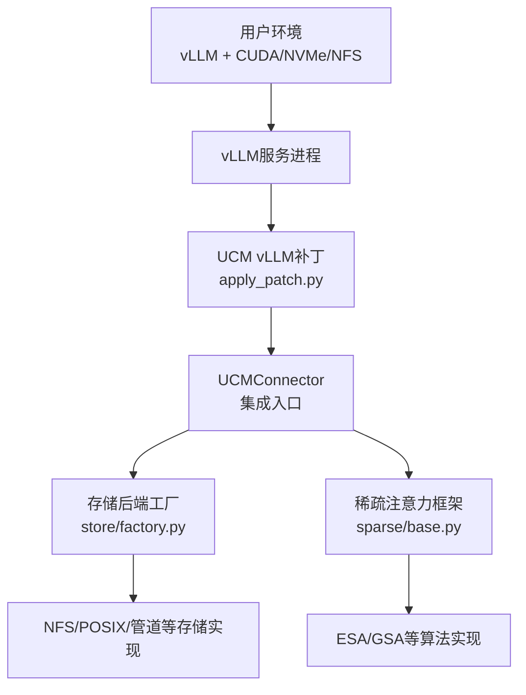
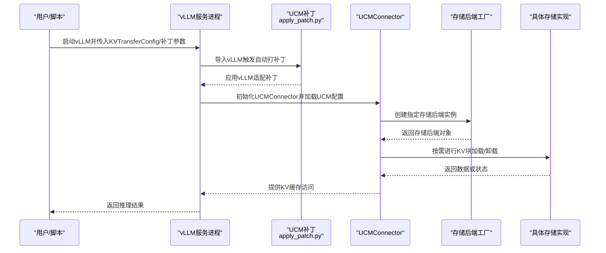
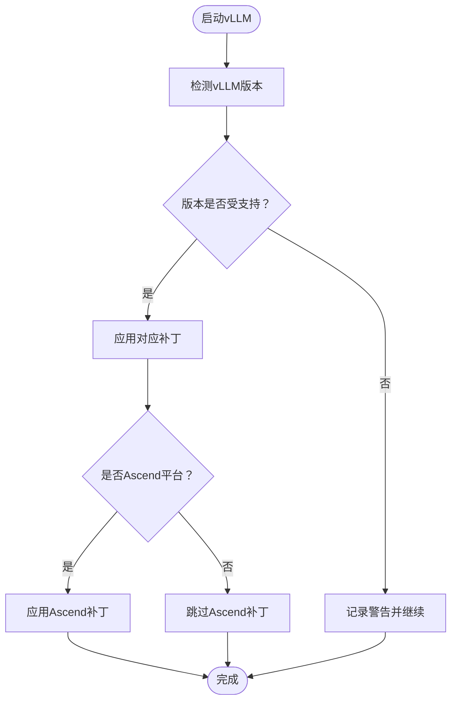
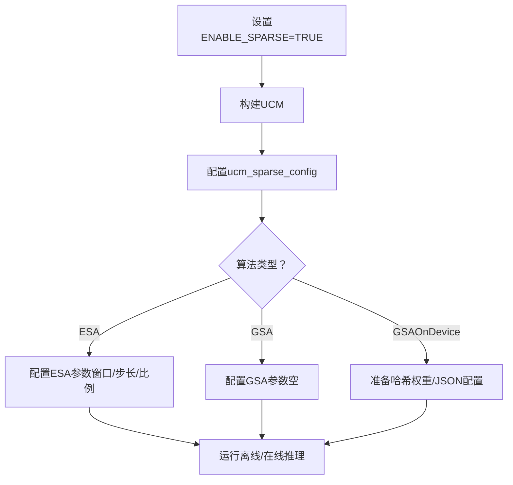
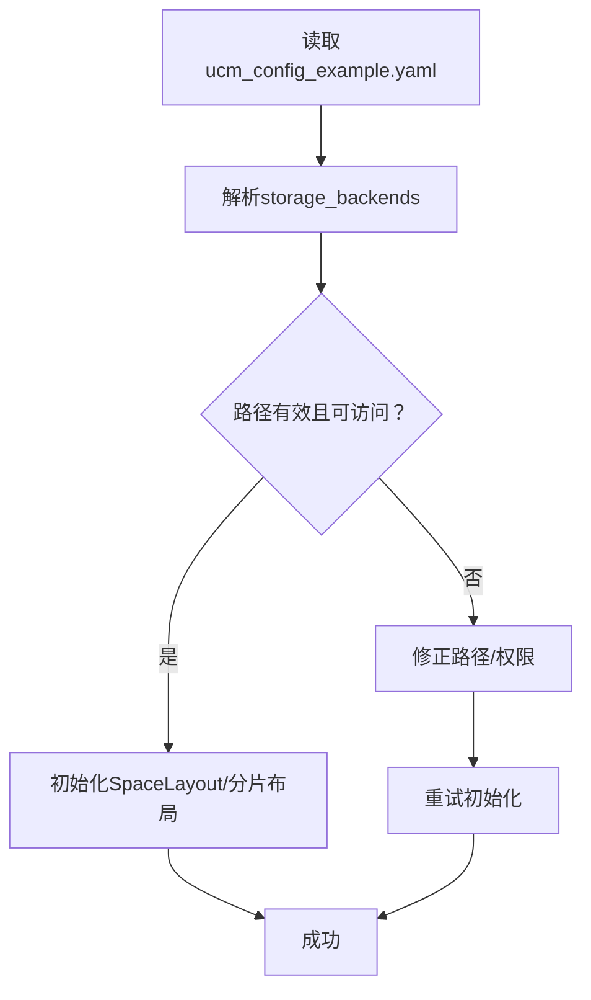
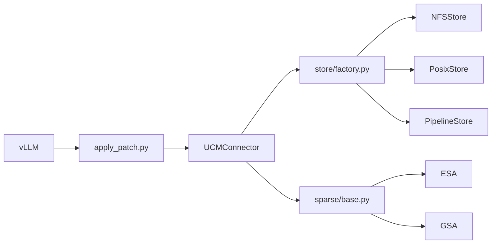

# 常见问题

<cite>
**本文引用的文件**
- [README.md](file://README.md)
- [docs/quickstart_vllm.md](file://docs/source/getting-started/quickstart_vllm.md)
- [docs/sparse-attention/index.md](file://docs/source/user-guide/sparse-attention/index.md)
- [docs/sparse-attention/esa.md](file://docs/source/user-guide/sparse-attention/esa.md)
- [docs/sparse-attention/gsa.md](file://docs/source/user-guide/sparse-attention/gsa.md)
- [docs/prefix-cache/index.md](file://docs/source/user-guide/prefix-cache/index.md)
- [examples/ucm_config_example.yaml](file://examples/ucm_config_example.yaml)
- [examples/deployments/scripts/vllm/run_vllm.sh](file://examples/deployments/scripts/vllm/run_vllm.sh)
- [examples/deployments/scripts/vllm/common.sh](file://examples/deployments/scripts/vllm/common.sh)
- [ucm/integration/vllm/patch/apply_patch.py](file://ucm/integration/vllm/patch/apply_patch.py)
- [ucm/store/factory.py](file://ucm/store/factory.py)
- [ucm/logger.py](file://ucm/logger.py)
- [ucm/sparse/base.py](file://ucm/sparse/base.py)
- [ucm/sparse/esa/esa.py](file://ucm/sparse/esa/esa.py)
- [ucm/sparse/gsa_on_device/gsa_on_device_config.py](file://ucm/sparse/gsa_on_device/gsa_on_device_config.py)
- [ucm/store/posix/cc/space_layout.cc](file://ucm/store/posix/cc/space_layout.cc)
- [ucm/store/nfsstore/cc/domain/space/space_shard_layout.cc](file://ucm/store/nfsstore/cc/domain/space/space_shard_layout.cc)
- [test/README.md](file://test/README.md)
</cite>

## 目录
1. [简介](#简介)
2. [项目结构](#项目结构)
3. [核心组件](#核心组件)
4. [架构总览](#架构总览)
5. [详细组件分析](#详细组件分析)
6. [依赖关系分析](#依赖关系分析)
7. [性能注意事项](#性能注意事项)
8. [故障排查指南](#故障排查指南)
9. [结论](#结论)
10. [附录](#附录)

## 简介
本FAQ面向UCM（Unified Cache Manager）的安装、配置与使用，聚焦以下典型问题：
- 环境依赖与版本兼容（尤其是vLLM）
- 配置文件路径与参数校验
- 存储后端（NFS/本地/管道等）挂载与权限
- vLLM集成补丁应用与自动打补丁机制
- 稀疏注意力算法（ESA/GSA等）启用与参数调优
- 日志定位与问题自检清单

本FAQ提供标准化的“问题描述—原因分析—解决步骤”，并给出常见错误信息示例与对应修复方案。

## 项目结构
UCM围绕“KV缓存持久化与按需加载”展开，支持前缀缓存与多种稀疏注意力策略，并通过vLLM补丁实现无侵入集成。关键目录与文件：
- 文档与快速开始：docs/source/getting-started/quickstart_vllm.md
- vLLM补丁与自动打补丁：ucm/integration/vllm/patch/*
- 存储后端工厂与实现：ucm/store/*
- 稀疏注意力框架与算法：ucm/sparse/*
- 示例配置与脚本：examples/ucm_config_example.yaml、examples/deployments/scripts/vllm/*

图示来源
- [docs/quickstart_vllm.md](file://docs/source/getting-started/quickstart_vllm.md#L1-L237)
- [ucm/integration/vllm/patch/apply_patch.py](file://ucm/integration/vllm/patch/apply_patch.py#L1-L192)
- [ucm/store/factory.py](file://ucm/store/factory.py#L1-L71)
- [ucm/sparse/base.py](file://ucm/sparse/base.py#L1-L323)

章节来源
- [README.md](file://README.md#L1-L93)
- [docs/quickstart_vllm.md](file://docs/source/getting-started/quickstart_vllm.md#L1-L237)

## 核心组件
- vLLM补丁与自动打补丁：检测vLLM版本并按版本应用相应补丁；支持Ascend平台条件补丁；支持ReRoPE路径。
- 存储后端工厂：注册并创建不同存储后端（如NFS、PCStore、MooncakeStore），统一KV传输接口。
- 稀疏注意力框架：定义调度侧/工作侧钩子，抽象出块估算、异步检索与加载等流程。
- 配置系统：示例配置文件ucm_config_example.yaml；运行脚本中通过KVTransferConfig或命令行传参注入UCM配置。

章节来源
- [ucm/integration/vllm/patch/apply_patch.py](file://ucm/integration/vllm/patch/apply_patch.py#L1-L192)
- [ucm/store/factory.py](file://ucm/store/factory.py#L1-L71)
- [ucm/sparse/base.py](file://ucm/sparse/base.py#L1-L323)
- [examples/ucm_config_example.yaml](file://examples/ucm_config_example.yaml#L1-L39)

## 架构总览
下图展示从vLLM到UCM再到存储后端的数据流与控制流。

图示来源
- [docs/quickstart_vllm.md](file://docs/source/getting-started/quickstart_vllm.md#L154-L237)
- [ucm/integration/vllm/patch/apply_patch.py](file://ucm/integration/vllm/patch/apply_patch.py#L84-L118)
- [ucm/store/factory.py](file://ucm/store/factory.py#L34-L71)

## 详细组件分析

### vLLM集成与补丁应用
- 问题现象
  - 启动vLLM时报错提示未应用补丁或版本不匹配
  - 在线API无法返回UCM日志或功能异常
- 可能原因
  - 未手动应用vLLM补丁或补丁版本不匹配
  - 自动打补丁失败（未导入vLLM或环境变量设置不当）
  - 平台变量PLATFORM未正确设置导致Ascend补丁未生效
- 解决步骤
  - 确认vLLM版本与UCM支持列表一致
  - 手动执行对应补丁命令，或确保自动打补丁逻辑可被触发
  - 如使用Ascend平台，设置平台变量并确认Ascend补丁已应用
  - 如启用ReRoPE，设置相关环境变量并选择对应补丁
- 常见错误示例
  - “vLLM版本xxx不在支持列表”
  - “自动打补丁失败：vLLM未安装”
  - “未应用vLLM适配补丁导致运行时异常”

图示来源
- [ucm/integration/vllm/patch/apply_patch.py](file://ucm/integration/vllm/patch/apply_patch.py#L59-L118)

章节来源
- [docs/quickstart_vllm.md](file://docs/source/getting-started/quickstart_vllm.md#L81-L132)
- [ucm/integration/vllm/patch/apply_patch.py](file://ucm/integration/vllm/patch/apply_patch.py#L1-L192)

### 稀疏注意力算法（ESA/GSA）
- 问题现象
  - 启用稀疏注意力后推理报错或性能未提升
  - 参数未生效或默认值导致资源占用异常
- 可能原因
  - 未设置启用稀疏的环境变量
  - 未在配置中启用ucm_sparse_config或字段缺失
  - GSAOnDevice需要额外环境变量或权重配置
- 解决步骤
  - 设置启用稀疏的环境变量并重新编译
  - 在配置中启用ucm_sparse_config并填写算法所需参数
  - 对于GSAOnDevice，检查权重形状校验与JSON配置文件
- 常见错误示例
  - “未设置ENABLE_SPARSE导致稀疏模块未编译”
  - “ucm_sparse_config格式不正确或字段缺失”
  - “GSAOnDevice权重形状不匹配”

图示来源
- [docs/quickstart_vllm.md](file://docs/source/getting-started/quickstart_vllm.md#L149-L153)
- [docs/sparse-attention/esa.md](file://docs/source/user-guide/sparse-attention/esa.md#L1-L74)
- [docs/sparse-attention/gsa.md](file://docs/source/user-guide/sparse-attention/gsa.md#L81-L148)
- [ucm/sparse/esa/esa.py](file://ucm/sparse/esa/esa.py#L430-L462)
- [ucm/sparse/gsa_on_device/gsa_on_device_config.py](file://ucm/sparse/gsa_on_device/gsa_on_device_config.py#L259-L278)

章节来源
- [docs/sparse-attention/index.md](file://docs/source/user-guide/sparse-attention/index.md#L1-L46)
- [docs/sparse-attention/esa.md](file://docs/source/user-guide/sparse-attention/esa.md#L1-L74)
- [docs/sparse-attention/gsa.md](file://docs/source/user-guide/sparse-attention/gsa.md#L81-L148)
- [ucm/sparse/base.py](file://ucm/sparse/base.py#L1-L323)

### 存储后端配置与权限
- 问题现象
  - 启动后提示找不到存储目录或IO错误
  - 多后端路径存在但部分不可访问
- 可能原因
  - 配置中的storage_backends路径不存在或权限不足
  - 多后端路径混杂导致部分路径无效
  - NFS/POSIX分片布局校验失败
- 解决步骤
  - 确认配置文件中storage_backends指向有效且可写路径
  - 为多后端路径逐一验证可访问性
  - 检查NFS/POSIX分片布局初始化与权限
- 常见错误示例
  - “添加存储后端失败：OS API错误”
  - “重复后端或无效路径导致Setup失败”
  - “NFS分片布局初始化失败”

图示来源
- [examples/ucm_config_example.yaml](file://examples/ucm_config_example.yaml#L10-L16)
- [ucm/store/posix/cc/space_layout.cc](file://ucm/store/posix/cc/space_layout.cc#L97-L147)
- [ucm/store/nfsstore/cc/domain/space/space_shard_layout.cc](file://ucm/store/nfsstore/cc/domain/space/space_shard_layout.cc#L130-L140)

章节来源
- [docs/prefix-cache/index.md](file://docs/source/user-guide/prefix-cache/index.md#L1-L85)
- [examples/ucm_config_example.yaml](file://examples/ucm_config_example.yaml#L1-L39)
- [ucm/store/factory.py](file://ucm/store/factory.py#L34-L71)

### 运行脚本与参数注入
- 问题现象
  - vLLM启动参数未生效或日志路径不正确
  - UCM配置未被识别
- 可能原因
  - KVTransferConfig未正确传入UCM配置文件路径
  - 脚本中UCM开关未开启或配置文件路径为空
- 解决步骤
  - 确保KVTransferConfig中包含UCM_CONFIG_FILE
  - 在脚本中设置ucm_enable与ucm_config_yaml_path
  - 检查日志输出目录与环境变量
- 常见错误示例
  - “ucm_enable=true但ucm_config_yaml_path未设置”
  - “--kv-transfer-config未包含UCM配置”

章节来源
- [examples/deployments/scripts/vllm/run_vllm.sh](file://examples/deployments/scripts/vllm/run_vllm.sh#L1-L116)
- [examples/deployments/scripts/vllm/common.sh](file://examples/deployments/scripts/vllm/common.sh#L40-L79)
- [docs/quickstart_vllm.md](file://docs/source/getting-started/quickstart_vllm.md#L154-L237)

## 依赖关系分析
- 组件耦合
  - vLLM补丁对vLLM版本强依赖，版本不匹配会导致补丁失败
  - 存储后端通过工厂模式解耦，新增后端只需注册即可
  - 稀疏注意力框架通过抽象类统一调度/工作侧接口
- 外部依赖
  - vLLM版本、CUDA/NVMe/NFS等硬件/网络环境
  - Python依赖与编译选项（如ENABLE_SPARSE）

图示来源
- [ucm/integration/vllm/patch/apply_patch.py](file://ucm/integration/vllm/patch/apply_patch.py#L84-L118)
- [ucm/store/factory.py](file://ucm/store/factory.py#L34-L71)
- [ucm/sparse/base.py](file://ucm/sparse/base.py#L127-L323)

章节来源
- [ucm/store/factory.py](file://ucm/store/factory.py#L1-L71)
- [ucm/integration/vllm/patch/apply_patch.py](file://ucm/integration/vllm/patch/apply_patch.py#L1-L192)

## 性能注意事项
- 前缀缓存适合带宽密集型场景，建议优先使用SSD或NFS
- 稀疏注意力通过异步检索与加载减少HBM占用，需合理设置块大小与传输并发
- 日志与指标采集建议开启，便于定位瓶颈

## 故障排查指南
- 环境与版本
  - 确认vLLM版本在支持列表内；若不在，需降级或等待适配
  - 若使用Ascend平台，设置平台变量并应用Ascend补丁
- 配置校验
  - 检查UCM配置文件路径是否正确传入KVTransferConfig
  - 确认ucm_connectors与ucm_sparse_config字段完整
- 存储后端
  - 使用示例配置文件校验storage_backends路径
  - 多后端路径逐一验证可访问性
- 日志定位
  - vLLM服务启动日志中查找UCM启动完成标识
  - 设置日志目录环境变量以便自定义日志路径
- 快速自检清单
  - vLLM版本与补丁是否匹配
  - ENABLE_SPARSE与相关算法参数是否设置
  - UCM_CONFIG_FILE路径是否存在
  - storage_backends可访问且权限正确
  - 日志目录可写且路径正确

章节来源
- [docs/quickstart_vllm.md](file://docs/source/getting-started/quickstart_vllm.md#L1-L237)
- [ucm/logger.py](file://ucm/logger.py#L1-L84)
- [test/README.md](file://test/README.md#L1-L236)

## 结论
通过规范的环境准备、正确的配置注入与存储后端校验，以及对vLLM补丁与稀疏注意力参数的准确设置，可显著降低UCM部署与使用中的问题发生率。建议在生产环境中开启日志与监控，并结合本文提供的自检清单与排障步骤进行例行巡检。

## 附录
- 常用环境变量
  - ENABLE_SPARSE：启用稀疏模块编译
  - PLATFORM：平台类型（如cuda/ascend）
  - VLLM_USE_REROPE：启用ReRoPE路径
  - UCM_LOG_PATH：自定义日志目录
- 关键配置项
  - ucm_connectors：存储后端名称与配置
  - ucm_sparse_config：稀疏注意力算法参数
  - use_layerwise/hit_ratio：可选层间加载与命中率

章节来源
- [docs/quickstart_vllm.md](file://docs/source/getting-started/quickstart_vllm.md#L149-L153)
- [examples/ucm_config_example.yaml](file://examples/ucm_config_example.yaml#L1-L39)