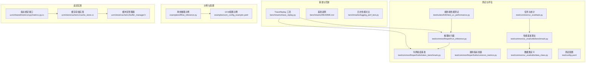
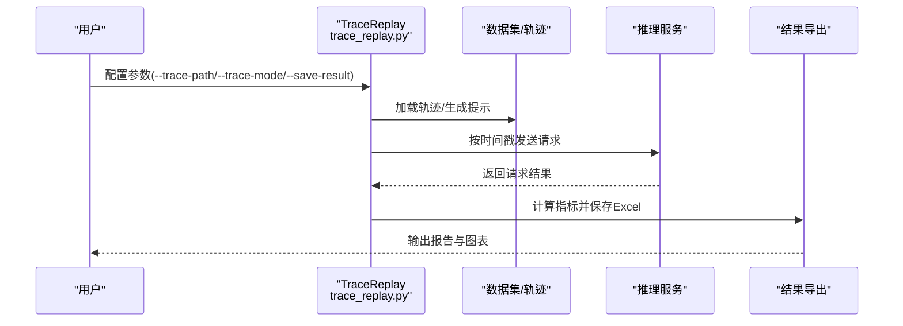
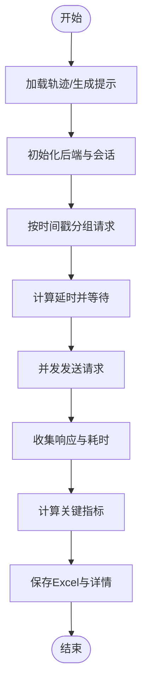
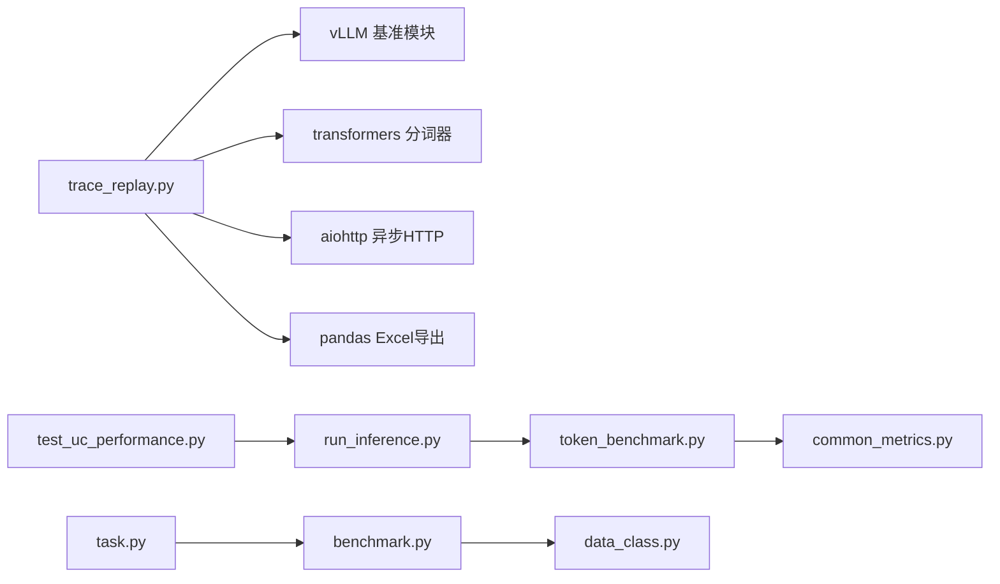

# 基准测试与性能评估

<cite>
**本文引用的文件**
- [benchmarks/README.md](file://benchmarks/README.md)
- [benchmarks/trace_replay.py](file://benchmarks/trace_replay.py)
- [benchmarks/logging_perf_test.py](file://benchmarks/logging_perf_test.py)
- [test/suites/E2E/test_uc_performance.py](file://test/suites/E2E/test_uc_performance.py)
- [test/common/llmperf/run_inference.py](file://test/common/llmperf/run_inference.py)
- [test/common/llmperf/utils/token_benchmark.py](file://test/common/llmperf/utils/token_benchmark.py)
- [test/common/llmperf/utils/common_metrics.py](file://test/common/llmperf/utils/common_metrics.py)
- [test/common/uc_eval/task.py](file://test/common/uc_eval/task.py)
- [test/common/uc_eval/utils/benchmark.py](file://test/common/uc_eval/utils/benchmark.py)
- [test/common/uc_eval/utils/data_class.py](file://test/common/uc_eval/utils/data_class.py)
- [test/config.yaml](file://test/config.yaml)
- [examples/offline_inference.py](file://examples/offline_inference.py)
- [examples/ucm_config_example.yaml](file://examples/ucm_config_example.yaml)
- [ucm/store/cache/cc/cache_store.cc](file://ucm/store/cache/cc/cache_store.cc)
- [ucm/store/cache/cc/buffer_manager.h](file://ucm/store/cache/cc/buffer_manager.h)
- [ucm/shared/metrics/cpy/metrics.py.cc](file://ucm/shared/metrics/cpy/metrics.py.cc)
</cite>

## 目录
1. [简介](#简介)
2. [项目结构](#项目结构)
3. [核心组件](#核心组件)
4. [架构总览](#架构总览)
5. [详细组件分析](#详细组件分析)
6. [依赖关系分析](#依赖关系分析)
7. [性能考量](#性能考量)
8. [故障排查指南](#故障排查指南)
9. [结论](#结论)
10. [附录](#附录)

## 简介
本指南围绕统一缓存管理（UCM）项目的性能基准测试与评估，系统讲解TraceReplay工具的使用方法与参数配置，涵盖请求轨迹回放、性能指标计算与结果分析；解释关键性能指标（TTFT、TPOT、ITL、吞吐量等）的含义与计算方式；提供测试环境搭建、数据集选择与测试场景设计的最佳实践；介绍性能回归测试与持续性能监控的方法，以及性能瓶颈分析与优化建议。

## 项目结构
本项目在“benchmarks”目录提供基于真实请求轨迹的回放工具，在“test”目录提供多套端到端性能测试与评估方案，并在“examples”提供离线推理示例与UCM配置样例；底层存储与缓存实现位于“ucm/store”和“ucm/shared”。

图示来源
- [benchmarks/trace_replay.py](file://benchmarks/trace_replay.py#L1-L748)
- [benchmarks/README.md](file://benchmarks/README.md#L1-L129)
- [benchmarks/logging_perf_test.py](file://benchmarks/logging_perf_test.py#L1-L181)
- [test/suites/E2E/test_uc_performance.py](file://test/suites/E2E/test_uc_performance.py#L1-L186)
- [test/common/llmperf/run_inference.py](file://test/common/llmperf/run_inference.py#L1-L186)
- [test/common/llmperf/utils/token_benchmark.py](file://test/common/llmperf/utils/token_benchmark.py#L1-L387)
- [test/common/llmperf/utils/common_metrics.py](file://test/common/llmperf/utils/common_metrics.py#L1-L18)
- [test/common/uc_eval/task.py](file://test/common/uc_eval/task.py#L1-L410)
- [test/common/uc_eval/utils/benchmark.py](file://test/common/uc_eval/utils/benchmark.py#L1-L277)
- [test/common/uc_eval/utils/data_class.py](file://test/common/uc_eval/utils/data_class.py#L1-L168)
- [test/config.yaml](file://test/config.yaml#L1-L48)
- [examples/offline_inference.py](file://examples/offline_inference.py#L1-L112)
- [examples/ucm_config_example.yaml](file://examples/ucm_config_example.yaml#L1-L39)
- [ucm/store/cache/cc/cache_store.cc](file://ucm/store/cache/cc/cache_store.cc#L118-L151)
- [ucm/store/cache/cc/buffer_manager.h](file://ucm/store/cache/cc/buffer_manager.h#L62-L127)
- [ucm/shared/metrics/cpy/metrics.py.cc](file://ucm/shared/metrics/cpy/metrics.py.cc#L1-L33)

章节来源
- [benchmarks/README.md](file://benchmarks/README.md#L1-L129)
- [benchmarks/trace_replay.py](file://benchmarks/trace_replay.py#L1-L748)
- [test/suites/E2E/test_uc_performance.py](file://test/suites/E2E/test_uc_performance.py#L1-L186)

## 核心组件
- TraceReplay工具：基于真实请求轨迹或动态数据集生成请求，严格按时间戳回放，计算并导出关键性能指标（TTFT、TPOT、ITL、E2EL、吞吐量等），支持保存Excel结果。
- 日志性能对比：对比Python日志与pybind11 spdlog日志的性能差异，辅助评估日志开销。
- 端到端性能测试：通过参数化场景（输入长度、并发、命中率等）驱动推理执行器，产出平均/分位延迟、吞吐量等指标。
- 令牌粒度基准：以线程池并发提交请求，统计各请求的TTFT、ITL、E2EL、输出吞吐等，汇总均值、分位、标准差等。
- 任务与统计：封装合成/多轮对话/文档问答等场景的任务流程，输出整体与单案例性能统计。
- 缓存与存储：底层缓存查找、前缀查找与传输队列等实现，为性能评估提供基础能力。

章节来源
- [benchmarks/trace_replay.py](file://benchmarks/trace_replay.py#L51-L198)
- [benchmarks/logging_perf_test.py](file://benchmarks/logging_perf_test.py#L1-L181)
- [test/suites/E2E/test_uc_performance.py](file://test/suites/E2E/test_uc_performance.py#L1-L186)
- [test/common/llmperf/utils/token_benchmark.py](file://test/common/llmperf/utils/token_benchmark.py#L25-L156)
- [test/common/uc_eval/task.py](file://test/common/uc_eval/task.py#L94-L226)

## 架构总览
TraceReplay与端到端测试共同构成性能评估闭环：前者侧重真实轨迹回放与指标导出，后者侧重可重复、可扩展的参数化场景与稳定态采样。

图示来源
- [benchmarks/trace_replay.py](file://benchmarks/trace_replay.py#L462-L681)
- [benchmarks/README.md](file://benchmarks/README.md#L1-L129)

## 详细组件分析

### TraceReplay 工具
- 轨迹加载与提示生成
  - 支持从JSONL轨迹文件读取请求记录，按时间戳分组；支持基于hash_ids与目标长度生成确定性提示文本。
  - 支持两种模式：trace模式（从缓存轨迹文件回放）、benchmark模式（基于vLLM基准模块动态生成）。
- 请求回放与并发控制
  - 通过异步会话与信号量控制最大并发；按时间戳精确延时，模拟真实流量。
- 指标计算与导出
  - 计算请求吞吐、输出吞吐、总吞吐、TTFT、TPOT、ITL、E2EL的均值、中位数、标准差与分位数；保存至Excel。

图示来源
- [benchmarks/trace_replay.py](file://benchmarks/trace_replay.py#L462-L681)
- [benchmarks/README.md](file://benchmarks/README.md#L25-L40)

章节来源
- [benchmarks/trace_replay.py](file://benchmarks/trace_replay.py#L51-L198)
- [benchmarks/trace_replay.py](file://benchmarks/trace_replay.py#L462-L681)
- [benchmarks/README.md](file://benchmarks/README.md#L1-L129)

### 日志性能对比
- 对比Python日志与pybind11 spdlog日志在不同线程下的调用耗时，给出每调用的纳秒级差异与百分比开销，便于评估日志对性能的影响。

章节来源
- [benchmarks/logging_perf_test.py](file://benchmarks/logging_perf_test.py#L1-L181)

### 端到端性能测试
- 参数化场景：输入/输出长度、并发数、命中率等。
- 执行流程：重置预填充缓存、按命中率分阶段执行（预热+正式）、汇总指标。
- 指标提取：从结果中抽取TTFT、TPOT、E2EL均值与分位，以及吞吐、请求数等。

章节来源
- [test/suites/E2E/test_uc_performance.py](file://test/suites/E2E/test_uc_performance.py#L1-L186)
- [test/common/llmperf/run_inference.py](file://test/common/llmperf/run_inference.py#L1-L186)

### 令牌粒度基准
- 并发线程池提交请求，统计每个请求的TTFT、ITL、E2EL、输出吞吐等；汇总均值、分位、标准差与错误率。
- 提供总体输出吞吐与每请求吞吐的计算逻辑。

章节来源
- [test/common/llmperf/utils/token_benchmark.py](file://test/common/llmperf/utils/token_benchmark.py#L25-L156)
- [test/common/llmperf/utils/token_benchmark.py](file://test/common/llmperf/utils/token_benchmark.py#L190-L286)

### 任务与统计
- 封装合成/多轮对话/文档问答等场景，统一处理数据准备、并发请求、结果统计与Excel导出。
- 性能基准算法：支持稳定态采样（稳定期窗口内请求）与普通采样，计算E2E总时延、输出吞吐、TTFT/解码ITL的P50/P90/P99与均值、最大值等。

章节来源
- [test/common/uc_eval/task.py](file://test/common/uc_eval/task.py#L94-L226)
- [test/common/uc_eval/utils/benchmark.py](file://test/common/uc_eval/utils/benchmark.py#L91-L277)
- [test/common/uc_eval/utils/data_class.py](file://test/common/uc_eval/utils/data_class.py#L131-L168)

### 关键性能指标与计算方法
- TTFT（首次令牌时间）
  - 定义：从请求开始到收到第一个输出令牌的时间。
  - 计算：由令牌粒度基准或端到端统计直接获得，亦可在TraceReplay中按请求维度计算并汇总。
- TPOT（每输出令牌时间，不含首令牌）
  - 定义：除首令牌外，后续每个令牌的平均耗时。
  - 计算：(E2E总时延 - TTFT) / (输出令牌数 - 1)。
- ITL（令牌间间隔）
  - 定义：相邻两个输出令牌之间的平均时间。
  - 计算：由令牌粒度基准对相邻令牌时间求均值得到。
- 吞吐量
  - 请求吞吐：完成的请求数 / 测试总时长。
  - 输出令牌吞吐：总生成令牌数 / 测试总时长。
  - 总吞吐：(输入令牌数 + 输出令牌数) / 测试总时长。
- E2E（端到端时延）
  - 定义：从请求开始到收到最后一个令牌的时间。
  - 统计：TraceReplay与令牌粒度基准均提供均值、分位与标准差。

章节来源
- [test/common/llmperf/utils/token_benchmark.py](file://test/common/llmperf/utils/token_benchmark.py#L112-L127)
- [test/common/llmperf/utils/token_benchmark.py](file://test/common/llmperf/utils/token_benchmark.py#L158-L187)
- [benchmarks/trace_replay.py](file://benchmarks/trace_replay.py#L369-L430)
- [test/common/uc_eval/utils/benchmark.py](file://test/common/uc_eval/utils/benchmark.py#L124-L202)

### TraceReplay 使用与参数配置
- 必要参数
  - --backend：后端类型（如vLLM）。
  - --model：模型路径或名称。
  - --host/--port 或 --base-url：推理服务地址。
  - --trace-path：轨迹文件路径（JSONL）。
  - --trace-mode：trace（回放轨迹）或 benchmark（动态生成）。
  - --dataset-name：当使用benchmark模式时需指定数据集名称。
  - --save-result/--result-dir：是否保存结果及保存目录。
  - --save-prompts：是否保存生成的提示以便复用。
- 运行步骤
  - 下载并准备轨迹文件；设置BENCHMARK_PATH指向vLLM基准模块；执行脚本进行回放与指标导出。

章节来源
- [benchmarks/README.md](file://benchmarks/README.md#L25-L40)
- [benchmarks/README.md](file://benchmarks/README.md#L42-L80)
- [benchmarks/trace_replay.py](file://benchmarks/trace_replay.py#L684-L707)

### 最佳实践
- 测试环境
  - 使用稳定的推理服务（vLLM等），确保网络与资源隔离；在GPU/CPU/NPU环境下分别验证。
  - 在容器或Docker中固定依赖版本，避免JIT/编译器差异影响。
- 数据集与轨迹
  - 优先使用真实在线轨迹（Mooncake）以贴近生产负载；必要时结合合成数据覆盖极端场景。
  - 对于benchmark模式，选择与业务相近的数据集（如ShareGPT、Sonnet等）。
- 场景设计
  - 输入/输出长度：覆盖短/中/长提示与生成长度。
  - 并发：从低并发逐步提升，观察稳定态与峰值表现。
  - 命中率：通过预填充缓存模拟不同命中率，评估缓存策略效果。
- 结果分析
  - 关注P50/P90/P99分位与时延分布；同时关注吞吐量与错误率。
  - 对比不同配置（如启用前缀缓存、不同稀疏注意力策略）的差异。

章节来源
- [test/suites/E2E/test_uc_performance.py](file://test/suites/E2E/test_uc_performance.py#L15-L29)
- [test/common/llmperf/run_inference.py](file://test/common/llmperf/run_inference.py#L57-L127)
- [benchmarks/README.md](file://benchmarks/README.md#L1-L129)

### 性能回归测试与持续监控
- 回归测试
  - 使用pytest参数化构建多场景用例，自动采集指标并断言关键阈值。
  - 将结果写入报告与数据库，便于历史对比。
- 持续监控
  - 通过指标绑定接口暴露UCM内部指标，接入Grafana/Prometheus进行可视化与告警。
  - 在CI中定期运行端到端与TraceReplay测试，形成基线与回归报告。

章节来源
- [test/suites/E2E/test_uc_performance.py](file://test/suites/E2E/test_uc_performance.py#L1-L186)
- [ucm/shared/metrics/cpy/metrics.py.cc](file://ucm/shared/metrics/cpy/metrics.py.cc#L1-L33)
- [examples/ucm_config_example.yaml](file://examples/ucm_config_example.yaml#L17-L18)

### 底层缓存与存储性能
- 缓存查找与前缀查找
  - 缓冲区存在性检查与后端查找分离，减少不必要的后端访问；前缀查找返回首个不匹配位置，便于快速定位。
- 传输与队列
  - 传输队列深度、超时等参数影响整体延迟与吞吐；合理配置可降低尾延迟。

章节来源
- [ucm/store/cache/cc/buffer_manager.h](file://ucm/store/cache/cc/buffer_manager.h#L62-L127)
- [ucm/store/cache/cc/cache_store.cc](file://ucm/store/cache/cc/cache_store.cc#L118-L151)

## 依赖关系分析

图示来源
- [benchmarks/trace_replay.py](file://benchmarks/trace_replay.py#L1-L748)
- [test/suites/E2E/test_uc_performance.py](file://test/suites/E2E/test_uc_performance.py#L1-L186)
- [test/common/llmperf/run_inference.py](file://test/common/llmperf/run_inference.py#L1-L186)
- [test/common/llmperf/utils/token_benchmark.py](file://test/common/llmperf/utils/token_benchmark.py#L1-L387)
- [test/common/uc_eval/task.py](file://test/common/uc_eval/task.py#L1-L410)
- [test/common/uc_eval/utils/benchmark.py](file://test/common/uc_eval/utils/benchmark.py#L1-L277)

章节来源
- [benchmarks/trace_replay.py](file://benchmarks/trace_replay.py#L1-L748)
- [test/common/llmperf/utils/token_benchmark.py](file://test/common/llmperf/utils/token_benchmark.py#L1-L387)

## 性能考量
- 并发与限流
  - 合理设置最大并发与会话超时，避免过载导致尾延迟飙升。
- 缓存命中与预填充
  - 通过预填充缓存提高命中率，显著降低TTFT与ITL；注意区分预热与正式阶段。
- I/O与存储
  - 缓存查找与前缀查找的命中路径越短，整体时延越低；传输队列深度与超时需与工作负载匹配。
- 指标稳定性
  - 使用稳定态采样剔除启动与预热噪声，更准确反映系统性能。

[本节为通用指导，无需特定文件引用]

## 故障排查指南
- TraceReplay初始测试失败
  - 检查后端、主机与端口配置；确认服务可达；查看错误信息。
- Excel导出缺失
  - 确认已安装openpyxl；检查结果目录权限与路径。
- 日志开销过高
  - 使用日志性能对比脚本评估日志成本；在生产环境适当降低日志级别或切换到更快的日志实现。
- 端到端测试异常
  - 检查测试配置（server_url、tokenizer_path、超时等）；确认数据库/报告目录可用。

章节来源
- [benchmarks/trace_replay.py](file://benchmarks/trace_replay.py#L514-L520)
- [benchmarks/trace_replay.py](file://benchmarks/trace_replay.py#L737-L743)
- [benchmarks/logging_perf_test.py](file://benchmarks/logging_perf_test.py#L1-L181)
- [test/config.yaml](file://test/config.yaml#L1-L48)

## 结论
通过TraceReplay与端到端测试相结合，可以全面评估UCM在不同场景下的性能表现。建议在稳定态下采集分位指标与吞吐量，结合缓存命中率与稀疏注意力策略进行对比分析，并将测试纳入CI以实现持续性能监控与回归预警。

[本节为总结，无需特定文件引用]

## 附录

### 示例：离线推理与UCM配置
- 离线推理示例展示了如何在vLLM中集成UCM连接器，配置KV传输与前缀缓存等参数。
- UCM配置示例展示了如何指定存储后端、启用指标监控与稀疏注意力配置。

章节来源
- [examples/offline_inference.py](file://examples/offline_inference.py#L1-L112)
- [examples/ucm_config_example.yaml](file://examples/ucm_config_example.yaml#L1-L39)