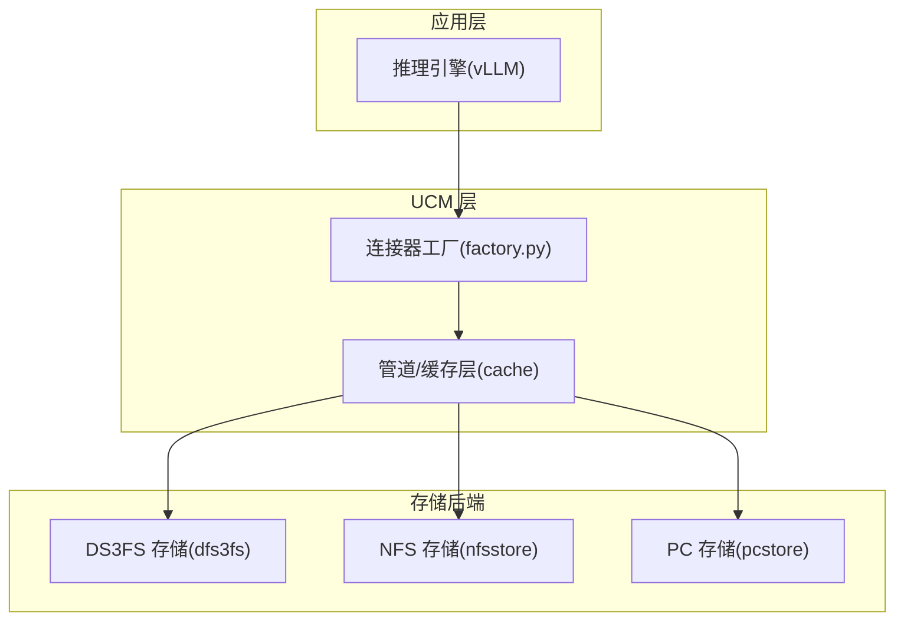
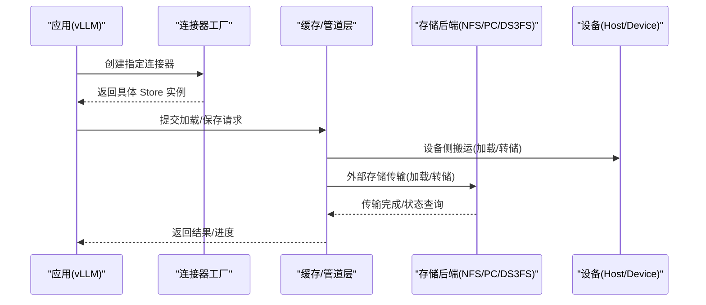
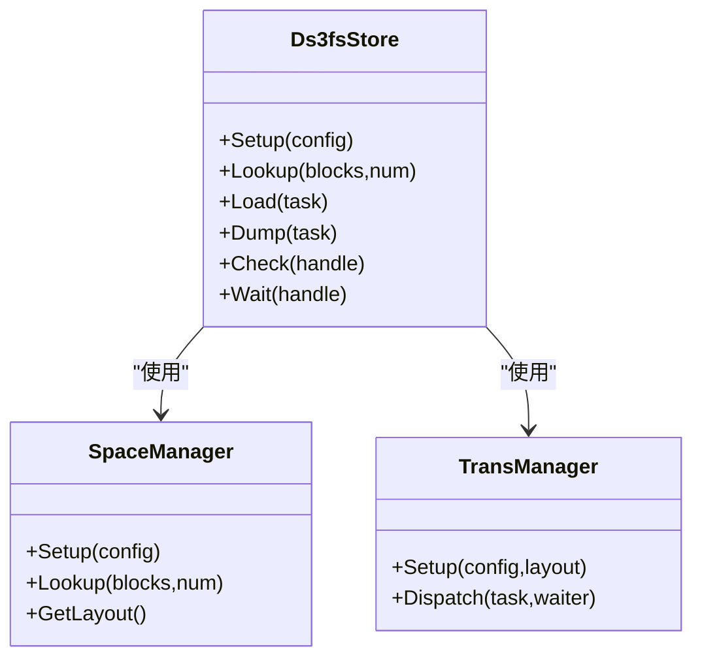
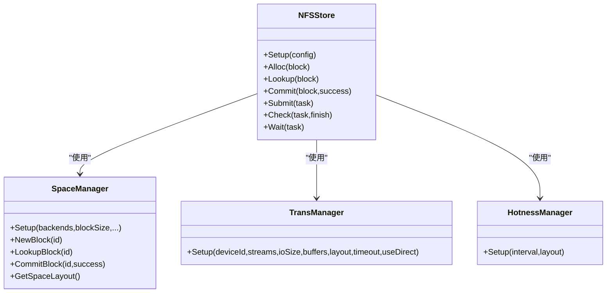
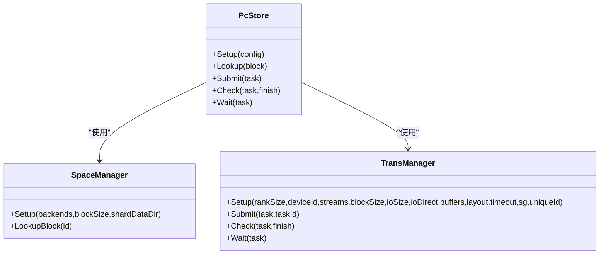
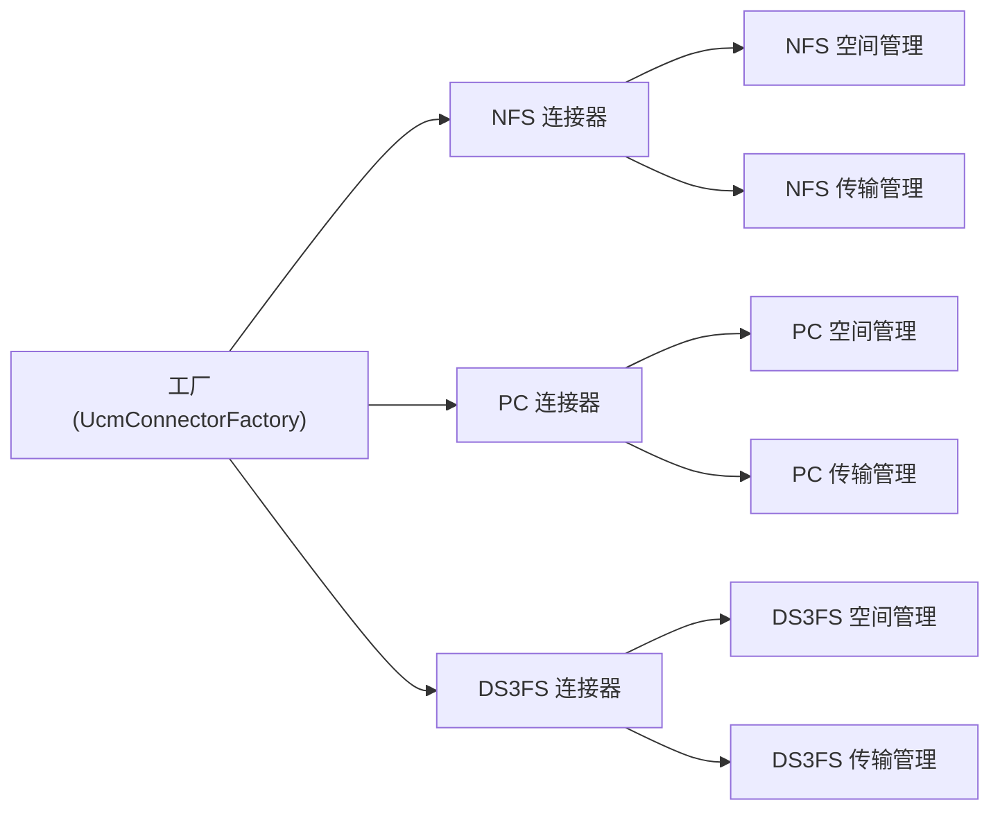

# 存储优化

<cite>
**本文引用的文件**
- [ds3fs_store.cc](file://ucm/store/ds3fs/cc/ds3fs_store.cc)
- [ds3fs_store.md](file://docs/source/user-guide/prefix-cache/ds3fs_store.md)
- [global_config.h](file://ucm/store/ds3fs/cc/global_config.h)
- [space_manager.h（Ds3fs）](file://ucm/store/ds3fs/cc/space_manager.h)
- [trans_manager.h（Ds3fs）](file://ucm/store/ds3fs/cc/trans_manager.h)
- [nfsstore.cc](file://ucm/store/nfsstore/cc/api/nfsstore.cc)
- [space_manager.h（NFS）](file://ucm/store/nfsstore/cc/domain/space/space_manager.h)
- [trans_manager.h（NFS）](file://ucm/store/nfsstore/cc/domain/trans/trans_manager.h)
- [pcstore.cc](file://ucm/store/pcstore/cc/api/pcstore.cc)
- [space_manager.h（PC）](file://ucm/store/pcstore/cc/domain/space/space_manager.h)
- [trans_manager.h（PC）](file://ucm/store/pcstore/cc/domain/trans/trans_manager.h)
- [trans_manager.h（Cache）](file://ucm/store/cache/cc/trans_manager.h)
- [factory.py](file://ucm/store/factory.py)
- [ucm_config_example.yaml](file://examples/ucm_config_example.yaml)
- [metrics.md](file://docs/source/user-guide/metrics/metrics.md)
</cite>

## 目录
1. [简介](#简介)
2. [项目结构](#项目结构)
3. [核心组件](#核心组件)
4. [架构总览](#架构总览)
5. [详细组件分析](#详细组件分析)
6. [依赖关系分析](#依赖关系分析)
7. [性能考量与优化策略](#性能考量与优化策略)
8. [故障排查指南](#故障排查指南)
9. [结论](#结论)
10. [附录](#附录)

## 简介
本指南面向使用 UCM 存储系统的工程师与运维人员，聚焦三类后端：NFS 存储、PC 存储（进程间共享）、DS3FS 分布式存储。内容涵盖：
- 各后端的性能特征与优化策略
- 存储布局策略（数据分片、负载均衡、故障恢复）
- 带宽优化（并发访问控制、数据压缩、传输协议优化）
- 容量规划与扩展（空间管理、自动扩容、成本优化）
- 性能监控指标与调优参数配置

## 项目结构
UCM 将“缓存层”与“外部存储后端”解耦，通过统一的 Store 接口与任务调度器实现跨后端的一致行为。关键目录与职责如下：
- ucm/store/ds3fs：DS3FS 分布式存储适配，负责与 3FS 的交互、分片与传输队列
- ucm/store/nfsstore：NFS 存储适配，支持热数据管理、回收策略与直写优化
- ucm/store/pcstore：PC 存储适配，基于共享内存/队列进行进程内/进程间高效传输
- ucm/store/cache：缓存层（Host/Device 间），负责设备侧与主机侧的数据搬运
- ucm/store/factory.py：连接器工厂，按名称动态加载具体 Store 实现
- docs/source/user-guide/prefix-cache：用户指南与性能测试参考
- examples/ucm_config_example.yaml：示例配置文件
- docs/source/user-guide/metrics：可观测性与指标采集

图表来源
- [factory.py](file://ucm/store/factory.py#L34-L71)
- [ds3fs_store.cc](file://ucm/store/ds3fs/cc/ds3fs_store.cc#L98-L167)
- [nfsstore.cc](file://ucm/store/nfsstore/cc/api/nfsstore.cc#L136-L148)
- [pcstore.cc](file://ucm/store/pcstore/cc/api/pcstore.cc#L110-L122)

章节来源
- [factory.py](file://ucm/store/factory.py#L34-L71)

## 核心组件
- DS3FS Store：面向分布式文件系统（3FS）的高性能传输与分片管理，支持直写、多流并发与超时控制
- NFS Store：面向网络文件系统（NFS）的块级空间管理、热数据追踪与可选回收策略
- PC Store：面向进程间共享的传输队列与共享缓冲区，支持散射/聚集与唯一标识隔离
- Cache Store：设备与主机之间的高速搬运层，提供加载/转储队列与任务包装

章节来源
- [ds3fs_store.cc](file://ucm/store/ds3fs/cc/ds3fs_store.cc#L32-L94)
- [nfsstore.cc](file://ucm/store/nfsstore/cc/api/nfsstore.cc#L33-L63)
- [pcstore.cc](file://ucm/store/pcstore/cc/api/pcstore.cc#L35-L54)
- [trans_manager.h（Cache）](file://ucm/store/cache/cc/trans_manager.h#L35-L70)

## 架构总览
下图展示 UCM 在不同后端下的典型数据路径与组件交互。

图表来源
- [factory.py](file://ucm/store/factory.py#L50-L57)
- [trans_manager.h（Cache）](file://ucm/store/cache/cc/trans_manager.h#L50-L69)
- [ds3fs_store.cc](file://ucm/store/ds3fs/cc/ds3fs_store.cc#L130-L162)
- [nfsstore.cc](file://ucm/store/nfsstore/cc/api/nfsstore.cc#L94-L105)
- [pcstore.cc](file://ucm/store/pcstore/cc/api/pcstore.cc#L71-L82)

## 详细组件分析

### DS3FS 存储优化
- 组件职责
  - 配置校验与初始化：检查设备号、分片/块大小、流数量等
  - 空间布局与查找：根据 BlockId 定位数据所在分片/位置
  - 传输管理：在启用设备传输时提交 LOAD/DUMP 任务，支持超时与日志记录
- 关键参数
  - storage_backends：3FS 挂载路径
  - device_id/tensor_size/shard_size/block_size：分片与块尺寸约束
  - io_direct/stream_number/timeout_ms：直写、并发流数与超时
  - ior_entries/ior_depth/numa_id：IO 重叠与 NUMA 绑定（如可用）
- 性能特征
  - 多流并发：通过 stream_number 提升吞吐
  - 直接 I/O：减少内核页缓存开销
  - 超时控制：避免阻塞导致的尾延迟放大

图表来源
- [ds3fs_store.cc](file://ucm/store/ds3fs/cc/ds3fs_store.cc#L32-L94)
- [space_manager.h（Ds3fs）](file://ucm/store/ds3fs/cc/space_manager.h#L32-L42)
- [trans_manager.h（Ds3fs）](file://ucm/store/ds3fs/cc/trans_manager.h#L33-L61)

章节来源
- [ds3fs_store.cc](file://ucm/store/ds3fs/cc/ds3fs_store.cc#L98-L167)
- [global_config.h](file://ucm/store/ds3fs/cc/global_config.h#L32-L44)
- [ds3fs_store.md](file://docs/source/user-guide/prefix-cache/ds3fs_store.md#L106-L126)

### NFS 存储优化
- 组件职责
  - 空间管理：块级分配、查找、提交；支持容量检查与回收阈值
  - 传输管理：多流 POSIX 队列，支持直写与超时
  - 热度管理：周期性访问统计，辅助热点数据迁移或保留
- 关键参数
  - storage_backends/kvcacheBlockSize：后端路径与块大小
  - transferEnable/device_id/stream_number/io_size/buffer_number/timeout_ms/io_direct：传输通道配置
  - hotnessEnable/hotnessInterval：热度追踪开关与周期
  - storageCapacity/recycleEnable/recycleThresholdRatio：容量与回收策略
- 性能特征
  - 可选直写降低拷贝开销
  - 多流并发提升带宽利用率
  - 回收策略在高并发场景下平衡空间占用与命中率

图表来源
- [nfsstore.cc](file://ucm/store/nfsstore/cc/api/nfsstore.cc#L33-L63)
- [space_manager.h（NFS）](file://ucm/store/nfsstore/cc/domain/space/space_manager.h#L35-L55)
- [trans_manager.h（NFS）](file://ucm/store/nfsstore/cc/domain/trans/trans_manager.h#L32-L48)

章节来源
- [nfsstore.cc](file://ucm/store/nfsstore/cc/api/nfsstore.cc#L136-L148)
- [space_manager.h（NFS）](file://ucm/store/nfsstore/cc/domain/space/space_manager.h#L35-L55)
- [trans_manager.h（NFS）](file://ucm/store/nfsstore/cc/domain/trans/trans_manager.h#L32-L48)

### PC 存储优化
- 组件职责
  - 空间管理：块级查找与布局
  - 传输管理：共享队列与本地 Rank 并发，支持散射/聚集与唯一 ID 隔离
- 关键参数
  - storage_backends/kvcacheBlockSize：后端路径与块大小
  - transferEnable/uniqueId：传输开关与实例隔离
  - transferLocalRankSize/device_id/stream_number/io_size/io_direct/buffer_number/timeout_ms/scatterGatherEnable：传输通道与聚合策略
- 性能特征
  - 共享缓冲与队列降低跨进程拷贝
  - 散射/聚集提升大块数据传输效率
  - 唯一 ID 避免多实例间的资源冲突

图表来源
- [pcstore.cc](file://ucm/store/pcstore/cc/api/pcstore.cc#L35-L54)
- [space_manager.h（PC）](file://ucm/store/pcstore/cc/domain/space/space_manager.h#L31-L43)
- [trans_manager.h（PC）](file://ucm/store/pcstore/cc/domain/trans/trans_manager.h#L32-L53)

章节来源
- [pcstore.cc](file://ucm/store/pcstore/cc/api/pcstore.cc#L110-L122)
- [trans_manager.h（PC）](file://ucm/store/pcstore/cc/domain/trans/trans_manager.h#L32-L53)

### 缓存层（设备与主机间）优化
- 组件职责
  - 加载/转储队列分离，针对不同方向优化
  - 任务包装器记录任务耗时，便于观测与调优
- 关键参数
  - shardSize/timeoutMs：分片大小与超时
- 性能特征
  - 明确区分 LOAD/DUMP 路径，避免串扰
  - 任务结束回调输出耗时日志，便于定位瓶颈

章节来源
- [trans_manager.h（Cache）](file://ucm/store/cache/cc/trans_manager.h#L35-L70)

## 依赖关系分析
- 工厂注册与动态加载
  - 工厂通过名称注册多种连接器，运行时按需创建具体 Store 实例
  - 支持 UcmNfsStore、UcmPcStore、UcmMooncakeStore 等
- 组件耦合与职责边界
  - Store 实现各自独立，通过统一接口与任务调度器交互
  - 空间管理与传输管理解耦，便于按后端定制策略

图表来源
- [factory.py](file://ucm/store/factory.py#L60-L71)
- [nfsstore.cc](file://ucm/store/nfsstore/cc/api/nfsstore.cc#L136-L148)
- [pcstore.cc](file://ucm/store/pcstore/cc/api/pcstore.cc#L110-L122)
- [ds3fs_store.cc](file://ucm/store/ds3fs/cc/ds3fs_store.cc#L166-L167)

章节来源
- [factory.py](file://ucm/store/factory.py#L34-L71)

## 性能考量与优化策略

### 不同存储后端的性能特征与优化策略
- DS3FS（分布式文件系统）
  - 特征：高吞吐、可横向扩展，适合大规模 KV 缓存持久化
  - 优化
    - 并发：增大 stream_number，结合 io_direct 与合适的 ior_entries/ior_depth
    - 布局：合理设置 shard_size 与 blockSize，确保与模型块对齐
    - 网络：关注网络带宽与延迟，必要时启用 NUMA 绑定（numa_id）
- NFS（网络文件系统）
  - 特征：部署简单、兼容性强，适合中小规模或混合部署
  - 优化
    - 直写：开启 io_direct 减少页缓存抖动
    - 并发：多流传输提升带宽利用率
    - 热度：启用 hotness 管理，优先保留热点块
    - 回收：合理设置 storageCapacity 与回收阈值，避免空间浪费
- PC（进程间共享）
  - 特征：低延迟、高带宽，适合多进程/多实例共享
  - 优化
    - 共享缓冲：复用共享队列与缓冲，减少跨进程拷贝
    - 散射/聚集：对大块数据启用 SG，提升吞吐
    - 隔离：为每个实例设置 uniqueId，避免资源争用

章节来源
- [ds3fs_store.md](file://docs/source/user-guide/prefix-cache/ds3fs_store.md#L106-L126)
- [nfsstore.cc](file://ucm/store/nfsstore/cc/api/nfsstore.cc#L44-L60)
- [pcstore.cc](file://ucm/store/pcstore/cc/api/pcstore.cc#L45-L51)

### 存储布局策略（分片、负载均衡、故障恢复）
- 分片与块对齐
  - DS3FS：通过 tensor_size、shard_size、block_size 的整除关系保证分片粒度与数据块对齐，减少碎片与跨块访问
- 负载均衡
  - 多流并发：通过 stream_number/queue 数量分散 IO 压力
  - 热度管理：NFS 后端的热度追踪有助于将热点数据靠近访问节点
- 故障恢复
  - 超时控制：timeout_ms 防止单点阻塞影响整体吞吐
  - 失败集合：任务失败集合用于快速判定与重试策略

章节来源
- [ds3fs_store.cc](file://ucm/store/ds3fs/cc/ds3fs_store.cc#L67-L76)
- [trans_manager.h（NFS）](file://ucm/store/nfsstore/cc/domain/trans/trans_manager.h#L32-L48)
- [trans_manager.h（PC）](file://ucm/store/pcstore/cc/domain/trans/trans_manager.h#L46-L53)

### 带宽优化（并发、压缩、协议）
- 并发访问控制
  - DS3FS/NFS：增加 stream_number，结合 io_direct 与合适的 io_size/buffer_number
  - PC：利用共享队列与散射/聚集，减少上下文切换与拷贝
- 数据压缩
  - 当前代码未见内置压缩逻辑，建议在业务层对 KV 块进行压缩后再写入后端，或评估后端是否支持透明压缩（如特定文件系统特性）
- 传输协议优化
  - 直写（io_direct）减少内核页缓存开销
  - NUMA 绑定（numa_id）提升本地内存访问效率

章节来源
- [global_config.h](file://ucm/store/ds3fs/cc/global_config.h#L38-L44)
- [nfsstore.cc](file://ucm/store/nfsstore/cc/api/nfsstore.cc#L44-L48)
- [pcstore.cc](file://ucm/store/pcstore/cc/api/pcstore.cc#L45-L49)

### 容量规划与扩展（空间管理、自动扩容、成本优化）
- 空间管理
  - NFS：通过 storageCapacity 与回收阈值（recycleThresholdRatio）控制空间占用；启用回收（recycleEnable）以释放冷数据
- 自动扩容
  - DS3FS/NFS：可通过增加 storage_backends 路径或挂载更多后端目录实现横向扩展
- 成本优化
  - 选择合适介质：热数据走高速盘/SSD，冷数据下沉至大容量 HDD
  - 热度策略：优先保留命中率高的块，降低回源频率

章节来源
- [space_manager.h（NFS）](file://ucm/store/nfsstore/cc/domain/space/space_manager.h#L37-L54)
- [ds3fs_store.md](file://docs/source/user-guide/prefix-cache/ds3fs_store.md#L102-L126)

### 性能监控指标与调优参数
- 指标采集
  - 通过 Prometheus/Grafana 对 UCM 进行观测，包括加载/保存请求数、块数、耗时与速度等
- 关键参数
  - DS3FS：stream_number、io_direct、timeout_ms、shard_size、block_size
  - NFS：transferEnable、hotnessEnable、storageCapacity、recycleEnable、recycleThresholdRatio、io_direct
  - PC：transferLocalRankSize、scatterGatherEnable、uniqueId、io_direct

章节来源
- [metrics.md](file://docs/source/user-guide/metrics/metrics.md#L151-L169)
- [ucm_config_example.yaml](file://examples/ucm_config_example.yaml#L10-L18)
- [global_config.h](file://ucm/store/ds3fs/cc/global_config.h#L32-L44)
- [nfsstore.cc](file://ucm/store/nfsstore/cc/api/nfsstore.cc#L44-L60)
- [pcstore.cc](file://ucm/store/pcstore/cc/api/pcstore.cc#L45-L51)

## 故障排查指南
- 常见问题定位
  - 传输超时：检查 timeout_ms 设置与网络状况；查看日志中任务开始/结束时间
  - 参数非法：确认分片/块大小满足整除关系；校验设备号与流数量
  - 热点不足：NFS 启用热度管理并调整周期；观察命中率变化
- 日志与观测
  - Cache/Ds3fs 任务日志包含任务 ID、操作类型、子任务数与总大小，便于定位瓶颈
  - 启用 debug 日志级别以获取更细粒度的传输耗时

章节来源
- [trans_manager.h（Cache）](file://ucm/store/cache/cc/trans_manager.h#L50-L69)
- [trans_manager.h（Ds3fs）](file://ucm/store/ds3fs/cc/trans_manager.h#L46-L60)
- [ds3fs_store.md](file://docs/source/user-guide/prefix-cache/ds3fs_store.md#L216-L251)

## 结论
- DS3FS 适合大规模分布式部署，应重点优化并发流数与分片对齐
- NFS 适合中小规模与混合环境，建议启用直写与热度管理，并合理设置容量与回收策略
- PC 适合多进程共享场景，应充分利用共享队列与散射/聚集能力
- 通过统一的工厂与任务调度器，UCM 能够在不修改上层逻辑的前提下灵活切换与优化存储后端

## 附录
- 示例配置文件路径与关键字段参考
  - [ucm_config_example.yaml](file://examples/ucm_config_example.yaml#L10-L18)