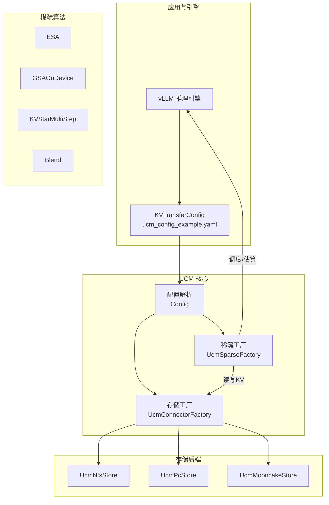
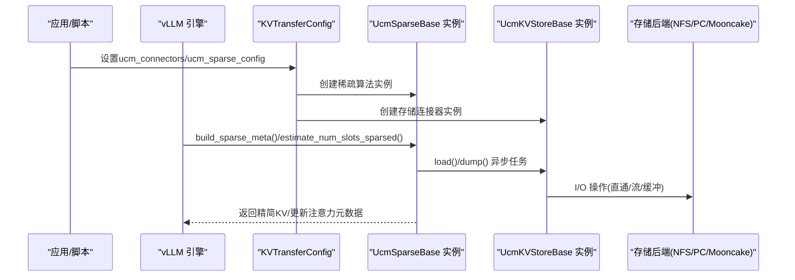
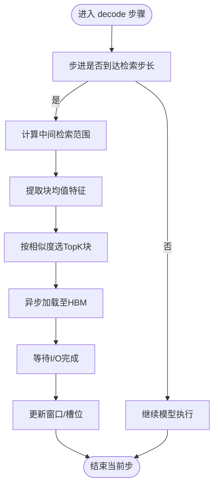
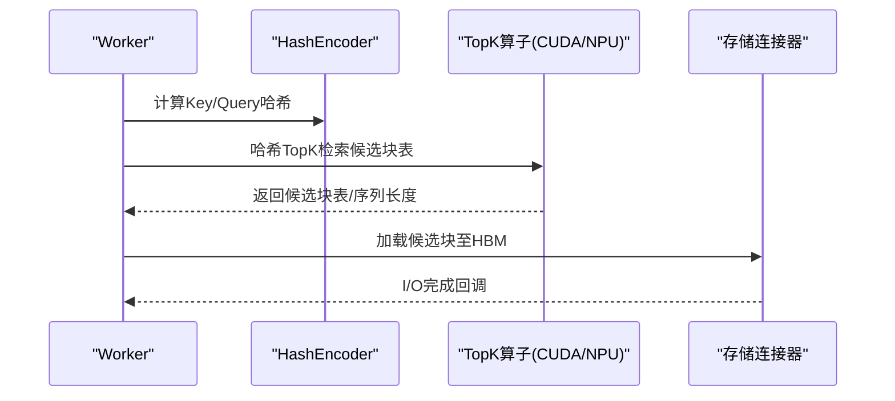
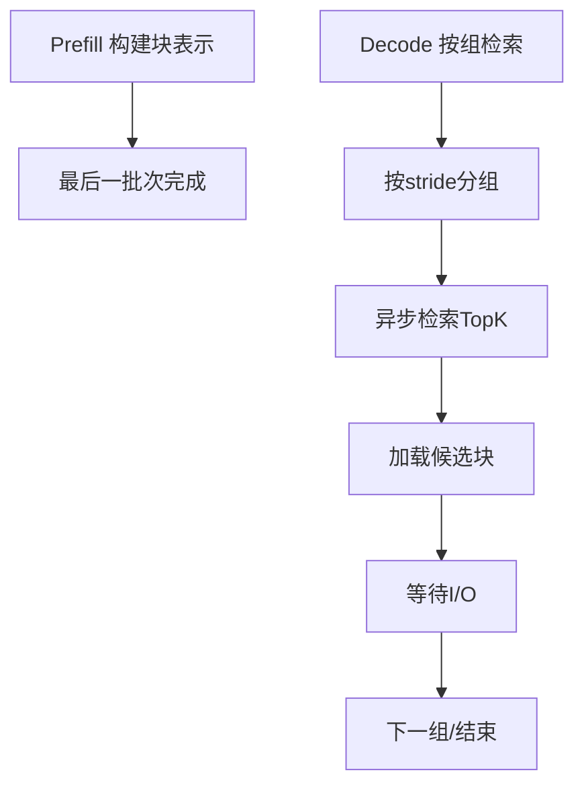
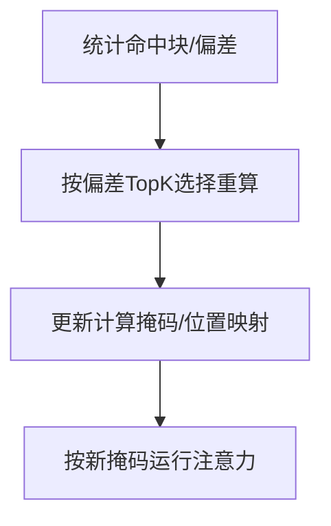
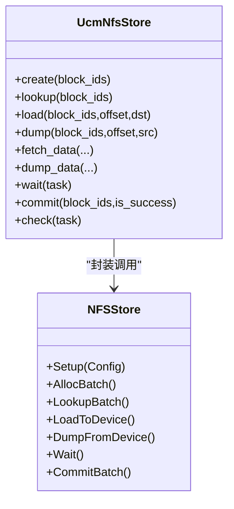
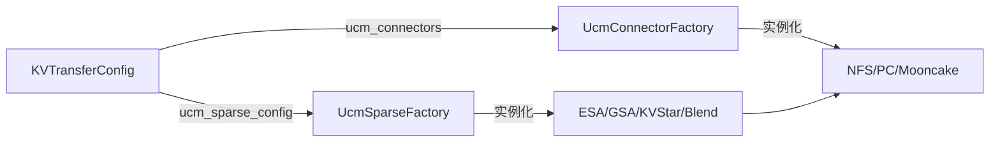

# 性能调优

<cite>
**本文引用的文件**   
- [README.md](file://README.md)
- [ucm_config_example.yaml](file://examples\ucm_config_example.yaml)
- [factory.py（稀疏工厂）](file://ucm\sparse\factory.py)
- [factory.py（存储工厂）](file://ucm\store\factory.py)
- [utils.py](file://ucm\utils.py)
- [esa.py](file://ucm\sparse\esa\esa.py)
- [gsa_on_device.py](file://ucm\sparse\gsa_on_device\gsa_on_device.py)
- [multistep.py](file://ucm\sparse\kvstar\multistep.py)
- [blend.py](file://ucm\sparse\blend\blend.py)
- [nfsstore_connector.py](file://ucm\store\nfsstore\nfsstore_connector.py)
- [test_uc_performance.py](file://test\suites\E2E\test_uc_performance.py)
- [offline_inference.py](file://examples\offline_inference.py)
- [offline_inference_blend.py](file://examples\offline_inference_blend.py)
- [index.md（前缀缓存总览）](file://docs\source\user-guide\prefix-cache\index.md)
- [index.md（稀疏注意力总览）](file://docs\source\user-guide\sparse-attention\index.md)
- [kv_cache_calculator.md](file://docs\source\getting-started\kv_cache_calculator.md)
</cite>

## 目录
1. [简介](#简介)
2. [项目结构](#项目结构)
3. [核心组件](#核心组件)
4. [架构总览](#架构总览)
5. [详细组件分析](#详细组件分析)
6. [依赖关系分析](#依赖关系分析)
7. [性能考量与优化建议](#性能考量与优化建议)
8. [故障排查指南](#故障排查指南)
9. [结论](#结论)
10. [附录：基准测试与参数建议](#附录基准测试与参数建议)

## 简介
本指南围绕统一缓存管理（UCM）在长上下文与高并发推理中的性能调优展开，聚焦以下关键方向：
- 缓存策略选择：前缀缓存、稀疏注意力（ESA/GSA/KVStar/Blend）与存储介质（HBM/DRAM/NVMe/NFS）协同
- 存储介质配置：I/O直通、流数量、缓冲区数量、回收策略等
- 稀疏算法参数：窗口大小、稀疏比例、检索步长、哈希TopK等
- 内存使用优化：HBM利用、DRAM缓存配置、KV块粒度与数据布局
- 计算效率提升：并行度、批处理、硬件加速（CUDA/NPU）、异步传输与重叠
- 场景化策略：在线推理（低时延）、离线批量（高吞吐）
- 基准测试与结果分析：端到端延迟、TTFT、增量吞吐、分位数指标

## 项目结构
UCM通过“稀疏注意力算法 + 外部存储连接器”的解耦设计，实现KV缓存的按需加载与卸载，降低HBM占用并提升吞吐。

图示来源
- [factory.py（稀疏工厂）](file://ucm\sparse\factory.py#L34-L57)
- [factory.py（存储工厂）](file://ucm\store\factory.py#L34-L71)
- [utils.py](file://ucm\utils.py#L34-L91)
- [ucm_config_example.yaml](file://examples\ucm_config_example.yaml#L10-L39)

章节来源
- [README.md](file://README.md#L14-L54)
- [ucm_config_example.yaml](file://examples\ucm_config_example.yaml#L1-L39)
- [factory.py（稀疏工厂）](file://ucm\sparse\factory.py#L13-L57)
- [factory.py（存储工厂）](file://ucm\store\factory.py#L34-L71)
- [utils.py](file://ucm\utils.py#L34-L91)

## 核心组件
- 配置系统：从外部YAML或终端参数加载UCM配置，支持稀疏算法与存储连接器选择
- 稀疏工厂：注册并实例化不同稀疏算法（ESA、GSAOnDevice、KVStarMultiStep、Blend）
- 存储工厂：注册并实例化不同存储连接器（NFS、PCStore、MooncakeStore）
- 算法实现：ESA/GSAOnDevice/KVStarMultiStep/Blend分别针对不同模型与场景优化
- 存储连接器：NFSStore提供I/O直通、流数量、缓冲区数量等参数控制

章节来源
- [utils.py](file://ucm\utils.py#L34-L91)
- [factory.py（稀疏工厂）](file://ucm\sparse\factory.py#L13-L57)
- [factory.py（存储工厂）](file://ucm\store\factory.py#L34-L71)
- [nfsstore_connector.py](file://ucm\store\nfsstore\nfsstore_connector.py#L39-L71)

## 架构总览
UCM在vLLM中以KVTransferConfig为入口，通过工厂模式选择稀疏算法与存储连接器。稀疏算法在prefill阶段可能全量落盘，在decode阶段按需检索与加载，同时异步执行I/O以减少停顿。

图示来源
- [offline_inference.py](file://examples\offline_inference.py#L18-L44)
- [ucm_config_example.yaml](file://examples\ucm_config_example.yaml#L10-L39)
- [nfsstore_connector.py](file://ucm\store\nfsstore\nfsstore_connector.py#L84-L122)

## 详细组件分析

### 组件A：ESA（嵌入相似性检索）
- 关键点
  - 初始化窗口与局部窗口：避免首尾冗余，仅对中间区域进行检索
  - 块级表示池：按层维护槽位，均值聚合块特征作为检索向量
  - 检索步长：周期性触发检索，平衡带宽与命中率
  - 异步传输：检索结果与I/O等待解耦，叠加模型执行
- 参数要点
  - init_window_sz/local_window_sz：窗口大小
  - sparse_ratio：检索TopK占中间范围的比例
  - retrieval_stride：检索周期
  - min_blocks：请求最小块数阈值
- 性能影响
  - 窗口越大，初始与末尾越完整，但检索范围扩大
  - 检索步长过小增加I/O次数，过大降低动态适应性
  - 稀疏比例过高会漏掉关键上下文，过低增加HBM占用

图示来源
- [esa.py](file://ucm\sparse\esa\esa.py#L372-L418)

章节来源
- [esa.py](file://ucm\sparse\esa\esa.py#L421-L790)

### 组件B：GSAOnDevice（设备内哈希TopK）
- 关键点
  - 自动模型适配：根据模型名选择配置文件
  - CUDA/NPU路径：NPU下使用自定义算子与哈明距离TopK
  - MLA/GQA分支：MLA模式下合并nope/pe头信息；GQA模式下按头均值
  - 前缀缓存命中：可回填已命中的前缀块，减少重复计算
- 参数要点
  - vllm_hash_attention_topk：每步哈希TopK的token数
  - seq_len_threshhold：启用哈希TopK的序列长度阈值
  - hash_attention_skip_layers/rollback_layers：跳层/回滚层配置
- 性能影响
  - TopK越大，检索越精确，但I/O与计算成本上升
  - 设备侧哈希与TopK显著降低CPU-GPU拷贝与主机端计算

图示来源
- [gsa_on_device.py](file://ucm\sparse\gsa_on_device\gsa_on_device.py#L557-L623)

章节来源
- [gsa_on_device.py](file://ucm\sparse\gsa_on_device\gsa_on_device.py#L99-L728)

### 组件C：KVStarMultiStep（多步检索）
- 关键点
  - 分阶段检索：Prefill阶段构建块级表示，Decode阶段按组检索
  - 查询离线：在预填充阶段将尾部查询离线，减少decode时I/O
  - 维度裁剪与内聚：对通道维度做TopK裁剪，降低表示规模
- 参数要点
  - blk_repre_dim_prune_ratio：通道维度裁剪比例
  - blk_repre_inner_token_merge：块内token内聚因子
  - retrieval_stride：检索组间隔
- 性能影响
  - 维度裁剪显著降低CPU侧表示规模与检索开销
  - 预填充查询离线可平滑decode阶段流量

图示来源
- [multistep.py](file://ucm\sparse\kvstar\multistep.py#L356-L494)

章节来源
- [multistep.py](file://ucm\sparse\kvstar\multistep.py#L645-L800)

### 组件D：Blend（缓存融合）
- 关键点
  - 块级命中检测：对每个块判断是否命中Golden KV
  - 偏差度量：对命中块计算与golden K的偏差，仅对偏差最大的部分重算
  - 动态掩码：更新slot_mapping/query_start_loc等，减少实际计算token数
- 参数要点
  - ratio：对命中块中偏差TopK的比例进行重算
- 性能影响
  - 显著减少prefill阶段重算token数，提升吞吐

图示来源
- [blend.py](file://ucm\sparse\blend\blend.py#L260-L338)

章节来源
- [blend.py](file://ucm\sparse\blend\blend.py#L149-L384)

### 组件E：存储连接器（NFS）
- 关键点
  - I/O直通：支持io_direct，减少内核页缓存开销
  - 流数量与缓冲：transferStreamNumber/transferBufferNumber决定并发与内存占用
  - 回收策略：可配置回收开关与阈值
- 参数要点
  - use_direct/stream_number/buffer_number/storage_capacity/recycle_enable/recycle_threshold_ratio
- 性能影响
  - 合理增大流数量与缓冲可提升带宽利用率，但会增加内存占用
  - I/O直通在高并发下可降低拷贝与抖动

图示来源
- [nfsstore_connector.py](file://ucm\store\nfsstore\nfsstore_connector.py#L39-L132)

章节来源
- [nfsstore_connector.py](file://ucm\store\nfsstore\nfsstore_connector.py#L39-L132)

## 依赖关系分析
- 配置驱动：KVTransferConfig.kv_connector_extra_config决定稀疏算法与存储连接器
- 工厂注册：稀疏/存储工厂负责按名称懒加载类，确保扩展性
- 运行期耦合：稀疏算法与存储连接器通过Task接口解耦，I/O异步化
- 文档与计算器：KV缓存计算器用于估算HBM/DRAM需求，辅助容量规划

图示来源
- [utils.py](file://ucm\utils.py#L34-L91)
- [factory.py（稀疏工厂）](file://ucm\sparse\factory.py#L34-L57)
- [factory.py（存储工厂）](file://ucm\store\factory.py#L50-L71)

章节来源
- [utils.py](file://ucm\utils.py#L34-L91)
- [factory.py（稀疏工厂）](file://ucm\sparse\factory.py#L13-L57)
- [factory.py（存储工厂）](file://ucm\store\factory.py#L34-L71)

## 性能考量与优化建议

### 缓存策略选择
- 在线推理（低时延）
  - 优先前缀缓存（高命中率），结合稀疏算法（ESA/KVStar）减少HBM占用
  - 对长上下文对话，适当增大init_window_sz以保留更多历史
- 离线批量（高吞吐）
  - 使用Blend对命中块进行偏差重算，最大化复用Golden KV
  - 合理设置seq_len_threshhold，避免短序列产生额外开销

章节来源
- [index.md（前缀缓存总览）](file://docs\source\user-guide\prefix-cache\index.md#L11-L18)
- [index.md（稀疏注意力总览）](file://docs\source\user-guide\sparse-attention\index.md#L25-L35)

### 存储介质与I/O配置
- I/O直通与流数量
  - 开启use_direct，减少内核缓存抖动
  - 提升stream_number与buffer_number，提高带宽利用率
- 回收策略
  - 启用recycle_enable并设置合理阈值，降低冷数据占用
- 存储层级
  - HBM：短期活跃块
  - DRAM：热数据与中间块
  - NVMe/NFS：冷数据与持久化

章节来源
- [nfsstore_connector.py](file://ucm\store\nfsstore\nfsstore_connector.py#L48-L71)
- [index.md（前缀缓存总览）](file://docs\source\user-guide\prefix-cache\index.md#L16-L30)

### 稀疏算法参数调优
- ESA
  - init_window_sz/local_window_sz：根据模型与任务设定，避免首尾丢失
  - sparse_ratio：通常0.2~0.4，兼顾命中与HBM节省
  - retrieval_stride：默认8，可根据带宽与延迟目标微调
- GSAOnDevice
  - vllm_hash_attention_topk：按block_size整除且不超过max_model_len
  - seq_len_threshhold：≥ topk，避免短序列误触发
  - hash_skip_layers/hash_rollback_layers：按模型结构配置
- KVStarMultiStep
  - blk_repre_dim_prune_ratio：0.9~0.98，显著降维
  - blk_repre_inner_token_merge：块内token内聚，提升表示稳定性
  - retrieval_stride：与decode节奏匹配
- Blend
  - ratio：0.1~0.3，按数据分布与模型特性调整

章节来源
- [esa.py](file://ucm\sparse\esa\esa.py#L22-L30)
- [gsa_on_device.py](file://ucm\sparse\gsa_on_device\gsa_on_device.py#L125-L154)
- [multistep.py](file://ucm\sparse\kvstar\multistep.py#L290-L327)
- [blend.py](file://ucm\sparse\blend\blend.py#L106-L112)

### 内存使用优化
- HBM利用
  - 通过稀疏算法减少活跃块数量，配合init_window/local_window保持关键区域
  - 对MLA模型，注意K/V共享或分离的数据布局差异
- DRAM缓存
  - 将热点块保留在DRAM，冷数据下沉至NVMe/NFS
  - 结合回收策略，避免碎片化
- 数据布局
  - block_size与head维度对内存访问友好性影响较大，尽量与硬件对齐

章节来源
- [index.md（稀疏注意力总览）](file://docs\source\user-guide\sparse-attention\index.md#L25-L35)
- [kv_cache_calculator.md](file://docs\source\getting-started\kv_cache_calculator.md#L1-L9)

### 计算效率提升
- 并行度与批处理
  - 合理设置tensor_parallel_size与max_num_batched_tokens
  - 批内请求尽量同构，减少掩码与动态形状
- 异步与重叠
  - 稀疏算法与存储I/O异步化，I/O等待期间继续计算
  - GSAOnDevice在设备侧完成哈希与TopK，减少主机端开销
- 硬件加速
  - CUDA/NPU设备选择与算子可用性，确保启用对应路径

章节来源
- [offline_inference.py](file://examples\offline_inference.py#L27-L37)
- [gsa_on_device.py](file://ucm\sparse\gsa_on_device\gsa_on_device.py#L557-L623)

## 故障排查指南
- 配置未生效
  - 检查KVTransferConfig.kv_connector_extra_config是否正确传入
  - 确认ucm_config_example.yaml路径与格式
- 稀疏算法不匹配
  - 确认ucm_sparse_config中算法名称与工厂注册一致
  - 检查模型是否支持所选算法（如MLA/GQA）
- 存储I/O异常
  - 查看NFSStore返回码与日志
  - 调整io_direct、stream_number、buffer_number
- 性能不达预期
  - 逐步关闭高级特性（如回收、直通）定位瓶颈
  - 对比不同算法在相同数据上的延迟与吞吐

章节来源
- [ucm_config_example.yaml](file://examples\ucm_config_example.yaml#L1-L39)
- [utils.py](file://ucm\utils.py#L40-L82)
- [nfsstore_connector.py](file://ucm\store\nfsstore\nfsstore_connector.py#L67-L71)

## 结论
UCM通过“稀疏注意力 + 外部存储”的组合，有效降低了长上下文推理对HBM的依赖，并在I/O与计算之间取得良好平衡。调优的关键在于：
- 以业务场景选择合适的缓存策略与稀疏算法
- 合理配置存储I/O参数与回收策略
- 在不同硬件平台下充分利用设备侧加速
- 通过基准测试持续迭代参数

## 附录：基准测试与参数建议

### 基准测试方法
- 场景覆盖
  - 同步性能：合成数据，固定输入/输出长度，评估吞吐与延迟
  - 多轮对话：模拟真实对话，评估TTFT与端到端延迟
  - 文档问答：评估长上下文与检索能力
- 指标采集
  - TTFT、ITL（分位数）、端到端延迟、总吞吐、增量吞吐
  - 可结合Prometheus/Grafana监控关键指标

章节来源
- [test_uc_performance.py](file://test\suites\E2E\test_uc_performance.py#L34-L91)
- [test_uc_performance.py](file://test\suites\E2E\test_uc_performance.py#L125-L131)
- [test_uc_performance.py](file://test\suites\E2E\test_uc_performance.py#L152-L158)
- [test_uc_performance.py](file://test\suites\E2E\test_uc_performance.py#L179-L185)

### 参数调整建议与效果对比（示例）
- 在线推理（低时延）
  - 建议：ESA + NFS直通 + 适度检索步长
  - 效果：TTFT下降，端到端稳定
- 离线批量（高吞吐）
  - 建议：Blend + 更大TopK + DRAM热数据
  - 效果：吞吐提升，重算比例下降
- 长上下文
  - 建议：KVStarMultiStep + 维度裁剪 + 预填充查询离线
  - 效果：HBM占用降低，I/O更均衡

章节来源
- [offline_inference.py](file://examples\offline_inference.py#L18-L44)
- [offline_inference_blend.py](file://examples\offline_inference_blend.py#L87-L135)
- [index.md（稀疏注意力总览）](file://docs\source\user-guide\sparse-attention\index.md#L25-L35)