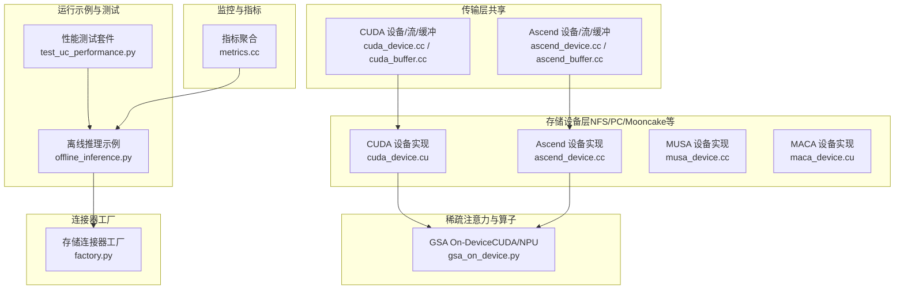
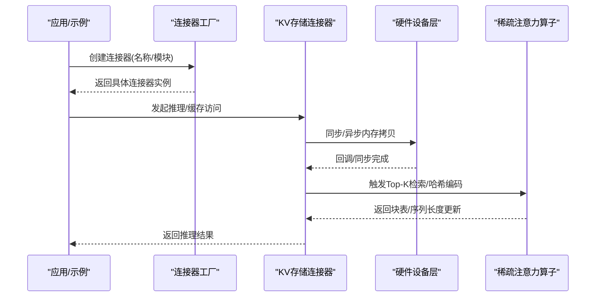
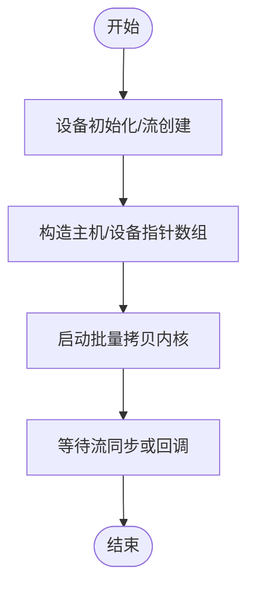
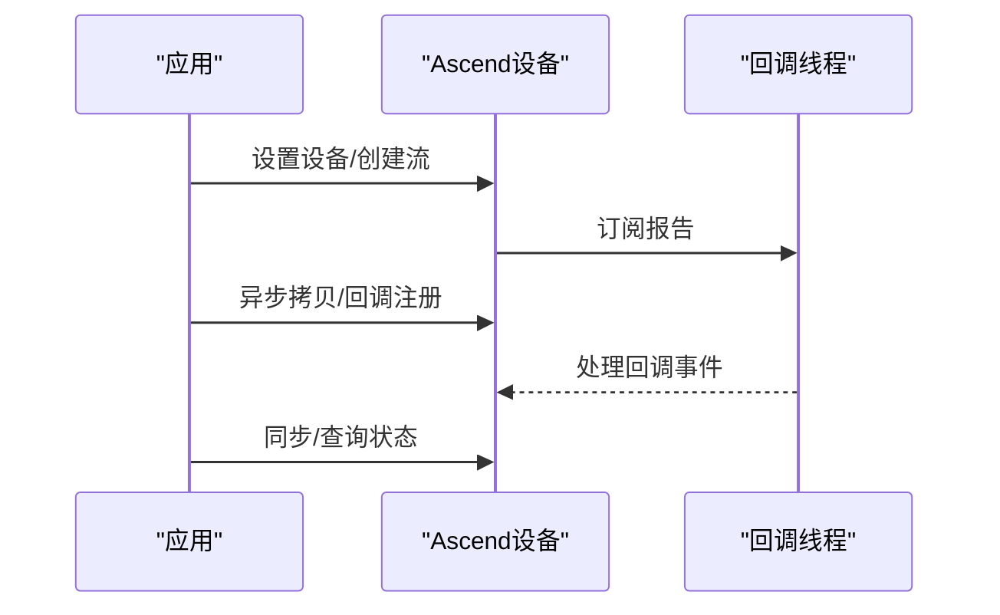
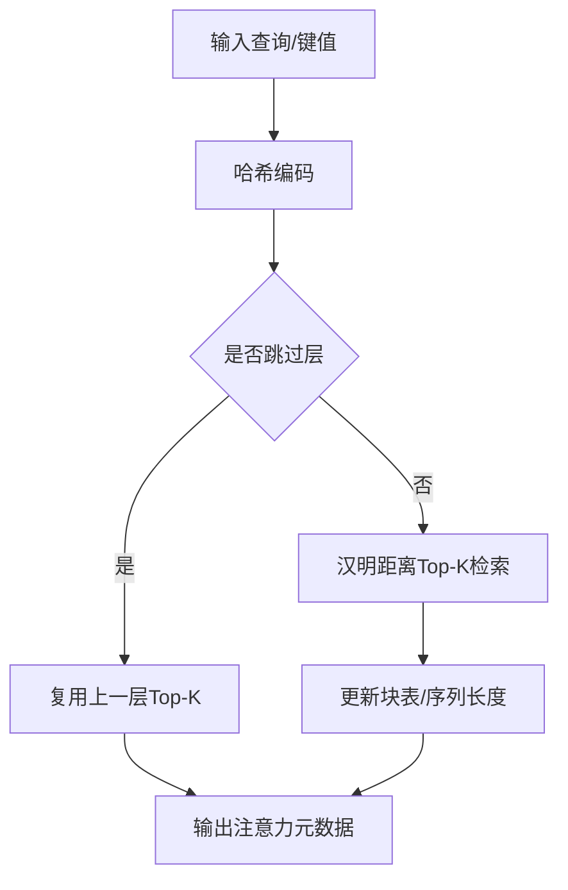
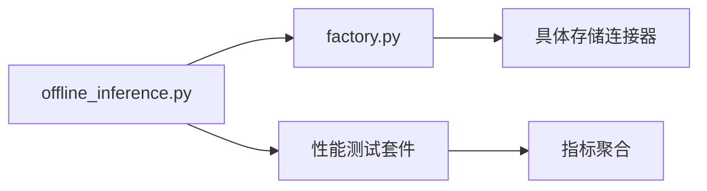
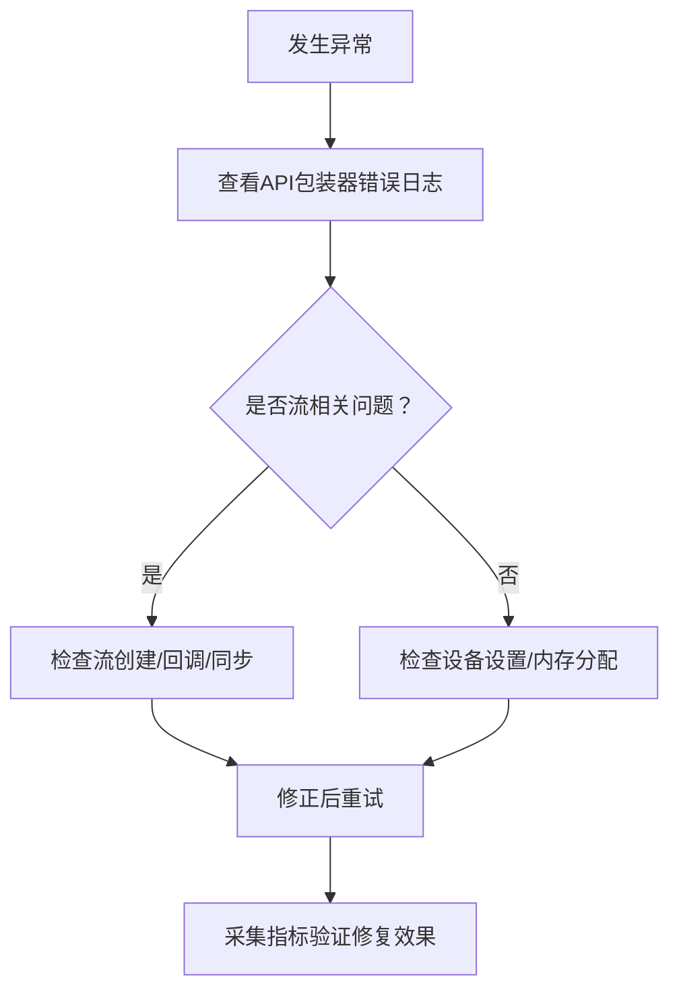

# 硬件加速优化

<cite>
**本文引用的文件**
- [cuda_device.cc](file://ucm/shared/trans/cuda/cuda_device.cc)
- [cuda_buffer.cc](file://ucm/shared/trans/cuda/cuda_buffer.cc)
- [cuda_device.cu](file://ucm/store/nfsstore/device/cuda/cuda_device.cu)
- [ascend_device.cc](file://ucm/shared/trans/ascend/ascend_device.cc)
- [ascend_device.cc](file://ucm/store/nfsstore/device/ascend/ascend_device.cc)
- [ascend_buffer.cc](file://ucm/shared/trans/ascend/ascend_buffer.cc)
- [musa_device.cc](file://ucm/store/nfsstore/device/musa/musa_device.cc)
- [maca_device.cu](file://ucm/store/nfsstore/device/maca/maca_device.cu)
- [gsa_on_device.py](file://ucm/sparse/gsa_on_device/gsa_on_device.py)
- [offline_inference.py](file://examples/offline_inference.py)
- [test_uc_performance.py](file://test/suites/E2E/test_uc_performance.py)
- [quickstart_vllm_ascend.md](file://docs/source/getting-started/quickstart_vllm_ascend.md)
- [metrics.cc](file://ucm/shared/metrics/cc/domain/metrics.cc)
- [factory.py](file://ucm/store/factory.py)
</cite>

## 目录
1. [引言](#引言)
2. [项目结构](#项目结构)
3. [核心组件](#核心组件)
4. [架构总览](#架构总览)
5. [详细组件分析](#详细组件分析)
6. [依赖关系分析](#依赖关系分析)
7. [性能考量与优化建议](#性能考量与优化建议)
8. [故障排查指南](#故障排查指南)
9. [结论](#结论)
10. [附录](#附录)

## 引言
本指南聚焦于统一缓存管理（UCM）在异构硬件平台上的性能优化实践，覆盖以下目标：
- 针对不同硬件平台（CUDA GPU、Ascend NPU、MUSA、MACA）给出可落地的优化策略与调优要点
- 解释硬件资源利用率优化方法：显存管理、计算单元利用率、内存带宽优化
- 提供硬件特定的性能调优技巧：内核优化、流水线配置、缓存策略
- 介绍多硬件平台的负载均衡与迁移策略：异构计算的任务分配与资源调度
- 提供硬件性能监控与故障诊断方法

## 项目结构
UCM在“传输层”和“存储设备层”分别抽象了硬件无关的接口，并针对不同硬件提供了具体实现；同时通过工厂模式注册与创建不同类型的KV缓存连接器，支撑端到端推理流程。

**图表来源**
- [cuda_device.cc](file://ucm/shared/trans/cuda/cuda_device.cc#L41-L81)
- [cuda_buffer.cc](file://ucm/shared/trans/cuda/cuda_buffer.cc#L29-L56)
- [ascend_device.cc](file://ucm/shared/trans/ascend/ascend_device.cc#L31-L61)
- [ascend_buffer.cc](file://ucm/shared/trans/ascend/ascend_buffer.cc#L29-L54)
- [cuda_device.cu](file://ucm/store/nfsstore/device/cuda/cuda_device.cu#L107-L227)
- [ascend_device.cc](file://ucm/store/nfsstore/device/ascend/ascend_device.cc#L48-L154)
- [musa_device.cc](file://ucm/store/nfsstore/device/musa/musa_device.cc#L52-L147)
- [maca_device.cu](file://ucm/store/nfsstore/device/maca/maca_device.cu#L107-L227)
- [gsa_on_device.py](file://ucm/sparse/gsa_on_device/gsa_on_device.py#L99-L728)
- [offline_inference.py](file://examples/offline_inference.py#L18-L44)
- [test_uc_performance.py](file://test/suites/E2E/test_uc_performance.py#L31-L91)
- [metrics.cc](file://ucm/shared/metrics/cc/domain/metrics.cc#L32-L115)
- [factory.py](file://ucm/store/factory.py#L34-L71)

**章节来源**
- [cuda_device.cc](file://ucm/shared/trans/cuda/cuda_device.cc#L41-L81)
- [ascend_device.cc](file://ucm/shared/trans/ascend/ascend_device.cc#L31-L61)
- [cuda_device.cu](file://ucm/store/nfsstore/device/cuda/cuda_device.cu#L107-L227)
- [ascend_device.cc](file://ucm/store/nfsstore/device/ascend/ascend_device.cc#L48-L154)
- [musa_device.cc](file://ucm/store/nfsstore/device/musa/musa_device.cc#L52-L147)
- [maca_device.cu](file://ucm/store/nfsstore/device/maca/maca_device.cu#L107-L227)
- [gsa_on_device.py](file://ucm/sparse/gsa_on_device/gsa_on_device.py#L99-L728)
- [offline_inference.py](file://examples/offline_inference.py#L18-L44)
- [test_uc_performance.py](file://test/suites/E2E/test_uc_performance.py#L31-L91)
- [metrics.cc](file://ucm/shared/metrics/cc/domain/metrics.cc#L32-L115)
- [factory.py](file://ucm/store/factory.py#L34-L71)

## 核心组件
- 传输层设备抽象：统一的设备初始化、流创建、缓冲区管理接口，屏蔽底层差异
- 存储设备层实现：针对CUDA、Ascend、MUSA、MACA的具体设备类，封装内存拷贝、回调、同步等
- 稀疏注意力模块：基于哈希与汉明距离的Top-K检索，支持CUDA与Ascend路径
- 连接器工厂：按名称动态加载并创建不同KV存储连接器
- 性能监控：线程本地指标缓冲、统计类型注册与聚合

**章节来源**
- [cuda_device.cc](file://ucm/shared/trans/cuda/cuda_device.cc#L41-L81)
- [ascend_device.cc](file://ucm/shared/trans/ascend/ascend_device.cc#L31-L61)
- [cuda_device.cu](file://ucm/store/nfsstore/device/cuda/cuda_device.cu#L107-L227)
- [ascend_device.cc](file://ucm/store/nfsstore/device/ascend/ascend_device.cc#L48-L154)
- [musa_device.cc](file://ucm/store/nfsstore/device/musa/musa_device.cc#L52-L147)
- [maca_device.cu](file://ucm/store/nfsstore/device/maca/maca_device.cu#L107-L227)
- [gsa_on_device.py](file://ucm/sparse/gsa_on_device/gsa_on_device.py#L99-L728)
- [factory.py](file://ucm/store/factory.py#L34-L71)
- [metrics.cc](file://ucm/shared/metrics/cc/domain/metrics.cc#L32-L115)

## 架构总览
下图展示了从应用侧发起推理请求，经由连接器工厂选择具体存储后，进入不同硬件设备层执行数据传输与稀疏注意力计算的整体流程。

**图表来源**
- [offline_inference.py](file://examples/offline_inference.py#L18-L44)
- [factory.py](file://ucm/store/factory.py#L34-L71)
- [gsa_on_device.py](file://ucm/sparse/gsa_on_device/gsa_on_device.py#L557-L623)

**章节来源**
- [offline_inference.py](file://examples/offline_inference.py#L18-L44)
- [factory.py](file://ucm/store/factory.py#L34-L71)
- [gsa_on_device.py](file://ucm/sparse/gsa_on_device/gsa_on_device.py#L557-L623)

## 详细组件分析

### CUDA GPU 优化要点
- 并行度与流水线
  - 使用独立流进行异步拷贝与回调，避免阻塞主计算流
  - 批量主机/设备指针数组配合固定块数与线程数的内核，提升吞吐
- 显存管理
  - 使用统一的设备/托管内存分配接口，结合注册/解绑以提高访问效率
- 内核优化
  - 采用面向寄存器对齐的批量单位拷贝内核，减少访存碎片
- 缓存策略
  - 在设备侧维护缓冲池，减少频繁分配释放带来的抖动

**图表来源**
- [cuda_device.cu](file://ucm/store/nfsstore/device/cuda/cuda_device.cu#L180-L211)
- [cuda_buffer.cc](file://ucm/shared/trans/cuda/cuda_buffer.cc#L29-L56)

**章节来源**
- [cuda_device.cc](file://ucm/shared/trans/cuda/cuda_device.cc#L41-L81)
- [cuda_device.cu](file://ucm/store/nfsstore/device/cuda/cuda_device.cu#L107-L227)
- [cuda_buffer.cc](file://ucm/shared/trans/cuda/cuda_buffer.cc#L29-L56)

### Ascend NPU 优化要点
- 设备与流
  - 设置设备号、创建流、订阅报告线程以处理回调
- 内存与拷贝
  - 使用高带宽主机内存与映射注册，降低拷贝开销
- 稀疏注意力
  - 基于哈希编码与汉明距离Top-K检索，支持分片与掩码控制
- 算子与流水
  - 通过回调线程与流回调机制实现非阻塞异步

**图表来源**
- [ascend_device.cc](file://ucm/store/nfsstore/device/ascend/ascend_device.cc#L79-L122)
- [ascend_buffer.cc](file://ucm/shared/trans/ascend/ascend_buffer.cc#L29-L54)

**章节来源**
- [ascend_device.cc](file://ucm/shared/trans/ascend/ascend_device.cc#L31-L61)
- [ascend_device.cc](file://ucm/store/nfsstore/device/ascend/ascend_device.cc#L48-L154)
- [ascend_buffer.cc](file://ucm/shared/trans/ascend/ascend_buffer.cc#L29-L54)
- [gsa_on_device.py](file://ucm/sparse/gsa_on_device/gsa_on_device.py#L518-L556)

### MUSA 优化要点
- 流与回调
  - 与CUDA类似的流模型，支持异步拷贝与回调
- 内存管理
  - 主机/设备托管内存分配与释放，便于与设备侧缓冲池协同
- 适用场景
  - 适用于国产MUSA设备的推理与缓存传输任务

**章节来源**
- [musa_device.cc](file://ucm/store/nfsstore/device/musa/musa_device.cc#L52-L147)

### MACA 优化要点
- 内核与带宽
  - 使用面向MACA架构的读写指令组合，提升带宽利用率
- 批量传输
  - 与CUDA相同的批量传输策略，保持一致的吞吐模型

**章节来源**
- [maca_device.cu](file://ucm/store/nfsstore/device/maca/maca_device.cu#L107-L227)

### 稀疏注意力（GSA On-Device）
- 模式与设备
  - 支持MLA与GQA两种模式；CUDA与Ascend路径分别实现
- 哈希编码与Top-K
  - 查询/键哈希编码，基于汉明距离计算Top-K块表，动态更新序列长度
- 分片与掩码
  - 支持仅Decode请求的分片处理与掩码过滤，减少无效计算

**图表来源**
- [gsa_on_device.py](file://ucm/sparse/gsa_on_device/gsa_on_device.py#L428-L556)

**章节来源**
- [gsa_on_device.py](file://ucm/sparse/gsa_on_device/gsa_on_device.py#L99-L728)

## 依赖关系分析
- 连接器工厂负责根据名称动态加载模块与类，确保运行时可插拔
- 示例脚本通过KV传输配置注入UCM连接器，驱动端到端推理
- 性能测试套件收集端到端延迟、吞吐等关键指标，用于回归与对比

**图表来源**
- [offline_inference.py](file://examples/offline_inference.py#L18-L44)
- [factory.py](file://ucm/store/factory.py#L34-L71)
- [test_uc_performance.py](file://test/suites/E2E/test_uc_performance.py#L31-L91)
- [metrics.cc](file://ucm/shared/metrics/cc/domain/metrics.cc#L32-L115)

**章节来源**
- [offline_inference.py](file://examples/offline_inference.py#L18-L44)
- [factory.py](file://ucm/store/factory.py#L34-L71)
- [test_uc_performance.py](file://test/suites/E2E/test_uc_performance.py#L31-L91)
- [metrics.cc](file://ucm/shared/metrics/cc/domain/metrics.cc#L32-L115)

## 性能考量与优化建议

### CUDA GPU
- 并行度配置
  - 合理设置块数与线程数，使每个线程处理固定大小的批量单位，保证寄存器与SM占用平衡
  - 对长序列与大批量场景，优先使用异步拷贝+回调，避免CPU等待
- 显存管理
  - 使用托管内存并注册为设备可直接访问，减少重复映射开销
  - 控制缓冲池大小与生命周期，避免碎片化
- 内核优化
  - 使用面向寄存器对齐的批量读写指令，减少访存延迟
- 流水线
  - 将数据准备、内核执行、回调处理拆分为多个流，最大化并发

**章节来源**
- [cuda_device.cu](file://ucm/store/nfsstore/device/cuda/cuda_device.cu#L28-L81)
- [cuda_buffer.cc](file://ucm/shared/trans/cuda/cuda_buffer.cc#L29-L56)

### Ascend NPU
- 设备与流
  - 通过订阅报告线程与流回调实现非阻塞异步，避免轮询
- 内存
  - 使用高带宽主机内存与映射注册，降低PCIe带宽瓶颈
- 稀疏注意力
  - 合理设置Top-K与块大小，结合分片与掩码，减少无效计算
- 算子
  - 优先使用已封装的异步拷贝与回调接口，简化同步点

**章节来源**
- [ascend_device.cc](file://ucm/store/nfsstore/device/ascend/ascend_device.cc#L79-L122)
- [ascend_buffer.cc](file://ucm/shared/trans/ascend/ascend_buffer.cc#L29-L54)
- [gsa_on_device.py](file://ucm/sparse/gsa_on_device/gsa_on_device.py#L518-L556)

### MUSA
- 内存与流
  - 与CUDA相似的流模型，建议采用异步拷贝+回调
- 缓冲池
  - 结合托管内存，减少频繁分配释放

**章节来源**
- [musa_device.cc](file://ucm/store/nfsstore/device/musa/musa_device.cc#L52-L147)

### MACA
- 带宽优化
  - 使用面向MACA的读写指令组合，提升批量传输效率
- 批量策略
  - 与CUDA一致的批量内核参数，保持吞吐一致性

**章节来源**
- [maca_device.cu](file://ucm/store/nfsstore/device/maca/maca_device.cu#L29-L81)

### 多硬件平台负载均衡与迁移
- 任务分配
  - 根据模型规模、序列长度与硬件能力，将不同请求路由至最优设备
- 资源调度
  - 通过连接器工厂按需加载，结合指标监控动态调整
- 迁移策略
  - 对于长会话或大上下文，优先选择高显存/高带宽设备；短请求可下沉至低功耗设备

**章节来源**
- [factory.py](file://ucm/store/factory.py#L34-L71)
- [offline_inference.py](file://examples/offline_inference.py#L18-L44)

## 故障排查指南
- 错误上报与日志
  - 各设备实现均封装了API包装器，失败时记录错误码与位置信息，便于定位
- 回调与同步
  - 若出现回调未触发或同步卡死，检查流创建、回调注册与订阅报告线程状态
- 指标采集
  - 使用指标聚合模块定期读取计数器/直方图/仪表盘数据，辅助定位异常

**图表来源**
- [cuda_device.cu](file://ucm/store/nfsstore/device/cuda/cuda_device.cu#L93-L104)
- [ascend_device.cc](file://ucm/store/nfsstore/device/ascend/ascend_device.cc#L34-L46)
- [musa_device.cc](file://ucm/store/nfsstore/device/musa/musa_device.cc#L38-L50)
- [metrics.cc](file://ucm/shared/metrics/cc/domain/metrics.cc#L32-L115)

**章节来源**
- [cuda_device.cu](file://ucm/store/nfsstore/device/cuda/cuda_device.cu#L93-L104)
- [ascend_device.cc](file://ucm/store/nfsstore/device/ascend/ascend_device.cc#L34-L46)
- [musa_device.cc](file://ucm/store/nfsstore/device/musa/musa_device.cc#L38-L50)
- [metrics.cc](file://ucm/shared/metrics/cc/domain/metrics.cc#L32-L115)

## 结论
通过对传输层与存储设备层的抽象，UCM在多硬件平台上实现了统一的性能优化入口。结合批量内核、异步流与回调、托管内存与缓冲池等手段，可在CUDA、Ascend、MUSA与MACA上获得稳定且可扩展的吞吐表现。建议在实际部署中：
- 先以默认参数验证稳定性，再按场景微调块数/线程数与缓冲池大小
- 使用指标体系持续观测端到端延迟与带宽利用率
- 在混合硬件环境中，依据任务特征进行动态路由与迁移

## 附录
- 快速开始（Ascend）
  - 参考文档中的安装、补丁应用、容器运行与配置步骤，确保环境满足要求后再进行性能调优

**章节来源**
- [quickstart_vllm_ascend.md](file://docs/source/getting-started/quickstart_vllm_ascend.md#L1-L201)