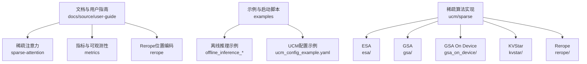
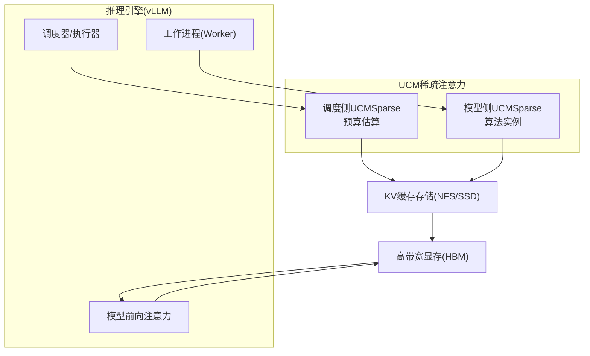
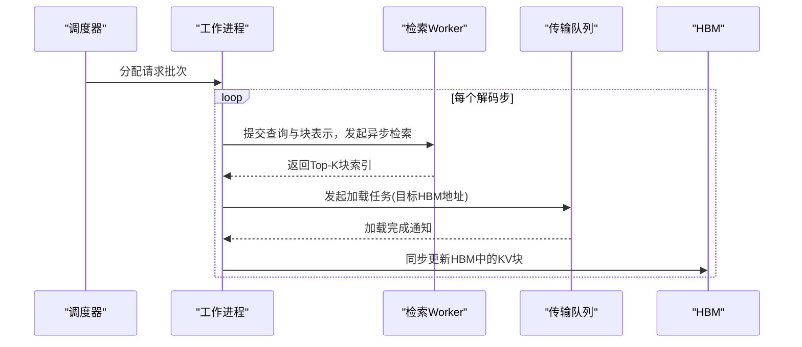
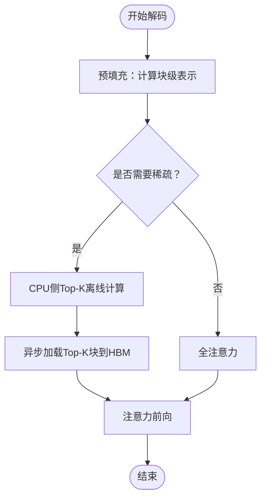
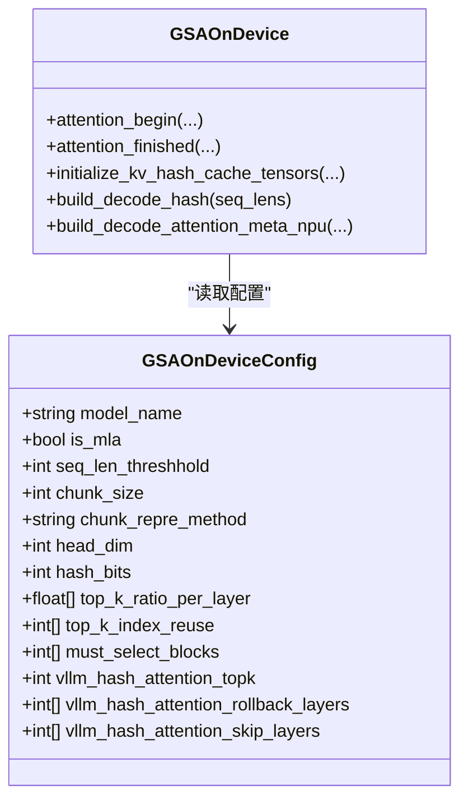
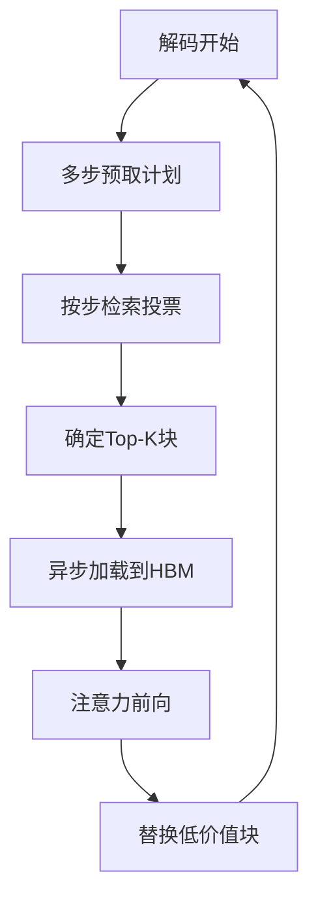
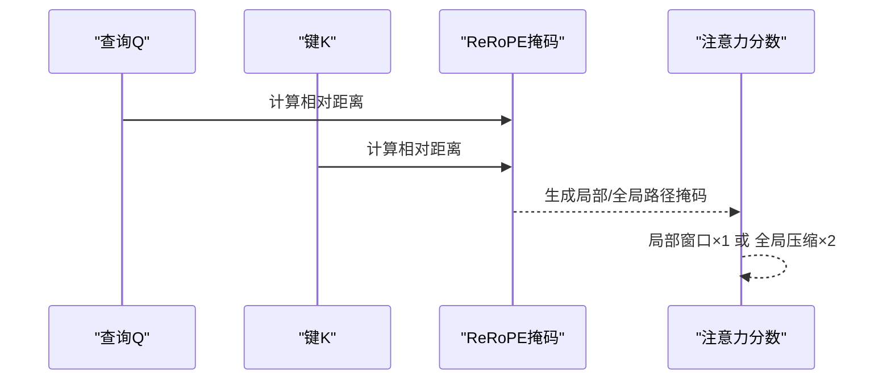
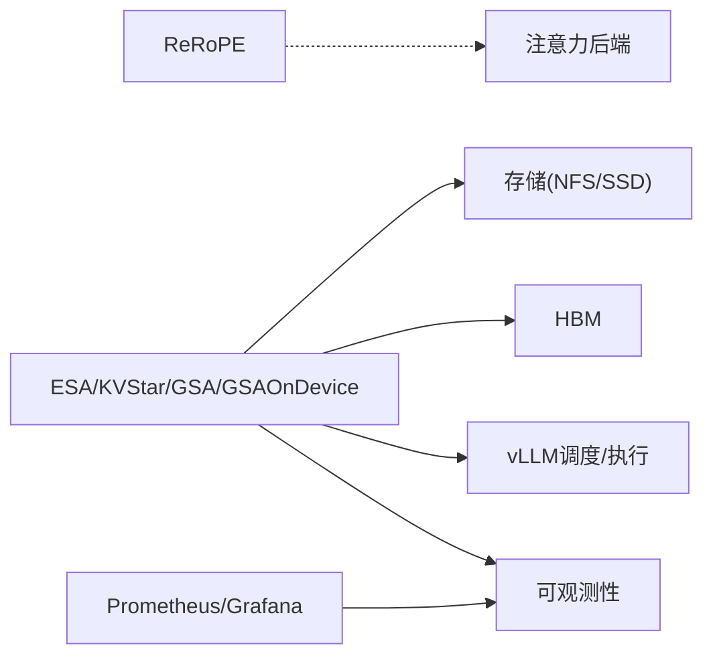

# 稀疏算法调优

<cite>
**本文引用的文件**
- [docs/用户指南/稀疏注意力/index.md](file://docs/source/user-guide/sparse-attention/index.md)
- [docs/用户指南/稀疏注意力/esa.md](file://docs/source/user-guide/sparse-attention/esa.md)
- [docs/用户指南/稀疏注意力/gsa.md](file://docs/source/user-guide/sparse-attention/gsa.md)
- [docs/用户指南/稀疏注意力/kvstar.md](file://docs/source/user-guide/sparse-attention/kvstar.md)
- [docs/用户指南/rerope/rerope.md](file://docs/source/user-guide/rerope/rerope.md)
- [docs/用户指南/指标/指标.md](file://docs/source/user-guide/metrics/metrics.md)
- [examples/offline_inference_esa.py](file://examples/offline_inference_esa.py)
- [examples/offline_inference_gsaondevice.py](file://examples/offline_inference_gsaondevice.py)
- [examples/offline_inference_kvstar.py](file://examples/offline_inference_kvstar.py)
- [examples/offline_inference_rerope.py](file://examples/offline_inference_rerope.py)
- [examples/ucm_config_example.yaml](file://examples/ucm_config_example.yaml)
- [ucm/sparse/esa/esa.py](file://ucm/sparse/esa/esa.py)
- [ucm/sparse/gsa/gsa.py](file://ucm/sparse/gsa/gsa.py)
- [ucm/sparse/gsa_on_device/gsa_on_device.py](file://ucm/sparse/gsa_on_device/gsa_on_device.py)
- [ucm/sparse/gsa_on_device/gsa_on_device_config.py](file://ucm/sparse/gsa_on_device/gsa_on_device_config.py)
- [ucm/sparse/gsa_on_device/configs/gsa_on_device_deepseek_r1_awq_config.json](file://ucm/sparse/gsa_on_device/configs/gsa_on_device_deepseek_r1_awq_config.json)
- [ucm/sparse/gsa_on_device/configs/gsa_on_device_qwen3_32B_config.json](file://ucm/sparse/gsa_on_device/configs/gsa_on_device_qwen3_32B_config.json)
- [ucm/sparse/kvstar/multistep.py](file://ucm/sparse/kvstar/multistep.py)
- [ucm/sparse/rerope/triton_unified_attention_rerope.py](file://ucm/sparse/rerope/triton_unified_attention_rerope.py)
- [benchmarks/logging_perf_test.py](file://benchmarks/logging_perf_test.py)
- [benchmarks/trace_replay.py](file://benchmarks/trace_replay.py)
</cite>

## 目录
1. [简介](#简介)
2. [项目结构](#项目结构)
3. [核心组件](#核心组件)
4. [架构总览](#架构总览)
5. [详细组件分析](#详细组件分析)
6. [依赖关系分析](#依赖关系分析)
7. [性能考量](#性能考量)
8. [故障排查指南](#故障排查指南)
9. [结论](#结论)
10. [附录](#附录)

## 简介
本指南聚焦于UCM稀疏注意力算法的性能调优，覆盖ESA、GSA、GSA On Device、KVStar与Rerope五类方案。文档从参数配置、性能特征、算法选择策略、性能监控与调优流程等方面系统阐述，帮助在不同模型规模、推理场景与硬件条件下，选择最优稀疏注意力组合，并通过可观测性与基准工具实现持续优化。

## 项目结构
UCM将稀疏注意力以模块化方式组织，文档与示例分别位于docs与examples目录；稀疏算法核心实现在ucm/sparse下，按算法拆分子目录，便于独立演进与集成。

图示来源
- [docs/用户指南/稀疏注意力/index.md](file://docs/source/user-guide/sparse-attention/index.md#L1-L46)
- [examples/offline_inference_esa.py](file://examples/offline_inference_esa.py#L1-L167)
- [examples/offline_inference_gsaondevice.py](file://examples/offline_inference_gsaondevice.py#L1-L167)
- [examples/offline_inference_kvstar.py](file://examples/offline_inference_kvstar.py)
- [examples/offline_inference_rerope.py](file://examples/offline_inference_rerope.py)
- [examples/ucm_config_example.yaml](file://examples/ucm_config_example.yaml#L1-L39)
- [ucm/sparse/esa/esa.py](file://ucm/sparse/esa/esa.py)
- [ucm/sparse/gsa/gsa.py](file://ucm/sparse/gsa/gsa.py)
- [ucm/sparse/gsa_on_device/gsa_on_device.py](file://ucm/sparse/gsa_on_device/gsa_on_device.py)
- [ucm/sparse/kvstar/multistep.py](file://ucm/sparse/kvstar/multistep.py)
- [ucm/sparse/rerope/triton_unified_attention_rerope.py](file://ucm/sparse/rerope/triton_unified_attention_rerope.py)

章节来源
- [docs/用户指南/稀疏注意力/index.md](file://docs/source/user-guide/sparse-attention/index.md#L1-L46)

## 核心组件
- ESA（稀疏比例与窗口）
  - 关键参数：init_window_sz、local_window_sz、min_blocks、sparse_ratio、retrieval_stride
  - 特征：块级均值表示、周期性异步检索与加载，适合长上下文与低开销的KV缓存稀疏
- GSA（Top-K与跨硬件支持）
  - 特征：预计算块级得分、CPU侧Top-K离线、解码阶段零开销剪枝；支持NVIDIA GPU与Ascend NPU
  - 配置：ucm_sparse_config中指定GSA即可启用
- GSA On Device（设备内哈希Top-K）
  - 特征：CUDA/NPU设备内哈希编码与Hamming Top-K，MLA/GQA双模式；按模型自动加载配置
  - 关键参数：seq_len_threshhold、chunk_size、hash_bits、vllm_hash_attention_topk、rollback/skip层列表
- KVStar（多步检索与投票）
  - 关键参数：sparse_ratio、retrieval_stride、blk_repre_dim_prune_ratio、blk_repre_inner_token_merge
  - 特征：多步粗粒度检索、多查询投票、低维表示检索，降低CPU瓶颈
- Rerope（位置编码扩展）
  - 特征：局部+全局压缩注意力，可无训练扩展上下文长度；需配合本地窗口平衡吞吐

章节来源
- [docs/用户指南/稀疏注意力/esa.md](file://docs/source/user-guide/sparse-attention/esa.md#L1-L98)
- [docs/用户指南/稀疏注意力/gsa.md](file://docs/source/user-guide/sparse-attention/gsa.md#L1-L152)
- [docs/用户指南/稀疏注意力/kvstar.md](file://docs/source/user-guide/sparse-attention/kvstar.md#L1-L85)
- [docs/用户指南/rerope/rerope.md](file://docs/source/user-guide/rerope/rerope.md#L1-L109)
- [ucm/sparse/gsa_on_device/gsa_on_device.py](file://ucm/sparse/gsa_on_device/gsa_on_device.py#L46-L96)
- [ucm/sparse/gsa_on_device/gsa_on_device_config.py](file://ucm/sparse/gsa_on_device/gsa_on_device_config.py#L36-L279)

## 架构总览
UCM稀疏注意力框架将完整KV缓存卸载至专用存储，仅在解码阶段按算法挑选关键块加载到HBM，异步调度减少重叠延迟，从而在不牺牲精度的前提下显著降低显存占用与带宽压力。

图示来源
- [docs/用户指南/稀疏注意力/index.md](file://docs/source/user-guide/sparse-attention/index.md#L19-L35)

## 详细组件分析

### ESA 组件分析
- 参数与作用
  - init_window_sz/local_window_sz/min_blocks：控制初始与局部窗口大小及最小块数，影响首次上下文覆盖与稳定性
  - sparse_ratio：稀疏比例，决定保留的块占比（如0.2即20%）
  - retrieval_stride：检索周期步长，越小越频繁但更精确
- 处理流程
  - 预填充：全量KV缓存落盘
  - 解码：按stride周期异步检索Top-K块，随后非阻塞加载到HBM，周期末同步更新
- 性能特征
  - 显存占用低，吞吐稳定；对长序列友好，适合高并发与长对话场景

图示来源
- [docs/用户指南/稀疏注意力/esa.md](file://docs/source/user-guide/sparse-attention/esa.md#L44-L75)

章节来源
- [docs/用户指南/稀疏注意力/esa.md](file://docs/source/user-guide/sparse-attention/esa.md#L1-L98)
- [ucm/sparse/esa/esa.py](file://ucm/sparse/esa/esa.py#L521-L552)

### GSA 组件分析
- 参数与作用
  - ucm_sparse_config中指定GSA即可启用；无需额外参数即可运行
- 处理流程
  - 预填充：块级表示预计算
  - 解码：CPU侧Top-K离线计算，零开销剪枝；KV缓存异步卸载与预取
- 性能特征
  - 在HBM受限场景下提升并发与吞吐；支持多平台（GPU/NPU）

图示来源
- [docs/用户指南/稀疏注意力/gsa.md](file://docs/source/user-guide/sparse-attention/gsa.md#L17-L30)

章节来源
- [docs/用户指南/稀疏注意力/gsa.md](file://docs/source/user-guide/sparse-attention/gsa.md#L1-L152)

### GSA On Device 组件分析
- 参数与作用
  - seq_len_threshhold：触发设备内稀疏的最小序列长度
  - chunk_size：块大小（需被128整除）
  - hash_bits/head_dim：哈希维度与头维度
  - vllm_hash_attention_topk：每请求Top-K token数
  - rollback_layers/skip_layers：按层回滚/跳过策略
- 配置加载
  - 自动按模型名匹配对应JSON配置；支持MLA与GQA两种模式
- 处理流程
  - 缓存阶段：对K进行哈希编码并缓存
  - 解码阶段：按查询哈希计算Hamming距离，Top-K块表替换，更新seq_lens与tile调度元数据

图示来源
- [ucm/sparse/gsa_on_device/gsa_on_device_config.py](file://ucm/sparse/gsa_on_device/gsa_on_device_config.py#L36-L279)
- [ucm/sparse/gsa_on_device/gsa_on_device.py](file://ucm/sparse/gsa_on_device/gsa_on_device.py#L99-L154)

章节来源
- [ucm/sparse/gsa_on_device/gsa_on_device.py](file://ucm/sparse/gsa_on_device/gsa_on_device.py#L46-L96)
- [ucm/sparse/gsa_on_device/gsa_on_device.py](file://ucm/sparse/gsa_on_device/gsa_on_device.py#L557-L623)
- [ucm/sparse/gsa_on_device/gsa_on_device.py](file://ucm/sparse/gsa_on_device/gsa_on_device.py#L715-L728)
- [ucm/sparse/gsa_on_device/gsa_on_device_config.py](file://ucm/sparse/gsa_on_device/gsa_on_device_config.py#L36-L279)
- [ucm/sparse/gsa_on_device/configs/gsa_on_device_deepseek_r1_awq_config.json](file://ucm/sparse/gsa_on_device/configs/gsa_on_device_deepseek_r1_awq_config.json#L1-L222)
- [ucm/sparse/gsa_on_device/configs/gsa_on_device_qwen3_32B_config.json](file://ucm/sparse/gsa_on_device/configs/gsa_on_device_qwen3_32B_config.json#L1-L235)

### KVStar 组件分析
- 参数与作用
  - sparse_ratio：保留在设备端的KV比例（如0.25即25%）
  - retrieval_stride：检索频率（步）
  - blk_repre_dim_prune_ratio：块表示降维比例
  - blk_repre_inner_token_merge：检索单元（token级）
- 处理流程
  - 解码：多步预取，CPU多核+SIMD异步检索，投票确定重要块，低频与低带宽交互

图示来源
- [docs/用户指南/稀疏注意力/kvstar.md](file://docs/source/user-guide/sparse-attention/kvstar.md#L3-L26)

章节来源
- [docs/用户指南/稀疏注意力/kvstar.md](file://docs/source/user-guide/sparse-attention/kvstar.md#L1-L85)
- [ucm/sparse/kvstar/multistep.py](file://ucm/sparse/kvstar/multistep.py#L733-L767)

### Rerope 组件分析
- 参数与作用
  - REROPE_WINDOW/TRAINING_LENGTH：窗口与训练长度（通常设为预训练长度）
  - VLLM_USE_REROPE/VLLM_ATTENTION_BACKEND：开启ReRoPE与后端
- 处理流程
  - 根据相对距离构造ReRoPE掩码，分别走局部窗口与全局压缩路径

图示来源
- [docs/用户指南/rerope/rerope.md](file://docs/source/user-guide/rerope/rerope.md#L25-L45)

章节来源
- [docs/用户指南/rerope/rerope.md](file://docs/source/user-guide/rerope/rerope.md#L1-L109)
- [ucm/sparse/rerope/triton_unified_attention_rerope.py](file://ucm/sparse/rerope/triton_unified_attention_rerope.py)

## 依赖关系分析
- 算法选择与耦合
  - ESA与KVStar偏向“检索+异步加载”，适合长序列与高并发
  - GSA侧重“CPU离线Top-K”，在HBM受限时提升吞吐
  - GSA On Device在设备内完成哈希与Top-K，减少主机-设备往返
  - Rerope扩展上下文长度，常与局部窗口结合以平衡吞吐
- 外部依赖
  - vLLM注意力后端（CUDA/NPU）、Prometheus/Grafana指标采集、NFS/SSD存储

图示来源
- [docs/用户指南/稀疏注意力/index.md](file://docs/source/user-guide/sparse-attention/index.md#L19-L35)
- [docs/用户指南/指标/指标.md](file://docs/source/user-guide/metrics/metrics.md#L151-L189)

章节来源
- [docs/用户指南/稀疏注意力/index.md](file://docs/source/user-guide/sparse-attention/index.md#L19-L35)
- [docs/用户指南/指标/指标.md](file://docs/source/user-guide/metrics/metrics.md#L1-L189)

## 性能考量
- 计算效率
  - ESA/KVStar：通过Top-K与多步检索降低注意力计算复杂度
  - GSA：CPU离线Top-K，解码零开销
  - GSA On Device：设备内哈希与Top-K，减少主机-设备通信
  - Rerope：局部+全局两路注意力，需权衡吞吐
- 内存使用
  - ESA/KVStar：仅保留少量块在HBM，显著节省显存
  - GSA On Device：按模型配置的哈希缓存与Top-K序列长度控制显存
- 吞吐量
  - GSA在HBM受限场景下提升并发；KVStar通过低频传输降低带宽占用
- 指标监控
  - 通过Prometheus/Grafana收集ucm:*指标，关注加载/保存耗时、速度与命中率

章节来源
- [docs/用户指南/稀疏注意力/esa.md](file://docs/source/user-guide/sparse-attention/esa.md#L76-L98)
- [docs/用户指南/稀疏注意力/kvstar.md](file://docs/source/user-guide/sparse-attention/kvstar.md#L71-L85)
- [docs/用户指南/指标/指标.md](file://docs/source/user-guide/metrics/metrics.md#L151-L189)

## 故障排查指南
- 常见问题定位
  - 启动失败：检查ucm_sparse_config格式与环境变量（如ENABLE_SPARSE、VLLM_USE_REROPE等）
  - 性能异常：确认retrieval_stride、sparse_ratio、vllm_hash_attention_topk等参数是否合理
  - 设备内稀疏异常：核对chunk_size（需128整除）、seq_len_threshhold与max_model_len约束
- 观测性
  - 启用PROMETHEUS_MULTIPROC_DIR，配置metrics_config_path，访问/v1/metrics查看ucm:*指标
- 基准与复现
  - 使用benchmarks下的日志与Trace回放工具进行对比测试与回归验证

章节来源
- [examples/ucm_config_example.yaml](file://examples/ucm_config_example.yaml#L1-L39)
- [docs/用户指南/指标/指标.md](file://docs/source/user-guide/metrics/metrics.md#L1-L189)
- [benchmarks/logging_perf_test.py](file://benchmarks/logging_perf_test.py#L1-L181)
- [benchmarks/trace_replay.py](file://benchmarks/trace_replay.py#L1-L748)

## 结论
针对不同模型规模与硬件条件，建议采用“ESA/KVStar优先覆盖长序列与高并发，GSA在HBM受限时提升吞吐，GSA On Device在设备内完成哈希与Top-K以减少往返，Rerope扩展上下文长度并结合局部窗口”的组合策略。通过Prometheus/Grafana与基准工具持续观测与迭代，逐步收敛到最优参数配置。

## 附录

### 算法参数与性能特征对照
- ESA
  - 关键参数：init_window_sz、local_window_sz、min_blocks、sparse_ratio、retrieval_stride
  - 特征：低显存占用、周期性异步检索
- GSA
  - 关键参数：ucm_sparse_config中GSA项（无需额外参数）
  - 特征：CPU离线Top-K、零开销解码、跨平台
- GSA On Device
  - 关键参数：seq_len_threshhold、chunk_size、hash_bits、vllm_hash_attention_topk、rollback/skip层
  - 特征：设备内哈希与Top-K、MLA/GQA双模式
- KVStar
  - 关键参数：sparse_ratio、retrieval_stride、blk_repre_dim_prune_ratio、blk_repre_inner_token_merge
  - 特征：多步检索、多查询投票、低维表示
- Rerope
  - 关键参数：REROPE_WINDOW、TRAINING_LENGTH、VLLM_USE_REROPE、VLLM_ATTENTION_BACKEND
  - 特征：局部+全局注意力路径

章节来源
- [docs/用户指南/稀疏注意力/esa.md](file://docs/source/user-guide/sparse-attention/esa.md#L18-L42)
- [docs/用户指南/稀疏注意力/gsa.md](file://docs/source/user-guide/sparse-attention/gsa.md#L81-L137)
- [docs/用户指南/稀疏注意力/kvstar.md](file://docs/source/user-guide/sparse-attention/kvstar.md#L30-L67)
- [docs/用户指南/rerope/rerope.md](file://docs/source/user-guide/rerope/rerope.md#L57-L94)
- [ucm/sparse/gsa_on_device/gsa_on_device_config.py](file://ucm/sparse/gsa_on_device/gsa_on_device_config.py#L36-L279)

### 算法选择策略
- 小/中模型 + HBM充足：优先Rerope+局部窗口，或ESA/KVStar
- 大模型 + HBM受限：优先GSA或GSA On Device
- 高并发长对话：优先KVStar或ESA
- 需要无训练扩展超长上下文：优先Rerope并结合局部窗口

章节来源
- [docs/用户指南/稀疏注意力/index.md](file://docs/source/user-guide/sparse-attention/index.md#L19-L35)

### 性能监控与指标
- 指标类别：加载/保存请求数、块数、耗时、速度；查找命中率
- 采集方式：设置PROMETHEUS_MULTIPROC_DIR，配置metrics_config_path，访问/v1/metrics
- 可视化：Grafana导入示例仪表板

章节来源
- [docs/用户指南/指标/指标.md](file://docs/source/user-guide/metrics/metrics.md#L151-L189)

### 参数调优流程与最佳实践
- 渐进式调优
  - 固定其他参数，逐项调整稀疏比例、stride、Top-K等
  - 以吞吐、TTFT、ITL、E2EL等指标为反馈
- A/B测试
  - 对比不同算法在同一数据集上的端到端指标
  - 使用benchmarks/trace_replay.py回放真实流量，评估稳定性
- 最佳实践
  - 先用ESA/KVStar验证可行性，再引入GSA/GSA On Device
  - 结合Rerope时，确保REROPE_WINDOW与模型预训练长度一致
  - 严格校验chunk_size、vllm_hash_attention_topk与block_size的整除关系

章节来源
- [benchmarks/trace_replay.py](file://benchmarks/trace_replay.py#L684-L748)
- [ucm/sparse/gsa_on_device/gsa_on_device.py](file://ucm/sparse/gsa_on_device/gsa_on_device.py#L141-L154)