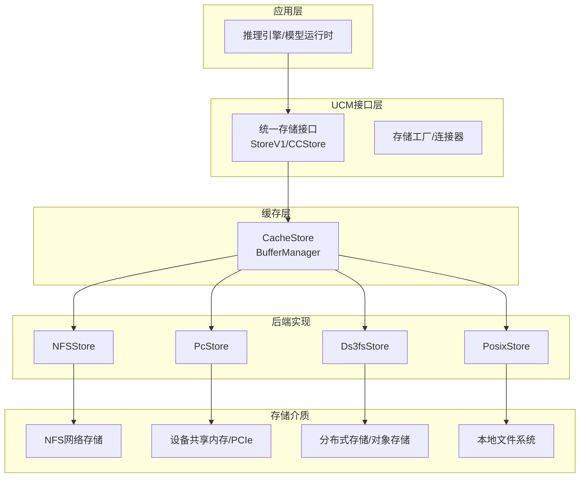
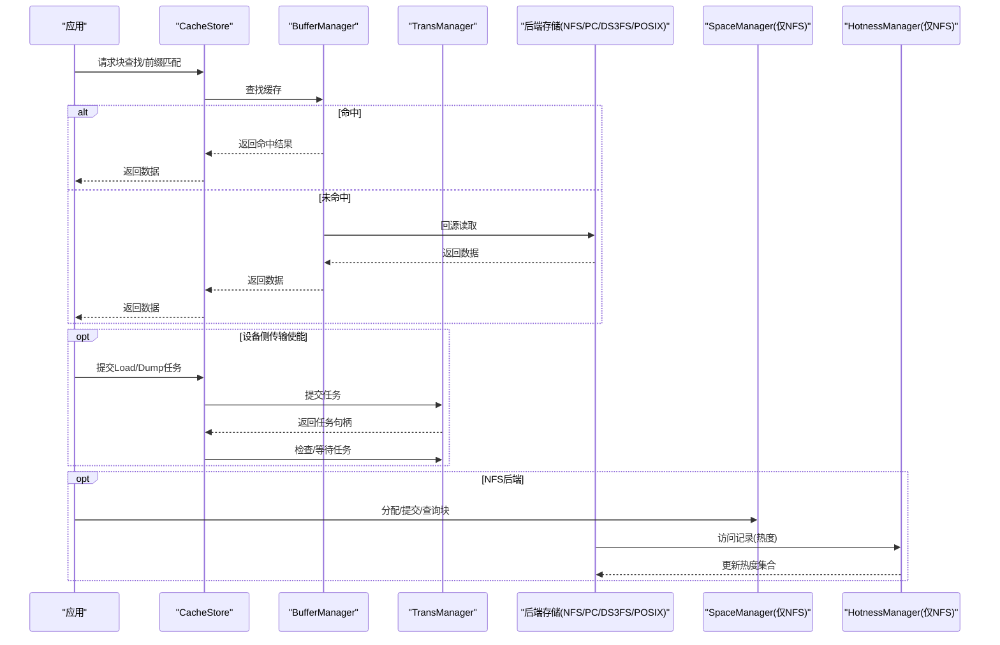
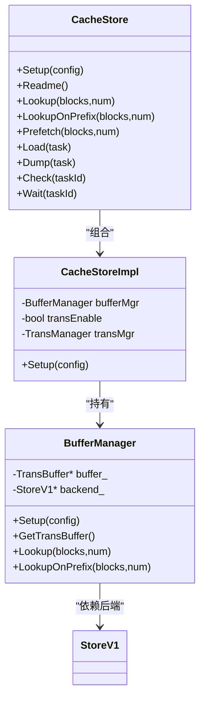
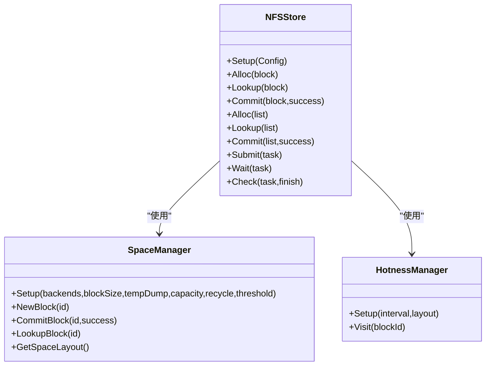
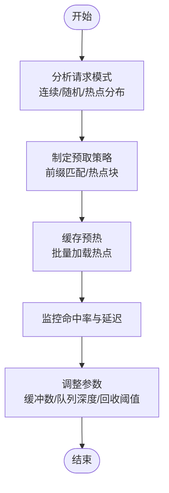
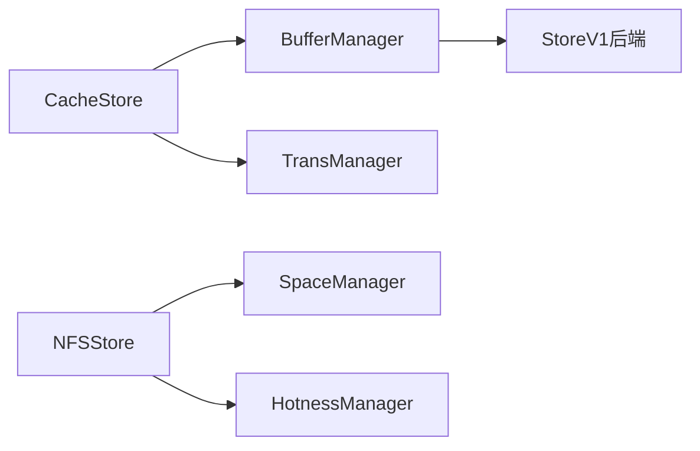

# 缓存优化

<cite>
**本文引用的文件**
- [cache_store.h](file://ucm/store/cache/cc/cache_store.h)
- [cache_store.cc](file://ucm/store/cache/cc/cache_store.cc)
- [buffer_manager.h](file://ucm/store/cache/cc/buffer_manager.h)
- [types.h](file://ucm/store/detail/type/types.h)
- [nfsstore.h](file://ucm/store/nfsstore/cc/api/nfsstore.h)
- [pcstore.h](file://ucm/store/pcstore/cc/api/pcstore.h)
- [ds3fs_store.h](file://ucm/store/ds3fs/cc/ds3fs_store.h)
- [posix_store.h](file://ucm/store/posix/cc/posix_store.h)
- [space_manager.h](file://ucm/store/nfsstore/cc/domain/space/space_manager.h)
- [hotness_manager.h](file://ucm/store/nfsstore/cc/domain/hotness/hotness_manager.h)
- [space_property.h](file://ucm/store/nfsstore/cc/domain/space/space_property.h)
- [ucm_config_example.yaml](file://examples\ucm_config_example.yaml)
</cite>

## 目录
1. [引言](#引言)
2. [项目结构](#项目结构)
3. [核心组件](#核心组件)
4. [架构总览](#架构总览)
5. [详细组件分析](#详细组件分析)
6. [依赖关系分析](#依赖关系分析)
7. [性能考量与优化建议](#性能考量与优化建议)
8. [故障排查指南](#故障排查指南)
9. [结论](#结论)
10. [附录：配置参数与调优清单](#附录配置参数与调优清单)

## 引言
本指南聚焦于UCM（Unified Cache Management）的KV缓存优化，系统阐述缓存工作原理、缓存策略选择（大小、淘汰、预取）、不同存储后端（NFS、PC、DS3FS等）的性能特征与优化方法，以及命中率提升、内存使用优化（含HBM/DRAM分层与压缩思路）、具体参数调整建议与性能对比分析路径。目标是帮助读者在真实部署中实现稳定、高效且可扩展的KV缓存体系。

## 项目结构
UCM围绕“统一存储接口”抽象出多种后端实现，并通过缓存层对上层提供一致的KV块访问能力。关键目录与职责概览如下：
- 存储抽象与工厂：统一接口定义与工厂方法，便于按需切换后端
- 缓存层：在设备侧或主机侧提供缓冲区，加速块查找与回填
- 后端实现：NFS、PC、DS3FS、POSIX等，分别面向网络存储、设备间共享内存、分布式存储与本地文件系统
- 热度管理与空间回收：针对NFS后端的空间布局、容量与热度感知服务
- 配置示例：YAML配置样例，展示如何启用UCM与指标采集

图表来源
- [cache_store.h](file://ucm/store/cache/cc/cache_store.h#L33-L48)
- [buffer_manager.h](file://ucm/store/cache/cc/buffer_manager.h#L34-L60)
- [nfsstore.h](file://ucm/store/nfsstore/cc/api/nfsstore.h#L32-L96)
- [pcstore.h](file://ucm/store/pcstore/cc/api/pcstore.h#L32-L91)
- [ds3fs_store.h](file://ucm/store/ds3fs/cc/ds3fs_store.h#L33-L47)
- [posix_store.h](file://ucm/store/posix/cc/posix_store.h#L33-L48)

章节来源
- [cache_store.h](file://ucm/store/cache/cc/cache_store.h#L33-L48)
- [cache_store.cc](file://ucm/store/cache/cc/cache_store.cc#L108-L129)
- [buffer_manager.h](file://ucm/store/cache/cc/buffer_manager.h#L49-L59)
- [nfsstore.h](file://ucm/store/nfsstore/cc/api/nfsstore.h#L32-L96)
- [pcstore.h](file://ucm/store/pcstore/cc/api/pcstore.h#L32-L91)
- [ds3fs_store.h](file://ucm/store/ds3fs/cc/ds3fs_store.h#L33-L47)
- [posix_store.h](file://ucm/store/posix/cc/posix_store.h#L33-L48)

## 核心组件
- 统一存储接口与工厂
  - StoreV1/CCStore抽象了块ID、任务描述、加载/转储/检查/等待等通用能力，便于在不同后端间无缝切换
  - 工厂/连接器负责根据配置实例化具体后端（如NFS、PC、DS3FS、POSIX）
- 缓存层（CacheStore）
  - 提供BufferManager进行快速命中检测与回源查询；支持设备侧传输使能时的任务提交与状态检查
  - 关键参数：唯一ID、设备ID、张量/分片/块大小、缓冲数量、队列深度、超时等
- 后端实现
  - NFSStore：支持多后端、容量与回收、热度感知、临时转储目录、IO直通等
  - PcStore：面向设备间共享内存/PCIe场景，支持直通IO、流数量、缓冲数、分段聚合等
  - Ds3fsStore：面向分布式存储文件系统，提供加载/转储等基础能力
  - PosixStore：面向本地文件系统，提供基础KV读写与队列管理

章节来源
- [types.h](file://ucm/store/detail/type/types.h#L33-L65)
- [cache_store.h](file://ucm/store/cache/cc/cache_store.h#L33-L48)
- [cache_store.cc](file://ucm/store/cache/cc/cache_store.cc#L108-L129)
- [buffer_manager.h](file://ucm/store/cache/cc/buffer_manager.h#L49-L59)
- [nfsstore.h](file://ucm/store/nfsstore/cc/api/nfsstore.h#L34-L61)
- [pcstore.h](file://ucm/store/pcstore/cc/api/pcstore.h#L34-L56)
- [ds3fs_store.h](file://ucm/store/ds3fs/cc/ds3fs_store.h#L33-L47)
- [posix_store.h](file://ucm/store/posix/cc/posix_store.h#L33-L48)

## 架构总览
下图展示了从应用到缓存再到后端存储的整体流程，以及关键控制点（配置校验、传输使能、队列深度、容量回收、热度感知）：

图表来源
- [cache_store.cc](file://ucm/store/cache/cc/cache_store.cc#L133-L181)
- [buffer_manager.h](file://ucm/store/cache/cc/buffer_manager.h#L61-L122)
- [nfsstore.h](file://ucm/store/nfsstore/cc/api/nfsstore.h#L64-L93)
- [space_manager.h](file://ucm/store/nfsstore/cc/domain/space/space_manager.h#L35-L55)
- [hotness_manager.h](file://ucm/store/nfsstore/cc/domain/hotness/hotness_manager.h#L36-L71)

## 详细组件分析

### 缓存层（CacheStore + BufferManager）
- 工作原理
  - BufferManager在命中时直接返回，未命中时回源后端读取，并将结果写回缓存以提升后续命中率
  - 支持前缀匹配的快速路径，减少不必要的回源
- 关键参数与影响
  - 唯一ID：用于区分不同缓存实例，避免跨实例污染
  - 设备ID：-1表示无设备侧传输；>=0时启用传输管理器，支持异步加载/转储
  - 张量/分片/块大小：决定数据切分粒度与内存占用
  - 缓冲数量：直接影响并发命中与回源压力
  - 队列深度：等待队列与运行队列过小会导致阻塞与吞吐下降
  - 超时：控制任务等待上限，防止长时间阻塞
- 性能特性
  - 命中路径极短，未命中路径受后端I/O与网络延迟主导
  - 传输使能可显著降低CPU轮询与拷贝开销，但需要合理配置流数量与缓冲数

图表来源
- [cache_store.h](file://ucm/store/cache/cc/cache_store.h#L33-L48)
- [cache_store.cc](file://ucm/store/cache/cc/cache_store.cc#L34-L104)
- [buffer_manager.h](file://ucm/store/cache/cc/buffer_manager.h#L34-L60)

章节来源
- [cache_store.cc](file://ucm/store/cache/cc/cache_store.cc#L108-L129)
- [buffer_manager.h](file://ucm/store/cache/cc/buffer_manager.h#L61-L122)

### 后端实现与存储介质特性

#### NFSStore（网络文件系统）
- 能力与配置要点
  - 多后端链路、容量与回收、临时转储目录、IO直通、热度感知、回收阈值等
  - 空间管理包含布局、属性与回收策略，支持容量上限与阈值触发清理
  - 热度管理通过定时器与集合维护访问序列，驱动空间回收与优先级调度
- 性能特征
  - 延迟主要来自网络与服务器端I/O；适合大容量、低频更新场景
  - IO直通与合适的IO大小可降低内核态切换成本
  - 热度感知有助于保留热点数据，减少冷数据占用
- 优化建议
  - 合理设置容量与回收阈值，避免频繁回收导致抖动
  - 打开IO直通并选择合适IO大小，结合传输流数量平衡吞吐与延迟
  - 开启热度感知并设置合理的采样间隔

图表来源
- [nfsstore.h](file://ucm/store/nfsstore/cc/api/nfsstore.h#L32-L96)
- [space_manager.h](file://ucm/store/nfsstore/cc/domain/space/space_manager.h#L35-L55)
- [hotness_manager.h](file://ucm/store/nfsstore/cc/domain/hotness/hotness_manager.h#L36-L71)

章节来源
- [nfsstore.h](file://ucm/store/nfsstore/cc/api/nfsstore.h#L34-L61)
- [space_manager.h](file://ucm/store/nfsstore/cc/domain/space/space_manager.h#L37-L54)
- [hotness_manager.h](file://ucm/store/nfsstore/cc/domain/hotness/hotness_manager.h#L38-L71)

#### PcStore（设备共享内存/PCIe）
- 能力与配置要点
  - 支持直通IO、流数量、缓冲数、分段聚合、本地rank大小、唯一ID等
  - 适用于设备间高带宽、低延迟的数据搬运场景
- 性能特征
  - 传输路径短、延迟低，适合高频次、小块数据的KV缓存
  - 合理的流数量与缓冲数可最大化带宽利用率
- 优化建议
  - 根据设备带宽与拓扑调整流数量与缓冲数
  - 启用分段聚合以减少系统调用次数
  - 使用唯一ID隔离不同实例，避免竞争

章节来源
- [pcstore.h](file://ucm/store/pcstore/cc/api/pcstore.h#L34-L56)

#### Ds3fsStore（分布式存储文件系统）
- 能力与配置要点
  - 提供基础的加载/转储与检查/等待能力，适合作为分布式KV缓存后端
- 性能特征
  - 受网络与对象存储服务SLA影响较大，适合大规模、跨地域部署
- 优化建议
  - 结合NFSStore的容量与回收策略，在上层做预取与热点管理
  - 控制单次传输块大小，避免过大导致拥塞

章节来源
- [ds3fs_store.h](file://ucm/store/ds3fs/cc/ds3fs_store.h#L33-L47)

#### PosixStore（本地文件系统）
- 能力与配置要点
  - 提供基础KV读写与队列管理，适合本地缓存或离线场景
- 性能特征
  - 本地SSD/磁盘延迟低，适合顺序/随机读写混合负载
- 优化建议
  - 合理设置块大小与队列深度，避免过多小文件碎片
  - 对于频繁更新场景，考虑开启IO直通与合适的IO大小

章节来源
- [posix_store.h](file://ucm/store/posix/cc/posix_store.h#L33-L48)

### 请求模式与命中率优化
- 请求模式分析
  - 连续访问：利用前缀匹配快速判定连续命中范围，减少回源次数
  - 热点集中：结合热度感知与空间回收，优先保留热点区域
  - 预取策略：在推理阶段提前发起回源请求，降低首帧延迟
- 缓存预热
  - 在推理开始前批量加载热点块，确保缓存“热身”
  - 预估块大小与缓冲数量，避免预热过程造成内存压力
- 热点数据管理
  - 通过热度集合与定时器周期性更新，动态调整回收策略
  - 对于长尾数据，采用保守回收阈值，避免误删

图表来源
- [buffer_manager.h](file://ucm/store/cache/cc/buffer_manager.h#L105-L122)
- [hotness_manager.h](file://ucm/store/nfsstore/cc/domain/hotness/hotness_manager.h#L46-L63)

## 依赖关系分析
- 组件耦合
  - CacheStore依赖BufferManager与可选的TransManager；BufferManager依赖StoreV1后端
  - NFSStore内部依赖SpaceManager与HotnessManager，形成空间与热度闭环
- 外部依赖
  - IO直通、分段聚合、设备侧传输等特性依赖底层硬件与驱动
- 潜在风险
  - 队列深度过小导致阻塞
  - 缓冲数量不足引发频繁回源
  - 回收阈值不当导致抖动或内存耗尽

图表来源
- [cache_store.cc](file://ucm/store/cache/cc/cache_store.cc#L34-L59)
- [buffer_manager.h](file://ucm/store/cache/cc/buffer_manager.h#L34-L46)
- [nfsstore.h](file://ucm/store/nfsstore/cc/api/nfsstore.h#L64-L93)
- [space_manager.h](file://ucm/store/nfsstore/cc/domain/space/space_manager.h#L35-L55)
- [hotness_manager.h](file://ucm/store/nfsstore/cc/domain/hotness/hotness_manager.h#L36-L71)

## 性能考量与优化建议

### 缓存大小与队列深度
- 缓冲数量
  - 建议根据并发请求数与块大小估算，确保至少覆盖峰值活跃块
  - 避免过小导致频繁回源，过大则增加内存占用与GC压力
- 队列深度
  - 等待队列与运行队列均需大于1，避免阻塞与饥饿
  - 结合设备侧传输流数量，平衡吞吐与延迟

章节来源
- [cache_store.cc](file://ucm/store/cache/cc/cache_store.cc#L63-L85)

### 淘汰策略与容量管理（NFS）
- 容量与回收
  - 设置合理的容量上限与回收阈值，避免频繁触发回收
  - 结合热度感知，优先保留热点区域，降低冷数据占用
- 空间布局
  - 利用空间布局与分片策略，提升局部性与回收效率

章节来源
- [space_manager.h](file://ucm/store/nfsstore/cc/domain/space/space_manager.h#L37-L54)
- [space_property.h](file://ucm/store/nfsstore/cc/domain/space/space_property.h#L33-L47)

### 预取机制
- 前缀匹配
  - 利用前缀匹配快速定位连续命中范围，减少回源
- 主动回源
  - 在推理阶段预测下一窗口的块，提前发起回源请求
- 参数建议
  - 预取窗口大小与命中率目标相匹配，避免过度预取造成内存压力

章节来源
- [buffer_manager.h](file://ucm/store/cache/cc/buffer_manager.h#L105-L122)

### 不同存储后端的缓存优化方法
- NFS
  - 打开IO直通与合适的IO大小；启用热度感知与容量回收
  - 合理设置临时转储目录，避免与主存储争抢
- PC（设备共享内存/PCIe）
  - 增加传输流数量与缓冲数，启用分段聚合
  - 使用唯一ID隔离实例，避免跨实例竞争
- DS3FS
  - 控制单次传输块大小，结合NFS的容量与回收策略
- POSIX
  - 合理设置块大小与队列深度，避免碎片化

章节来源
- [nfsstore.h](file://ucm/store/nfsstore/cc/api/nfsstore.h#L34-L61)
- [pcstore.h](file://ucm/store/pcstore/cc/api/pcstore.h#L34-L56)
- [ds3fs_store.h](file://ucm/store/ds3fs/cc/ds3fs_store.h#L33-L47)
- [posix_store.h](file://ucm/store/posix/cc/posix_store.h#L33-L48)

### 内存使用优化（HBM/DRAM分层与压缩）
- 分层策略
  - 将热点块优先驻留于高带宽内存（如HBM），冷数据下沉至DRAM
  - 结合热度感知与容量回收，动态迁移
- 压缩技术
  - 对重复度高或可无损压缩的数据进行压缩，降低内存占用与带宽消耗
  - 注意压缩/解压开销与CPU占用，避免成为瓶颈
- 缓冲与队列
  - 合理设置缓冲数量与队列深度，避免内存碎片与抖动

章节来源
- [hotness_manager.h](file://ucm/store/nfsstore/cc/domain/hotness/hotness_manager.h#L46-L63)
- [space_manager.h](file://ucm/store/nfsstore/cc/domain/space/space_manager.h#L37-L54)

### 具体配置参数调整建议
- CacheStore
  - 唯一ID：确保实例隔离
  - 设备ID：>=0启用传输；-1关闭传输
  - 张量/分片/块大小：与模型KV张量匹配
  - 缓冲数量：≥1024；根据并发与块大小评估
  - 队列深度：等待/运行均>1
  - 超时：根据后端SLA设定
- NFSStore
  - 多后端链路、容量上限、回收阈值、IO直通、热度间隔
- PcStore
  - 直通IO、流数量、缓冲数、分段聚合、本地rank大小
- 示例配置参考
  - 使用YAML配置文件指定连接器名称与后端路径等

章节来源
- [cache_store.cc](file://ucm/store/cache/cc/cache_store.cc#L110-L121)
- [nfsstore.h](file://ucm/store/nfsstore/cc/api/nfsstore.h#L34-L61)
- [pcstore.h](file://ucm/store/pcstore/cc/api/pcstore.h#L34-L56)
- [ucm_config_example.yaml](file://examples\ucm_config_example.yaml#L10-L18)

## 故障排查指南
- 常见问题与定位
  - 传输未启用：检查设备ID与传输使能开关
  - 队列阻塞：检查等待/运行队列深度与任务超时
  - 回源失败：检查后端路径、权限与网络连通性
  - 命中率低：分析请求模式，优化预取与前缀匹配
  - 内存压力：调整缓冲数量与回收阈值，必要时启用压缩
- 日志与指标
  - 启用UCM日志与指标（如Grafana/Prometheus），持续监控命中率、延迟与内存使用

章节来源
- [cache_store.cc](file://ucm/store/cache/cc/cache_store.cc#L151-L156)
- [buffer_manager.h](file://ucm/store/cache/cc/buffer_manager.h#L41-L46)

## 结论
通过在缓存层引入BufferManager与可选的设备侧传输，配合NFSStore的空间与热度管理，UCM能够在不同存储后端上实现稳定高效的KV缓存。优化的关键在于：合理配置缓存大小与队列深度、实施预取与前缀匹配、结合热度感知进行容量回收、针对不同后端（NFS/PC/DS3FS/POSIX）采取差异化策略，并在内存层面采用分层与压缩技术。最终以可观测性为保障，持续迭代参数与策略，获得最佳的吞吐与延迟表现。

## 附录：配置参数与调优清单
- CacheStore
  - 唯一ID、设备ID、张量/分片/块大小、缓冲数量、队列深度、超时
- NFSStore
  - 多后端链路、容量上限、回收阈值、IO直通、热度间隔、临时转储目录
- PcStore
  - 直通IO、流数量、缓冲数、分段聚合、本地rank大小、唯一ID
- DS3FS/POSIX
  - 块大小、队列深度、IO大小、直通开关
- 示例
  - 使用YAML配置文件指定连接器与后端路径

章节来源
- [cache_store.cc](file://ucm/store/cache/cc/cache_store.cc#L110-L121)
- [nfsstore.h](file://ucm/store/nfsstore/cc/api/nfsstore.h#L34-L61)
- [pcstore.h](file://ucm/store/pcstore/cc/api/pcstore.h#L34-L56)
- [ucm_config_example.yaml](file://examples\ucm_config_example.yaml#L10-L18)