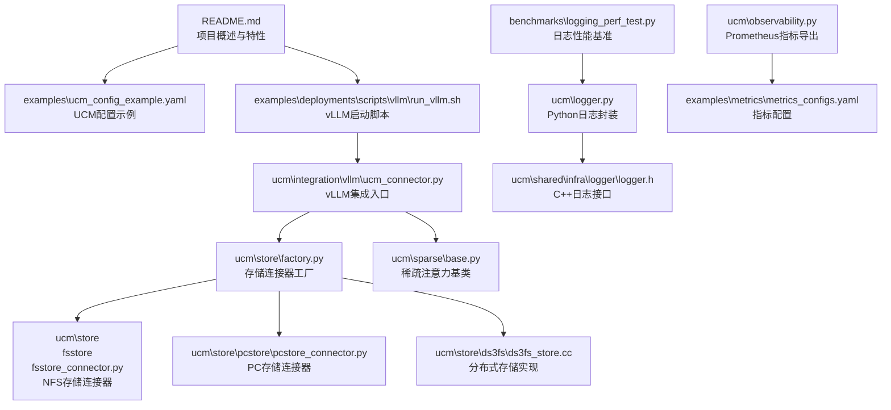
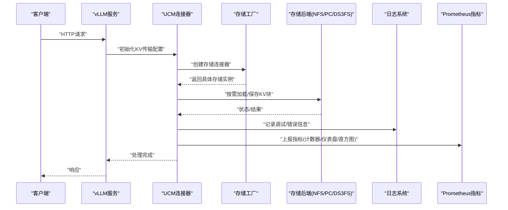
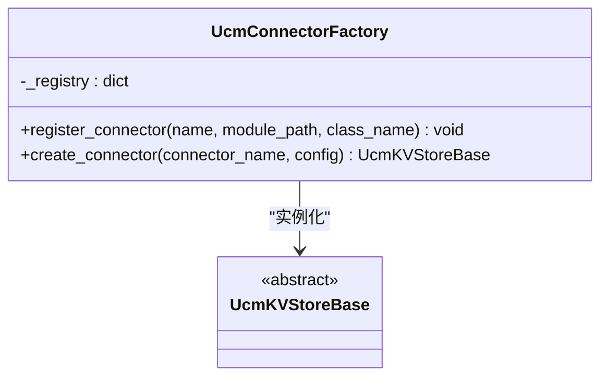
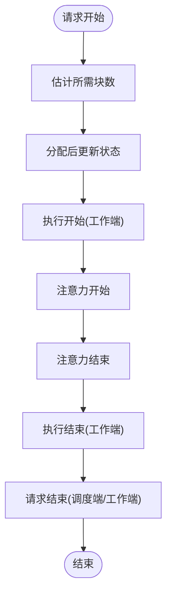
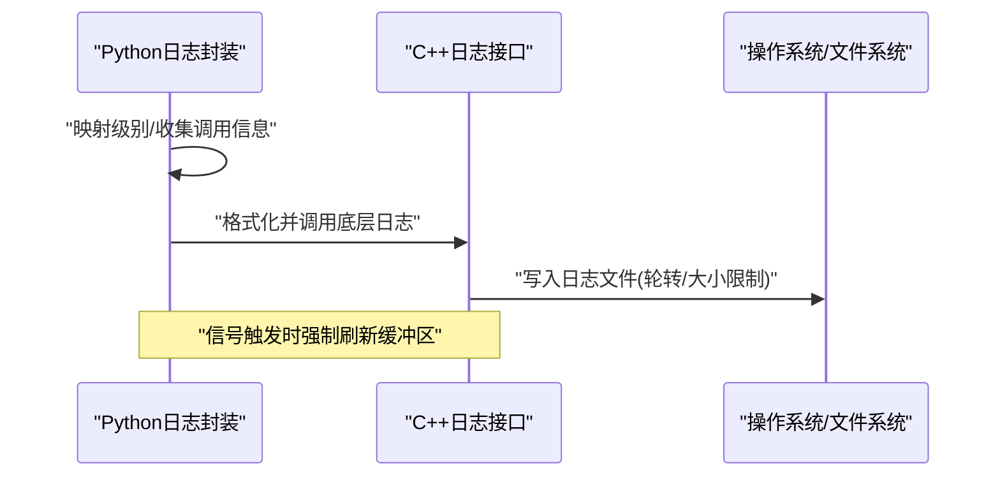
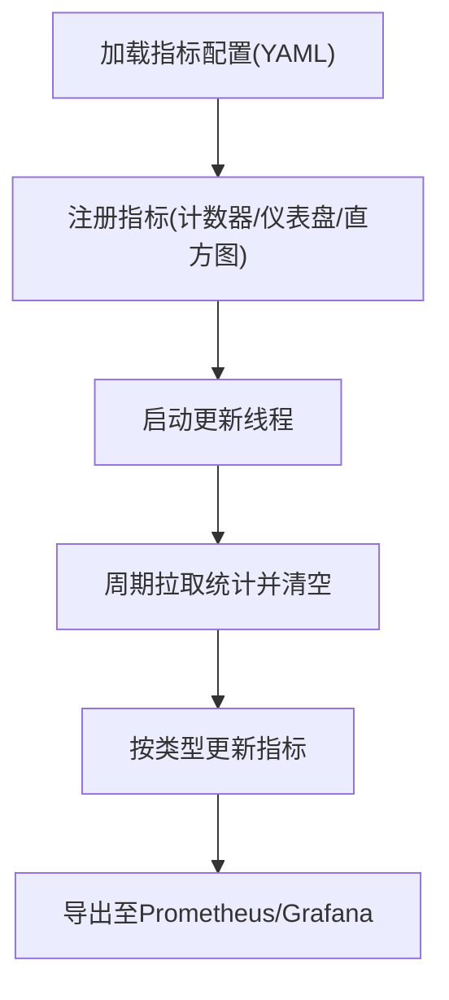
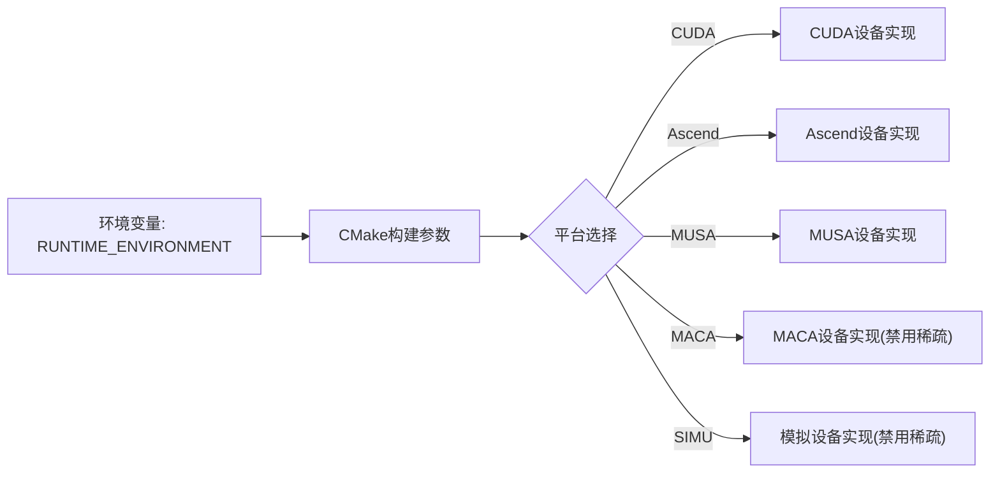
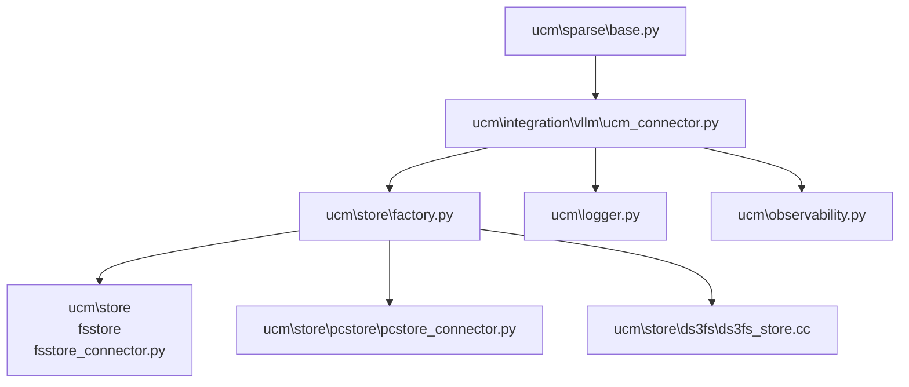
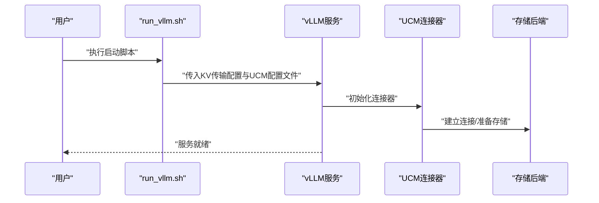

# 故障排除

<cite>
**本文引用的文件**
- [README.md](file://README.md)
- [setup.py](file://setup.py)
- [examples\ucm_config_example.yaml](file://examples\ucm_config_example.yaml)
- [test\config.yaml](file://test\config.yaml)
- [ucm\logger.py](file://ucm\logger.py)
- [ucm\observability.py](file://ucm\observability.py)
- [ucm\store\factory.py](file://ucm\store\factory.py)
- [ucm\sparse\base.py](file://ucm\sparse\base.py)
- [ucm\store\nfsstore\device\CMakeLists.txt](file://ucm\store\nfsstore\device\CMakeLists.txt)
- [ucm\store\nfsstore\device\musa\musa_device.mu](file://ucm\store\nfsstore\device\musa\musa_device.mu)
- [ucm\store\nfsstore\device\musa\musa_device.cc](file://ucm\store\nfsstore\device\musa\musa_device.cc)
- [ucm\store\ds3fs\cc\trans_queue.h](file://ucm\store\ds3fs\cc\trans_queue.h)
- [benchmarks\logging_perf_test.py](file://benchmarks\logging_perf_test.py)
- [examples\deployments\scripts\vllm\run_vllm.sh](file://examples\deployments\scripts\vllm\run_vllm.sh)
</cite>

## 目录
1. [简介](#简介)
2. [项目结构](#项目结构)
3. [核心组件](#核心组件)
4. [架构总览](#架构总览)
5. [详细组件分析](#详细组件分析)
6. [依赖关系分析](#依赖关系分析)
7. [性能考虑](#性能考虑)
8. [故障排除指南](#故障排除指南)
9. [结论](#结论)
10. [附录](#附录)

## 简介
本指南面向UCM（Unified Cache Manager）用户与维护者，提供系统化的故障排除方法与最佳实践。内容覆盖安装与构建问题、配置错误、性能瓶颈、兼容性问题、日志与可观测性、性能调优、社区支持与问题报告模板，以及版本升级与迁移注意事项。所有建议均基于仓库中的实际实现与脚本，确保可操作与可验证。

## 项目结构
UCM采用模块化设计，围绕“缓存连接器”“稀疏注意力算法”“外部存储后端”“可观测性与日志”等核心模块组织。部署侧通过vLLM集成脚本启动服务，并在运行时加载UCM配置与指标导出。

**图表来源**
- [README.md](file://README.md#L14-L72)
- [examples\ucm_config_example.yaml](file://examples\ucm_config_example.yaml#L1-L39)
- [examples\deployments\scripts\vllm\run_vllm.sh](file://examples\deployments\scripts\vllm\run_vllm.sh#L1-L116)
- [ucm\store\factory.py](file://ucm\store\factory.py#L34-L71)
- [ucm\sparse\base.py](file://ucm\sparse\base.py#L127-L323)
- [ucm\logger.py](file://ucm\logger.py#L40-L84)
- [ucm\observability.py](file://ucm\observability.py#L40-L197)

**章节来源**
- [README.md](file://README.md#L14-L72)
- [examples\ucm_config_example.yaml](file://examples\ucm_config_example.yaml#L1-L39)
- [examples\deployments\scripts\vllm\run_vllm.sh](file://examples\deployments\scripts\vllm\run_vllm.sh#L1-L116)

## 核心组件
- 存储连接器工厂：负责注册与实例化不同存储后端（如NFS、PC、DS3FS），并进行日志记录与异常处理。
- 稀疏注意力基类：定义调度端与工作端的钩子接口，用于在推理流程中插入KV缓存加载/保存与注意力计算。
- 日志系统：统一的日志封装与底层C++日志接口，支持多进程与信号安全刷新。
- 可观测性：基于Prometheus的指标采集与导出，支持从YAML配置动态注册指标。
- 配置文件：UCM配置示例与测试配置，涵盖存储后端、指标路径、带宽阈值等关键参数。

**章节来源**
- [ucm\store\factory.py](file://ucm\store\factory.py#L34-L71)
- [ucm\sparse\base.py](file://ucm\sparse\base.py#L127-L323)
- [ucm\logger.py](file://ucm\logger.py#L40-L84)
- [ucm\observability.py](file://ucm\observability.py#L40-L197)
- [examples\ucm_config_example.yaml](file://examples\ucm_config_example.yaml#L1-L39)
- [test\config.yaml](file://test\config.yaml#L1-L48)

## 架构总览
下图展示从vLLM到UCM再到存储后端的数据流与控制流，以及日志与指标的注入点。

**图表来源**
- [examples\deployments\scripts\vllm\run_vllm.sh](file://examples\deployments\scripts\vllm\run_vllm.sh#L99-L107)
- [ucm\store\factory.py](file://ucm\store\factory.py#L50-L57)
- [ucm\logger.py](file://ucm\logger.py#L49-L69)
- [ucm\observability.py](file://ucm\observability.py#L165-L186)

## 详细组件分析

### 存储连接器工厂与注册机制
- 工厂模式：通过名称映射延迟导入类，避免不必要的模块加载。
- 异常处理：不支持的类型会抛出明确错误；重复注册会报错。
- 日志记录：成功创建连接器时输出信息日志，便于排障定位。

**图表来源**
- [ucm\store\factory.py](file://ucm\store\factory.py#L34-L58)

**章节来源**
- [ucm\store\factory.py](file://ucm\store\factory.py#L34-L71)

### 稀疏注意力基类与生命周期钩子
- 调度端钩子：请求开始、分配后更新状态、请求结束等，用于估算块数量与生成元数据。
- 工作端钩子：模型执行前后、注意力前后、FFN前后、层前后等，用于在推理关键路径插入KV加载/保存。
- 元数据绑定：在工作端执行前绑定调度端生成的元数据，保证跨进程一致性。

**图表来源**
- [ucm\sparse\base.py](file://ucm\sparse\base.py#L287-L323)

**章节来源**
- [ucm\sparse\base.py](file://ucm\sparse\base.py#L127-L323)

### 日志系统与信号处理
- Python层：统一映射日志级别，自动填充调用文件/行号/函数名，调用底层C++日志接口。
- C++层：支持异步日志、信号捕获（段错误、中断等）触发刷新，避免崩溃时丢失日志。
- 性能基准：提供日志写入性能对比脚本，便于评估日志开销。

**图表来源**
- [ucm\logger.py](file://ucm\logger.py#L49-L69)
- [ucm\shared\infra\logger\logger.h](file://ucm\shared\infra\logger\logger.h#L30-L45)

**章节来源**
- [ucm\logger.py](file://ucm\logger.py#L40-L84)
- [benchmarks\logging_perf_test.py](file://benchmarks\logging_perf_test.py#L1-L124)

### 可观测性与指标导出
- 配置加载：从YAML读取指标定义，支持默认值与容错。
- 指标类型：计数器、仪表盘、直方图，动态注册并绑定标签。
- 多进程：设置Prometheus多进程目录，避免竞态。
- 循环更新：周期性从内部统计池拉取并清空，批量上报。

**图表来源**
- [ucm\observability.py](file://ucm\observability.py#L42-L97)
- [ucm\observability.py](file://ucm\observability.py#L165-L186)

**章节来源**
- [ucm\observability.py](file://ucm\observability.py#L40-L197)

### 平台与设备兼容性
- 构建参数：通过环境变量选择运行平台（CUDA/Ascend/MUSA/MACA/模拟），并据此启用或禁用稀疏功能。
- 设备适配：各平台设备实现封装了API调用与错误码处理，失败时记录详细上下文。
- DS3FS：IO队列与NUMA感知的IO单元池，提供IO大小、深度与队列管理。

**图表来源**
- [setup.py](file://setup.py#L112-L124)
- [ucm\store\nfsstore\device\CMakeLists.txt](file://ucm\store\nfsstore\device\CMakeLists.txt#L1-L19)

**章节来源**
- [setup.py](file://setup.py#L109-L124)
- [ucm\store\nfsstore\device\CMakeLists.txt](file://ucm\store\nfsstore\device\CMakeLists.txt#L1-L19)
- [ucm\store\nfsstore\device\musa\musa_device.mu](file://ucm\store\nfsstore\device\musa\musa_device.mu#L94-L105)
- [ucm\store\nfsstore\device\musa\musa_device.cc](file://ucm\store\nfsstore\device\musa\musa_device.cc#L135-L144)
- [ucm\store\ds3fs\cc\trans_queue.h](file://ucm\store\ds3fs\cc\trans_queue.h#L131-L153)

## 依赖关系分析
- 组件耦合：存储工厂对具体存储实现采用延迟导入，降低耦合；稀疏基类通过钩子解耦调度与执行逻辑。
- 外部依赖：Prometheus客户端、YAML解析、CMake构建链路、平台SDK（CUDA/MUSA等）。
- 潜在循环：未见直接循环依赖；日志与指标模块通过接口调用，无反向依赖。

**图表来源**
- [ucm\sparse\base.py](file://ucm\sparse\base.py#L127-L323)
- [ucm\store\factory.py](file://ucm\store\factory.py#L34-L71)
- [ucm\logger.py](file://ucm\logger.py#L40-L84)
- [ucm\observability.py](file://ucm\observability.py#L40-L197)

**章节来源**
- [ucm\sparse\base.py](file://ucm\sparse\base.py#L127-L323)
- [ucm\store\factory.py](file://ucm\store\factory.py#L34-L71)

## 性能考虑
- 日志开销：使用轮转文件与固定大小限制，避免无限增长；可通过基准脚本评估不同日志路径的吞吐差异。
- 指标更新频率：合理设置指标更新间隔，避免频繁拉取造成CPU占用。
- 存储I/O：DS3FS的IO大小与队列深度影响吞吐；NUMA感知可减少跨NUMA访问。
- 平台选择：在非CUDA平台禁用稀疏可减少编译与运行时复杂度；MUSA/MACA平台设备实现提供同步/异步拷贝封装。

**章节来源**
- [benchmarks\logging_perf_test.py](file://benchmarks\logging_perf_test.py#L1-L124)
- [ucm\observability.py](file://ucm\observability.py#L67-L71)
- [ucm\store\ds3fs\cc\trans_queue.h](file://ucm\store\ds3fs\cc\trans_queue.h#L138-L153)

## 故障排除指南

### 安装与构建问题
- 症状：构建时提示未设置平台环境变量或平台无效。
  - 原因：构建脚本要求显式设置运行平台。
  - 解决：设置环境变量为cuda/ascend/musa/maca之一；CI场景可忽略。
  - 参考：[setup.py](file://setup.py#L41-L66)、[setup.py](file://setup.py#L112-L124)
- 症状：平台选择导致稀疏功能被禁用。
  - 原因：某些平台在构建时会禁用稀疏。
  - 解决：确认目标平台是否支持稀疏；必要时切换到支持平台。
  - 参考：[setup.py](file://setup.py#L119-L124)
- 症状：设备目标未创建或子目录缺失。
  - 原因：RUNTIME_ENVIRONMENT与子目录不匹配。
  - 解决：检查CMakeLists与子目录命名一致性。
  - 参考：[ucm\store\nfsstore\device\CMakeLists.txt](file://ucm\store\nfsstore\device\CMakeLists.txt#L11-L19)

**章节来源**
- [setup.py](file://setup.py#L41-L66)
- [setup.py](file://setup.py#L112-L124)
- [ucm\store\nfsstore\device\CMakeLists.txt](file://ucm\store\nfsstore\device\CMakeLists.txt#L11-L19)

### 配置错误
- 症状：UCM未生效或日志为空。
  - 排查：确认vLLM启动脚本已传入KV传输配置与UCM配置文件路径。
  - 参考：[examples\deployments\scripts\vllm\run_vllm.sh](file://examples\deployments\scripts\vllm\run_vllm.sh#L99-L107)
- 症状：存储后端路径不可用或权限不足。
  - 排查：核对UCM配置中的存储路径与访问权限；检查NFS挂载状态。
  - 参考：[examples\ucm_config_example.yaml](file://examples\ucm_config_example.yaml#L13-L15)
- 症状：指标未上报或Grafana无数据。
  - 排查：确认指标配置文件存在且格式正确；检查多进程目录是否存在并可写。
  - 参考：[ucm\observability.py](file://ucm\observability.py#L42-L58)、[ucm\observability.py](file://ucm\observability.py#L73-L78)

**章节来源**
- [examples\deployments\scripts\vllm\run_vllm.sh](file://examples\deployments\scripts\vllm\run_vllm.sh#L99-L107)
- [examples\ucm_config_example.yaml](file://examples\ucm_config_example.yaml#L13-L15)
- [ucm\observability.py](file://ucm\observability.py#L42-L58)
- [ucm\observability.py](file://ucm\observability.py#L73-L78)

### 性能问题
- 症状：日志写入成为瓶颈。
  - 排查：使用日志性能基准脚本对比不同日志路径；调整轮转策略与日志级别。
  - 参考：[benchmarks\logging_perf_test.py](file://benchmarks\logging_perf_test.py#L102-L124)
- 症状：指标更新过于频繁导致CPU升高。
  - 排查：增大指标更新间隔；仅保留关键指标。
  - 参考：[ucm\observability.py](file://ucm\observability.py#L67-L68)
- 症状：存储I/O延迟高。
  - 排查：检查DS3FS的IO大小、队列深度与NUMA亲和；确认网络/磁盘带宽。
  - 参考：[ucm\store\ds3fs\cc\trans_queue.h](file://ucm\store\ds3fs\cc\trans_queue.h#L138-L153)

**章节来源**
- [benchmarks\logging_perf_test.py](file://benchmarks\logging_perf_test.py#L102-L124)
- [ucm\observability.py](file://ucm\observability.py#L67-L68)
- [ucm\store\ds3fs\cc\trans_queue.h](file://ucm\store\ds3fs\cc\trans_queue.h#L138-L153)

### 兼容性问题
- 症状：MUSA/MACA平台设备调用失败。
  - 排查：查看设备实现中的错误码打印与返回状态；确认驱动/SDK版本。
  - 参考：[ucm\store\nfsstore\device\musa\musa_device.mu](file://ucm\store\nfsstore\device\musa\musa_device.mu#L94-L105)、[ucm\store\nfsstore\device\musa\musa_device.cc](file://ucm\store\nfsstore\device\musa\musa_device.cc#L135-L144)
- 症状：CUDA平台稀疏功能不可用。
  - 排查：确认构建参数与环境变量设置；必要时重新安装。
  - 参考：[setup.py](file://setup.py#L112-L124)

**章节来源**
- [ucm\store\nfsstore\device\musa\musa_device.mu](file://ucm\store\nfsstore\device\musa\musa_device.mu#L94-L105)
- [ucm\store\nfsstore\device\musa\musa_device.cc](file://ucm\store\nfsstore\device\musa\musa_device.cc#L135-L144)
- [setup.py](file://setup.py#L112-L124)

### 系统化诊断方法
- 日志分析
  - 步骤：定位日志目录与轮转文件；结合信号处理行为确认崩溃时日志完整性；使用Python/C++日志接口输出调用位置。
  - 参考：[ucm\logger.py](file://ucm\logger.py#L49-L69)、[ucm\shared\infra\logger\logger.h](file://ucm\shared\infra\logger\logger.h#L30-L45)
- 性能监控
  - 步骤：启用指标配置；在Grafana中查看关键指标；根据更新频率调整采样间隔。
  - 参考：[ucm\observability.py](file://ucm\observability.py#L60-L97)
- 环境检查
  - 步骤：确认平台变量、存储路径、网络/NAS可用性；核对vLLM启动参数与UCM配置。
  - 参考：[examples\deployments\scripts\vllm\run_vllm.sh](file://examples\deployments\scripts\vllm\run_vllm.sh#L19-L44)、[examples\ucm_config_example.yaml](file://examples\ucm_config_example.yaml#L13-L15)

**章节来源**
- [ucm\logger.py](file://ucm\logger.py#L49-L69)
- [ucm\shared\infra\logger\logger.h](file://ucm\shared\infra\logger\logger.h#L30-L45)
- [ucm\observability.py](file://ucm\observability.py#L60-L97)
- [examples\deployments\scripts\vllm\run_vllm.sh](file://examples\deployments\scripts\vllm\run_vllm.sh#L19-L44)
- [examples\ucm_config_example.yaml](file://examples\ucm_config_example.yaml#L13-L15)

### 错误信息与解决步骤
- “不支持的连接器类型”
  - 含义：工厂未注册该名称。
  - 解决：检查连接器名称与注册表；确保模块路径正确。
  - 参考：[ucm\store\factory.py](file://ucm\store\factory.py#L53-L54)
- “配置文件不存在/解析错误”
  - 含义：指标配置YAML缺失或格式错误。
  - 解决：修复路径或格式；使用默认配置回退。
  - 参考：[ucm\observability.py](file://ucm\observability.py#L53-L58)
- “设备API错误/返回码”
  - 含义：平台设备调用失败。
  - 解决：根据错误字符串与调用点排查驱动/SDK/权限问题。
  - 参考：[ucm\store\nfsstore\device\musa\musa_device.mu](file://ucm\store\nfsstore\device\musa\musa_device.mu#L94-L105)

**章节来源**
- [ucm\store\factory.py](file://ucm\store\factory.py#L53-L54)
- [ucm\observability.py](file://ucm\observability.py#L53-L58)
- [ucm\store\nfsstore\device\musa\musa_device.mu](file://ucm\store\nfsstore\device\musa\musa_device.mu#L94-L105)

### 版本升级与迁移
- 升级要点
  - 平台变量：确认新版本对RUNTIME_ENVIRONMENT的支持范围。
  - 稀疏功能：关注平台差异导致的功能启用/禁用变化。
  - 配置文件：遵循UCM配置示例与指标配置规范。
- 迁移建议
  - 逐步替换存储后端；先在测试环境验证指标与日志输出。
  - 对照稀疏算法钩子接口，确保调度端/工作端实现一致。

**章节来源**
- [setup.py](file://setup.py#L112-L124)
- [examples\ucm_config_example.yaml](file://examples\ucm_config_example.yaml#L1-L39)

### 社区支持与问题报告
- 获取帮助
  - GitHub Issues：技术问题与功能请求。
  - 微信讨论群：扫码加入。
- 问题报告模板（建议字段）
  - 环境信息：操作系统、Python版本、平台变量、硬件型号。
  - 复现步骤：最小可复现命令/脚本与配置。
  - 期望行为与实际行为：简述预期与观察到的结果。
  - 日志与指标：附上关键日志片段与指标截图。
  - 附加信息：相关配置文件路径、版本信息、是否在CI中出现。

**章节来源**
- [README.md](file://README.md#L84-L89)

## 结论
通过系统化的安装检查、配置校验、日志与指标分析、性能基准测试与平台兼容性排查，可快速定位并解决UCM在部署与运行中的常见问题。建议在生产环境中启用可观测性与日志轮转，并在升级前做好小规模验证与备份。

## 附录

### 关键流程图：vLLM启动与UCM集成

**图表来源**
- [examples\deployments\scripts\vllm\run_vllm.sh](file://examples\deployments\scripts\vllm\run_vllm.sh#L99-L107)