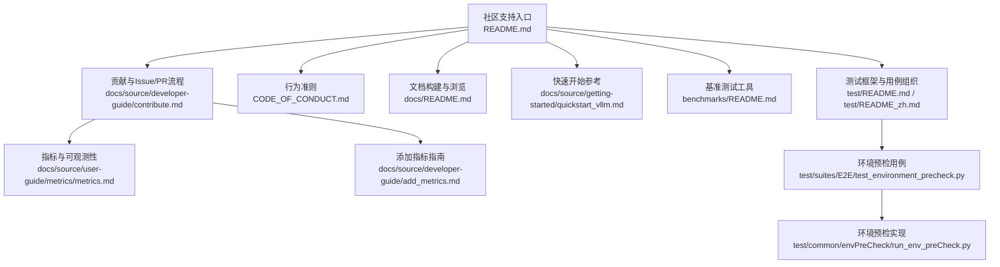
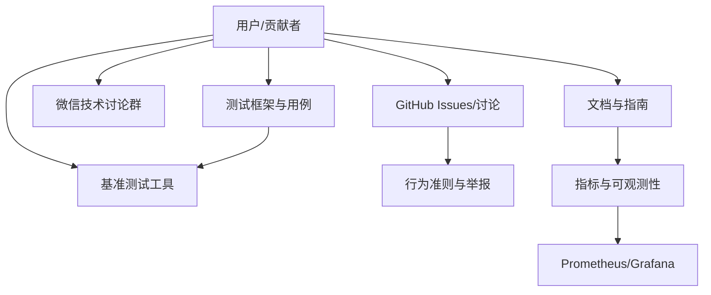
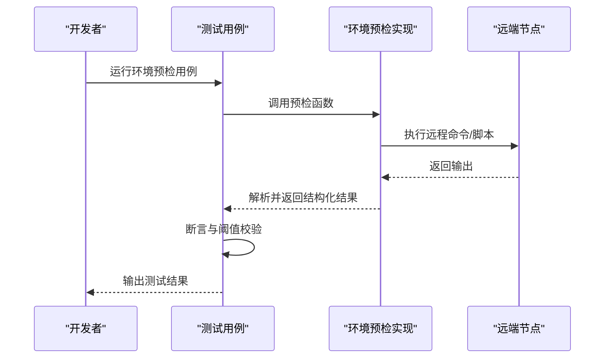
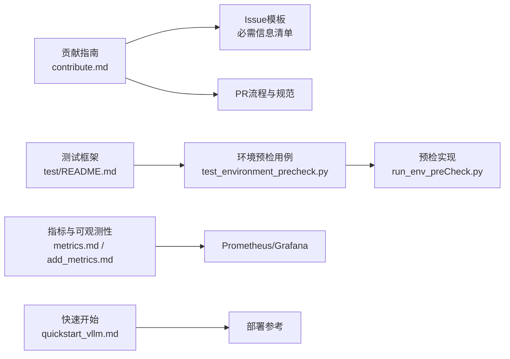

# 社区支持

<cite>
**本文引用的文件**
- [README.md](file://README.md)
- [CODE_OF_CONDUCT.md](file://CODE_OF_CONDUCT.md)
- [docs/README.md](file://docs/README.md)
- [docs/source/developer-guide/contribute.md](file://docs/source/developer-guide/contribute.md)
- [docs/source/developer-guide/add_metrics.md](file://docs/source/developer-guide/add_metrics.md)
- [docs/source/user-guide/metrics/metrics.md](file://docs/source/user-guide/metrics/metrics.md)
- [docs/source/about.md](file://docs/source/about.md)
- [docs/source/getting-started/quickstart_vllm.md](file://docs/source/getting-started/quickstart_vllm.md)
- [benchmarks/README.md](file://benchmarks/README.md)
- [test/README.md](file://test/README.md)
- [test/README_zh.md](file://test/README_zh.md)
- [test/suites/E2E/test_environment_precheck.py](file://test/suites/E2E/test_environment_precheck.py)
- [test/common/envPreCheck/run_env_preCheck.py](file://test/common/envPreCheck/run_envPreCheck.py)
</cite>

## 目录
1. [简介](#简介)
2. [项目结构](#项目结构)
3. [核心组件](#核心组件)
4. [架构总览](#架构总览)
5. [详细组件分析](#详细组件分析)
6. [依赖关系分析](#依赖关系分析)
7. [性能注意事项](#性能注意事项)
8. [故障排查指南](#故障排查指南)
9. [结论](#结论)
10. [附录](#附录)

## 简介
本指南面向UCM社区用户与贡献者，提供获取社区帮助的渠道、标准问题报告模板与必需信息清单、贡献代码与文档的流程、许可证与行为准则、技术支持联系方式与响应预期，以及常见社区礼仪与沟通规范。内容来源于仓库中的官方文档与测试/基准脚本，确保信息准确且可追溯。

## 项目结构
围绕“社区支持”主题，与本指南直接相关的文档与测试/基准脚本主要分布在以下位置：
- 顶层说明与联系方式：README.md
- 行为准则：CODE_OF_CONDUCT.md
- 文档构建与浏览：docs/README.md
- 贡献指南与Issue/PR流程：docs/source/developer-guide/contribute.md
- 指标采集与可观测性：docs/source/developer-guide/add_metrics.md、docs/source/user-guide/metrics/metrics.md
- 快速开始与部署参考：docs/source/getting-started/quickstart_vllm.md
- 基准测试工具：benchmarks/README.md
- 测试框架与用例组织：test/README.md、test/README_zh.md、test/suites/E2E/test_environment_precheck.py、test/common/envPreCheck/run_env_preCheck.py

**图表来源**
- [README.md](file://README.md#L84-L93)
- [docs/source/developer-guide/contribute.md](file://docs/source/developer-guide/contribute.md#L23-L36)
- [CODE_OF_CONDUCT.md](file://CODE_OF_CONDUCT.md#L60-L69)
- [docs/README.md](file://docs/README.md#L1-L21)
- [docs/source/user-guide/metrics/metrics.md](file://docs/source/user-guide/metrics/metrics.md#L1-L70)
- [docs/source/developer-guide/add_metrics.md](file://docs/source/developer-guide/add_metrics.md#L1-L31)
- [docs/source/getting-started/quickstart_vllm.md](file://docs/source/getting-started/quickstart_vllm.md#L1-L20)
- [benchmarks/README.md](file://benchmarks/README.md#L1-L20)
- [test/README.md](file://test/README.md#L1-L20)
- [test/README_zh.md](file://test/README_zh.md#L1-L20)
- [test/suites/E2E/test_environment_precheck.py](file://test/suites/E2E/test_environment_precheck.py#L1-L30)
- [test/common/envPreCheck/run_env_preCheck.py](file://test/common/envPreCheck/run_envPreCheck.py#L1-L40)

**章节来源**
- [README.md](file://README.md#L84-L93)
- [docs/README.md](file://docs/README.md#L1-L21)

## 核心组件
- 社区支持渠道
  - GitHub Issues：技术问题与功能请求
  - 微信技术讨论群：扫码加入
- 行为准则与举报渠道
  - 行为准则覆盖范围与违规处理流程
  - 违规举报邮箱与处理时限承诺
- 贡献与协作
  - Issue提交模板与必要信息清单
  - PR流程、代码风格与测试要求
- 观测性与指标
  - Prometheus/Grafana集成与指标说明
  - 添加新指标的步骤与示例
- 快速开始与部署
  - vLLM集成与启动示例
- 基准测试与测试框架
  - TraceReplay基准工具与关键指标
  - 测试用例组织与标记系统

**章节来源**
- [README.md](file://README.md#L84-L93)
- [CODE_OF_CONDUCT.md](file://CODE_OF_CONDUCT.md#L60-L69)
- [docs/source/developer-guide/contribute.md](file://docs/source/developer-guide/contribute.md#L23-L36)
- [docs/source/user-guide/metrics/metrics.md](file://docs/source/user-guide/metrics/metrics.md#L1-L70)
- [docs/source/developer-guide/add_metrics.md](file://docs/source/developer-guide/add_metrics.md#L1-L31)
- [docs/source/getting-started/quickstart_vllm.md](file://docs/source/getting-started/quickstart_vllm.md#L144-L237)
- [benchmarks/README.md](file://benchmarks/README.md#L1-L40)
- [test/README.md](file://test/README.md#L1-L40)
- [test/README_zh.md](file://test/README_zh.md#L1-L40)

## 架构总览
下图展示社区支持相关组件之间的交互关系：用户通过GitHub Issues与微信群获取帮助；贡献者遵循贡献指南提交Issue/PR；可观测性组件提供指标与监控；测试与基准工具支撑问题定位与验证。

**图表来源**
- [README.md](file://README.md#L84-L93)
- [CODE_OF_CONDUCT.md](file://CODE_OF_CONDUCT.md#L60-L69)
- [docs/source/developer-guide/contribute.md](file://docs/source/developer-guide/contribute.md#L23-L36)
- [docs/source/user-guide/metrics/metrics.md](file://docs/source/user-guide/metrics/metrics.md#L70-L150)
- [benchmarks/README.md](file://benchmarks/README.md#L1-L40)
- [test/README.md](file://test/README.md#L1-L40)

## 详细组件分析

### 社区支持渠道与联系方式
- GitHub Issues：用于技术问题与功能请求
- 微信技术讨论群：提供实时交流与答疑
- 联系方式与二维码展示于项目README中，便于快速接入

**章节来源**
- [README.md](file://README.md#L84-L93)

### 行为准则与举报处理
- 行为准则涵盖承诺、标准、执法职责、适用范围与执行细则
- 违规举报邮箱与处理时限承诺，保障社区健康氛围

**章节来源**
- [CODE_OF_CONDUCT.md](file://CODE_OF_CONDUCT.md#L60-L69)

### Issue提交模板与必需信息清单
- 标题：简洁明确的问题摘要
- 环境信息：设备、推理框架版本、包版本、操作系统等
- 复现步骤：清晰编号的可重复步骤
- 预期与实际行为：对比说明
- 错误信息/日志：控制台输出或日志片段
- 视觉证据（可选）：截图或短录屏
- 严重程度：影响级别（高/中/低）

**章节来源**
- [docs/source/developer-guide/contribute.md](file://docs/source/developer-guide/contribute.md#L23-L36)

### Pull Request流程与代码规范
- 分支与工作流：Fork、创建分支、实现变更、本地Lint检查
- 代码风格：Python遵循PEP 8，C++遵循Google C++ Style Guide
- 工具链：black、isort、codespell、clang-format
- 提交规范：标题前缀分类（特性、修复、优化、构建、CI、文档、测试、杂项）
- 审查流程：代码所有者审批、同行评审、CI通过、禁止自审与强制合并

**章节来源**
- [docs/source/developer-guide/contribute.md](file://docs/source/developer-guide/contribute.md#L38-L120)

### 文档贡献与构建
- 文档构建命令与依赖安装
- 在浏览器中打开本地文档进行预览

**章节来源**
- [docs/README.md](file://docs/README.md#L5-L21)

### 指标与可观测性
- Prometheus多进程目录设置与指标配置路径
- vLLM集成示例与/指标端点访问
- Docker Compose快速搭建Prometheus与Grafana
- Grafana仪表板导入与指标面板配置
- 新增指标的YAML定义与API更新方法

**章节来源**
- [docs/source/user-guide/metrics/metrics.md](file://docs/source/user-guide/metrics/metrics.md#L1-L150)
- [docs/source/developer-guide/add_metrics.md](file://docs/source/developer-guide/add_metrics.md#L1-L90)

### 快速开始与部署参考
- vLLM集成与补丁应用
- 配置文件示例与特征开关
- 离线与在线API两种推理模式的启动示例

**章节来源**
- [docs/source/getting-started/quickstart_vllm.md](file://docs/source/getting-started/quickstart_vllm.md#L1-L237)

### 基准测试工具
- TraceReplay工具：重放真实请求轨迹或动态生成请求
- 关键指标：首Token时间、每Token时间、端到端延迟、吞吐量等
- 使用示例与结果输出

**章节来源**
- [benchmarks/README.md](file://benchmarks/README.md#L1-L129)

### 测试框架与用例组织
- pytest自动化测试框架：配置管理、数据库集成、HTML报告生成
- 多维标记系统：stage、feature、platform
- 测试用例命名约定与参数化
- Fixture使用与数据采集导出

**章节来源**
- [test/README.md](file://test/README.md#L1-L236)
- [test/README_zh.md](file://test/README_zh.md#L1-L237)

### 环境预检与问题定位
- 环境预检用例：SSH免密登录、设备状态检查、连通性测试、TLS检查、模型权重校验、带宽检查
- 远程执行脚本与解析输出，统一结果结构
- 断言与阈值控制，辅助定位部署与硬件问题

**图表来源**
- [test/suites/E2E/test_environment_precheck.py](file://test/suites/E2E/test_environment_precheck.py#L1-L120)
- [test/common/envPreCheck/run_env_preCheck.py](file://test/common/envPreCheck/run_envPreCheck.py#L320-L420)

**章节来源**
- [test/suites/E2E/test_environment_precheck.py](file://test/suites/E2E/test_environment_precheck.py#L1-L267)
- [test/common/envPreCheck/run_envPreCheck.py](file://test/common/envPreCheck/run_envPreCheck.py#L1-L200)

## 依赖关系分析
- 社区支持依赖于文档与测试基础设施：贡献指南与Issue模板指导问题上报；测试与基准工具支撑问题复现与验证
- 观测性组件为问题诊断提供数据基础：指标与监控端点、Grafana仪表板
- 快速开始文档为问题复现提供一致的部署参考

**图表来源**
- [docs/source/developer-guide/contribute.md](file://docs/source/developer-guide/contribute.md#L23-L120)
- [test/README.md](file://test/README.md#L1-L120)
- [test/suites/E2E/test_environment_precheck.py](file://test/suites/E2E/test_environment_precheck.py#L1-L120)
- [test/common/envPreCheck/run_envPreCheck.py](file://test/common/envPreCheck/run_envPreCheck.py#L1-L120)
- [docs/source/user-guide/metrics/metrics.md](file://docs/source/user-guide/metrics/metrics.md#L1-L150)
- [docs/source/developer-guide/add_metrics.md](file://docs/source/developer-guide/add_metrics.md#L1-L90)
- [docs/source/getting-started/quickstart_vllm.md](file://docs/source/getting-started/quickstart_vllm.md#L1-L120)

**章节来源**
- [docs/source/developer-guide/contribute.md](file://docs/source/developer-guide/contribute.md#L23-L120)
- [test/README.md](file://test/README.md#L1-L120)
- [test/suites/E2E/test_environment_precheck.py](file://test/suites/E2E/test_environment_precheck.py#L1-L120)
- [test/common/envPreCheck/run_envPreCheck.py](file://test/common/envPreCheck/run_envPreCheck.py#L1-L120)
- [docs/source/user-guide/metrics/metrics.md](file://docs/source/user-guide/metrics/metrics.md#L1-L150)
- [docs/source/developer-guide/add_metrics.md](file://docs/source/developer-guide/add_metrics.md#L1-L90)
- [docs/source/getting-started/quickstart_vllm.md](file://docs/source/getting-started/quickstart_vllm.md#L1-L120)

## 性能注意事项
- 使用基准测试工具收集关键指标，结合观测性指标进行对比分析
- 在生产环境中启用Prefix Cache以降低推理延迟
- 通过测试框架的标记系统选择性运行用例，聚焦性能瓶颈

[本节为通用建议，不直接分析具体文件]

## 故障排查指南
- 环境预检用例覆盖SSH、设备状态、连通性、TLS、模型权重与带宽等关键环节，断言失败通常指向部署或硬件问题
- 通过测试框架的参数化与标记系统缩小问题范围
- 结合观测性指标与基准测试结果定位性能退化

**章节来源**
- [test/suites/E2E/test_environment_precheck.py](file://test/suites/E2E/test_environment_precheck.py#L1-L267)
- [test/common/envPreCheck/run_envPreCheck.py](file://test/common/envPreCheck/run_envPreCheck.py#L1-L200)
- [test/README.md](file://test/README.md#L100-L200)
- [benchmarks/README.md](file://benchmarks/README.md#L80-L129)

## 结论
本指南整合了UCM社区支持与协作的关键流程：从问题上报、贡献参与、可观测性与测试验证，到部署参考与基准工具使用。建议在提交Issue前先查阅文档与测试用例，准备充分的环境信息与复现步骤，以便社区成员高效协助。

[本节为总结性内容，不直接分析具体文件]

## 附录

### 社区支持与问题报告模板
- 标题：简洁明确的问题摘要
- 环境信息：设备、推理框架版本、包版本、操作系统等
- 复现步骤：清晰编号的可重复步骤
- 预期与实际行为：对比说明
- 错误信息/日志：控制台输出或日志片段
- 视觉证据（可选）：截图或短录屏
- 严重程度：影响级别（高/中/低）

**章节来源**
- [docs/source/developer-guide/contribute.md](file://docs/source/developer-guide/contribute.md#L23-L36)

### 贡献代码与文档的流程
- Fork仓库、创建分支、实现变更
- 本地运行Lint检查与测试
- 提交PR并填写描述与关联Issue
- 审查与合并遵循代码所有者与CI要求

**章节来源**
- [docs/source/developer-guide/contribute.md](file://docs/source/developer-guide/contribute.md#L38-L120)

### 许可证信息与行为准则
- 许可证：MIT附加条款（详见项目根目录LICENSE）
- 行为准则：社区行为规范与违规处理流程

**章节来源**
- [README.md](file://README.md#L90-L93)
- [CODE_OF_CONDUCT.md](file://CODE_OF_CONDUCT.md#L1-L69)

### 技术支持联系方式与响应预期
- GitHub Issues：技术问题与功能请求
- 微信技术讨论群：扫码加入
- 行为准则中提供违规举报邮箱与处理时限承诺

**章节来源**
- [README.md](file://README.md#L84-L93)
- [CODE_OF_CONDUCT.md](file://CODE_OF_CONDUCT.md#L60-L69)

### 常见社区礼仪与沟通规范
- 尊重多样性与包容性，积极给出建设性反馈
- 遵循贡献指南与行为准则，避免骚扰与不当言论
- 在Issue/PR中保持事实性与简洁性，提高问题解决效率

**章节来源**
- [CODE_OF_CONDUCT.md](file://CODE_OF_CONDUCT.md#L16-L50)
- [docs/source/about.md](file://docs/source/about.md#L1-L9)