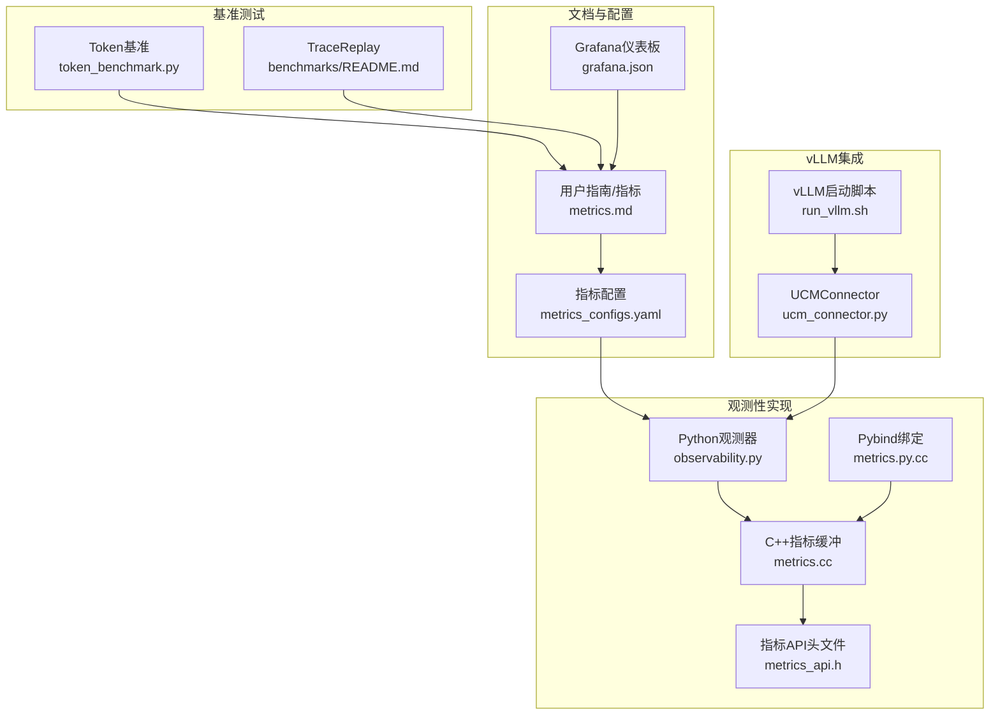
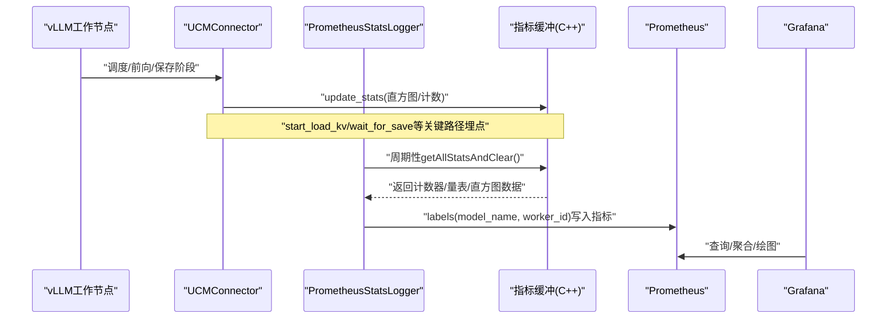
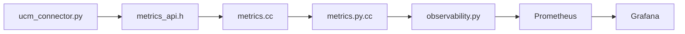

# 性能监控

<cite>
**本文引用的文件**
- [docs/用户指南/指标/metrics.md](file://docs/source/user-guide/metrics/metrics.md)
- [examples/metrics/metrics_configs.yaml](file://examples/metrics/metrics_configs.yaml)
- [examples/metrics/grafana.json](file://examples/metrics/grafana.json)
- [ucm/observability.py](file://ucm/observability.py)
- [ucm/shared/metrics/cc/domain/metrics.cc](file://ucm/shared/metrics/cc/domain/metrics.cc)
- [ucm/shared/metrics/cc/api/metrics_api.h](file://ucm/shared/metrics/cc/api/metrics_api.h)
- [ucm/shared/metrics/cpy/metrics.py.cc](file://ucm/shared/metrics/cpy/metrics.py.cc)
- [ucm/integration/vllm/ucm_connector.py](file://ucm/integration/vllm/ucm_connector.py)
- [test/common/llmperf/utils/token_benchmark.py](file://test/common/llmperf/utils/token_benchmark.py)
- [test/common/llmperf/utils/common_metrics.py](file://test/common/llmperf/utils/common_metrics.py)
- [benchmarks/README.md](file://benchmarks/README.md)
- [examples/deployments/scripts/vllm/run_vllm.sh](file://examples/deployments/scripts/vllm/run_vllm.sh)
- [examples/deployments/scripts/vllm/common.sh](file://examples/deployments/scripts/vllm/common.sh)
- [docs/开发者指南/add_metrics.md](file://docs/source/developer-guide/add_metrics.md)
</cite>

## 目录
1. [简介](#简介)
2. [项目结构](#项目结构)
3. [核心组件](#核心组件)
4. [架构总览](#架构总览)
5. [详细组件分析](#详细组件分析)
6. [依赖关系分析](#依赖关系分析)
7. [性能考量与优化建议](#性能考量与优化建议)
8. [故障排查指南](#故障排查指南)
9. [结论](#结论)
10. [附录](#附录)

## 简介
本指南面向UCM（Unified Cache Management）性能监控与观测性落地，覆盖Prometheus指标采集与配置、Grafana仪表板使用、Token吞吐与延迟关键指标的含义与分析方法、性能基准测试工具与流程，以及调优策略与最佳实践。读者可基于仓库中的指标定义、采集实现与示例配置，快速搭建从服务端到监控平台的全链路可观测体系。

## 项目结构
围绕性能监控的关键目录与文件如下：
- 文档与用户指南：包含指标启用、Prometheus/Grafana配置与使用说明
- 指标配置：YAML定义启用哪些指标、直方图桶、前缀等
- 观测性实现：Python侧PrometheusStatsLogger与C++/pybind指标缓冲与上报
- vLLM集成：UCMConnector在加载/保存KV阶段埋点并上报指标
- 基准测试：token_benchmark.py与TraceReplay工具用于吞吐与延迟评估
- 部署脚本：vLLM启动脚本中启用UCM与指标配置路径

**图表来源**
- [docs/source/user-guide/metrics/metrics.md](file://docs/source/user-guide/metrics/metrics.md#L1-L189)
- [examples/metrics/metrics_configs.yaml](file://examples/metrics/metrics_configs.yaml#L1-L51)
- [examples/metrics/grafana.json](file://examples/metrics/grafana.json#L1-L1025)
- [ucm/observability.py](file://ucm/observability.py#L1-L197)
- [ucm/shared/metrics/cc/domain/metrics.cc](file://ucm/shared/metrics/cc/domain/metrics.cc#L1-L117)
- [ucm/shared/metrics/cc/api/metrics_api.h](file://ucm/shared/metrics/cc/api/metrics_api.h#L1-L33)
- [ucm/shared/metrics/cpy/metrics.py.cc](file://ucm/shared/metrics/cpy/metrics.py.cc#L1-L53)
- [ucm/integration/vllm/ucm_connector.py](file://ucm/integration/vllm/ucm_connector.py#L1-L1080)
- [examples/deployments/scripts/vllm/run_vllm.sh](file://examples/deployments/scripts/vllm/run_vllm.sh#L1-L116)
- [benchmarks/README.md](file://benchmarks/README.md#L1-L129)

**章节来源**
- [docs/source/user-guide/metrics/metrics.md](file://docs/source/user-guide/metrics/metrics.md#L1-L189)
- [examples/metrics/metrics_configs.yaml](file://examples/metrics/metrics_configs.yaml#L1-L51)
- [examples/metrics/grafana.json](file://examples/metrics/grafana.json#L1-L1025)

## 核心组件
- 指标配置与前缀：通过YAML定义启用的指标名称、直方图桶、日志间隔、多进程目录与指标前缀
- Python观测器：PrometheusStatsLogger按配置注册Counter/Gauge/Histogram，周期性从C++指标缓冲读取并写入Prometheus
- C++指标缓冲：线程本地缓冲聚合，支持计数器、量表与直方图向量，提供清空与切换缓冲接口
- vLLM集成：UCMConnector在start_load_kv/wait_for_save等关键路径更新直方图指标，如请求/块数量、耗时、速度、查找命中率
- Grafana仪表板：提供预置面板，展示负载/保存操作的请求数、块数、耗时与速度，以及查找命中率
- 基准测试：token_benchmark.py计算吞吐、延迟分位数；TraceReplay支持按历史轨迹回放或动态生成请求

**章节来源**
- [ucm/observability.py](file://ucm/observability.py#L60-L197)
- [ucm/shared/metrics/cc/domain/metrics.cc](file://ucm/shared/metrics/cc/domain/metrics.cc#L32-L117)
- [ucm/shared/metrics/cc/api/metrics_api.h](file://ucm/shared/metrics/cc/api/metrics_api.h#L24-L33)
- [ucm/shared/metrics/cpy/metrics.py.cc](file://ucm/shared/metrics/cpy/metrics.py.cc#L31-L53)
- [ucm/integration/vllm/ucm_connector.py](file://ucm/integration/vllm/ucm_connector.py#L324-L643)
- [examples/metrics/grafana.json](file://examples/metrics/grafana.json#L1-L1025)
- [test/common/llmperf/utils/token_benchmark.py](file://test/common/llmperf/utils/token_benchmark.py#L25-L387)
- [benchmarks/README.md](file://benchmarks/README.md#L1-L129)

## 架构总览
下图展示从vLLM工作节点到Prometheus再到Grafana的完整链路，以及指标在各层的产生与消费方式。

**图表来源**
- [ucm/integration/vllm/ucm_connector.py](file://ucm/integration/vllm/ucm_connector.py#L553-L643)
- [ucm/observability.py](file://ucm/observability.py#L177-L197)
- [ucm/shared/metrics/cc/domain/metrics.cc](file://ucm/shared/metrics/cc/domain/metrics.cc#L88-L117)
- [examples/metrics/grafana.json](file://examples/metrics/grafana.json#L117-L131)

## 详细组件分析

### Prometheus指标采集与配置
- 启用步骤
  - 设置多进程目录环境变量，确保Prometheus多进程模式可用
  - 在UCM配置中启用metrics_config_path，指向指标配置文件
  - 启动vLLM并传入KV传输配置以启用UCMConnector
- 指标类型与标签
  - 计数器/量表/直方图：由配置驱动注册，统一前缀ucm:
  - 标签：model_name、worker_id，便于跨实例对比
- 查询语法与示例
  - 平均值：rate(metric_sum[$__rate_interval]) / rate(metric_count[$__rate_interval])
  - 命名空间：ucm:前缀+指标名
  - 标签过滤：model_name="$model_name"、worker_id="$worker_id"

**章节来源**
- [docs/source/user-guide/metrics/metrics.md](file://docs/source/user-guide/metrics/metrics.md#L9-L121)
- [examples/metrics/metrics_configs.yaml](file://examples/metrics/metrics_configs.yaml#L1-L51)
- [ucm/observability.py](file://ucm/observability.py#L60-L121)
- [examples/metrics/grafana.json](file://examples/metrics/grafana.json#L117-L131)

### 关键性能指标与含义
- 负载操作
  - 请求/块数量：start_load_kv触发，反映每次加载涉及的请求数与块数
  - 耗时：单次加载耗时（毫秒）
  - 速度：加载带宽（GB/s）
- 保存操作
  - 请求/块数量：wait_for_save触发，反映每次保存涉及的请求数与块数
  - 耗时：单次保存耗时（毫秒）
  - 速度：保存带宽（GB/s）
- 查找命中率
  - 区间命中率：按请求统计外部块命中比例，用于评估缓存效果

**章节来源**
- [docs/source/user-guide/metrics/metrics.md](file://docs/source/user-guide/metrics/metrics.md#L151-L169)
- [ucm/integration/vllm/ucm_connector.py](file://ucm/integration/vllm/ucm_connector.py#L324-L327)
- [ucm/integration/vllm/ucm_connector.py](file://ucm/integration/vllm/ucm_connector.py#L553-L561)
- [ucm/integration/vllm/ucm_connector.py](file://ucm/integration/vllm/ucm_connector.py#L635-L643)

### Grafana仪表板配置与使用
- 添加数据源：选择Prometheus，URL为http://prometheus:9090
- 导入仪表板：上传grafana.json，选择已配置的数据源
- 图表定制：面板表达式使用rate(metric_sum[$__rate_interval])/rate(metric_count[$__rate_interval])，并按worker_id进行分组
- 告警设置：可在Grafana中基于面板表达式配置阈值告警（例如加载/保存速度过低、命中率异常）

**章节来源**
- [docs/source/user-guide/metrics/metrics.md](file://docs/source/user-guide/metrics/metrics.md#L125-L149)
- [examples/metrics/grafana.json](file://examples/metrics/grafana.json#L117-L131)

### 性能基准测试方法与工具
- Token基准测试（token_benchmark.py）
  - 支持并发请求、随机采样输入/输出长度、超时控制
  - 输出吞吐、延迟分位数（P25/P50/P90/P95/P99）、TTFT、TPOT、E2E等指标
  - 可导出结果至JSON，便于归档与对比
- TraceReplay（benchmarks/README.md）
  - 支持按历史轨迹回放或基于公开数据集动态生成请求
  - 输出请求吞吐、输出token吞吐、TTFT/TPOT/ITL/E2E等综合指标
  - 结果可保存为Excel，便于离线分析

**章节来源**
- [test/common/llmperf/utils/token_benchmark.py](file://test/common/llmperf/utils/token_benchmark.py#L25-L387)
- [test/common/llmperf/utils/common_metrics.py](file://test/common/llmperf/utils/common_metrics.py#L1-L18)
- [benchmarks/README.md](file://benchmarks/README.md#L1-L129)

### vLLM启动与指标启用
- 启动参数要点
  - 通过--kv-transfer-config启用UCMConnector，并指定UCM_CONFIG_FILE
  - 通过--host/--port暴露HTTP服务，供Prometheus抓取
- 日志与临时文件
  - 启动后会在PROMETHEUS_MULTIPROC_DIR生成.db文件，用于多进程指标持久化

**章节来源**
- [examples/deployments/scripts/vllm/run_vllm.sh](file://examples/deployments/scripts/vllm/run_vllm.sh#L99-L107)
- [docs/source/user-guide/metrics/metrics.md](file://docs/source/user-guide/metrics/metrics.md#L11-L68)

## 依赖关系分析
- Python观测器依赖C++指标缓冲模块，通过pybind桥接
- UCMConnector在关键路径调用update_stats，将直方图样本写入缓冲
- PrometheusStatsLogger周期性从缓冲读取并写入Prometheus
- Grafana通过Prometheus数据源查询并渲染面板

**图表来源**
- [ucm/integration/vllm/ucm_connector.py](file://ucm/integration/vllm/ucm_connector.py#L324-L327)
- [ucm/shared/metrics/cc/api/metrics_api.h](file://ucm/shared/metrics/cc/api/metrics_api.h#L24-L33)
- [ucm/shared/metrics/cc/domain/metrics.cc](file://ucm/shared/metrics/cc/domain/metrics.cc#L32-L117)
- [ucm/shared/metrics/cpy/metrics.py.cc](file://ucm/shared/metrics/cpy/metrics.py.cc#L31-L53)
- [ucm/observability.py](file://ucm/observability.py#L177-L197)

**章节来源**
- [ucm/observability.py](file://ucm/observability.py#L60-L121)
- [ucm/shared/metrics/cc/domain/metrics.cc](file://ucm/shared/metrics/cc/domain/metrics.cc#L32-L117)
- [ucm/shared/metrics/cpy/metrics.py.cc](file://ucm/shared/metrics/cpy/metrics.py.cc#L31-L53)
- [ucm/integration/vllm/ucm_connector.py](file://ucm/integration/vllm/ucm_connector.py#L553-L643)

## 性能考量与优化建议
- 指标配置
  - 合理设置直方图桶，避免过细导致内存压力过大
  - 控制log_interval，平衡实时性与开销
- 缓存命中率
  - 通过interval_lookup_hit_rates观察命中趋势，结合业务场景调整缓存策略
- 带宽与延迟
  - 关注load_speed/save_speed与load_duration/save_duration，定位瓶颈（存储IO或网络）
- 并发与批处理
  - 调整max_num_batched_tokens、max_num_seqs等参数，提升吞吐同时避免过度竞争
- 基准测试
  - 使用token_benchmark.py与TraceReplay在不同并发与数据规模下压测，记录P95/P99延迟与吞吐变化

[本节为通用指导，无需特定文件引用]

## 故障排查指南
- Prometheus未抓取指标
  - 检查PROMETHEUS_MULTIPROC_DIR是否正确设置且存在
  - 确认vLLM服务端口与prometheus.yaml一致
- Grafana无法连接Prometheus
  - 校验Prometheus数据源URL（容器DNS：http://prometheus:9090）
  - 确认Prometheus服务已启动并可访问
- 指标缺失或为空
  - 确认metrics_config_path已启用且配置文件存在
  - 检查UCMConnector是否成功初始化PrometheusStatsLogger
- 仪表板无数据
  - 检查标签过滤条件（model_name、worker_id）
  - 确认查询区间与采样间隔合理

**章节来源**
- [docs/source/user-guide/metrics/metrics.md](file://docs/source/user-guide/metrics/metrics.md#L70-L149)
- [examples/metrics/metrics_configs.yaml](file://examples/metrics/metrics_configs.yaml#L1-L51)
- [ucm/observability.py](file://ucm/observability.py#L60-L121)

## 结论
通过本指南，您可以在UCM中完成Prometheus指标的采集与可视化，理解关键性能指标的含义并进行有效分析，借助token_benchmark.py与TraceReplay开展系统性的性能基准测试，并基于观测数据制定针对性的调优策略。建议在生产环境中持续监控命中率、带宽与延迟指标，配合Grafana告警与基准测试，形成闭环的性能治理流程。

[本节为总结性内容，无需特定文件引用]

## 附录

### 指标清单与含义
- 负载操作
  - ucm:load_requests_num（直方图）：每次start_load_kv加载的请求数
  - ucm:load_blocks_num（直方图）：每次start_load_kv加载的块数
  - ucm:load_duration（直方图）：加载耗时（毫秒）
  - ucm:load_speed（直方图）：加载速度（GB/s）
- 保存操作
  - ucm:save_requests_num（直方图）：每次wait_for_save保存的请求数
  - ucm:save_blocks_num（直方图）：每次wait_for_save保存的块数
  - ucm:save_duration（直方图）：保存耗时（毫秒）
  - ucm:save_speed（直方图）：保存速度（GB/s）
- 查找命中率
  - ucm:interval_lookup_hit_rates（直方图）：区间命中率

**章节来源**
- [docs/source/user-guide/metrics/metrics.md](file://docs/source/user-guide/metrics/metrics.md#L151-L169)

### 开发者新增指标流程
- 在C++侧通过UpdateStats上报新指标名称与数值
- 在metrics_configs.yaml中声明新指标的名称、文档与桶配置
- 重启服务后即可在/vmetrics端点看到新指标
- 可在grafana.json中添加对应面板进行可视化

**章节来源**
- [docs/source/developer-guide/add_metrics.md](file://docs/source/developer-guide/add_metrics.md#L112-L145)
- [examples/metrics/metrics_configs.yaml](file://examples/metrics/metrics_configs.yaml#L22-L51)
- [ucm/shared/metrics/cc/api/metrics_api.h](file://ucm/shared/metrics/cc/api/metrics_api.h#L24-L33)