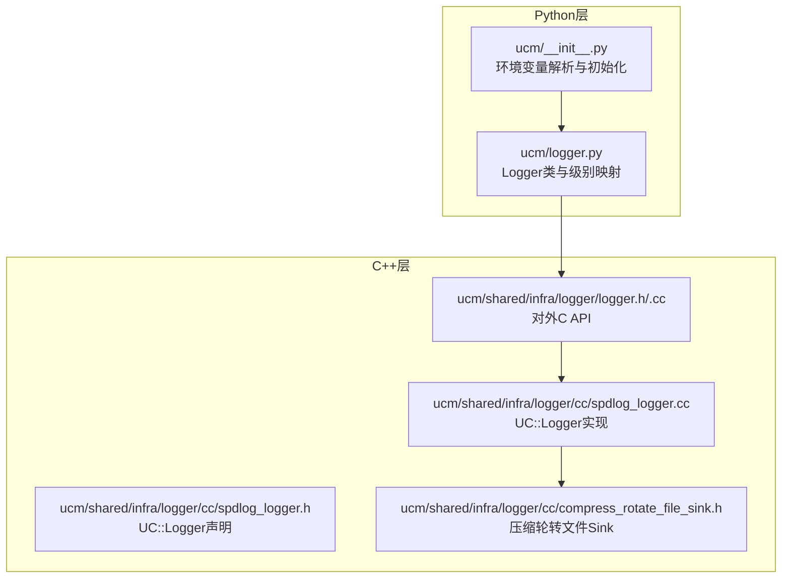
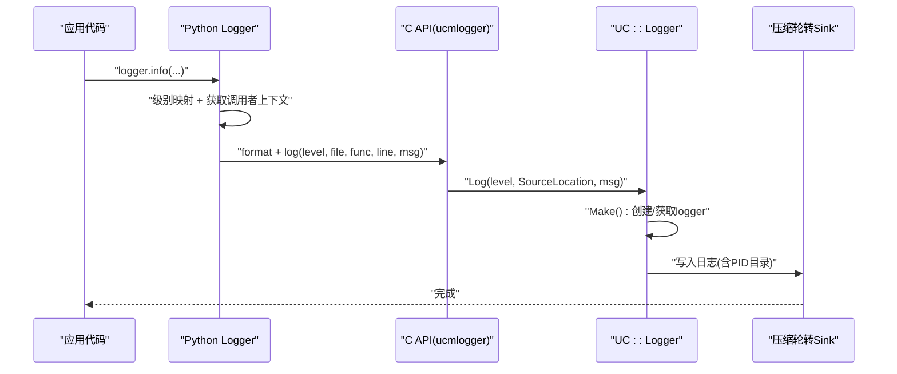
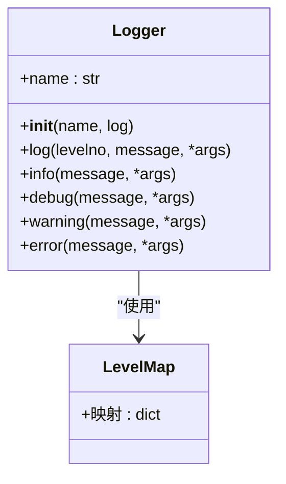
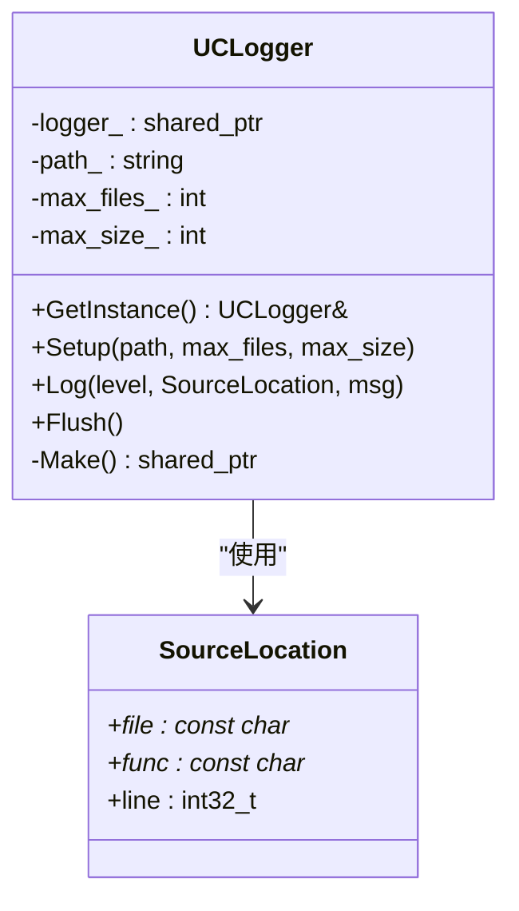
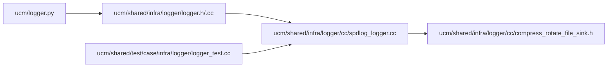

# 日志分析

<cite>
**本文引用的文件**
- [ucm/logger.py](file://ucm/logger.py)
- [ucm/shared/infra/logger/cc/spdlog_logger.h](file://ucm/shared/infra/logger/cc/spdlog_logger.h)
- [ucm/shared/infra/logger/cc/spdlog_logger.cc](file://ucm/shared/infra/logger/cc/spdlog_logger.cc)
- [ucm/shared/infra/logger/cc/compress_rotate_file_sink.h](file://ucm/shared/infra/logger/cc/compress_rotate_file_sink.h)
- [ucm/shared/infra/logger/logger.h](file://ucm/shared/infra/logger/logger.h)
- [ucm/shared/infra/logger/logger.cc](file://ucm/shared/infra/logger/logger.cc)
- [ucm/__init__.py](file://ucm/__init__.py)
- [benchmarks/logging_perf_test.py](file://benchmarks/logging_perf_test.py)
- [ucm/shared/test/case/infra/logger/logger_test.cc](file://ucm/shared/test/case/infra/logger/logger_test.cc)
- [ucm/sparse/gsa/prefetch/include/kvcache_log.h](file://ucm/sparse/gsa/prefetch/include/kvcache_log.h)
- [examples/offline_inference.py](file://examples/offline_inference.py)
</cite>

## 目录
1. [简介](#简介)
2. [项目结构](#项目结构)
3. [核心组件](#核心组件)
4. [架构总览](#架构总览)
5. [详细组件分析](#详细组件分析)
6. [依赖关系分析](#依赖关系分析)
7. [性能考量](#性能考量)
8. [故障排查指南](#故障排查指南)
9. [结论](#结论)
10. [附录](#附录)

## 简介
本指南面向UCM（Unified Cache Management）项目的日志分析与运维实践，系统性阐述日志系统的架构设计、实现原理与使用方式，重点覆盖以下内容：
- Logger类的设计模式与日志级别映射机制
- 日志参数配置：日志目录、文件数量上限、单文件大小上限
- 关键日志字段的含义与解读：时间戳、进程/线程、文件名、函数名、行号等
- 常见日志场景分析技巧：缓存命中/未命中、存储操作、稀疏注意力算法执行等
- 实际日志示例与问题排查案例

## 项目结构
UCM日志体系由Python侧适配层与C++底层实现协同组成：
- Python适配层：提供统一Logger接口与环境变量配置入口，负责将标准logging级别映射到底层UC::Logger，并注入调用方上下文（文件名、函数名、行号）
- C++底层实现：基于spdlog，提供带压缩轮转的文件输出、控制台输出、信号触发刷新、可动态设置日志级别等能力
- 测试与基准：验证轮转与压缩行为、性能对比

图表来源
- [ucm/logger.py](file://ucm/logger.py#L40-L75)
- [ucm/shared/infra/logger/cc/spdlog_logger.h](file://ucm/shared/infra/logger/cc/spdlog_logger.h#L38-L74)
- [ucm/shared/infra/logger/cc/spdlog_logger.cc](file://ucm/shared/infra/logger/cc/spdlog_logger.cc#L47-L91)
- [ucm/shared/infra/logger/cc/compress_rotate_file_sink.h](file://ucm/shared/infra/logger/cc/compress_rotate_file_sink.h#L42-L197)
- [ucm/shared/infra/logger/logger.h](file://ucm/shared/infra/logger/logger.h#L30-L51)
- [ucm/__init__.py](file://ucm/__init__.py#L29-L47)

章节来源
- [ucm/logger.py](file://ucm/logger.py#L40-L75)
- [ucm/shared/infra/logger/cc/spdlog_logger.h](file://ucm/shared/infra/logger/cc/spdlog_logger.h#L38-L74)
- [ucm/shared/infra/logger/cc/spdlog_logger.cc](file://ucm/shared/infra/logger/cc/spdlog_logger.cc#L47-L91)
- [ucm/shared/infra/logger/cc/compress_rotate_file_sink.h](file://ucm/shared/infra/logger/cc/compress_rotate_file_sink.h#L42-L197)
- [ucm/shared/infra/logger/logger.h](file://ucm/shared/infra/logger/logger.h#L30-L51)
- [ucm/__init__.py](file://ucm/__init__.py#L29-L47)

## 核心组件
- Python Logger类
  - 负责从配置字典或环境变量读取日志目录、最大文件数、最大文件大小
  - 将标准logging级别映射到UC::Logger级别
  - 自动注入调用方上下文（文件名、函数名、行号），并通过C API转发到底层
- C++ UC::Logger
  - 单例管理，支持控制台与轮转文件双Sink
  - 支持按PID分目录输出，路径为“目录/PID/ucm.log”
  - 支持通过环境变量动态调整日志级别
  - 在收到特定信号时自动刷新，保证异常退出时日志不丢失
- 压缩轮转文件Sink
  - 基于spdlog轮转Sink扩展，写满后重命名并压缩为.gz，保留指定数量的历史压缩文件
- 对外C API
  - 提供Setup/Log/Flush等接口，供Python层调用

章节来源
- [ucm/logger.py](file://ucm/logger.py#L32-L75)
- [ucm/shared/infra/logger/cc/spdlog_logger.h](file://ucm/shared/infra/logger/cc/spdlog_logger.h#L31-L74)
- [ucm/shared/infra/logger/cc/spdlog_logger.cc](file://ucm/shared/infra/logger/cc/spdlog_logger.cc#L40-L91)
- [ucm/shared/infra/logger/cc/compress_rotate_file_sink.h](file://ucm/shared/infra/logger/cc/compress_rotate_file_sink.h#L42-L197)
- [ucm/shared/infra/logger/logger.h](file://ucm/shared/infra/logger/logger.h#L30-L51)

## 架构总览
下图展示从应用发起日志到最终落盘的关键流程，包括Python适配层与C++底层的交互。

图表来源
- [ucm/logger.py](file://ucm/logger.py#L49-L57)
- [ucm/shared/infra/logger/logger.h](file://ucm/shared/infra/logger/logger.h#L30-L37)
- [ucm/shared/infra/logger/cc/spdlog_logger.cc](file://ucm/shared/infra/logger/cc/spdlog_logger.cc#L40-L77)
- [ucm/shared/infra/logger/cc/compress_rotate_file_sink.h](file://ucm/shared/infra/logger/cc/compress_rotate_file_sink.h#L76-L97)

章节来源
- [ucm/logger.py](file://ucm/logger.py#L49-L57)
- [ucm/shared/infra/logger/logger.h](file://ucm/shared/infra/logger/logger.h#L30-L37)
- [ucm/shared/infra/logger/cc/spdlog_logger.cc](file://ucm/shared/infra/logger/cc/spdlog_logger.cc#L40-L77)
- [ucm/shared/infra/logger/cc/compress_rotate_file_sink.h](file://ucm/shared/infra/logger/cc/compress_rotate_file_sink.h#L76-L97)

## 详细组件分析

### Python Logger类与级别映射
- 设计要点
  - 使用字典配置或默认值初始化，支持目录、最大文件数、最大文件大小
  - 通过inspect回溯两层栈帧，自动提取调用方文件名、函数名、行号
  - 将标准logging级别映射到UC::Logger级别枚举
- 关键行为
  - 初始化时调用底层setup，注册atexit刷新
  - 每次记录日志前格式化消息，再调用底层log接口

图表来源
- [ucm/logger.py](file://ucm/logger.py#L40-L75)

章节来源
- [ucm/logger.py](file://ucm/logger.py#L32-L75)

### C++ UC::Logger与压缩轮转Sink
- 设计要点
  - 单例模式，支持注册信号处理器在异常时刷新
  - 双Sink：控制台彩色输出 + 压缩轮转文件输出
  - PID隔离：每个进程独立目录“目录/PID/ucm.log”
  - 动态日志级别：可通过环境变量设置
- 压缩轮转策略
  - 写满触发重命名并压缩为.gz，保留最多N个历史压缩文件
  - 文件名包含时间戳，便于定位

图表来源
- [ucm/shared/infra/logger/cc/spdlog_logger.h](file://ucm/shared/infra/logger/cc/spdlog_logger.h#L38-L74)
- [ucm/shared/infra/logger/cc/spdlog_logger.cc](file://ucm/shared/infra/logger/cc/spdlog_logger.cc#L47-L91)

章节来源
- [ucm/shared/infra/logger/cc/spdlog_logger.h](file://ucm/shared/infra/logger/cc/spdlog_logger.h#L38-L74)
- [ucm/shared/infra/logger/cc/spdlog_logger.cc](file://ucm/shared/infra/logger/cc/spdlog_logger.cc#L47-L91)
- [ucm/shared/infra/logger/cc/compress_rotate_file_sink.h](file://ucm/shared/infra/logger/cc/compress_rotate_file_sink.h#L42-L197)

### 对外C API与环境变量
- C API
  - 提供Log/Setup/Flush等接口，供Python层调用
- 环境变量
  - UC_LOGGER_LEVEL：动态设置日志级别（字符串）
  - UCM_LOG_PATH/UCM_LOG_MAX_FILES/UCM_LOG_MAX_SIZE：日志目录、文件数、大小（MB）

章节来源
- [ucm/shared/infra/logger/logger.h](file://ucm/shared/infra/logger/logger.h#L30-L51)
- [ucm/shared/infra/logger/cc/spdlog_logger.cc](file://ucm/shared/infra/logger/cc/spdlog_logger.cc#L65-L71)
- [ucm/__init__.py](file://ucm/__init__.py#L29-L40)

### 日志字段含义与解读
- 时间戳：格式为“年-月-日 时:分:秒.微秒”，用于定位事件发生时刻
- 进程/线程：进程ID与线程序号，便于多进程/多线程场景关联
- 文件名/函数名/行号：来自调用栈帧，用于快速定位日志来源模块与位置
- 日志级别：DEBUG/INFO/WARN/ERROR，对应UC::Logger枚举
- 示例字段顺序参考底层pattern（包含上述字段）

章节来源
- [ucm/shared/infra/logger/cc/spdlog_logger.cc](file://ucm/shared/infra/logger/cc/spdlog_logger.cc#L64-L64)
- [ucm/logger.py](file://ucm/logger.py#L52-L57)

### 配置参数详解
- 日志目录
  - 默认值：log
  - 来源：Python Logger构造参数或环境变量UCM_LOG_PATH
- 最大文件数
  - 默认值：3
  - 行为：超过该数量时，最旧的压缩文件会被删除
- 最大文件大小（MB）
  - 默认值：5
  - 行为：超过阈值时触发轮转与压缩
- 动态日志级别
  - 通过UC_LOGGER_LEVEL设置（如debug/info/warn/error/off）

章节来源
- [ucm/logger.py](file://ucm/logger.py#L43-L46)
- [ucm/__init__.py](file://ucm/__init__.py#L31-L40)
- [ucm/shared/infra/logger/cc/spdlog_logger.cc](file://ucm/shared/infra/logger/cc/spdlog_logger.cc#L79-L84)
- [ucm/shared/infra/logger/cc/spdlog_logger.cc](file://ucm/shared/infra/logger/cc/spdlog_logger.cc#L65-L71)

### 常见日志场景分析技巧
- 缓存命中/未命中
  - 观察KV缓存相关模块的日志，结合时间戳与函数名定位具体阶段
  - 若命中率低，关注存储读取耗时与失败重试次数
- 存储操作
  - 关注轮转与压缩行为：当出现大量.gz文件或磁盘占用异常时，检查max_files与max_size配置
  - 注意PID目录隔离，避免误删其他进程日志
- 稀疏算法执行
  - 在稀疏注意力模块中，关注预取/检索阶段的耗时与命中统计
  - 结合调用栈信息（文件名/函数名/行号）定位具体算子

章节来源
- [ucm/sparse/gsa/prefetch/include/kvcache_log.h](file://ucm/sparse/gsa/prefetch/include/kvcache_log.h#L14-L111)
- [ucm/logger.py](file://ucm/logger.py#L52-L57)

### 实际日志示例与问题排查
- 示例：应用启动与退出
  - 启动：初始化成功日志
  - 退出：引擎退出日志
- 排查：轮转与压缩异常
  - 症状：磁盘空间异常增长或压缩文件过多
  - 处理：核对UCM_LOG_MAX_FILES与UCM_LOG_MAX_SIZE；确认PID目录下是否存在过多历史压缩文件
- 排查：日志级别过高/过低
  - 症状：调试信息缺失或日志噪声过大
  - 处理：设置UC_LOGGER_LEVEL为所需级别

章节来源
- [examples/offline_inference.py](file://examples/offline_inference.py#L15-L43)
- [ucm/shared/test/case/infra/logger/logger_test.cc](file://ucm/shared/test/case/infra/logger/logger_test.cc#L56-L56)
- [ucm/shared/test/case/infra/logger/logger_test.cc](file://ucm/shared/test/case/infra/logger/logger_test.cc#L134-L144)

## 依赖关系分析
- Python Logger依赖C API（ucmlogger），后者封装UC::Logger
- UC::Logger内部依赖spdlog与自定义压缩轮转Sink
- 测试用例验证轮转与压缩行为，确保max_files生效

图表来源
- [ucm/logger.py](file://ucm/logger.py#L30-L30)
- [ucm/shared/infra/logger/logger.h](file://ucm/shared/infra/logger/logger.h#L30-L41)
- [ucm/shared/infra/logger/cc/spdlog_logger.cc](file://ucm/shared/infra/logger/cc/spdlog_logger.cc#L47-L91)
- [ucm/shared/infra/logger/cc/compress_rotate_file_sink.h](file://ucm/shared/infra/logger/cc/compress_rotate_file_sink.h#L42-L197)
- [ucm/shared/test/case/infra/logger/logger_test.cc](file://ucm/shared/test/case/infra/logger/logger_test.cc#L56-L56)

章节来源
- [ucm/logger.py](file://ucm/logger.py#L30-L30)
- [ucm/shared/infra/logger/logger.h](file://ucm/shared/infra/logger/logger.h#L30-L41)
- [ucm/shared/infra/logger/cc/spdlog_logger.cc](file://ucm/shared/infra/logger/cc/spdlog_logger.cc#L47-L91)
- [ucm/shared/infra/logger/cc/compress_rotate_file_sink.h](file://ucm/shared/infra/logger/cc/compress_rotate_file_sink.h#L42-L197)
- [ucm/shared/test/case/infra/logger/logger_test.cc](file://ucm/shared/test/case/infra/logger/logger_test.cc#L56-L56)

## 性能考量
- Python层日志开销
  - 包含栈帧回溯与字符串格式化，建议在高频路径谨慎使用
- C++层性能
  - 基于spdlog异步与同步Sink组合，具备较高吞吐
  - 压缩轮转涉及IO与压缩，建议合理设置max_size与max_files
- 基准测试
  - 提供Python logging与pybind11 spdlog_logger的对比脚本，可用于评估不同场景下的开销差异

章节来源
- [benchmarks/logging_perf_test.py](file://benchmarks/logging_perf_test.py#L142-L179)

## 故障排查指南
- 无法写入日志文件
  - 检查日志目录权限与磁盘空间
  - 确认PID目录是否正确创建
- 日志级别无效
  - 检查UC_LOGGER_LEVEL是否拼写正确，支持off时需显式传入
- 轮转/压缩异常
  - 确认max_files与max_size配置是否合理
  - 查看历史压缩文件数量是否达到上限
- 异常退出导致日志丢失
  - 确保信号处理已注册，底层会在信号触发时调用Flush

章节来源
- [ucm/shared/infra/logger/cc/spdlog_logger.cc](file://ucm/shared/infra/logger/cc/spdlog_logger.cc#L49-L57)
- [ucm/shared/infra/logger/cc/spdlog_logger.cc](file://ucm/shared/infra/logger/cc/spdlog_logger.cc#L65-L71)
- [ucm/shared/test/case/infra/logger/logger_test.cc](file://ucm/shared/test/case/infra/logger/logger_test.cc#L134-L144)

## 结论
UCM日志系统通过Python适配层与C++底层的清晰分工，实现了高性能、可配置、可诊断的日志能力。通过合理的参数配置与字段解读，可以高效定位缓存、存储与稀疏算法等关键路径的问题。建议在生产环境中：
- 明确日志目录、文件数与大小上限
- 使用UC_LOGGER_LEVEL按需调整级别
- 定期清理历史压缩文件，监控磁盘占用
- 在高频路径减少日志输出，必要时采用采样或条件日志

## 附录
- 环境变量一览
  - UCM_LOG_PATH：日志目录
  - UCM_LOG_MAX_FILES：最大文件数
  - UCM_LOG_MAX_SIZE：单文件大小（MB）
  - UC_LOGGER_LEVEL：动态日志级别
- 字段解读速查
  - 时间戳：事件发生时刻
  - 进程/线程：PID与线程号
  - 文件名/函数名/行号：调用方上下文

章节来源
- [ucm/__init__.py](file://ucm/__init__.py#L31-L40)
- [ucm/shared/infra/logger/cc/spdlog_logger.cc](file://ucm/shared/infra/logger/cc/spdlog_logger.cc#L64-L64)
- [ucm/logger.py](file://ucm/logger.py#L52-L57)