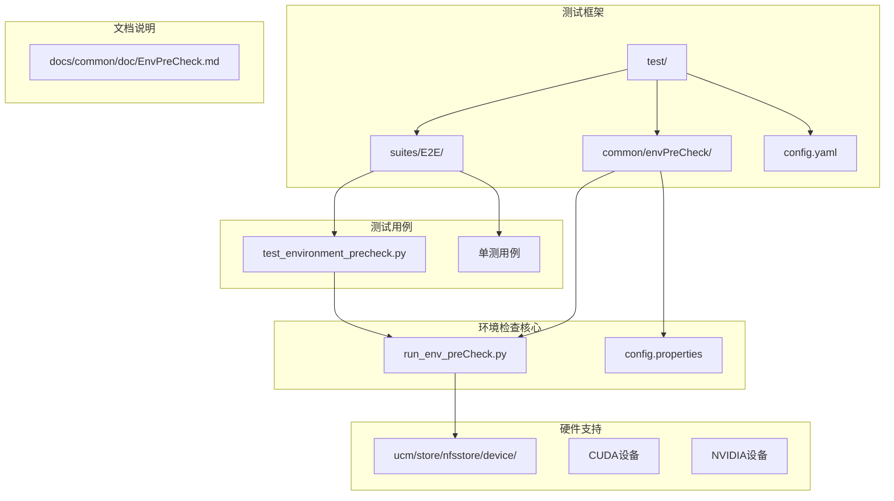
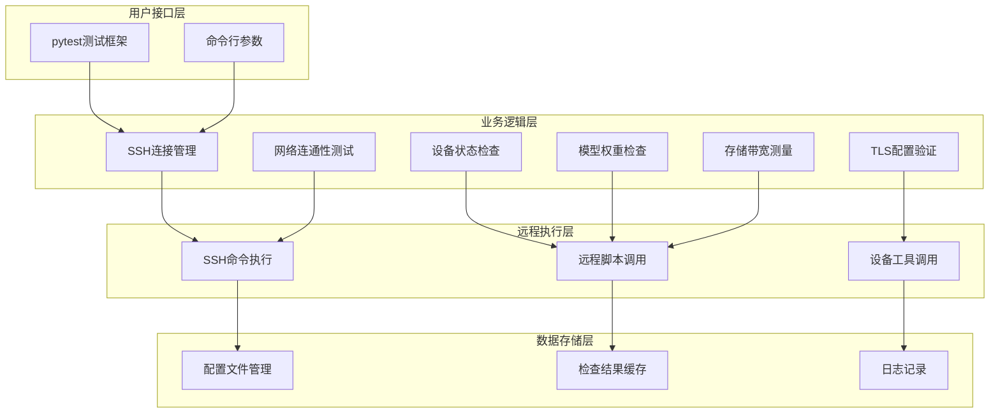
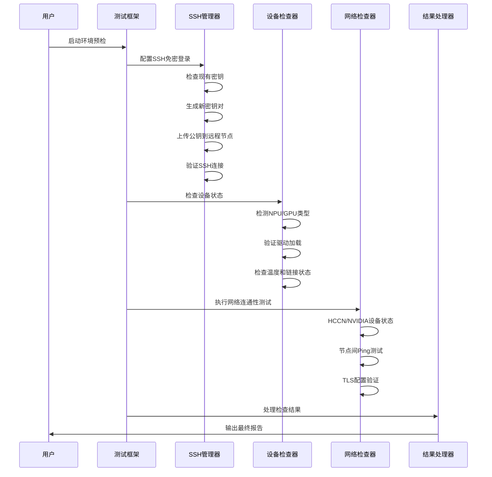
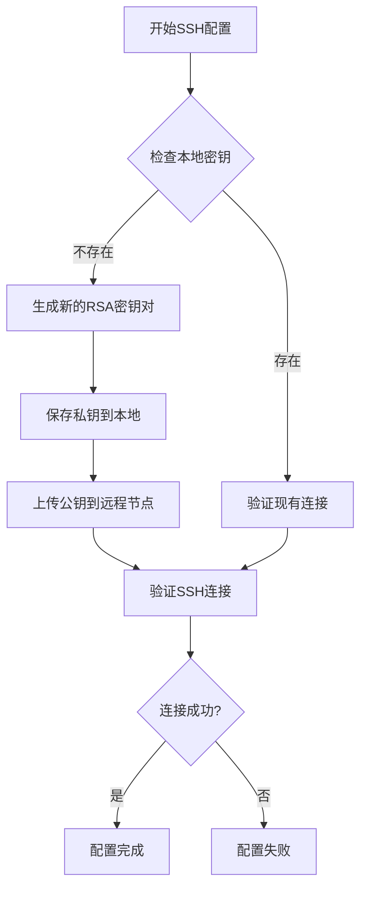
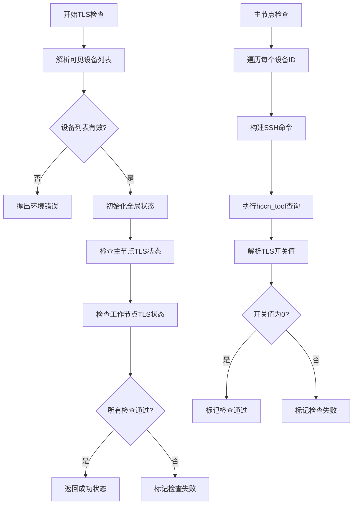
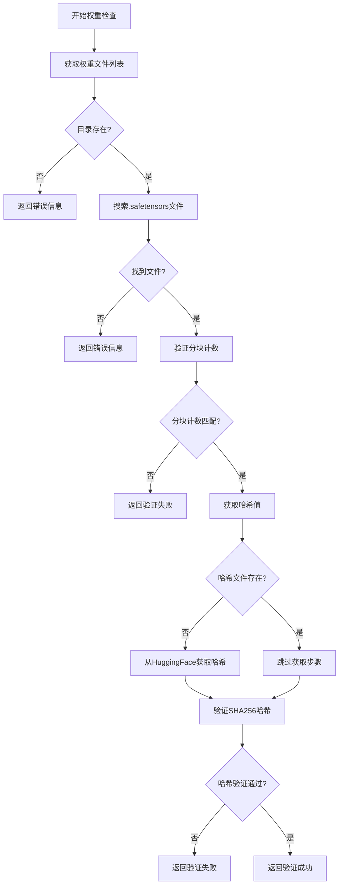
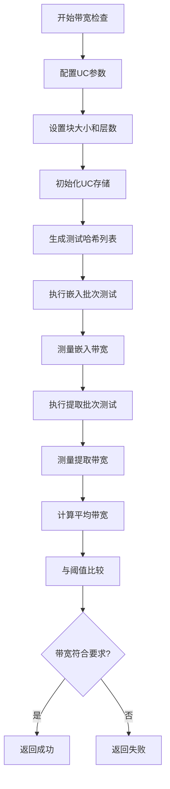
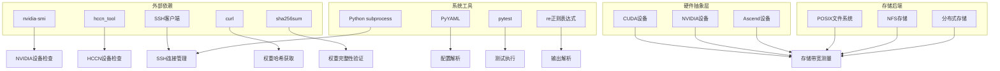
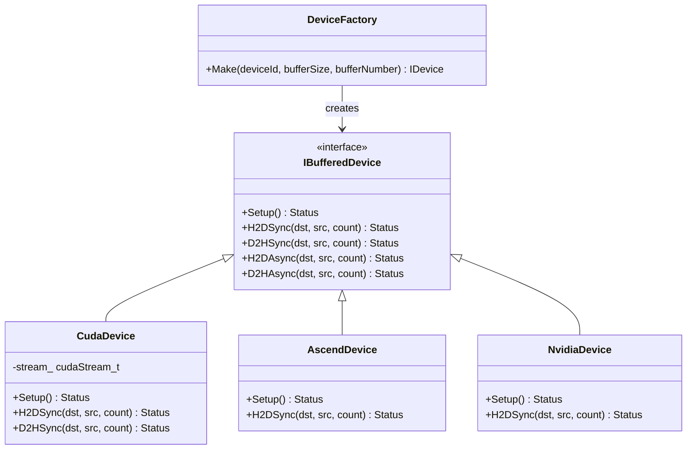
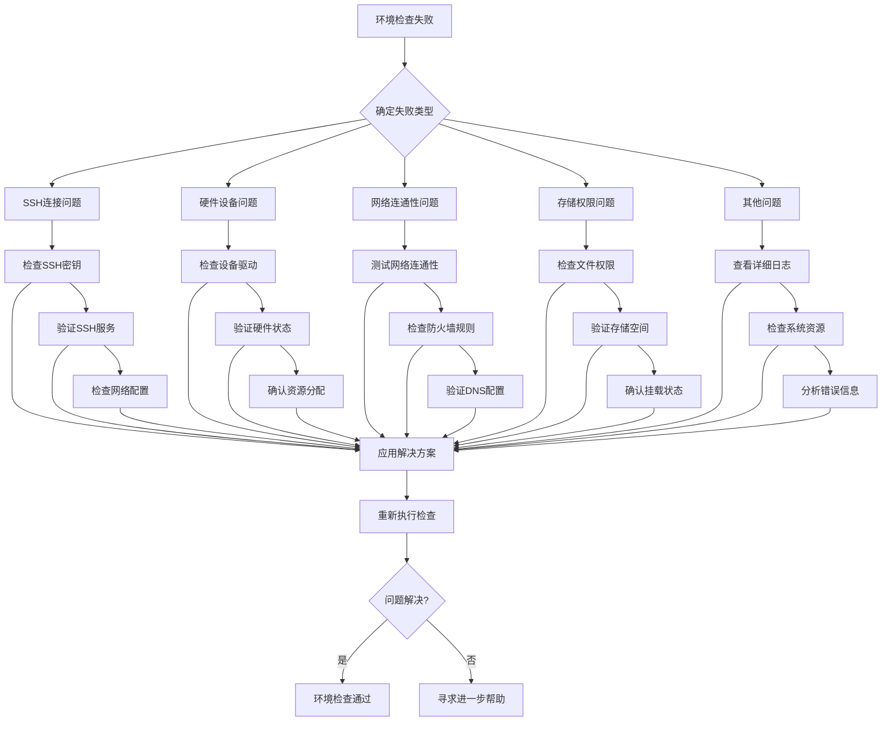

# 环境检查

<cite>
**本文档引用的文件**
- [run_env_preCheck.py](file://test/common/envPreCheck/run_env_preCheck.py)
- [EnvPreCheck.md](file://test/common/doc/EnvPreCheck.md)
- [test_environment_precheck.py](file://test/suites/E2E/test_environment_precheck.py)
- [config.yaml](file://test/config.yaml)
- [common.sh](file://examples/deployments/scripts/vllm/common.sh)
- [CMakeLists.txt](file://ucm/store/nfsstore/device/CMakeLists.txt)
- [cuda_device.cu](file://ucm/store/nfsstore/device/cuda/cuda_device.cu)
- [space_shard_layout.cc](file://ucm/store/nfsstore/cc/domain/space/space_shard_layout.cc)
- [space_layout.cc](file://ucm/store/posix/cc/space_layout.cc)
</cite>

## 目录
1. [简介](#简介)
2. [项目结构](#项目结构)
3. [核心组件](#核心组件)
4. [架构概览](#架构概览)
5. [详细组件分析](#详细组件分析)
6. [依赖关系分析](#依赖关系分析)
7. [性能考虑](#性能考虑)
8. [故障排除指南](#故障排除指南)
9. [结论](#结论)

## 简介

UCM环境检查和预检指南旨在为统一缓存管理系统的部署和运行提供全面的环境验证机制。该系统通过自动化测试套件对集群环境进行全面检查，包括SSH连接性、设备健康状态、节点间通信、TLS配置、模型权重完整性以及存储带宽等关键组件。

该预检系统支持多种硬件平台（NPU/Ascend和GPU/NVIDIA），能够自动识别环境类型并执行相应的检查程序。通过详细的输出解析和结果汇总，用户可以快速定位和解决环境问题。

## 项目结构

UCM环境检查系统主要分布在以下目录结构中：



**图表来源**
- [run_env_preCheck.py](file://test/common/envPreCheck/run_env_preCheck.py#L1-L50)
- [test_environment_precheck.py](file://test/suites/E2E/test_environment_precheck.py#L1-L30)
- [config.yaml](file://test/config.yaml#L36-L48)

**章节来源**
- [run_env_preCheck.py](file://test/common/envPreCheck/run_env_preCheck.py#L1-L100)
- [test_environment_precheck.py](file://test/suites/E2E/test_environment_precheck.py#L1-L50)

## 核心组件

### 环境预检执行器

环境预检系统的核心是`run_env_preCheck.py`模块，它提供了完整的环境检查功能：

#### 主要功能模块

1. **SSH连接检查** - 验证主节点和工作节点的免密登录配置
2. **设备状态检查** - 检测NPU/GPU设备的健康状态和驱动情况
3. **网络连通性检查** - 验证节点间的Ping连通性和网络拓扑
4. **TLS配置检查** - 检查Ascend集群中设备间TLS加密链路状态
5. **模型权重检查** - 验证模型权重文件的完整性和有效性
6. **存储带宽检查** - 测量embedding和fetch操作的实际带宽性能

#### 配置管理系统

系统通过YAML配置文件管理环境参数：

```yaml
Env_preCheck:
  master_ip: 192.168.0.1
  worker_ip: 
  ascend_rt_visible_devices: ""
  node_num: 
  model_path: ""
  hf_model_name: ""
  middle_page: ""
  expected_embed_bandwidth: 10
  expected_fetch_bandwidth: 10
  kvCache_block_number: 1024
  storage_backends: [""]
```

**章节来源**
- [run_env_preCheck.py](file://test/common/envPreCheck/run_env_preCheck.py#L21-L38)
- [config.yaml](file://test/config.yaml#L36-L48)

## 架构概览

UCM环境检查系统采用分层架构设计，确保了良好的可扩展性和维护性：



**图表来源**
- [run_env_preCheck.py](file://test/common/envPreCheck/run_env_preCheck.py#L160-L325)
- [test_environment_precheck.py](file://test/suites/E2E/test_environment_precheck.py#L20-L104)

### 环境检查流程



**图表来源**
- [run_env_preCheck.py](file://test/common/envPreCheck/run_env_preCheck.py#L242-L325)
- [test_environment_precheck.py](file://test/suites/E2E/test_environment_precheck.py#L24-L51)

## 详细组件分析

### SSH连接管理组件

SSH连接管理是环境预检的基础组件，负责确保主节点和工作节点之间的免密登录配置。

#### 关键功能

1. **SSH密钥管理** - 自动生成和管理SSH密钥对
2. **远程密钥上传** - 将公钥安全地传输到目标节点
3. **连接验证** - 确保免密登录配置正确生效

#### SSH配置流程



**图表来源**
- [run_env_preCheck.py](file://test/common/envPreCheck/run_env_preCheck.py#L184-L240)

**章节来源**
- [run_env_preCheck.py](file://test/common/envPreCheck/run_env_preCheck.py#L160-L240)

### 设备状态检查组件

设备状态检查组件负责验证计算设备的健康状况，支持NPU（Ascend）和GPU（NVIDIA）两种平台。

#### NPU设备检查

NPU设备检查使用`hccn_tool`工具执行多项检查：

1. **链路邻居状态** - 检查设备间的物理连接状态
2. **物理链路状态** - 验证PCIe链路的健康状况
3. **网络健康状态** - 监控网络连接质量
4. **IP配置** - 验证网络接口配置
5. **网关设置** - 检查路由配置

#### NVIDIA设备检查

NVIDIA设备检查使用标准Linux工具：

1. **驱动加载** - 验证nvidia驱动已正确加载
2. **设备检测** - 确认GPU设备被系统识别
3. **温度监控** - 检查GPU温度是否在安全范围内
4. **PCIe链接** - 验证物理连接状态
5. **全卡互联** - 检查多GPU系统的拓扑结构
6. **CUDA编译器** - 验证CUDA开发环境

**章节来源**
- [run_env_preCheck.py](file://test/common/envPreCheck/run_env_preCheck.py#L448-L547)

### 网络连通性测试组件

网络连通性测试组件执行多层次的网络验证，确保节点间的通信质量。

#### HCCN网络测试

HCCN（华为云计算网络）测试包括：

1. **同节点内卡间Ping测试** - 验证同一节点内不同NPU卡间的连通性
2. **本地到远程Ping测试** - 检查本地卡到远程节点的网络路径
3. **远程到本地Ping测试** - 验证远程节点到本地的网络连接
4. **跨节点Ping测试** - 测试多个工作节点间的网络连通性

#### NVIDIA网络测试

NVIDIA网络测试使用`nvidia-smi topo -m`命令验证：

1. **GPU拓扑结构** - 显示完整的GPU互连拓扑
2. **链路质量** - 检查PCIe链路的质量和状态
3. **网络延迟** - 评估节点间的通信延迟

**章节来源**
- [run_env_preCheck.py](file://test/common/envPreCheck/run_env_preCheck.py#L728-L873)

### TLS配置检查组件

TLS配置检查组件专门用于Ascend NPU集群的安全配置验证。

#### TLS检查流程



**图表来源**
- [run_env_preCheck.py](file://test/common/envPreCheck/run_env_preCheck.py#L876-L957)

**章节来源**
- [run_env_preCheck.py](file://test/common/envPreCheck/run_env_preCheck.py#L876-L957)

### 模型权重检查组件

模型权重检查组件确保模型文件的完整性和正确性，支持分布式模型的验证。

#### 权重文件检查流程



**图表来源**
- [run_env_preCheck.py](file://test/common/envPreCheck/run_env_preCheck.py#L1073-L1118)

**章节来源**
- [run_env_preCheck.py](file://test/common/envPreCheck/run_env_preCheck.py#L960-L1118)

### 存储带宽检查组件

存储带宽检查组件通过实际的KVCache操作测量存储系统的性能。

#### 带宽测量流程



**图表来源**
- [run_env_preCheck.py](file://test/common/envPreCheck/run_env_preCheck.py#L1350-L1401)

**章节来源**
- [run_env_preCheck.py](file://test/common/envPreCheck/run_env_preCheck.py#L1184-L1401)

## 依赖关系分析

UCM环境检查系统涉及多个层面的依赖关系：



**图表来源**
- [run_env_preCheck.py](file://test/common/envPreCheck/run_env_preCheck.py#L1-L20)
- [CMakeLists.txt](file://ucm/store/nfsstore/device/CMakeLists.txt#L1-L19)

### 硬件环境依赖

系统支持多种硬件平台，通过条件编译和运行时检测实现：

#### CUDA环境配置

CUDA环境通过CMake配置管理：

- **CUDA根目录** - `/usr/local/cuda/`
- **编译器路径** - `${CUDA_ROOT}/bin/nvcc`
- **架构支持** - 75, 80, 86, 89, 90
- **编译选项** - 抑制特定警告，启用CUDA语言

#### 设备工厂模式

系统使用工厂模式支持多种设备后端：



**图表来源**
- [cuda_device.cu](file://ucm/store/nfsstore/device/cuda/cuda_device.cu#L107-L227)
- [CMakeLists.txt](file://ucm/store/nfsstore/device/CMakeLists.txt#L1-L19)

**章节来源**
- [CMakeLists.txt](file://ucm/store/nfsstore/device/CMakeLists.txt#L1-L19)
- [cuda_device.cu](file://ucm/store/nfsstore/device/cuda/cuda_device.cu#L91-L241)

## 性能考虑

### 网络性能优化

系统在网络检查方面采用了多项优化策略：

1. **异步SSH执行** - 使用非阻塞方式执行远程命令
2. **超时控制** - 为每个网络操作设置合理的超时时间
3. **批量处理** - 对多个设备同时执行检查操作
4. **连接复用** - 在可能的情况下复用SSH连接

### 存储性能测量

存储带宽检查通过以下方式确保准确性：

1. **多次测量取平均** - 对每个操作执行多次测量
2. **批处理优化** - 使用大批次减少开销
3. **内存缓冲管理** - 合理管理主机和设备内存缓冲区
4. **异步I/O操作** - 利用异步操作提高吞吐量

### 内存管理

系统在内存管理方面采取了严格的措施：

1. **资源清理** - 确保所有分配的资源都能正确释放
2. **缓冲区复用** - 在可能的情况下复用缓冲区
3. **异常安全** - 使用RAII模式确保异常时的资源清理

## 故障排除指南

### 常见环境问题及解决方案

#### SSH连接问题

**问题症状**：
- SSH免密登录失败
- 连接超时
- 权限拒绝

**诊断步骤**：
1. 检查SSH密钥文件是否存在
2. 验证SSH服务是否正常运行
3. 确认防火墙设置允许SSH连接
4. 检查用户权限和sudo访问

**解决方案**：
- 重新生成SSH密钥对
- 更新SSH配置文件
- 检查网络连通性
- 验证用户账户状态

#### CUDA版本不匹配

**问题症状**：
- CUDA API调用失败
- 设备初始化错误
- 编译器版本不兼容

**诊断步骤**：
1. 检查CUDA安装路径
2. 验证CUDA版本兼容性
3. 确认设备驱动版本
4. 检查编译器设置

**解决方案**：
- 升级或降级CUDA版本
- 更新设备驱动
- 修改编译器配置
- 重新安装CUDA工具包

#### 存储权限问题

**问题症状**：
- 文件读写权限错误
- 目录访问被拒绝
- 存储空间不足

**诊断步骤**：
1. 检查存储后端挂载状态
2. 验证文件系统权限
3. 确认磁盘空间充足
4. 检查SELinux/AppArmor配置

**解决方案**：
- 修改文件权限设置
- 调整存储后端配置
- 清理不必要的文件
- 重新挂载存储设备

#### 网络连通性问题

**问题症状**：
- 节点间Ping失败
- 网络延迟过高
- 设备发现失败

**诊断步骤**：
1. 检查网络接口状态
2. 验证IP地址配置
3. 确认防火墙规则
4. 测试链路质量

**解决方案**：
- 修复网络配置
- 更新防火墙规则
- 更换网络硬件
- 优化网络拓扑

### 自动化检查最佳实践

#### 环境准备

1. **预检前准备**
   - 确保所有节点都有相同的用户账户
   - 准备必要的SSH密钥
   - 验证网络连通性
   - 检查硬件资源

2. **配置文件管理**
   - 使用版本控制系统管理配置
   - 定期备份配置文件
   - 验证配置参数的有效性
   - 建立配置变更流程

#### 检查执行策略

1. **分阶段执行**
   - 先执行基础检查（SSH、网络）
   - 再执行高级检查（设备、存储）
   - 最后执行性能检查

2. **并行执行**
   - 对独立检查使用并行执行
   - 设置合理的并发度
   - 监控系统负载
   - 处理超时和失败

#### 结果分析和报告

1. **结果验证**
   - 建立检查结果的标准
   - 设置合理的阈值
   - 记录异常情况
   - 生成详细报告

2. **问题跟踪**
   - 建立问题分类体系
   - 跟踪问题解决进度
   - 分析问题根本原因
   - 预防类似问题

### 故障排除流程



**图表来源**
- [run_env_preCheck.py](file://test/common/envPreCheck/run_env_preCheck.py#L76-L78)

**章节来源**
- [EnvPreCheck.md](file://test/common/doc/EnvPreCheck.md#L1-L123)

## 结论

UCM环境检查和预检系统为统一缓存管理的部署和运行提供了全面的保障机制。通过自动化的多层检查，系统能够及时发现和解决环境问题，确保集群的稳定运行。

### 主要优势

1. **全面性** - 覆盖硬件、软件、网络、存储等各个方面
2. **自动化** - 减少人工干预，提高检查效率
3. **可扩展性** - 支持多种硬件平台和检查类型
4. **可视化** - 提供清晰的检查结果和诊断信息

### 应用建议

1. **定期执行** - 建议在部署前和定期维护时执行环境检查
2. **持续监控** - 结合监控系统持续跟踪环境状态
3. **文档更新** - 及时更新检查脚本和配置文件
4. **团队培训** - 确保相关人员了解检查流程和故障排除方法

通过遵循本指南，用户可以有效地使用UCM环境检查系统，确保统一缓存管理系统的稳定可靠运行。