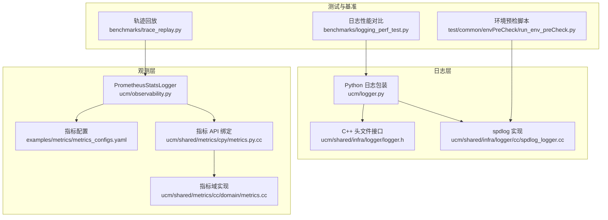
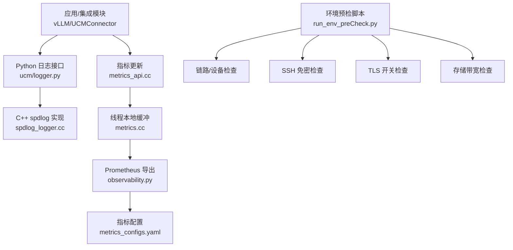
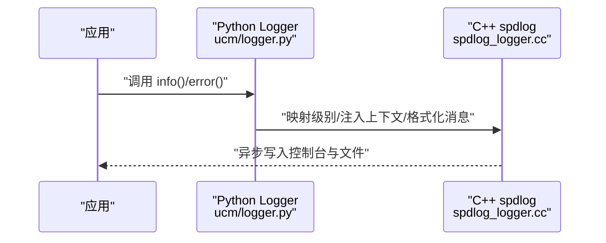
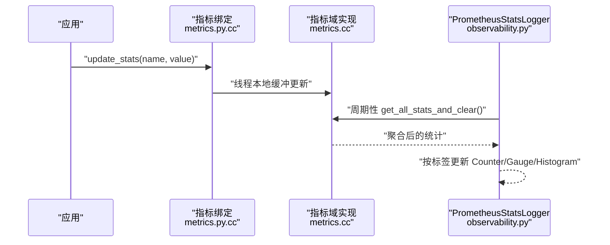
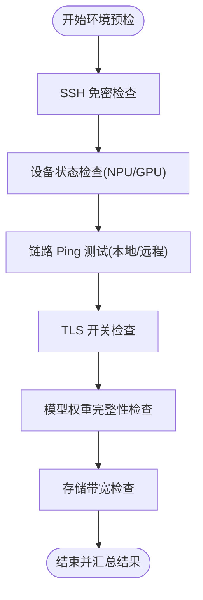
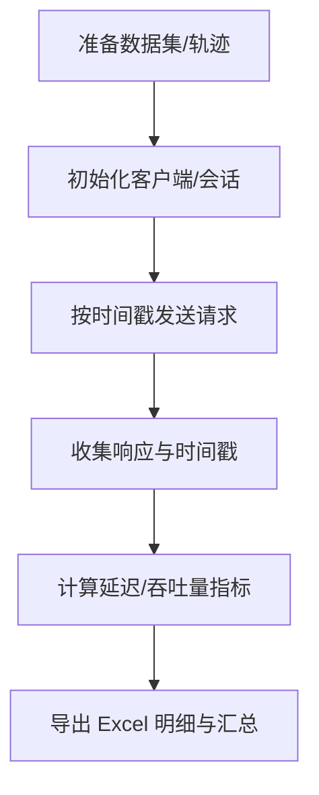
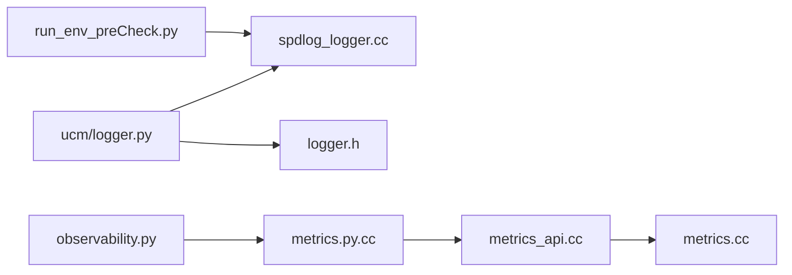

# 诊断方法

<cite>
**本文引用的文件**
- [ucm/logger.py](file://ucm/logger.py)
- [ucm/observability.py](file://ucm/observability.py)
- [ucm/shared/infra/logger/cc/spdlog_logger.cc](file://ucm/shared/infra/logger/cc/spdlog_logger.cc)
- [ucm/shared/infra/logger/cc/spdlog_logger.h](file://ucm/shared/infra/logger/cc/spdlog_logger.h)
- [ucm/shared/infra/logger/logger.h](file://ucm/shared/infra/logger/logger.h)
- [ucm/shared/metrics/cpy/metrics.py.cc](file://ucm/shared/metrics/cpy/metrics.py.cc)
- [ucm/shared/metrics/cc/domain/metrics.cc](file://ucm/shared/metrics/cc/domain/metrics.cc)
- [ucm/shared/metrics/cc/api/metrics_api.h](file://ucm/shared/metrics/cc/api/metrics_api.h)
- [ucm/shared/metrics/cc/api/metrics_api.cc](file://ucm/shared/metrics/cc/api/metrics_api.cc)
- [examples/metrics/metrics_configs.yaml](file://examples/metrics/metrics_configs.yaml)
- [docs/source/user-guide/metrics/metrics.md](file://docs/source/user-guide/metrics/metrics.md)
- [test/common/envPreCheck/run_env_preCheck.py](file://test/common/envPreCheck/run_env_preCheck.py)
- [test/common/doc/EnvPreCheck.md](file://test/common/doc/EnvPreCheck.md)
- [test/common/doc/LLMPerf.md](file://test/common/doc/LLMPerf.md)
- [benchmarks/logging_perf_test.py](file://benchmarks/logging_perf_test.py)
- [benchmarks/trace_replay.py](file://benchmarks/trace_replay.py)
</cite>

## 目录
1. [引言](#引言)
2. [项目结构](#项目结构)
3. [核心组件](#核心组件)
4. [架构总览](#架构总览)
5. [详细组件分析](#详细组件分析)
6. [依赖关系分析](#依赖关系分析)
7. [性能考量](#性能考量)
8. [故障排查指南](#故障排查指南)
9. [结论](#结论)
10. [附录](#附录)

## 引言
本指南面向统一缓存管理（UCM）系统的运维与开发人员，提供一套系统化的“问题诊断方法”。内容覆盖日志采集与分析（日志级别、关键字段、分析技巧）、性能监控指标（Prometheus 指标、吞吐量、延迟指标）的含义与分析方法、环境检查脚本的使用与输出解读、调试工具（内存、性能剖析、网络诊断）的使用建议，以及问题定位的流程与最佳实践。目标是帮助读者在复杂场景下快速定位问题根因并高效修复。

## 项目结构
UCM 将诊断能力分布在多个层次：
- 日志层：Python 包装器与底层 C++/spdlog 实现协同，支持异步、滚动、带级别控制的日志输出。
- 观测层：通过 Prometheus 客户端注册与更新指标，结合 YAML 配置实现灵活的指标定义与导出。
- 测试与基准：提供日志性能对比、请求轨迹回放、LLM 性能评测等工具，支撑问题复现与回归验证。
- 环境预检：自动化脚本覆盖 SSH、设备健康、链路连通性、TLS、带宽等关键维度，保障运行环境一致性。

**图表来源**
- [ucm/logger.py](file://ucm/logger.py#L40-L84)
- [ucm/shared/infra/logger/cc/spdlog_logger.cc](file://ucm/shared/infra/logger/cc/spdlog_logger.cc#L47-L94)
- [ucm/shared/infra/logger/logger.h](file://ucm/shared/infra/logger/logger.h#L28-L51)
- [ucm/observability.py](file://ucm/observability.py#L40-L197)
- [examples/metrics/metrics_configs.yaml](file://examples/metrics/metrics_configs.yaml#L1-L51)
- [ucm/shared/metrics/cpy/metrics.py.cc](file://ucm/shared/metrics/cpy/metrics.py.cc#L31-L53)
- [ucm/shared/metrics/cc/domain/metrics.cc](file://ucm/shared/metrics/cc/domain/metrics.cc#L32-L117)
- [benchmarks/logging_perf_test.py](file://benchmarks/logging_perf_test.py#L19-L181)
- [benchmarks/trace_replay.py](file://benchmarks/trace_replay.py#L449-L748)
- [test/common/envPreCheck/run_env_preCheck.py](file://test/common/envPreCheck/run_env_preCheck.py#L40-L800)

**章节来源**
- [ucm/logger.py](file://ucm/logger.py#L40-L84)
- [ucm/shared/infra/logger/cc/spdlog_logger.cc](file://ucm/shared/infra/logger/cc/spdlog_logger.cc#L47-L94)
- [ucm/shared/infra/logger/logger.h](file://ucm/shared/infra/logger/logger.h#L28-L51)
- [ucm/observability.py](file://ucm/observability.py#L40-L197)
- [examples/metrics/metrics_configs.yaml](file://examples/metrics/metrics_configs.yaml#L1-L51)
- [ucm/shared/metrics/cpy/metrics.py.cc](file://ucm/shared/metrics/cpy/metrics.py.cc#L31-L53)
- [ucm/shared/metrics/cc/domain/metrics.cc](file://ucm/shared/metrics/cc/domain/metrics.cc#L32-L117)
- [benchmarks/logging_perf_test.py](file://benchmarks/logging_perf_test.py#L19-L181)
- [benchmarks/trace_replay.py](file://benchmarks/trace_replay.py#L449-L748)
- [test/common/envPreCheck/run_env_preCheck.py](file://test/common/envPreCheck/run_env_preCheck.py#L40-L800)

## 核心组件
- 日志系统
  - Python 层：封装 spdlog，提供 info/debug/warning/error 接口，自动注入调用者文件/行号/函数名，支持最大文件数与大小限制。
  - 底层实现：支持环境变量控制日志级别、异步滚动文件、信号触发 flush，确保崩溃时日志不丢失。
- 指标系统
  - PrometheusStatsLogger：从 YAML 配置加载指标定义，注册 Counter/Gauge/Histogram，周期性从共享缓冲区取数并更新。
  - 指标 API：C++ 指标域实现线程本地缓冲与聚合，Python 绑定提供创建、更新、批量获取接口。
- 环境预检
  - SSH 免密、Ascend/NVIDIA 设备状态、链路连通性、TLS、模型权重、存储带宽等自动化检查。
- 性能与基准
  - 日志性能对比：对比 Python logging 与 pybind11 spdlog_logger 的开销。
  - 轨迹回放：按时间戳重放请求，计算 TTFT、TPOT、ITL、E2EL 等延迟指标与吞吐量。
  - LLM 性能评测：多参数组合评测，输出 P50/P90/P99、均值、标准差等统计。

**章节来源**
- [ucm/logger.py](file://ucm/logger.py#L40-L84)
- [ucm/shared/infra/logger/cc/spdlog_logger.cc](file://ucm/shared/infra/logger/cc/spdlog_logger.cc#L47-L94)
- [ucm/shared/infra/logger/logger.h](file://ucm/shared/infra/logger/logger.h#L28-L51)
- [ucm/observability.py](file://ucm/observability.py#L40-L197)
- [ucm/shared/metrics/cpy/metrics.py.cc](file://ucm/shared/metrics/cpy/metrics.py.cc#L31-L53)
- [ucm/shared/metrics/cc/domain/metrics.cc](file://ucm/shared/metrics/cc/domain/metrics.cc#L32-L117)
- [test/common/envPreCheck/run_env_preCheck.py](file://test/common/envPreCheck/run_env_preCheck.py#L40-L800)
- [benchmarks/logging_perf_test.py](file://benchmarks/logging_perf_test.py#L19-L181)
- [benchmarks/trace_replay.py](file://benchmarks/trace_replay.py#L449-L748)
- [test/common/doc/LLMPerf.md](file://test/common/doc/LLMPerf.md#L1-L68)

## 架构总览
下图展示从应用侧到观测与日志的完整链路，以及指标数据流与环境检查流程。

**图表来源**
- [ucm/logger.py](file://ucm/logger.py#L40-L84)
- [ucm/shared/infra/logger/cc/spdlog_logger.cc](file://ucm/shared/infra/logger/cc/spdlog_logger.cc#L47-L94)
- [ucm/shared/metrics/cc/api/metrics_api.cc](file://ucm/shared/metrics/cc/api/metrics_api.cc#L29-L51)
- [ucm/shared/metrics/cc/domain/metrics.cc](file://ucm/shared/metrics/cc/domain/metrics.cc#L32-L117)
- [ucm/observability.py](file://ucm/observability.py#L40-L197)
- [examples/metrics/metrics_configs.yaml](file://examples/metrics/metrics_configs.yaml#L1-L51)
- [test/common/envPreCheck/run_env_preCheck.py](file://test/common/envPreCheck/run_env_preCheck.py#L40-L800)

## 详细组件分析

### 日志系统（Python 包装 + C++ spdlog）
- Python 包装器
  - 提供 info/debug/warning/error 方法，内部将 Python 日志级别映射到底层 Level，自动获取调用者上下文并写入底层 logger。
  - 初始化时可设置日志目录、最大文件数与大小，退出时自动 flush。
- C++ 实现
  - 支持异步日志、旋转文件、控制台与文件双 sink；可通过环境变量设置日志级别；崩溃信号触发 flush。
  - 日志模式包含时间、级别、消息、进程/线程、源文件位置等字段，便于定位问题。
- 关键字段解读
  - 时间戳：用于事件排序与关联分析。
  - 级别：DEBUG/INFO/WARNING/ERROR，优先关注 ERROR/WARNING 及其前后的 INFO。
  - 进程/线程：区分并发场景下的问题来源。
  - 文件/行号/函数：快速定位日志来源模块与调用栈。
- 分析技巧
  - 使用“关键词过滤 + 级别筛选”缩小范围；结合时间戳进行时序分析。
  - 对高频 WARNING/ERROR 进行归类统计，识别重复性问题。
  - 在压力测试前后对比日志密度与错误分布，辅助定位性能瓶颈。

**图表来源**
- [ucm/logger.py](file://ucm/logger.py#L49-L69)
- [ucm/shared/infra/logger/cc/spdlog_logger.cc](file://ucm/shared/infra/logger/cc/spdlog_logger.cc#L40-L77)

**章节来源**
- [ucm/logger.py](file://ucm/logger.py#L40-L84)
- [ucm/shared/infra/logger/cc/spdlog_logger.cc](file://ucm/shared/infra/logger/cc/spdlog_logger.cc#L47-L94)
- [ucm/shared/infra/logger/logger.h](file://ucm/shared/infra/logger/logger.h#L28-L51)

### 指标系统（Prometheus + YAML 配置）
- 配置与注册
  - 通过 YAML 定义指标类型（Counter/Gauge/Histogram）与桶，PrometheusStatsLogger 读取配置并注册指标，同时设置多进程目录与直方图长度上限。
- 数据流
  - 应用侧通过指标 API 更新计数/量值/直方图样本；后台线程周期性从共享缓冲区聚合并导出。
- 指标含义与分析
  - 加载/保存操作：请求次数、块数、耗时（ms）、速度（GB/s）。
  - 查找命中率：区间命中率直方图，观察稳定性与波动。
  - 分析方法：对比峰值/均值/分位数，识别异常抖动；结合日志定位具体请求路径。

**图表来源**
- [ucm/shared/metrics/cpy/metrics.py.cc](file://ucm/shared/metrics/cpy/metrics.py.cc#L31-L53)
- [ucm/shared/metrics/cc/domain/metrics.cc](file://ucm/shared/metrics/cc/domain/metrics.cc#L55-L117)
- [ucm/observability.py](file://ucm/observability.py#L60-L197)
- [examples/metrics/metrics_configs.yaml](file://examples/metrics/metrics_configs.yaml#L1-L51)

**章节来源**
- [ucm/observability.py](file://ucm/observability.py#L40-L197)
- [ucm/shared/metrics/cpy/metrics.py.cc](file://ucm/shared/metrics/cpy/metrics.py.cc#L31-L53)
- [ucm/shared/metrics/cc/domain/metrics.cc](file://ucm/shared/metrics/cc/domain/metrics.cc#L32-L117)
- [examples/metrics/metrics_configs.yaml](file://examples/metrics/metrics_configs.yaml#L1-L51)
- [docs/source/user-guide/metrics/metrics.md](file://docs/source/user-guide/metrics/metrics.md#L151-L189)

### 环境检查脚本（SSH/设备/链路/TLS/带宽）
- 功能概览
  - SSH 免密登录配置与验证。
  - Ascend（HCCN）与 NVIDIA（nvidia-smi）设备状态检查。
  - 卡内/跨节点 Ping 连通性测试。
  - TLS 开关检查。
  - 模型权重完整性与存储带宽检查。
- 输出解读
  - 统一解析“成功/失败”与对应输出片段，便于快速定位失败项。
  - 对链路测试输出进行结构化汇总，标注本地/远程卡对与目标 IP。
- 使用建议
  - 在大规模推理/训练前执行完整预检；按平台与特性分类运行以缩短定位时间。
  - 将失败项纳入问题单，附带对应输出片段与阈值配置。

**图表来源**
- [test/common/envPreCheck/run_env_preCheck.py](file://test/common/envPreCheck/run_env_preCheck.py#L448-L800)
- [test/common/doc/EnvPreCheck.md](file://test/common/doc/EnvPreCheck.md#L1-L123)

**章节来源**
- [test/common/envPreCheck/run_env_preCheck.py](file://test/common/envPreCheck/run_env_preCheck.py#L40-L800)
- [test/common/doc/EnvPreCheck.md](file://test/common/doc/EnvPreCheck.md#L1-L123)

### 性能与基准工具
- 日志性能对比
  - 对比 Python logging（NullHandler）与 pybind11 spdlog_logger 的单次调用开销，支持多轮热身与统计差异百分比。
- 请求轨迹回放
  - 按时间戳重放请求，计算 TTFT、TPOT、ITL、E2EL 等延迟指标与吞吐量，并可导出明细与汇总。
- LLM 性能评测
  - 支持多参数组合，输出 P50/P90/P99、均值、标准差等统计，便于横向对比与回归分析。

**图表来源**
- [benchmarks/trace_replay.py](file://benchmarks/trace_replay.py#L449-L748)
- [test/common/doc/LLMPerf.md](file://test/common/doc/LLMPerf.md#L1-L68)

**章节来源**
- [benchmarks/logging_perf_test.py](file://benchmarks/logging_perf_test.py#L19-L181)
- [benchmarks/trace_replay.py](file://benchmarks/trace_replay.py#L449-L748)
- [test/common/doc/LLMPerf.md](file://test/common/doc/LLMPerf.md#L1-L68)

## 依赖关系分析
- 日志子系统
  - Python Logger 依赖底层 C++ spdlog 实现；底层实现依赖 spdlog 库与自定义 sink。
- 指标子系统
  - Python 绑定调用 C++ 指标 API；指标域实现负责线程本地缓冲与聚合；PrometheusStatsLogger 负责周期性导出。
- 环境预检
  - 依赖 SSH、远程命令执行、设备工具（hccn_tool/nvidia-smi）与解析逻辑。

**图表来源**
- [ucm/logger.py](file://ucm/logger.py#L40-L84)
- [ucm/shared/infra/logger/cc/spdlog_logger.cc](file://ucm/shared/infra/logger/cc/spdlog_logger.cc#L47-L94)
- [ucm/shared/infra/logger/logger.h](file://ucm/shared/infra/logger/logger.h#L28-L51)
- [ucm/shared/metrics/cpy/metrics.py.cc](file://ucm/shared/metrics/cpy/metrics.py.cc#L31-L53)
- [ucm/shared/metrics/cc/api/metrics_api.cc](file://ucm/shared/metrics/cc/api/metrics_api.cc#L29-L51)
- [ucm/shared/metrics/cc/domain/metrics.cc](file://ucm/shared/metrics/cc/domain/metrics.cc#L32-L117)
- [ucm/observability.py](file://ucm/observability.py#L40-L197)
- [test/common/envPreCheck/run_env_preCheck.py](file://test/common/envPreCheck/run_env_preCheck.py#L40-L800)

**章节来源**
- [ucm/logger.py](file://ucm/logger.py#L40-L84)
- [ucm/shared/infra/logger/cc/spdlog_logger.cc](file://ucm/shared/infra/logger/cc/spdlog_logger.cc#L47-L94)
- [ucm/shared/metrics/cpy/metrics.py.cc](file://ucm/shared/metrics/cpy/metrics.py.cc#L31-L53)
- [ucm/observability.py](file://ucm/observability.py#L40-L197)
- [test/common/envPreCheck/run_env_preCheck.py](file://test/common/envPreCheck/run_env_preCheck.py#L40-L800)

## 性能考量
- 日志开销
  - 通过基准脚本对比不同日志路径的单次调用开销，建议在高并发场景优先使用 pybind11 spdlog_logger。
- 指标导出频率
  - 适当调整 log_interval 与直方图长度上限，避免过高的导出频率导致 CPU 抖动。
- 环境检查粒度
  - 根据集群规模选择性运行特性检查，减少预检总时长；对失败项单独复测。

[本节为通用指导，无需特定文件引用]

## 故障排查指南
- 日志级别设置
  - 通过环境变量设置底层日志级别，便于在生产与调试场景间切换。
- 关键日志字段解读
  - 结合时间戳、级别、进程/线程、文件/行号/函数进行关联分析；优先关注 ERROR/WARNING 及其前后 INFO。
- 指标异常定位
  - 观察直方图分位数变化，识别异常波动；结合日志定位具体请求路径。
- 环境问题
  - SSH 失败：检查密钥生成、上传与免密验证；确认网络连通与超时设置。
  - 设备/链路失败：根据输出片段定位具体卡/节点；必要时进行物理检查。
  - 带宽不足：对比阈值与实测值，检查存储后端与网络拓扑。
- 性能回归
  - 使用轨迹回放与 LLM 性能评测对比不同版本的延迟与吞吐量指标，定位回归点。

**章节来源**
- [ucm/shared/infra/logger/cc/spdlog_logger.cc](file://ucm/shared/infra/logger/cc/spdlog_logger.cc#L55-L71)
- [ucm/observability.py](file://ucm/observability.py#L165-L176)
- [test/common/envPreCheck/run_env_preCheck.py](file://test/common/envPreCheck/run_env_preCheck.py#L160-L325)
- [benchmarks/trace_replay.py](file://benchmarks/trace_replay.py#L629-L671)
- [test/common/doc/LLMPerf.md](file://test/common/doc/LLMPerf.md#L19-L68)

## 结论
通过日志、指标、环境检查与性能基准工具的协同使用，可以构建从“现象观察—指标分析—环境验证—性能对比”的闭环诊断流程。建议在日常运维中固定使用环境预检脚本与 Prometheus 指标面板，在回归测试中引入轨迹回放与 LLM 性能评测，以实现问题早发现、早定位、早修复。

[本节为总结，无需特定文件引用]

## 附录
- 指标清单与含义
  - 加载/保存操作：请求次数、块数、耗时（ms）、速度（GB/s）。
  - 查找命中率：区间命中率直方图。
- 使用参考
  - Prometheus 配置与 Grafana 导入步骤参见用户指南文档。

**章节来源**
- [docs/source/user-guide/metrics/metrics.md](file://docs/source/user-guide/metrics/metrics.md#L151-L189)
- [examples/metrics/metrics_configs.yaml](file://examples/metrics/metrics_configs.yaml#L1-L51)