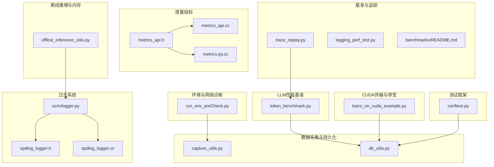
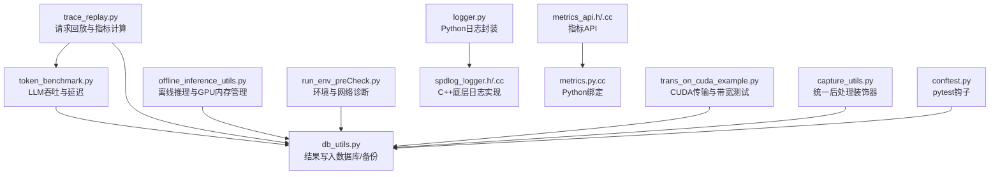
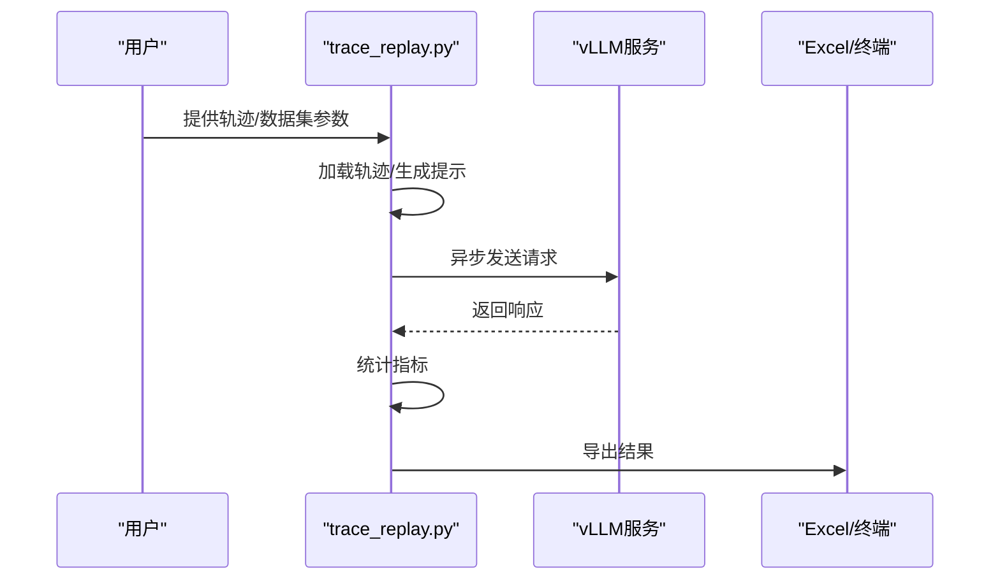
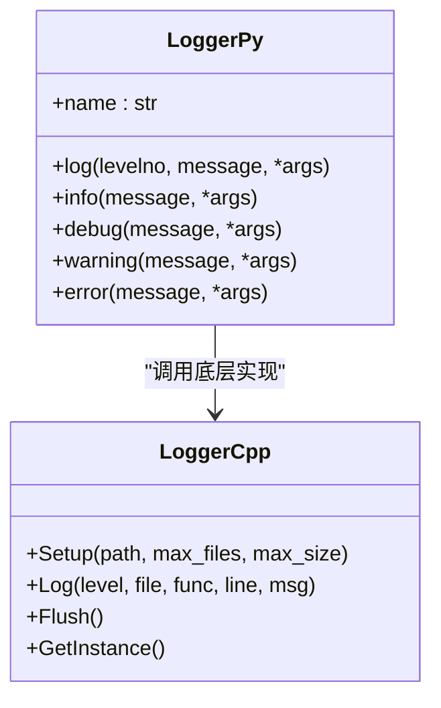
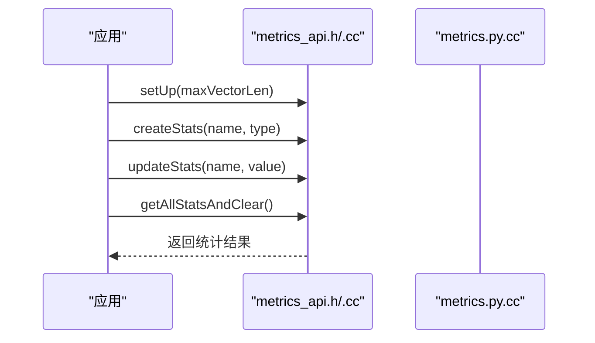
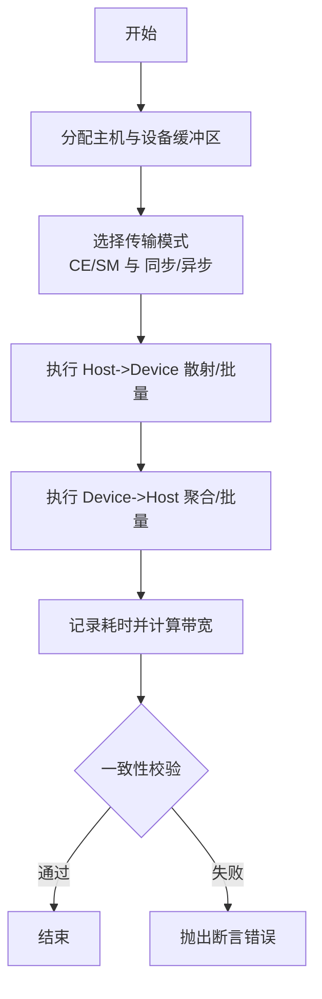
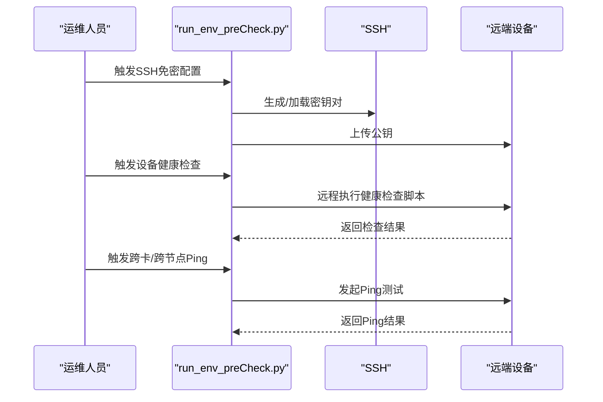
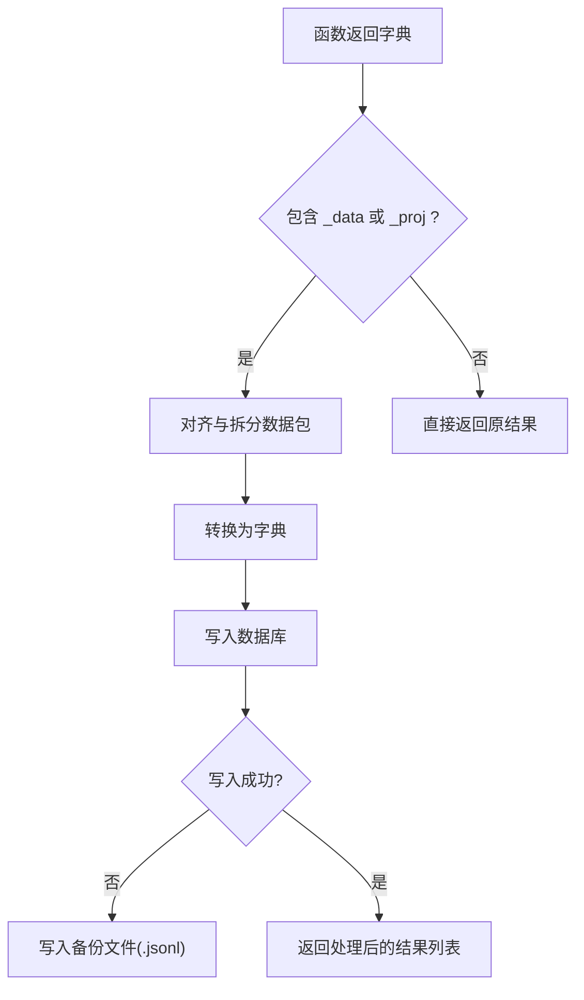
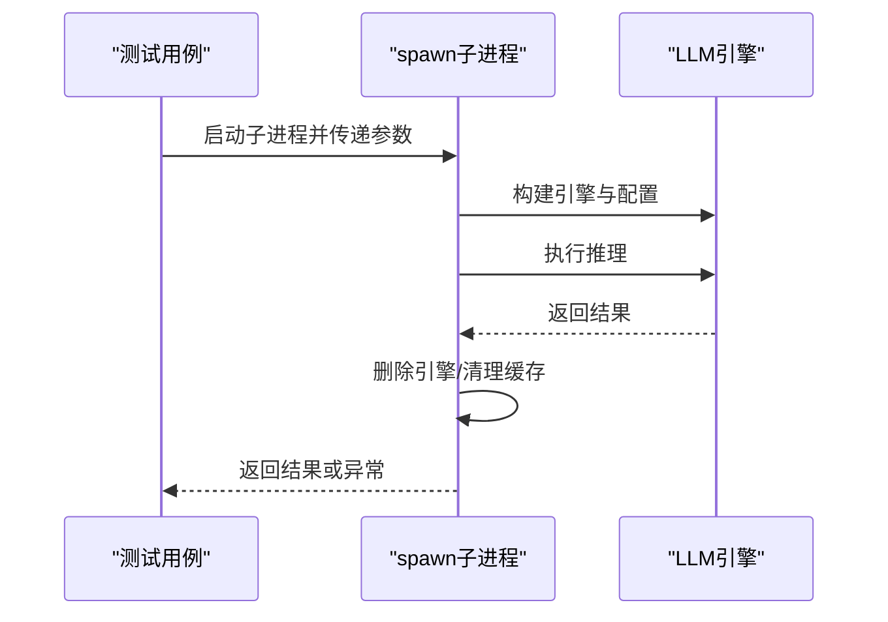
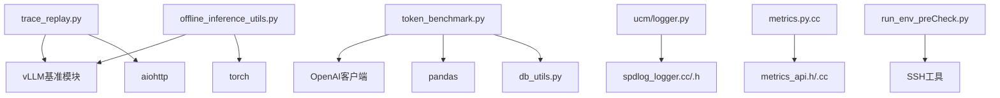

# 调试工具

<cite>
**本文引用的文件**
- [benchmarks/README.md](file://benchmarks/README.md)
- [benchmarks/logging_perf_test.py](file://benchmarks/logging_perf_test.py)
- [benchmarks/trace_replay.py](file://benchmarks/trace_replay.py)
- [test/common/llmperf/utils/token_benchmark.py](file://test/common/llmperf/utils/token_benchmark.py)
- [test/common/envPreCheck/run_env_preCheck.py](file://test/common/envPreCheck/run_env_preCheck.py)
- [test/common/capture_utils.py](file://test/common/capture_utils.py)
- [test/common/db_utils.py](file://test/common/db_utils.py)
- [test/common/offline_inference_utils.py](file://test/common/offline_inference_utils.py)
- [ucm/logger.py](file://ucm/logger.py)
- [ucm/shared/infra/logger/cc/spdlog_logger.cc](file://ucm/shared/infra/logger/cc/spdlog_logger.cc)
- [ucm/shared/infra/logger/cc/spdlog_logger.h](file://ucm/shared/infra/logger/cc/spdlog_logger.h)
- [ucm/shared/test/example/trans/trans_on_cuda_example.py](file://ucm/shared/test/example/trans/trans_on_cuda_example.py)
- [ucm/shared/test/example/metrics/monitor_stats_example.py](file://ucm/shared/test/example/metrics/monitor_stats_example.py)
- [ucm/shared/metrics/cc/api/metrics_api.cc](file://ucm/shared/metrics/cc/api/metrics_api.cc)
- [ucm/shared/metrics/cc/api/metrics_api.h](file://ucm/shared/metrics/cc/api/metrics_api.h)
- [ucm/shared/metrics/cpy/metrics.py.cc](file://ucm/shared/metrics/cpy/metrics.py.cc)
- [test/conftest.py](file://test/conftest.py)
</cite>

## 目录
1. [简介](#简介)
2. [项目结构](#项目结构)
3. [核心组件](#核心组件)
4. [架构总览](#架构总览)
5. [详细组件分析](#详细组件分析)
6. [依赖关系分析](#依赖关系分析)
7. [性能考虑](#性能考虑)
8. [故障排查指南](#故障排查指南)
9. [结论](#结论)
10. [附录](#附录)

## 简介
本指南聚焦于UCM项目的调试与性能分析工具链，覆盖以下方面：
- 性能剖析：CPU与GPU性能分析方法
- 内存分析：内存泄漏检测与内存使用优化
- 网络诊断：连接状态检查与带宽测试
- 调试脚本：如token_benchmark.py等性能测试工具
- 最小化复现案例：问题复现与调试的最佳实践

目标是帮助开发者快速定位性能瓶颈、资源占用异常与网络连通性问题，并建立可重复的性能回归与稳定性验证流程。

## 项目结构
围绕调试与性能分析的关键目录与文件：
- 基准测试与追踪回放：benchmarks/
- LLM推理性能基准：test/common/llmperf/utils/token_benchmark.py
- 环境预检与网络诊断：test/common/envPreCheck/run_env_preCheck.py
- 日志系统：ucm/logger.py 及底层C++实现
- 度量指标：ucm/shared/metrics/ 相关API与Python绑定
- CUDA传输与带宽测试示例：ucm/shared/test/example/trans/trans_on_cuda_example.py
- 数据采集与持久化：test/common/capture_utils.py、test/common/db_utils.py
- 离线推理与GPU内存清理：test/common/offline_inference_utils.py
- 测试框架钩子：test/conftest.py

图表来源
- [benchmarks/trace_replay.py](file://benchmarks/trace_replay.py#L1-L748)
- [benchmarks/logging_perf_test.py](file://benchmarks/logging_perf_test.py#L1-L181)
- [test/common/llmperf/utils/token_benchmark.py](file://test/common/llmperf/utils/token_benchmark.py#L1-L387)
- [test/common/envPreCheck/run_env_preCheck.py](file://test/common/envPreCheck/run_env_preCheck.py#L1-L800)
- [ucm/logger.py](file://ucm/logger.py#L1-L84)
- [ucm/shared/infra/logger/cc/spdlog_logger.h](file://ucm/shared/infra/logger/cc/spdlog_logger.h#L1-L78)
- [ucm/shared/infra/logger/cc/spdlog_logger.cc](file://ucm/shared/infra/logger/cc/spdlog_logger.cc#L1-L94)
- [ucm/shared/metrics/cc/api/metrics_api.h](file://ucm/shared/metrics/cc/api/metrics_api.h#L28-L43)
- [ucm/shared/metrics/cc/api/metrics_api.cc](file://ucm/shared/metrics/cc/api/metrics_api.cc#L28-L51)
- [ucm/shared/metrics/cpy/metrics.py.cc](file://ucm/shared/metrics/cpy/metrics.py.cc#L27-L53)
- [ucm/shared/test/example/trans/trans_on_cuda_example.py](file://ucm/shared/test/example/trans/trans_on_cuda_example.py#L1-L266)
- [test/common/capture_utils.py](file://test/common/capture_utils.py#L1-L122)
- [test/common/db_utils.py](file://test/common/db_utils.py#L1-L283)
- [test/common/offline_inference_utils.py](file://test/common/offline_inference_utils.py#L1-L376)
- [test/conftest.py](file://test/conftest.py#L151-L189)

章节来源
- [benchmarks/README.md](file://benchmarks/README.md#L1-L129)
- [benchmarks/trace_replay.py](file://benchmarks/trace_replay.py#L1-L748)
- [test/common/llmperf/utils/token_benchmark.py](file://test/common/llmperf/utils/token_benchmark.py#L1-L387)
- [test/common/envPreCheck/run_env_preCheck.py](file://test/common/envPreCheck/run_env_preCheck.py#L1-L800)
- [ucm/logger.py](file://ucm/logger.py#L1-L84)
- [ucm/shared/infra/logger/cc/spdlog_logger.h](file://ucm/shared/infra/logger/cc/spdlog_logger.h#L1-L78)
- [ucm/shared/infra/logger/cc/spdlog_logger.cc](file://ucm/shared/infra/logger/cc/spdlog_logger.cc#L1-L94)
- [ucm/shared/metrics/cc/api/metrics_api.h](file://ucm/shared/metrics/cc/api/metrics_api.h#L28-L43)
- [ucm/shared/metrics/cc/api/metrics_api.cc](file://ucm/shared/metrics/cc/api/metrics_api.cc#L28-L51)
- [ucm/shared/metrics/cpy/metrics.py.cc](file://ucm/shared/metrics/cpy/metrics.py.cc#L27-L53)
- [ucm/shared/test/example/trans/trans_on_cuda_example.py](file://ucm/shared/test/example/trans/trans_on_cuda_example.py#L1-L266)
- [test/common/capture_utils.py](file://test/common/capture_utils.py#L1-L122)
- [test/common/db_utils.py](file://test/common/db_utils.py#L1-L283)
- [test/common/offline_inference_utils.py](file://test/common/offline_inference_utils.py#L1-L376)
- [test/conftest.py](file://test/conftest.py#L151-L189)

## 核心组件
- 性能追踪与回放：基于历史请求轨迹或动态数据集生成请求，计算端到端延迟、首Token时间、每Token时间等关键指标。
- 日志系统：统一的日志封装与底层C++ spdlog实现，支持异步、轮转与信号安全刷新。
- 指标度量：计数器、仪表盘、直方图等指标的创建、更新与导出。
- CUDA传输与带宽：主机与设备间散射/聚合、批量传输与同步，支持带宽计算与一致性校验。
- 环境与网络诊断：SSH免密配置、Ascend/NVIDIA设备健康检查、跨卡/跨节点Ping测试。
- 数据采集与持久化：统一后处理装饰器与数据库写入，支持动态表结构与备份文件。
- 离线推理与GPU内存管理：多进程spawn模式执行、显存清理与分布式环境收尾。

章节来源
- [benchmarks/trace_replay.py](file://benchmarks/trace_replay.py#L1-L748)
- [ucm/logger.py](file://ucm/logger.py#L1-L84)
- [ucm/shared/infra/logger/cc/spdlog_logger.cc](file://ucm/shared/infra/logger/cc/spdlog_logger.cc#L1-L94)
- [ucm/shared/test/example/trans/trans_on_cuda_example.py](file://ucm/shared/test/example/trans/trans_on_cuda_example.py#L1-L266)
- [test/common/envPreCheck/run_env_preCheck.py](file://test/common/envPreCheck/run_env_preCheck.py#L1-L800)
- [test/common/capture_utils.py](file://test/common/capture_utils.py#L1-L122)
- [test/common/db_utils.py](file://test/common/db_utils.py#L1-L283)
- [test/common/offline_inference_utils.py](file://test/common/offline_inference_utils.py#L1-L376)

## 架构总览
下图展示调试工具链在系统中的交互关系与数据流：

图表来源
- [benchmarks/trace_replay.py](file://benchmarks/trace_replay.py#L1-L748)
- [test/common/llmperf/utils/token_benchmark.py](file://test/common/llmperf/utils/token_benchmark.py#L1-L387)
- [test/common/db_utils.py](file://test/common/db_utils.py#L1-L283)
- [test/common/offline_inference_utils.py](file://test/common/offline_inference_utils.py#L1-L376)
- [test/common/envPreCheck/run_env_preCheck.py](file://test/common/envPreCheck/run_env_preCheck.py#L1-L800)
- [ucm/shared/test/example/trans/trans_on_cuda_example.py](file://ucm/shared/test/example/trans/trans_on_cuda_example.py#L1-L266)
- [ucm/logger.py](file://ucm/logger.py#L1-L84)
- [ucm/shared/infra/logger/cc/spdlog_logger.h](file://ucm/shared/infra/logger/cc/spdlog_logger.h#L1-L78)
- [ucm/shared/infra/logger/cc/spdlog_logger.cc](file://ucm/shared/infra/logger/cc/spdlog_logger.cc#L1-L94)
- [ucm/shared/metrics/cc/api/metrics_api.h](file://ucm/shared/metrics/cc/api/metrics_api.h#L28-L43)
- [ucm/shared/metrics/cc/api/metrics_api.cc](file://ucm/shared/metrics/cc/api/metrics_api.cc#L28-L51)
- [ucm/shared/metrics/cpy/metrics.py.cc](file://ucm/shared/metrics/cpy/metrics.py.cc#L27-L53)
- [test/common/capture_utils.py](file://test/common/capture_utils.py#L1-L122)
- [test/conftest.py](file://test/conftest.py#L151-L189)

## 详细组件分析

### 组件A：性能追踪与回放（TraceReplay）
- 功能概述
  - 支持从缓存轨迹文件重放或基于公开数据集动态生成请求。
  - 计算关键指标：首Token时间（TTFT）、每输出Token时间（TPOT）、令牌间延迟（ITL）、端到端延迟（E2EL）等。
  - 输出汇总结果至终端与Excel文件。
- 关键流程
  - 加载轨迹文件，按时间戳分组请求。
  - 选择Hash ID或数据集两种提示生成方式。
  - 异步发送请求，统计完成数量与吞吐。
  - 计算并保存指标到Excel。
- 使用建议
  - 在本地或远程vLLM实例上运行，确保环境变量指向vLLM基准模块路径。
  - 合理设置并发与超时，避免长时间阻塞。
  - 使用“保存提示”功能复用生成的提示，便于后续对比。

图表来源
- [benchmarks/trace_replay.py](file://benchmarks/trace_replay.py#L462-L681)
- [benchmarks/README.md](file://benchmarks/README.md#L1-L129)

章节来源
- [benchmarks/trace_replay.py](file://benchmarks/trace_replay.py#L1-L748)
- [benchmarks/README.md](file://benchmarks/README.md#L1-L129)

### 组件B：日志系统（Python封装与C++底层）
- 功能概述
  - Python侧通过Logger类桥接底层C++ spdlog实现，支持级别映射、文件轮转、格式化输出与信号触发刷新。
  - C++侧提供异步日志、颜色控制台输出、旋转文件输出与环境变量级别控制。
- 关键流程
  - 初始化日志路径、最大文件数与大小。
  - 将Python logging级别映射到底层Level枚举。
  - 记录调用者文件、函数、行号，形成统一格式。
- 使用建议
  - 在性能敏感路径中注意日志级别与I/O开销。
  - 生产环境可通过环境变量调整日志级别。

图表来源
- [ucm/logger.py](file://ucm/logger.py#L40-L75)
- [ucm/shared/infra/logger/cc/spdlog_logger.h](file://ucm/shared/infra/logger/cc/spdlog_logger.h#L38-L74)
- [ucm/shared/infra/logger/cc/spdlog_logger.cc](file://ucm/shared/infra/logger/cc/spdlog_logger.cc#L40-L91)

章节来源
- [ucm/logger.py](file://ucm/logger.py#L1-L84)
- [ucm/shared/infra/logger/cc/spdlog_logger.h](file://ucm/shared/infra/logger/cc/spdlog_logger.h#L1-L78)
- [ucm/shared/infra/logger/cc/spdlog_logger.cc](file://ucm/shared/infra/logger/cc/spdlog_logger.cc#L1-L94)

### 组件C：指标度量（监控与导出）
- 功能概述
  - 提供计数器、仪表盘、直方图等指标类型。
  - 支持单值与批量更新，周期性获取并清空统计。
  - Python绑定通过pybind11暴露接口。
- 关键流程
  - 设置最大向量长度。
  - 创建指标类型与名称。
  - 更新指标值并导出。
- 使用建议
  - 在关键路径埋点，避免高频更新导致开销过大。
  - 结合数据库写入与可视化平台进行趋势分析。

图表来源
- [ucm/shared/metrics/cc/api/metrics_api.h](file://ucm/shared/metrics/cc/api/metrics_api.h#L28-L43)
- [ucm/shared/metrics/cc/api/metrics_api.cc](file://ucm/shared/metrics/cc/api/metrics_api.cc#L28-L51)
- [ucm/shared/metrics/cpy/metrics.py.cc](file://ucm/shared/metrics/cpy/metrics.py.cc#L27-L53)

章节来源
- [ucm/shared/metrics/cc/api/metrics_api.h](file://ucm/shared/metrics/cc/api/metrics_api.h#L28-L43)
- [ucm/shared/metrics/cc/api/metrics_api.cc](file://ucm/shared/metrics/cc/api/metrics_api.cc#L28-L51)
- [ucm/shared/metrics/cpy/metrics.py.cc](file://ucm/shared/metrics/cpy/metrics.py.cc#L27-L53)

### 组件D：CUDA传输与带宽测试
- 功能概述
  - 支持主机到设备散射/批量、设备到主机聚合/批量、同步与异步版本。
  - 计算带宽并进行数据一致性校验。
- 关键流程
  - 分配固定大小的主机内存与设备缓冲区。
  - 执行传输操作，记录耗时。
  - 计算带宽并断言一致性。
- 使用建议
  - 控制传输块大小与数量，避免超出设备内存。
  - 使用异步接口提升吞吐，但需确保同步以保证正确性。

图表来源
- [ucm/shared/test/example/trans/trans_on_cuda_example.py](file://ucm/shared/test/example/trans/trans_on_cuda_example.py#L85-L261)

章节来源
- [ucm/shared/test/example/trans/trans_on_cuda_example.py](file://ucm/shared/test/example/trans/trans_on_cuda_example.py#L1-L266)

### 组件E：环境与网络诊断（SSH与设备健康）
- 功能概述
  - 配置SSH免密登录，支持Ascend与NVIDIA设备健康检查。
  - 执行跨卡/跨节点Ping测试，收集链路状态。
- 关键流程
  - 生成/加载SSH密钥对，上传公钥至远端。
  - 远程执行设备状态检查命令，解析结果。
  - 执行本地/远程卡间Ping，汇总全局状态。
- 使用建议
  - 先在主节点执行设备健康检查，再进行跨节点连通性测试。
  - 记录并比对不同节点的设备拓扑与温度阈值。

图表来源
- [test/common/envPreCheck/run_env_preCheck.py](file://test/common/envPreCheck/run_env_preCheck.py#L160-L800)

章节来源
- [test/common/envPreCheck/run_env_preCheck.py](file://test/common/envPreCheck/run_env_preCheck.py#L1-L800)

### 组件F：数据采集与持久化（统一后处理与数据库）
- 功能概述
  - 装饰器export_vars统一处理返回的字典数据，自动写入数据库或备份文件。
  - db_utils动态建表、字段扩展与原子插入，支持过滤读取与备份降级。
- 关键流程
  - 函数返回包含"_data"/"_proj"的字典。
  - 装饰器对齐与拆分混合数据包，转换为字典并写入。
  - 若数据库不可用则写入JSONL备份文件。
- 使用建议
  - 在测试用例中统一使用装饰器，减少重复逻辑。
  - 对动态字段保持兼容，避免因schema变更导致失败。

图表来源
- [test/common/capture_utils.py](file://test/common/capture_utils.py#L34-L110)
- [test/common/db_utils.py](file://test/common/db_utils.py#L136-L208)

章节来源
- [test/common/capture_utils.py](file://test/common/capture_utils.py#L1-L122)
- [test/common/db_utils.py](file://test/common/db_utils.py#L1-L283)

### 组件G：离线推理与GPU内存管理
- 功能概述
  - 多进程spawn模式执行，确保每次测试后GPU显存完全释放。
  - 自动清理分布式环境与缓存，降低内存累积风险。
- 关键流程
  - 在子进程中执行测试逻辑，捕获异常并回传。
  - 退出前删除引擎对象，同步并清理缓存。
- 使用建议
  - 每个离线推理测试使用独立子进程，避免共享状态污染。
  - 在高负载场景下适当增大超时时间。

图表来源
- [test/common/offline_inference_utils.py](file://test/common/offline_inference_utils.py#L67-L110)
- [test/common/offline_inference_utils.py](file://test/common/offline_inference_utils.py#L201-L246)

章节来源
- [test/common/offline_inference_utils.py](file://test/common/offline_inference_utils.py#L1-L376)

### 组件H：LLM性能基准（token_benchmark.py）
- 功能概述
  - 生成随机提示与采样参数，多线程并发请求，统计吞吐与延迟。
  - 计算总体输出吞吐、完成请求数、错误率与量化指标。
- 关键流程
  - 生成提示与采样参数，提交到线程池。
  - 等待完成或超时，汇总指标并写入结果。
- 使用建议
  - 合理设置并发数与超时，平衡吞吐与稳定性。
  - 使用统一元数据结构便于横向对比。

章节来源
- [test/common/llmperf/utils/token_benchmark.py](file://test/common/llmperf/utils/token_benchmark.py#L1-L387)

## 依赖关系分析
- 组件耦合
  - trace_replay依赖vLLM基准模块与aiohttp客户端，输出Excel与终端。
  - token_benchmark依赖OpenAI兼容客户端与pandas，结果写入数据库。
  - 离线推理依赖vLLM与torch，确保GPU内存回收。
  - 日志系统通过Python封装调用C++底层实现。
  - 指标系统通过pybind11桥接到C++ API。
- 外部依赖
  - vLLM、aiohttp、pandas、peewee、pybind11、spdlog、cupy等。
- 循环依赖
  - 未发现直接循环导入；日志与指标通过模块化设计避免耦合。

图表来源
- [benchmarks/trace_replay.py](file://benchmarks/trace_replay.py#L1-L748)
- [test/common/llmperf/utils/token_benchmark.py](file://test/common/llmperf/utils/token_benchmark.py#L1-L387)
- [test/common/db_utils.py](file://test/common/db_utils.py#L1-L283)
- [test/common/offline_inference_utils.py](file://test/common/offline_inference_utils.py#L1-L376)
- [ucm/logger.py](file://ucm/logger.py#L1-L84)
- [ucm/shared/infra/logger/cc/spdlog_logger.cc](file://ucm/shared/infra/logger/cc/spdlog_logger.cc#L1-L94)
- [ucm/shared/metrics/cpy/metrics.py.cc](file://ucm/shared/metrics/cpy/metrics.py.cc#L27-L53)
- [ucm/shared/metrics/cc/api/metrics_api.cc](file://ucm/shared/metrics/cc/api/metrics_api.cc#L28-L51)
- [test/common/envPreCheck/run_env_preCheck.py](file://test/common/envPreCheck/run_env_preCheck.py#L1-L800)

章节来源
- [benchmarks/trace_replay.py](file://benchmarks/trace_replay.py#L1-L748)
- [test/common/llmperf/utils/token_benchmark.py](file://test/common/llmperf/utils/token_benchmark.py#L1-L387)
- [test/common/db_utils.py](file://test/common/db_utils.py#L1-L283)
- [test/common/offline_inference_utils.py](file://test/common/offline_inference_utils.py#L1-L376)
- [ucm/logger.py](file://ucm/logger.py#L1-L84)
- [ucm/shared/infra/logger/cc/spdlog_logger.cc](file://ucm/shared/infra/logger/cc/spdlog_logger.cc#L1-L94)
- [ucm/shared/metrics/cpy/metrics.py.cc](file://ucm/shared/metrics/cpy/metrics.py.cc#L27-L53)
- [ucm/shared/metrics/cc/api/metrics_api.cc](file://ucm/shared/metrics/cc/api/metrics_api.cc#L28-L51)
- [test/common/envPreCheck/run_env_preCheck.py](file://test/common/envPreCheck/run_env_preCheck.py#L1-L800)

## 性能考虑
- CPU与GPU性能分析
  - 使用CUDA传输示例评估不同模式（CE/SM、同步/异步、单批/批量）的带宽与延迟，结合日志与指标系统定位瓶颈。
  - 在LLM推理场景中，合理设置并发数与超时，避免过载导致抖动。
- 内存分析
  - 离线推理采用多进程spawn模式，确保显存释放；配合GPU内存清理函数与分布式环境收尾，减少泄漏风险。
  - 使用日志级别与I/O策略降低内存压力。
- 网络诊断
  - 通过SSH免密与设备健康检查快速定位网络与硬件问题；跨卡/跨节点Ping测试用于验证互联拓扑与链路质量。
- 数据持久化
  - 统一装饰器与数据库写入，支持动态schema与备份降级，保障结果可追溯。

## 故障排查指南
- 日志级别与性能
  - 当性能抖动时，临时降低日志级别或关闭文件落盘，观察是否缓解。
  - 检查日志轮转配置，避免磁盘I/O成为瓶颈。
- 网络连通性
  - SSH免密失败时，确认密钥生成、上传与权限；远端服务可用性与防火墙策略。
  - 设备健康检查失败时，核对驱动、温度、PCIe链路与拓扑。
- CUDA传输异常
  - 检查设备内存是否充足，传输块大小与数量是否合理。
  - 使用异步接口时务必同步，确保数据一致性。
- 数据写入失败
  - 数据库不可用时，确认备份文件路径与权限；检查动态建表与字段兼容性。

章节来源
- [ucm/logger.py](file://ucm/logger.py#L1-L84)
- [ucm/shared/infra/logger/cc/spdlog_logger.cc](file://ucm/shared/infra/logger/cc/spdlog_logger.cc#L1-L94)
- [test/common/envPreCheck/run_env_preCheck.py](file://test/common/envPreCheck/run_env_preCheck.py#L1-L800)
- [ucm/shared/test/example/trans/trans_on_cuda_example.py](file://ucm/shared/test/example/trans/trans_on_cuda_example.py#L1-L266)
- [test/common/db_utils.py](file://test/common/db_utils.py#L1-L283)

## 结论
本指南梳理了UCM项目中与调试、性能分析与问题定位相关的核心工具链：从请求回放到指标导出，从日志系统到CUDA传输，再到环境诊断与数据持久化。通过规范化的使用流程与最佳实践，可以高效地识别并解决性能瓶颈、资源占用与网络连通性问题，并建立可持续的回归与稳定性验证体系。

## 附录
- 最小化复现案例建议
  - 明确问题现象与期望行为，剥离无关依赖，保留最小可运行脚本。
  - 在离线推理场景中使用多进程spawn模式，确保环境隔离与资源回收。
  - 使用统一的数据采集与持久化机制记录关键指标，便于对比分析。
- 常用命令与参数
  - 请求回放：参考基准工具README中的参数与示例。
  - 日志级别：通过环境变量控制底层日志级别。
  - 指标导出：在关键路径埋点并定期导出统计结果。