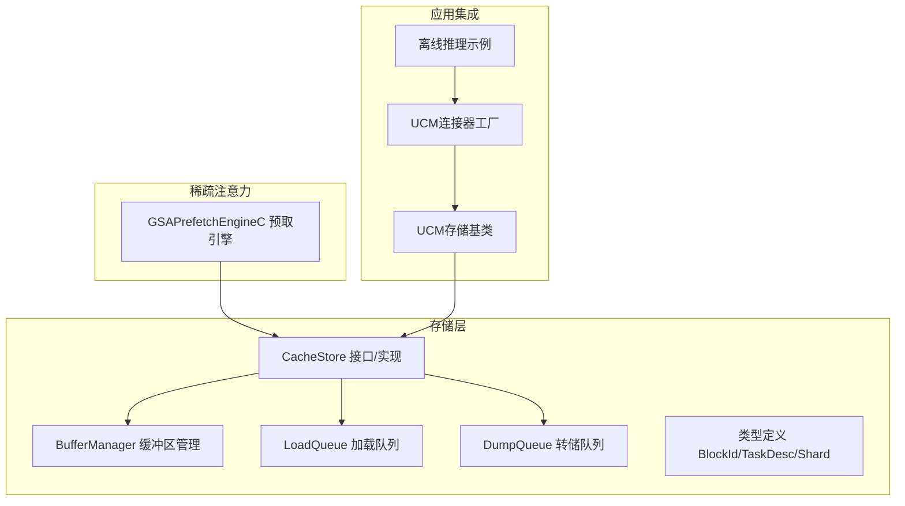
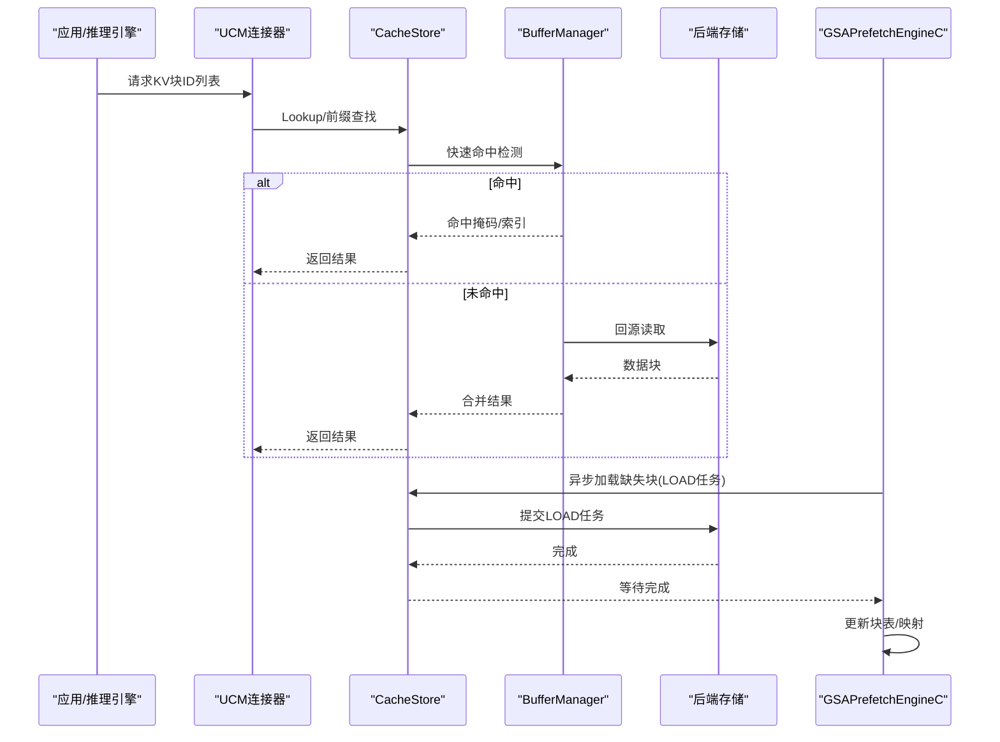
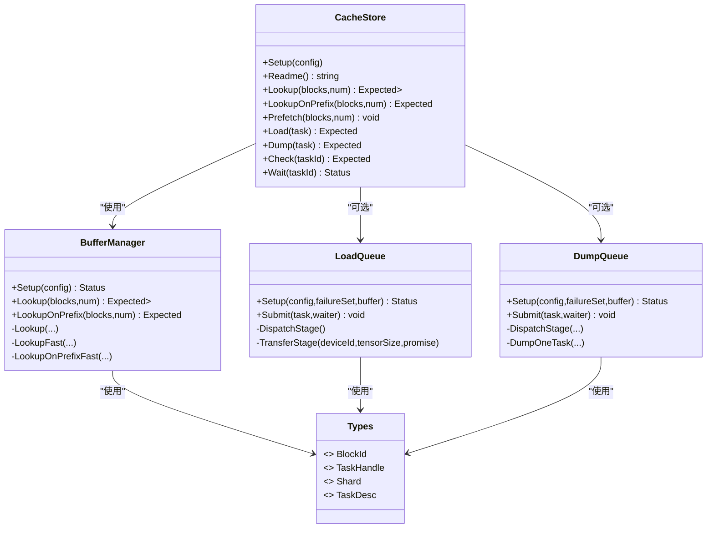
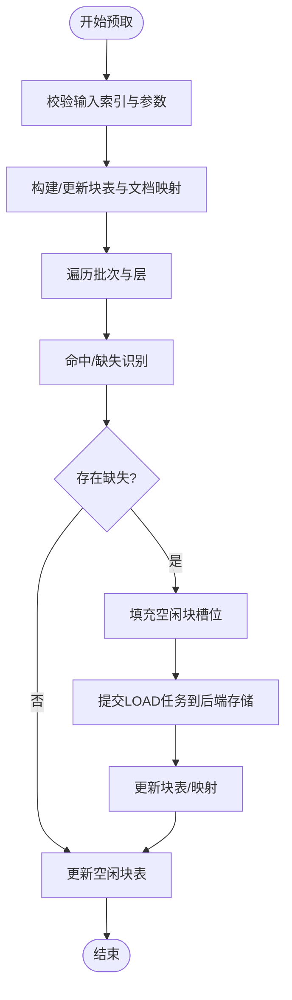
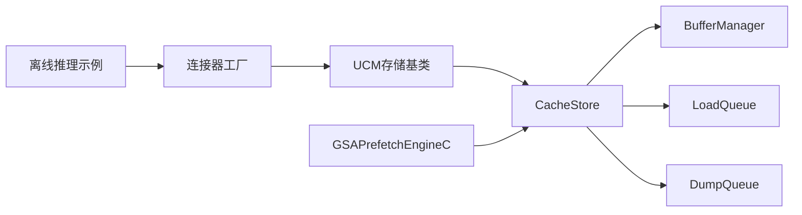

# KV缓存原理

<cite>
**本文引用的文件**
- [缓存存储接口与实现(cache_store.h)](file://ucm/store/cache/cc/cache_store.h)
- [缓存存储接口与实现(cache_store.cc)](file://ucm/store/cache/cc/cache_store.cc)
- [缓冲区管理器(buffer_manager.h)](file://ucm/store/cache/cc/buffer_manager.h)
- [加载队列(load_queue.h)](file://ucm/store/cache/cc/load_queue.h)
- [转储队列(dump_queue.h)](file://ucm/store/cache/cc/dump_queue.h)
- [类型定义(types.h)](file://ucm/store/detail/type/types.h)
- [KV缓存预取引擎(kvcache_pre.h)](file://ucm/sparse/gsa/prefetch/include/kvcache_pre.h)
- [KV缓存预取引擎(kvcache_pre.cpp)](file://ucm/sparse/gsa/prefetch/src/kvcache_pre.cpp)
- [KV缓存计算器(kv_cache_calculator.md)](file://docs/source/getting-started/kv_cache_calculator.md)
- [稀疏注意力-KVComp(KVComp.md)](file://docs/source/user-guide/sparse-attention/kvcomp.md)
- [离线推理示例(offline_inference.py)](file://examples/offline_inference.py)
- [UCM连接器工厂(factory.py)](file://ucm/store/factory.py)
- [UCM存储基类(ucmstore.py)](file://ucm/store/ucmstore.py)
</cite>

## 目录
1. [引言](#引言)
2. [项目结构](#项目结构)
3. [核心组件](#核心组件)
4. [架构总览](#架构总览)
5. [详细组件分析](#详细组件分析)
6. [依赖关系分析](#依赖关系分析)
7. [性能考量](#性能考量)
8. [故障排查指南](#故障排查指南)
9. [结论](#结论)
10. [附录](#附录)

## 引言
本文件围绕大语言模型推理中的Key-Value(KV)缓存原理进行系统性阐述，结合统一缓存管理系统(UCM)的代码实现，解释KV缓存在注意力机制中的作用、缓存块(Block)的组织与管理、生命周期管理（从首次生成到重复使用）、存储策略（内存缓存、持久化存储与混合方案），以及缓存命中率对推理性能的影响与优化方法。同时，提供基于仓库源码的序列图与流程图，帮助开发者理解KV缓存系统的内部工作机制。

## 项目结构
UCM在存储层提供了统一的KV缓存抽象与实现，核心位于ucm/store/cache/cc目录，包含缓存存储接口、缓冲区管理器、加载/转储队列等；在稀疏注意力模块中，GSAPrefetchEngineC负责KV缓存的预取与映射，支撑推理阶段的高效访问。

**图表来源**
- [缓存存储接口与实现(cache_store.h)](file://ucm/store/cache/cc/cache_store.h#L33-L48)
- [缓冲区管理器(buffer_manager.h)](file://ucm/store/cache/cc/buffer_manager.h#L34-L123)
- [加载队列(load_queue.h)](file://ucm/store/cache/cc/load_queue.h#L39-L75)
- [转储队列(dump_queue.h)](file://ucm/store/cache/cc/dump_queue.h#L39-L70)
- [类型定义(types.h)](file://ucm/store/detail/type/types.h#L31-L65)
- [KV缓存预取引擎(kvcache_pre.h)](file://ucm/sparse/gsa/prefetch/include/kvcache_pre.h#L67-L175)
- [离线推理示例(offline_inference.py)](file://examples/offline_inference.py#L18-L44)
- [UCM连接器工厂(factory.py)](file://ucm/store/factory.py#L34-L71)
- [UCM存储基类(ucmstore.py)](file://ucm/store/ucmstore.py#L39-L90)

**章节来源**
- [缓存存储接口与实现(cache_store.h)](file://ucm/store/cache/cc/cache_store.h#L33-L48)
- [缓冲区管理器(buffer_manager.h)](file://ucm/store/cache/cc/buffer_manager.h#L34-L123)
- [加载队列(load_queue.h)](file://ucm/store/cache/cc/load_queue.h#L39-L75)
- [转储队列(dump_queue.h)](file://ucm/store/cache/cc/dump_queue.h#L39-L70)
- [类型定义(types.h)](file://ucm/store/detail/type/types.h#L31-L65)
- [KV缓存预取引擎(kvcache_pre.h)](file://ucm/sparse/gsa/prefetch/include/kvcache_pre.h#L67-L175)
- [离线推理示例(offline_inference.py)](file://examples/offline_inference.py#L18-L44)
- [UCM连接器工厂(factory.py)](file://ucm/store/factory.py#L34-L71)
- [UCM存储基类(ucmstore.py)](file://ucm/store/ucmstore.py#L39-L90)

## 核心组件
- CacheStore：统一KV缓存存储接口，封装后端存储、缓冲区与传输管理，提供查找、前缀查找、预取、加载/转储任务提交与状态检查。
- BufferManager：在设备侧维护高速缓存缓冲区，支持快速命中检测与缺失回源后端存储，降低延迟。
- LoadQueue/DumpQueue：异步加载与转储队列，协调设备间数据传输，提升吞吐。
- GSAPrefetchEngineC：面向GSAsparse注意力的KV缓存预取引擎，负责命中/缺失块识别、块映射更新与HBM加载。
- 类型系统：BlockId、TaskDesc、Shard等，定义块标识、任务描述与分片结构。
- UCM存储基类与连接器工厂：为上层框架（如vLLM）提供统一的KV缓存接入点。

**章节来源**
- [缓存存储接口与实现(cache_store.cc)](file://ucm/store/cache/cc/cache_store.cc#L108-L181)
- [缓冲区管理器(buffer_manager.h)](file://ucm/store/cache/cc/buffer_manager.h#L49-L123)
- [加载队列(load_queue.h)](file://ucm/store/cache/cc/load_queue.h#L64-L75)
- [转储队列(dump_queue.h)](file://ucm/store/cache/cc/dump_queue.h#L60-L70)
- [类型定义(types.h)](file://ucm/store/detail/type/types.h#L31-L65)
- [KV缓存预取引擎(kvcache_pre.cpp)](file://ucm/sparse/gsa/prefetch/src/kvcache_pre.cpp#L108-L142)
- [UCM存储基类(ucmstore.py)](file://ucm/store/ucmstore.py#L39-L90)
- [UCM连接器工厂(factory.py)](file://ucm/store/factory.py#L34-L71)

## 架构总览
下图展示了KV缓存在推理中的整体交互：上层框架请求块ID，CacheStore先查本地缓冲区，未命中则回源后端存储；GSAPrefetchEngineC在解码阶段根据Top-k索引进行命中/缺失判断，并将缺失块异步加载至HBM，同时维护块表与映射。

**图表来源**
- [缓存存储接口与实现(cache_store.cc)](file://ucm/store/cache/cc/cache_store.cc#L133-L181)
- [缓冲区管理器(buffer_manager.h)](file://ucm/store/cache/cc/buffer_manager.h#L61-L122)
- [KV缓存预取引擎(kvcache_pre.cpp)](file://ucm/sparse/gsa/prefetch/src/kvcache_pre.cpp#L441-L489)

## 详细组件分析

### 组件A：缓存存储与缓冲区管理
- CacheStore对外提供统一接口：Setup、Lookup、LookupOnPrefix、Prefetch、Load、Dump、Check、Wait。内部持有BufferManager与TransManager，按需启用设备传输能力。
- BufferManager在有设备侧缓冲时，先进行快速命中检测，再对缺失块发起后端查找，并将结果写回对应位置，显著降低整体延迟。
- LoadQueue/DumpQueue分别处理加载与转储任务，采用无锁环形队列与工作线程，支持多分片并行传输。

**图表来源**
- [缓存存储接口与实现(cache_store.h)](file://ucm/store/cache/cc/cache_store.h#L33-L48)
- [缓存存储接口与实现(cache_store.cc)](file://ucm/store/cache/cc/cache_store.cc#L108-L181)
- [缓冲区管理器(buffer_manager.h)](file://ucm/store/cache/cc/buffer_manager.h#L34-L123)
- [加载队列(load_queue.h)](file://ucm/store/cache/cc/load_queue.h#L39-L75)
- [转储队列(dump_queue.h)](file://ucm/store/cache/cc/dump_queue.h#L39-L70)
- [类型定义(types.h)](file://ucm/store/detail/type/types.h#L31-L65)

**章节来源**
- [缓存存储接口与实现(cache_store.cc)](file://ucm/store/cache/cc/cache_store.cc#L108-L181)
- [缓冲区管理器(buffer_manager.h)](file://ucm/store/cache/cc/buffer_manager.h#L49-L123)
- [加载队列(load_queue.h)](file://ucm/store/cache/cc/load_queue.h#L64-L75)
- [转储队列(dump_queue.h)](file://ucm/store/cache/cc/dump_queue.h#L60-L70)
- [类型定义(types.h)](file://ucm/store/detail/type/types.h#L31-L65)

### 组件B：KV缓存预取与块映射
- GSAPrefetchEngineC维护每个请求的块表与文档映射，根据Top-k索引识别命中/缺失块，优先利用空闲块槽位加载缺失块，并更新映射表。
- 支持MLA模式与非MLA模式下的K/V偏移计算，确保不同拓扑下正确写入HBM。
- 通过线程池并发处理批量请求，异步提交LOAD任务并等待完成，期间可停止以配合模型运行状态。

**图表来源**
- [KV缓存预取引擎(kvcache_pre.cpp)](file://ucm/sparse/gsa/prefetch/src/kvcache_pre.cpp#L401-L439)
- [KV缓存预取引擎(kvcache_pre.cpp)](file://ucm/sparse/gsa/prefetch/src/kvcache_pre.cpp#L441-L489)
- [KV缓存预取引擎(kvcache_pre.h)](file://ucm/sparse/gsa/prefetch/include/kvcache_pre.h#L140-L175)

**章节来源**
- [KV缓存预取引擎(kvcache_pre.h)](file://ucm/sparse/gsa/prefetch/include/kvcache_pre.h#L67-L175)
- [KV缓存预取引擎(kvcache_pre.cpp)](file://ucm/sparse/gsa/prefetch/src/kvcache_pre.cpp#L108-L142)
- [KV缓存预取引擎(kvcache_pre.cpp)](file://ucm/sparse/gsa/prefetch/src/kvcache_pre.cpp#L401-L439)
- [KV缓存预取引擎(kvcache_pre.cpp)](file://ucm/sparse/gsa/prefetch/src/kvcache_pre.cpp#L441-L489)

### 组件C：类型与任务描述
- BlockId为16字节哈希标识块；TaskHandle为不透明的任务令牌；Shard描述块内分片及设备地址；TaskDesc继承自向量，用于批量装载/卸载描述。
- 这些类型贯穿于CacheStore、BufferManager、LoadQueue/DumpQueue与GSAPrefetchEngineC之间，保证跨模块一致的数据契约。

**章节来源**
- [类型定义(types.h)](file://ucm/store/detail/type/types.h#L31-L65)

### 组件D：应用集成与配置
- 离线推理示例展示了如何通过KVTransferConfig注入UCM连接器，并设置块大小、最大上下文长度等参数。
- UCM连接器工厂注册多种存储后端（如NFS、PCStore、Mooncake），便于在不同硬件/环境选择合适的KV缓存实现。
- UCM存储基类定义了创建、查找、预取等抽象接口，供具体实现遵循。

**章节来源**
- [离线推理示例(offline_inference.py)](file://examples/offline_inference.py#L18-L44)
- [UCM连接器工厂(factory.py)](file://ucm/store/factory.py#L34-L71)
- [UCM存储基类(ucmstore.py)](file://ucm/store/ucmstore.py#L39-L90)

## 依赖关系分析
- CacheStore依赖BufferManager进行命中检测与回源查找；当启用设备传输时，进一步依赖LoadQueue/DumpQueue进行异步数据搬运。
- GSAPrefetchEngineC依赖UC::CCStore接口提交LOAD任务，并与KV缓存张量布局紧密耦合（K/V偏移计算）。
- 上层框架通过UCM连接器工厂与UCM存储基类对接，形成“抽象接口-具体实现”的清晰边界。

**图表来源**
- [离线推理示例(offline_inference.py)](file://examples/offline_inference.py#L18-L44)
- [UCM连接器工厂(factory.py)](file://ucm/store/factory.py#L34-L71)
- [UCM存储基类(ucmstore.py)](file://ucm/store/ucmstore.py#L39-L90)
- [缓存存储接口与实现(cache_store.h)](file://ucm/store/cache/cc/cache_store.h#L33-L48)
- [缓冲区管理器(buffer_manager.h)](file://ucm/store/cache/cc/buffer_manager.h#L34-L123)
- [加载队列(load_queue.h)](file://ucm/store/cache/cc/load_queue.h#L39-L75)
- [转储队列(dump_queue.h)](file://ucm/store/cache/cc/dump_queue.h#L39-L70)
- [KV缓存预取引擎(kvcache_pre.h)](file://ucm/sparse/gsa/prefetch/include/kvcache_pre.h#L67-L175)

**章节来源**
- [离线推理示例(offline_inference.py)](file://examples/offline_inference.py#L18-L44)
- [UCM连接器工厂(factory.py)](file://ucm/store/factory.py#L34-L71)
- [UCM存储基类(ucmstore.py)](file://ucm/store/ucmstore.py#L39-L90)
- [缓存存储接口与实现(cache_store.h)](file://ucm/store/cache/cc/cache_store.h#L33-L48)
- [缓冲区管理器(buffer_manager.h)](file://ucm/store/cache/cc/buffer_manager.h#L34-L123)
- [加载队列(load_queue.h)](file://ucm/store/cache/cc/load_queue.h#L39-L75)
- [转储队列(dump_queue.h)](file://ucm/store/cache/cc/dump_queue.h#L39-L70)
- [KV缓存预取引擎(kvcache_pre.h)](file://ucm/sparse/gsa/prefetch/include/kvcache_pre.h#L67-L175)

## 性能考量
- 命中率直接影响推理延迟与带宽占用：高命中率可显著减少回源查找与设备间传输。
- 缓冲区大小与队列深度需平衡：过小导致频繁回源，过大增加内存占用；合理的等待/运行队列深度有助于吞吐稳定。
- 块大小与对齐：块大小影响Top-k选择粒度与内存对齐效率；KVComp等稀疏注意力算法通过哈希相似度选择关键块，降低峰值显存占用。
- 预取策略：在解码阶段提前加载Top-k缺失块，结合线程池并发与异步队列，可有效缩短关键路径延迟。

[本节为通用性能讨论，无需特定文件分析]

## 故障排查指南
- 配置校验失败：检查设备ID、块大小、分片大小、缓冲数量与队列深度是否满足约束。
- 传输未启用：当设备ID为-1或配置不合法时，CacheStore不会启用设备传输，需确认硬件与配置。
- 任务状态异常：通过Check/Wait接口检查任务状态，定位后端存储错误或超时问题。
- 预取冲突：当模型运行状态变化时，应停止预取以避免资源竞争。

**章节来源**
- [缓存存储接口与实现(cache_store.cc)](file://ucm/store/cache/cc/cache_store.cc#L41-L85)
- [缓存存储接口与实现(cache_store.cc)](file://ucm/store/cache/cc/cache_store.cc#L169-L181)
- [KV缓存预取引擎(kvcache_pre.cpp)](file://ucm/sparse/gsa/prefetch/src/kvcache_pre.cpp#L571-L581)

## 结论
KV缓存是大语言模型长序列推理的关键优化手段。UCM通过统一的CacheStore接口、高效的BufferManager、异步的LoadQueue/DumpQueue以及面向稀疏注意力的GSAPrefetchEngineC，实现了从块级管理、命中检测、回源查找到异步加载的完整闭环。合理配置块大小、对齐与队列深度，结合预取与命中率优化，可在保证精度的同时显著降低延迟与内存峰值占用。

[本节为总结性内容，无需特定文件分析]

## 附录
- KV缓存大小估算工具：可通过文档页面提供的KV缓存计算器进行估算，辅助确定块大小与缓存容量。
- 稀疏注意力KVComp：基于哈希相似度的Top-k选择，减少KV缓存HBM峰值占用，适合长上下文推理场景。

**章节来源**
- [KV缓存计算器(kv_cache_calculator.md)](file://docs/source/getting-started/kv_cache_calculator.md#L1-L9)
- [稀疏注意力-KVComp(KVComp.md)](file://docs/source/user-guide/sparse-attention/kvcomp.md#L1-L197)