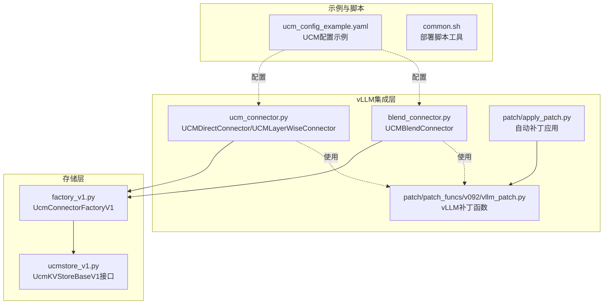
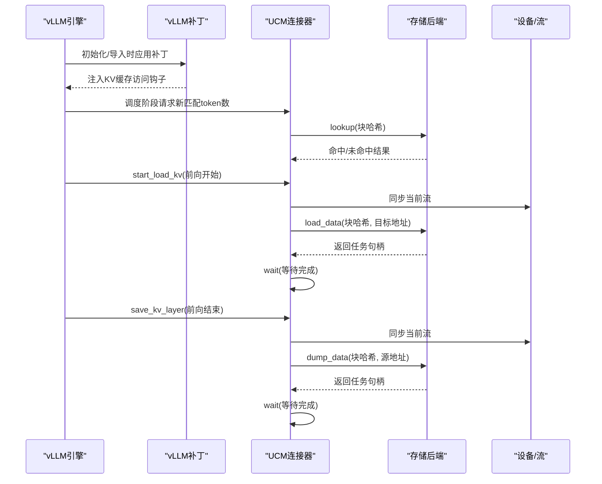
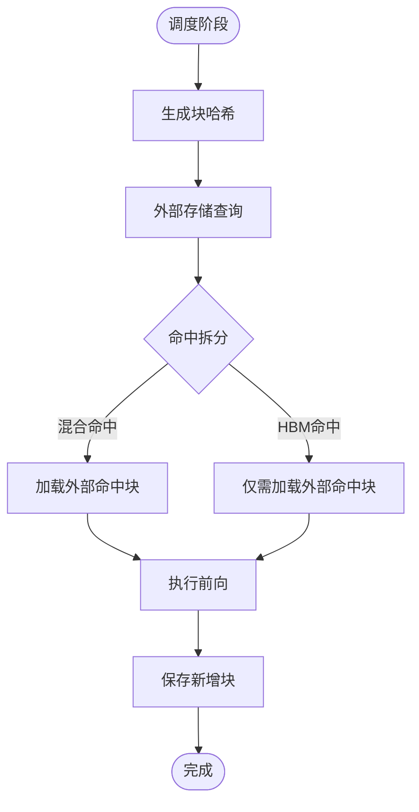
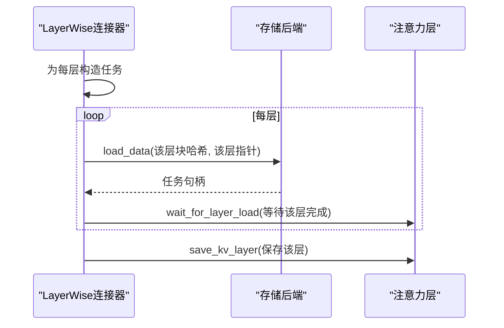
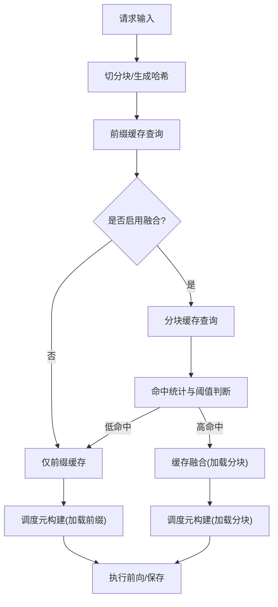
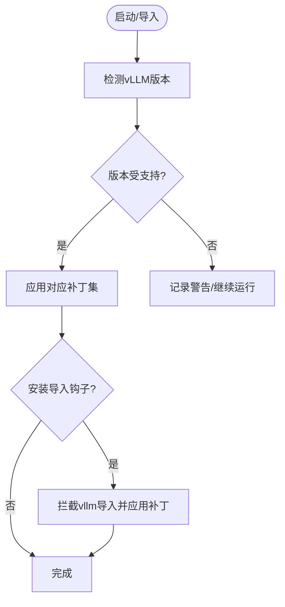
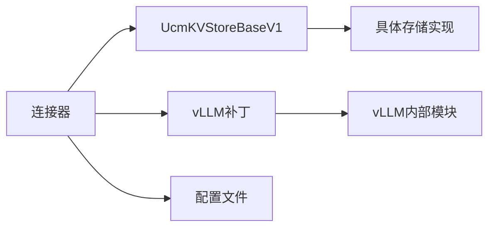

# vLLM集成机制

<cite>
**本文引用的文件**
- [ucm_connector.py](file://ucm/integration/vllm/ucm_connector.py)
- [blend_connector.py](file://ucm/integration/vllm/blend_connector.py)
- [apply_patch.py](file://ucm/integration/vllm/patch/apply_patch.py)
- [vllm_patch.py](file://ucm/integration/vllm/patch/patch_funcs/v092/vllm_patch.py)
- [factory_v1.py](file://ucm/store/factory_v1.py)
- [ucmstore_v1.py](file://ucm/store/ucmstore_v1.py)
- [common.sh](file://examples/deployments/scripts/vllm/common.sh)
- [ucm_config_example.yaml](file://examples/ucm_config_example.yaml)
- [quickstart_vllm.md](file://docs/source/getting-started/quickstart_vllm.md)
- [README.md](file://README.md)
</cite>

## 目录
1. [简介](#简介)
2. [项目结构](#项目结构)
3. [核心组件](#核心组件)
4. [架构总览](#架构总览)
5. [详细组件分析](#详细组件分析)
6. [依赖关系分析](#依赖关系分析)
7. [性能考量](#性能考量)
8. [故障排除指南](#故障排除指南)
9. [结论](#结论)
10. [附录](#附录)

## 简介
本文件系统化阐述Unified Cache Manager（UCM）与vLLM引擎的集成机制，重点覆盖：
- 连接器架构与接口适配策略
- UCMDirectConnector与UCMLayerWiseConnector的差异、工作模式与适用场景
- 补丁机制的实现原理与自动应用流程
- 缓存融合连接器（如UCMBlendConnector）的工作原理与多源缓存统一管理
- 版本兼容性处理与升级路径
- 集成过程中的性能优化（内存与计算加速）
- 具体配置示例与故障排除指南

## 项目结构
围绕vLLM集成的关键目录与文件如下：
- 集成层：ucm/integration/vllm/
  - 连接器：ucm_connector.py、blend_connector.py
  - 补丁：patch/apply_patch.py、patch/patch_funcs/v092/vllm_patch.py
- 存储层：ucm/store/
  - 工厂与接口：factory_v1.py、ucmstore_v1.py
- 示例与脚本：examples/ucm_config_example.yaml、examples/deployments/scripts/vllm/common.sh
- 文档：docs/source/getting-started/quickstart_vllm.md、README.md

图表来源
- [ucm_connector.py](file://ucm/integration/vllm/ucm_connector.py#L82-L1080)
- [blend_connector.py](file://ucm/integration/vllm/blend_connector.py#L121-L499)
- [apply_patch.py](file://ucm/integration/vllm/patch/apply_patch.py#L84-L192)
- [vllm_patch.py](file://ucm/integration/vllm/patch/patch_funcs/v092/vllm_patch.py#L39-L60)
- [factory_v1.py](file://ucm/store/factory_v1.py#L34-L66)
- [ucmstore_v1.py](file://ucm/store/ucmstore_v1.py#L41-L202)
- [ucm_config_example.yaml](file://examples/ucm_config_example.yaml#L1-L39)
- [common.sh](file://examples/deployments/scripts/vllm/common.sh#L1-L79)

章节来源
- [README.md](file://README.md#L14-L54)
- [quickstart_vllm.md](file://docs/source/getting-started/quickstart_vllm.md#L1-L237)

## 核心组件
- 连接器基类与派生类
  - UCMDirectConnector：直接同步加载/前向/保存模式，适合通用KV缓存场景
  - UCMLayerWiseConnector：逐层重叠加载/保存，提升并发与带宽利用率
  - UCMBlendConnector：在前缀缓存基础上引入“块级缓存融合”，支持分块匹配与增量融合
- 存储工厂与接口
  - UcmConnectorFactoryV1：按名称动态注册并创建具体存储后端
  - UcmKVStoreBaseV1：定义统一的KV缓存读写接口（lookup、load、dump、load_data、dump_data、wait等）
- 补丁应用机制
  - 自动检测vLLM版本并应用对应补丁，支持导入时钩子与显式调用两种方式

章节来源
- [ucm_connector.py](file://ucm/integration/vllm/ucm_connector.py#L82-L1080)
- [blend_connector.py](file://ucm/integration/vllm/blend_connector.py#L121-L499)
- [factory_v1.py](file://ucm/store/factory_v1.py#L34-L66)
- [ucmstore_v1.py](file://ucm/store/ucmstore_v1.py#L41-L202)
- [apply_patch.py](file://ucm/integration/vllm/patch/apply_patch.py#L84-L192)

## 架构总览
UCM通过“连接器+存储后端”的解耦设计，将vLLM的KV缓存生命周期与外部存储系统打通。补丁机制在运行期对vLLM内部关键模块进行细粒度增强，使调度与注意力层能够感知并协同UCM的缓存策略。

图表来源
- [apply_patch.py](file://ucm/integration/vllm/patch/apply_patch.py#L139-L192)
- [vllm_patch.py](file://ucm/integration/vllm/patch/patch_funcs/v092/vllm_patch.py#L140-L400)
- [ucm_connector.py](file://ucm/integration/vllm/ucm_connector.py#L488-L644)

## 详细组件分析

### 连接器架构与接口适配
- 接口适配策略
  - 通过vLLM提供的KVConnectorBase_V1扩展点，实现调度阶段的块哈希生成、命中统计与调度元数据构建
  - 在注意力层前后插入等待/保存钩子，确保KV缓存按层或按块精确控制加载与落盘
- 设备与并行适配
  - 支持CUDA/NPU平台，根据本地rank与TP并行组设置目标设备
  - 对MLA/DPA等特殊模型形态进行分支处理，分别管理K/V或K与ROPE分离的存储

章节来源
- [ucm_connector.py](file://ucm/integration/vllm/ucm_connector.py#L82-L162)
- [ucm_connector.py](file://ucm/integration/vllm/ucm_connector.py#L230-L292)

### UCMDirectConnector：同步加载/前向/保存
- 工作模式
  - 整体流程：load -> forward -> save，适用于大多数场景
  - 块哈希生成：基于请求输入与元信息生成稳定哈希，作为外部存储键
  - 调度阶段：统计HBM命中与外部命中，决定需要加载/落盘的块范围
  - 执行阶段：批量构造设备指针矩阵，一次性发起load_data/dump_data异步任务
- 性能特征
  - 流水线简单，易于调试；在高带宽存储上表现稳定
  - 对于长序列，建议结合分块与层间重叠以提升吞吐

图表来源
- [ucm_connector.py](file://ucm/integration/vllm/ucm_connector.py#L293-L348)
- [ucm_connector.py](file://ucm/integration/vllm/ucm_connector.py#L397-L447)
- [ucm_connector.py](file://ucm/integration/vllm/ucm_connector.py#L488-L644)

章节来源
- [ucm_connector.py](file://ucm/integration/vllm/ucm_connector.py#L82-L1080)

### UCMLayerWiseConnector：逐层重叠加载/保存
- 工作模式
  - 层内重叠：load l0 -> forward l0 -> save l0；随后依次处理后续层
  - 逐层任务队列：每层维护独立任务列表，按层索引等待完成
  - 多后端支持：MLA/DPA/常规GQA下分别处理K/V或K+ROPE
- 适用场景
  - 高层并行度要求较高、存储带宽有限的环境
  - 需要最大化设备与存储带宽利用率的长序列推理

图表来源
- [ucm_connector.py](file://ucm/integration/vllm/ucm_connector.py#L661-L800)

章节来源
- [ucm_connector.py](file://ucm/integration/vllm/ucm_connector.py#L661-L800)

### UCMBlendConnector：分块与缓存融合
- 功能特性
  - 将请求切分为“前缀块”和“分块”，优先利用前缀缓存
  - 若分块命中比例低于阈值，则回退到前缀缓存构建；否则进行“缓存融合”，减少首次token延迟
  - 提供Delta RoPE后处理，保证融合后的块在注意力计算中正确对齐
- 关键流程
  - 请求预处理：识别分块边界、生成块哈希
  - 命中评估：先查前缀缓存，再查分块缓存，合并命中信息
  - 调度元构建：根据阶段选择加载/落盘范围
  - 后处理：对命中分块执行块级RoPE变换

图表来源
- [blend_connector.py](file://ucm/integration/vllm/blend_connector.py#L121-L499)

章节来源
- [blend_connector.py](file://ucm/integration/vllm/blend_connector.py#L121-L499)

### 补丁机制：自动应用与版本适配
- 自动检测与应用
  - 检测vLLM版本，匹配支持列表，按版本选择补丁集
  - 支持导入时钩子拦截vLLM导入事件，自动应用补丁
- 补丁内容
  - 扩展SchedulerOutput以承载KV连接器元数据
  - 注入注意力算子包装，实现“等待加载/保存KV层”的钩子
  - 适配MLA/DPA等特殊后端，确保KV缓存写入与稀疏注意力协同
- 平台与功能开关
  - Ascend平台可选特定补丁
  - 可通过环境变量启用ReRoPE或稀疏注意力相关功能

图表来源
- [apply_patch.py](file://ucm/integration/vllm/patch/apply_patch.py#L59-L118)
- [apply_patch.py](file://ucm/integration/vllm/patch/apply_patch.py#L139-L192)
- [vllm_patch.py](file://ucm/integration/vllm/patch/patch_funcs/v092/vllm_patch.py#L39-L60)

章节来源
- [apply_patch.py](file://ucm/integration/vllm/patch/apply_patch.py#L84-L192)
- [vllm_patch.py](file://ucm/integration/vllm/patch/patch_funcs/v092/vllm_patch.py#L63-L138)

### 存储后端与工厂：统一管理多源缓存
- 工厂模式
  - UcmConnectorFactoryV1按名称注册多种存储后端（如NFS、Pipeline等），按需创建实例
- 统一接口
  - UcmKVStoreBaseV1定义lookup、load/dump、load_data/dump_data、wait/check等方法，屏蔽底层差异
- 使用方式
  - 连接器在初始化时根据配置生成存储后端，并在运行期通过任务句柄进行异步I/O

章节来源
- [factory_v1.py](file://ucm/store/factory_v1.py#L34-L66)
- [ucmstore_v1.py](file://ucm/store/ucmstore_v1.py#L41-L202)
- [ucm_connector.py](file://ucm/integration/vllm/ucm_connector.py#L187-L220)

## 依赖关系分析
- 组件耦合
  - 连接器依赖存储工厂与接口，实现与具体存储后端解耦
  - 补丁模块与vLLM内部模块强耦合，但通过细粒度注入降低侵入性
- 外部依赖
  - vLLM版本与平台（CUDA/NPU）影响可用功能与补丁集
  - 配置文件驱动连接器行为（存储后端、指标、稀疏算法等）

图表来源
- [ucm_connector.py](file://ucm/integration/vllm/ucm_connector.py#L125-L130)
- [factory_v1.py](file://ucm/store/factory_v1.py#L34-L66)
- [ucmstore_v1.py](file://ucm/store/ucmstore_v1.py#L41-L202)
- [apply_patch.py](file://ucm/integration/vllm/patch/apply_patch.py#L103-L113)

章节来源
- [ucm_connector.py](file://ucm/integration/vllm/ucm_connector.py#L125-L130)
- [factory_v1.py](file://ucm/store/factory_v1.py#L34-L66)
- [ucmstore_v1.py](file://ucm/store/ucmstore_v1.py#L41-L202)
- [apply_patch.py](file://ucm/integration/vllm/patch/apply_patch.py#L84-L118)

## 性能考量
- 内存管理
  - 通过设备指针矩阵一次性构造批量传输，减少CPU-GPU往返开销
  - 支持共享缓冲区（share_buffer_enable）以降低跨设备复制成本
- 计算加速
  - 层间重叠加载/保存提升带宽利用率
  - 分块融合减少首次token延迟，改善TTFT
- I/O优化
  - 异步任务等待与检查，避免阻塞主计算流
  - 指定块大小与分片大小，平衡吞吐与延迟

章节来源
- [ucm_connector.py](file://ucm/integration/vllm/ucm_connector.py#L266-L292)
- [ucm_connector.py](file://ucm/integration/vllm/ucm_connector.py#L488-L644)
- [blend_connector.py](file://ucm/integration/vllm/blend_connector.py#L325-L333)

## 故障排除指南
- 补丁应用失败
  - 确认vLLM版本与支持列表匹配；必要时手动应用对应patch文件
  - 检查导入钩子是否成功安装，或显式调用ensure_patches_applied
- 连接器初始化异常
  - 检查配置文件中ucm_connectors项是否正确；确认存储后端路径存在且可访问
  - 核对设备ID与并行组设置，避免跨设备访问错误
- 加载/保存失败
  - 查看无效块ID集合，定位具体块与设备块ID映射问题
  - 检查存储后端可用性与权限，确认异步任务已完成
- 稀疏注意力相关问题
  - 确认ENABLE_SPARSE/VLLM_HASH_ATTENTION等环境变量已正确设置
  - 检查模型是否支持相应后端（MLA/DPA等）

章节来源
- [apply_patch.py](file://ucm/integration/vllm/patch/apply_patch.py#L183-L192)
- [ucm_connector.py](file://ucm/integration/vllm/ucm_connector.py#L645-L658)
- [quickstart_vllm.md](file://docs/source/getting-started/quickstart_vllm.md#L81-L117)

## 结论
UCM通过连接器与存储后端的解耦设计、细粒度的vLLM补丁注入以及针对不同场景的连接器变体，实现了对vLLM的深度集成。在保持与vLLM版本与平台兼容的同时，提供了从基础前缀缓存到高级缓存融合与稀疏注意力的完整能力谱系，显著降低推理延迟并提升资源利用率。

## 附录

### 集成配置示例
- 基础配置要点
  - 在KVTransferConfig中指定连接器模块路径与角色
  - 通过kv_connector_extra_config传入UCM配置文件路径
  - 在UCM配置文件中声明ucm_connectors与存储后端参数
- 示例参考
  - [ucm_config_example.yaml](file://examples/ucm_config_example.yaml#L1-L39)
  - [quickstart_vllm.md](file://docs/source/getting-started/quickstart_vllm.md#L133-L237)

章节来源
- [ucm_config_example.yaml](file://examples/ucm_config_example.yaml#L1-L39)
- [quickstart_vllm.md](file://docs/source/getting-started/quickstart_vllm.md#L133-L237)

### 部署脚本辅助
- 网络接口与IP解析工具函数，便于容器化部署与网络配置
- 参考：[common.sh](file://examples/deployments/scripts/vllm/common.sh#L62-L79)

章节来源
- [common.sh](file://examples/deployments/scripts/vllm/common.sh#L1-L79)