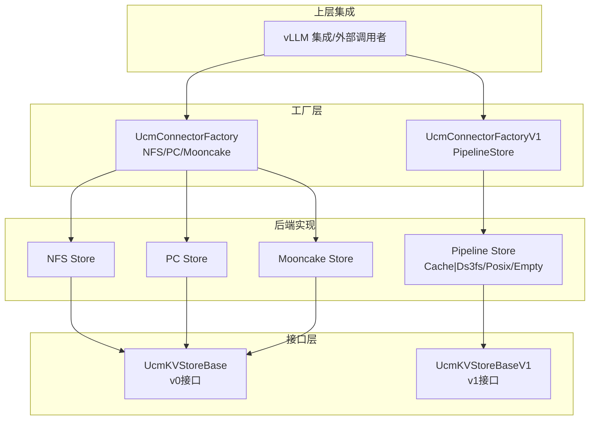
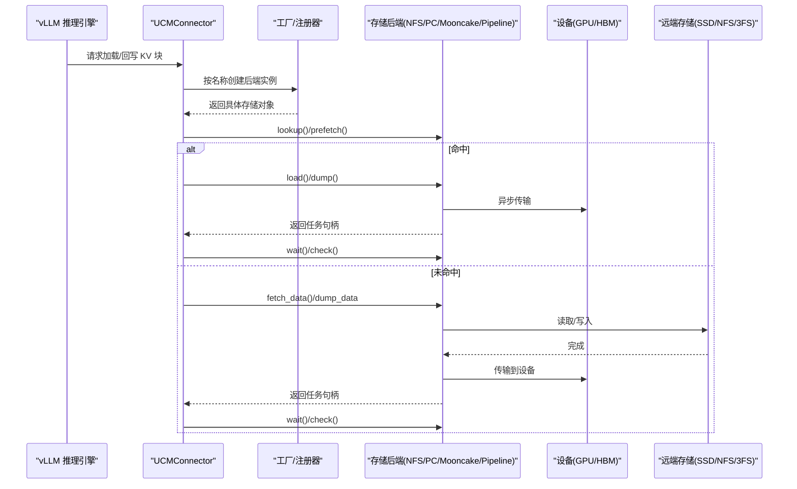
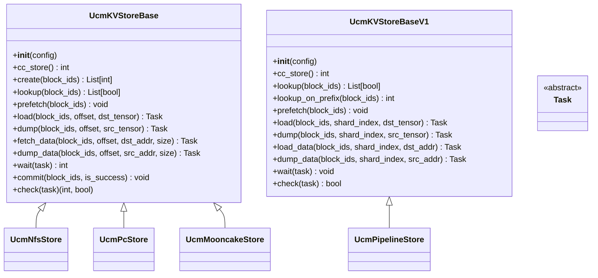
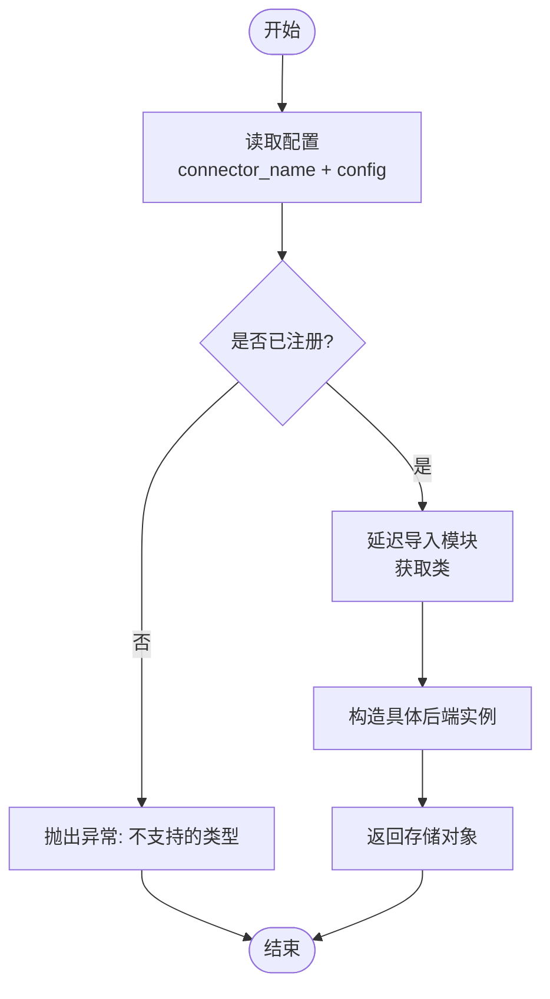
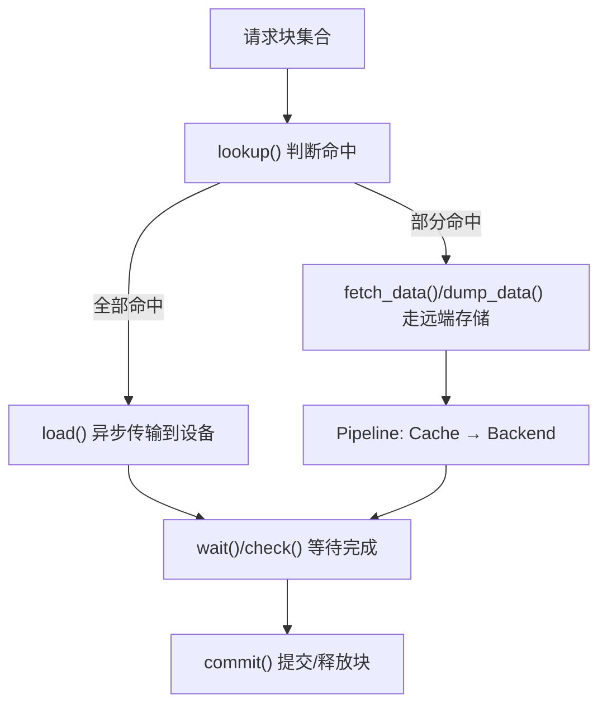
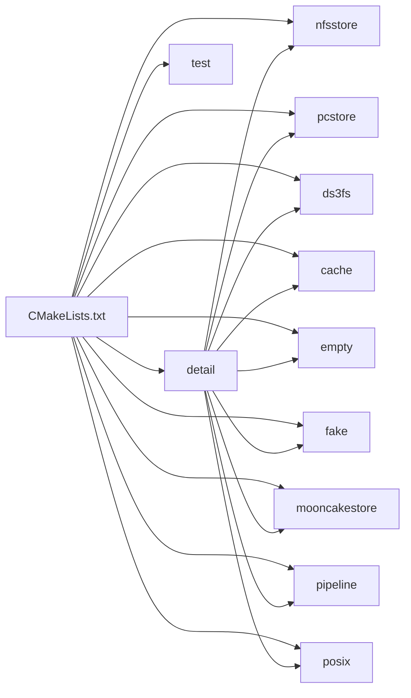

# 存储-计算分离架构

<cite>
**本文档引用的文件**
- [factory.py](file://ucm/store/factory.py)
- [factory_v1.py](file://ucm/store/factory_v1.py)
- [ucmstore.py](file://ucm/store\ucmstore.py)
- [ucmstore_v1.py](file://ucm/store\ucmstore_v1.py)
- [nfsstore_connector.py](file://ucm/store\nfsstore\nfsstore_connector.py)
- [pcstore_connector.py](file://ucm/store\pcstore\pcstore_connector.py)
- [mooncake_connector.py](file://ucm/store\mooncakestore\mooncake_connector.py)
- [connector.py](file://ucm/store\pipeline\connector.py)
- [ucm_config_example.yaml](file://examples\ucm_config_example.yaml)
- [index.md](file://docs\source\user-guide\prefix-cache\index.md)
- [nfs_store.md](file://docs\source\user-guide\prefix-cache\nfs_store.md)
- [ds3fs_store.md](file://docs\source\user-guide\prefix-cache\ds3fs_store.md)
- [CMakeLists.txt](file://ucm\store\CMakeLists.txt)
- [posix_store_test.cc](file://ucm\store\test\case\posix\posix_store_test.cc)
</cite>

## 目录
1. [引言](#引言)
2. [项目结构](#项目结构)
3. [核心组件](#核心组件)
4. [架构总览](#架构总览)
5. [详细组件分析](#详细组件分析)
6. [依赖关系分析](#依赖关系分析)
7. [性能考量](#性能考量)
8. [故障排查指南](#故障排查指南)
9. [结论](#结论)
10. [附录](#附录)

## 引言
本架构文档围绕“存储-计算分离”展开，系统性阐述统一缓存管理（Unified Cache Management, UCM）在大模型推理中的设计与实现。该架构通过抽象统一的存储接口，屏蔽底层存储介质差异，支持异构资源（CPU/GPU/NVMe/SSD/NFS/3FS 等）的统一调度与优化，从而提升大规模推理系统的吞吐与延迟表现。文档重点覆盖：
- 存储抽象层与多后端统一接口
- 工厂模式与动态后端选择
- 数据传输与同步机制（异步加载、预取、缓存一致性）
- 多节点与水平扩展能力
- 配置示例与部署指南

## 项目结构
UCM 的存储子系统采用模块化组织，按功能域划分：抽象接口、具体后端实现、工厂注册与管道链式组合。核心目录如下：
- 接口层：统一存储接口定义（v0/v1）
- 后端实现：NFS、PC（共享内存）、Mooncake 分布式存储、3FS 管道链等
- 工厂层：基于名称注册与延迟加载的后端实例化
- 管道层：将多个存储后端以流水线方式组合，形成多级缓存链路
- 文档与示例：用户指南、配置样例、基准测试说明

图表来源
- [factory.py](file://ucm/store/factory.py#L34-L71)
- [factory_v1.py](file://ucm/store/factory_v1.py#L34-L66)
- [ucmstore.py](file://ucm/store\ucmstore.py#L39-L205)
- [ucmstore_v1.py](file://ucm/store\ucmstore_v1.py#L41-L202)
- [connector.py](file://ucm/store\pipeline\connector.py#L65-L158)

章节来源
- [CMakeLists.txt](file://ucm\store\CMakeLists.txt#L1-L14)

## 核心组件
- 统一存储接口（v0/v1）：定义块级 KV 缓存的创建、查找、预取、加载、回写、等待与提交等操作，确保上层调用与后端实现解耦。
- 工厂注册器：通过名称注册后端类，延迟导入，避免启动时加载所有后端，降低初始化成本。
- 具体后端实现：NFS/PC/Mooncake/3FS 管道等，封装各自的数据布局、传输参数与设备对接细节。
- 管道组合器：将多个存储后端以流水线串联，形成“设备侧缓存 + 远端存储”的分层链路。

章节来源
- [ucmstore.py](file://ucm/store\ucmstore.py#L39-L205)
- [ucmstore_v1.py](file://ucm/store\ucmstore_v1.py#L41-L202)
- [factory.py](file://ucm/store/factory.py#L34-L71)
- [factory_v1.py](file://ucm/store/factory_v1.py#L34-L66)
- [connector.py](file://ucm/store\pipeline\connector.py#L65-L158)

## 架构总览
下图展示了 vLLM 与 UCM 的交互路径，以及存储后端的两种形态：直连后端（NFS/PC/Mooncake）与管道链（Cache + Ds3fs/Posix/Empty）。

图表来源
- [nfsstore_connector.py](file://ucm/store\nfsstore\nfsstore_connector.py#L75-L132)
- [pcstore_connector.py](file://ucm/store\pcstore\pcstore_connector.py#L66-L115)
- [mooncake_connector.py](file://ucm/store\mooncakestore\mooncake_connector.py#L170-L261)
- [connector.py](file://ucm/store\pipeline\connector.py#L99-L157)

## 详细组件分析

### 抽象接口与任务模型
- v0 接口（UcmKVStoreBase）：面向块级 KV 缓存，提供创建、查找、预取、加载/回写（张量指针或原始地址）、等待与提交等方法；任务为不透明句柄，支持轮询与阻塞等待。
- v1 接口（UcmKVStoreBaseV1）：增强对前缀查找、多维张量分片、低层数据指针传输的支持，适配更复杂的流水线与多设备场景。

图表来源
- [ucmstore.py](file://ucm/store\ucmstore.py#L39-L205)
- [ucmstore_v1.py](file://ucm/store\ucmstore_v1.py#L41-L202)
- [nfsstore_connector.py](file://ucm/store\nfsstore\nfsstore_connector.py#L39-L132)
- [pcstore_connector.py](file://ucm/store\pcstore\pcstore_connector.py#L39-L115)
- [mooncake_connector.py](file://ucm/store\mooncakestore\mooncake_connector.py#L59-L368)
- [connector.py](file://ucm/store\pipeline\connector.py#L65-L158)

章节来源
- [ucmstore.py](file://ucm/store\ucmstore.py#L39-L205)
- [ucmstore_v1.py](file://ucm/store\ucmstore_v1.py#L41-L202)

### 工厂模式与后端选择
- 工厂注册：通过名称注册后端模块与类名，使用延迟导入避免不必要的依赖加载。
- 动态创建：根据配置中的连接器名称，返回对应的具体存储实例，统一上层调用入口。
- 版本区分：v0 与 v1 工厂分别管理不同版本接口的后端，便于渐进式演进。

图表来源
- [factory.py](file://ucm/store/factory.py#L34-L71)
- [factory_v1.py](file://ucm/store/factory_v1.py#L34-L66)

章节来源
- [factory.py](file://ucm/store/factory.py#L34-L71)
- [factory_v1.py](file://ucm/store/factory_v1.py#L34-L66)

### 存储后端对比与适用场景
- NFS Store
  - 适用：本地盘/NFS 场景，作为通用外存后端；适合带宽密集型 Prefix Cache。
  - 特点：支持直接 I/O、并发流数、缓冲区数量等参数控制；角色为 worker 时启用传输通道。
- PC Store（共享内存）
  - 适用：同机多进程/多卡共享场景；通过共享缓冲区减少跨进程拷贝。
  - 特点：支持散射/聚集传输、本地 rank 规模等参数；适用于高并发、低延迟的设备侧缓存。
- Mooncake Store（分布式）
  - 适用：跨节点分布式 KV 缓存；通过事件循环与 Future 管理异步任务。
  - 特点：基于键值对存储，提供 get/put；需注意超时与线程安全。
- Pipeline Store（3FS/Posix/Empty/Cache 链）
  - 适用：集中式外存（如 3FS）与设备侧缓存的分层架构；可灵活组合不同后端。
  - 特点：通过构建器注册不同链路，支持 Cache + Ds3fs、Cache + Posix 等组合。

章节来源
- [nfsstore_connector.py](file://ucm/store\nfsstore\nfsstore_connector.py#L40-L132)
- [pcstore_connector.py](file://ucm/store\pcstore\pcstore_connector.py#L40-L115)
- [mooncake_connector.py](file://ucm/store\mooncakestore\mooncake_connector.py#L65-L368)
- [connector.py](file://ucm/store\pipeline\connector.py#L160-L217)

### 数据传输与同步机制
- 异步任务模型：所有加载/回写操作返回任务句柄，支持非阻塞检查与阻塞等待。
- 预取策略：提供预取接口，便于提前将热点块加载至高速缓存。
- 缓存一致性：通过提交接口标记块可用/释放，配合后端回收策略维持容量与命中率平衡。
- 管道链路：在 PipelineStore 中，先由 Cache Store 完成设备到主机的传输，再由 Ds3fs/Posix 等后端完成主机到远端存储的搬运，形成清晰的职责边界与性能分层。

图表来源
- [nfsstore_connector.py](file://ucm/store\nfsstore\nfsstore_connector.py#L75-L132)
- [pcstore_connector.py](file://ucm/store\pcstore\pcstore_connector.py#L66-L115)
- [connector.py](file://ucm/store\pipeline\connector.py#L99-L157)

章节来源
- [nfsstore_connector.py](file://ucm/store\nfsstore\nfsstore_connector.py#L75-L132)
- [pcstore_connector.py](file://ucm/store\pcstore\pcstore_connector.py#L66-L115)
- [connector.py](file://ucm/store\pipeline\connector.py#L99-L157)

### 多节点部署与水平扩展
- 集中式架构：推荐将 KV 缓存集中于外存（如 3FS），计算节点独立扩展，降低调度复杂度与数据孤岛。
- 管道链路：通过 Cache + Backend 的分层，可在多节点部署中将 Backend（如 3FS）横向扩展，提升整体吞吐。
- 参数优化：合理设置并发流数、缓冲区数量、队列深度等参数，结合硬件特性进行调优。

章节来源
- [index.md](file://docs\source\user-guide\prefix-cache\index.md#L22-L85)
- [ds3fs_store.md](file://docs\source\user-guide\prefix-cache\ds3fs_store.md#L69-L126)

## 依赖关系分析
- 模块依赖：CMake 将 store 子目录统一编译，包含 detail、nfsstore、pcstore、ds3fs、cache、empty、fake、mooncakestore、pipeline、posix 等。
- 接口与实现：各后端均继承自统一接口，通过工厂注册实现解耦；v1 接口引入更丰富的分片与流水线能力。
- 测试验证：POSIX 后端测试覆盖 Setup/Lookup/Dump/Load 的完整流程，验证接口一致性与任务等待逻辑。

图表来源
- [CMakeLists.txt](file://ucm\store\CMakeLists.txt#L1-L14)

章节来源
- [CMakeLists.txt](file://ucm\store\CMakeLists.txt#L1-L14)
- [posix_store_test.cc](file://ucm\store\test\case\posix\posix_store_test.cc#L62-L93)

## 性能考量
- 带宽优先：Prefix Cache 以带宽密集为主，适合 SSD/NFS/3FS 等高带宽介质。
- 并发与缓冲：合理设置并发流数与缓冲区数量，避免成为 I/O 瓶颈。
- 队列深度：等待队列与运行队列深度影响吞吐与延迟权衡，需结合硬件与工作负载调优。
- 日志与可观测：通过调试日志观察任务耗时与带宽，辅助定位性能问题。

章节来源
- [nfs_store.md](file://docs\source\user-guide\prefix-cache\nfs_store.md#L5-L119)
- [ds3fs_store.md](file://docs\source\user-guide\prefix-cache\ds3fs_store.md#L13-L126)

## 故障排查指南
- 初始化失败：检查后端 Setup 返回码与配置项（如 storage_backends、kv_block_size、role/device/io_size 等）。
- 任务超时：Mooncake Store 默认超时阈值较高，若出现超时或取消，检查网络与远端服务状态。
- 线程与事件循环：Mooncake Store 使用独立线程与事件循环，关闭时需正确调用 shutdown 以释放资源。
- 队列积压：Pipeline Store 的等待/运行队列过深可能引发延迟，适当增大队列或减少并发。

章节来源
- [nfsstore_connector.py](file://ucm/store\nfsstore\nfsstore_connector.py#L67-L71)
- [mooncake_connector.py](file://ucm/store\mooncakestore\mooncake_connector.py#L328-L356)
- [ds3fs_store.md](file://docs\source\user-guide\prefix-cache\ds3fs_store.md#L114-L126)

## 结论
UCM 的存储-计算分离架构通过统一接口与工厂注册，实现了对多种存储后端的无缝接入；借助 Pipeline Store 的链式组合，进一步构建了“设备缓存 + 远端存储”的分层体系。该架构在多节点与大规模部署中具备良好的扩展性与稳定性，配合合理的参数调优与可观测手段，能够显著提升大模型推理的吞吐与延迟表现。

## 附录

### 配置示例与部署指南
- 示例配置文件位置与字段说明参见：[ucm_config_example.yaml](file://examples\ucm_config_example.yaml#L10-L39)
- NFS 后端最小配置与参数说明参见：[nfs_store.md](file://docs\source\user-guide\prefix-cache\nfs_store.md#L75-L119)
- 3FS 管道链最小配置与参数说明参见：[ds3fs_store.md](file://docs\source\user-guide\prefix-cache\ds3fs_store.md#L69-L126)
- vLLM 启动命令与 KV Transfer 配置示例参见：
  - NFS：[nfs_store.md](file://docs\source\user-guide\prefix-cache\nfs_store.md#L118-L144)
  - 3FS：[ds3fs_store.md](file://docs\source\user-guide\prefix-cache\ds3fs_store.md#L127-L153)

章节来源
- [ucm_config_example.yaml](file://examples\ucm_config_example.yaml#L10-L39)
- [nfs_store.md](file://docs\source\user-guide\prefix-cache\nfs_store.md#L75-L144)
- [ds3fs_store.md](file://docs\source\user-guide\prefix-cache\ds3fs_store.md#L69-L153)