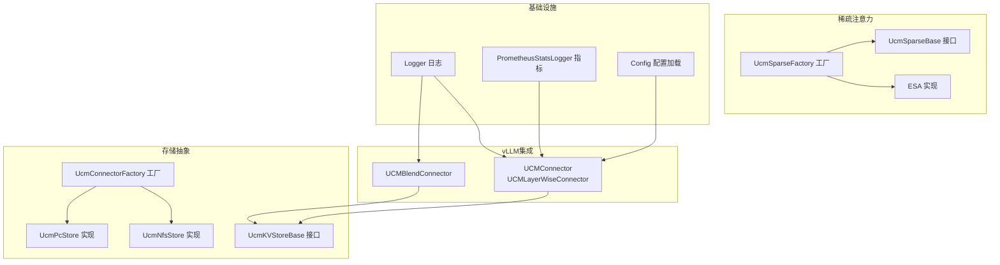
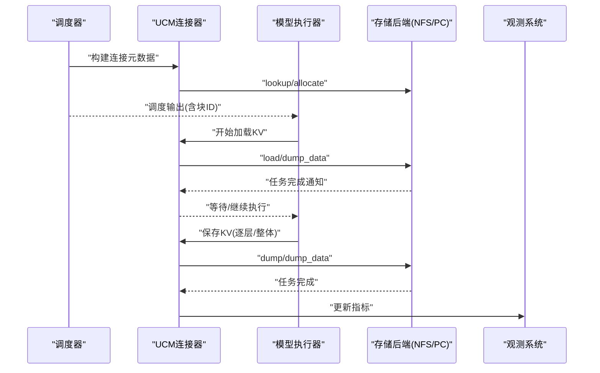
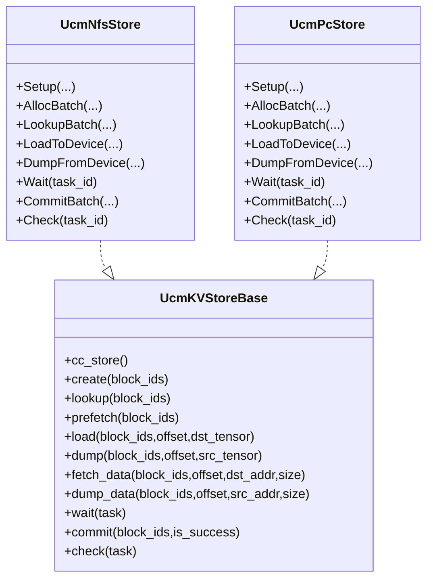
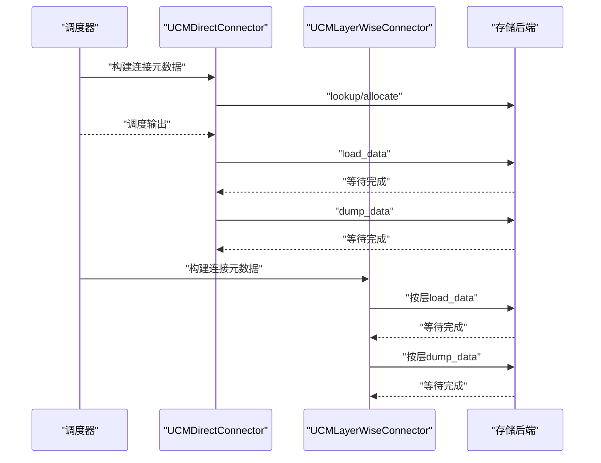
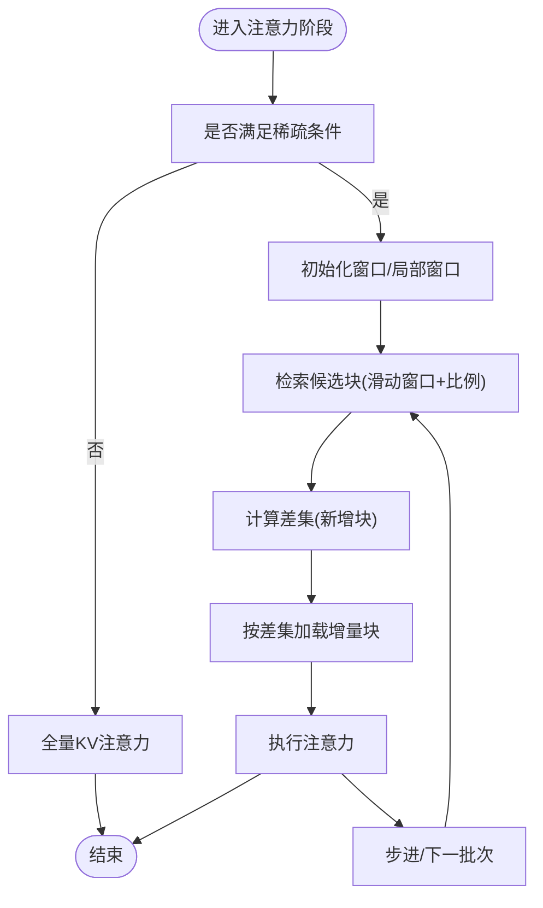
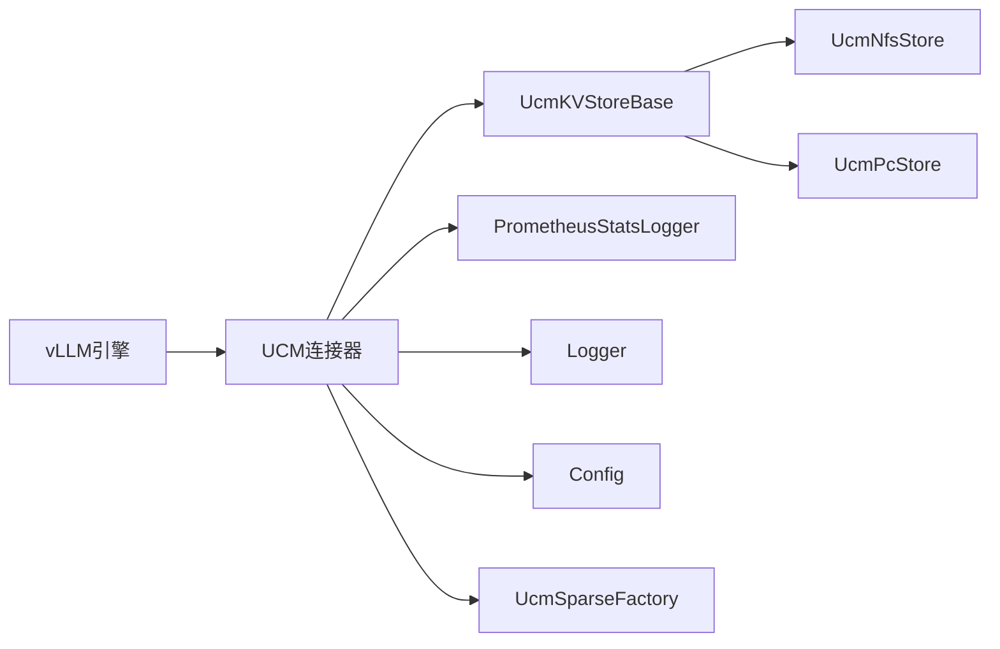

# 核心概念

<cite>
**本文引用的文件**
- [ucm/__init__.py](file://ucm/__init__.py)
- [ucm/utils.py](file://ucm/utils.py)
- [ucm/logger.py](file://ucm/logger.py)
- [ucm/observability.py](file://ucm/observability.py)
- [ucm/store/factory.py](file://ucm/store/factory.py)
- [ucm/store/ucmstore.py](file://ucm/store/ucmstore.py)
- [ucm/integration/vllm/ucm_connector.py](file://ucm/integration/vllm/ucm_connector.py)
- [ucm/integration/vllm/blend_connector.py](file://ucm/integration/vllm/blend_connector.py)
- [ucm/sparse/base.py](file://ucm/sparse/base.py)
- [ucm/sparse/factory.py](file://ucm/sparse/factory.py)
- [ucm/sparse/esa/esa.py](file://ucm/sparse/esa/esa.py)
- [ucm/store/nfsstore/nfsstore_connector.py](file://ucm/store/nfsstore/nfsstore_connector.py)
- [ucm/store/pcstore/pcstore_connector.py](file://ucm/store/pcstore/pcstore_connector.py)
- [examples/offline_inference.py](file://examples/offline_inference.py)
- [docs/source/getting-started/quickstart_vllm.md](file://docs/source/getting-started/quickstart_vllm.md)
</cite>

## 目录
1. [引言](#引言)
2. [项目结构](#项目结构)
3. [核心组件](#核心组件)
4. [架构总览](#架构总览)
5. [详细组件分析](#详细组件分析)
6. [依赖分析](#依赖分析)
7. [性能考量](#性能考量)
8. [故障排查指南](#故障排查指南)
9. [结论](#结论)
10. [附录](#附录)

## 引言
本文件面向初学者与工程实践者，系统化阐述UCM（Unified Cache Management）的核心概念与实现要点，重点覆盖以下主题：
- KV缓存在LLM推理中的工作原理、生命周期管理与内存优化策略
- 稀疏注意力机制的基本思想与性能收益
- 存储-计算分离架构的设计理念与异构资源管理优势
- vLLM集成的工作机制：补丁应用与接口适配
- UCM各核心组件之间的关系与交互模式

目标是帮助读者建立从“概念到实现”的完整认知，并能基于仓库中的真实代码路径进行定位与扩展。

## 项目结构
UCM围绕“存储抽象层 + vLLM集成 + 稀疏注意力 + 观测与日志”四个维度组织代码：
- 存储抽象层：定义统一KV存储接口与多种后端实现（NFS、PC等）
- vLLM集成：KV连接器桥接vLLM调度与执行阶段与UCM存储
- 稀疏注意力：提供ESA、GSAOnDevice、KVStar等稀疏策略的通用接口与实现
- 观测与日志：统一的日志与指标采集框架

图示来源
- [ucm/integration/vllm/ucm_connector.py](file://ucm/integration/vllm/ucm_connector.py#L82-L220)
- [ucm/integration/vllm/blend_connector.py](file://ucm/integration/vllm/blend_connector.py#L121-L147)
- [ucm/sparse/base.py](file://ucm/sparse/base.py#L127-L323)
- [ucm/sparse/factory.py](file://ucm/sparse/factory.py#L13-L57)
- [ucm/sparse/esa/esa.py](file://ucm/sparse/esa/esa.py#L421-L470)
- [ucm/store/ucmstore.py](file://ucm/store/ucmstore.py#L39-L205)
- [ucm/store/nfsstore/nfsstore_connector.py](file://ucm/store/nfsstore/nfsstore_connector.py#L39-L132)
- [ucm/store/pcstore/pcstore_connector.py](file://ucm/store/pcstore/pcstore_connector.py#L39-L115)
- [ucm/store/factory.py](file://ucm/store/factory.py#L34-L71)
- [ucm/logger.py](file://ucm/logger.py#L40-L84)
- [ucm/observability.py](file://ucm/observability.py#L40-L197)
- [ucm/utils.py](file://ucm/utils.py#L34-L91)

章节来源
- [ucm/store/ucmstore.py](file://ucm/store/ucmstore.py#L39-L205)
- [ucm/store/factory.py](file://ucm/store/factory.py#L34-L71)
- [ucm/integration/vllm/ucm_connector.py](file://ucm/integration/vllm/ucm_connector.py#L82-L220)
- [ucm/integration/vllm/blend_connector.py](file://ucm/integration/vllm/blend_connector.py#L121-L147)
- [ucm/sparse/base.py](file://ucm/sparse/base.py#L127-L323)
- [ucm/sparse/factory.py](file://ucm/sparse/factory.py#L13-L57)
- [ucm/sparse/esa/esa.py](file://ucm/sparse/esa/esa.py#L421-L470)
- [ucm/store/nfsstore/nfsstore_connector.py](file://ucm/store/nfsstore/nfsstore_connector.py#L39-L132)
- [ucm/store/pcstore/pcstore_connector.py](file://ucm/store/pcstore/pcstore_connector.py#L39-L115)
- [ucm/logger.py](file://ucm/logger.py#L40-L84)
- [ucm/observability.py](file://ucm/observability.py#L40-L197)
- [ucm/utils.py](file://ucm/utils.py#L34-L91)

## 核心组件
- 统一日志与初始化
  - 初始化流程负责读取环境变量并设置日志目录、文件数量与大小上限；随后初始化UCM日志器，供后续模块使用。
  - 参考路径：[ucm/__init__.py](file://ucm/__init__.py#L29-L48)，[ucm/logger.py](file://ucm/logger.py#L40-L84)

- 配置加载
  - 通过Config类从YAML或终端参数加载UCM配置，支持默认回退与错误处理。
  - 参考路径：[ucm/utils.py](file://ucm/utils.py#L34-L91)

- 观测与指标
  - PrometheusStatsLogger按配置注册Counter/Gauge/Histogram指标，周期性从内部统计池拉取并上报，支持多进程目录与标签绑定。
  - 参考路径：[ucm/observability.py](file://ucm/observability.py#L40-L197)

- 存储抽象与工厂
  - UcmKVStoreBase定义KV缓存的创建、查找、预取、加载、转储、等待、提交、检查等能力；UcmConnectorFactory按名称注册并延迟加载具体存储实现。
  - 参考路径：[ucm/store/ucmstore.py](file://ucm/store/ucmstore.py#L39-L205)，[ucm/store/factory.py](file://ucm/store/factory.py#L34-L71)

- vLLM连接器
  - UCMDirectConnector/UCMLayerWiseConnector在调度与执行阶段协调KV块的加载与保存，支持MLA/Direct模式与Rope分离场景；UCMBlendConnector扩展前缀缓存与分块融合能力。
  - 参考路径：[ucm/integration/vllm/ucm_connector.py](file://ucm/integration/vllm/ucm_connector.py#L82-L220)，[ucm/integration/vllm/blend_connector.py](file://ucm/integration/vllm/blend_connector.py#L121-L147)

- 稀疏注意力
  - UcmSparseBase定义调度侧与工作侧的钩子接口；UcmSparseFactory按配置选择具体稀疏方法（如ESA、GSAOnDevice、KVStarMultiStep、Blend）。
  - 参考路径：[ucm/sparse/base.py](file://ucm/sparse/base.py#L127-L323)，[ucm/sparse/factory.py](file://ucm/sparse/factory.py#L13-L57)，[ucm/sparse/esa/esa.py](file://ucm/sparse/esa/esa.py#L421-L470)

章节来源
- [ucm/__init__.py](file://ucm/__init__.py#L29-L48)
- [ucm/logger.py](file://ucm/logger.py#L40-L84)
- [ucm/utils.py](file://ucm/utils.py#L34-L91)
- [ucm/observability.py](file://ucm/observability.py#L40-L197)
- [ucm/store/ucmstore.py](file://ucm/store/ucmstore.py#L39-L205)
- [ucm/store/factory.py](file://ucm/store/factory.py#L34-L71)
- [ucm/integration/vllm/ucm_connector.py](file://ucm/integration/vllm/ucm_connector.py#L82-L220)
- [ucm/integration/vllm/blend_connector.py](file://ucm/integration/vllm/blend_connector.py#L121-L147)
- [ucm/sparse/base.py](file://ucm/sparse/base.py#L127-L323)
- [ucm/sparse/factory.py](file://ucm/sparse/factory.py#L13-L57)
- [ucm/sparse/esa/esa.py](file://ucm/sparse/esa/esa.py#L421-L470)

## 架构总览
下图展示vLLM与UCM的关键交互：调度阶段生成请求元数据，执行阶段根据元数据在不同层间重叠地加载/保存KV缓存；稀疏注意力在注意力前后插入检索与加载逻辑；存储后端负责实际的数据传输与持久化。

图示来源
- [ucm/integration/vllm/ucm_connector.py](file://ucm/integration/vllm/ucm_connector.py#L397-L447)
- [ucm/integration/vllm/ucm_connector.py](file://ucm/integration/vllm/ucm_connector.py#L488-L564)
- [ucm/integration/vllm/ucm_connector.py](file://ucm/integration/vllm/ucm_connector.py#L566-L644)
- [ucm/store/nfsstore/nfsstore_connector.py](file://ucm/store/nfsstore/nfsstore_connector.py#L84-L122)
- [ucm/store/pcstore/pcstore_connector.py](file://ucm/store/pcstore/pcstore_connector.py#L75-L105)
- [ucm/observability.py](file://ucm/observability.py#L165-L186)

## 详细组件分析

### KV缓存与存储抽象
- 接口职责
  - 创建/查找/预取：用于块空间分配与命中判断
  - 加载/转储：支持按块ID批量加载/保存至设备或从设备读取
  - 等待/检查/提交：统一的任务生命周期管理
- 典型实现
  - NFS存储：支持设备直传参数、流数、缓冲数等；提供LoadToDevice/DumpFromDevice等接口
  - PC存储：支持共享内存/散射聚集等特性；提供LoadToDevice/DumpFromDevice等接口
- 关键路径参考
  - [ucm/store/ucmstore.py](file://ucm/store/ucmstore.py#L39-L205)
  - [ucm/store/nfsstore/nfsstore_connector.py](file://ucm/store/nfsstore/nfsstore_connector.py#L39-L132)
  - [ucm/store/pcstore/pcstore_connector.py](file://ucm/store/pcstore/pcstore_connector.py#L39-L115)

图示来源
- [ucm/store/ucmstore.py](file://ucm/store/ucmstore.py#L39-L205)
- [ucm/store/nfsstore/nfsstore_connector.py](file://ucm/store/nfsstore/nfsstore_connector.py#L39-L132)
- [ucm/store/pcstore/pcstore_connector.py](file://ucm/store/pcstore/pcstore_connector.py#L39-L115)

章节来源
- [ucm/store/ucmstore.py](file://ucm/store/ucmstore.py#L39-L205)
- [ucm/store/nfsstore/nfsstore_connector.py](file://ucm/store/nfsstore/nfsstore_connector.py#L39-L132)
- [ucm/store/pcstore/pcstore_connector.py](file://ucm/store/pcstore/pcstore_connector.py#L39-L115)

### vLLM集成与KV连接器
- 连接器角色
  - 调度侧：生成请求元数据，估算块槽位，构建连接元数据
  - 执行侧：在每层或整体阶段触发加载/保存，等待任务完成，更新指标
- 模式差异
  - 直接模式：严格同步“加载 → 前向 → 保存”
  - 分层模式：按层重叠“加载/保存”，提升吞吐
- 关键路径参考
  - [ucm/integration/vllm/ucm_connector.py](file://ucm/integration/vllm/ucm_connector.py#L82-L220)
  - [ucm/integration/vllm/ucm_connector.py](file://ucm/integration/vllm/ucm_connector.py#L661-L800)
  - [ucm/integration/vllm/blend_connector.py](file://ucm/integration/vllm/blend_connector.py#L121-L147)

图示来源
- [ucm/integration/vllm/ucm_connector.py](file://ucm/integration/vllm/ucm_connector.py#L397-L447)
- [ucm/integration/vllm/ucm_connector.py](file://ucm/integration/vllm/ucm_connector.py#L488-L564)
- [ucm/integration/vllm/ucm_connector.py](file://ucm/integration/vllm/ucm_connector.py#L566-L644)
- [ucm/integration/vllm/ucm_connector.py](file://ucm/integration/vllm/ucm_connector.py#L679-L751)
- [ucm/integration/vllm/ucm_connector.py](file://ucm/integration/vllm/ucm_connector.py#L752-L800)

章节来源
- [ucm/integration/vllm/ucm_connector.py](file://ucm/integration/vllm/ucm_connector.py#L82-L220)
- [ucm/integration/vllm/ucm_connector.py](file://ucm/integration/vllm/ucm_connector.py#L397-L447)
- [ucm/integration/vllm/ucm_connector.py](file://ucm/integration/vllm/ucm_connector.py#L488-L564)
- [ucm/integration/vllm/ucm_connector.py](file://ucm/integration/vllm/ucm_connector.py#L566-L644)
- [ucm/integration/vllm/ucm_connector.py](file://ucm/integration/vllm/ucm_connector.py#L661-L800)
- [ucm/integration/vllm/blend_connector.py](file://ucm/integration/vllm/blend_connector.py#L121-L147)

### 稀疏注意力机制
- 基本思想
  - 在长上下文场景中，仅对关键窗口与局部区域进行全量KV加载，其余采用检索/采样以降低计算与带宽开销
- 通用接口
  - UcmSparseBase定义调度侧与工作侧的钩子：请求开始/结束、估计槽位、分配槽位、构建元数据、注意力前后钩子等
- 典型实现：ESA
  - 通过查询表示聚类与滑动窗口策略，动态选择Top-K块进行加载；支持MLA/Direct模式与跨TP复制
- 关键路径参考
  - [ucm/sparse/base.py](file://ucm/sparse/base.py#L127-L323)
  - [ucm/sparse/factory.py](file://ucm/sparse/factory.py#L13-L57)
  - [ucm/sparse/esa/esa.py](file://ucm/sparse/esa/esa.py#L421-L470)

图示来源
- [ucm/sparse/esa/esa.py](file://ucm/sparse/esa/esa.py#L272-L418)
- [ucm/sparse/esa/esa.py](file://ucm/sparse/esa/esa.py#L421-L470)
- [ucm/sparse/base.py](file://ucm/sparse/base.py#L127-L323)

章节来源
- [ucm/sparse/base.py](file://ucm/sparse/base.py#L127-L323)
- [ucm/sparse/factory.py](file://ucm/sparse/factory.py#L13-L57)
- [ucm/sparse/esa/esa.py](file://ucm/sparse/esa/esa.py#L272-L418)
- [ucm/sparse/esa/esa.py](file://ucm/sparse/esa/esa.py#L421-L470)

### 存储-计算分离与异构资源管理
- 设计理念
  - 将KV缓存的存储与模型执行解耦，允许在不同设备/介质间高效搬运；通过工厂模式与配置驱动实现后端可插拔
- 异构资源利用
  - 支持CUDA/NPU等平台；通过设备ID、张量尺寸、分片大小等参数适配不同硬件
  - 提供Rope分离、MLA/Direct模式、共享缓冲等高级特性
- 关键路径参考
  - [ucm/integration/vllm/ucm_connector.py](file://ucm/integration/vllm/ucm_connector.py#L105-L120)
  - [ucm/store/factory.py](file://ucm/store/factory.py#L34-L71)
  - [ucm/store/nfsstore/nfsstore_connector.py](file://ucm/store/nfsstore/nfsstore_connector.py#L48-L70)
  - [ucm/store/pcstore/pcstore_connector.py](file://ucm/store/pcstore/pcstore_connector.py#L48-L61)

章节来源
- [ucm/integration/vllm/ucm_connector.py](file://ucm/integration/vllm/ucm_connector.py#L105-L120)
- [ucm/store/factory.py](file://ucm/store/factory.py#L34-L71)
- [ucm/store/nfsstore/nfsstore_connector.py](file://ucm/store/nfsstore/nfsstore_connector.py#L48-L70)
- [ucm/store/pcstore/pcstore_connector.py](file://ucm/store/pcstore/pcstore_connector.py#L48-L61)

### vLLM集成工作机制与补丁应用
- 补丁与适配
  - 针对vLLM 0.9.x/0.11.x版本提供适配补丁，启用KV传输钩子、稀疏注意力接口与ReRoPE支持
- 启动与运行
  - 通过KVTransferConfig指定连接器模块与名称，并注入额外配置（如UCM配置文件路径）
- 关键路径参考
  - [docs/source/getting-started/quickstart_vllm.md](file://docs/source/getting-started/quickstart_vllm.md#L81-L116)
  - [examples/offline_inference.py](file://examples/offline_inference.py#L18-L44)
  - [ucm/integration/vllm/ucm_connector.py](file://ucm/integration/vllm/ucm_connector.py#L125-L130)

章节来源
- [docs/source/getting-started/quickstart_vllm.md](file://docs/source/getting-started/quickstart_vllm.md#L81-L116)
- [examples/offline_inference.py](file://examples/offline_inference.py#L18-L44)
- [ucm/integration/vllm/ucm_connector.py](file://ucm/integration/vllm/ucm_connector.py#L125-L130)

## 依赖分析
- 组件内聚与耦合
  - vLLM连接器依赖存储抽象接口与工厂；稀疏工厂依赖配置与vLLM配置对象
  - 观测系统与日志系统被广泛使用，但不直接依赖业务逻辑
- 外部依赖与集成点
  - vLLM版本适配：通过补丁与接口适配实现
  - Prometheus指标：通过配置文件注册与周期性上报
- 关键路径参考
  - [ucm/integration/vllm/ucm_connector.py](file://ucm/integration/vllm/ucm_connector.py#L26-L28)
  - [ucm/sparse/factory.py](file://ucm/sparse/factory.py#L34-L44)
  - [ucm/observability.py](file://ucm/observability.py#L98-L133)

图示来源
- [ucm/integration/vllm/ucm_connector.py](file://ucm/integration/vllm/ucm_connector.py#L26-L28)
- [ucm/store/ucmstore.py](file://ucm/store/ucmstore.py#L39-L205)
- [ucm/store/nfsstore/nfsstore_connector.py](file://ucm/store/nfsstore/nfsstore_connector.py#L39-L132)
- [ucm/store/pcstore/pcstore_connector.py](file://ucm/store/pcstore/pcstore_connector.py#L39-L115)
- [ucm/observability.py](file://ucm/observability.py#L98-L133)
- [ucm/logger.py](file://ucm/logger.py#L40-L84)
- [ucm/utils.py](file://ucm/utils.py#L34-L91)
- [ucm/sparse/factory.py](file://ucm/sparse/factory.py#L34-L44)

章节来源
- [ucm/integration/vllm/ucm_connector.py](file://ucm/integration/vllm/ucm_connector.py#L26-L28)
- [ucm/store/ucmstore.py](file://ucm/store/ucmstore.py#L39-L205)
- [ucm/store/nfsstore/nfsstore_connector.py](file://ucm/store/nfsstore/nfsstore_connector.py#L39-L132)
- [ucm/store/pcstore/pcstore_connector.py](file://ucm/store/pcstore/pcstore_connector.py#L39-L115)
- [ucm/observability.py](file://ucm/observability.py#L98-L133)
- [ucm/logger.py](file://ucm/logger.py#L40-L84)
- [ucm/utils.py](file://ucm/utils.py#L34-L91)
- [ucm/sparse/factory.py](file://ucm/sparse/factory.py#L34-L44)

## 性能考量
- 计算-存储带宽权衡
  - 通过稀疏注意力仅加载关键块，显著降低I/O与显存带宽占用
- 层间重叠
  - 分层模式在不同层之间重叠加载/保存，减少空闲等待
- 参数调优
  - I/O大小、流数量、缓冲数量、分片大小、共享缓冲开关等均影响吞吐与延迟
- 指标监控
  - 通过PrometheusStatsLogger记录加载/保存速率、块数与时延，辅助定位瓶颈

## 故障排查指南
- 常见问题与定位
  - 连接器初始化失败：检查配置文件路径与权限、存储后端参数
  - 加载/保存异常：查看任务等待与检查返回值，确认块ID与设备一致性
  - 稀疏策略未生效：核对请求长度阈值、块大小与滑动窗口参数
- 参考路径
  - [ucm/integration/vllm/ucm_connector.py](file://ucm/integration/vllm/ucm_connector.py#L522-L544)
  - [ucm/integration/vllm/ucm_connector.py](file://ucm/integration/vllm/ucm_connector.py#L617-L627)
  - [ucm/store/nfsstore/nfsstore_connector.py](file://ucm/store/nfsstore/nfsstore_connector.py#L67-L70)
  - [ucm/store/pcstore/pcstore_connector.py](file://ucm/store/pcstore/pcstore_connector.py#L58-L61)

章节来源
- [ucm/integration/vllm/ucm_connector.py](file://ucm/integration/vllm/ucm_connector.py#L522-L544)
- [ucm/integration/vllm/ucm_connector.py](file://ucm/integration/vllm/ucm_connector.py#L617-L627)
- [ucm/store/nfsstore/nfsstore_connector.py](file://ucm/store/nfsstore/nfsstore_connector.py#L67-L70)
- [ucm/store/pcstore/pcstore_connector.py](file://ucm/store/pcstore/pcstore_connector.py#L58-L61)

## 结论
UCM通过“存储抽象 + vLLM集成 + 稀疏注意力 + 观测体系”的协同，实现了KV缓存的高效管理与长上下文推理的性能优化。其核心价值在于：
- 明确的接口契约与工厂化扩展，便于接入新存储后端与稀疏策略
- 与vLLM深度适配，支持多种执行模式与异构设备
- 借助指标与日志体系，为性能优化与问题定位提供坚实基础

## 附录
- 快速启动与补丁应用参考路径
  - [docs/source/getting-started/quickstart_vllm.md](file://docs/source/getting-started/quickstart_vllm.md#L81-L116)
- 示例脚本参考路径
  - [examples/offline_inference.py](file://examples/offline_inference.py#L18-L44)