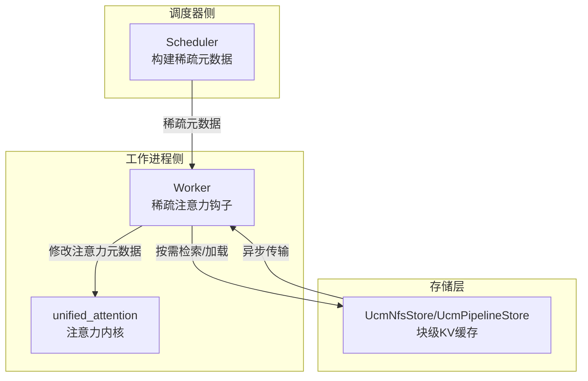
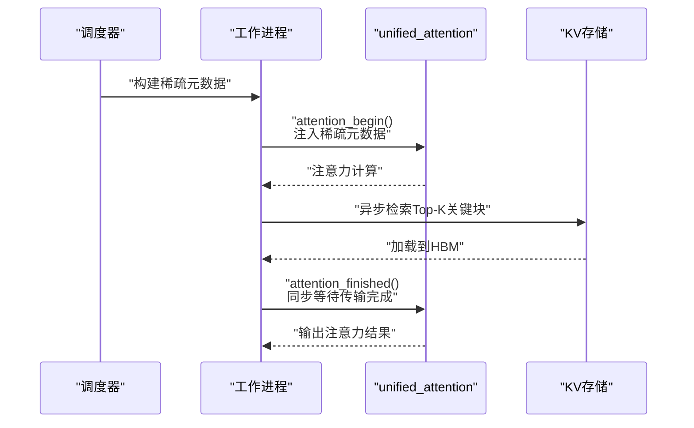
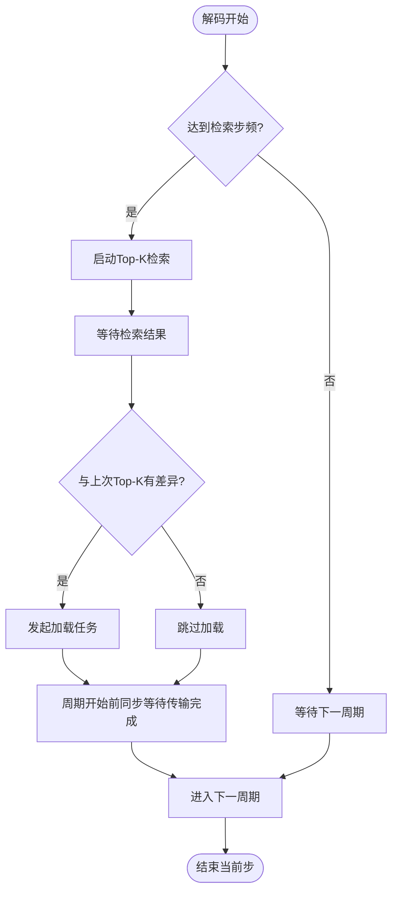
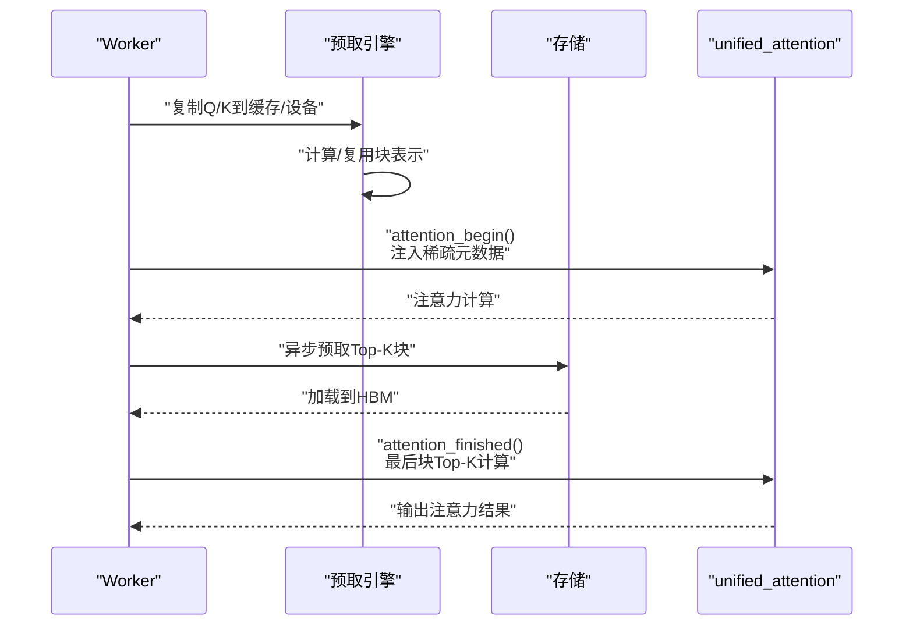
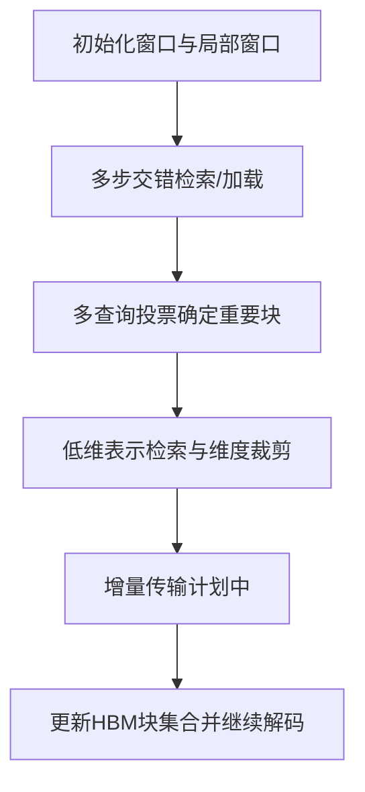
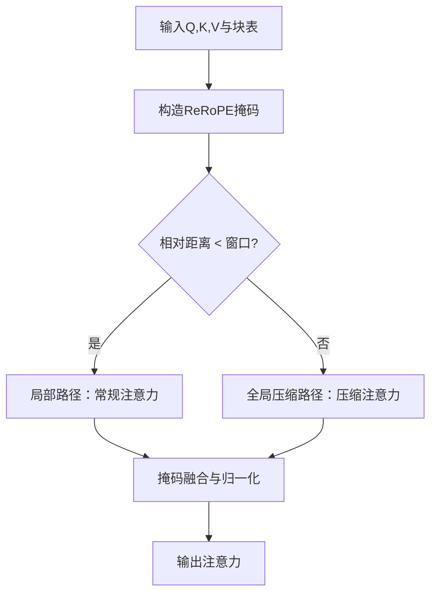
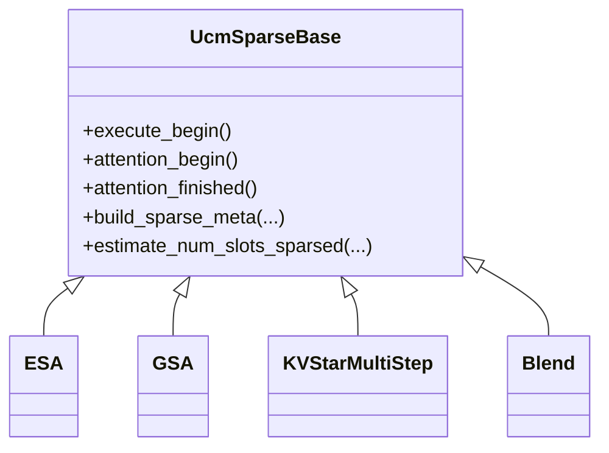

# 稀疏注意力机制

<cite>
**本文引用的文件**
- [docs\source\user-guide\sparse-attention\index.md](file://docs/source/user-guide/sparse-attention/index.md)
- [docs\source\user-guide\sparse-attention\esa.md](file://docs/source/user-guide/sparse-attention/esa.md)
- [docs\source\user-guide\sparse-attention\gsa.md](file://docs\source\user-guide\sparse-attention\gsa.md)
- [docs\source\user-guide\sparse-attention\kvstar.md](file://docs\source\user-guide\sparse-attention\kvstar.md)
- [docs\source\user-guide\rerope\rerope.md](file://docs\source\user-guide\rerope\rerope.md)
- [ucm\sparse\base.py](file://ucm/sparse/base.py)
- [ucm\sparse\factory.py](file://ucm/sparse/factory.py)
- [ucm\sparse\esa\esa.py](file://ucm/sparse/esa/esa.py)
- [ucm\sparse\gsa\gsa.py](file://ucm/sparse/gsa/gsa.py)
- [ucm\sparse\kvstar\utils.py](file://ucm/sparse/kvstar/utils.py)
- [ucm\sparse\rerope\triton_unified_attention_rerope.py](file://ucm/sparse/rerope/triton_unified_attention_rerope.py)
- [examples\offline_inference_esa.py](file://examples/offline_inference_esa.py)
- [examples\offline_inference_kvstar.py](file://examples/offline_inference_kvstar.py)
- [examples\offline_inference_rerope.py](file://examples/offline_inference_rerope.py)
</cite>

## 目录
1. [引言](#引言)
2. [项目结构](#项目结构)
3. [核心组件](#核心组件)
4. [架构总览](#架构总览)
5. [详细组件分析](#详细组件分析)
6. [依赖关系分析](#依赖关系分析)
7. [性能考量](#性能考量)
8. [故障排查指南](#故障排查指南)
9. [结论](#结论)
10. [附录](#附录)

## 引言
本文件系统性阐述稀疏注意力机制在统一缓存管理（UCM）框架下的设计与实现，重点覆盖以下方面：
- 稀疏注意力基本原理与通过“减少注意力计算中的非零元素”降低复杂度的路径；
- 训练免费的稀疏注意力方法：ESA、GSA、KVStar、Rerope 的核心思想与实现差异；
- 稀疏模式选择策略：固定/动态/自适应模式及其适用场景；
- 对模型精度与推理速度的权衡；
- 异步检索与预取机制在稀疏注意力中的作用；
- 数学公式与代码示例路径，帮助开发者按需选择算法以获得最佳效果。

## 项目结构
UCM 提供统一的稀疏注意力框架，围绕 vLLM 的执行流程在调度器侧与工作进程侧分别注入稀疏元数据与运行时加载逻辑，并通过 KV 缓存存储层实现块级异步检索与加载，从而在不牺牲精度的前提下显著降低 HBM 带宽与计算开销。

图示来源
- [ucm\sparse\base.py](file://ucm/sparse/base.py#L127-L323)
- [ucm\sparse\factory.py](file://ucm/sparse/factory.py#L31-L44)

章节来源
- [docs\source\user-guide\sparse-attention\index.md](file://docs/source/user-guide/sparse-attention/index.md#L1-L46)

## 核心组件
- 统一接口基类：UcmSparseBase 定义了调度器侧与工作进程侧的钩子函数，包括请求生命周期、注意力前后钩子、元数据构建与分配等。
- 工厂注册：UcmSparseFactory 负责按配置动态加载具体稀疏算法类（如 ESA、KVStarMultiStep 等）。
- 稀疏算法实现：ESA、GSA、KVStar、Rerope 分别提供不同的稀疏模式与异步/预取策略。

章节来源
- [ucm\sparse\base.py](file://ucm/sparse/base.py#L127-L323)
- [ucm\sparse\factory.py](file://ucm/sparse/factory.py#L13-L57)

## 架构总览
UCM 的稀疏注意力架构以“块级 KV 缓存 + 异步检索/加载 + 注意力前后的稀疏元数据驱动”为核心，典型流程如下：
- 预填充阶段：完整 KV 缓存从 HBM 写入存储；
- 解码阶段：按策略选择关键块，异步检索并加载到 HBM；同时周期性地更新检索窗口；
- 多步多查询投票与低维表示检索进一步降低检索与传输成本；
- ReRoPE 在注意力内核中通过掩码切换局部与全局路径，实现训练免费长上下文扩展。

图示来源
- [ucm\sparse\base.py](file://ucm/sparse/base.py#L197-L230)
- [ucm\sparse\esa\esa.py](file://ucm/sparse/esa/esa.py#L272-L418)
- [ucm\sparse\gsa\gsa.py](file://ucm/sparse/gsa/gsa.py#L627-L700)

## 详细组件分析

### ESA：基于块均值表示的简单稀疏注意力
- 核心思想
  - 使用块级均值作为表示向量，预填充阶段计算并缓存块表示；
  - 解码阶段按固定步频进行 Top-K 检索，仅加载相关块至 HBM；
  - 通过初始化窗口与局部窗口保证最近上下文的完整性。
- 关键实现点
  - 块表示提取与槽位分配：在预填充阶段对块做平均得到表示，并分配临时槽位；
  - 异步检索与加载：周期性启动检索任务，周期末尾等待结果并发起加载任务；
  - 传输同步：下一周期开始前等待所有传输完成，确保注意力使用最新块。
- 参数与配置
  - init_window_sz、local_window_sz 控制窗口大小；
  - sparse_ratio 控制稀疏比例；
  - retrieval_stride 控制检索频率。
- 性能与精度
  - 显著降低 HBM 使用与带宽压力；
  - 通过窗口与投票策略维持精度。

图示来源
- [ucm\sparse\esa\esa.py](file://ucm/sparse/esa/esa.py#L272-L418)

章节来源
- [docs\source\user-guide\sparse-attention\esa.md](file://docs/source/user-guide/sparse-attention/esa.md#L1-L98)
- [ucm\sparse\esa\esa.py](file://ucm/sparse/esa/esa.py#L1-L821)
- [examples\offline_inference_esa.py](file://examples/offline_inference_esa.py#L64-L104)

### GSA：几何稀疏注意力（跨硬件支持）
- 核心创新
  - 表示驱动的零开销 Top-K：预填充阶段计算每块表示，Decode 阶段零开销复用；
  - 跨硬件 Top-K 异步卸载：将 Q 卸载至 CPU 内存进行 Top-K 计算，避免 HBM 瓶颈；
  - 预取引擎：协调块元数据、异步预取线程与自适应预取算法，降低 TTFT 并提升并发；
  - 多阶段稀疏策略：计划支持请求级策略与 P+D 多阶段稀疏（部分特性未开源）。
- 关键实现点
  - 请求状态管理：记录块表、包含/排除掩码、remain/prefetch 索引映射；
  - 表示缓存与复制：在 attention_begin/attention_finished 阶段复制 Q/K 到缓存或设备；
  - 最后一块 Top-K 计算：在最后块生成时计算 remain/prefetch 块集合并初始化 KV。
- 参数与配置
  - 支持通过配置启用/禁用 Top-K 计算与预取；
  - 与 vLLM 的注意力元数据对接，动态更新 block_table 与 seq_lens。
- 性能与精度
  - 在高 HBM 带宽受限场景下，通过 Offload 与预取显著提升吞吐；
  - 保持与全注意力相近的精度水平。

图示来源
- [ucm\sparse\gsa\gsa.py](file://ucm/sparse/gsa/gsa.py#L523-L746)

章节来源
- [docs\source\user-guide\sparse-attention\gsa.md](file://docs/source/user-guide/sparse-attention/gsa.md#L1-L152)
- [ucm\sparse\gsa\gsa.py](file://ucm/sparse/gsa/gsa.py#L1-L1166)

### KVStar：多步稀疏检索与投票
- 核心设计
  - 多步粗粒度稀疏检索：在多个解码步之间交错执行检索/加载，降低 GPU 与存储之间的交互频率；
  - 多查询检索投票：利用当前步的多个历史查询向量进行检索，缓解传统 Top-K 的抖动；
  - 低维表示检索：在块级存储的同时，以 token 粒度进行检索并投票决定重要块，降低检索计算；
  - 增量传输（计划中）：利用连续两次传输间的冗余，避免重复传输块。
- 关键实现点
  - 块哈希与绑定 CPU：为每个块生成哈希并绑定 CPU 核心，提高检索效率；
  - 多步策略参数：init_window_sz、local_window_sz、sparse_ratio、retrieval_stride、维度裁剪比例与内核合并粒度。
- 性能与精度
  - 显著节省 HBM，提升并发下的吞吐；
  - 通过投票与低维表示在长序列上保持较高精度。

图示来源
- [ucm\sparse\kvstar\utils.py](file://ucm/sparse/kvstar/utils.py#L167-L243)
- [docs\source\user-guide\sparse-attention\kvstar.md](file://docs/source/user-guide/sparse-attention/kvstar.md#L1-L85)

章节来源
- [docs\source\user-guide\sparse-attention\kvstar.md](file://docs/source/user-guide/sparse-attention/kvstar.md#L1-L85)
- [ucm\sparse\kvstar\utils.py](file://ucm/sparse/kvstar/utils.py#L1-L244)
- [examples\offline_inference_kvstar.py](file://examples/offline_inference_kvstar.py#L64-L103)

### ReRoPE：训练免费的旋转位置嵌入扩展
- 核心思想
  - 通过局部窗口内直接插值与窗口外压缩的方式扩展上下文长度，无需微调；
  - 注意力分为两路：局部窗口内使用常规路径，窗口外使用压缩路径，形成双注意力；
  - Triton 内核中通过掩码选择路径，结合 sliding window 与可选 softcap。
- 数学公式
  - 局部路径与全局压缩路径的分数计算分别由两套公式给出，最终通过掩码选择路径并归一化；
  - 可选的 softcap 用于稳定梯度与数值稳定性。
- 实现要点
  - 内核参数包含窗口大小、是否使用 Alibi/Slopes、是否使用 softcap、滑动窗口等；
  - 支持分段注意力与段间归并，提升小批量下的吞吐。

图示来源
- [docs\source\user-guide\rerope\rerope.md](file://docs/source/user-guide/rerope/rerope.md#L25-L34)
- [ucm\sparse\rerope\triton_unified_attention_rerope.py](file://ucm/sparse/rerope/triton_unified_attention_rerope.py#L242-L270)

章节来源
- [docs\source\user-guide\rerope\rerope.md](file://docs/source/user-guide/rerope/rerope.md#L1-L109)
- [ucm\sparse\rerope\triton_unified_attention_rerope.py](file://ucm/sparse/rerope/triton_unified_attention_rerope.py#L1-L885)
- [examples\offline_inference_rerope.py](file://examples/offline_inference_rerope.py#L46-L75)

## 依赖关系分析
- 工厂注册与动态加载
  - 通过工厂按配置名称动态导入具体稀疏算法类，支持 ESA、KVStarMultiStep 等；
  - 未注册的方法将抛出异常，确保配置一致性。
- 接口契约
  - 所有稀疏算法均继承自 UcmSparseBase，遵循统一的生命周期钩子与元数据协议；
  - 注意力前后钩子允许算法在不侵入主干的情况下修改注意力元数据与块表。

图示来源
- [ucm\sparse\base.py](file://ucm/sparse/base.py#L127-L323)
- [ucm\sparse\factory.py](file://ucm/sparse/factory.py#L31-L57)

章节来源
- [ucm\sparse\factory.py](file://ucm/sparse/factory.py#L13-L57)
- [ucm\sparse\base.py](file://ucm/sparse/base.py#L127-L323)

## 性能考量
- 计算复杂度
  - 稀疏注意力通过仅计算与访问关键块，将注意力计算从 O(L^2) 降为 O(L·k)，其中 k 为保留块数；
  - ESA/GSA/KVStar 通过 Top-K 与多步策略控制 k，ReRoPE 通过局部-全局双路径平衡效率与精度。
- 存储与带宽
  - 将完整 KV 缓存离线存储，仅在需要时加载关键块，显著降低 HBM 带宽占用；
  - 异步检索与预取减少等待时间，提升并发吞吐。
- 精度权衡
  - 固定窗口与局部窗口保证近期上下文；
  - 投票与低维表示减少检索误差；
  - ReRoPE 在不微调情况下扩展长上下文，但需注意双注意力带来的额外计算。

## 故障排查指南
- 配置项缺失或错误
  - 确认 ucm_sparse_config 中包含正确的稀疏方法名与参数；
  - 检查 retrieval_stride、sparse_ratio、init_window_sz、local_window_sz 等关键参数是否合理。
- 异常与阻塞
  - 若出现传输阻塞，检查存储连接与队列深度配置；
  - 确保 attention_begin/attention_finished 钩子正确同步传输任务。
- ReRoPE 环境变量
  - 确认 VLLM_ATTENTION_BACKEND、REROPE_WINDOW、TRAINING_LENGTH 等环境变量设置正确；
  - 模型最大位置编码需与输入长度匹配。

章节来源
- [examples\offline_inference_esa.py](file://examples/offline_inference_esa.py#L24-L61)
- [examples\offline_inference_kvstar.py](file://examples/offline_inference_kvstar.py#L24-L63)
- [examples\offline_inference_rerope.py](file://examples/offline_inference_rerope.py#L23-L43)

## 结论
UCM 的稀疏注意力框架通过统一接口与异步检索/预取机制，在不牺牲精度的前提下显著降低长序列推理的计算与带宽开销。不同算法各有侧重：
- ESA：简单易用，适合快速原型与中小规模部署；
- GSA：跨硬件、可扩展，适合高并发与 HBM 紧张场景；
- KVStar：多步检索与投票策略，适合长序列与高吞吐；
- ReRoPE：训练免费长上下文扩展，适合对上下文长度敏感的任务。

开发者可根据任务特征与资源约束选择合适算法，并通过参数调优获得最佳性价比。

## 附录
- 示例脚本路径
  - ESA 示例：examples/offline_inference_esa.py
  - KVStar 示例：examples/offline_inference_kvstar.py
  - ReRoPE 示例：examples/offline_inference_rerope.py
- 关键实现文件路径
  - ESA：ucm/sparse/esa/esa.py
  - GSA：ucm/sparse/gsa/gsa.py
  - KVStar 工具：ucm/sparse/kvstar/utils.py
  - ReRoPE Triton 内核：ucm/sparse/rerope/triton_unified_attention_rerope.py
  - 统一接口与工厂：ucm/sparse/base.py、ucm/sparse/factory.py