# 单元测试

<cite>
**本文引用的文件**
- [ucm/shared/test/CMakeLists.txt](file://ucm/shared/test/CMakeLists.txt)
- [ucm/store/test/CMakeLists.txt](file://ucm/store/test/CMakeLists.txt)
- [test/pytest.ini](file://test/pytest.ini)
- [test/conftest.py](file://test/conftest.py)
- [test/requirements.txt](file://test/requirements.txt)
- [ucm/shared/test/case/infra/logger/logger_test.cc](file://ucm/shared/test/case/infra/logger/logger_test.cc)
- [ucm/shared/test/case/infra/hashset_test.cc](file://ucm/shared/test/case/infra/hashset_test.cc)
- [ucm/shared/test/case/infra/spsc_ring_queue_test.cc](file://ucm/shared/test/case/infra/spsc_ring_queue_test.cc)
- [ucm/shared/test/case/infra/thread_pool_test.cc](file://ucm/shared/test/case/infra/thread_pool_test.cc)
- [ucm/shared/test/case/metrics/metrics_test.cc](file://ucm/shared/test/case/metrics/metrics_test.cc)
- [ucm/store/test/case/cache/cache_buffer_manager_test.cc](file://ucm/store/test/case/cache/cache_buffer_manager_test.cc)
- [ucm/store/test/case/posix/posix_file_test.cc](file://ucm/store/test/case/posix/posix_file_test.cc)
- [ucm/store/test/case/pcstore/pcstore_share_buffer_test.cc](file://ucm/store/test/case/pcstore/pcstore_share_buffer_test.cc)
- [ucm/store/test/case/detail/mock_store.h](file://ucm/store/test/case/detail/mock_store.h)
- [ucm/store/test/case/detail/data_generator.h](file://ucm/store/test/case/detail/data_generator.h)
- [ucm/shared/test/example/trans/trans_on_cuda_example.py](file://ucm/shared/test/example/trans/trans_on_cuda_example.py)
</cite>

## 目录
1. [简介](#简介)
2. [项目结构](#项目结构)
3. [核心组件](#核心组件)
4. [架构总览](#架构总览)
5. [详细组件分析](#详细组件分析)
6. [依赖关系分析](#依赖关系分析)
7. [性能考量](#性能考量)
8. [故障排查指南](#故障排查指南)
9. [结论](#结论)
10. [附录](#附录)

## 简介
本指南面向UCM（统一缓存管理）项目的单元测试实践，覆盖C++基础设施（日志、哈希集合、环形队列、线程池、指标系统）与存储后端（缓存存储、POSIX存储、PC存储）的测试方法论与最佳实践。文档提供测试夹具与模拟对象的使用方式、边界条件与异常处理测试示例、测试覆盖率要求与分析方法，以及测试环境配置与运行命令。

## 项目结构
UCM的测试体系分为两部分：
- C++单元测试：位于 ucm/shared/test 与 ucm/store/test，采用GoogleTest/GMock构建，通过CMake发现并执行。
- Python测试：位于 test/suites 与 test 目录，采用pytest，支持标记过滤、报告生成与GPU资源自动分配。

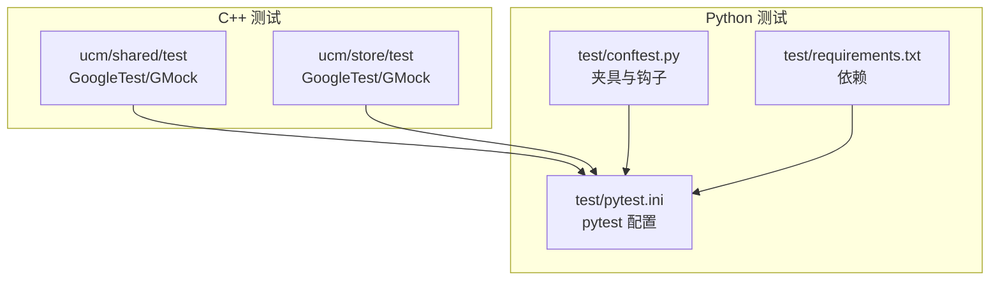

**图表来源**
- [ucm/shared/test/CMakeLists.txt](file://ucm/shared/test/CMakeLists.txt#L1-L12)
- [ucm/store/test/CMakeLists.txt](file://ucm/store/test/CMakeLists.txt#L1-L12)
- [test/pytest.ini](file://test/pytest.ini#L1-L25)
- [test/conftest.py](file://test/conftest.py#L1-L214)
- [test/requirements.txt](file://test/requirements.txt#L1-L18)

**章节来源**
- [ucm/shared/test/CMakeLists.txt](file://ucm/shared/test/CMakeLists.txt#L1-L12)
- [ucm/store/test/CMakeLists.txt](file://ucm/store/test/CMakeLists.txt#L1-L12)
- [test/pytest.ini](file://test/pytest.ini#L1-L25)
- [test/conftest.py](file://test/conftest.py#L1-L214)
- [test/requirements.txt](file://test/requirements.txt#L1-L18)

## 核心组件
本节概述各测试域的关键组件与职责：
- 日志系统：验证单例行为、日志级别过滤、滚动与压缩策略。
- 哈希集合：基本操作、大量键值、并发插入、字符串键。
- 环形队列：FIFO语义、满队列行为、移动语义。
- 线程池：超时检测、挂起任务识别与恢复。
- 指标系统：计数器、仪表盘、直方图更新与聚合。
- 存储后端：
  - 缓存存储：BufferManager查找逻辑与MockStore交互。
  - POSIX存储：目录/文件创建、访问权限、读写一致性。
  - PC存储：共享缓冲区容量耗尽与复用、读任务列表拼接。

**章节来源**
- [ucm/shared/test/case/infra/logger/logger_test.cc](file://ucm/shared/test/case/infra/logger/logger_test.cc#L1-L145)
- [ucm/shared/test/case/infra/hashset_test.cc](file://ucm/shared/test/case/infra/hashset_test.cc#L1-L77)
- [ucm/shared/test/case/infra/spsc_ring_queue_test.cc](file://ucm/shared/test/case/infra/spsc_ring_queue_test.cc#L1-L88)
- [ucm/shared/test/case/infra/thread_pool_test.cc](file://ucm/shared/test/case/infra/thread_pool_test.cc#L1-L101)
- [ucm/shared/test/case/metrics/metrics_test.cc](file://ucm/shared/test/case/metrics/metrics_test.cc#L1-L107)
- [ucm/store/test/case/cache/cache_buffer_manager_test.cc](file://ucm/store/test/case/cache/cache_buffer_manager_test.cc#L1-L85)
- [ucm/store/test/case/posix/posix_file_test.cc](file://ucm/store/test/case/posix/posix_file_test.cc#L1-L84)
- [ucm/store/test/case/pcstore/pcstore_share_buffer_test.cc](file://ucm/store/test/case/pcstore/pcstore_share_buffer_test.cc#L1-L114)

## 架构总览
下图展示测试执行路径与关键依赖：

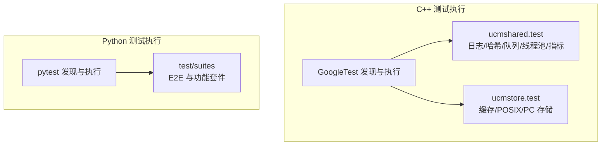

**图表来源**
- [ucm/shared/test/CMakeLists.txt](file://ucm/shared/test/CMakeLists.txt#L1-L12)
- [ucm/store/test/CMakeLists.txt](file://ucm/store/test/CMakeLists.txt#L1-L12)
- [test/pytest.ini](file://test/pytest.ini#L1-L25)

## 详细组件分析

### 日志系统测试
- 关键点
  - 单例行为验证：多次获取实例应指向同一对象。
  - 日志级别：DEBUG/INFO/WARN/ERROR按配置落盘，调试级别可能不输出。
  - 滚动与压缩：超过最大文件大小触发轮转与压缩，保留固定数量归档。
- 测试要点
  - 使用临时目录隔离输出，测试结束后清理。
  - 通过文件存在性与内容包含判断日志落盘与级别过滤。
  - 验证压缩文件数量符合配置。

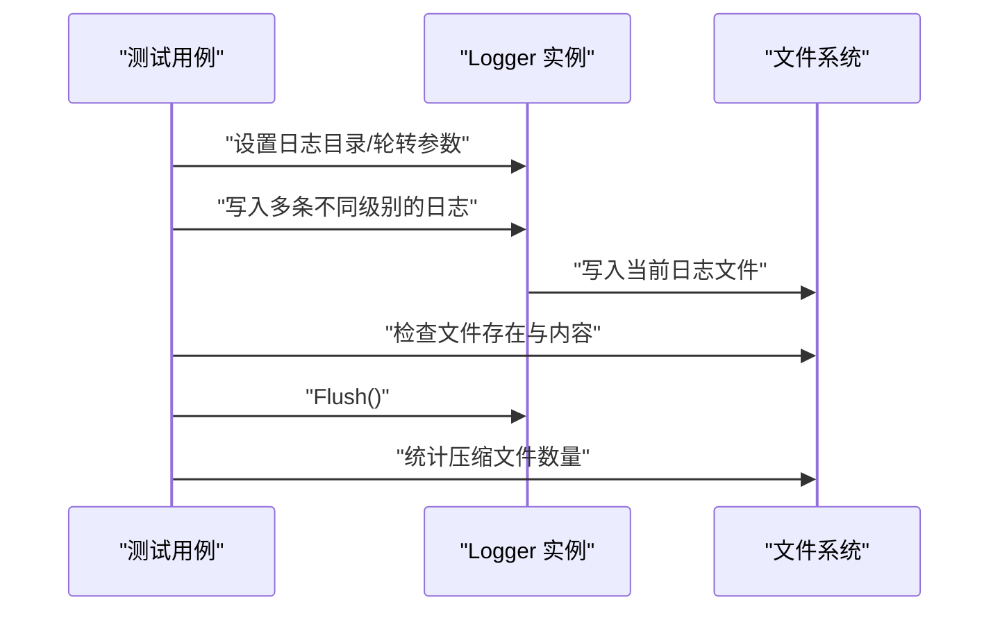

**图表来源**
- [ucm/shared/test/case/infra/logger/logger_test.cc](file://ucm/shared/test/case/infra/logger/logger_test.cc#L72-L145)

**章节来源**
- [ucm/shared/test/case/infra/logger/logger_test.cc](file://ucm/shared/test/case/infra/logger/logger_test.cc#L1-L145)

### 哈希集合测试
- 关键点
  - 插入/查询/删除的正确性与幂等性。
  - 大规模数据（如十万级）的正确性与性能回归。
  - 并发插入的线程安全与一致性。
  - 字符串键的哈希与比较。
- 测试要点
  - 插入重复元素不产生重复计数。
  - 删除后不再命中。
  - 并发场景下所有元素最终一致。

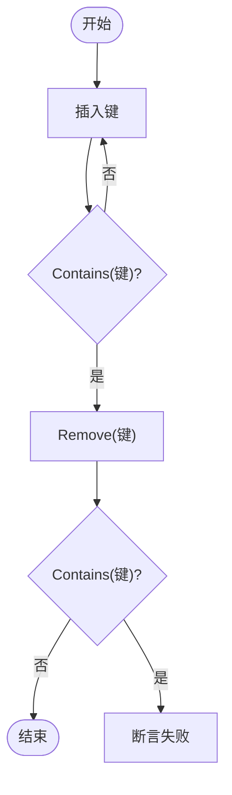

**图表来源**
- [ucm/shared/test/case/infra/hashset_test.cc](file://ucm/shared/test/case/infra/hashset_test.cc#L30-L77)

**章节来源**
- [ucm/shared/test/case/infra/hashset_test.cc](file://ucm/shared/test/case/infra/hashset_test.cc#L1-L77)

### 环形队列测试
- 关键点
  - 基础推入/弹出与空队列行为。
  - FIFO顺序保证。
  - 满队列推入失败，弹出后可再次推入。
  - 移动语义支持仅能移动类型。
- 测试要点
  - 设置容量后进行边界测试（满/空/越界）。
  - 对移动类型构造/析构语义进行验证。

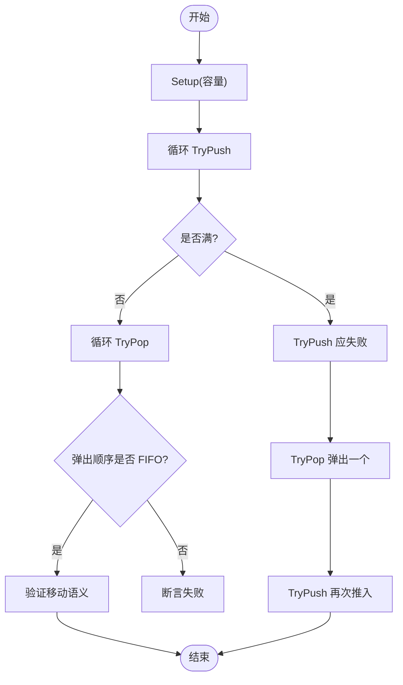

**图表来源**
- [ucm/shared/test/case/infra/spsc_ring_queue_test.cc](file://ucm/shared/test/case/infra/spsc_ring_queue_test.cc#L29-L88)

**章节来源**
- [ucm/shared/test/case/infra/spsc_ring_queue_test.cc](file://ucm/shared/test/case/infra/spsc_ring_queue_test.cc#L1-L88)

### 线程池测试
- 关键点
  - 超时检测：工作线程执行时间超过阈值触发超时回调。
  - 挂起检测：阻塞等待条件下，超时回调会终止挂起并恢复。
- 测试要点
  - 设置工作线程数与超时参数。
  - 提交任务后等待超时计数与标志位变化。
  - 验证挂起场景下的恢复逻辑。

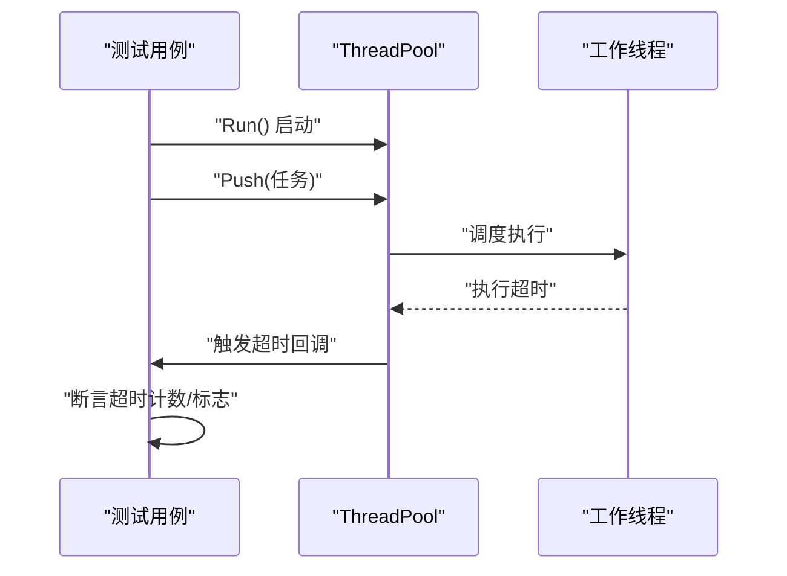

**图表来源**
- [ucm/shared/test/case/infra/thread_pool_test.cc](file://ucm/shared/test/case/infra/thread_pool_test.cc#L34-L101)

**章节来源**
- [ucm/shared/test/case/infra/thread_pool_test.cc](file://ucm/shared/test/case/infra/thread_pool_test.cc#L1-L101)

### 指标系统测试
- 关键点
  - 创建多种类型的指标（计数器、仪表盘、直方图）。
  - 更新指标后聚合获取并清零。
  - 批量更新与单个更新的等价性。
- 测试要点
  - 通过API创建指标并更新数值。
  - 获取聚合结果并断言对应类型与值。

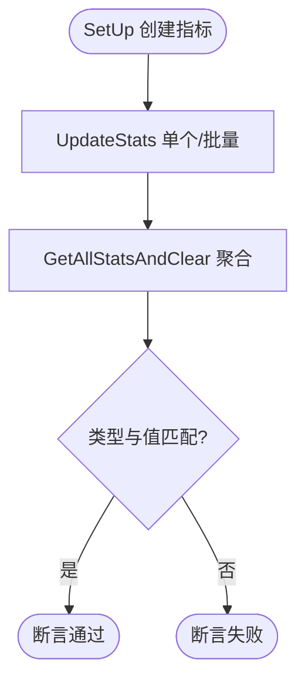

**图表来源**
- [ucm/shared/test/case/metrics/metrics_test.cc](file://ucm/shared/test/case/metrics/metrics_test.cc#L48-L107)

**章节来源**
- [ucm/shared/test/case/metrics/metrics_test.cc](file://ucm/shared/test/case/metrics/metrics_test.cc#L1-L107)

### 缓存存储测试（BufferManager）
- 关键点
  - 使用MockStore模拟后端Lookup/LookupOnPrefix行为。
  - 验证前缀命中索引与全量命中向量。
  - 配置BufferManager参数（块大小、分片大小、缓冲数量等）。
- 测试要点
  - 通过EXPECT_CALL控制Mock返回，断言BufferManager行为。
  - 随机BlockId生成与类型辅助工具配合验证。

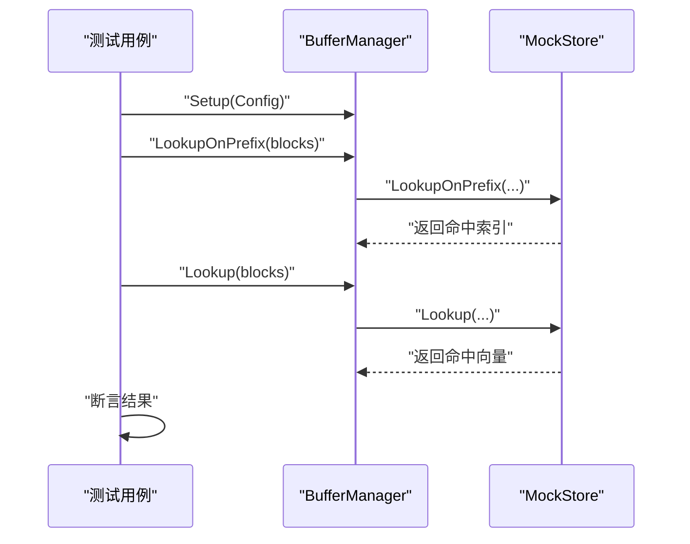

**图表来源**
- [ucm/store/test/case/cache/cache_buffer_manager_test.cc](file://ucm/store/test/case/cache/cache_buffer_manager_test.cc#L44-L84)
- [ucm/store/test/case/detail/mock_store.h](file://ucm/store/test/case/detail/mock_store.h#L32-L47)

**章节来源**
- [ucm/store/test/case/cache/cache_buffer_manager_test.cc](file://ucm/store/test/case/cache/cache_buffer_manager_test.cc#L1-L85)
- [ucm/store/test/case/detail/mock_store.h](file://ucm/store/test/case/detail/mock_store.h#L1-L52)

### POSIX 存储测试
- 关键点
  - 目录创建/删除与权限检查。
  - 文件创建/打开/读写/删除与一致性校验。
  - OpenFlags组合与互斥行为（如EXCL冲突）。
- 测试要点
  - 使用DataGenerator生成随机或固定数据进行读写对比。
  - 通过Access/Status判断存在性与权限。

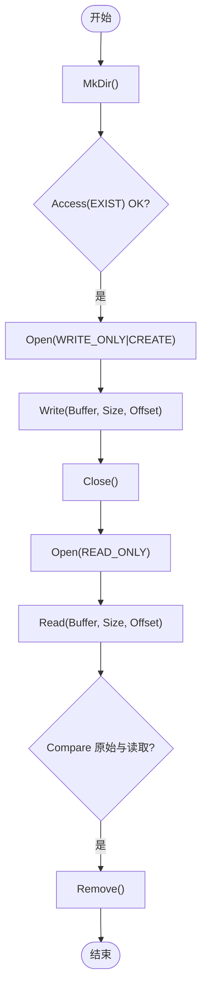

**图表来源**
- [ucm/store/test/case/posix/posix_file_test.cc](file://ucm/store/test/case/posix/posix_file_test.cc#L30-L84)
- [ucm/store/test/case/detail/data_generator.h](file://ucm/store/test/case/detail/data_generator.h#L34-L82)

**章节来源**
- [ucm/store/test/case/posix/posix_file_test.cc](file://ucm/store/test/case/posix/posix_file_test.cc#L1-L84)
- [ucm/store/test/case/detail/data_generator.h](file://ucm/store/test/case/detail/data_generator.h#L1-L82)

### PC 存储测试（共享缓冲区）
- 关键点
  - 共享缓冲区容量耗尽时的读者行为（共享/本地）。
  - 读者复用与生命周期管理。
  - 将读者拼接到读任务列表并保持数据可用。
- 测试要点
  - 以随机BlockId创建Reader并断言共享状态。
  - 容量边界下的复用与拼接行为。

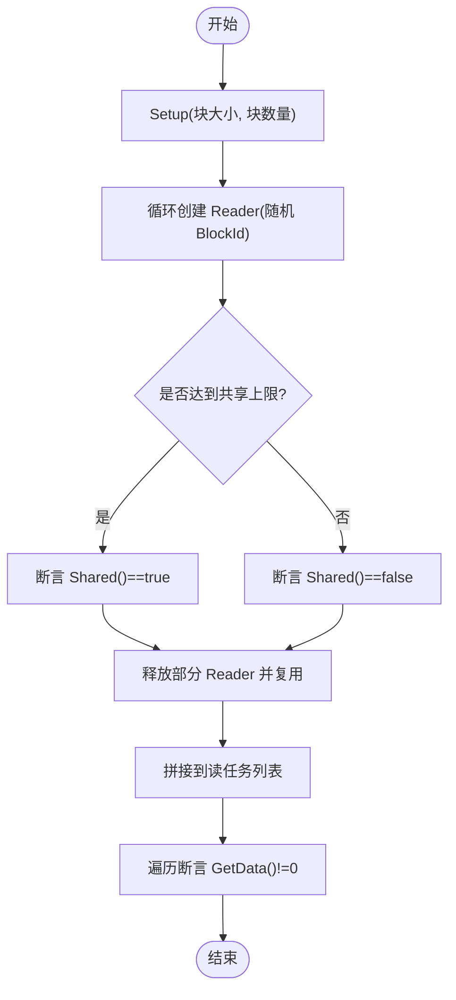

**图表来源**
- [ucm/store/test/case/pcstore/pcstore_share_buffer_test.cc](file://ucm/store/test/case/pcstore/pcstore_share_buffer_test.cc#L41-L114)

**章节来源**
- [ucm/store/test/case/pcstore/pcstore_share_buffer_test.cc](file://ucm/store/test/case/pcstore/pcstore_share_buffer_test.cc#L1-L114)

## 依赖关系分析
- C++测试依赖
  - ucmshared.test：链接日志、指标、传输与GoogleTest。
  - ucmstore.test：链接POSIX/缓存/Fake/PC存储与GoogleTest/GMock。
- Python测试依赖
  - pytest、pytest-cov、pytest-html、nvidia-ml-py、PyYAML、peewee、psycopg2、requests、pandas、pydantic、transformers、httpx、jieba、openpyxl。

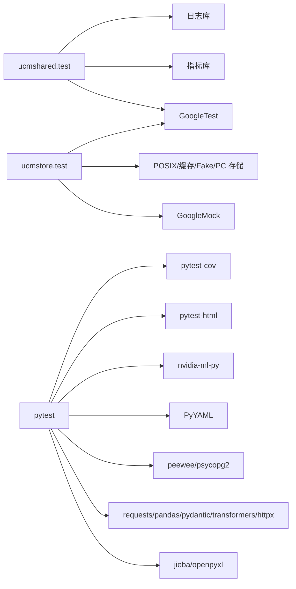

**图表来源**
- [ucm/shared/test/CMakeLists.txt](file://ucm/shared/test/CMakeLists.txt#L6-L9)
- [ucm/store/test/CMakeLists.txt](file://ucm/store/test/CMakeLists.txt#L6-L9)
- [test/requirements.txt](file://test/requirements.txt#L1-L18)

**章节来源**
- [ucm/shared/test/CMakeLists.txt](file://ucm/shared/test/CMakeLists.txt#L1-L12)
- [ucm/store/test/CMakeLists.txt](file://ucm/store/test/CMakeLists.txt#L1-L12)
- [test/requirements.txt](file://test/requirements.txt#L1-L18)

## 性能考量
- 测试性能关注点
  - 哈希集合与环形队列在大规模数据下的吞吐与延迟。
  - 线程池超时与挂起检测对任务调度的影响。
  - 指标系统聚合开销与频率。
- 建议
  - 使用固定容量与预分配减少动态内存抖动。
  - 控制并发度与任务粒度，避免过度竞争。
  - 在CI中对关键路径设置超时，防止长尾影响整体流水线。

## 故障排查指南
- 日志系统
  - 若日志未落盘：检查日志目录权限、轮转参数与Flush时机。
  - 压缩文件数量不符：确认轮转策略与归档保留数量。
- 哈希集合/环形队列
  - 并发测试失败：检查线程同步与无竞态的数据结构使用。
- 线程池
  - 超时未触发：确认超时阈值与回调注册；检查任务是否真正阻塞。
- 指标系统
  - 聚合结果为空：确认UpdateStats调用与GetAllStatsAndClear调用配对。
- 存储后端
  - POSIX文件读写不一致：核对OpenFlags与Offset；使用DataGenerator进行二进制对比。
  - 共享缓冲区复用异常：检查Reader生命周期与拼接顺序。

**章节来源**
- [ucm/shared/test/case/infra/logger/logger_test.cc](file://ucm/shared/test/case/infra/logger/logger_test.cc#L72-L145)
- [ucm/shared/test/case/infra/hashset_test.cc](file://ucm/shared/test/case/infra/hashset_test.cc#L30-L77)
- [ucm/shared/test/case/infra/spsc_ring_queue_test.cc](file://ucm/shared/test/case/infra/spsc_ring_queue_test.cc#L29-L88)
- [ucm/shared/test/case/infra/thread_pool_test.cc](file://ucm/shared/test/case/infra/thread_pool_test.cc#L34-L101)
- [ucm/shared/test/case/metrics/metrics_test.cc](file://ucm/shared/test/case/metrics/metrics_test.cc#L48-L107)
- [ucm/store/test/case/posix/posix_file_test.cc](file://ucm/store/test/case/posix/posix_file_test.cc#L30-L84)
- [ucm/store/test/case/pcstore/pcstore_share_buffer_test.cc](file://ucm/store/test/case/pcstore/pcstore_share_buffer_test.cc#L41-L114)

## 结论
本指南提供了UCM单元测试的系统化实施方法，涵盖C++基础设施与存储后端的关键测试域。通过明确的测试夹具、模拟对象与边界/异常测试策略，结合覆盖率与报告工具，可有效保障代码质量与稳定性。建议在持续集成中启用覆盖率统计与报告生成，并针对高风险路径增加压力与并发测试。

## 附录

### 测试夹具与模拟对象
- C++夹具
  - 日志测试使用TestSuite级SetUp/TearDown清理临时目录与日志句柄。
  - 缓存存储测试使用MockStore与随机数据生成器。
- Python夹具
  - conftest.py提供GPU资源自动选择、测试报告目录与HTML报告配置、数据库记录等。

**章节来源**
- [ucm/shared/test/case/infra/logger/logger_test.cc](file://ucm/shared/test/case/infra/logger/logger_test.cc#L48-L69)
- [ucm/store/test/case/detail/mock_store.h](file://ucm/store/test/case/detail/mock_store.h#L32-L47)
- [ucm/store/test/case/detail/data_generator.h](file://ucm/store/test/case/detail/data_generator.h#L34-L82)
- [test/conftest.py](file://test/conftest.py#L146-L214)

### 测试用例编写示例（路径指引）
- 日志系统
  - 单例行为与级别过滤：参考 [logger_test.cc](file://ucm/shared/test/case/infra/logger/logger_test.cc#L72-L119)
  - 压缩文件数量：参考 [logger_test.cc](file://ucm/shared/test/case/infra/logger/logger_test.cc#L121-L145)
- 哈希集合
  - 基本/大量键/并发/字符串键：参考 [hashset_test.cc](file://ucm/shared/test/case/infra/hashset_test.cc#L30-L77)
- 环形队列
  - 基础/FIFO/满队列/移动语义：参考 [spsc_ring_queue_test.cc](file://ucm/shared/test/case/infra/spsc_ring_queue_test.cc#L29-L88)
- 线程池
  - 超时检测/挂起检测：参考 [thread_pool_test.cc](file://ucm/shared/test/case/infra/thread_pool_test.cc#L34-L101)
- 指标系统
  - 单/批量更新与聚合：参考 [metrics_test.cc](file://ucm/shared/test/case/metrics/metrics_test.cc#L48-L107)
- 缓存存储
  - BufferManager查找与MockStore交互：参考 [cache_buffer_manager_test.cc](file://ucm/store/test/case/cache/cache_buffer_manager_test.cc#L44-L84)
- POSIX存储
  - 目录/文件创建与读写一致性：参考 [posix_file_test.cc](file://ucm/store/test/case/posix/posix_file_test.cc#L30-L84)
- PC存储
  - 共享缓冲区容量与复用：参考 [pcstore_share_buffer_test.cc](file://ucm/store/test/case/pcstore/pcstore_share_buffer_test.cc#L41-L86)

### 测试覆盖率要求与分析
- 覆盖率工具
  - Python：pytest-cov用于生成覆盖率报告。
  - C++：建议在CMake中启用覆盖率编译选项并在CI中收集报告。
- 分析方法
  - 关注关键分支与异常路径（如状态码/错误返回）。
  - 对并发与边界条件进行重点覆盖。
  - 定期审查低覆盖率模块并补充测试。

**章节来源**
- [test/requirements.txt](file://test/requirements.txt#L2-L4)
- [ucm/shared/test/CMakeLists.txt](file://ucm/shared/test/CMakeLists.txt#L1-L12)
- [ucm/store/test/CMakeLists.txt](file://ucm/store/test/CMakeLists.txt#L1-L12)

### 测试环境配置与运行命令
- Python测试
  - 安装依赖：pip install -r test/requirements.txt
  - 运行pytest：pytest --html=reports/report.html --self-contained-html
  - 标记过滤：pytest -m "stage:1,feature:xxx,platform:gpu"
  - 报告目录：由conftest.py生成，支持时间戳与自定义前缀
- C++测试
  - 构建与运行：确保启用BUILD_UNIT_TESTS，使用gtest_discover_tests自动发现并执行
  - 链接库：ucmshared.test链接日志/指标/传输与GoogleTest；ucmstore.test链接各存储实现与GoogleMock
- CUDA传输示例（参考）
  - 参考 [trans_on_cuda_example.py](file://ucm/shared/test/example/trans/trans_on_cuda_example.py#L245-L266)，用于验证设备/流与主机/设备间数据搬运带宽与一致性

**章节来源**
- [test/requirements.txt](file://test/requirements.txt#L1-L18)
- [test/pytest.ini](file://test/pytest.ini#L1-L25)
- [test/conftest.py](file://test/conftest.py#L72-L127)
- [ucm/shared/test/CMakeLists.txt](file://ucm/shared/test/CMakeLists.txt#L1-L12)
- [ucm/store/test/CMakeLists.txt](file://ucm/store/test/CMakeLists.txt#L1-L12)
- [ucm/shared/test/example/trans/trans_on_cuda_example.py](file://ucm/shared/test/example/trans/trans_on_cuda_example.py#L245-L266)