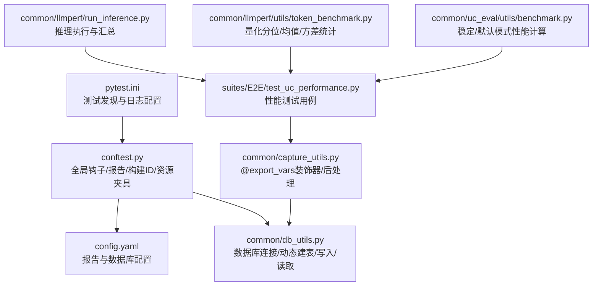
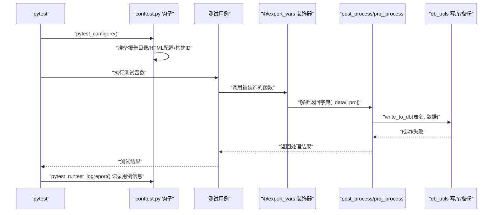
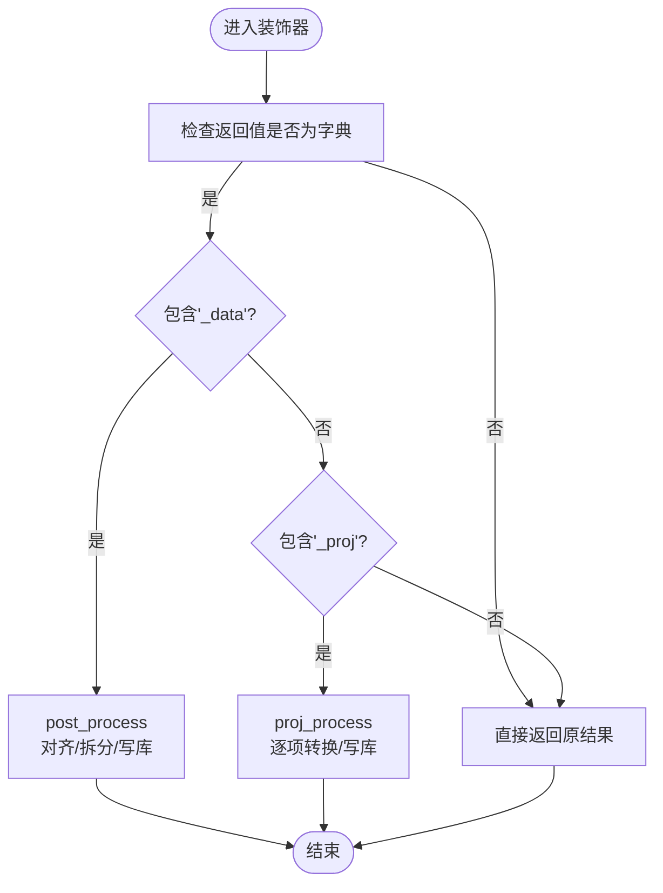
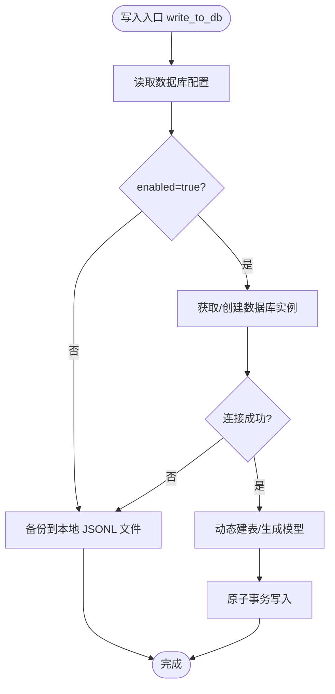
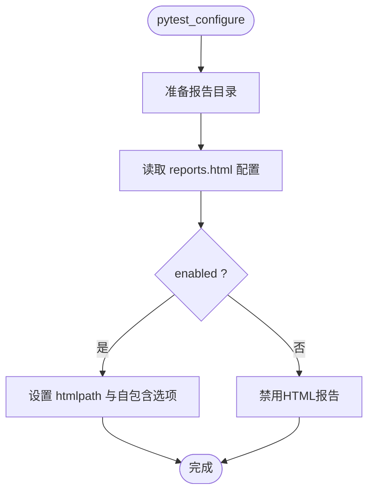
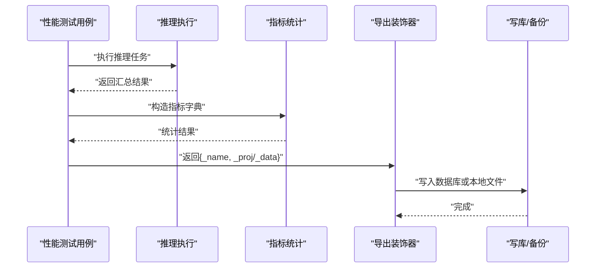
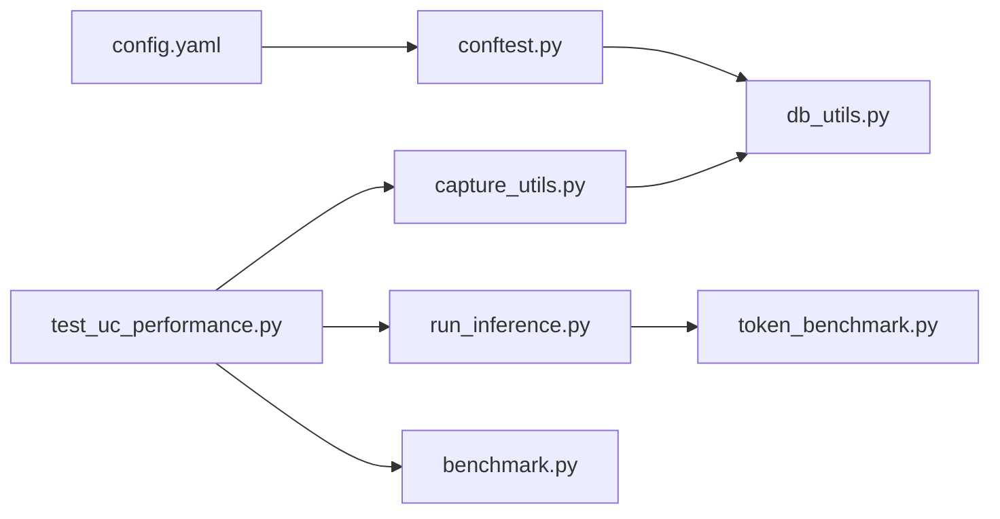

# 测试报告与分析

<cite>
**本文引用的文件**
- [test/README.md](file://test/README.md)
- [test/README_zh.md](file://test/README_zh.md)
- [test/config.yaml](file://test/config.yaml)
- [test/pytest.ini](file://test/pytest.ini)
- [test/conftest.py](file://test/conftest.py)
- [test/common/capture_utils.py](file://test/common/capture_utils.py)
- [test/common/db_utils.py](file://test/common/db_utils.py)
- [test/suites/E2E/test_uc_performance.py](file://test/suites/E2E/test_uc_performance.py)
- [test/common/llmperf/run_inference.py](file://test/common/llmperf/run_inference.py)
- [test/common/uc_eval/utils/benchmark.py](file://test/common/uc_eval/utils/benchmark.py)
- [test/common/llmperf/utils/token_benchmark.py](file://test/common/llmperf/utils/token_benchmark.py)
</cite>

## 目录
1. [简介](#简介)
2. [项目结构](#项目结构)
3. [核心组件](#核心组件)
4. [架构总览](#架构总览)
5. [详细组件分析](#详细组件分析)
6. [依赖关系分析](#依赖关系分析)
7. [性能考量](#性能考量)
8. [故障排查指南](#故障排查指南)
9. [结论](#结论)
10. [附录](#附录)

## 简介
本指南面向UCM项目的测试报告与分析，围绕自动测试数据采集与导出、数据库与本地文件存储策略、HTML测试报告生成与自定义、性能基准测试统计与趋势分析、测试覆盖率分析方法、报告解读与质量评估标准、失败诊断与定位技巧，以及在持续集成中进行报告集成与通知机制给出系统性说明。文档以仓库现有实现为依据，结合关键源码路径，帮助读者快速上手并深度理解测试体系。

## 项目结构
测试相关的核心位置集中在 test 目录，包含：
- 配置与运行入口：pytest.ini、config.yaml
- 全局钩子与报告设置：conftest.py
- 自动采集与导出：common/capture_utils.py、common/db_utils.py
- 性能测试样例：suites/E2E/test_uc_performance.py
- 推理与指标统计：common/llmperf/run_inference.py、common/llmperf/utils/token_benchmark.py
- 基准评估工具：common/uc_eval/utils/benchmark.py

图表来源
- [test/pytest.ini](file://test/pytest.ini#L1-L25)
- [test/conftest.py](file://test/conftest.py#L70-L155)
- [test/config.yaml](file://test/config.yaml#L1-L48)
- [test/common/db_utils.py](file://test/common/db_utils.py#L57-L165)
- [test/common/capture_utils.py](file://test/common/capture_utils.py#L96-L110)
- [test/suites/E2E/test_uc_performance.py](file://test/suites/E2E/test_uc_performance.py#L30-L91)
- [test/common/llmperf/run_inference.py](file://test/common/llmperf/run_inference.py#L134-L166)
- [test/common/llmperf/utils/token_benchmark.py](file://test/common/llmperf/utils/token_benchmark.py#L224-L257)
- [test/common/uc_eval/utils/benchmark.py](file://test/common/uc_eval/utils/benchmark.py#L91-L113)

章节来源
- [test/pytest.ini](file://test/pytest.ini#L1-L25)
- [test/config.yaml](file://test/config.yaml#L1-L48)
- [test/conftest.py](file://test/conftest.py#L70-L155)

## 核心组件
- 自动测试数据采集与导出
  - 装饰器：@export_vars，用于在测试函数返回字典时自动进行后处理与落库/备份。
  - 后处理：支持单条记录(_data)与投影式多条记录(_proj)，并自动补齐长度、转换对象类型。
- 数据库与本地文件存储
  - 动态建表：按首次写入的键集合动态生成列，保留id、created_at、test_build_id等通用字段。
  - 存储策略：当数据库未启用或连接失败时，自动回退到本地JSONL文件备份。
- HTML测试报告
  - 由pytest-html插件生成，路径与标题可配置；支持是否自包含资源。
- 性能基准测试
  - 提供推理执行、指标统计（均值、分位、极值、标准差）、稳定/默认两种模式的性能计算。
- 报告解读与质量评估
  - 建议关注吞吐、端到端延迟、TTFT、ITL分位数、错误率与异常波动。

章节来源
- [test/README.md](file://test/README.md#L166-L206)
- [test/README_zh.md](file://test/README_zh.md#L165-L204)
- [test/common/capture_utils.py](file://test/common/capture_utils.py#L96-L110)
- [test/common/db_utils.py](file://test/common/db_utils.py#L136-L208)
- [test/conftest.py](file://test/conftest.py#L85-L98)

## 架构总览
下图展示了从测试执行到报告生成与数据落库的整体流程。

图表来源
- [test/conftest.py](file://test/conftest.py#L114-L164)
- [test/common/capture_utils.py](file://test/common/capture_utils.py#L96-L110)
- [test/common/db_utils.py](file://test/common/db_utils.py#L136-L208)

## 详细组件分析

### 自动测试数据采集与导出（@export_vars）
- 使用要求
  - 装饰器需置于最内层（靠近函数定义）。
  - 返回值必须是字典，至少包含以下键之一：_name（表名）、_data（单条或多条数据）、_proj（投影式多条数据）。
- 处理逻辑
  - 单条数据：_data键会被对齐与拆分为多条记录，逐条写入数据库或本地备份。
  - 投影数据：_proj键中的每个元素会被转换为字典后逐条写入。
  - 对象转换：支持Mapping、dataclass、namedtuple、有__dict__的对象。
- 示例参考
  - 参见测试文档中的示例与注释，了解如何在测试中使用该装饰器。

图表来源
- [test/common/capture_utils.py](file://test/common/capture_utils.py#L96-L110)
- [test/common/capture_utils.py](file://test/common/capture_utils.py#L34-L46)
- [test/common/capture_utils.py](file://test/common/capture_utils.py#L76-L93)

章节来源
- [test/README.md](file://test/README.md#L166-L206)
- [test/README_zh.md](file://test/README_zh.md#L165-L204)
- [test/common/capture_utils.py](file://test/common/capture_utils.py#L9-L32)
- [test/common/capture_utils.py](file://test/common/capture_utils.py#L34-L93)

### 数据库存储与本地文件备份策略
- 连接与建模
  - 按配置启用PostgreSQL；懒加载peewee，仅在需要时导入。
  - 动态模型：根据首次写入的键集合生成列，确保id、created_at、test_build_id存在。
  - 表不存在则自动创建；插入前过滤掉不存在的字段。
- 回退策略
  - 当数据库未启用或连接失败时，自动将数据以JSONL形式追加到本地备份目录。
- 读取接口
  - 支持按表读取最新N条记录，并可按指定键过滤。

图表来源
- [test/common/db_utils.py](file://test/common/db_utils.py#L136-L208)
- [test/common/db_utils.py](file://test/common/db_utils.py#L120-L134)

章节来源
- [test/common/db_utils.py](file://test/common/db_utils.py#L57-L98)
- [test/common/db_utils.py](file://test/common/db_utils.py#L136-L208)
- [test/common/db_utils.py](file://test/common/db_utils.py#L210-L257)

### HTML测试报告生成与自定义
- 生成控制
  - 通过config.yaml中的reports.html配置决定是否启用HTML报告及输出文件名。
  - 启用时，pytest会将报告写入由reports.base_dir与reports.directory_prefix组合的目录，可选带时间戳。
- 自定义选项
  - 可设置标题、文件名、是否自包含资源等（具体键位以pytest-html支持为准）。

图表来源
- [test/conftest.py](file://test/conftest.py#L71-L98)
- [test/config.yaml](file://test/config.yaml#L1-L9)

章节来源
- [test/conftest.py](file://test/conftest.py#L71-L98)
- [test/config.yaml](file://test/config.yaml#L1-L9)

### 性能基准测试与统计分析
- 测试用例
  - 统一通过装饰器导出指标，覆盖不同并发、命中率、数据规模场景。
  - 指标包括输入/输出token数、并发数、请求数、命中率、吞吐、端到端延迟、TTFT、ITL分位数等。
- 统计工具
  - 推理结果统计：计算均值、分位数（p50/p90/p99）、最小/最大、标准差等。
  - 基准评估：支持稳定模式（稳定采样）与默认模式（完整重算），便于对比不同策略的稳定性与性能。

图表来源
- [test/suites/E2E/test_uc_performance.py](file://test/suites/E2E/test_uc_performance.py#L30-L91)
- [test/common/llmperf/run_inference.py](file://test/common/llmperf/run_inference.py#L134-L166)
- [test/common/llmperf/utils/token_benchmark.py](file://test/common/llmperf/utils/token_benchmark.py#L224-L257)
- [test/common/uc_eval/utils/benchmark.py](file://test/common/uc_eval/utils/benchmark.py#L91-L113)

章节来源
- [test/suites/E2E/test_uc_performance.py](file://test/suites/E2E/test_uc_performance.py#L43-L91)
- [test/common/llmperf/utils/token_benchmark.py](file://test/common/llmperf/utils/token_benchmark.py#L224-L257)
- [test/common/uc_eval/utils/benchmark.py](file://test/common/uc_eval/utils/benchmark.py#L91-L113)

### 测试覆盖率分析
- 工具选择
  - 建议使用pytest内置的覆盖率收集能力，结合pytest-cov插件在CI中统一收集。
- 配置要点
  - 在CI中通过命令行参数启用覆盖率收集，并输出XML/JSON报告以便可视化平台消费。
  - 将覆盖率阈值纳入质量门禁，避免回归。

[本节为通用实践建议，不直接分析具体文件，故无“章节来源”]

### 测试报告解读与质量评估标准
- 关键指标
  - 吞吐（requests/s）、端到端延迟均值与分位、TTFT均值与分位、ITL均值与分位、错误率与异常波动。
- 趋势分析
  - 对比不同并发、命中率、数据规模下的指标变化，识别瓶颈与异常点。
- 质量评估
  - 建议设定阈值与区间，结合分位数判断稳定性；关注p95/p99与均值偏离度。

[本节为通用实践建议，不直接分析具体文件，故无“章节来源”]

### 测试失败诊断与问题定位技巧
- 日志与报告
  - 利用pytest.ini中的日志配置查看详细输出；HTML报告可辅助定位失败用例。
- 数据落库
  - 所有用例状态会写入test_case_info表，便于按用例维度检索与分析。
- 资源与环境
  - conftest中包含GPU资源夹具，可根据需求调整内存阈值与可见设备，避免OOM导致的失败。

章节来源
- [test/conftest.py](file://test/conftest.py#L149-L164)
- [test/conftest.py](file://test/conftest.py#L189-L206)
- [test/pytest.ini](file://test/pytest.ini#L13-L16)

### 持续集成中的测试报告集成与通知
- 报告输出
  - 通过config.yaml的reports配置控制报告目录与命名；CI中可将该目录作为Artifacts归档。
- 插件与扩展
  - pytest-html用于生成HTML报告；可在CI中结合覆盖率插件与测试结果聚合工具进行统一展示。
- 通知机制
  - 建议在CI中基于测试结果触发邮件/IM通知，并附带报告链接与失败摘要。

[本节为通用实践建议，不直接分析具体文件，故无“章节来源”]

## 依赖关系分析
- 组件耦合
  - conftest.py依赖config.yaml进行报告与数据库配置；同时负责构建ID注入与用例状态写库。
  - capture_utils依赖db_utils进行写库/备份；test_uc_performance依赖llmperf与uc_eval工具进行指标构造与统计。
- 外部依赖
  - 数据库：PostgreSQL（通过peewee动态建表与写入）。
  - 报告：pytest-html（由conftest按配置启用）。
  - 推理与统计：llmperf与uc_eval工具链。

图表来源
- [test/config.yaml](file://test/config.yaml#L1-L48)
- [test/conftest.py](file://test/conftest.py#L114-L127)
- [test/common/db_utils.py](file://test/common/db_utils.py#L136-L208)
- [test/common/capture_utils.py](file://test/common/capture_utils.py#L96-L110)
- [test/suites/E2E/test_uc_performance.py](file://test/suites/E2E/test_uc_performance.py#L30-L91)
- [test/common/llmperf/run_inference.py](file://test/common/llmperf/run_inference.py#L134-L166)
- [test/common/llmperf/utils/token_benchmark.py](file://test/common/llmperf/utils/token_benchmark.py#L224-L257)
- [test/common/uc_eval/utils/benchmark.py](file://test/common/uc_eval/utils/benchmark.py#L91-L113)

章节来源
- [test/config.yaml](file://test/config.yaml#L1-L48)
- [test/conftest.py](file://test/conftest.py#L114-L127)

## 性能考量
- 数据写入
  - 动态建表与原子插入保证一致性；数据库不可用时自动回退至本地文件，避免测试中断。
- 报告生成
  - HTML报告可自包含资源，便于离线查看；目录与命名可配置，适配CI归档。
- 资源管理
  - GPU资源夹具按需分配，减少冲突与OOM风险。

[本节为通用实践建议，不直接分析具体文件，故无“章节来源”]

## 故障排查指南
- 数据库连接失败
  - 检查config.yaml中database.enabled与连接参数；确认数据库可达且凭据正确。
- 报告未生成
  - 检查reports.html.enabled与filename配置；确认pytest-html已安装。
- 用例失败
  - 查看HTML报告与日志；结合test_case_info表定位失败用例与错误信息。
- 资源不足
  - 调整gpu_mem标记或CUDA_VISIBLE_DEVICES；避免过高的内存利用率导致失败。

章节来源
- [test/common/db_utils.py](file://test/common/db_utils.py#L260-L283)
- [test/conftest.py](file://test/conftest.py#L85-L98)
- [test/conftest.py](file://test/conftest.py#L149-L164)
- [test/conftest.py](file://test/conftest.py#L189-L206)

## 结论
本指南基于仓库现有实现，系统梳理了UCM测试报告与分析的关键环节：自动数据采集与导出、数据库与本地备份策略、HTML报告生成与自定义、性能基准测试统计与趋势分析、报告解读与质量评估、失败诊断与CI集成建议。建议在实际使用中结合配置文件与装饰器规范，确保测试数据可追溯、可分析、可沉淀。

## 附录
- 快速参考
  - 装饰器使用：在测试函数上添加@export_vars，并返回包含_name/_data/_proj的字典。
  - 配置开关：通过config.yaml控制数据库启用、备份目录、报告目录与HTML报告开关。
  - 报告查看：在CI或本地查看reports目录下的HTML报告与JSONL备份文件。

[本节为通用实践建议，不直接分析具体文件，故无“章节来源”]