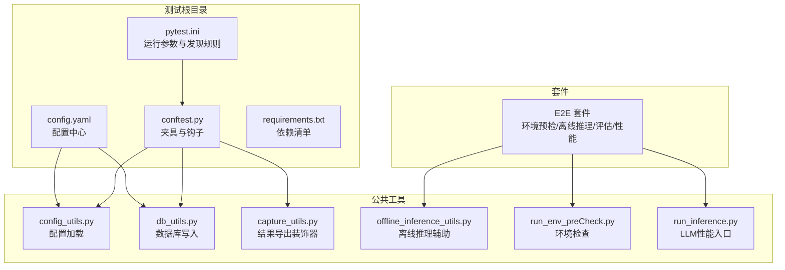
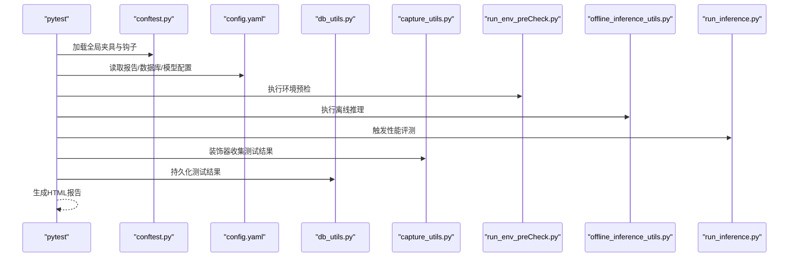
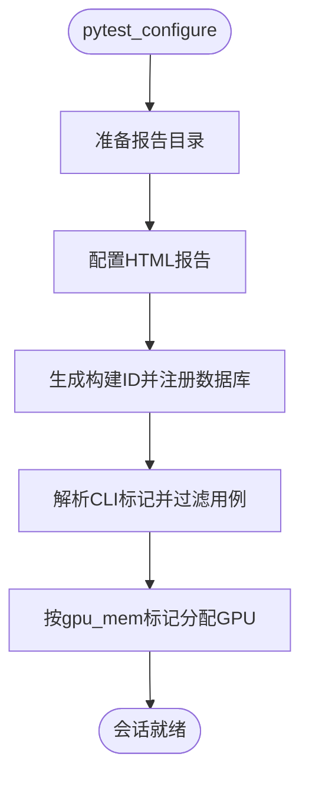
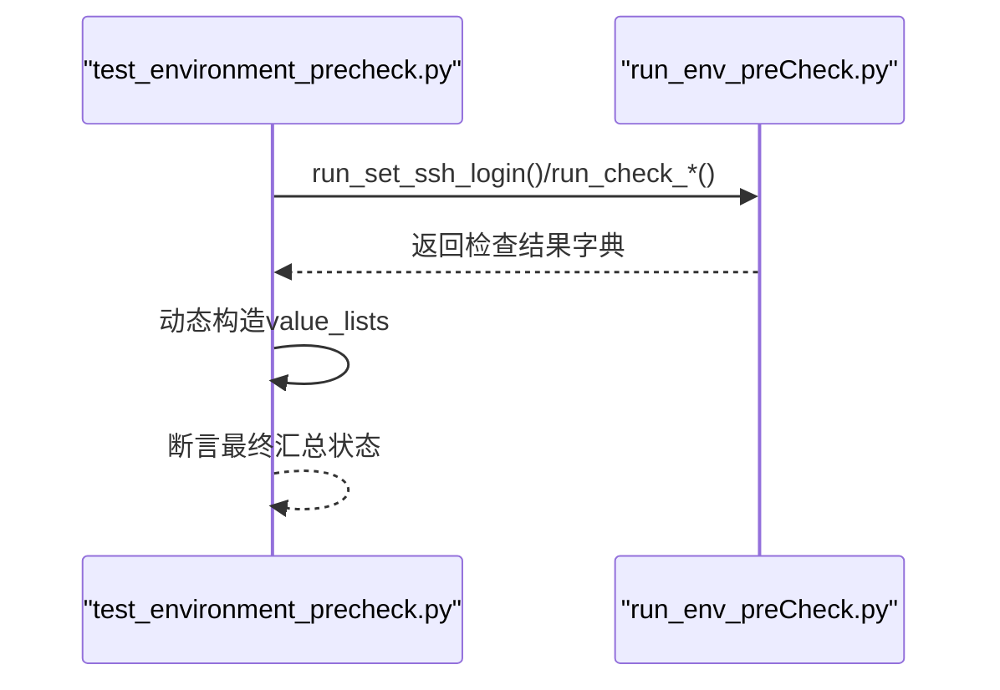
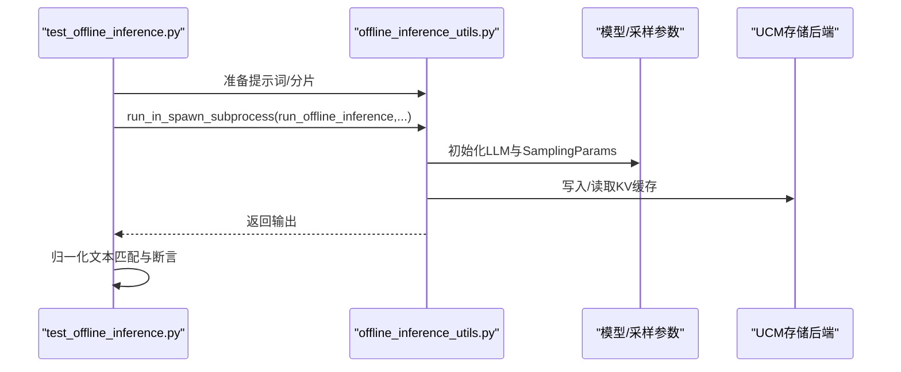
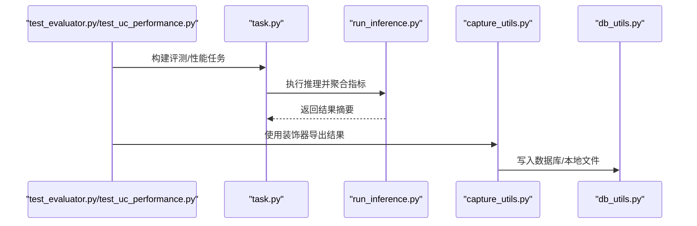
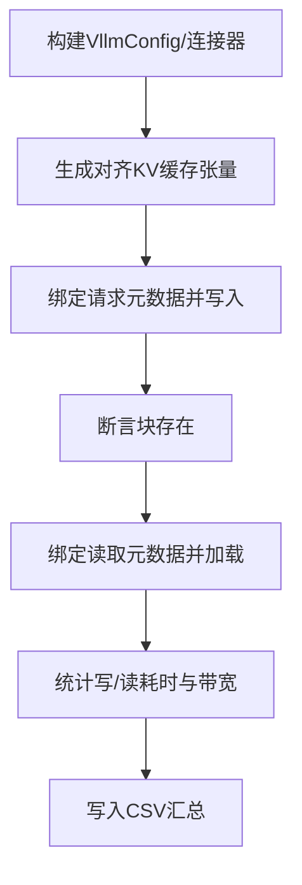
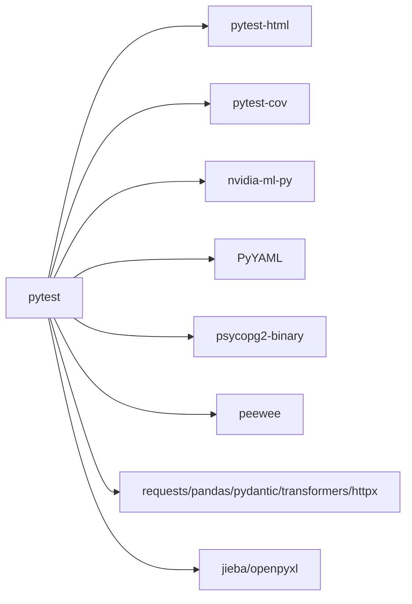

# 测试框架

<cite>
**本文引用的文件**
- [conftest.py](file://test/conftest.py)
- [pytest.ini](file://test/pytest.ini)
- [README.md](file://test/README.md)
- [config.yaml](file://test/config.yaml)
- [requirements.txt](file://test/requirements.txt)
- [test_environment_precheck.py](file://test/suites/E2E/test_environment_precheck.py)
- [test_evaluator.py](file://test/suites/E2E/test_evaluator.py)
- [test_offline_inference.py](file://test/suites/E2E/test_offline_inference.py)
- [test_offline_inference_sparse.py](file://test/suites/E2E/test_offline_inference_sparse.py)
- [test_uc_performance.py](file://test/suites/E2E/test_uc_performance.py)
- [test_mooncake.py](file://test/test_mooncake.py)
- [test_ucm_connector_save_load.py](file://test/test_ucm_connector_save_load.py)
- [run_env_preCheck.py](file://test/common/envPreCheck/run_env_preCheck.py)
- [run_inference.py](file://test/common/llmperf/run_inference.py)
- [ucm_connector.py](file://ucm/integration/vllm/ucm_connector.py)
- [offline_inference_utils.py](file://test/common/offline_inference_utils.py)
- [path_utils.py](file://test/common/path_utils.py)
- [capture_utils.py](file://test/common/capture_utils.py)
- [db_utils.py](file://test/common/db_utils.py)
- [config_utils.py](file://test/common/config_utils.py)
- [task.py](file://test/common/uc_eval/task.py)
- [data_class.py](file://test/common/uc_eval/utils/data_class.py)
- [logging_perf_test.py](file://benchmarks/logging_perf_test.py)
- [trace_replay.py](file://benchmarks/trace_replay.py)
</cite>

## 目录
1. [引言](#引言)
2. [项目结构](#项目结构)
3. [核心组件](#核心组件)
4. [架构总览](#架构总览)
5. [详细组件分析](#详细组件分析)
6. [依赖关系分析](#依赖关系分析)
7. [性能考量](#性能考量)
8. [故障排查指南](#故障排查指南)
9. [结论](#结论)
10. [附录](#附录)

## 引言
本文件面向UCM测试框架的使用者与维护者，系统化阐述基于pytest的测试架构设计与使用方法，覆盖pytest配置、测试夹具与套件组织、单元测试（存储后端、稀疏算法）、集成测试（端到端）与性能测试（基准与结果分析），并提供测试用例编写指导、最佳实践、测试环境搭建与运行方法、持续集成与自动化测试建议，以及测试覆盖率与质量保证流程。

## 项目结构
UCM测试子工程位于test目录，采用“套件分层 + 公共工具”的组织方式：
- 套件层：test/suites/E2E 下按场景划分端到端测试（环境预检、离线推理、评估与性能）
- 公共工具层：test/common 提供配置、数据库、LLM连接、评测任务、离线推理辅助等通用能力
- 根级配置：pytest.ini、conftest.py、config.yaml、requirements.txt 等定义运行参数、夹具、报告与数据库集成

**图表来源**
- [pytest.ini](file://test/pytest.ini#L1-L25)
- [conftest.py](file://test/conftest.py#L1-L214)
- [config.yaml](file://test/config.yaml#L1-L48)
- [requirements.txt](file://test/requirements.txt#L1-L18)

**章节来源**
- [pytest.ini](file://test/pytest.ini#L1-L25)
- [conftest.py](file://test/conftest.py#L1-L214)
- [config.yaml](file://test/config.yaml#L1-L48)
- [requirements.txt](file://test/requirements.txt#L1-L18)

## 核心组件
- pytest配置与发现规则：通过pytest.ini统一设置测试路径、命名规范、日志与过滤器，确保扫描一致性
- 全局夹具与钩子：在conftest.py中集中管理报告目录生成、HTML报告开关、构建ID注册、GPU资源分配、模型配置注入等
- 配置与数据库：config.yaml集中管理报告输出、数据库连接与模型参数；db_utils与conftest钩子自动持久化测试结果
- 多维标记体系：stage/feature/platform/gpu_mem等标记用于过滤与分类测试
- 自动化数据采集：capture_utils.export_vars装饰器支持将测试结果以表/投影形式写入数据库或本地文件

**章节来源**
- [pytest.ini](file://test/pytest.ini#L1-L25)
- [conftest.py](file://test/conftest.py#L114-L214)
- [config.yaml](file://test/config.yaml#L1-L48)
- [db_utils.py](file://test/common/db_utils.py)
- [capture_utils.py](file://test/common/capture_utils.py)

## 架构总览
下图展示了测试运行时的关键交互：pytest加载配置与夹具，执行测试用例，利用公共工具完成环境检查、离线推理、性能评测与结果采集，并通过数据库或HTML报告输出。

**图表来源**
- [conftest.py](file://test/conftest.py#L114-L214)
- [config.yaml](file://test/config.yaml#L1-L48)
- [run_env_preCheck.py](file://test/common/envPreCheck/run_env_preCheck.py)
- [offline_inference_utils.py](file://test/common/offline_inference_utils.py)
- [run_inference.py](file://test/common/llmperf/run_inference.py)
- [capture_utils.py](file://test/common/capture_utils.py)
- [db_utils.py](file://test/common/db_utils.py)

## 详细组件分析

### pytest配置与套件组织
- 发现规则：testpaths、python_files、python_classes、python_functions确保仅扫描suites目录下的测试文件
- 运行选项：addopts、log_cli、filterwarnings等提升可观察性与稳定性
- 标记系统：stage/feature/platform/gpu_mem用于多维过滤与分类

**章节来源**
- [pytest.ini](file://test/pytest.ini#L1-L25)

### 全局夹具与钩子（conftest.py）
- 报告与构建ID：在会话开始前准备报告目录、生成构建ID并注册到数据库
- HTML报告：根据配置启用/禁用并设置文件名与自包含模式
- 测试过滤：支持--stage/--feature/--platform等CLI参数，按标记筛选用例
- GPU资源分配：gpu_mem标记自动选择空闲显存满足阈值的GPU并注入环境变量
- 模型配置注入：model_config夹具从配置中心读取模型参数并注入测试函数

**图表来源**
- [conftest.py](file://test/conftest.py#L114-L214)

**章节来源**
- [conftest.py](file://test/conftest.py#L23-L214)

### 环境预检测试（E2E）
- 功能：SSH登录、设备状态、网络连通性（HCCN/NVIDIA）、TLS、模型权重、带宽
- 方法：调用run_env_preCheck.py中的检查函数，动态构造value_lists并断言最终汇总状态
- 平台标记：platform(npu/gpu)区分不同硬件栈

**图表来源**
- [test_environment_precheck.py](file://test/suites/E2E/test_environment_precheck.py#L1-L267)
- [run_env_preCheck.py](file://test/common/envPreCheck/run_env_preCheck.py)

**章节来源**
- [test_environment_precheck.py](file://test/suites/E2E/test_environment_precheck.py#L1-L267)

### 离线推理测试（E2E）
- 基础功能：HBM+SSD混合命中准确性验证，分阶段执行（保存KV缓存到SSD与从SSD加载）
- 参数化：模型名、最大生成长度、提示词拆分比例、是否强制eager、批处理token上限
- GPU内存：gpu_mem(6000)确保可用显存
- 子进程隔离：为避免GPU显存残留影响，使用run_in_spawn_subprocess在独立进程中执行推理
- 断言策略：对标准答案进行归一化匹配，严格校验SSD保存/加载与混合命中场景

**图表来源**
- [test_offline_inference.py](file://test/suites/E2E/test_offline_inference.py#L1-L229)
- [offline_inference_utils.py](file://test/common/offline_inference_utils.py)
- [path_utils.py](file://test/common/path_utils.py)

**章节来源**
- [test_offline_inference.py](file://test/suites/E2E/test_offline_inference.py#L1-L229)

### 稀疏注意力离线推理测试（E2E）
- 目标：验证ESA/GSA等稀疏注意力在UCM上的正确性与性能
- 当前状态：部分用例处于skip状态，待完善后再启用
- 参数化：模型名、最大生成长度、是否强制eager、批处理token上限
- GPU内存：针对GSA使用更高阈值（gpu_mem(10000)）

**章节来源**
- [test_offline_inference_sparse.py](file://test/suites/E2E/test_offline_inference_sparse.py#L1-L430)

### 评测与性能测试（E2E）
- 评测任务：DocQA等评测任务通过task.py封装，支持参数化数据集与评测指标
- 性能评测：run_inference.py提供统一的性能评测入口，产出TTFT/ITL/吞吐等指标
- 结果采集：export_vars装饰器将指标扁平化为投影数据写入数据库或本地文件

**图表来源**
- [test_evaluator.py](file://test/suites/E2E/test_evaluator.py#L1-L36)
- [test_uc_performance.py](file://test/suites/E2E/test_uc_performance.py#L1-L186)
- [task.py](file://test/common/uc_eval/task.py)
- [run_inference.py](file://test/common/llmperf/run_inference.py)
- [capture_utils.py](file://test/common/capture_utils.py)
- [db_utils.py](file://test/common/db_utils.py)

**章节来源**
- [test_evaluator.py](file://test/suites/E2E/test_evaluator.py#L1-L36)
- [test_uc_performance.py](file://test/suites/E2E/test_uc_performance.py#L1-L186)

### 存储后端测试（单元）
- 目标：验证UcmMooncakeStore的查找、写入、读取等核心行为
- 方法：基于张量哈希生成块ID，执行dump/lookup/load并断言一致性与错误处理
- 关键点：重复dump不报错、不存在数据读取失败且目标张量不变

**章节来源**
- [test_mooncake.py](file://test/test_mooncake.py#L1-L156)

### UCM连接器带宽基准测试（单元）
- 目标：在真实UCMConnector上对wait_for_save与start_load_kv进行带宽基准测试
- 方法：构造对齐张量缓冲区，构建VllmConfig，模拟请求元数据，记录写/读耗时与带宽
- 输出：CSV文件记录不同序列长度、头数、块大小、流数量等组合的平均写/读带宽

**图表来源**
- [test_ucm_connector_save_load.py](file://test/test_ucm_connector_save_load.py#L1-L600)
- [ucm_connector.py](file://ucm/integration/vllm/ucm_connector.py)

**章节来源**
- [test_ucm_connector_save_load.py](file://test/test_ucm_connector_save_load.py#L1-L600)

## 依赖关系分析
- 测试运行依赖：pytest、pytest-html、pytest-cov、nvidia-ml-py、PyYAML、psycopg2、peewee、requests、pandas、pydantic、transformers、httpx、jieba、openpyxl
- 运行期依赖：ucm/integration/vllm/ucm_connector.py、ucm/store.*、ucm/shared.*、ucm/sparse.*、ucm/pd/*、ucm/logger.py、ucm/observability.py、ucm/utils.py

**图表来源**
- [requirements.txt](file://test/requirements.txt#L1-L18)

**章节来源**
- [requirements.txt](file://test/requirements.txt#L1-L18)

## 性能考量
- 基准测试
  - 日志与追踪：benchmarks/logging_perf_test.py与benchmarks/trace_replay.py可用于日志与轨迹回放的性能分析
  - 存储连接器：test/test_ucm_connector_save_load.py提供真实连接器的写/读带宽基准，支持多参数组合
- 指标采集
  - 统一通过common/llmperf/run_inference.py产出TTFT、ITL、吞吐等关键指标
  - 评测任务通过common/uc_eval/task.py封装，支持多种数据类型与评测模式
- 结果落盘
  - 通过conftest.py钩子与capture_utils.export_vars装饰器将结果写入数据库或本地文件，便于后续分析与看板展示

**章节来源**
- [logging_perf_test.py](file://benchmarks/logging_perf_test.py)
- [trace_replay.py](file://benchmarks/trace_replay.py)
- [test_ucm_connector_save_load.py](file://test/test_ucm_connector_save_load.py#L1-L600)
- [run_inference.py](file://test/common/llmperf/run_inference.py)
- [task.py](file://test/common/uc_eval/task.py)

## 故障排查指南
- 环境预检失败
  - 检查config.yaml中的Env_preCheck节，确认IP、带宽阈值、存储后端列表等配置
  - 查看run_env_preCheck.py返回的详细检查项，定位具体失败环节
- GPU资源不足
  - 使用--stage=...与--platform=gpu筛选用例，结合gpu_mem标记合理分配显存
  - 若无足够空闲显存，pytest会直接fail，需释放占用或调整阈值
- 数据库写入异常
  - 检查config.yaml中database节的连接信息与备份目录权限
  - 确认db_utils.py与conftest.py钩子已正确初始化连接
- 结果未落盘
  - 确认capture_utils.export_vars装饰器正确使用，返回字典包含_name字段
  - 检查export_vars内部的写入逻辑与数据库/文件路径

**章节来源**
- [config.yaml](file://test/config.yaml#L36-L48)
- [run_env_preCheck.py](file://test/common/envPreCheck/run_env_preCheck.py)
- [conftest.py](file://test/conftest.py#L166-L206)
- [db_utils.py](file://test/common/db_utils.py)
- [capture_utils.py](file://test/common/capture_utils.py)

## 结论
UCM测试框架以pytest为核心，结合多维标记、全局夹具与公共工具，实现了从单元到端到端的全链路测试能力。通过统一的配置中心、数据库与HTML报告机制，测试结果可被稳定地采集与可视化。建议在CI中固定Python版本与依赖，启用pytest-html与pytest-cov，结合GPU资源调度与环境预检，确保回归与性能测试的可靠性与可重复性。

## 附录

### 测试用例编写指导与最佳实践
- 命名规范：文件以test_开头、类以Test开头、函数以test_开头，遵循pytest.ini预设规则
- 多维标记：为每个用例添加stage/feature/platform标记，必要时使用gpu_mem声明显存需求
- 参数化：对输入长度、并发度、采样策略等使用@pytest.mark.parametrize，提供清晰的ids
- 夹具复用：优先使用conftest.py提供的model_config、GPU资源夹具等，减少重复代码
- 结果采集：使用@export_vars装饰器将指标扁平化写入数据库或本地文件
- 断言策略：对关键路径（如SSD保存/加载、混合命中）采用严格断言，对文本比较进行归一化处理

**章节来源**
- [pytest.ini](file://test/pytest.ini#L18-L25)
- [README.md](file://test/README.md#L86-L236)
- [conftest.py](file://test/conftest.py#L189-L214)
- [capture_utils.py](file://test/common/capture_utils.py)

### 测试环境搭建与运行方法
- 安装依赖：pip install -r test/requirements.txt
- 可选数据库配置：编辑test/config.yaml中的database节
- 运行全部测试：pytest（或cd test && pytest）
- 运行指定用例：pytest --stage=0 --feature=uc_performance_test
- 生成HTML报告：确保config.yaml中reports.html.enabled=true

**章节来源**
- [README.md](file://test/README.md#L47-L83)
- [config.yaml](file://test/config.yaml#L1-L9)

### 持续集成与自动化测试
- CI建议
  - 固定Python版本与依赖安装步骤
  - 启用pytest-html与pytest-cov，生成报告与覆盖率
  - 在GPU节点上按gpu_mem标记调度测试，避免资源争用
  - 将数据库写入与CSV结果归档至制品库
- 自动化
  - 将环境预检作为前置步骤，失败即终止后续流程
  - 对性能测试设定基线阈值，异常时触发告警

**章节来源**
- [requirements.txt](file://test/requirements.txt#L1-L18)
- [conftest.py](file://test/conftest.py#L114-L144)

### 测试覆盖率分析与质量保证
- 覆盖率：使用pytest-cov插件生成覆盖率报告，建议设置阈值门禁
- 质量保证
  - 单元测试：覆盖核心存储接口与连接器关键路径
  - 集成测试：覆盖离线推理与稀疏注意力场景
  - 端到端：覆盖环境预检、评测与性能评测全流程
  - 数据一致性：通过export_vars与数据库写入保障结果可追溯

**章节来源**
- [requirements.txt](file://test/requirements.txt#L2-L4)
- [capture_utils.py](file://test/common/capture_utils.py)
- [db_utils.py](file://test/common/db_utils.py)