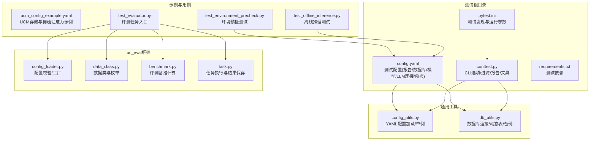
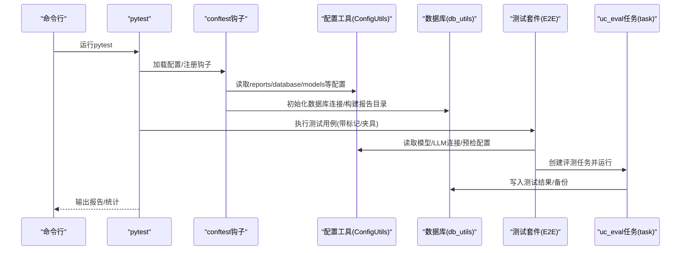
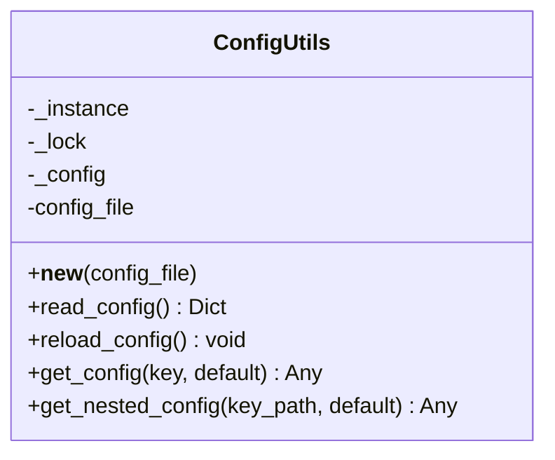
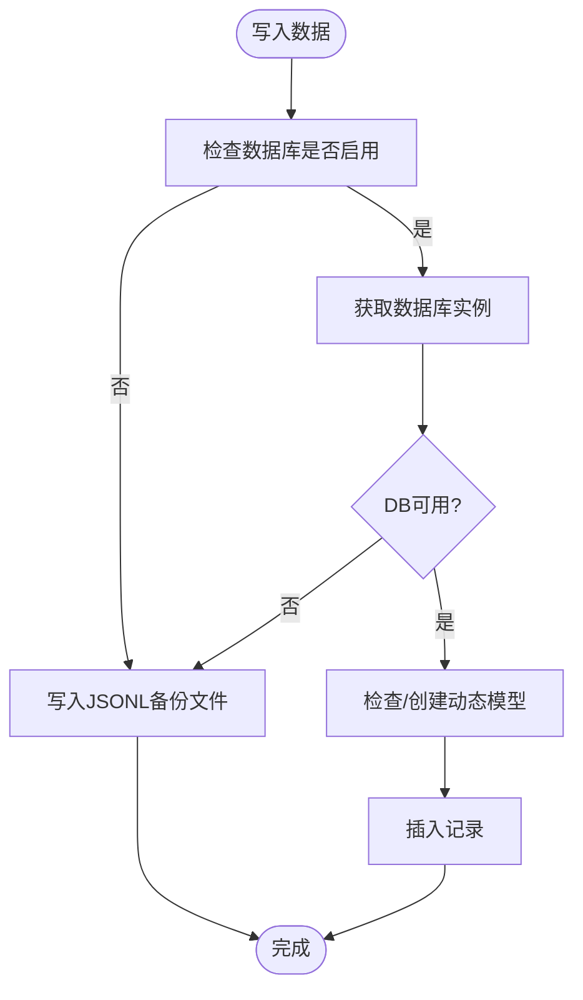
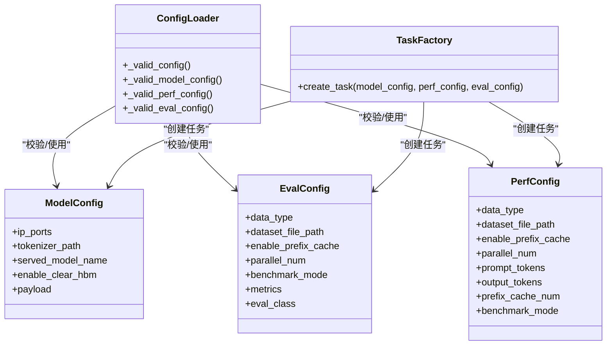
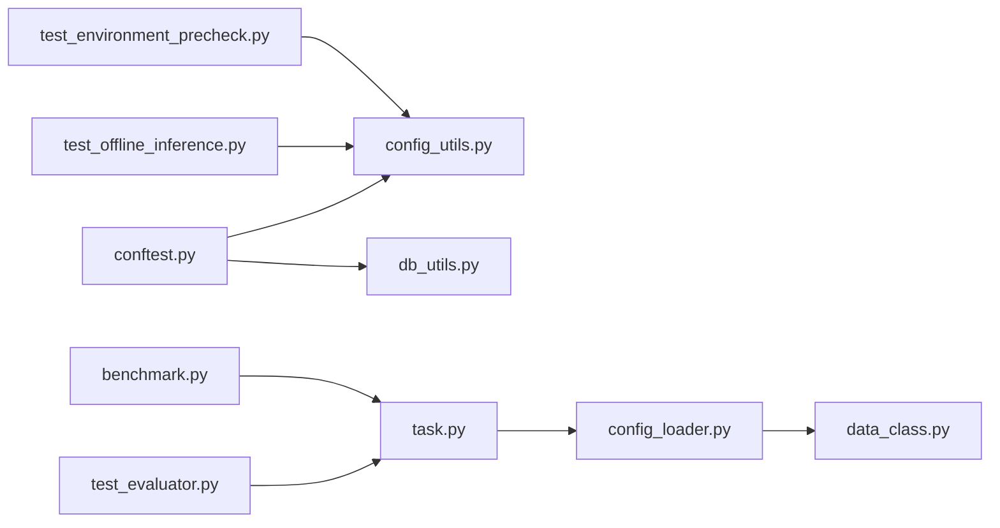

# 测试配置管理

<cite>
**本文引用的文件**
- [pytest.ini](file://test/pytest.ini)
- [conftest.py](file://test/conftest.py)
- [config.yaml](file://test/config.yaml)
- [requirements.txt](file://test/requirements.txt)
- [config_utils.py](file://test/common/config_utils.py)
- [db_utils.py](file://test/common/db_utils.py)
- [ucm_config_example.yaml](file://examples\ucm_config_example.yaml)
- [test_environment_precheck.py](file://test\suites\E2E\test_environment_precheck.py)
- [test_evaluator.py](file://test\suites\E2E\test_evaluator.py)
- [test_offline_inference.py](file://test\suites\E2E\test_offline_inference.py)
- [config_loader.py](file://test\common\uc_eval\utils\config_loader.py)
- [data_class.py](file://test\common\uc_eval\utils\data_class.py)
- [benchmark.py](file://test\common\uc_eval\utils\benchmark.py)
- [task.py](file://test\common\uc_eval\task.py)
- [pyproject.toml](file://pyproject.toml)
</cite>

## 目录
1. [简介](#简介)
2. [项目结构](#项目结构)
3. [核心组件](#核心组件)
4. [架构总览](#架构总览)
5. [详细组件分析](#详细组件分析)
6. [依赖关系分析](#依赖关系分析)
7. [性能考量](#性能考量)
8. [故障排查指南](#故障排查指南)
9. [结论](#结论)
10. [附录](#附录)

## 简介
本指南面向UCM（统一缓存管理）项目的测试配置管理，围绕pytest配置、YAML配置、配置工具类、数据库与报告、测试依赖与安装、以及最佳实践与安全注意事项展开。文档同时覆盖uc_eval评测框架的配置与参数校验流程，并提供常见问题排查方案。

## 项目结构
测试相关的核心位置集中在 test 目录，包含：
- pytest配置与钩子：pytest.ini、conftest.py
- 测试通用配置：config.yaml
- 配置工具与数据库：config_utils.py、db_utils.py
- 示例UCM配置：examples\ucm_config_example.yaml
- E2E测试套件：test\suites\E2E 下的若干测试文件
- uc_eval评测框架：test\common\uc_eval 下的配置、数据类、基准与任务实现

图表来源
- [pytest.ini](file://test/pytest.ini#L1-L25)
- [conftest.py](file://test/conftest.py#L1-L214)
- [config.yaml](file://test/config.yaml#L1-L48)
- [requirements.txt](file://test/requirements.txt#L1-L18)
- [config_utils.py](file://test/common/config_utils.py#L1-L87)
- [db_utils.py](file://test/common/db_utils.py#L1-L283)
- [ucm_config_example.yaml](file://examples\ucm_config_example.yaml#L1-L39)
- [test_environment_precheck.py](file://test\suites\E2E\test_environment_precheck.py#L1-L267)
- [test_evaluator.py](file://test\suites\E2E\test_evaluator.py#L1-L36)
- [test_offline_inference.py](file://test\suites\E2E\test_offline_inference.py#L1-L229)
- [config_loader.py](file://test\common\uc_eval\utils\config_loader.py#L1-L202)
- [data_class.py](file://test\common\uc_eval\utils\data_class.py#L1-L168)
- [benchmark.py](file://test\common\uc_eval\utils\benchmark.py#L1-L277)
- [task.py](file://test\common\uc_eval\task.py#L1-L410)

章节来源
- [pytest.ini](file://test/pytest.ini#L1-L25)
- [conftest.py](file://test/conftest.py#L1-L214)
- [config.yaml](file://test/config.yaml#L1-L48)
- [requirements.txt](file://test/requirements.txt#L1-L18)

## 核心组件
- pytest配置与运行参数
  - 测试路径、文件/类/函数命名规则、默认运行参数、日志、警告过滤、自定义标记
- 配置工具类
  - 单例模式的YAML配置加载器，支持懒加载、嵌套键访问、热重载
- 数据库与报告
  - 基于Peewee的PostgreSQL连接与动态表写入，失败时回退到JSONL文件备份
  - HTML报告开关与输出路径由配置驱动
- uc_eval评测框架
  - 模型/评测/性能配置的数据类与校验逻辑，任务工厂与多种评测基准
- 示例UCM配置
  - 存储后端、稀疏注意力等参数示例

章节来源
- [pytest.ini](file://test/pytest.ini#L1-L25)
- [conftest.py](file://test/conftest.py#L22-L214)
- [config_utils.py](file://test/common/config_utils.py#L1-L87)
- [db_utils.py](file://test/common/db_utils.py#L1-L283)
- [config_loader.py](file://test\common\uc_eval\utils\config_loader.py#L1-L202)
- [data_class.py](file://test\common\uc_eval\utils\data_class.py#L1-L168)
- [benchmark.py](file://test\common\uc_eval\utils\benchmark.py#L1-L277)
- [task.py](file://test\common\uc_eval\task.py#L1-L410)
- [ucm_config_example.yaml](file://examples\ucm_config_example.yaml#L1-L39)

## 架构总览
下图展示测试运行从pytest到配置、数据库与uc_eval评测的整体流程：

图表来源
- [conftest.py](file://test/conftest.py#L114-L144)
- [config_utils.py](file://test/common/config_utils.py#L61-L77)
- [db_utils.py](file://test/common/db_utils.py#L136-L208)
- [test_evaluator.py](file://test\suites\E2E\test_evaluator.py#L25-L36)
- [task.py](file://test\common\uc_eval\task.py#L122-L129)

## 详细组件分析

### pytest配置与自定义选项
- 测试发现规则
  - testpaths、python_files、python_classes、python_functions控制测试文件/类/函数匹配
- 插件与运行参数
  - addopts默认开启详细输出与非捕获日志
  - log_cli、log_cli_level、log_cli_format控制日志输出
  - filterwarnings抑制特定告警
- 自定义标记
  - stage、feature、platform、gpu_mem等用于筛选与资源分配
- CLI选项
  - --stage、--feature、--platform用于按标记过滤
- 报告与数据库集成
  - 通过钩子准备报告目录、启用HTML报告、生成构建ID并写入数据库

章节来源
- [pytest.ini](file://test/pytest.ini#L1-L25)
- [conftest.py](file://test/conftest.py#L22-L144)

### 配置工具类（ConfigUtils）
- 单例与线程安全
  - 双重检查锁定确保线程安全的单例初始化
- 懒加载与热重载
  - read_config惰性加载；reload_config强制重新读取
- 键访问
  - get_config获取顶层键；get_nested_config支持“a.b.c”形式的嵌套访问
- 默认值与容错
  - 文件不存在或YAML解析错误时返回空字典并打印警告

图表来源
- [config_utils.py](file://test/common/config_utils.py#L8-L87)

章节来源
- [config_utils.py](file://test/common/config_utils.py#L1-L87)

### 数据库与报告（db_utils）
- 动态数据库实例
  - 仅在启用时导入peewee，延迟创建PostgreSQL实例
- 表结构与字段
  - 动态模型：id、created_at、test_build_id为主键/时间戳/构建ID；其余字段TextField扩展
- 失败回退
  - DB不可用或异常时写入JSONL文件至备份目录
- 连接生命周期
  - database_connection设置构建ID并尝试连接，结束后关闭

图表来源
- [db_utils.py](file://test/common/db_utils.py#L136-L208)

章节来源
- [db_utils.py](file://test/common/db_utils.py#L1-L283)

### YAML配置文件结构与参数
- 报告配置（reports）
  - base_dir、use_timestamp、directory_prefix、html.enabled/filename/title
- 数据库配置（database）
  - backup、enabled、host、port、name、user、password
- 模型配置（models）
  - ip_ports、tokenizer_path、served_model_name、payload、enable_clear_hbm
- LLM连接配置（llm_connection）
  - model、server_url、tokenizer_path、stream、ignore_eos、timeout、extra_info
- 环境预检配置（Env_preCheck）
  - master_ip、worker_ip、ascend_rt_visible_devices、node_num、model_path、hf_model_name、middle_page、expected_embed_bandwidth、expected_fetch_bandwidth、kvCache_block_number、storage_backends
- 示例UCM配置（ucm_config_example.yaml）
  - ucm_connectors、metrics_config_path、ucm_sparse_config、use_layerwise等

章节来源
- [config.yaml](file://test/config.yaml#L1-L48)
- [ucm_config_example.yaml](file://examples\ucm_config_example.yaml#L1-L39)

### uc_eval评测框架配置与参数解析
- 数据类与枚举
  - ModelConfig、EvalConfig、PerfConfig、DatasetType、BenchmarkModeType
- 配置校验
  - 互斥性与必填项校验、payload JSON格式校验、字段非空校验
  - 性能/评测配置的数据类型与字段一致性校验
- 任务工厂
  - 根据数据类型与评测模式选择数据集、客户端与基准实现
- 评测基准
  - EvaluatorBenchmark：指标计算
  - PerformanceBenchmark：稳定/默认性能统计（TTFT/TBT/吞吐等）

图表来源
- [data_class.py](file://test\common\uc_eval\utils\data_class.py#L26-L56)
- [config_loader.py](file://test\common\uc_eval\utils\config_loader.py#L29-L158)
- [benchmark.py](file://test\common\uc_eval\utils\benchmark.py#L32-L112)
- [task.py](file://test\common\uc_eval\task.py#L94-L121)

章节来源
- [data_class.py](file://test\common\uc_eval\utils\data_class.py#L1-L168)
- [config_loader.py](file://test\common\uc_eval\utils\config_loader.py#L1-L202)
- [benchmark.py](file://test\common\uc_eval\utils\benchmark.py#L1-L277)
- [task.py](file://test\common\uc_eval\task.py#L1-L410)

### 测试用例与环境检测
- 环境预检测试
  - SSH登录、设备状态、Ping连通性、TLS、模型权重、带宽检查
  - 通过标记(stage/platform/feature)与config.yaml中的Env_preCheck参数联动
- 评测测试
  - 使用export_vars装饰器导出变量，结合config.yaml中的reports.base_dir保存结果
- 离线推理测试
  - 通过gpu_mem标记自动选择GPU并注入环境变量，确保显存满足要求

章节来源
- [test_environment_precheck.py](file://test\suites\E2E\test_environment_precheck.py#L1-L267)
- [test_evaluator.py](file://test\suites\E2E\test_evaluator.py#L1-L36)
- [test_offline_inference.py](file://test\suites\E2E\test_offline_inference.py#L1-L229)
- [conftest.py](file://test/conftest.py#L189-L206)

### 测试依赖与安装
- 测试框架与插件
  - pytest、pytest-html、pytest-cov
- 设备与数据库
  - nvidia-ml-py、peewee、psycopg2-binary
- LLM评测生态
  - requests、pandas、pydantic、transformers、httpx
- uc_eval额外依赖
  - jieba、openpyxl
- 项目元信息
  - pyproject.toml声明最低Python版本与项目URL

章节来源
- [requirements.txt](file://test/requirements.txt#L1-L18)
- [pyproject.toml](file://pyproject.toml#L1-L22)

## 依赖关系分析
- 组件耦合
  - conftest依赖config_utils与db_utils以提供报告与数据库能力
  - uc_eval任务依赖config_utils读取模型与评测配置
  - 测试用例通过标记与夹具与配置联动
- 外部依赖
  - PostgreSQL（可选）、nvidia-ml-py（GPU资源探测）、ucm存储后端（示例中NFS/Pipeline等）
- 循环依赖
  - 未见直接循环；db_utils延迟导入peewee避免全局耦合

图表来源
- [conftest.py](file://test/conftest.py#L114-L144)
- [config_utils.py](file://test/common/config_utils.py#L61-L77)
- [db_utils.py](file://test/common/db_utils.py#L136-L208)
- [test_evaluator.py](file://test\suites\E2E\test_evaluator.py#L25-L36)
- [task.py](file://test\common\uc_eval\task.py#L118-L121)
- [config_loader.py](file://test\common\uc_eval\utils\config_loader.py#L29-L59)
- [data_class.py](file://test\common\uc_eval\utils\data_class.py#L26-L56)
- [benchmark.py](file://test\common\uc_eval\utils\benchmark.py#L32-L112)
- [test_offline_inference.py](file://test\suites\E2E\test_offline_inference.py#L49-L51)
- [test_environment_precheck.py](file://test\suites\E2E\test_environment_precheck.py#L250-L267)

章节来源
- [conftest.py](file://test/conftest.py#L1-L214)
- [config_loader.py](file://test\common\uc_eval\utils\config_loader.py#L1-L202)
- [task.py](file://test\common\uc_eval\task.py#L1-L410)

## 性能考量
- 稳定性能模式
  - 通过稳定的并发窗口与请求ID筛选，减少波动影响
- 吞吐与延迟统计
  - 支持E2E吞吐、每请求吞吐、TTFT/TBT分位数与最大值
- 资源预留与GPU选择
  - GPU内存预留30%缓冲，随机选择设备以降低冲突
- 结果持久化
  - 成功写入数据库，失败回退到JSONL文件，保证不丢失

章节来源
- [benchmark.py](file://test\common\uc_eval\utils\benchmark.py#L204-L277)
- [conftest.py](file://test/conftest.py#L166-L206)
- [db_utils.py](file://test/common/db_utils.py#L136-L208)

## 故障排查指南
- pytest配置问题
  - 测试未发现：确认testpaths与文件命名规则一致
  - 日志级别/格式异常：检查log_cli_*配置
  - 标记过滤无效：确认--stage/--feature/--platform传参正确
- 配置文件问题
  - YAML解析失败：检查缩进与字符编码，关注加载器的错误提示
  - 配置缺失：使用get_nested_config提供默认值兜底
- 数据库问题
  - 连接失败：核对database.enabled与主机/端口/凭据
  - 写入失败：检查backup目录权限与磁盘空间
- uc_eval配置问题
  - 互斥配置冲突：perf_config与eval_config只能有一个为非空
  - 字段为空：确保ModelConfig关键字段非空
  - 数据类型不匹配：Synthetic数据需提供非空列表，其他数据需提供文件路径与整型并发数
- 环境与资源
  - 显存不足：提高gpu_mem标记或减少并发
  - 设备状态异常：参考环境预检测试输出定位问题

章节来源
- [pytest.ini](file://test/pytest.ini#L1-L25)
- [config_utils.py](file://test/common/config_utils.py#L42-L49)
- [db_utils.py](file://test/common/db_utils.py#L82-L96)
- [config_loader.py](file://test\common\uc_eval\utils\config_loader.py#L42-L59)
- [test_environment_precheck.py](file://test\suites\E2E\test_environment_precheck.py#L1-L267)
- [conftest.py](file://test/conftest.py#L166-L206)

## 结论
本指南系统梳理了UCM测试配置的各个层面：pytest配置、YAML参数、配置工具类、数据库与报告、uc_eval评测框架、示例UCM配置及测试依赖。通过标记与夹具实现灵活的测试筛选与资源管理，借助动态配置与数据库写入保障结果可追溯与可恢复。建议在实际使用中遵循最佳实践与安全注意事项，确保配置正确、依赖完整、结果可靠。

## 附录
- 安装与运行
  - 安装测试依赖：pip install -r test/requirements.txt
  - 运行pytest：pytest --stage=2 --feature=eval_test
- 配置最佳实践
  - 将敏感信息放入环境变量并在YAML中引用
  - 使用use_timestamp与directory_prefix组织报告目录
  - 在CI中启用数据库并配置备份目录
- 安全注意事项
  - 不要在YAML中硬编码数据库密码，优先使用环境变量或密钥管理
  - 限制数据库用户权限，仅授予必要操作权限
  - 对外共享报告前清理敏感字段