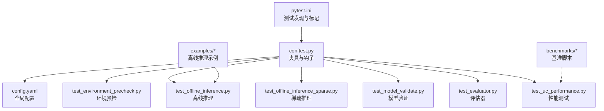
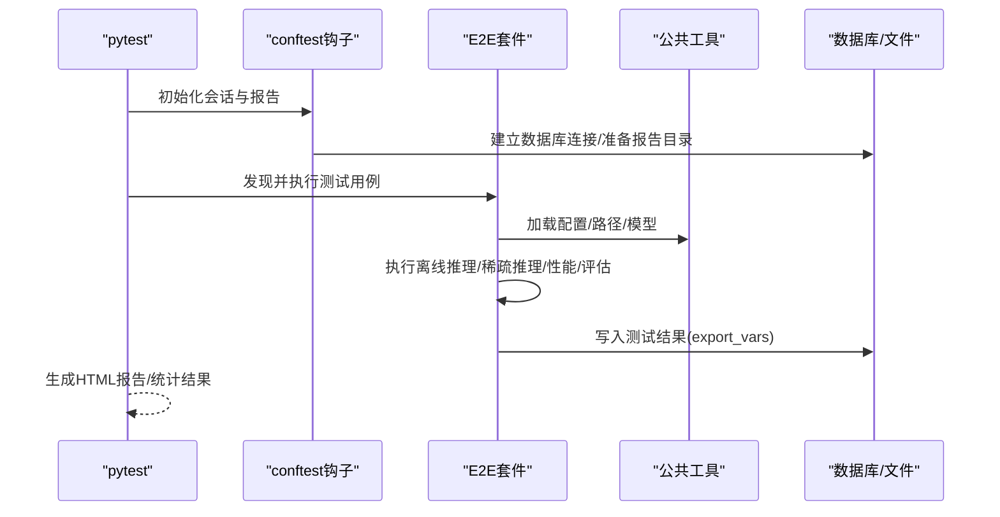
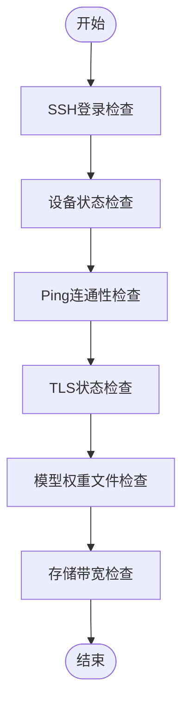
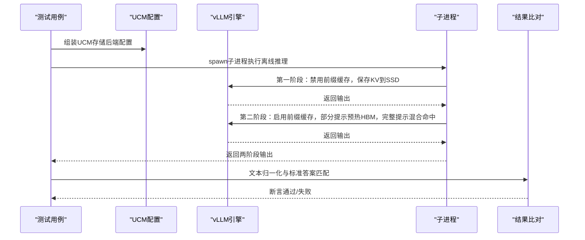
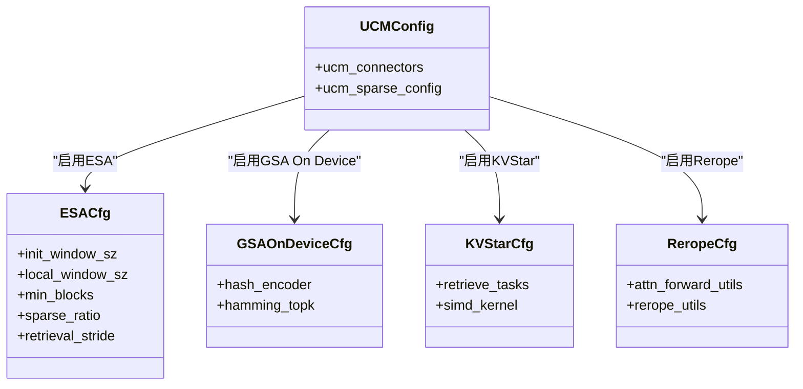
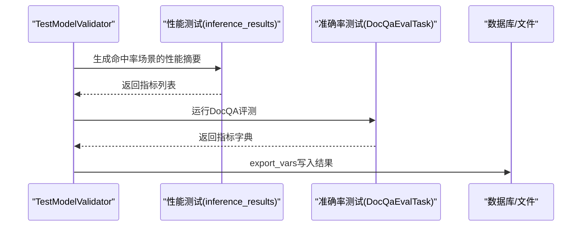
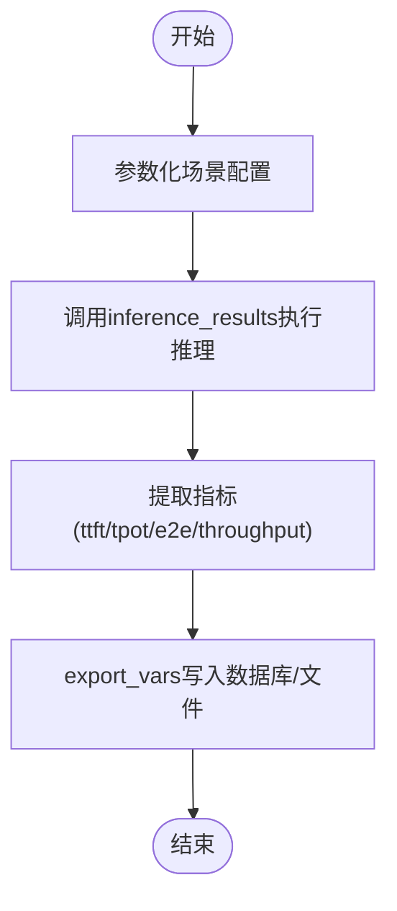
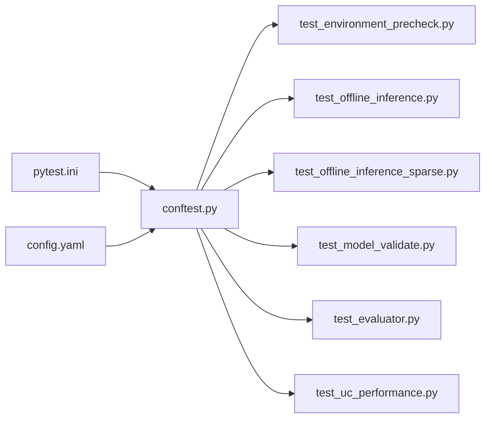

# 集成测试

<cite>
**本文引用的文件**
- [test/README.md](file://test/README.md)
- [test/README_zh.md](file://test/README_zh.md)
- [test/config.yaml](file://test/config.yaml)
- [test/conftest.py](file://test/conftest.py)
- [test/pytest.ini](file://test/pytest.ini)
- [test/suites/E2E/test_environment_precheck.py](file://test/suites/E2E/test_environment_precheck.py)
- [test/suites/E2E/test_offline_inference.py](file://test/suites/E2E/test_offline_inference.py)
- [test/suites/E2E/test_offline_inference_sparse.py](file://test/suites/E2E/test_offline_inference_sparse.py)
- [test/suites/E2E/test_model_validate.py](file://test/suites/E2E/test_model_validate.py)
- [test/suites/E2E/test_evaluator.py](file://test/suites/E2E/test_evaluator.py)
- [test/suites/E2E/test_uc_performance.py](file://test/suites/E2E/test_uc_performance.py)
- [benchmarks/logging_perf_test.py](file://benchmarks/logging_perf_test.py)
- [benchmarks/trace_replay.py](file://benchmarks/trace_replay.py)
- [examples/offline_inference.py](file://examples/offline_inference.py)
- [examples/offline_inference_esa.py](file://examples/offline_inference_esa.py)
</cite>

## 目录
1. [引言](#引言)
2. [项目结构](#项目结构)
3. [核心组件](#核心组件)
4. [架构总览](#架构总览)
5. [详细组件分析](#详细组件分析)
6. [依赖关系分析](#依赖关系分析)
7. [性能考量](#性能考量)
8. [故障排查指南](#故障排查指南)
9. [结论](#结论)
10. [附录](#附录)

## 引言
本指南面向UCM（Unified Cache Management）的集成测试，系统性阐述端到端测试架构与执行流程，覆盖离线推理测试、环境预检查测试、模型验证测试与评估器测试。同时，针对稀疏注意力算法（ESA、GSA、GSA On Device、KVStar、Rerope）提供可落地的集成测试策略建议，并给出性能基准测试方法、测试数据准备与验证流程、测试环境搭建与配置要点，以及测试结果收集与报告生成机制。

## 项目结构
测试框架基于pytest，采用“共享配置 + 套件分层”的组织方式：
- 共享层：通用配置、数据库、报告、夹具与工具（conftest、config、pytest.ini）
- 套件层：按E2E维度划分的测试套件（环境预检、离线推理、模型验证、评估器、性能）
- 示例与基准：examples提供离线推理示例，benchmarks提供日志与轨迹回放基准脚本

图表来源
- [test/pytest.ini](file://test/pytest.ini#L1-L25)
- [test/conftest.py](file://test/conftest.py#L1-L214)
- [test/config.yaml](file://test/config.yaml#L1-L48)
- [test/suites/E2E/test_environment_precheck.py](file://test/suites/E2E/test_environment_precheck.py#L1-L267)
- [test/suites/E2E/test_offline_inference.py](file://test/suites/E2E/test_offline_inference.py#L1-L229)
- [test/suites/E2E/test_offline_inference_sparse.py](file://test/suites/E2E/test_offline_inference_sparse.py#L1-L430)
- [test/suites/E2E/test_model_validate.py](file://test/suites/E2E/test_model_validate.py#L1-L193)
- [test/suites/E2E/test_evaluator.py](file://test/suites/E2E/test_evaluator.py#L1-L36)
- [test/suites/E2E/test_uc_performance.py](file://test/suites/E2E/test_uc_performance.py#L1-L186)
- [examples/offline_inference.py](file://examples/offline_inference.py#L1-L112)
- [benchmarks/logging_perf_test.py](file://benchmarks/logging_perf_test.py#L1-L181)
- [benchmarks/trace_replay.py](file://benchmarks/trace_replay.py#L1-L748)

章节来源
- [test/README.md](file://test/README.md#L1-L236)
- [test/README_zh.md](file://test/README_zh.md#L1-L237)
- [test/pytest.ini](file://test/pytest.ini#L1-L25)
- [test/conftest.py](file://test/conftest.py#L1-L214)
- [test/config.yaml](file://test/config.yaml#L1-L48)

## 核心组件
- 配置与发现
  - pytest.ini定义测试路径、文件/类/函数命名规则与标记类型（stage、feature、platform、gpu_mem）
  - config.yaml集中存放报告、数据库、模型、LLM连接、环境预检等配置项
- 夹具与钩子
  - conftest.py注册报告目录、HTML报告开关、构建ID、数据库连接与写入、GPU资源分配夹具、模型配置夹具
- 测试套件
  - E2E套件覆盖环境预检、离线推理、稀疏推理、模型验证、评估器、性能测试
- 结果采集与持久化
  - export_vars装饰器自动采集测试结果并写入数据库或本地文件，支持标量、列表与投影数据

章节来源
- [test/pytest.ini](file://test/pytest.ini#L1-L25)
- [test/config.yaml](file://test/config.yaml#L1-L48)
- [test/conftest.py](file://test/conftest.py#L114-L214)
- [test/README.md](file://test/README.md#L165-L205)

## 架构总览
端到端测试从pytest启动，经由conftest的钩子完成环境初始化与报告设置，随后按标记过滤执行各套件测试。稀疏注意力测试通过UCM的稀疏配置注入到vLLM引擎，结合离线推理流程验证准确性与性能。

图表来源
- [test/conftest.py](file://test/conftest.py#L114-L164)
- [test/suites/E2E/test_offline_inference.py](file://test/suites/E2E/test_offline_inference.py#L1-L229)
- [test/suites/E2E/test_offline_inference_sparse.py](file://test/suites/E2E/test_offline_inference_sparse.py#L1-L430)
- [test/suites/E2E/test_uc_performance.py](file://test/suites/E2E/test_uc_performance.py#L1-L186)
- [test/suites/E2E/test_evaluator.py](file://test/suites/E2E/test_evaluator.py#L1-L36)

## 详细组件分析

### 环境预检查测试
- 目标：验证SSH登录、设备状态、网络连通性（HCCN/NVIDIA）、TLS、模型权重文件存在性与带宽阈值
- 关键点：
  - 平台标记区分Ascend与NVIDIA路径
  - 动态构造value_lists并断言最终汇总状态
  - 带宽检查基于配置中的期望阈值进行断言

图表来源
- [test/suites/E2E/test_environment_precheck.py](file://test/suites/E2E/test_environment_precheck.py#L24-L267)

章节来源
- [test/suites/E2E/test_environment_precheck.py](file://test/suites/E2E/test_environment_precheck.py#L1-L267)

### 离线推理测试（含混合命中）
- 目标：验证HBM + SSD混合缓存命中下的准确性一致性
- 关键点：
  - 分阶段执行：先禁用前缀缓存保存到SSD作为基线，再启用前缀缓存进行部分/完整提示的混合命中
  - 使用子进程隔离GPU内存，确保每次测试前释放显存
  - 文本归一化与标准答案匹配进行准确性校验

图表来源
- [test/suites/E2E/test_offline_inference.py](file://test/suites/E2E/test_offline_inference.py#L146-L184)

章节来源
- [test/suites/E2E/test_offline_inference.py](file://test/suites/E2E/test_offline_inference.py#L1-L229)

### 稀疏注意力算法集成测试策略
- ESA（Enhanced Sparse Attention）
  - 通过ucm_sparse_config注入ESA参数（窗口大小、最小块、稀疏比例、检索步长等）
  - 使用examples/offline_inference_esa.py演示如何在UCM中启用ESA并运行批量推理
  - 建议：对比禁用稀疏与启用稀疏的TTFT/TPOT/E2E延迟与吞吐，记录命中率变化
- GSA（Global Sparse Attention）
  - 在离线推理套件中预留GSA测试入口，建议设置较高GPU内存需求标记
  - 对比不同max_num_batched_tokens与enforce_eager组合下的稳定性与性能
- GSA On Device
  - 通过ucm_sparse_config启用GSA On Device，建议结合Hash编码与Hamming TopK进行检索验证
- KVStar
  - 通过ucm_sparse_config启用KVStar，建议关注检索任务队列与SIMD计算核的性能表现
- Rerope
  - 通过UCM与vLLM的Rerope适配补丁集成，建议在长序列场景下验证注意力前向与重排性能

图表来源
- [test/suites/E2E/test_offline_inference_sparse.py](file://test/suites/E2E/test_offline_inference_sparse.py#L392-L401)
- [examples/offline_inference_esa.py](file://examples/offline_inference_esa.py#L81-L89)

章节来源
- [test/suites/E2E/test_offline_inference_sparse.py](file://test/suites/E2E/test_offline_inference_sparse.py#L1-L430)
- [examples/offline_inference_esa.py](file://examples/offline_inference_esa.py#L1-L176)

### 模型验证测试（性能+准确率）
- 目标：在不同缓存命中率下评估性能指标（TTFT、TPOT、E2E），并对比准确率（F1-score）
- 关键点：
  - 性能测试：调用inference_results批量生成不同命中率场景的摘要
  - 准确率测试：使用DocQA评测任务，输出指标字典
  - 结果持久化：export_vars将结果写入数据库或本地文件，支持与基线（naive）对比

图表来源
- [test/suites/E2E/test_model_validate.py](file://test/suites/E2E/test_model_validate.py#L112-L163)

章节来源
- [test/suites/E2E/test_model_validate.py](file://test/suites/E2E/test_model_validate.py#L1-L193)

### 评估器测试
- 目标：对DocQA数据集进行评估，支持多种指标（accuracy、bootstrap-accuracy、f1-score）
- 关键点：
  - 参数化测试用例，便于扩展更多数据集与指标
  - export_vars将评估结果写入数据库，便于横向对比

章节来源
- [test/suites/E2E/test_evaluator.py](file://test/suites/E2E/test_evaluator.py#L1-L36)

### 性能测试（基准与场景）
- 目标：系统化评估不同并发、输入/输出长度、命中率下的端到端性能
- 关键点：
  - 参数化场景（mean_in、mean_out、max_req、concurrent、sampling、hit_rate）
  - 提取并导出关键指标（ttft、tpot、e2e、throughput、百分位）
  - 支持同步与多轮对话等不同任务形态

图表来源
- [test/suites/E2E/test_uc_performance.py](file://test/suites/E2E/test_uc_performance.py#L34-L91)

章节来源
- [test/suites/E2E/test_uc_performance.py](file://test/suites/E2E/test_uc_performance.py#L1-L186)

## 依赖关系分析
- 测试发现与标记
  - pytest.ini定义测试路径与标记类型，conftest.py按标记过滤用例
- 配置与夹具
  - config.yaml集中配置；conftest.py提供数据库连接、报告目录、GPU资源分配、模型配置夹具
- 测试套件耦合
  - E2E套件依赖公共工具（路径、模型、采样参数、子进程执行）
- 结果持久化
  - export_vars装饰器统一采集与落盘/入库

图表来源
- [test/pytest.ini](file://test/pytest.ini#L1-L25)
- [test/conftest.py](file://test/conftest.py#L1-L214)
- [test/config.yaml](file://test/config.yaml#L1-L48)
- [test/suites/E2E/test_environment_precheck.py](file://test/suites/E2E/test_environment_precheck.py#L1-L267)
- [test/suites/E2E/test_offline_inference.py](file://test/suites/E2E/test_offline_inference.py#L1-L229)
- [test/suites/E2E/test_offline_inference_sparse.py](file://test/suites/E2E/test_offline_inference_sparse.py#L1-L430)
- [test/suites/E2E/test_model_validate.py](file://test/suites/E2E/test_model_validate.py#L1-L193)
- [test/suites/E2E/test_evaluator.py](file://test/suites/E2E/test_evaluator.py#L1-L36)
- [test/suites/E2E/test_uc_performance.py](file://test/suites/E2E/test_uc_performance.py#L1-L186)

章节来源
- [test/pytest.ini](file://test/pytest.ini#L1-L25)
- [test/conftest.py](file://test/conftest.py#L36-L68)

## 性能考量
- 日志性能基准
  - benchmarks/logging_perf_test.py对比Python logging与pybind11 spdlog_logger的开销，支持多线程与多次迭代
- 请求轨迹回放
  - benchmarks/trace_replay.py支持按时间戳回放请求轨迹，计算TTFT/TPOT/ITL/E2E等指标并导出Excel
- 建议
  - 在CI中固定warmup迭代，避免首次调用抖动
  - 使用多轮迭代取均值/方差，关注P50/P90/P99分位
  - 将结果写入数据库便于趋势分析

章节来源
- [benchmarks/logging_perf_test.py](file://benchmarks/logging_perf_test.py#L117-L140)
- [benchmarks/trace_replay.py](file://benchmarks/trace_replay.py#L604-L681)

## 故障排查指南
- 环境预检查失败
  - 检查SSH登录、设备状态、网络连通性与TLS开关；确认配置文件中的期望带宽阈值合理
- GPU资源不足
  - 使用gpu_mem标记声明显存需求，conftest自动选择空闲GPU并设置CUDA_VISIBLE_DEVICES
- 子进程OOM或推理异常
  - 确保离线推理测试使用独立子进程，避免显存泄漏；检查max_num_batched_tokens与模型最大上下文
- 结果未入库
  - 检查config.yaml中database.enabled与备份目录权限；确认export_vars装饰器正确返回字典结构

章节来源
- [test/suites/E2E/test_environment_precheck.py](file://test/suites/E2E/test_environment_precheck.py#L24-L267)
- [test/conftest.py](file://test/conftest.py#L166-L206)
- [test/README.md](file://test/README.md#L165-L205)

## 结论
本测试框架以pytest为核心，结合集中式配置、数据库持久化与HTML报告，形成覆盖环境预检、离线推理、稀疏注意力、模型验证与性能评估的全链路集成测试体系。通过参数化场景与export_vars统一采集，能够稳定地评估UCM在不同硬件与算法配置下的行为与性能，并为回归与发布提供可靠依据。

## 附录

### 测试环境搭建与配置
- Python版本与依赖
  - Python 3.11+；安装requirements.txt
- 数据库（可选）
  - 在config.yaml中启用database并配置主机、端口、库名、用户与密码
- 报告与HTML
  - 在config.yaml中配置reports.base_dir与use_timestamp；pytest.ini控制报告生成开关
- LLM连接与模型
  - 在config.yaml中配置llm_connection.server_url、tokenizer_path、extra_info等

章节来源
- [test/README.md](file://test/README.md#L42-L82)
- [test/config.yaml](file://test/config.yaml#L10-L48)
- [test/pytest.ini](file://test/pytest.ini#L1-L25)

### 测试数据准备与验证
- 离线推理提示
  - 使用prompts/test_offline_inference.json加载长文本提示，支持按token比例拆分
- DocQA评测数据
  - 使用common/uc_eval/datasets/doc_qa/demo.jsonl或multifieldqa_zh.jsonl
- 验证方法
  - 文本归一化与标准答案精确匹配；稀疏算法通过指标对比与可视化结果交叉验证

章节来源
- [test/suites/E2E/test_offline_inference.py](file://test/suites/E2E/test_offline_inference.py#L75-L84)
- [test/suites/E2E/test_model_validate.py](file://test/suites/E2E/test_model_validate.py#L15-L20)

### 测试结果收集与报告生成
- 自动采集
  - 使用@export_vars装饰器，返回包含_name/_data/_proj的字典
- 数据库/文件落盘
  - 若database.enabled为true则入库，否则保存到reports目录
- 报告
  - HTML报告路径由conftest生成并打印；支持按时间戳与标记组合命名

章节来源
- [test/README.md](file://test/README.md#L165-L205)
- [test/conftest.py](file://test/conftest.py#L72-L98)
- [test/conftest.py](file://test/conftest.py#L114-L144)