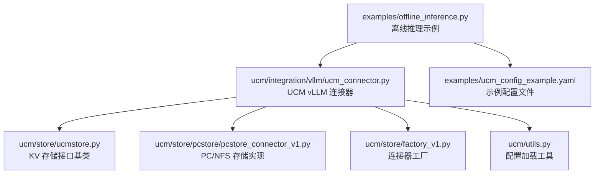
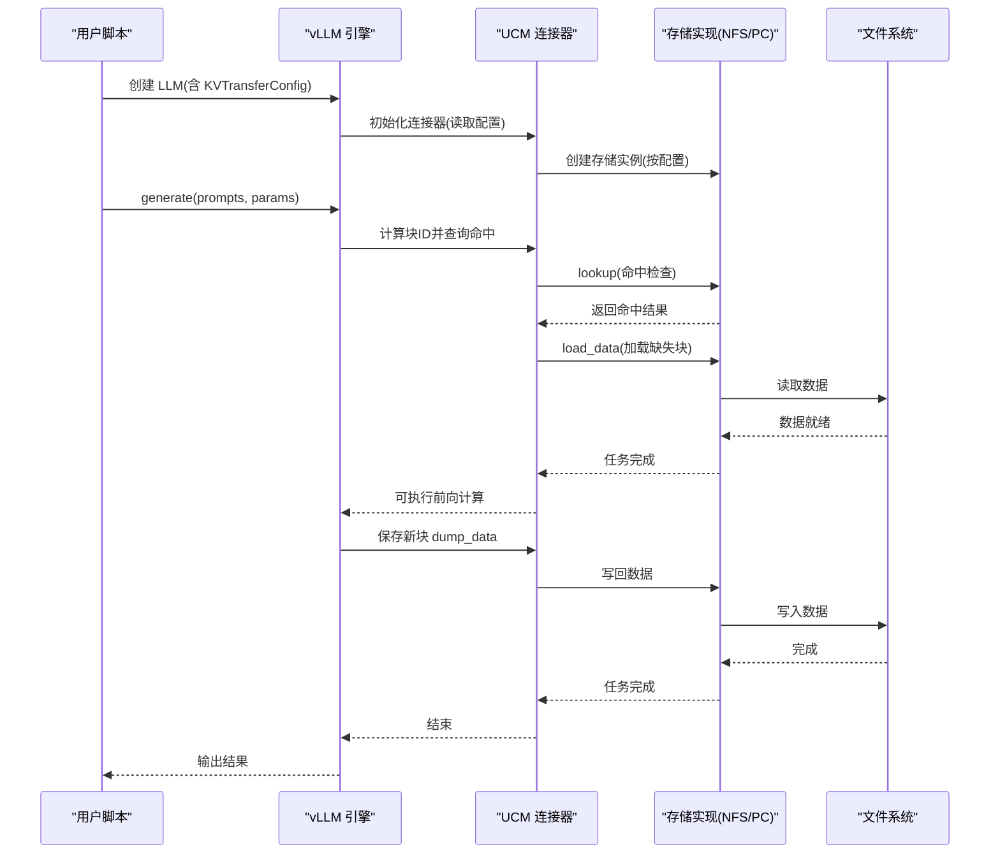
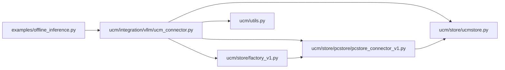
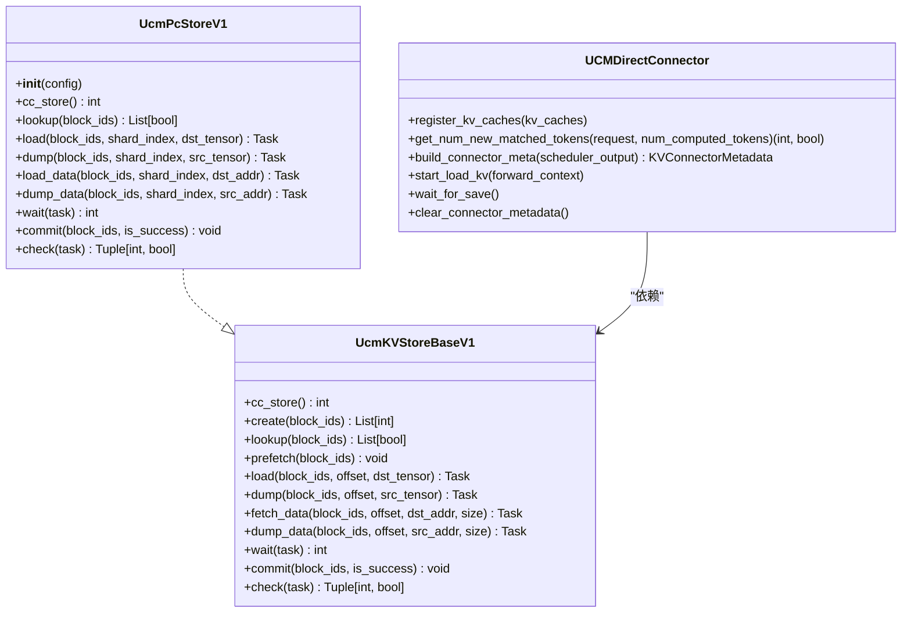

# 基础使用示例

<cite>
**本文引用的文件**
- [offline_inference.py](file://examples/offline_inference.py)
- [ucm_config_example.yaml](file://examples/ucm_config_example.yaml)
- [ucm_connector.py](file://ucm/integration/vllm/ucm_connector.py)
- [ucmstore.py](file://ucm/store/ucmstore.py)
- [utils.py](file://ucm/utils.py)
- [pcstore_connector_v1.py](file://ucm/store/pcstore/pcstore_connector_v1.py)
- [factory_v1.py](file://ucm/store/factory_v1.py)
- [README.md](file://README.md)
</cite>

## 目录
1. [简介](#简介)
2. [项目结构](#项目结构)
3. [核心组件](#核心组件)
4. [架构总览](#架构总览)
5. [详细组件分析](#详细组件分析)
6. [依赖关系分析](#依赖关系分析)
7. [性能注意事项](#性能注意事项)
8. [故障排除指南](#故障排除指南)
9. [结论](#结论)
10. [附录：完整示例与参数说明](#附录完整示例与参数说明)

## 简介
本示例面向初学者，指导你如何使用 UCM（Unified Cache Management）在离线推理场景中进行 KV 缓存的持久化与重用，从而降低显存占用、提升长上下文推理性能。你将学会：
- 初始化 UCM 连接器
- 配置存储后端参数
- 执行一次完整的推理流程
- 解释关键参数与默认行为
- 常见问题排查与错误处理

## 项目结构
UCM 的离线推理示例位于 examples 目录，核心集成代码位于 ucm/integration/vllm，存储后端接口定义在 ucm/store，配置解析在 ucm/utils 中。

图表来源
- [offline_inference.py](file://examples/offline_inference.py#L1-L112)
- [ucm_connector.py](file://ucm/integration/vllm/ucm_connector.py#L1-L200)
- [ucmstore.py](file://ucm/store/ucmstore.py#L39-L205)
- [pcstore_connector_v1.py](file://ucm/store/pcstore/pcstore_connector_v1.py#L40-L100)
- [factory_v1.py](file://ucm/store/factory_v1.py#L34-L66)
- [utils.py](file://ucm/utils.py#L34-L90)

章节来源
- [offline_inference.py](file://examples/offline_inference.py#L1-L112)
- [README.md](file://README.md#L69-L72)

## 核心组件
- 示例脚本：负责构建 vLLM 引擎并注入 UCM 连接器，执行生成任务。
- UCM vLLM 连接器：负责将 vLLM 的 KV 块映射为 UCM 块 ID，并在需要时从外部存储加载或写回。
- 存储接口基类：定义统一的 KV 存取与传输接口。
- 存储实现（以 PC/NFS 为例）：具体对接本地文件系统或网络文件系统。
- 工厂：根据配置动态创建对应存储连接器。
- 配置工具：支持从 YAML 文件或直接传入的 kv_connector_extra_config 加载配置。

章节来源
- [ucm_connector.py](file://ucm/integration/vllm/ucm_connector.py#L82-L220)
- [ucmstore.py](file://ucm/store/ucmstore.py#L39-L205)
- [pcstore_connector_v1.py](file://ucm/store/pcstore/pcstore_connector_v1.py#L40-L100)
- [factory_v1.py](file://ucm/store/factory_v1.py#L34-L66)
- [utils.py](file://ucm/utils.py#L34-L90)

## 架构总览
下面的序列图展示了从初始化到推理结束的关键调用链路。

图表来源
- [offline_inference.py](file://examples/offline_inference.py#L18-L44)
- [ucm_connector.py](file://ucm/integration/vllm/ucm_connector.py#L125-L220)
- [pcstore_connector_v1.py](file://ucm/store/pcstore/pcstore_connector_v1.py#L78-L102)
- [utils.py](file://ucm/utils.py#L63-L90)

## 详细组件分析

### 组件一：示例脚本与引擎初始化
- 脚本通过 KVTransferConfig 注入 UCM 连接器模块路径与名称，并设置额外配置（如 UCM_CONFIG_FILE）。
- 使用 EngineArgs 配置模型、内存利用率、块大小等参数。
- 在上下文中创建 LLM 实例，随后执行多次生成以演示重复利用 KV 缓存的效果。

章节来源
- [offline_inference.py](file://examples/offline_inference.py#L18-L44)
- [offline_inference.py](file://examples/offline_inference.py#L62-L108)

### 组件二：UCM vLLM 连接器（UCMDirectConnector）
- 负责：
  - 将 vLLM 请求转换为 UCM 块 ID（基于哈希）
  - 查询外部存储命中情况
  - 按需加载缺失块到设备
  - 在生成阶段将新增块写回存储
- 关键点：
  - 支持直连模式（load -> forward -> save）与分层模式（逐层 overlap）
  - 自动推断设备类型（CUDA/NPU），并同步流
  - 通过 Config 工具读取配置，支持 YAML 或直接传参

章节来源
- [ucm_connector.py](file://ucm/integration/vllm/ucm_connector.py#L82-L220)
- [ucm_connector.py](file://ucm/integration/vllm/ucm_connector.py#L280-L292)
- [ucm_connector.py](file://ucm/integration/vllm/ucm_connector.py#L488-L562)
- [ucm_connector.py](file://ucm/integration/vllm/ucm_connector.py#L566-L644)

### 组件三：存储接口基类（UcmKVStoreBaseV1）
- 定义统一的 KV 存储接口：
  - lookup/prefetch/load/dump/load_data/dump_data/wait/commit/check
- 提供抽象方法，确保不同存储后端的一致性。

章节来源
- [ucmstore.py](file://ucm/store/ucmstore.py#L39-L205)

### 组件四：存储实现（PC/NFS，UcmPcStoreV1）
- 以 PC/NFS 为例，实现具体的存储逻辑：
  - 初始化时读取配置项（如 storage_backends、block_size、device_id 等）
  - 将配置项映射到底层参数对象并调用 Setup
  - 提供 lookup/load/dump/load_data/dump_data 等操作
- 关键参数映射（部分）：
  - unique_id -> uniqueId
  - io_direct -> transferIoDirect
  - local_rank_size -> transferLocalRankSize
  - device_id -> transferDeviceId
  - stream_number -> transferStreamNumber
  - tensor_size -> transferIoSize
  - buffer_number -> transferBufferNumber
  - timeout_ms -> transferTimeoutMs
  - use_scatter_gather -> transferScatterGatherEnable
  - shard_data_dir -> shardDataDir

章节来源
- [pcstore_connector_v1.py](file://ucm/store/pcstore/pcstore_connector_v1.py#L40-L68)
- [pcstore_connector_v1.py](file://ucm/store/pcstore/pcstore_connector_v1.py#L48-L63)
- [pcstore_connector_v1.py](file://ucm/store/pcstore/pcstore_connector_v1.py#L78-L102)
- [pcstore_connector_v1.py](file://ucm/store/pcstore/pcstore_connector_v1.py#L131-L171)
- [pcstore_connector_v1.py](file://ucm/store/pcstore/pcstore_connector_v1.py#L173-L198)

### 组件五：连接器工厂（UcmConnectorFactoryV1）
- 动态注册并创建存储连接器：
  - 默认注册：UcmNfsStore -> UcmPcStoreV1
  - 可扩展：UcmPipelineStore
- 通过名称查找并实例化对应存储类。

章节来源
- [factory_v1.py](file://ucm/store/factory_v1.py#L34-L66)

### 组件六：配置加载工具（Config）
- 支持三种配置来源：
  - 未提供额外配置：使用默认配置（ucm_connector_name: UcmNfsStore）
  - 提供 UCM_CONFIG_FILE：从 YAML 文件加载
  - 直接传入 kv_connector_extra_config：原样使用（字典）
- 提供 get_config 获取最终配置字典。

章节来源
- [utils.py](file://ucm/utils.py#L63-L90)

## 依赖关系分析

图表来源
- [offline_inference.py](file://examples/offline_inference.py#L18-L44)
- [ucm_connector.py](file://ucm/integration/vllm/ucm_connector.py#L125-L220)
- [ucmstore.py](file://ucm/store/ucmstore.py#L39-L205)
- [pcstore_connector_v1.py](file://ucm/store/pcstore/pcstore_connector_v1.py#L40-L68)
- [factory_v1.py](file://ucm/store/factory_v1.py#L34-L66)
- [utils.py](file://ucm/utils.py#L63-L90)

## 性能注意事项
- 块大小（block_size）影响 IO 效率与内存占用，建议与模型一致或按需调整。
- 设备侧传输参数（如 transferIoSize、transferBufferNumber、transferStreamNumber）可提升吞吐。
- 分层加载/保存（use_layerwise）可减少等待时间，但会增加复杂度。
- 启用直连模式（非分层）更简单，适合入门与调试。

## 故障排除指南
- 配置文件路径无效或格式错误
  - 现象：日志报错“配置文件未找到”或“YAML 解析失败”
  - 处理：确认 UCM_CONFIG_FILE 路径正确，且为合法 YAML；或直接在 kv_connector_extra_config 中传入字典
- 存储初始化失败
  - 现象：初始化底层存储返回非零错误码
  - 处理：检查 storage_backends 是否存在且有权限；确认设备 ID、块大小等参数合理
- 设备平台不支持
  - 现象：抛出“不支持的设备平台”异常
  - 处理：当前连接器支持 CUDA/NPU，请确认运行环境
- 加载/写回失败
  - 现象：load_data/dump_data 抛出异常或等待超时
  - 处理：检查存储后端可用性、磁盘空间、IO 直通开关（io_direct）与缓冲区数量

章节来源
- [utils.py](file://ucm/utils.py#L40-L62)
- [pcstore_connector_v1.py](file://ucm/store/pcstore/pcstore_connector_v1.py#L65-L67)
- [ucm_connector.py](file://ucm/integration/vllm/ucm_connector.py#L109-L114)
- [ucm_connector.py](file://ucm/integration/vllm/ucm_connector.py#L522-L543)
- [ucm_connector.py](file://ucm/integration/vllm/ucm_connector.py#L617-L627)

## 结论
通过本示例，你可以快速上手 UCM 的离线推理流程：在示例脚本中注入 UCM 连接器，在 YAML 中配置存储后端，即可实现 KV 缓存的持久化与复用。随着对参数与模式的深入理解，你可以进一步优化性能与稳定性。

## 附录：完整示例与参数说明

### 步骤一：准备配置文件
- 使用示例 YAML 文件作为模板，设置存储后端目录与 IO 开关。
- 若无额外配置，连接器将使用默认存储类型（NFS/PC）。

章节来源
- [ucm_config_example.yaml](file://examples/ucm_config_example.yaml#L10-L16)
- [utils.py](file://ucm/utils.py#L83-L86)

### 步骤二：初始化 UCM 连接器
- 在示例脚本中，通过 KVTransferConfig 指定连接器模块路径与名称，并传入额外配置（如 UCM_CONFIG_FILE）。
- 引擎参数中启用 KV 传输配置，设置块大小、显存利用率等。

章节来源
- [offline_inference.py](file://examples/offline_inference.py#L18-L44)
- [offline_inference.py](file://examples/offline_inference.py#L27-L37)

### 步骤三：执行推理任务
- 使用 AutoTokenizer 生成提示词，调用 LLM.generate 执行生成。
- 连接器自动处理块 ID 生成、命中查询、加载与写回。

章节来源
- [offline_inference.py](file://examples/offline_inference.py#L67-L108)

### 关键参数与默认值说明
- 存储后端（storage_backends）
  - 类型：字符串（路径）
  - 作用：指定 KV 缓存存放目录
  - 默认：无（需显式提供）
- IO 直通（io_direct）
  - 类型：布尔
  - 作用：是否启用直接 IO（绕过页缓存）
  - 默认：false
- 块大小（block_size）
  - 类型：整数
  - 作用：块大小，影响 IO 与内存占用
  - 默认：0（由实现决定）
- 设备 ID（device_id）
  - 类型：整数
  - 作用：工作节点的设备索引
  - 默认：-1（未启用传输）
- 传输相关参数（transferIoSize、transferBufferNumber、transferStreamNumber、transferTimeoutMs、transferScatterGatherEnable、shardDataDir）
  - 作用：控制设备侧传输行为
  - 默认：由实现读取配置映射后的默认值

章节来源
- [ucm_config_example.yaml](file://examples/ucm_config_example.yaml#L14-L15)
- [pcstore_connector_v1.py](file://ucm/store/pcstore/pcstore_connector_v1.py#L44-L63)
- [pcstore_connector_v1.py](file://ucm/store/pcstore/pcstore_connector_v1.py#L48-L63)

### 常见配置选项与默认值
- ucm_connectors
  - 类型：列表
  - 作用：声明使用的连接器名称与配置
  - 默认：无（需显式提供）
- metrics_config_path
  - 类型：字符串（路径）
  - 作用：Prometheus/Grafana 指标配置文件路径
  - 默认：空（禁用指标）
- ucm_sparse_config
  - 类型：字典
  - 作用：稀疏注意力算法配置（如 ESA/GSA/KVComp 等）
  - 默认：空（禁用稀疏）

章节来源
- [ucm_config_example.yaml](file://examples/ucm_config_example.yaml#L11-L16)
- [ucm_config_example.yaml](file://examples/ucm_config_example.yaml#L17-L18)
- [ucm_config_example.yaml](file://examples/ucm_config_example.yaml#L20-L33)

### 代码级类关系图

图表来源
- [ucmstore.py](file://ucm/store/ucmstore.py#L39-L205)
- [pcstore_connector_v1.py](file://ucm/store/pcstore/pcstore_connector_v1.py#L40-L200)
- [ucm_connector.py](file://ucm/integration/vllm/ucm_connector.py#L82-L220)