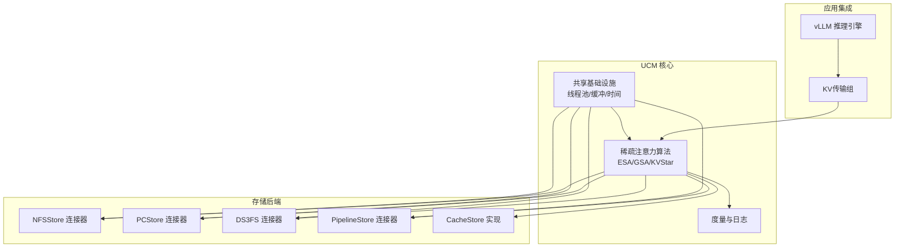
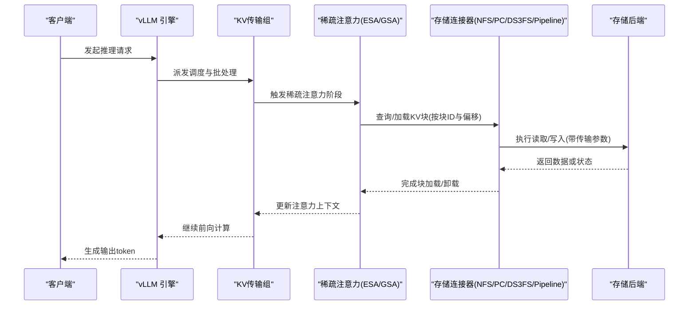
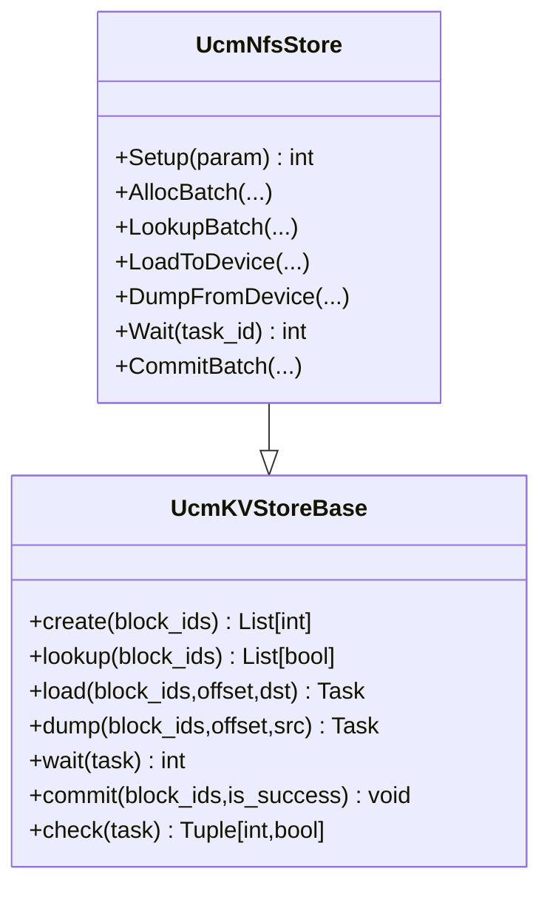
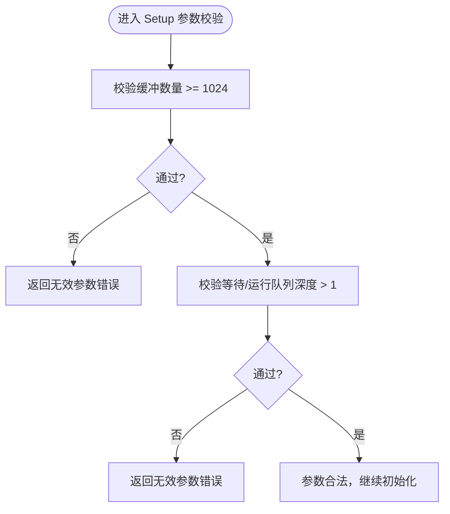
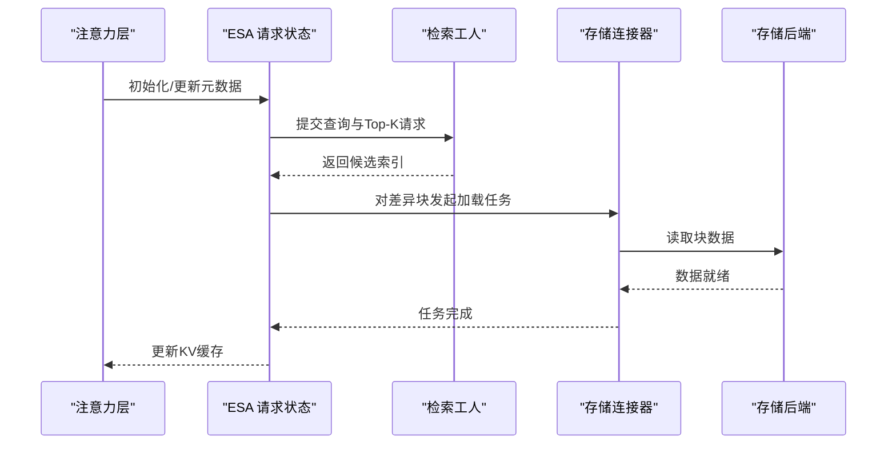
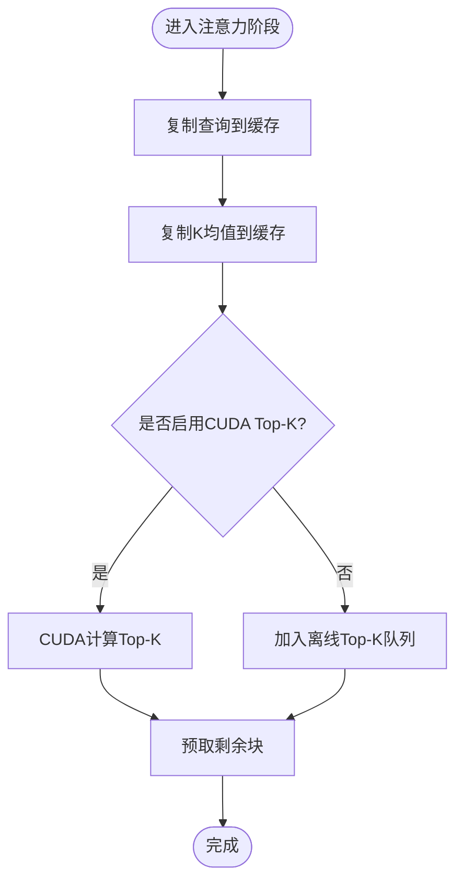
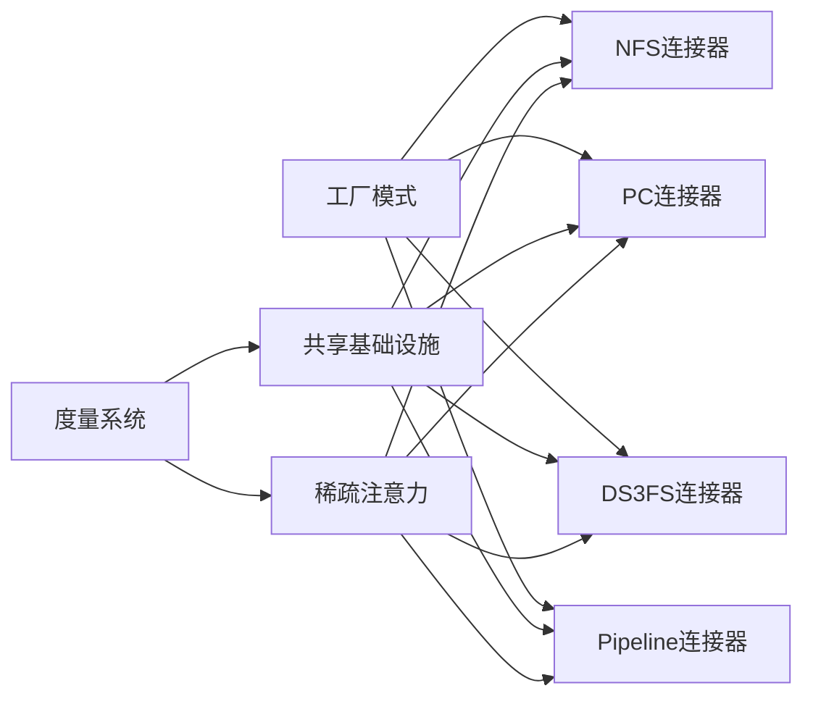
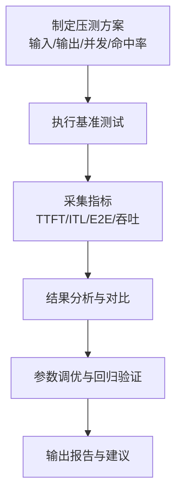

# 性能优化教程

<cite>
**本文引用的文件**
- [README.md](file://README.md)
- [ucm_config_example.yaml](file://examples\ucm_config_example.yaml)
- [metrics_configs.yaml](file://examples\metrics\metrics_configs.yaml)
- [metrics_api.h](file://ucm\shared\metrics\cc\api\metrics_api.h)
- [cache_store.h](file://ucm\store\cache\cc\cache_store.h)
- [cache_store.cc](file://ucm\store\cache\cc\cache_store.cc)
- [nfsstore_connector.py](file://ucm\store\nfsstore\nfsstore_connector.py)
- [factory.py](file://ucm\store\factory.py)
- [esa.py](file://ucm\sparse\esa\esa.py)
- [gsa.py](file://ucm\sparse\gsa\gsa.py)
- [utils.py（KVStar）](file://ucm\sparse\kvstar\utils.py)
- [test_uc_performance.py](file://test\suites\E2E\test_uc_performance.py)
- [nfsstore_embed_fetch.py](file://ucm\store\test\e2e\nfsstore_embed_fetch.py)
- [pipeline_store.md](file://docs\source\user-guide\prefix-cache\pipeline_store.md)
</cite>

## 目录
1. [简介](#简介)
2. [项目结构](#项目结构)
3. [核心组件](#核心组件)
4. [架构总览](#架构总览)
5. [详细组件分析](#详细组件分析)
6. [依赖关系分析](#依赖关系分析)
7. [性能考量与优化策略](#性能考量与优化策略)
8. [故障排查指南](#故障排查指南)
9. [结论](#结论)
10. [附录：基准测试与监控](#附录基准测试与监控)

## 简介
本教程面向希望系统性提升Unified Cache Manager（UCM）在推理场景下性能的开发者与运维工程师。内容覆盖配置与参数调优、存储层性能、稀疏注意力检索、度量与监控、端到端基准测试流程，以及跨硬件平台（如NVIDIA CUDA、Ascend等）的调优策略与最佳实践。目标是帮助你在内存占用、吞吐量、延迟等关键指标上获得稳定且可复现的性能收益。

## 项目结构
UCM围绕“KV缓存持久化+多路检索机制”的核心思想构建，主要模块包括：
- 存储层：NFS、PCStore、DS3FS、Pipeline等连接器与实现
- 稀疏注意力：ESA、GSA、GSA On Device、KVStar等算法
- 共享基础设施：度量、日志、线程池、缓冲区管理
- 集成与桥接：与vLLM的KV传输组对接
- 测试与评估：端到端性能测试套件与评测任务

图表来源
- [factory.py](file://ucm\store\factory.py#L34-L71)
- [nfsstore_connector.py](file://ucm\store\nfsstore\nfsstore_connector.py#L39-L132)
- [cache_store.h](file://ucm\store\cache\cc\cache_store.h#L32-L50)
- [esa.py](file://ucm\sparse\esa\esa.py#L421-L470)
- [gsa.py](file://ucm\sparse\gsa\gsa.py#L475-L520)

章节来源
- [README.md](file://README.md#L14-L54)

## 核心组件
- 存储连接器工厂与注册：统一创建不同后端连接器，便于按需切换与扩展
- NFS/PC/DS3FS/Pipeline连接器：封装设备侧传输参数（流数量、缓冲数、直通I/O等）
- CacheStore：缓存层抽象，负责块级读写、预取、异步任务等待
- 稀疏注意力算法：ESA/GSA/KVStar等，通过检索窗口与Top-K策略减少GPU显存占用与计算量
- 度量系统：Prometheus/Histogram指标采集与导出，支持负载与性能观测

章节来源
- [factory.py](file://ucm\store\factory.py#L34-L71)
- [nfsstore_connector.py](file://ucm\store\nfsstore\nfsstore_connector.py#L39-L132)
- [cache_store.h](file://ucm\store\cache\cc\cache_store.h#L32-L50)
- [metrics_api.h](file://ucm\shared\metrics\cc\api\metrics_api.h#L28-L42)

## 架构总览
UCM在vLLM中通过KV传输组接入，稀疏注意力算法在前向过程中根据请求特征选择是否启用，并在需要时触发从外部存储加载/卸载KV块。存储层以连接器形式解耦具体介质，同时提供可配置的传输参数以适配不同硬件平台。

图表来源
- [nfsstore_connector.py](file://ucm\store\nfsstore\nfsstore_connector.py#L84-L122)
- [esa.py](file://ucm\sparse\esa\esa.py#L219-L322)
- [gsa.py](file://ucm\sparse\gsa\gsa.py#L627-L700)

## 详细组件分析

### 存储连接器与传输参数
- NFS连接器支持设备侧传输参数：设备ID、IO大小、直通I/O、流数量、缓冲数量等；这些参数直接影响主机与设备之间的数据搬运动态与吞吐
- 工厂模式注册多种连接器，便于在不同部署环境中快速切换

图表来源
- [nfsstore_connector.py](file://ucm\store\nfsstore\nfsstore_connector.py#L39-L132)
- [factory.py](file://ucm\store\factory.py#L34-L71)

章节来源
- [nfsstore_connector.py](file://ucm\store\nfsstore\nfsstore_connector.py#L40-L70)
- [factory.py](file://ucm\store\factory.py#L34-L71)

### 缓存层接口与队列深度校验
- CacheStore定义了块级查找、前缀匹配、预取、加载/卸载、任务检查与等待等接口
- C++实现对缓冲数量、等待/运行队列深度进行参数合法性校验，避免过小导致拥塞或过大造成资源浪费

图表来源
- [cache_store.cc](file://ucm\store\cache\cc\cache_store.cc#L70-L85)

章节来源
- [cache_store.h](file://ucm\store\cache\cc\cache_store.h#L32-L50)
- [cache_store.cc](file://ucm\store\cache\cc\cache_store.cc#L70-L85)

### 稀疏注意力ESA：检索窗口与任务调度
- ESA通过初始化窗口、局部窗口与稀疏比例控制检索范围，结合检索工人并行计算Top-K，按需发起加载任务
- 支持MLA与非MLA两种形态，针对不同模型结构做指针与偏移计算

图表来源
- [esa.py](file://ucm\sparse\esa\esa.py#L272-L322)
- [esa.py](file://ucm\sparse\esa\esa.py#L219-L271)

章节来源
- [esa.py](file://ucm\sparse\esa\esa.py#L421-L470)
- [esa.py](file://ucm\sparse\esa\esa.py#L169-L218)

### 稀疏注意力GSA：Top-K与预取流水线
- GSA在解码阶段采用Top-K与K预计算（K-pre）策略，结合CUDA或CPU路径，动态决定是否在设备侧计算Top-K
- 支持预取引擎与剩余块Top-K计算，减少最后一段的计算开销

图表来源
- [gsa.py](file://ucm\sparse\gsa\gsa.py#L560-L626)
- [gsa.py](file://ucm\sparse\gsa\gsa.py#L692-L746)

章节来源
- [gsa.py](file://ucm\sparse\gsa\gsa.py#L475-L520)
- [gsa.py](file://ucm\sparse\gsa\gsa.py#L627-L700)

### CPU亲和与NUMA绑定（KVStar工具）
- 通过解析CPU拓扑，按NUMA节点或物理核比例进行绑定，降低跨NUMA访问带来的带宽损耗
- 适用于多TP并行场景下的检索/预取线程亲和性优化

章节来源
- [utils.py（KVStar）](file://ucm\sparse\kvstar\utils.py#L167-L244)

## 依赖关系分析
- 存储连接器依赖于共享基础设施（线程池、缓冲、计时），并通过工厂模式统一创建
- 稀疏注意力算法依赖KV传输组提供的连接器实例，按请求特征动态选择策略
- 度量系统贯穿各层，提供Histogram/Counter/Gauge指标，支撑性能观测与告警

图表来源
- [factory.py](file://ucm\store\factory.py#L34-L71)
- [metrics_api.h](file://ucm\shared\metrics\cc\api\metrics_api.h#L28-L42)

章节来源
- [factory.py](file://ucm\store\factory.py#L34-L71)
- [metrics_api.h](file://ucm\shared\metrics\cc\api\metrics_api.h#L28-L42)

## 性能考量与优化策略

### 内存使用优化
- 显存占用控制
  - 启用稀疏注意力（ESA/GSA/KVStar）以减少长序列推理时的KV块数量
  - 合理设置块大小与稀疏比例，使压缩后的有效长度与局部窗口平衡
- 外存占用与带宽
  - 使用直通I/O（io_direct）减少内核页缓存开销
  - 增大缓冲数量（buffer_number）以提升主机与设备间的数据搬移并发能力
  - 调整传输流数量（stream_number）以匹配存储后端的并发能力

章节来源
- [ucm_config_example.yaml](file://examples\ucm_config_example.yaml#L10-L39)
- [nfsstore_connector.py](file://ucm\store\nfsstore\nfsstore_connector.py#L48-L66)
- [pipeline_store.md](file://docs\source\user-guide\prefix-cache\pipeline_store.md#L97-L132)

### 吞吐量提升
- 并发与队列
  - 合理增大等待队列与运行队列深度，避免频繁阻塞
  - 在高并发场景下，适当提高传输流数量与缓冲数量
- 算法选择
  - 对长序列与多轮对话场景优先考虑GSA或KVStar，利用预取与Top-K策略降低重复计算
  - 在MLA模型下，注意区分prefill/decode阶段的块表与序列长度输入

章节来源
- [cache_store.cc](file://ucm\store\cache\cc\cache_store.cc#L70-L85)
- [gsa.py](file://ucm\sparse\gsa\gsa.py#L500-L520)
- [esa.py](file://ucm\sparse\esa\esa.py#L535-L553)

### 延迟降低
- 预取与命中率
  - 通过检索窗口与stride策略提前加载可能被访问的块，降低首token延迟（TTFT）
  - 提升命中率（hit_ratio）可显著降低外存访问次数
- I/O路径优化
  - 启用直通I/O与合适的IO大小，减少拷贝与系统调用开销
  - 在NVIDIA/CUDA环境下，合理设置设备ID与流数量以匹配GPU带宽

章节来源
- [ucm_config_example.yaml](file://examples\ucm_config_example.yaml#L17-L39)
- [nfsstore_connector.py](file://ucm\store\nfsstore\nfsstore_connector.py#L51-L57)

### 跨硬件平台调优要点
- NVIDIA CUDA
  - 利用CUDA Top-K与设备侧传输，最大化GPU与存储之间的并行度
  - 设置合适的设备ID与流数量，避免PCIe瓶颈
- Ascend/NPU
  - 参考NPU专用Dockerfile与设备驱动，确保传输队列与缓冲参数满足设备特性
  - 关注直通I/O与页锁定缓冲的兼容性与性能收益

章节来源
- [pipeline_store.md](file://docs\source\user-guide\prefix-cache\pipeline_store.md#L97-L132)
- [README.md](file://README.md#L14-L54)

## 故障排查指南
- 参数校验失败
  - 当缓冲数量过小、队列深度不合理时，会返回无效参数错误。请参考缓存层参数校验逻辑进行修正
- 传输超时或拥塞
  - 检查等待/运行队列深度与传输流数量，必要时增大以缓解拥塞
- 命中率低
  - 调整稀疏比例、检索stride与局部窗口，提升外存命中率
- 指标缺失或异常
  - 确认度量配置文件已正确加载，检查Histogram桶边界与日志间隔

章节来源
- [cache_store.cc](file://ucm\store\cache\cc\cache_store.cc#L70-L85)
- [metrics_configs.yaml](file://examples\metrics\metrics_configs.yaml#L1-L51)

## 结论
通过对存储连接器参数、缓存层队列、稀疏注意力策略与度量体系的系统性优化，可以在不同硬件平台上稳定提升UCM在长序列与多轮对话场景下的吞吐与延迟表现。建议以端到端基准测试为依据，持续迭代参数配置，并结合生产环境监控进行闭环优化。

## 附录：基准测试与监控

### 基准测试实施指南
- 场景设计
  - 设定输入/输出token长度、并发数、最大请求数与命中率等关键变量
  - 区分完整重算与前缀缓存稳定压测两类模式
- 指标采集
  - 关注TTFT、ITL、E2E延迟与总吞吐、增量吞吐等关键指标
  - 将测试结果扁平化以便看板展示与对比分析

章节来源
- [test_uc_performance.py](file://test\suites\E2E\test_uc_performance.py#L15-L91)
- [test_uc_performance.py](file://test\suites\E2E\test_uc_performance.py#L94-L131)
- [test_uc_performance.py](file://test\suites\E2E\test_uc_performance.py#L134-L186)

### 性能监控与可视化
- 指标配置
  - 启用Counter/Gauge/Histogram指标，设置日志间隔与直方图最大长度
  - 通过Prometheus多进程目录与前缀统一指标命名
- 可视化
  - 结合Grafana仪表盘展示负载与性能趋势，定位异常波动

章节来源
- [metrics_configs.yaml](file://examples\metrics\metrics_configs.yaml#L1-L51)
- [metrics_api.h](file://ucm\shared\metrics\cc\api\metrics_api.h#L28-L42)

### I/O性能测试示例
- 通过嵌入式读写脚本测量不同参数组合下的吞吐（GB/s），用于指导buffer_number与stream_number的取值

章节来源
- [nfsstore_embed_fetch.py](file://ucm\store\test\e2e\nfsstore_embed_fetch.py#L203-L237)