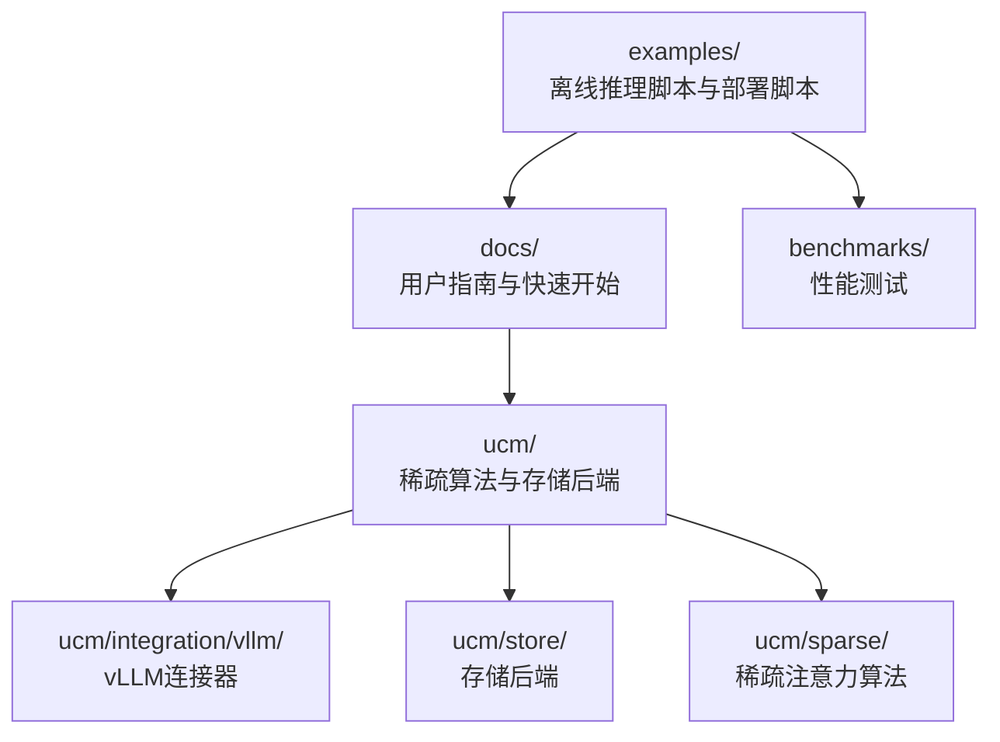
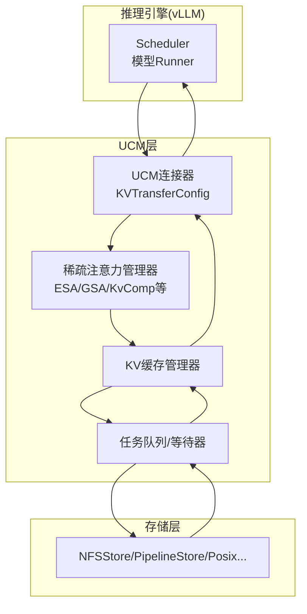
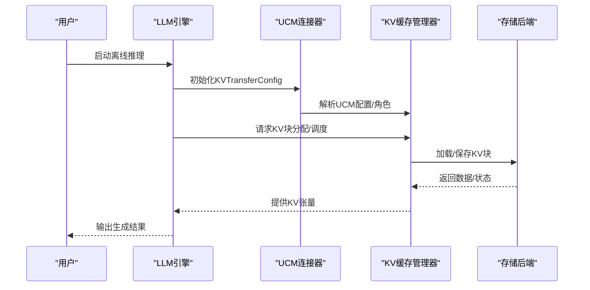
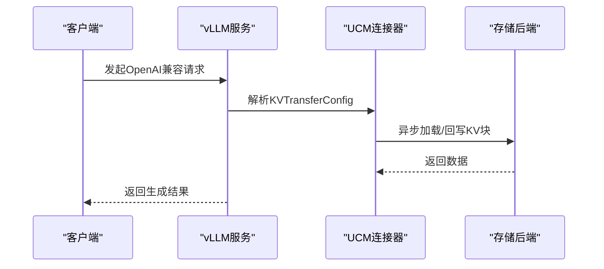
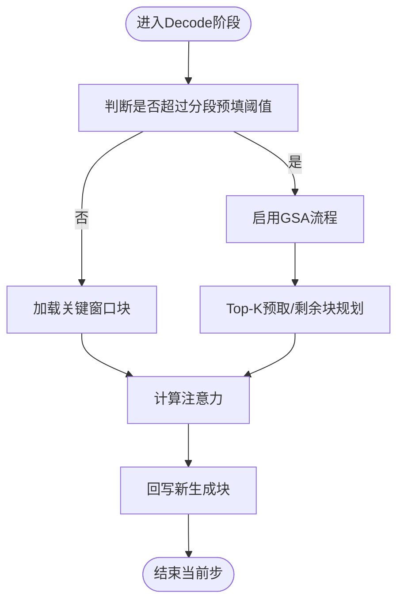
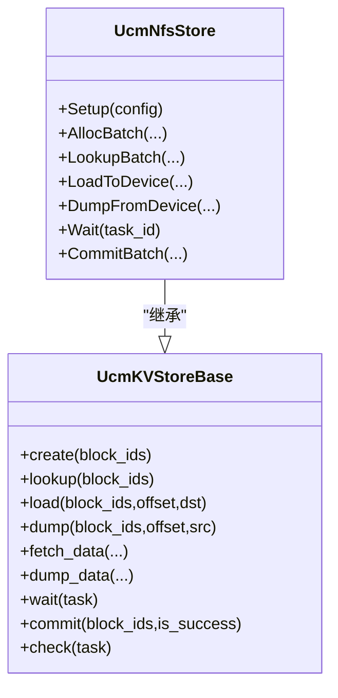
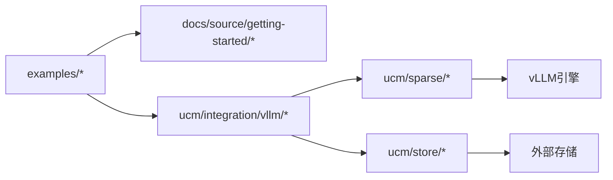

# 示例和教程

<cite>
**本文引用的文件**
- [README.md](file://README.md)
- [offline_inference.py](file://examples/offline_inference.py)
- [ucm_config_example.yaml](file://examples/ucm_config_example.yaml)
- [quickstart_vllm.md](file://docs/source/getting-started/quickstart_vllm.md)
- [index.md（稀疏注意力索引）](file://docs/source/user-guide/sparse-attention/index.md)
- [offline_inference_blend.py](file://examples/offline_inference_blend.py)
- [offline_inference_esa.py](file://examples/offline_inference_esa.py)
- [offline_inference_gsaondevice.py](file://examples/offline_inference_gsaondevice.py)
- [offline_inference_kvcomp.py](file://examples/offline_inference_kvcomp.py)
- [run_vllm.sh](file://examples/deployments/scripts/vllm/run_vllm.sh)
- [metrics_configs.yaml](file://examples/metrics/metrics_configs.yaml)
- [logging_perf_test.py](file://benchmarks/logging_perf_test.py)
- [esa.py](file://ucm/sparse/esa/esa.py)
- [gsa.py](file://ucm/sparse/gsa/gsa.py)
- [nfsstore_connector.py](file://ucm/store/nfsstore/nfsstore_connector.py)
- [index.md（前缀缓存索引）](file://docs/source/user-guide/prefix-cache/index.md)
</cite>

## 目录
1. [简介](#简介)
2. [项目结构](#项目结构)
3. [核心组件](#核心组件)
4. [架构总览](#架构总览)
5. [详细组件分析](#详细组件分析)
6. [依赖关系分析](#依赖关系分析)
7. [性能考虑](#性能考虑)
8. [故障排除指南](#故障排除指南)
9. [结论](#结论)
10. [附录](#附录)

## 简介
本教程面向希望在UCM（Unified Cache Manager）上开展KV缓存推理与稀疏注意力实验的用户，提供从环境准备、基础示例到高级配置与性能优化的完整路径。内容覆盖：
- 基础使用：快速启动离线推理与在线服务，完成一次KV缓存推理任务
- 高级配置：不同稀疏算法（ESA、GSA、GSAOnDevice、KvComp、CacheBlend）的配置要点与参数调优
- 性能优化：结合日志、指标与I/O特性进行针对性优化
- 最佳实践：常见场景下的参数设置与部署建议
- 端到端流程：从环境搭建到性能优化的全流程指导
- 故障排除：常见问题定位与解决思路
- 社区实践：示例脚本与配置文件作为参考模板

## 项目结构
UCM仓库围绕“统一KV缓存管理”目标，提供与vLLM集成的连接器、多种外部存储后端、以及多类稀疏注意力实现。示例与文档主要分布在以下位置：
- examples：离线推理脚本、部署脚本与示例配置
- docs：用户指南与快速开始文档
- ucm：核心模块（稀疏算法、存储后端、连接器等）
- benchmarks：性能测试工具（如日志性能对比）

**图表来源**
- [offline_inference.py](file://examples/offline_inference.py#L1-L112)
- [quickstart_vllm.md](file://docs/source/getting-started/quickstart_vllm.md#L1-L237)
- [ucm_config_example.yaml](file://examples/ucm_config_example.yaml#L1-L39)

**章节来源**
- [README.md](file://README.md#L1-L93)
- [quickstart_vllm.md](file://docs/source/getting-started/quickstart_vllm.md#L1-L237)

## 核心组件
- UCM连接器：负责将UCM与vLLM引擎对接，通过KVTransferConfig注入UCM配置与角色
- 存储后端：如NFSStore、PipelineStore等，抽象KV块的持久化与传输
- 稀疏注意力：ESA、GSA、GSAOnDevice、KvComp、CacheBlend等算法实现
- 指标与日志：Prometheus/Grafana指标配置与日志性能基准测试

**章节来源**
- [offline_inference.py](file://examples/offline_inference.py#L18-L44)
- [ucm_config_example.yaml](file://examples/ucm_config_example.yaml#L10-L38)
- [nfsstore_connector.py](file://ucm/store/nfsstore/nfsstore_connector.py#L39-L132)
- [index.md（稀疏注意力索引）](file://docs/source/user-guide/sparse-attention/index.md#L1-L46)

## 架构总览
UCM在推理链路中扮演“KV缓存的持久化与按需加载”的角色，通过连接器与vLLM调度器/工作进程协作，实现前缀缓存与稀疏注意力的异步加载与重排。

**图表来源**
- [offline_inference.py](file://examples/offline_inference.py#L18-L44)
- [nfsstore_connector.py](file://ucm/store/nfsstore/nfsstore_connector.py#L39-L132)
- [index.md（稀疏注意力索引）](file://docs/source/user-guide/sparse-attention/index.md#L19-L35)

## 详细组件分析

### 基础使用：离线推理KV缓存任务
- 目标：在本地或容器环境中，使用UCM连接器与示例配置，完成一次离线生成
- 关键步骤
  - 准备vLLM环境与补丁（见快速开始）
  - 编写KVTransferConfig并指定UCM配置文件路径
  - 使用示例脚本执行离线推理
- 参考文件
  - [offline_inference.py](file://examples/offline_inference.py#L18-L44)
  - [ucm_config_example.yaml](file://examples/ucm_config_example.yaml#L10-L38)
  - [quickstart_vllm.md](file://docs/source/getting-started/quickstart_vllm.md#L154-L179)

**图表来源**
- [offline_inference.py](file://examples/offline_inference.py#L18-L44)
- [ucm_config_example.yaml](file://examples/ucm_config_example.yaml#L10-L38)

**章节来源**
- [offline_inference.py](file://examples/offline_inference.py#L62-L112)
- [ucm_config_example.yaml](file://examples/ucm_config_example.yaml#L1-L39)
- [quickstart_vllm.md](file://docs/source/getting-started/quickstart_vllm.md#L154-L179)

### 在线服务：OpenAI兼容API
- 目标：以vLLM服务形式提供OpenAI兼容接口，并启用UCM
- 关键步骤
  - 设置KVTransferConfig并指向UCM配置文件
  - 启动服务并验证日志
  - 使用curl发起请求
- 参考文件
  - [quickstart_vllm.md](file://docs/source/getting-started/quickstart_vllm.md#L183-L237)
  - [run_vllm.sh](file://examples/deployments/scripts/vllm/run_vllm.sh#L99-L107)

**图表来源**
- [quickstart_vllm.md](file://docs/source/getting-started/quickstart_vllm.md#L183-L237)
- [run_vllm.sh](file://examples/deployments/scripts/vllm/run_vllm.sh#L99-L107)

**章节来源**
- [quickstart_vllm.md](file://docs/source/getting-started/quickstart_vllm.md#L183-L237)
- [run_vllm.sh](file://examples/deployments/scripts/vllm/run_vllm.sh#L1-L116)

### 高级配置：稀疏注意力算法
- ESA（增强稀疏注意力）
  - 适用场景：长上下文解码阶段仅加载关键窗口块
  - 关键参数：初始化窗口、局部窗口、最小块数、稀疏比例、检索步长
  - 参考文件
    - [offline_inference_esa.py](file://examples/offline_inference_esa.py#L81-L89)
    - [index.md（稀疏注意力索引）](file://docs/source/user-guide/sparse-attention/index.md#L25-L35)
    - [esa.py](file://ucm/sparse/esa/esa.py#L140-L144)
- GSA（全局稀疏注意力）
  - 适用场景：大规模长序列，支持设备侧Top-K预取
  - 关键参数：分段预填阈值、是否启用Top-K预取、块大小等
  - 参考文件
    - [offline_inference_gsaondevice.py](file://examples/offline_inference_gsaondevice.py#L80-L82)
    - [gsa.py](file://ucm/sparse/gsa/gsa.py#L172-L200)
- KvComp（KV压缩）
  - 适用场景：对KV块进行压缩表示与检索
  - 关键参数：初始化/局部窗口、最小块数、稀疏比例、检索步长
  - 参考文件
    - [offline_inference_kvcomp.py](file://examples/offline_inference_kvcomp.py#L79-L90)
- CacheBlend（缓存融合）
  - 适用场景：RAG/长文档问答，将文档块切分为可缓存片段
  - 关键参数：块结束标记、各层计算元信息
  - 参考文件
    - [offline_inference_blend.py](file://examples/offline_inference_blend.py#L103-L112)

**图表来源**
- [offline_inference_esa.py](file://examples/offline_inference_esa.py#L81-L89)
- [offline_inference_gsaondevice.py](file://examples/offline_inference_gsaondevice.py#L80-L82)
- [gsa.py](file://ucm/sparse/gsa/gsa.py#L172-L200)

**章节来源**
- [offline_inference_esa.py](file://examples/offline_inference_esa.py#L63-L111)
- [offline_inference_gsaondevice.py](file://examples/offline_inference_gsaondevice.py#L64-L102)
- [offline_inference_kvcomp.py](file://examples/offline_inference_kvcomp.py#L63-L111)
- [offline_inference_blend.py](file://examples/offline_inference_blend.py#L87-L135)
- [index.md（稀疏注意力索引）](file://docs/source/user-guide/sparse-attention/index.md#L25-L35)

### 存储后端：NFSStore
- 功能：将KV块持久化至NFS挂载目录，支持批量分配、查找、加载与回写
- 关键点：块大小、直写模式、传输流数量、缓冲区数量等
- 参考文件
  - [nfsstore_connector.py](file://ucm/store/nfsstore/nfsstore_connector.py#L39-L132)

**图表来源**
- [nfsstore_connector.py](file://ucm/store/nfsstore/nfsstore_connector.py#L39-L132)

**章节来源**
- [nfsstore_connector.py](file://ucm/store/nfsstore/nfsstore_connector.py#L39-L132)

### 指标与监控：Prometheus/Grafana
- 目标：采集UCM加载/保存次数、块数、耗时与速度等指标
- 关键点：指标前缀、直方图桶、多进程目录
- 参考文件
  - [metrics_configs.yaml](file://examples/metrics/metrics_configs.yaml#L1-L51)

**章节来源**
- [metrics_configs.yaml](file://examples/metrics/metrics_configs.yaml#L1-L51)

## 依赖关系分析
- 连接器依赖：UCM连接器依赖vLLM的KVTransferConfig与引擎参数；稀疏算法依赖vLLM的调度器与模型Runner
- 存储依赖：存储后端抽象了KV块的生命周期管理，连接器通过统一接口访问
- 文档与示例：快速开始文档指导安装、打补丁与启动；示例脚本演示不同功能组合

**图表来源**
- [offline_inference.py](file://examples/offline_inference.py#L18-L44)
- [quickstart_vllm.md](file://docs/source/getting-started/quickstart_vllm.md#L81-L117)

**章节来源**
- [offline_inference.py](file://examples/offline_inference.py#L18-L44)
- [quickstart_vllm.md](file://docs/source/getting-started/quickstart_vllm.md#L81-L117)

## 性能考虑
- 日志开销：通过pybind11 spdlog_logger与Python logging对比，评估日志路径性能差异
- I/O特性：前缀缓存偏向带宽型IO，适合SSD；稀疏注意力在解码阶段按需加载，关注延迟与吞吐平衡
- 参数建议
  - 块大小：根据模型与显存占用选择（如128）
  - 内存利用率：GPU内存利用率控制在合理区间，避免溢出
  - 分布式并行：TP/DP/PP规模与存储后端能力匹配
- 参考文件
  - [logging_perf_test.py](file://benchmarks/logging_perf_test.py#L102-L140)
  - [index.md（前缀缓存索引）](file://docs/source/user-guide/prefix-cache/index.md#L11-L14)

**章节来源**
- [logging_perf_test.py](file://benchmarks/logging_perf_test.py#L102-L140)
- [index.md（前缀缓存索引）](file://docs/source/user-guide/prefix-cache/index.md#L11-L14)

## 故障排除指南
- 安装与补丁
  - 确认已应用对应版本的vLLM补丁
  - 若启用稀疏模块，确保编译时开启相关开关
- 配置文件
  - UCM配置文件路径需正确传递给KVTransferConfig
  - 存储后端路径与权限检查
- 运行时
  - 观察服务启动日志，确认UCM连接器初始化成功
  - 如出现加载失败，检查块ID映射与存储后端可用性
- 参考文件
  - [quickstart_vllm.md](file://docs/source/getting-started/quickstart_vllm.md#L81-L132)
  - [ucm_config_example.yaml](file://examples/ucm_config_example.yaml#L1-L39)

**章节来源**
- [quickstart_vllm.md](file://docs/source/getting-started/quickstart_vllm.md#L81-L132)
- [ucm_config_example.yaml](file://examples/ucm_config_example.yaml#L1-L39)

## 结论
通过本教程，您可以在UCM上完成从基础KV缓存推理到高级稀疏注意力的全栈实践。建议优先以离线脚本验证配置，再迁移至在线服务；在生产环境中结合指标监控与I/O特性进行参数微调，以获得稳定且高性能的推理体验。

## 附录
- 快速开始参考
  - [快速开始文档](file://docs/source/getting-started/quickstart_vllm.md#L1-L237)
- 稀疏注意力算法参考
  - [稀疏注意力索引](file://docs/source/user-guide/sparse-attention/index.md#L1-L46)
- 前缀缓存架构参考
  - [前缀缓存索引](file://docs/source/user-guide/prefix-cache/index.md#L1-L85)