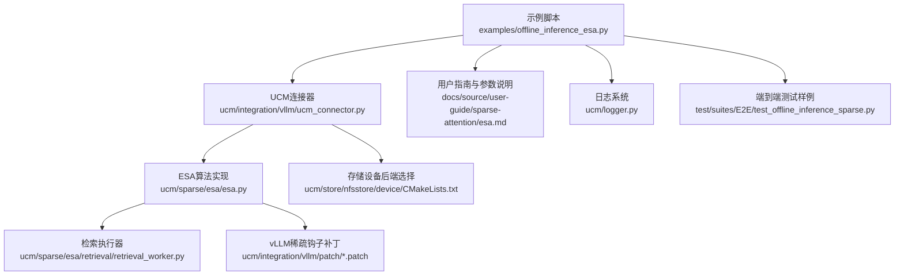
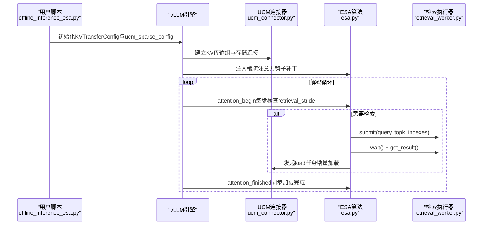
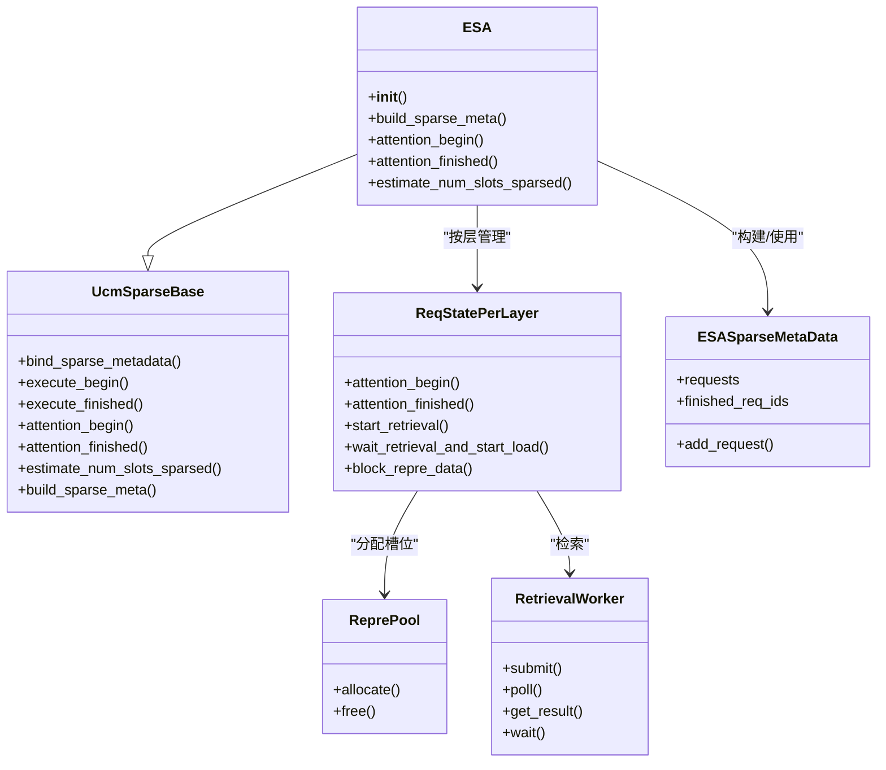
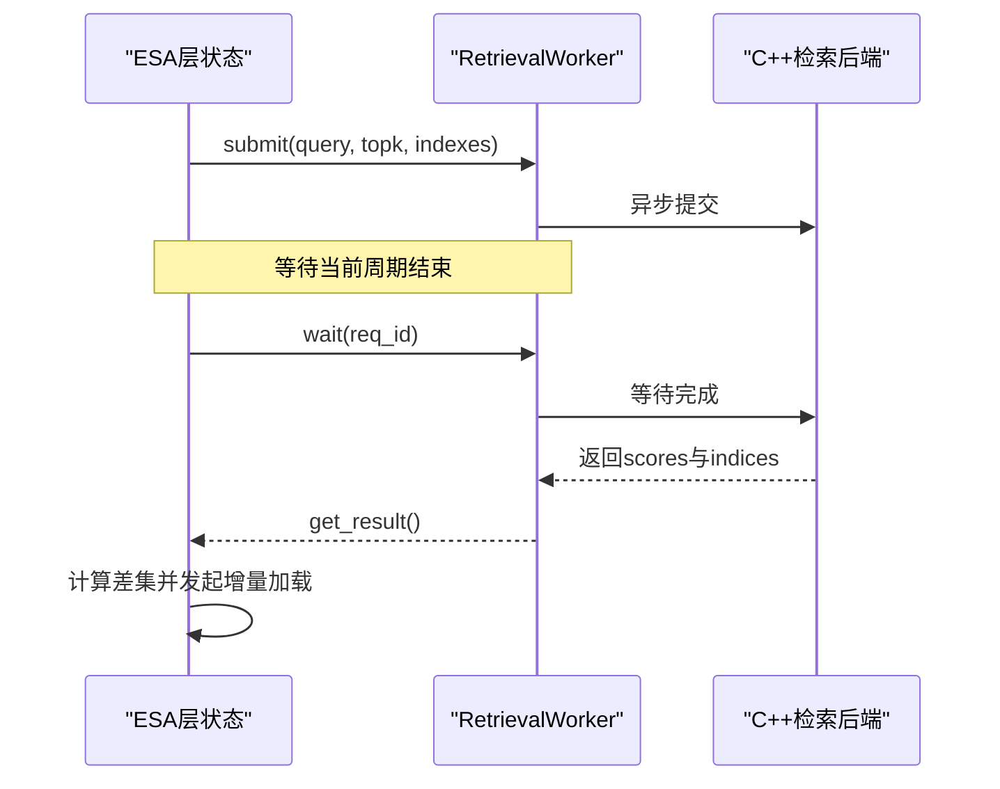
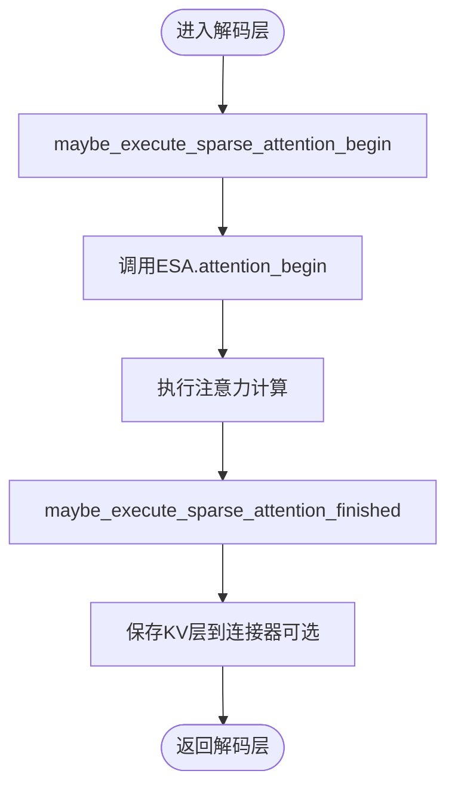
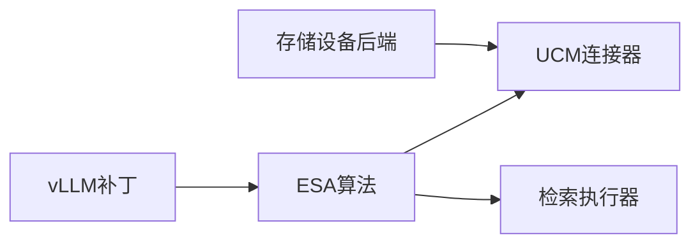

# ESA算法示例

<cite>
**本文引用的文件**
- [examples/offline_inference_esa.py](file://examples/offline_inference_esa.py)
- [docs/source/user-guide/sparse-attention/esa.md](file://docs/source/user-guide/sparse-attention/esa.md)
- [ucm/sparse/esa/esa.py](file://ucm/sparse/esa/esa.py)
- [ucm/sparse/esa/retrieval/retrieval_worker.py](file://ucm/sparse/esa/retrieval/retrieval_worker.py)
- [ucm/sparse/base.py](file://ucm/sparse/base.py)
- [ucm/integration/vllm/patch/0.9.2/vllm-adapt-sparse.patch](file://ucm/integration/vllm/patch/0.9.2/vllm-adapt-sparse.patch)
- [ucm/integration/vllm/patch/0.9.2/vllm-ascend-adapt.patch](file://ucm/integration/vllm/patch/0.9.2/vllm-ascend-adapt.patch)
- [ucm/integration/vllm/ucm_connector.py](file://ucm/integration/vllm/ucm_connector.py)
- [ucm/store/nfsstore/device/CMakeLists.txt](file://ucm/store/nfsstore/device/CMakeLists.txt)
- [ucm/logger.py](file://ucm/logger.py)
- [test/suites/E2E/test_offline_inference_sparse.py](file://test/suites/E2E/test_offline_inference_sparse.py)
</cite>

## 目录
1. [简介](#简介)
2. [项目结构](#项目结构)
3. [核心组件](#核心组件)
4. [架构总览](#架构总览)
5. [详细组件分析](#详细组件分析)
6. [依赖关系分析](#依赖关系分析)
7. [性能考虑](#性能考虑)
8. [故障排查指南](#故障排查指南)
9. [结论](#结论)
10. [附录](#附录)

## 简介
本文件面向希望在UCM框架下启用ESA（高效稀疏注意力）算法的开发者，提供从原理到实操的完整示例与最佳实践。内容涵盖：
- ESA核心原理与工作流
- 在UCM中启用ESA所需的环境变量、KVTransferConfig与ucm_sparse_config配置
- 关键参数init_window_sz、local_window_sz、min_blocks、sparse_ratio、retrieval_stride的作用与调优策略
- 不同硬件平台（CUDA/NPU等）的适配与性能优化建议
- 错误处理与调试方法

## 项目结构
围绕ESA的实现与使用，相关代码主要分布在以下模块：
- 示例入口与配置：examples/offline_inference_esa.py
- 用户指南与参数说明：docs/source/user-guide/sparse-attention/esa.md
- ESA算法主体与检索：ucm/sparse/esa/esa.py、ucm/sparse/esa/retrieval/retrieval_worker.py
- UCM稀疏注意力基类接口：ucm/sparse/base.py
- vLLM集成补丁（启用稀疏钩子）：ucm/integration/vllm/patch/*.patch
- UCM vLLM连接器（KV传输与元数据）：ucm/integration/vllm/ucm_connector.py
- 存储设备适配（硬件后端选择）：ucm/store/nfsstore/device/CMakeLists.txt
- 日志与测试：ucm/logger.py、test/suites/E2E/test_offline_inference_sparse.py

图表来源
- [examples/offline_inference_esa.py](file://examples/offline_inference_esa.py#L63-L111)
- [ucm/integration/vllm/ucm_connector.py](file://ucm/integration/vllm/ucm_connector.py#L125-L162)
- [ucm/sparse/esa/esa.py](file://ucm/sparse/esa/esa.py#L421-L491)
- [ucm/sparse/esa/retrieval/retrieval_worker.py](file://ucm/sparse/esa/retrieval/retrieval_worker.py#L11-L36)
- [ucm/integration/vllm/patch/0.9.2/vllm-adapt-sparse.patch](file://ucm/integration/vllm/patch/0.9.2/vllm-adapt-sparse.patch#L188-L223)
- [ucm/store/nfsstore/device/CMakeLists.txt](file://ucm/store/nfsstore/device/CMakeLists.txt#L1-L13)
- [docs/source/user-guide/sparse-attention/esa.md](file://docs/source/user-guide/sparse-attention/esa.md#L1-L98)
- [ucm/logger.py](file://ucm/logger.py#L40-L75)
- [test/suites/E2E/test_offline_inference_sparse.py](file://test/suites/E2E/test_offline_inference_sparse.py#L320-L429)

章节来源
- [examples/offline_inference_esa.py](file://examples/offline_inference_esa.py#L1-L176)
- [docs/source/user-guide/sparse-attention/esa.md](file://docs/source/user-guide/sparse-attention/esa.md#L1-L98)

## 核心组件
- 示例入口与运行时配置
  - 示例脚本通过环境变量开启稀疏注意力，并构建KVTransferConfig与ucm_sparse_config，随后初始化vLLM引擎执行离线推理。
  - 参考路径：[examples/offline_inference_esa.py](file://examples/offline_inference_esa.py#L24-L111)

- ESA算法实现
  - ESA类负责请求级状态管理、块表示计算、异步检索Top-K块以及非阻塞加载到HBM。
  - 关键流程：构建稀疏元数据、按步长周期性启动检索、等待结果并发起加载任务、同步完成更新。
  - 参考路径：[ucm/sparse/esa/esa.py](file://ucm/sparse/esa/esa.py#L421-L607)

- 检索执行器
  - 封装C++检索后端，支持提交查询、轮询结果、等待完成与取回Top-K索引。
  - 参考路径：[ucm/sparse/esa/retrieval/retrieval_worker.py](file://ucm/sparse/esa/retrieval/retrieval_worker.py#L11-L36)

- UCM稀疏注意力基类
  - 提供统一的调度侧与工作侧接口：估算槽位、构建稀疏元数据、注意力前后钩子等。
  - 参考路径：[ucm/sparse/base.py](file://ucm/sparse/base.py#L127-L323)

- vLLM集成补丁
  - 在vLLM解码层前后注入稀疏注意力钩子，使ESA在注意力计算前后生效。
  - 参考路径：[ucm/integration/vllm/patch/0.9.2/vllm-adapt-sparse.patch](file://ucm/integration/vllm/patch/0.9.2/vllm-adapt-sparse.patch#L188-L223)

章节来源
- [examples/offline_inference_esa.py](file://examples/offline_inference_esa.py#L63-L111)
- [ucm/sparse/esa/esa.py](file://ucm/sparse/esa/esa.py#L421-L607)
- [ucm/sparse/esa/retrieval/retrieval_worker.py](file://ucm/sparse/esa/retrieval/retrieval_worker.py#L11-L36)
- [ucm/sparse/base.py](file://ucm/sparse/base.py#L127-L323)
- [ucm/integration/vllm/patch/0.9.2/vllm-adapt-sparse.patch](file://ucm/integration/vllm/patch/0.9.2/vllm-adapt-sparse.patch#L188-L223)

## 架构总览
ESA在UCM中的整体调用链如下：

图表来源
- [examples/offline_inference_esa.py](file://examples/offline_inference_esa.py#L63-L111)
- [ucm/integration/vllm/ucm_connector.py](file://ucm/integration/vllm/ucm_connector.py#L125-L162)
- [ucm/sparse/esa/esa.py](file://ucm/sparse/esa/esa.py#L364-L418)
- [ucm/sparse/esa/retrieval/retrieval_worker.py](file://ucm/sparse/esa/retrieval/retrieval_worker.py#L23-L36)

## 详细组件分析

### 组件A：ESA算法类（ESA）
- 角色与职责
  - 负责每个请求在各层的状态管理、块表示池分配、窗口初始化与局部窗口维护、按步长周期性检索与加载。
- 关键数据结构
  - ESASparseMetaData：承载请求元信息（如vllm_block_ids、query_start_loc、prompt_token_ids、output_token_ids、是否预抢占等）。
  - ReprePool：为每层分配连续的CPU侧表示槽位，避免重复分配。
- 核心流程
  - 初始化：解析ucm_sparse_config、创建每层检索执行器、建立表示池。
  - 请求级状态：按层创建ReqStatePerLayer，注册静态KV缓存指针与偏移。
  - 注意力开始：按retrieval_stride触发检索，等待结果并发起增量加载，必要时同步加载完成。
  - 估计槽位：根据init_window_sz、local_window_sz、sparse_ratio与block_size估算压缩后的提示长度。

图表来源
- [ucm/sparse/base.py](file://ucm/sparse/base.py#L127-L323)
- [ucm/sparse/esa/esa.py](file://ucm/sparse/esa/esa.py#L421-L607)
- [ucm/sparse/esa/esa.py](file://ucm/sparse/esa/esa.py#L169-L420)
- [ucm/sparse/esa/retrieval/retrieval_worker.py](file://ucm/sparse/esa/retrieval/retrieval_worker.py#L11-L36)

章节来源
- [ucm/sparse/esa/esa.py](file://ucm/sparse/esa/esa.py#L421-L607)
- [ucm/sparse/esa/esa.py](file://ucm/sparse/esa/esa.py#L169-L420)
- [ucm/sparse/base.py](file://ucm/sparse/base.py#L127-L323)

### 组件B：检索执行器（RetrievalWorker）
- 功能
  - 将torch张量转换为float32并迁移至CPU，提交给C++检索后端，支持轮询与等待获取Top-K索引。
- 使用场景
  - 在ESA的attention_begin/attention_finished中按步长周期性调用，实现非阻塞式检索与加载。

图表来源
- [ucm/sparse/esa/retrieval/retrieval_worker.py](file://ucm/sparse/esa/retrieval/retrieval_worker.py#L23-L36)
- [ucm/sparse/esa/esa.py](file://ucm/sparse/esa/esa.py#L272-L322)

章节来源
- [ucm/sparse/esa/retrieval/retrieval_worker.py](file://ucm/sparse/esa/retrieval/retrieval_worker.py#L11-L36)
- [ucm/sparse/esa/esa.py](file://ucm/sparse/esa/esa.py#L272-L322)

### 组件C：vLLM稀疏钩子集成
- 作用
  - 在vLLM解码层前后注入稀疏注意力钩子，确保ESA在注意力计算前/后被正确调用。
- 适配版本
  - CUDA与Ascend平台分别提供补丁，确保不同设备上的一致行为。

图表来源
- [ucm/integration/vllm/patch/0.9.2/vllm-adapt-sparse.patch](file://ucm/integration/vllm/patch/0.9.2/vllm-adapt-sparse.patch#L188-L223)
- [ucm/integration/vllm/patch/0.9.2/vllm-ascend-adapt.patch](file://ucm/integration/vllm/patch/0.9.2/vllm-ascend-adapt.patch#L88-L128)

章节来源
- [ucm/integration/vllm/patch/0.9.2/vllm-adapt-sparse.patch](file://ucm/integration/vllm/patch/0.9.2/vllm-adapt-sparse.patch#L188-L223)
- [ucm/integration/vllm/patch/0.9.2/vllm-ascend-adapt.patch](file://ucm/integration/vllm/patch/0.9.2/vllm-ascend-adapt.patch#L88-L128)

## 依赖关系分析
- 组件耦合
  - ESA依赖UCM连接器进行KV块的加载/等待；依赖RetrievalWorker进行Top-K检索；依赖vLLM补丁在注意力前后插入钩子。
- 外部依赖
  - 存储设备后端由CMake根据RUNTIME_ENVIRONMENT自动选择（Ascend/MUSA/CUDA/SIMU），影响底层设备能力与性能。
- 可能的环路
  - 当前设计以ESA为中心，围绕其构建稀疏元数据与检索流程，未见明显循环依赖。

图表来源
- [ucm/sparse/esa/esa.py](file://ucm/sparse/esa/esa.py#L421-L491)
- [ucm/integration/vllm/ucm_connector.py](file://ucm/integration/vllm/ucm_connector.py#L125-L162)
- [ucm/store/nfsstore/device/CMakeLists.txt](file://ucm/store/nfsstore/device/CMakeLists.txt#L1-L13)

章节来源
- [ucm/sparse/esa/esa.py](file://ucm/sparse/esa/esa.py#L421-L491)
- [ucm/integration/vllm/ucm_connector.py](file://ucm/integration/vllm/ucm_connector.py#L125-L162)
- [ucm/store/nfsstore/device/CMakeLists.txt](file://ucm/store/nfsstore/device/CMakeLists.txt#L1-L13)

## 性能考虑
- 参数调优
  - init_window_sz：初始窗口大小，越大越稳定但占用更多HBM；建议从1起步，结合模型上下文长度评估。
  - local_window_sz：局部窗口大小，用于保留尾部上下文；建议≥1，避免历史信息丢失。
  - sparse_ratio：稀疏比例，控制每次检索Top-K块数量；建议0.2~0.5之间，兼顾吞吐与精度。
  - retrieval_stride：检索步长，控制多久做一次检索与加载；默认值为5，可根据延迟目标调整。
  - min_blocks：最小块数阈值，低于此值的请求不启用稀疏；建议结合block_size与模型长度设定。
- 硬件适配
  - CUDA：使用CUDA设备后端，适合GPU资源充足的场景。
  - Ascend/MUSA：通过RUNTIME_ENVIRONMENT切换至Ascend/MUSA后端，注意编译时torch_npu路径与ABI设置。
- 其他建议
  - 合理设置max_model_len、block_size与max_num_batched_tokens，避免频繁块分配导致抖动。
  - 使用等待队列深度参数（如waiting_queue_depth）提升并发加载吞吐。
  - 对MLA模型区分prefill/decode阶段的稀疏元数据，避免不必要的检索。

章节来源
- [docs/source/user-guide/sparse-attention/esa.md](file://docs/source/user-guide/sparse-attention/esa.md#L76-L98)
- [ucm/sparse/esa/esa.py](file://ucm/sparse/esa/esa.py#L648-L729)
- [ucm/store/nfsstore/device/CMakeLists.txt](file://ucm/store/nfsstore/device/CMakeLists.txt#L1-L13)

## 故障排查指南
- 常见问题与定位
  - 稀疏未生效：确认环境变量ENABLE_SPARSE=true且KVTransferConfig已正确传入ucm_sparse_config。
  - 检索超时或结果异常：检查retrieval_worker的poll/wait逻辑与C++后端是否正常返回；关注Top-K索引一致性。
  - HBM加载失败：核对增量加载差集计算与任务等待逻辑，确保所有任务完成后才更新KV缓存。
  - 设备后端不匹配：确认RUNTIME_ENVIRONMENT与编译配置一致，避免找不到设备库。
- 日志与指标
  - 使用UCM日志系统记录关键事件与错误码，便于定位问题。
  - 参考测试工具统计吞吐、TTFT、E2E延迟等指标，辅助性能回归分析。
- 快速验证
  - 使用示例脚本与端到端测试用例快速复现问题，缩小范围。

章节来源
- [ucm/logger.py](file://ucm/logger.py#L40-L75)
- [test/suites/E2E/test_offline_inference_sparse.py](file://test/suites/E2E/test_offline_inference_sparse.py#L320-L429)

## 结论
ESA通过“块表示+异步检索+非阻塞加载”的方式，在UCM框架下实现了高效的稀疏注意力。配合合理的参数调优与硬件适配，可在保证精度的同时显著降低显存占用与I/O开销。建议从默认参数入手，逐步微调以达到目标延迟与吞吐平衡。

## 附录

### 参数详解与调优建议
- init_window_sz
  - 作用：保留初始固定长度的KV块，确保早期上下文稳定。
  - 调优：从1开始尝试，若出现早期退化现象可适当增大。
- local_window_sz
  - 作用：保留尾部局部窗口，减少长文本尾部信息丢失。
  - 调优：建议≥1，结合具体任务长度与显存预算。
- min_blocks
  - 作用：请求最小块数阈值，低于此值不启用稀疏。
  - 调优：结合block_size与模型最大长度，避免短请求的无效开销。
- sparse_ratio
  - 作用：每次检索Top-K的比例，决定加载块数量。
  - 调优：0.2~0.5为常见区间，过小影响效果，过大增加I/O压力。
- retrieval_stride
  - 作用：检索步长，控制周期性检索频率。
  - 调优：默认5，若延迟敏感可减小，若带宽紧张可增大。

章节来源
- [ucm/sparse/esa/esa.py](file://ucm/sparse/esa/esa.py#L324-L329)
- [ucm/sparse/esa/esa.py](file://ucm/sparse/esa/esa.py#L288-L292)
- [docs/source/user-guide/sparse-attention/esa.md](file://docs/source/user-guide/sparse-attention/esa.md#L76-L98)

### 在UCM中启用ESA的完整步骤
- 步骤1：设置环境变量
  - ENABLE_SPARSE=true
  - 参考路径：[examples/offline_inference_esa.py](file://examples/offline_inference_esa.py#L24-L28)
- 步骤2：配置KVTransferConfig与ucm_sparse_config
  - 在KVTransferConfig中设置ucm_connectors与ucm_sparse_config，包含ESA参数。
  - 参考路径：[examples/offline_inference_esa.py](file://examples/offline_inference_esa.py#L63-L111)
- 步骤3：初始化vLLM引擎并运行推理
  - 参考路径：[examples/offline_inference_esa.py](file://examples/offline_inference_esa.py#L133-L176)

章节来源
- [examples/offline_inference_esa.py](file://examples/offline_inference_esa.py#L24-L111)
- [examples/offline_inference_esa.py](file://examples/offline_inference_esa.py#L133-L176)