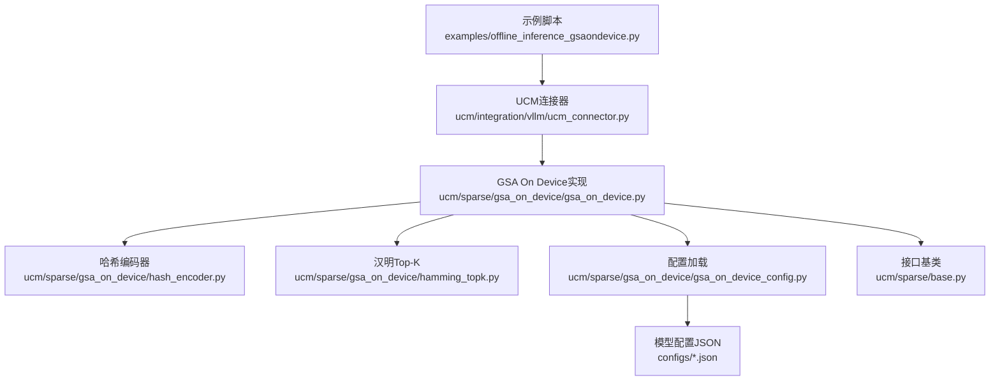
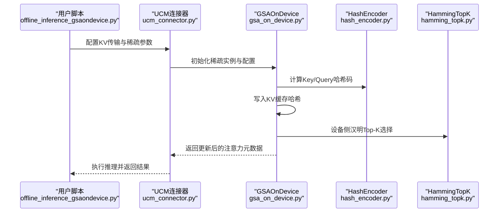
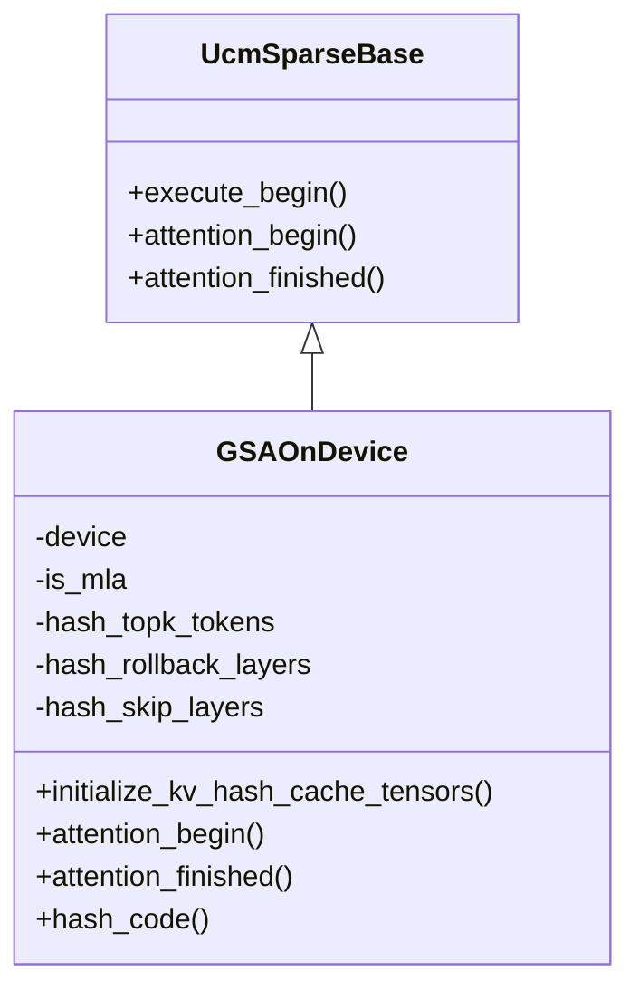
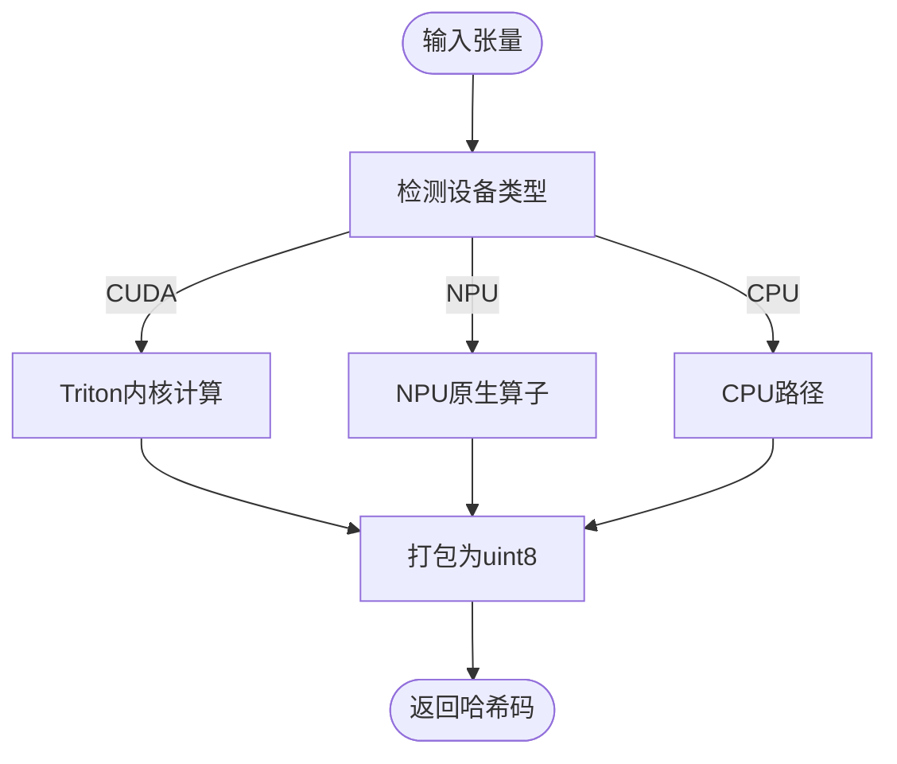
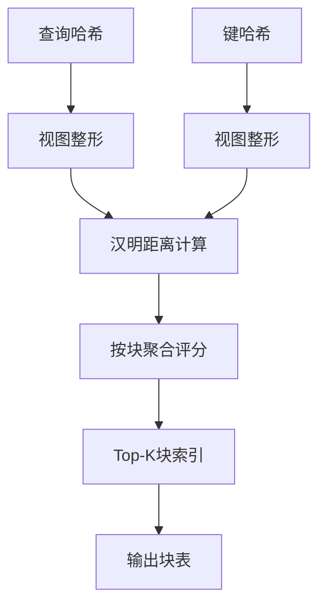
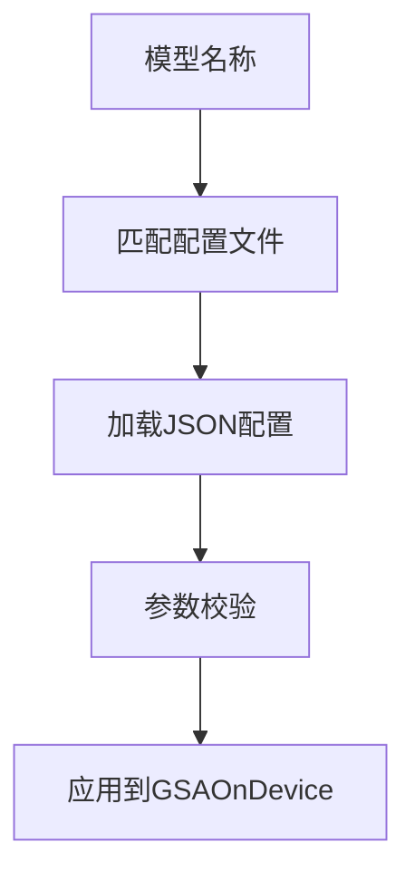
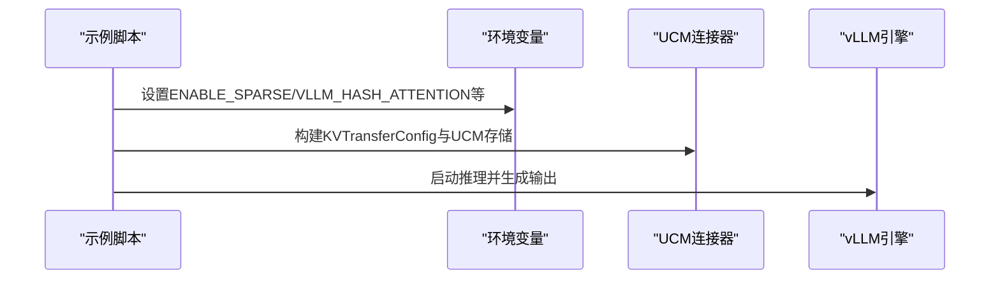
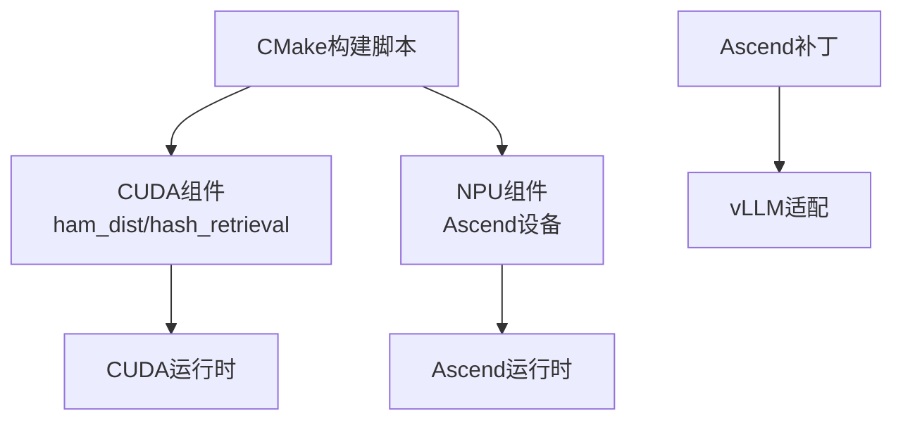

# GSA On Device算法示例

<cite>
**本文引用的文件**
- [offline_inference_gsaondevice.py](file://examples/offline_inference_gsaondevice.py)
- [gsa_on_device.py](file://ucm/sparse/gsa_on_device/gsa_on_device.py)
- [gsa_on_device_config.py](file://ucm/sparse/gsa_on_device/gsa_on_device_config.py)
- [hamming_topk.py](file://ucm/sparse/gsa_on_device/hamming_topk.py)
- [hash_encoder.py](file://ucm/sparse/gsa_on_device/hash_encoder.py)
- [base.py](file://ucm/sparse/base.py)
- [ucm_connector.py](file://ucm/integration/vllm/ucm_connector.py)
- [gsa_on_device_deepseek_v2_lite_config.json](file://ucm/sparse/gsa_on_device/configs/gsa_on_device_deepseek_v2_lite_config.json)
- [gsa.md](file://docs/source/user-guide/sparse-attention/gsa.md)
- [CMakeLists.txt](file://ucm/sparse/gsa_on_device/CMakeLists.txt)
- [vllm-ascend-adapt.patch](file://ucm/integration/vllm/patch/0.9.2/vllm-ascend-adapt.patch)
- [README.md](file://benchmarks/README.md)
</cite>

## 目录
1. [简介](#简介)
2. [项目结构](#项目结构)
3. [核心组件](#核心组件)
4. [架构概览](#架构概览)
5. [详细组件分析](#详细组件分析)
6. [依赖关系分析](#依赖关系分析)
7. [性能考虑](#性能考虑)
8. [故障排除指南](#故障排除指南)
9. [结论](#结论)
10. [附录](#附录)

## 简介
本文件面向希望在设备端实现稀疏注意力的开发者，系统性地介绍GSA On Device算法的工作原理、硬件要求与性能优势，并提供完整的使用示例与最佳实践。GSA On Device通过在设备侧（GPU/NPU）直接进行键哈希编码与汉明距离Top-K选择，显著降低长序列推理中的KV缓存访问开销，提升吞吐与延迟表现。

## 项目结构
围绕GSA On Device的关键文件组织如下：
- 示例入口：examples/offline_inference_gsaondevice.py
- 核心实现：ucm/sparse/gsa_on_device/gsa_on_device.py
- 配置管理：ucm/sparse/gsa_on_device/gsa_on_device_config.py 及各模型配置JSON
- 计算与编解码：ucm/sparse/gsa_on_device/hash_encoder.py、ucm/sparse/gsa_on_device/hamming_topk.py
- 接口基类：ucm/sparse/base.py
- vLLM集成：ucm/integration/vllm/ucm_connector.py
- 文档与补丁：docs/source/user-guide/sparse-attention/gsa.md、ucm/integration/vllm/patch/0.9.2/vllm-ascend-adapt.patch
- 基准工具：benchmarks/README.md

**图表来源**
- [offline_inference_gsaondevice.py](file://examples/offline_inference_gsaondevice.py#L124-L167)
- [ucm_connector.py](file://ucm/integration/vllm/ucm_connector.py#L125-L140)
- [gsa_on_device.py](file://ucm/sparse/gsa_on_device/gsa_on_device.py#L99-L131)
- [hash_encoder.py](file://ucm/sparse/gsa_on_device/hash_encoder.py#L278-L314)
- [hamming_topk.py](file://ucm/sparse/gsa_on_device/hamming_topk.py#L16-L61)
- [gsa_on_device_config.py](file://ucm/sparse/gsa_on_device/gsa_on_device_config.py#L36-L91)
- [base.py](file://ucm/sparse/base.py#L127-L136)

**章节来源**
- [offline_inference_gsaondevice.py](file://examples/offline_inference_gsaondevice.py#L1-L167)
- [ucm_connector.py](file://ucm/integration/vllm/ucm_connector.py#L82-L162)
- [gsa_on_device.py](file://ucm/sparse/gsa_on_device/gsa_on_device.py#L99-L131)

## 核心组件
- GSAOnDevice：设备端稀疏注意力主控制器，负责哈希编码、Top-K块选择、KV缓存哈希写入与元数据更新。
- HashEncoder：将浮点特征映射到紧凑的二进制哈希码，支持CUDA Triton、NPU原生与CPU路径。
- HammingTopK：在设备侧计算查询与键哈希的汉明距离，选择Top-K块。
- GSAOnDeviceConfig：模型级配置加载与校验，包括阈值、分块大小、跳层/回滚层设置等。
- UcmSparseBase：稀疏注意力通用接口，定义调度器侧与工作侧钩子。
- UCMDirectConnector：vLLM集成桥接，负责KV缓存传输与稀疏元数据绑定。

**章节来源**
- [gsa_on_device.py](file://ucm/sparse/gsa_on_device/gsa_on_device.py#L99-L229)
- [hash_encoder.py](file://ucm/sparse/gsa_on_device/hash_encoder.py#L278-L413)
- [hamming_topk.py](file://ucm/sparse/gsa_on_device/hamming_topk.py#L16-L83)
- [gsa_on_device_config.py](file://ucm/sparse/gsa_on_device/gsa_on_device_config.py#L36-L279)
- [base.py](file://ucm/sparse/base.py#L127-L200)
- [ucm_connector.py](file://ucm/integration/vllm/ucm_connector.py#L82-L162)

## 架构概览
下图展示了从示例脚本到设备侧稀疏注意力执行的完整流程：

**图表来源**
- [offline_inference_gsaondevice.py](file://examples/offline_inference_gsaondevice.py#L64-L102)
- [ucm_connector.py](file://ucm/integration/vllm/ucm_connector.py#L125-L140)
- [gsa_on_device.py](file://ucm/sparse/gsa_on_device/gsa_on_device.py#L557-L623)
- [hash_encoder.py](file://ucm/sparse/gsa_on_device/hash_encoder.py#L355-L412)
- [hamming_topk.py](file://ucm/sparse/gsa_on_device/hamming_topk.py#L16-L61)

## 详细组件分析

### GSAOnDevice类
- 设备类型检测与初始化：根据设备类型（CUDA/NPU）设置运行时参数与缓冲区。
- 模型配置自动匹配：依据模型名称自动定位对应JSON配置文件。
- 哈希编码与缓存：在MLA与GQA两种模式下分别处理键哈希写入。
- Top-K块表更新：在设备侧计算汉明距离Top-K，更新注意力元数据。
- 元数据管理：维护回滚层与跳层状态，确保正确恢复原始注意力参数。

**图表来源**
- [base.py](file://ucm/sparse/base.py#L127-L200)
- [gsa_on_device.py](file://ucm/sparse/gsa_on_device/gsa_on_device.py#L99-L229)

**章节来源**
- [gsa_on_device.py](file://ucm/sparse/gsa_on_device/gsa_on_device.py#L99-L229)
- [gsa_on_device.py](file://ucm/sparse/gsa_on_device/gsa_on_device.py#L557-L654)

### HashEncoder组件
- 支持CUDA Triton内核、NPU原生算子与CPU路径，自动选择最优实现。
- 采用QR分解生成哈希权重，支持随机与固定权重两种模式。
- 将浮点特征映射为紧凑的二进制哈希码并打包存储。

**图表来源**
- [hash_encoder.py](file://ucm/sparse/gsa_on_device/hash_encoder.py#L355-L412)

**章节来源**
- [hash_encoder.py](file://ucm/sparse/gsa_on_device/hash_encoder.py#L278-L413)

### HammingTopK组件
- 在设备侧计算查询与键哈希的汉明距离，按块聚合后选择Top-K块表。
- 支持MLA与GQA两种模式的块表维度差异。
- 提供假实现以兼容调试场景。

**图表来源**
- [hamming_topk.py](file://ucm/sparse/gsa_on_device/hamming_topk.py#L16-L61)

**章节来源**
- [hamming_topk.py](file://ucm/sparse/gsa_on_device/hamming_topk.py#L16-L83)

### 配置系统
- 自动模型名匹配：根据模型名称自动选择对应配置文件。
- 参数校验：对分块大小、Top-K、最大序列长度等关键参数进行断言。
- vLLM集成参数：通过配置控制哈希注意力的Top-K、回滚层与跳层策略。

**图表来源**
- [gsa_on_device.py](file://ucm/sparse/gsa_on_device/gsa_on_device.py#L46-L96)
- [gsa_on_device_config.py](file://ucm/sparse/gsa_on_device/gsa_on_device_config.py#L36-L91)

**章节来源**
- [gsa_on_device.py](file://ucm/sparse/gsa_on_device/gsa_on_device.py#L46-L96)
- [gsa_on_device_config.py](file://ucm/sparse/gsa_on_device/gsa_on_device_config.py#L36-L91)
- [gsa_on_device_deepseek_v2_lite_config.json](file://ucm/sparse/gsa_on_device/configs/gsa_on_device_deepseek_v2_lite_config.json#L1-L154)

### vLLM集成与示例
- 示例脚本通过环境变量与KVTransferConfig启用稀疏注意力，并指定UCM存储后端。
- UCMDirectConnector负责请求哈希、块ID生成与KV缓存传输。
- 示例展示了批量推理、提示构造与采样参数设置。

**图表来源**
- [offline_inference_gsaondevice.py](file://examples/offline_inference_gsaondevice.py#L24-L62)
- [offline_inference_gsaondevice.py](file://examples/offline_inference_gsaondevice.py#L64-L102)
- [ucm_connector.py](file://ucm/integration/vllm/ucm_connector.py#L125-L140)

**章节来源**
- [offline_inference_gsaondevice.py](file://examples/offline_inference_gsaondevice.py#L1-L167)
- [ucm_connector.py](file://ucm/integration/vllm/ucm_connector.py#L82-L162)

## 依赖关系分析
- 编译与平台：CMake根据RUNTIME_ENVIRONMENT选择构建CUDA或NPU相关组件。
- 补丁适配：Ascend平台需在vLLM侧启用UCM稀疏初始化。
- 运行时依赖：CUDA路径依赖Triton与自定义ops；NPU路径依赖torch_npu与Ascend设备驱动。

**图表来源**
- [CMakeLists.txt](file://ucm/sparse/gsa_on_device/CMakeLists.txt#L50-L55)
- [vllm-ascend-adapt.patch](file://ucm/integration/vllm/patch/0.9.2/vllm-ascend-adapt.patch#L452-L456)

**章节来源**
- [CMakeLists.txt](file://ucm/sparse/gsa_on_device/CMakeLists.txt#L50-L55)
- [vllm-ascend-adapt.patch](file://ucm/integration/vllm/patch/0.9.2/vllm-ascend-adapt.patch#L452-L456)

## 性能考虑
- 设备侧计算：哈希编码与Top-K均在设备侧完成，减少主机与设备间的数据往返。
- 分块策略：分块大小需与模型配置一致，避免额外的形状不匹配开销。
- 模式选择：MLA与GQA模式在块表维度与头维处理上存在差异，应按模型配置正确设置。
- 前缀缓存命中：结合前缀缓存可进一步减少KV访问与哈希计算。

[本节为通用指导，无需具体文件分析]

## 故障排除指南
- 环境变量未设置：确认已设置ENABLE_SPARSE与VLLM_HASH_ATTENTION等必要环境变量。
- 模型不支持：当前实现仅支持部分模型，若抛出不支持错误，请检查模型名称匹配逻辑。
- 设备类型不匹配：确保设备类型与构建配置一致，CUDA与NPU路径不可混用。
- 配置参数异常：检查分块大小、Top-K与最大序列长度的约束条件。

**章节来源**
- [offline_inference_gsaondevice.py](file://examples/offline_inference_gsaondevice.py#L24-L62)
- [gsa_on_device.py](file://ucm/sparse/gsa_on_device/gsa_on_device.py#L143-L154)

## 结论
GSA On Device通过在设备侧进行哈希编码与Top-K选择，有效降低了长序列推理的KV缓存访问成本，适用于多种硬件平台。配合UCM存储与vLLM集成，可在保持精度的同时显著提升吞吐与延迟表现。建议根据目标模型选择合适的配置文件，并遵循分块与参数约束以获得最佳效果。

[本节为总结性内容，无需具体文件分析]

## 附录

### 快速开始示例
- 环境准备：设置模型路径、数据集路径与KV缓存目录。
- 启用稀疏：通过环境变量与KVTransferConfig开启GSA On Device。
- 运行推理：使用示例脚本进行批量推理并输出结果。

**章节来源**
- [offline_inference_gsaondevice.py](file://examples/offline_inference_gsaondevice.py#L24-L62)
- [offline_inference_gsaondevice.py](file://examples/offline_inference_gsaondevice.py#L124-L167)

### 基准测试工具
- 使用TraceReplay工具复现真实请求轨迹，评估TTFT、TPOT、E2E等关键指标。
- 支持基于历史轨迹与动态数据集两种模式。

**章节来源**
- [README.md](file://benchmarks/README.md#L1-L129)

### 文档参考
- GSA整体设计与性能基准：参见用户指南中的GSA文档。

**章节来源**
- [gsa.md](file://docs/source/user-guide/sparse-attention/gsa.md#L1-L152)