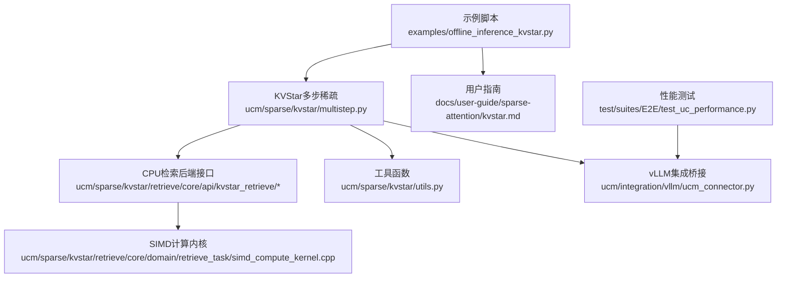
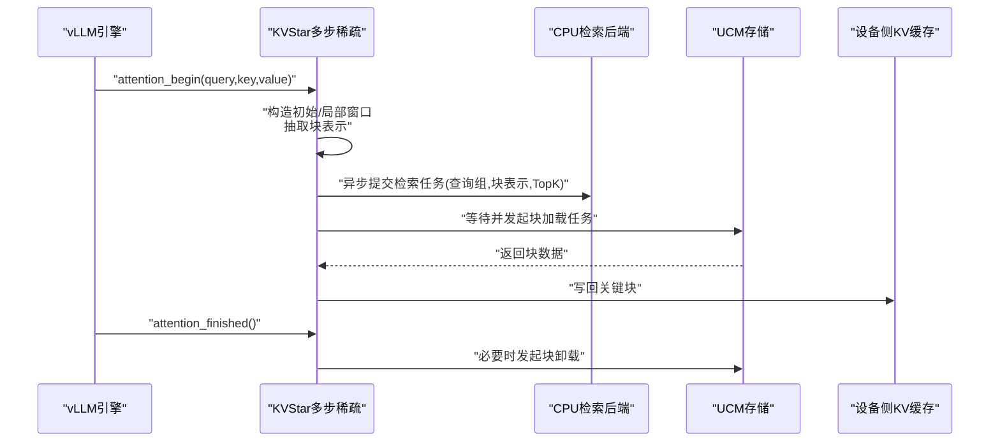
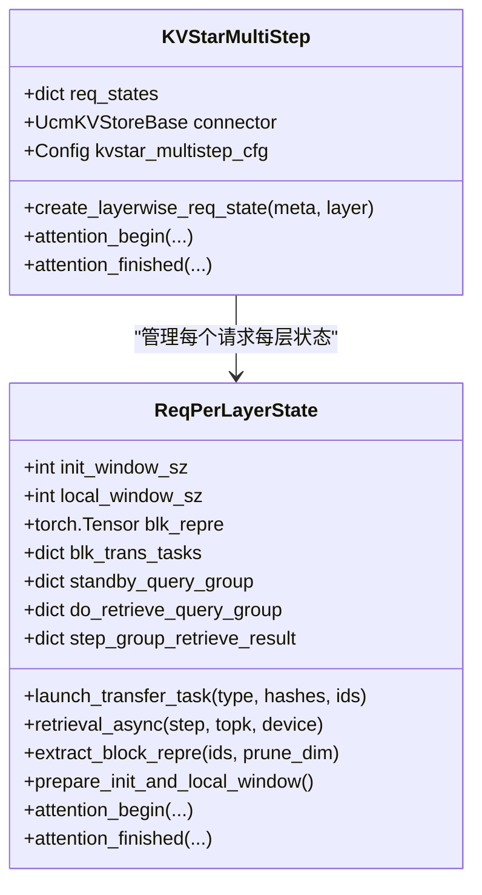
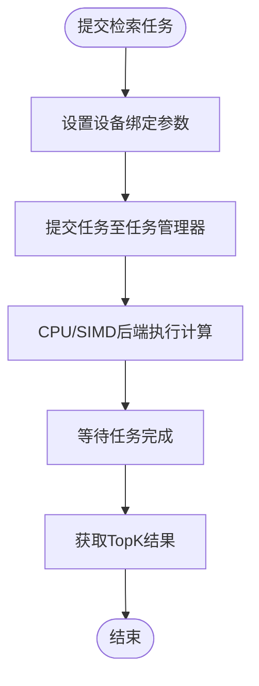
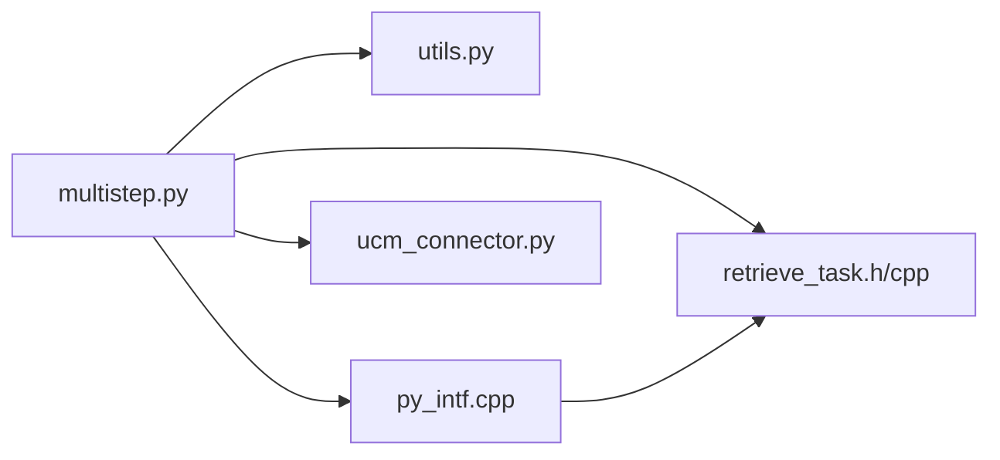

# KVStar算法示例

<cite>
**本文引用的文件**
- [examples/offline_inference_kvstar.py](file://examples/offline_inference_kvstar.py)
- [docs/user-guide/sparse-attention/kvstar.md](file://docs/user-guide/sparse-attention/kvstar.md)
- [ucm/sparse/kvstar/multistep.py](file://ucm/sparse/kvstar/multistep.py)
- [ucm/sparse/kvstar/utils.py](file://ucm/sparse/kvstar/utils.py)
- [ucm/sparse/kvstar/retrieve/core/api/kvstar_retrieve/kvstar_retrieve.h](file://ucm/sparse/kvstar/retrieve/core/api/kvstar_retrieve/kvstar_retrieve.h)
- [ucm/sparse/kvstar/retrieve/core/api/kvstar_retrieve/kvstar_retrieve.cpp](file://ucm/sparse/kvstar/retrieve/core/api/kvstar_retrieve/kvstar_retrieve.cpp)
- [ucm/sparse/kvstar/retrieve/core/domain/retrieve_task/retrieve_task.h](file://ucm/sparse/kvstar/retrieve/core/domain/retrieve_task/retrieve_task.h)
- [ucm/sparse/kvstar/retrieve/core/domain/retrieve_task/retrieve_task_manager.h](file://ucm/sparse/kvstar/retrieve/core/domain/retrieve_task/retrieve_task_manager.h)
- [ucm/sparse/kvstar/retrieve/core/domain/retrieve_task/simd_compute_kernel.cpp](file://ucm/sparse/kvstar/retrieve/core/domain/retrieve_task/simd_compute_kernel.cpp)
- [ucm/sparse/kvstar/retrieve/py_intf/py_intf.cpp](file://ucm/sparse/kvstar/retrieve/py_intf/py_intf.cpp)
- [ucm/integration/vllm/ucm_connector.py](file://ucm/integration/vllm/ucm_connector.py)
- [test/suites/E2E/test_uc_performance.py](file://test/suites/E2E/test_uc_performance.py)
</cite>

## 目录
1. [简介](#简介)
2. [项目结构](#项目结构)
3. [核心组件](#核心组件)
4. [架构总览](#架构总览)
5. [详细组件分析](#详细组件分析)
6. [依赖关系分析](#依赖关系分析)
7. [性能考量](#性能考量)
8. [故障排查指南](#故障排查指南)
9. [结论](#结论)
10. [附录](#附录)

## 简介
本文件面向KVStar（KVStar检索）算法的使用者与开发者，提供从配置到运行、从原理到性能的完整示例与说明。KVStar在解码阶段通过“多步粗粒度稀疏检索”“多查询投票”“低维KV表示检索”等机制，在保证高检索精度的同时显著降低KV缓存带宽与显存占用，适用于长序列推理场景。

## 项目结构
KVStar相关代码主要分布在以下模块：
- 示例与用户指南：examples/offline_inference_kvstar.py、docs/user-guide/sparse-attention/kvstar.md
- 核心Python实现：ucm/sparse/kvstar/multistep.py、ucm/sparse/kvstar/utils.py
- 检索C++后端与Python绑定：ucm/sparse/kvstar/retrieve/core、ucm/sparse/kvstar/retrieve/py_intf/py_intf.cpp
- vLLM集成桥接：ucm/integration/vllm/ucm_connector.py
- 性能测试：test/suites/E2E/test_uc_performance.py

图表来源
- [examples/offline_inference_kvstar.py](file://examples/offline_inference_kvstar.py#L64-L110)
- [ucm/sparse/kvstar/multistep.py](file://ucm/sparse/kvstar/multistep.py#L645-L712)
- [ucm/sparse/kvstar/retrieve/core/api/kvstar_retrieve/kvstar_retrieve.h](file://ucm/sparse/kvstar/retrieve/core/api/kvstar_retrieve/kvstar_retrieve.h#L14-L25)
- [ucm/sparse/kvstar/retrieve/core/domain/retrieve_task/simd_compute_kernel.cpp](file://ucm/sparse/kvstar/retrieve/core/domain/retrieve_task/simd_compute_kernel.cpp#L1-L44)
- [ucm/sparse/kvstar/utils.py](file://ucm/sparse/kvstar/utils.py#L167-L243)
- [ucm/integration/vllm/ucm_connector.py](file://ucm/integration/vllm/ucm_connector.py#L125-L200)
- [docs/user-guide/sparse-attention/kvstar.md](file://docs/user-guide/sparse-attention/kvstar.md#L30-L76)
- [test/suites/E2E/test_uc_performance.py](file://test/suites/E2E/test_uc_performance.py#L30-L91)

章节来源
- [examples/offline_inference_kvstar.py](file://examples/offline_inference_kvstar.py#L1-L173)
- [docs/user-guide/sparse-attention/kvstar.md](file://docs/user-guide/sparse-attention/kvstar.md#L1-L85)

## 核心组件
- 多步稀疏注意力KVStarMultiStep：负责请求级状态管理、窗口构建、块表示抽取、异步检索与传输调度。
- 检索任务系统：封装查询组、块表示、维度裁剪索引、Top-K结果与等待器，支持CPU/SIMD后端执行。
- 工具函数：块哈希、层偏移计算、CPU亲和绑定、物理拓扑解析。
- vLLM桥接：将KVStar与vLLM统一注意力流程对接，注入KV缓存块表示与检索结果。
- 示例脚本：演示如何配置KVStar参数、存储后端与运行长序列推理。

章节来源
- [ucm/sparse/kvstar/multistep.py](file://ucm/sparse/kvstar/multistep.py#L645-L800)
- [ucm/sparse/kvstar/retrieve/core/domain/retrieve_task/retrieve_task.h](file://ucm/sparse/kvstar/retrieve/core/domain/retrieve_task/retrieve_task.h#L20-L45)
- [ucm/sparse/kvstar/utils.py](file://ucm/sparse/kvstar/utils.py#L1-L244)
- [ucm/integration/vllm/ucm_connector.py](file://ucm/integration/vllm/ucm_connector.py#L125-L200)
- [examples/offline_inference_kvstar.py](file://examples/offline_inference_kvstar.py#L64-L110)

## 架构总览
KVStar在解码阶段以“多步稀疏检索”为核心，将KV缓存离线化，仅保留初始窗口与局部窗口在设备侧，其余块通过CPU多核与SIMD加速异步检索与加载。其关键路径包括：
- 预填充阶段：对预填充末尾若干token进行离线缓存，同时抽取块表示。
- 解码阶段：按步长周期性触发检索，多查询投票确定候选块，异步发起加载，替换不重要块。
- 存储交互：通过UCM存储桥接完成块级加载/卸载，支持NFS等后端。

图表来源
- [ucm/sparse/kvstar/multistep.py](file://ucm/sparse/kvstar/multistep.py#L356-L400)
- [ucm/sparse/kvstar/multistep.py](file://ucm/sparse/kvstar/multistep.py#L422-L494)
- [ucm/sparse/kvstar/retrieve/core/api/kvstar_retrieve/kvstar_retrieve.cpp](file://ucm/sparse/kvstar/retrieve/core/api/kvstar_retrieve/kvstar_retrieve.cpp#L21-L37)
- [ucm/integration/vllm/ucm_connector.py](file://ucm/integration/vllm/ucm_connector.py#L125-L200)

## 详细组件分析

### KVStar多步稀疏实现（ReqPerLayerState）
- 请求级状态：记录请求ID、批内索引、token计数、块ID列表、检索步长等。
- 窗口管理：维护初始窗口与局部窗口，确保关键上下文始终驻留设备侧。
- 块表示抽取：对中间块区域进行通道维度裁剪与内部token聚合，降低检索开销。
- 异步检索与加载：按步长周期触发，多查询组投票，CPU后端异步计算TopK，随后发起块加载任务。
- 结果匹配与去重：避免重复块的多次传输，提升带宽利用率。

图表来源
- [ucm/sparse/kvstar/multistep.py](file://ucm/sparse/kvstar/multistep.py#L184-L234)
- [ucm/sparse/kvstar/multistep.py](file://ucm/sparse/kvstar/multistep.py#L645-L712)

章节来源
- [ucm/sparse/kvstar/multistep.py](file://ucm/sparse/kvstar/multistep.py#L184-L503)
- [ucm/sparse/kvstar/multistep.py](file://ucm/sparse/kvstar/multistep.py#L505-L597)

### 检索任务系统与SIMD内核
- 任务定义：包含查询组、块表示、可选维度裁剪索引、TopK、请求ID、设备类型等字段。
- 任务管理：支持任务提交、等待、结果获取与线程池分发。
- 设备绑定：通过SetupParam配置NUMA节点与CPU核心绑定信息，控制后端线程亲和。
- SIMD加速：针对半精度浮点实现向量化最大值等操作，提升相似度计算效率。

图表来源
- [ucm/sparse/kvstar/retrieve/core/domain/retrieve_task/retrieve_task.h](file://ucm/sparse/kvstar/retrieve/core/domain/retrieve_task/retrieve_task.h#L20-L45)
- [ucm/sparse/kvstar/retrieve/core/api/kvstar_retrieve/kvstar_retrieve.cpp](file://ucm/sparse/kvstar/retrieve/core/api/kvstar_retrieve/kvstar_retrieve.cpp#L21-L37)
- [ucm/sparse/kvstar/retrieve/core/domain/retrieve_task/simd_compute_kernel.cpp](file://ucm/sparse/kvstar/retrieve/core/domain/retrieve_task/simd_compute_kernel.cpp#L1-L44)

章节来源
- [ucm/sparse/kvstar/retrieve/core/domain/retrieve_task/retrieve_task_manager.h](file://ucm/sparse/kvstar/retrieve/core/domain/retrieve_task/retrieve_task_manager.h#L11-L33)
- [ucm/sparse/kvstar/retrieve/core/api/kvstar_retrieve/kvstar_retrieve.h](file://ucm/sparse/kvstar/retrieve/core/api/kvstar_retrieve/kvstar_retrieve.h#L14-L25)
- [ucm/sparse/kvstar/retrieve/core/domain/retrieve_task/simd_compute_kernel.cpp](file://ucm/sparse/kvstar/retrieve/core/domain/retrieve_task/simd_compute_kernel.cpp#L1-L44)

### vLLM集成桥接
- 连接器初始化：解析UCM配置，创建存储实例，设置指标日志。
- 请求哈希：基于模型元信息与rank生成稳定块ID，用于跨层一致性。
- 数据流对接：在统一注意力前后钩子中注入KVStar状态，协调块表示与检索结果。

章节来源
- [ucm/integration/vllm/ucm_connector.py](file://ucm/integration/vllm/ucm_connector.py#L125-L200)
- [ucm/integration/vllm/ucm_connector.py](file://ucm/integration/vllm/ucm_connector.py#L65-L80)

### 示例：KVStar配置与运行
- 环境变量：启用稀疏、设置模型路径、数据集路径与存储目录。
- KVTransferConfig：指定UCM连接器、存储后端、稀疏配置KVStarMultiStep参数。
- 运行推理：批量生成提示，两次调用验证稳定性与可重复性。

章节来源
- [examples/offline_inference_kvstar.py](file://examples/offline_inference_kvstar.py#L24-L62)
- [examples/offline_inference_kvstar.py](file://examples/offline_inference_kvstar.py#L64-L110)
- [examples/offline_inference_kvstar.py](file://examples/offline_inference_kvstar.py#L129-L173)

## 依赖关系分析
KVStar多步稀疏模块与检索后端、工具函数、vLLM桥接之间存在清晰的依赖关系：
- multistep.py依赖utils.py中的哈希与CPU绑定工具，以及retrieve后端的异步接口。
- 检索后端通过pybind绑定暴露给Python侧，供multistep调用。
- ucm_connector.py负责与vLLM统一注意力流程对接，传递KV缓存与请求元数据。

图表来源
- [ucm/sparse/kvstar/multistep.py](file://ucm/sparse/kvstar/multistep.py#L14-L28)
- [ucm/sparse/kvstar/utils.py](file://ucm/sparse/kvstar/utils.py#L167-L243)
- [ucm/sparse/kvstar/retrieve/core/domain/retrieve_task/retrieve_task.h](file://ucm/sparse/kvstar/retrieve/core/domain/retrieve_task/retrieve_task.h#L20-L45)
- [ucm/sparse/kvstar/retrieve/py_intf/py_intf.cpp](file://ucm/sparse/kvstar/retrieve/py_intf/py_intf.cpp#L88-L103)
- [ucm/integration/vllm/ucm_connector.py](file://ucm/integration/vllm/ucm_connector.py#L125-L200)

章节来源
- [ucm/sparse/kvstar/multistep.py](file://ucm/sparse/kvstar/multistep.py#L14-L28)
- [ucm/sparse/kvstar/retrieve/py_intf/py_intf.cpp](file://ucm/sparse/kvstar/retrieve/py_intf/py_intf.cpp#L88-L103)

## 性能考量
- 检索频率与带宽：通过retrieval_stride降低GPU与存储间交互频次，减少带宽与同步开销。
- 稀疏比例与显存：sparse_ratio控制设备侧常驻块比例，平衡显存占用与检索精度。
- 维度裁剪与聚合：blk_repre_dim_prune_ratio与blk_repre_inner_token_merge降低块表示维度与计算量。
- CPU亲和与SIMD：合理绑定NUMA与核心，利用NEON/FP16向量化提升检索吞吐。
- 长序列优化：初始窗口与局部窗口确保关键上下文，结合多查询投票缓解稀疏带来的精度损失。

章节来源
- [docs/user-guide/sparse-attention/kvstar.md](file://docs/user-guide/sparse-attention/kvstar.md#L30-L85)
- [ucm/sparse/kvstar/multistep.py](file://ucm/sparse/kvstar/multistep.py#L290-L327)
- [ucm/sparse/kvstar/utils.py](file://ucm/sparse/kvstar/utils.py#L167-L243)
- [ucm/sparse/kvstar/retrieve/core/domain/retrieve_task/simd_compute_kernel.cpp](file://ucm/sparse/kvstar/retrieve/core/domain/retrieve_task/simd_compute_kernel.cpp#L1-L44)

## 故障排查指南
- 检索任务失败：检查任务管理器返回状态与错误信息，确认查询组与块表示形状一致。
- CPU绑定异常：核对NUMA节点数量与核心分配比例，确保每rank至少获得所需核心。
- 存储后端不可用：确认存储路径与权限，查看加载/卸载任务是否成功完成。
- 精度下降：适当提高sparse_ratio或减小retrieval_stride，或增加局部窗口大小。

章节来源
- [ucm/sparse/kvstar/retrieve/py_intf/py_intf.cpp](file://ucm/sparse/kvstar/retrieve/py_intf/py_intf.cpp#L67-L84)
- [ucm/sparse/kvstar/utils.py](file://ucm/sparse/kvstar/utils.py#L167-L243)
- [ucm/integration/vllm/ucm_connector.py](file://ucm/integration/vllm/ucm_connector.py#L125-L200)

## 结论
KVStar通过“多步稀疏检索+多查询投票+低维表示”的组合策略，在长序列推理中实现了高精度与低带宽的平衡。配合合理的参数配置与硬件亲和，可在多种设备上取得稳定的吞吐与延迟表现。建议在实际部署中结合业务场景微调稀疏比例、检索步长与维度裁剪策略，并持续监控检索命中率与带宽使用情况。

## 附录

### 使用示例：KVStar配置要点
- 启用稀疏与设置模型路径、数据集路径与存储目录。
- 在KVTransferConfig中配置ucm_sparse_config，设置KVStarMultiStep关键参数：
  - init_window_sz：初始窗口大小（不参与稀疏）
  - local_window_sz：局部窗口大小（不参与稀疏）
  - sparse_ratio：设备侧常驻块比例
  - retrieval_stride：检索/更新频率（以解码步为单位）
  - blk_repre_dim_prune_ratio：块表示通道维度裁剪比例
  - blk_repre_inner_token_merge：块内token聚合粒度
- 运行示例脚本进行长序列推理，观察生成耗时与稳定性。

章节来源
- [examples/offline_inference_kvstar.py](file://examples/offline_inference_kvstar.py#L64-L110)
- [docs/user-guide/sparse-attention/kvstar.md](file://docs/user-guide/sparse-attention/kvstar.md#L41-L76)

### 性能测试与评估
- 使用性能测试套件收集端到端延迟、吞吐、首次字耗时等指标。
- 可结合LongBench等基准评估KVStar在不同模型与硬件上的精度与性能表现。

章节来源
- [test/suites/E2E/test_uc_performance.py](file://test/suites/E2E/test_uc_performance.py#L30-L91)
- [docs/user-guide/sparse-attention/kvstar.md](file://docs/user-guide/sparse-attention/kvstar.md#L71-L85)