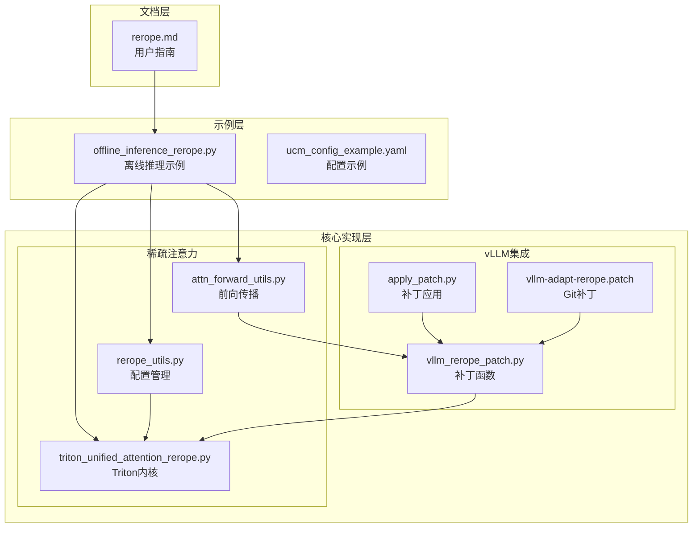
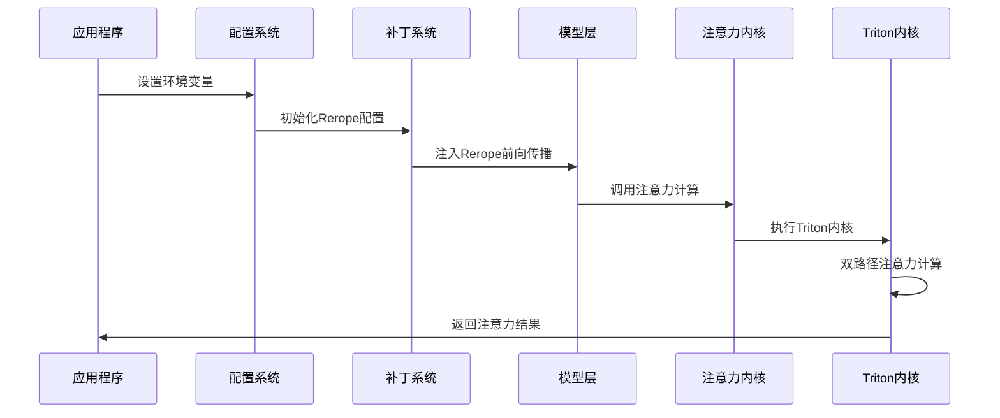
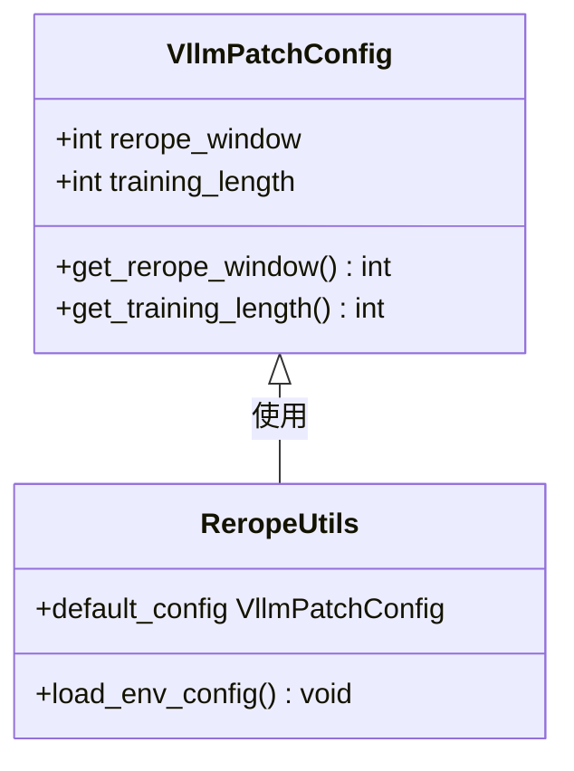
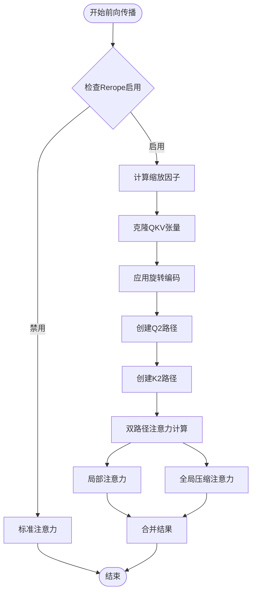
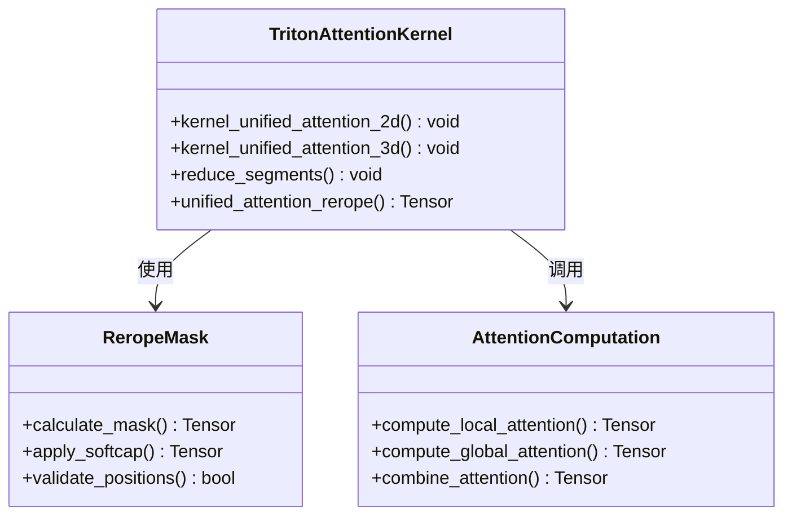
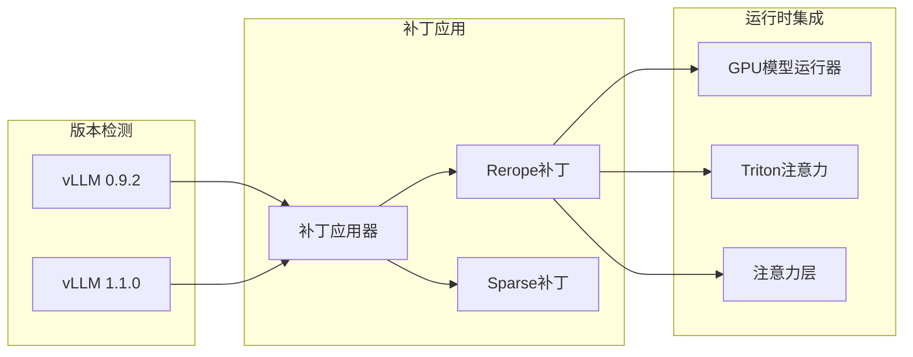
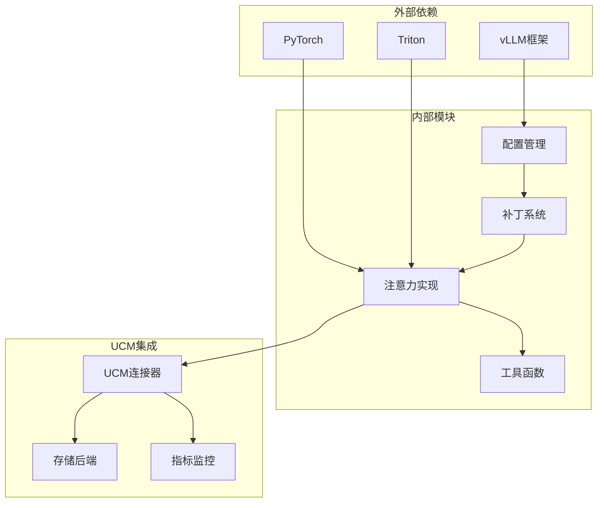

# Rerope算法示例

<cite>
**本文档引用的文件**
- [rerope.md](file://docs/source/user-guide/rerope/rerope.md)
- [offline_inference_rerope.py](file://examples/offline_inference_rerope.py)
- [rerope_utils.py](file://ucm/sparse/rerope/rerope_utils.py)
- [triton_unified_attention_rerope.py](file://ucm/sparse/rerope/triton_unified_attention_rerope.py)
- [attn_forward_utils.py](file://ucm/sparse/rerope/attn_forward_utils.py)
- [vllm_rerope_patch.py](file://ucm/integration/vllm/patch/patch_funcs/v092/vllm_rerope_patch.py)
- [apply_patch.py](file://ucm/integration/vllm/patch/apply_patch.py)
- [vllm-adapt-rerope.patch](file://ucm/integration/vllm/patch/0.11.0/vllm-adapt-rerope.patch)
- [ucm_config_example.yaml](file://examples/ucm_config_example.yaml)
</cite>

## 目录
1. [简介](#简介)
2. [项目结构](#项目结构)
3. [核心组件](#核心组件)
4. [架构概览](#架构概览)
5. [详细组件分析](#详细组件分析)
6. [依赖关系分析](#依赖关系分析)
7. [性能考虑](#性能考虑)
8. [故障排除指南](#故障排除指南)
9. [结论](#结论)
10. [附录](#附录)

## 简介

Rerope（Rectified Rotary Position Embeddings）是Rerope旋转位置编码算法的详细使用示例文档。该算法通过结合直接外推和位置插值来扩展大语言模型的上下文长度，无需微调即可支持任意长度的上下文。

Rerope算法的核心创新在于：
- 使用窗口大小w建立位置间隔为1的局部窗口
- 在窗口外部使用间隔为1/k的插值策略
- 通过双注意力机制实现局部精细注意力和全局压缩注意力
- 支持训练时长的动态缩放因子

该实现基于Triton内核优化，在vLLM推理框架中提供了高性能的长序列处理能力。

## 项目结构

Rerope算法在统一缓存管理（UCM）项目中的组织结构如下：



**图表来源**
- [rerope.md](file://docs/source/user-guide/rerope/rerope.md#L1-L109)
- [offline_inference_rerope.py](file://examples/offline_inference_rerope.py#L1-L194)
- [rerope_utils.py](file://ucm/sparse/rerope/rerope_utils.py#L1-L16)
- [triton_unified_attention_rerope.py](file://ucm/sparse/rerope/triton_unified_attention_rerope.py#L1-L885)

**章节来源**
- [rerope.md](file://docs/source/user-guide/rerope/rerope.md#L1-L109)
- [offline_inference_rerope.py](file://examples/offline_inference_rerope.py#L1-L194)

## 核心组件

### 配置管理系统

Rerope算法的配置管理通过环境变量驱动，主要包含以下关键参数：

| 参数名称 | 默认值 | 描述 | 作用域 |
|---------|--------|------|--------|
| VLLM_USE_REROPE | false | 启用Rerope功能开关 | 全局 |
| REROPE_WINDOW | 32768 | Rerope窗口大小 | 模型级 |
| TRAINING_LENGTH | 32768 | 训练时长参数 | 模型级 |

### Triton注意力内核

算法的核心实现位于Triton内核中，提供了两种主要的注意力计算路径：

1. **标准注意力路径**：使用传统的cos/sin旋转编码
2. **Rerope注意力路径**：使用双路径注意力机制

**章节来源**
- [rerope_utils.py](file://ucm/sparse/rerope/rerope_utils.py#L4-L15)
- [triton_unified_attention_rerope.py](file://ucm/sparse/rerope/triton_unified_attention_rerope.py#L681-L885)

## 架构概览

Rerope算法的整体架构采用分层设计，从底层硬件加速到高层应用接口形成完整的处理链路：



**图表来源**
- [apply_patch.py](file://ucm/integration/vllm/patch/apply_patch.py#L84-L137)
- [vllm_rerope_patch.py](file://ucm/integration/vllm/patch/patch_funcs/v092/vllm_rerope_patch.py#L36-L50)
- [triton_unified_attention_rerope.py](file://ucm/sparse/rerope/triton_unified_attention_rerope.py#L1129-L1151)

## 详细组件分析

### Rerope配置管理器

配置管理器负责从环境变量中读取Rerope相关参数，并提供类型安全的访问接口：



**图表来源**
- [rerope_utils.py](file://ucm/sparse/rerope/rerope_utils.py#L4-L15)

### 前向传播流程

Rerope算法的前向传播过程涉及复杂的多路径注意力计算：



**图表来源**
- [attn_forward_utils.py](file://ucm/sparse/rerope/attn_forward_utils.py#L8-L39)
- [vllm_rerope_patch.py](file://ucm/integration/vllm/patch/patch_funcs/v092/vllm_rerope_patch.py#L419-L451)

### Triton内核实现

Triton内核提供了高度优化的注意力计算实现，支持双路径注意力机制：



**图表来源**
- [triton_unified_attention_rerope.py](file://ucm/sparse/rerope/triton_unified_attention_rerope.py#L55-L315)
- [triton_unified_attention_rerope.py](file://ucm/sparse/rerope/triton_unified_attention_rerope.py#L317-L597)

**章节来源**
- [attn_forward_utils.py](file://ucm/sparse/rerope/attn_forward_utils.py#L8-L39)
- [triton_unified_attention_rerope.py](file://ucm/sparse/rerope/triton_unified_attention_rerope.py#L55-L315)

### vLLM集成补丁

vLLM集成通过补丁系统自动适配不同版本的vLLM框架：



**图表来源**
- [apply_patch.py](file://ucm/integration/vllm/patch/apply_patch.py#L59-L115)
- [vllm_rerope_patch.py](file://ucm/integration/vllm/patch/patch_funcs/v092/vllm_rerope_patch.py#L36-L50)

**章节来源**
- [apply_patch.py](file://ucm/integration/vllm/patch/apply_patch.py#L84-L137)
- [vllm_rerope_patch.py](file://ucm/integration/vllm/patch/patch_funcs/v092/vllm_rerope_patch.py#L805-L1180)

## 依赖关系分析

Rerope算法的依赖关系呈现多层次的模块化结构：



**图表来源**
- [apply_patch.py](file://ucm/integration/vllm/patch/apply_patch.py#L1-L192)
- [offline_inference_rerope.py](file://examples/offline_inference_rerope.py#L1-L194)

**章节来源**
- [offline_inference_rerope.py](file://examples/offline_inference_rerope.py#L45-L82)

## 性能考虑

### 计算效率优化

Rerope算法在多个层面实现了性能优化：

1. **内存访问优化**：通过分块缓存减少内存带宽压力
2. **并行计算**：利用GPU的并行计算能力处理多头注意力
3. **混合精度支持**：支持FP16和BF16以提高计算速度
4. **内核融合**：将多个操作融合到单个Triton内核中

### 内存使用优化

- **KV缓存压缩**：Rerope模式下KV缓存大小增加约3倍
- **分页机制**：使用分页存储减少内存碎片
- **动态分配**：根据实际需求动态分配缓存空间

### 长序列处理优势

Rerope算法在长序列处理方面具有显著优势：
- 支持任意长度的上下文，突破传统位置编码限制
- 通过双路径注意力平衡计算复杂度和准确性
- 在保持模型性能的同时显著扩展上下文长度

## 故障排除指南

### 常见问题及解决方案

| 问题类型 | 症状 | 可能原因 | 解决方案 |
|---------|------|---------|---------|
| 环境变量未设置 | Rerope功能未生效 | VLLM_USE_REROPE未设置 | 设置VLLM_USE_REROPE=true |
| 内存不足 | 运行时内存溢出 | KV缓存过大 | 调整REROPE_WINDOW参数 |
| 性能下降 | 推理速度慢 | 缺少Triton支持 | 确保Triton正确安装 |
| 版本不兼容 | 补丁应用失败 | vLLM版本不匹配 | 使用支持的vLLM版本 |

### 调试技巧

1. **启用详细日志**：设置`VLLM_LOG_LEVEL=DEBUG`获取详细信息
2. **验证环境变量**：使用`echo $VLLM_USE_REROPE`检查配置
3. **检查内存使用**：监控GPU内存使用情况
4. **性能分析**：使用`nvprof`或`nvidia-smi`分析性能瓶颈

**章节来源**
- [apply_patch.py](file://ucm/integration/vllm/patch/apply_patch.py#L183-L192)

## 结论

Rerope算法作为先进的位置编码技术，在统一缓存管理（UCM）项目中展现了强大的长序列处理能力。通过精心设计的架构和优化的实现，该算法在保持模型性能的同时显著扩展了上下文长度限制。

主要优势包括：
- **无损扩展**：无需微调即可支持任意长度上下文
- **高效实现**：基于Triton内核的高性能计算
- **灵活配置**：通过环境变量轻松调整参数
- **完整集成**：与vLLM框架无缝集成

未来发展方向：
- 进一步优化内存使用效率
- 支持更多模型架构
- 增强实时推理能力
- 扩展到更多硬件平台

## 附录

### 快速开始指南

```bash
# 设置环境变量
export VLLM_USE_REROPE=true
export REROPE_WINDOW=32768
export TRAINING_LENGTH=32768

# 运行示例
python examples/offline_inference_rerope.py
```

### 配置参考

UCM配置文件示例：
```yaml
ucm_connectors:
  - ucm_connector_name: "UcmNfsStore"
    ucm_connector_config:
      storage_backends: "/mnt/test"
      io_direct: false
```

**章节来源**
- [rerope.md](file://docs/source/user-guide/rerope/rerope.md#L57-L93)
- [ucm_config_example.yaml](file://examples/ucm_config_example.yaml#L1-L39)