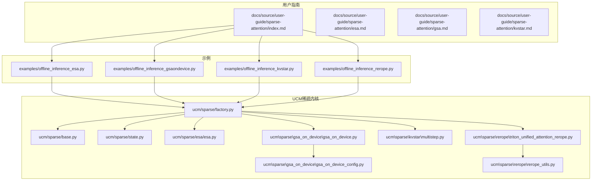
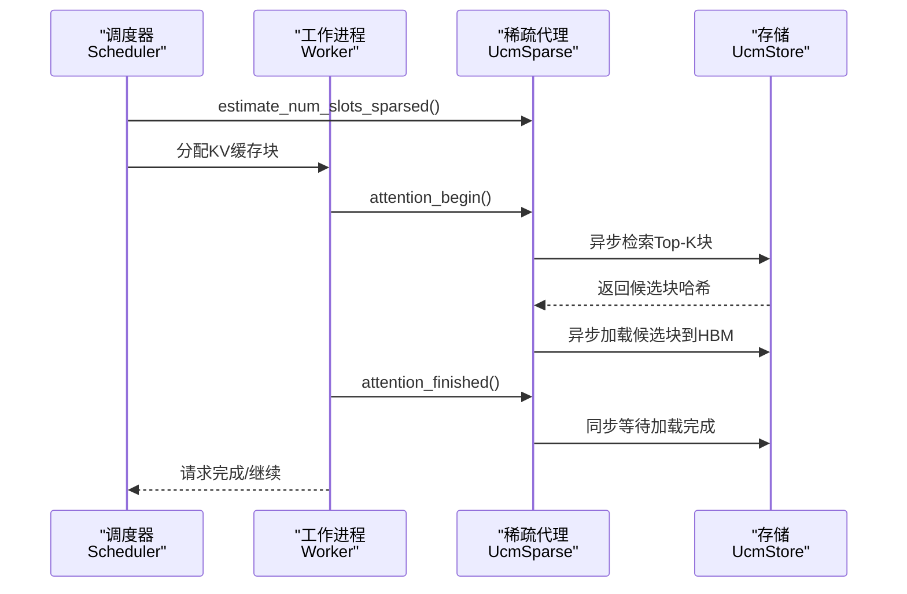
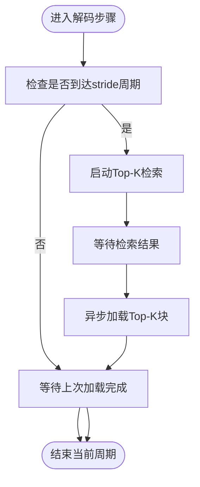
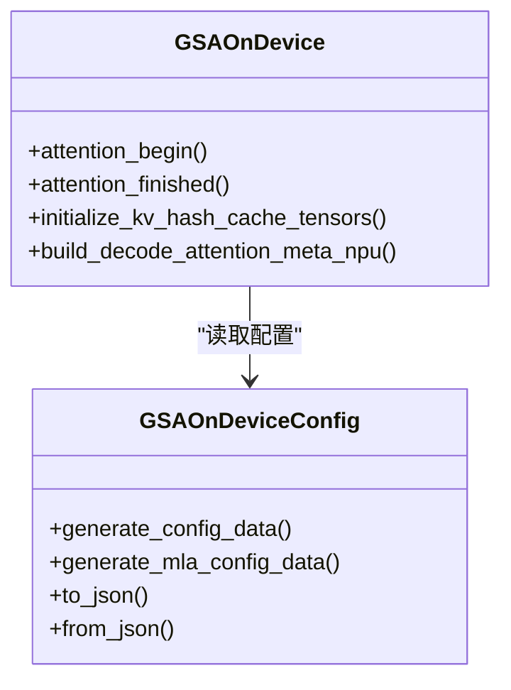
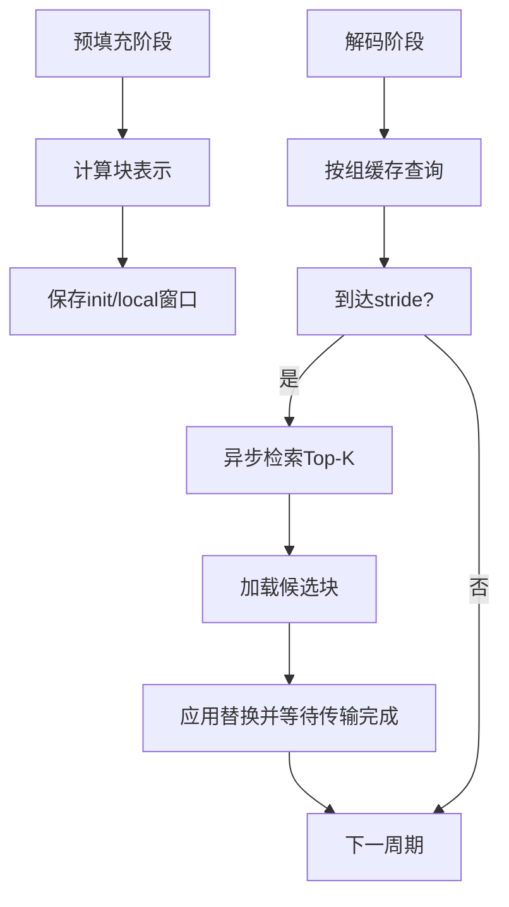
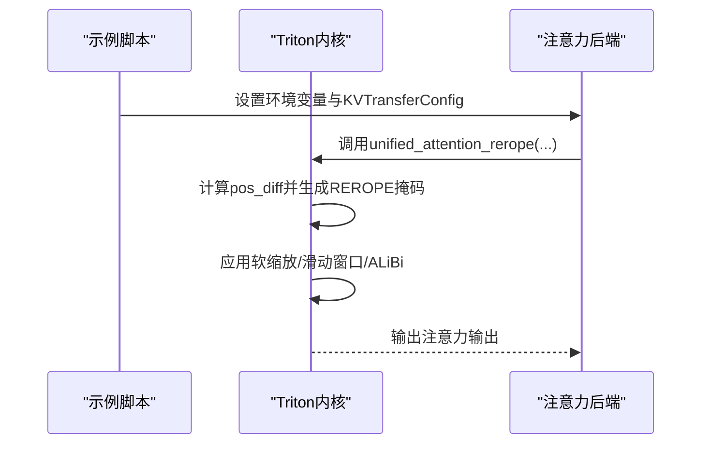
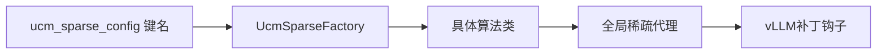

# 稀疏算法示例

<cite>
**本文引用的文件**   
- [docs\source\user-guide\sparse-attention\index.md](file://docs\source\user-guide\sparse-attention\index.md)
- [docs\source\user-guide\sparse-attention\esa.md](file://docs\source\user-guide\sparse-attention\esa.md)
- [docs\source\user-guide\sparse-attention\gsa.md](file://docs\source\user-guide\sparse-attention\gsa.md)
- [docs\source\user-guide\sparse-attention\kvstar.md](file://docs\source\user-guide\sparse-attention\kvstar.md)
- [examples\offline_inference_esa.py](file://examples\offline_inference_esa.py)
- [examples\offline_inference_gsaondevice.py](file://examples\offline_inference_gsaondevice.py)
- [examples\offline_inference_kvstar.py](file://examples\offline_inference_kvstar.py)
- [examples\offline_inference_rerope.py](file://examples\offline_inference_rerope.py)
- [ucm\sparse\factory.py](file://ucm\sparse\factory.py)
- [ucm\sparse\base.py](file://ucm\sparse\base.py)
- [ucm\sparse\state.py](file://ucm\sparse\state.py)
- [ucm\sparse\esa\esa.py](file://ucm\sparse\esa\esa.py)
- [ucm\sparse\gsa_on_device\gsa_on_device.py](file://ucm\sparse\gsa_on_device\gsa_on_device.py)
- [ucm\sparse\gsa_on_device\gsa_on_device_config.py](file://ucm\sparse\gsa_on_device\gsa_on_device_config.py)
- [ucm\sparse\kvstar\multistep.py](file://ucm\sparse\kvstar\multistep.py)
- [ucm\sparse\rerope\triton_unified_attention_rerope.py](file://ucm\sparse\rerope\triton_unified_attention_rerope.py)
- [ucm\sparse\rerope\rerope_utils.py](file://ucm\sparse\rerope\rerope_utils.py)
- [ucm\integration\vllm\patch\0.9.2\vllm-adapt-sparse.patch](file://ucm\integration\vllm\patch\0.9.2\vllm-adapt-sparse.patch)
</cite>

## 目录
1. [简介](#简介)
2. [项目结构](#项目结构)
3. [核心组件](#核心组件)
4. [架构总览](#架构总览)
5. [详细组件分析](#详细组件分析)
6. [依赖关系分析](#依赖关系分析)
7. [性能与优化建议](#性能与优化建议)
8. [故障排查指南](#故障排查指南)
9. [结论](#结论)
10. [附录](#附录)

## 简介
本文件面向希望在UCM框架下启用与配置稀疏注意力算法的开发者，系统性介绍四种稀疏算法（ESA、GSA On Device、KVStar、Rerope）的使用方法、配置参数、适用场景与性能特征，并提供可直接参考的示例工程路径与关键实现位置，帮助在不同硬件平台与模型形态（如MLA与GQA）下做出合理选择。

## 项目结构
UCM通过统一的稀疏注意力框架，将调度侧与工作侧的稀疏控制与KV缓存传输解耦，支持多种稀疏策略的插拔式接入。稀疏注意力相关文档位于用户指南目录，示例脚本位于examples目录，核心实现位于ucm/sparse子模块。

**图表来源**
- [docs\source\user-guide\sparse-attention\index.md](file://docs\source\user-guide\sparse-attention\index.md#L1-L46)
- [examples\offline_inference_esa.py](file://examples\offline_inference_esa.py#L63-L111)
- [examples\offline_inference_gsaondevice.py](file://examples\offline_inference_gsaondevice.py#L64-L102)
- [examples\offline_inference_kvstar.py](file://examples\offline_inference_kvstar.py#L64-L110)
- [examples\offline_inference_rerope.py](file://examples\offline_inference_rerope.py#L46-L82)
- [ucm\sparse\factory.py](file://ucm\sparse\factory.py#L13-L57)
- [ucm\sparse\base.py](file://ucm\sparse\base.py#L127-L323)
- [ucm\sparse\state.py](file://ucm\sparse\state.py#L27-L76)
- [ucm\sparse\esa\esa.py](file://ucm\sparse\esa\esa.py#L421-L520)
- [ucm\sparse\gsa_on_device\gsa_on_device.py](file://ucm\sparse\gsa_on_device\gsa_on_device.py#L99-L150)
- [ucm\sparse\gsa_on_device\gsa_on_device_config.py](file://ucm\sparse\gsa_on_device\gsa_on_device_config.py#L36-L91)
- [ucm\sparse\kvstar\multistep.py](file://ucm\sparse\kvstar\multistep.py#L645-L720)
- [ucm\sparse\rerope\triton_unified_attention_rerope.py](file://ucm\sparse\rerope\triton_unified_attention_rerope.py#L681-L720)

**章节来源**
- [docs\source\user-guide\sparse-attention\index.md](file://docs\source\user-guide\sparse-attention\index.md#L1-L46)

## 核心组件
- 统一接口与角色定义：UcmSparseBase定义了调度侧与工作侧的生命周期钩子，包括请求开始、估计块数、构建稀疏元数据、注意力前后钩子等；UcmSparseRole区分调度器与工作进程。
- 工厂注册与实例化：UcmSparseFactory根据ucm_sparse_config中的键名动态加载对应算法类，完成实例化。
- 全局状态管理：ensure_ucm_sparse_initialized负责按角色初始化全局稀疏代理；get_ucm_sparse提供统一访问入口。
- 算法实现：ESA、GSA On Device、KVStar、Rerope分别在各自模块中实现注意力稀疏策略与KV缓存传输细节。

**章节来源**
- [ucm\sparse\base.py](file://ucm\sparse\base.py#L127-L323)
- [ucm\sparse\factory.py](file://ucm\sparse\factory.py#L13-L57)
- [ucm\sparse\state.py](file://ucm\sparse\state.py#L27-L76)

## 架构总览
UCM稀疏注意力的整体流程如下：调度侧估算稀疏所需块数并分配缓存；工作侧在注意力执行前后插入稀疏逻辑，按策略异步检索与加载KV块，减少HBM占用并提升吞吐。

**图表来源**
- [ucm\sparse\base.py](file://ucm\sparse\base.py#L185-L230)
- [ucm\sparse\state.py](file://ucm\sparse\state.py#L27-L76)
- [ucm\sparse\factory.py](file://ucm\sparse\factory.py#L30-L44)

## 详细组件分析

### ESA（简单稀疏注意力）
- 概述：以均值聚合块表示，周期性检索Top-K块并异步加载，适合长上下文与较低延迟要求的场景。
- 关键参数（ucm_sparse_config["ESA"]）：
  - init_window_sz：初始窗口块数（不参与稀疏）
  - local_window_sz：局部窗口块数（不参与稀疏）
  - min_blocks：最小块阈值，低于此值的请求不启用稀疏
  - sparse_ratio：稀疏比例（保留比例）
  - retrieval_stride：检索周期（步）
- 示例与配置参考：
  - 示例命令与基础配置参见：[docs\source\user-guide\sparse-attention\esa.md](file://docs\source\user-guide\sparse-attention\esa.md#L9-L42)
  - 示例脚本中KVTransferConfig与ucm_sparse_config设置参见：[examples\offline_inference_esa.py](file://examples\offline_inference_esa.py#L63-L111)
- 实现要点：
  - 预填充阶段：计算块级表示并缓存
  - 解码阶段：按stride周期启动检索与加载任务，注意避免阻塞
  - 估计块数：基于init/local窗口与稀疏比例估算压缩长度

**图表来源**
- [ucm\sparse\esa\esa.py](file://ucm\sparse\esa\esa.py#L272-L322)
- [ucm\sparse\esa\esa.py](file://ucm\sparse\esa\esa.py#L364-L419)

**章节来源**
- [docs\source\user-guide\sparse-attention\esa.md](file://docs\source\user-guide\sparse-attention\esa.md#L1-L98)
- [examples\offline_inference_esa.py](file://examples\offline_inference_esa.py#L63-L111)
- [ucm\sparse\esa\esa.py](file://ucm\sparse\esa\esa.py#L421-L520)

### GSA On Device（设备端几何稀疏）
- 概述：在设备侧（CUDA/NPU）直接计算哈希并进行汉明距离Top-K检索，结合MLA/GQA两种模型形态，支持跳层/回滚层配置，降低设备侧计算压力。
- 关键参数（ucm_sparse_config["GSAOnDevice"]）：
  - 通过模型自动匹配配置文件（如DeepSeek R1、Qwen3、QwQ等），无需手动传参
  - 核心约束：vllm_hash_attention_topk需能被block_size整除，且小于max_model_len
- 示例与配置参考：
  - 示例脚本中KVTransferConfig与ucm_sparse_config设置参见：[examples\offline_inference_gsaondevice.py](file://examples\offline_inference_gsaondevice.py#L64-L102)
  - 模型到配置文件映射与校验逻辑参见：[ucm\sparse\gsa_on_device\gsa_on_device.py](file://ucm\sparse\gsa_on_device\gsa_on_device.py#L46-L97)
  - 配置数据结构与字段说明参见：[ucm\sparse\gsa_on_device\gsa_on_device_config.py](file://ucm\sparse\gsa_on_device\gsa_on_device_config.py#L36-L91)
- 实现要点：
  - 设备侧缓存K哈希（bfloat16），按slot_mapping写入
  - 汉明距离Top-K检索，支持MLA与GQA两种模式
  - 支持跳层/回滚层，避免某些层的Top-K计算

**图表来源**
- [ucm\sparse\gsa_on_device\gsa_on_device.py](file://ucm\sparse\gsa_on_device\gsa_on_device.py#L99-L220)
- [ucm\sparse\gsa_on_device\gsa_on_device_config.py](file://ucm\sparse\gsa_on_device\gsa_on_device_config.py#L36-L91)

**章节来源**
- [docs\source\user-guide\sparse-attention\gsa.md](file://docs\source\user-guide\sparse-attention\gsa.md#L1-L152)
- [examples\offline_inference_gsaondevice.py](file://examples\offline_inference_gsaondevice.py#L64-L102)
- [ucm\sparse\gsa_on_device\gsa_on_device.py](file://ucm\sparse\gsa_on_device\gsa_on_device.py#L99-L150)
- [ucm\sparse\gsa_on_device\gsa_on_device_config.py](file://ucm\sparse\gsa_on_device\gsa_on_device_config.py#L36-L91)

### KVStar（多步稀疏检索）
- 概述：在解码阶段采用多步异步检索与加载策略，减少频繁的高带宽交互；支持低维块表示与投票机制，兼顾精度与效率。
- 关键参数（ucm_sparse_config["KVStarMultiStep"]）：
  - init_window_sz：初始窗口块数（不参与稀疏）
  - local_window_sz：局部窗口块数（不参与稀疏）
  - sparse_ratio：保留比例（如0.25）
  - retrieval_stride：检索周期（步）
  - blk_repre_dim_prune_ratio：块表示降维比例
  - blk_repre_inner_token_merge：块内token合并粒度
- 示例与配置参考：
  - 示例命令与基础配置参见：[docs\source\user-guide\sparse-attention\kvstar.md](file://docs\source\user-guide\sparse-attention\kvstar.md#L30-L67)
  - 示例脚本中KVTransferConfig与ucm_sparse_config设置参见：[examples\offline_inference_kvstar.py](file://examples\offline_inference_kvstar.py#L64-L110)
- 实现要点：
  - 预填充阶段：计算块级表示并缓存
  - 解码阶段：按stride周期异步检索Top-K块，使用投票机制更新替换区域
  - 低维表示与块内聚合，降低CPU检索开销

**图表来源**
- [ucm\sparse\kvstar\multistep.py](file://ucm\sparse\kvstar\multistep.py#L356-L420)
- [ucm\sparse\kvstar\multistep.py](file://ucm\sparse\kvstar\multistep.py#L422-L494)

**章节来源**
- [docs\source\user-guide\sparse-attention\kvstar.md](file://docs\source\user-guide\sparse-attention\kvstar.md#L1-L85)
- [examples\offline_inference_kvstar.py](file://examples\offline_inference_kvstar.py#L64-L110)
- [ucm\sparse\kvstar\multistep.py](file://ucm\sparse\kvstar\multistep.py#L645-L720)

### Rerope（旋转位置嵌入增强注意力）
- 概述：通过REROPE窗口掩码在长序列中仅对特定位置差进行注意力计算，结合Triton内核实现高效融合计算，适用于超长上下文与滑动窗口场景。
- 关键参数（环境变量与内核参数）：
  - REROPE_WINDOW：REROPE窗口大小
  - TRAINING_LENGTH：训练长度
  - 内核参数：BLOCK_M、BLOCK_Q、HEAD_SIZE、USE_SOFTCAP、SLIDING_WINDOW等
- 示例与配置参考：
  - 示例脚本中环境变量设置与KVTransferConfig参见：[examples\offline_inference_rerope.py](file://examples\offline_inference_rerope.py#L23-L82)
  - Triton内核实现与调用参见：[ucm\sparse\rerope\triton_unified_attention_rerope.py](file://ucm\sparse\rerope\triton_unified_attention_rerope.py#L681-L720)
  - 环境变量读取工具参见：[ucm\sparse\rerope\rerope_utils.py](file://ucm\sparse\rerope\rerope_utils.py#L4-L16)
- 实现要点：
  - 内核根据查询与键的位置差决定使用S1或S2（REROPE掩码）进行注意力计算
  - 支持软缩放（softcap）、滑动窗口与ALiBi斜率

**图表来源**
- [examples\offline_inference_rerope.py](file://examples\offline_inference_rerope.py#L23-L82)
- [ucm\sparse\rerope\triton_unified_attention_rerope.py](file://ucm\sparse\rerope\triton_unified_attention_rerope.py#L681-L720)
- [ucm\sparse\rerope\rerope_utils.py](file://ucm\sparse\rerope\rerope_utils.py#L4-L16)

**章节来源**
- [examples\offline_inference_rerope.py](file://examples\offline_inference_rerope.py#L23-L82)
- [ucm\sparse\rerope\triton_unified_attention_rerope.py](file://ucm\sparse\rerope\triton_unified_attention_rerope.py#L681-L720)
- [ucm\sparse\rerope\rerope_utils.py](file://ucm\sparse\rerope\rerope_utils.py#L4-L16)

## 依赖关系分析
- 工厂注册：工厂通过名称注册各算法类，运行时依据ucm_sparse_config键名动态实例化。
- 状态管理：ensure_ucm_sparse_initialized在调度/工作进程分别初始化稀疏代理，供后续注意力钩子使用。
- vLLM适配：通过补丁在解码层前后注入稀疏FFN与层级钩子，确保稀疏逻辑贯穿前馈与注意力。

**图表来源**
- [ucm\sparse\factory.py](file://ucm\sparse\factory.py#L30-L44)
- [ucm\sparse\state.py](file://ucm\sparse\state.py#L27-L76)
- [ucm\integration\vllm\patch\0.9.2\vllm-adapt-sparse.patch](file://ucm\integration\vllm\patch\0.9.2\vllm-adapt-sparse.patch#L188-L223)

**章节来源**
- [ucm\sparse\factory.py](file://ucm\sparse\factory.py#L47-L57)
- [ucm\sparse\state.py](file://ucm\sparse\state.py#L27-L76)
- [ucm\integration\vllm\patch\0.9.2\vllm-adapt-sparse.patch](file://ucm\integration\vllm\patch\0.9.2\vllm-adapt-sparse.patch#L188-L223)

## 性能与优化建议
- 通用建议
  - 合理设置retrieval_stride：过小增加检索频率，过大导致上下文相关性下降；建议从8~16起步，结合硬件带宽与CPU能力微调。
  - 控制sparse_ratio：越低HBM占用越少但可能影响精度；ESA/KVStar建议0.2~0.3，GSA On Device由模型配置决定。
  - 块大小与Top-K：确保vllm_hash_attention_topk能被block_size整除，避免额外转换开销。
- 硬件平台
  - CUDA：GSA On Device可充分利用CUDA流与自定义算子；建议开启合适的线程块大小与共享内存。
  - NPU：注意CPU侧检索与设备侧检索的绑定与NUMA亲和，减少跨NUMA通信；适当增大retrieval_stride降低同步开销。
- 模型形态
  - MLA模型：优先使用GSA On Device的MLA分支，利用kv_lora_rank与qk_rope维度组合；合理设置hash_bits与降维比例。
  - GQA模型：关注head数与queries_per_kv的映射，必要时对查询做平均或重复以对齐KV头数。
- 精度与吞吐权衡
  - Rerope适合极长上下文，但需平衡REROPE_WINDOW与滑动窗口；软缩放可稳定数值稳定性。
  - KVStar的多步策略在高并发下更稳健，适合在线服务场景。

[本节为通用指导，不直接分析具体文件]

## 故障排查指南
- 未启用稀疏
  - 确认示例脚本中已设置ENABLE_SPARSE=true或相应环境变量
  - 检查ucm_sparse_config键名与工厂注册一致
- GSA On Device异常
  - 检查vllm_hash_attention_topk与block_size关系及是否超过max_model_len
  - 核对模型配置文件是否存在，或是否正确加载
- KVStar检索失败
  - 确认retrieval_stride与块表示维度设置合理
  - 检查块哈希生成与绑定CPU亲和设置
- Rerope窗口无效
  - 检查REROPE_WINDOW与TRAINING_LENGTH环境变量是否正确设置
  - 确认内核参数HEAD_SIZE与BLOCK_M/BLOCK_Q满足Triton要求

**章节来源**
- [examples\offline_inference_gsaondevice.py](file://examples\offline_inference_gsaondevice.py#L24-L30)
- [ucm\sparse\gsa_on_device\gsa_on_device.py](file://ucm\sparse\gsa_on_device\gsa_on_device.py#L140-L154)
- [ucm\sparse\kvstar\multistep.py](file://ucm\sparse\kvstar\multistep.py#L251-L280)
- [examples\offline_inference_rerope.py](file://examples\offline_inference_rerope.py#L23-L30)

## 结论
UCM提供了统一的稀疏注意力框架，通过工厂与状态管理实现算法的即插即用。不同算法在适用场景、性能特征与配置复杂度上各有侧重：ESA适合快速原型与低开销；GSA On Device在设备侧高效检索，适合CUDA/NPU；KVStar在长序列与高并发下表现稳健；Rerope在超长上下文中提供高效融合计算。开发者可根据硬件平台、模型形态与业务目标选择合适算法，并结合本文提供的示例与参数建议快速落地。

[本节为总结，不直接分析具体文件]

## 附录
- 快速对照表（关键参数与适用场景）
  - ESA：适合中小规模长上下文，参数较少，易于上手
  - GSA On Device：适合CUDA/NPU设备侧加速，需模型配置文件
  - KVStar：适合高并发长序列推理，强调异步检索与低带宽
  - Rerope：适合极长上下文与滑动窗口，需合理设置窗口与内核参数

[本节为概览，不直接分析具体文件]