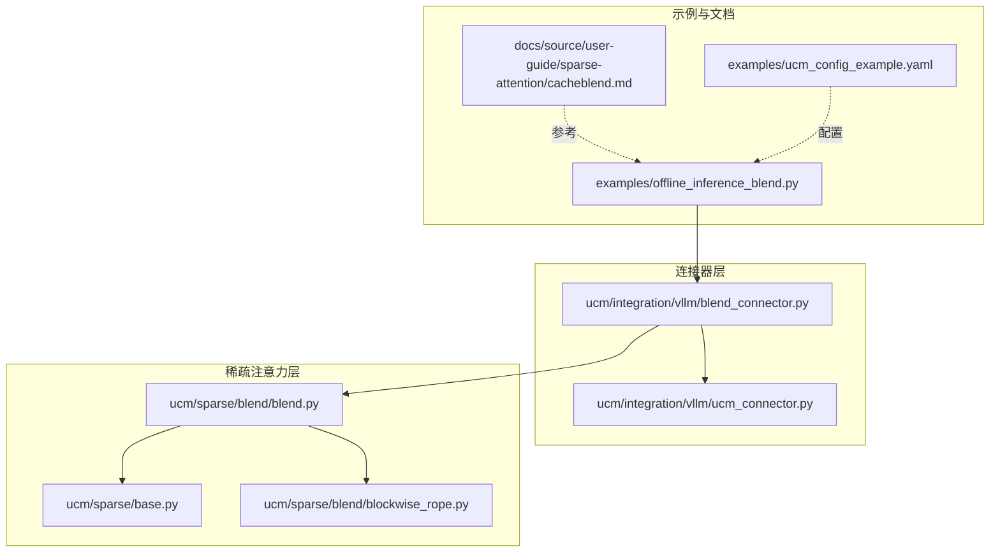
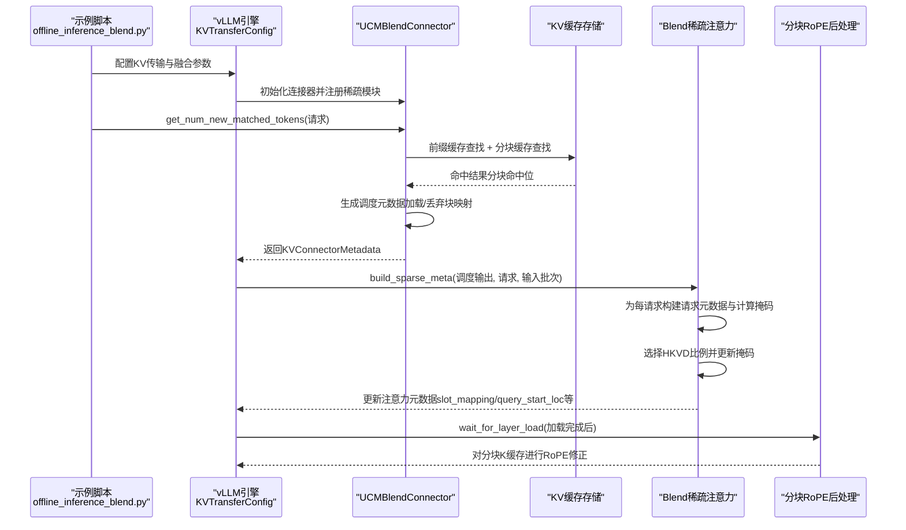
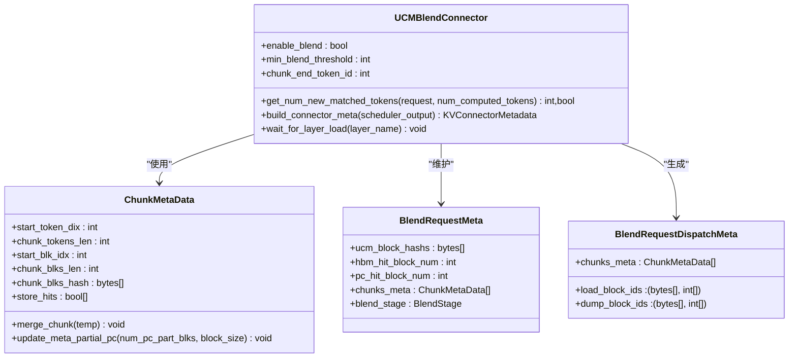
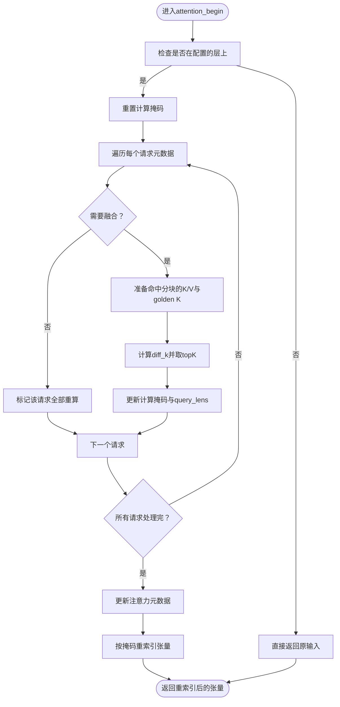
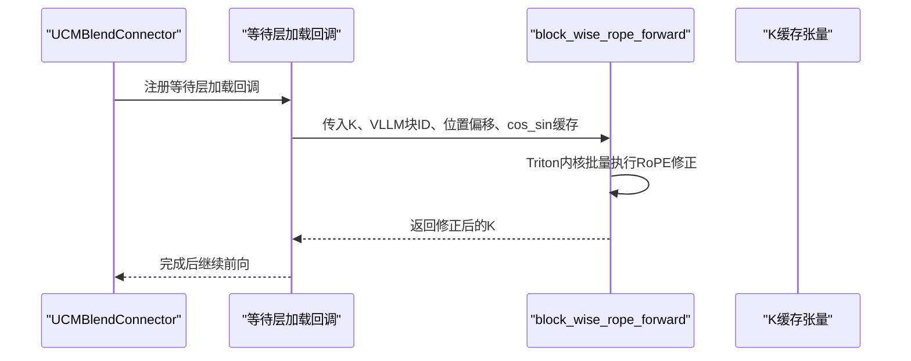
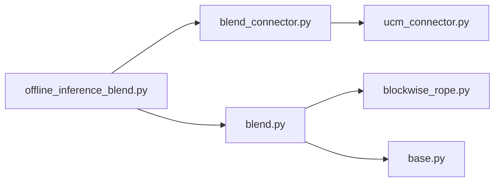

# 缓存融合示例

<cite>
**本文引用的文件列表**
- [offline_inference_blend.py](file://examples/offline_inference_blend.py)
- [cacheblend.md](file://docs/source/user-guide/sparse-attention/cacheblend.md)
- [blend.py](file://ucm/sparse/blend/blend.py)
- [blend_connector.py](file://ucm/integration/vllm/blend_connector.py)
- [blockwise_rope.py](file://ucm/sparse/blend/blockwise_rope.py)
- [ucm_connector.py](file://ucm/integration/vllm/ucm_connector.py)
- [base.py](file://ucm/sparse/base.py)
- [ucm_config_example.yaml](file://examples/ucm_config_example.yaml)
</cite>

## 目录
1. [简介](#简介)
2. [项目结构](#项目结构)
3. [核心组件](#核心组件)
4. [架构总览](#架构总览)
5. [详细组件分析](#详细组件分析)
6. [依赖关系分析](#依赖关系分析)
7. [性能考量](#性能考量)
8. [故障排查指南](#故障排查指南)
9. [结论](#结论)
10. [附录](#附录)

## 简介
本示例文档聚焦于UCM的缓存融合（CacheBlend）能力，系统性介绍如何通过“缓存融合连接器（Blend Connector）”将多种缓存策略（前缀缓存与分块缓存）的优势进行融合，以在长序列RAG场景中显著降低首Token时间（TTFT）、提升吞吐量，并保持高质量输出。文档提供从配置到运行的完整流程、工作原理、关键数据结构、调用时序、性能对比与优化建议，帮助开发者快速落地并理解缓存融合技术。

## 项目结构
围绕缓存融合功能，相关代码主要分布在以下模块：
- 示例脚本：examples/offline_inference_blend.py 提供端到端使用示例
- 文档说明：docs/source/user-guide/sparse-attention/cacheblend.md 提供背景、原理与快速开始
- 融合实现：ucm/sparse/blend/blend.py 实现稀疏注意力阶段的融合逻辑
- 连接器：ucm/integration/vllm/blend_connector.py 实现请求级分块识别、命中判定与调度元数据生成
- 后处理：ucm/sparse/blend/blockwise_rope.py 实现分块级RoPE后处理
- 基类接口：ucm/sparse/base.py 定义稀疏注意力通用接口
- 配置样例：examples/ucm_config_example.yaml 展示YAML配置方式
- 基础连接器：ucm/integration/vllm/ucm_connector.py 提供通用KV缓存连接器基础设施

图表来源
- [offline_inference_blend.py](file://examples/offline_inference_blend.py#L173-L273)
- [cacheblend.md](file://docs/source/user-guide/sparse-attention/cacheblend.md#L37-L83)
- [blend_connector.py](file://ucm/integration/vllm/blend_connector.py#L121-L499)
- [blend.py](file://ucm/sparse/blend/blend.py#L149-L384)
- [blockwise_rope.py](file://ucm/sparse/blend/blockwise_rope.py#L62-L101)
- [ucm_connector.py](file://ucm/integration/vllm/ucm_connector.py#L82-L200)
- [base.py](file://ucm/sparse/base.py#L127-L200)

章节来源
- [offline_inference_blend.py](file://examples/offline_inference_blend.py#L1-L273)
- [cacheblend.md](file://docs/source/user-guide/sparse-attention/cacheblend.md#L1-L98)

## 核心组件
- 缓存融合连接器（UCMBlendConnector）
  - 负责请求级分块识别、前缀缓存与分块缓存的联合查找、命中统计与调度元数据生成
  - 支持最小融合阈值控制，避免小规模命中导致的额外开销
- 稀疏注意力融合（Blend）
  - 在注意力与FFN等阶段基于计算掩码减少实际参与计算的token数
  - 计算每个分块的最高KV偏差（HKVD）并仅对少量token进行重算
- 分块RoPE后处理（blockwise_rope）
  - 使用Triton内核对加载的分块K缓存按位置进行RoPE修正，保证跨块拼接后的正确性
- 基类接口（UcmSparseBase）
  - 定义稀疏注意力在调度侧与工作侧的钩子接口，统一生命周期管理

章节来源
- [blend_connector.py](file://ucm/integration/vllm/blend_connector.py#L121-L499)
- [blend.py](file://ucm/sparse/blend/blend.py#L149-L384)
- [blockwise_rope.py](file://ucm/sparse/blend/blockwise_rope.py#L62-L101)
- [base.py](file://ucm/sparse/base.py#L127-L200)

## 架构总览
下图展示了从请求输入到缓存融合执行的关键交互路径：示例脚本构建vLLM引擎并注入KV传输配置；连接器解析请求，识别分块并查询缓存；稀疏注意力根据命中情况生成计算掩码，减少后续计算；最后对分块K缓存进行RoPE修正。

图表来源
- [offline_inference_blend.py](file://examples/offline_inference_blend.py#L87-L135)
- [blend_connector.py](file://ucm/integration/vllm/blend_connector.py#L344-L466)
- [blend.py](file://ucm/sparse/blend/blend.py#L178-L338)
- [blockwise_rope.py](file://ucm/sparse/blend/blockwise_rope.py#L62-L101)

## 详细组件分析

### 组件A：缓存融合连接器（UCMBlendConnector）
- 功能职责
  - 请求分块识别：基于结束标记与块大小切分文本块
  - 命中判定：先查前缀缓存，再查分块缓存，合并命中位
  - 调度元数据：区分构建缓存阶段与融合阶段，生成加载/丢弃块映射
  - 最小融合阈值：当分块命中低于阈值时回退为前缀缓存构建
- 关键数据结构
  - ChunkMetaData：记录分块起止索引、块数、哈希、命中位等
  - BlendRequestMeta：聚合请求级分块元数据与阶段状态
  - BlendRequestDispatchMeta：调度阶段的加载/丢弃块映射
- 性能要点
  - 通过阈值避免小命中带来的额外IO与重算
  - 分块缓存与前缀缓存共享同一哈希空间，可统一存储与复用

图表来源
- [blend_connector.py](file://ucm/integration/vllm/blend_connector.py#L29-L118)
- [blend_connector.py](file://ucm/integration/vllm/blend_connector.py#L121-L499)

章节来源
- [blend_connector.py](file://ucm/integration/vllm/blend_connector.py#L121-L499)

### 组件B：稀疏注意力融合（Blend）
- 功能职责
  - 在注意力阶段为每个请求构建请求元数据与计算掩码
  - 基于分块命中位与HKVD比例，仅对少量token进行重算
  - 更新注意力元数据（slot_mapping、query_start_loc、max_query_len、num_actual_tokens）
  - 在FFN与层间阶段按掩码进行张量重索引，减少后续计算量
- 关键流程
  - 计算每个分块的最高KV偏差（diff_k），选取topK个位置
  - 将命中分块的K/V保留，未命中分块重算，问题部分默认重算
  - 重新索引query/key/value与输出，缩小后续计算规模

图表来源
- [blend.py](file://ucm/sparse/blend/blend.py#L226-L338)

章节来源
- [blend.py](file://ucm/sparse/blend/blend.py#L149-L384)

### 组件C：分块RoPE后处理（blockwise_rope）
- 功能职责
  - 使用Triton内核对加载的分块K缓存按其在新请求中的相对位置进行RoPE修正
  - 支持批量处理，避免逐元素循环带来的性能瓶颈
- 性能特性
  - 内核按批处理每个head与token，具备高内存带宽利用率
  - 提供基准实现用于精度验证

图表来源
- [blend_connector.py](file://ucm/integration/vllm/blend_connector.py#L493-L499)
- [blockwise_rope.py](file://ucm/sparse/blend/blockwise_rope.py#L62-L101)

章节来源
- [blockwise_rope.py](file://ucm/sparse/blend/blockwise_rope.py#L62-L101)

### 组件D：基础接口（UcmSparseBase）
- 功能职责
  - 定义稀疏注意力在调度侧与工作侧的钩子接口，包括请求生命周期与执行周期的扩展点
  - 提供CPU/GPU缓冲区辅助工具，便于跨设备数据搬运
- 作用
  - 为Blend等稀疏模块提供统一的生命周期与接口契约

章节来源
- [base.py](file://ucm/sparse/base.py#L127-L200)

## 依赖关系分析
- 示例脚本依赖连接器与稀疏模块，通过KVTransferConfig注入融合配置
- 连接器依赖通用连接器基类，实现请求级分块识别与调度元数据生成
- 稀疏模块依赖连接器提供的请求元数据，结合注意力元数据进行计算掩码更新
- RoPE后处理作为连接器的回调，在加载完成后对K缓存进行修正

图表来源
- [offline_inference_blend.py](file://examples/offline_inference_blend.py#L87-L135)
- [blend_connector.py](file://ucm/integration/vllm/blend_connector.py#L121-L499)
- [blend.py](file://ucm/sparse/blend/blend.py#L149-L384)
- [blockwise_rope.py](file://ucm/sparse/blend/blockwise_rope.py#L62-L101)
- [ucm_connector.py](file://ucm/integration/vllm/ucm_connector.py#L82-L200)
- [base.py](file://ucm/sparse/base.py#L127-L200)

章节来源
- [offline_inference_blend.py](file://examples/offline_inference_blend.py#L1-L273)
- [blend_connector.py](file://ucm/integration/vllm/blend_connector.py#L1-L499)
- [blend.py](file://ucm/sparse/blend/blend.py#L1-L384)

## 性能考量
- 缓存融合的收益来源
  - 减少重算token数量：通过HKVD选择仅重算少量token
  - 统一存储与复用：分块缓存与前缀缓存共享哈希空间，减少重复存储
  - 降低TTFT与提升吞吐：在长序列RAG场景中显著缩短首Token时间并提高吞吐
- 影响因素
  - 分块大小与结束标记：影响分块识别与命中率
  - HKVD比例：决定重算比例，过高会增加重算成本
  - 最小融合阈值：避免小命中触发融合带来的额外开销
  - 设备与内核：RoPE后处理依赖Triton内核，需在支持CUDA的环境中运行
- 优化建议
  - 合理设置分块大小与结束标记，确保语义完整性
  - 根据模型与硬件调整HKVD比例，平衡质量与性能
  - 使用阈值过滤低收益分块，避免无效融合
  - 在多GPU环境下评估负载均衡与存储带宽

[本节为通用性能讨论，不直接分析具体文件]

## 故障排查指南
- 初始化失败
  - 症状：连接器初始化报错或未启用融合
  - 排查：确认ucm_sparse_config中包含“Blend”配置且包含chunk_end_token_id
- 数据集路径错误
  - 症状：示例脚本无法读取LongBench数据
  - 排查：检查环境变量BLEND_DATASET_PATH指向有效JSONL文件
- 模型路径错误
  - 症状：示例脚本提示模型路径不存在
  - 排查：检查环境变量MODEL_PATH或交互输入的有效性
- 存储目录权限
  - 症状：示例脚本提示无法创建或访问数据目录
  - 排查：确认DATA_DIR存在且具有读写权限
- 设备不支持
  - 症状：RoPE后处理或融合内核不可用
  - 排查：确认当前平台为CUDA设备，且已安装支持的驱动与库
- 性能异常
  - 症状：TTFT未下降或吞吐未提升
  - 排查：检查分块大小、HKVD比例与最小融合阈值；确认分块命中率足够高

章节来源
- [offline_inference_blend.py](file://examples/offline_inference_blend.py#L38-L85)
- [cacheblend.md](file://docs/source/user-guide/sparse-attention/cacheblend.md#L37-L49)

## 结论
缓存融合通过将前缀缓存与分块缓存有机结合，利用HKVD选择性重算与统一存储机制，在长序列RAG场景中实现了显著的TTFT与吞吐提升。结合示例脚本与配置文档，开发者可以快速集成并优化融合策略，以满足不同应用场景下的性能与质量需求。

[本节为总结性内容，不直接分析具体文件]

## 附录

### 快速开始与配置示例
- 快速开始命令
  - 设置环境变量并运行示例脚本，参考文档中的命令行示例
- 基本配置要点
  - 在KVTransferConfig中指定连接器名称与模块路径
  - 在ucm_sparse_config中启用“Blend”，设置chunk_end_token_id与compute_meta（如模型层的HKVD比例）
  - 在ucm_connectors中配置存储后端（如UcmNfsStore）

章节来源
- [cacheblend.md](file://docs/source/user-guide/sparse-attention/cacheblend.md#L37-L83)
- [offline_inference_blend.py](file://examples/offline_inference_blend.py#L87-L135)
- [ucm_config_example.yaml](file://examples/ucm_config_example.yaml#L10-L39)

### 不同融合策略的配置示例与对比
- 策略A：仅前缀缓存
  - 适用：短序列或分块命中率极低的场景
  - 特点：无融合开销，但可能错过长上下文中的重复片段
- 策略B：缓存融合（推荐）
  - 适用：长序列RAG场景
  - 特点：通过HKVD选择性重算与统一存储，显著降低TTFT并提升吞吐
- 策略C：仅分块缓存
  - 适用：明确的分块结构且前缀缓存收益有限
  - 特点：需确保分块边界与结束标记一致，避免跨块不连续

[本节为概念性对比，不直接分析具体文件]

### 典型应用场景的融合方案设计指南
- 场景1：长文档问答（WikiQA）
  - 建议：启用融合，设置合理的分块大小与结束标记，HKVD比例0.1~0.3
  - 注意：确保分块覆盖完整段落，避免问题部分被误判为可融合
- 场景2：多轮对话（历史消息+上下文）
  - 建议：优先构建前缀缓存，对新增上下文采用分块缓存并进行融合
  - 注意：控制最小融合阈值，避免小增量触发融合
- 场景3：视频理解（长视频帧序列）
  - 建议：按帧或关键帧切分，使用分块缓存与融合，结合RoPE后处理
  - 注意：评估存储带宽与GPU显存占用，避免过高的分块数量

[本节为通用设计建议，不直接分析具体文件]