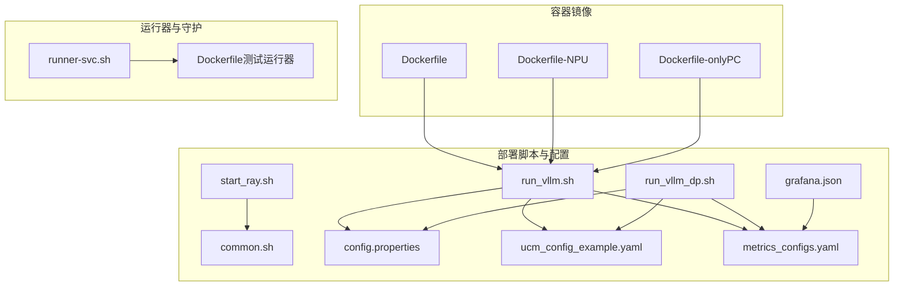
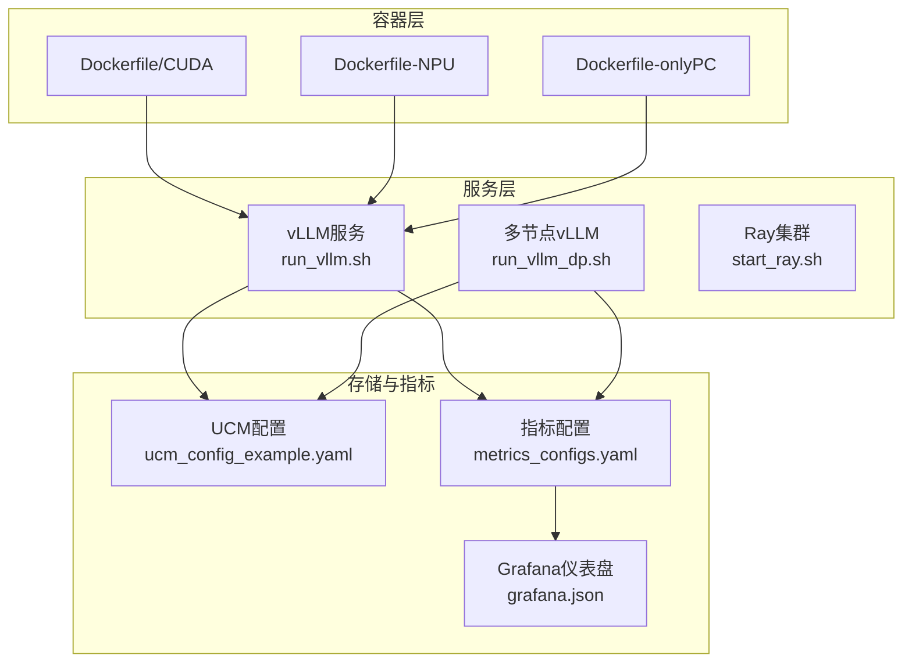
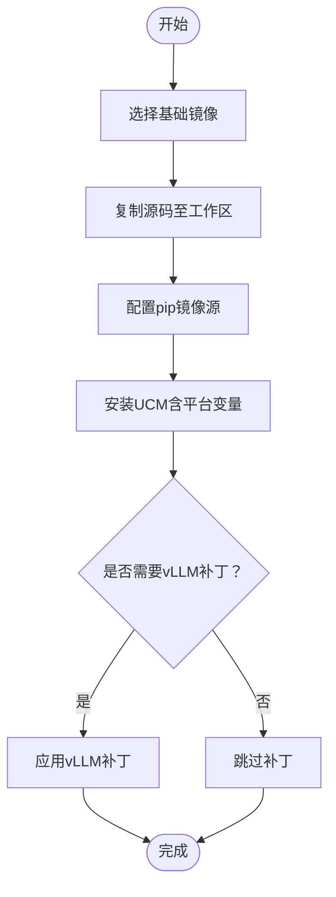
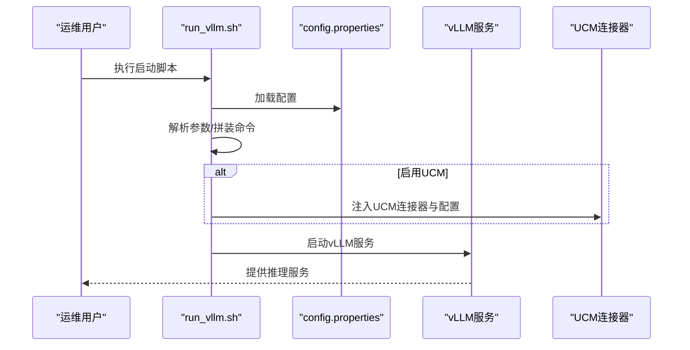
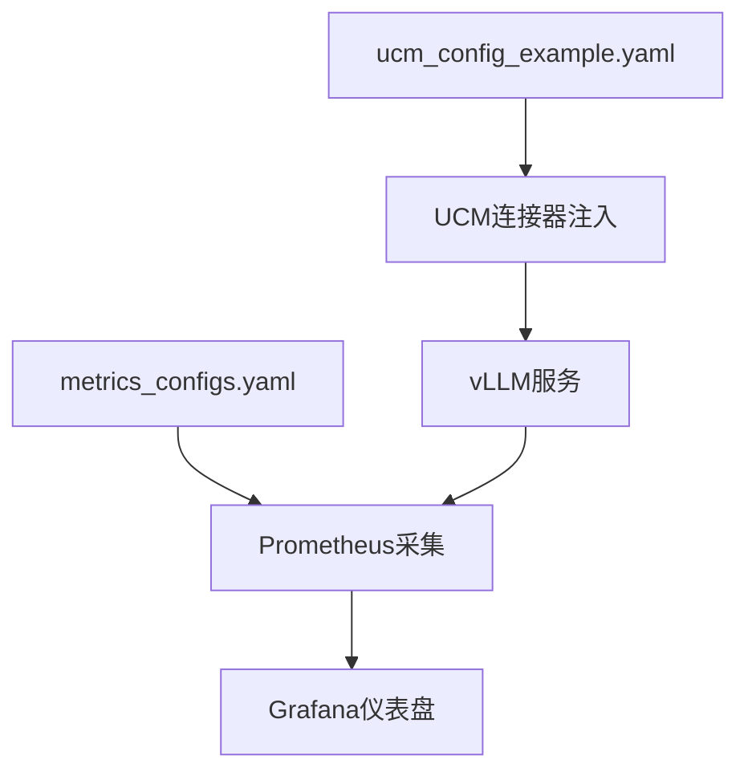
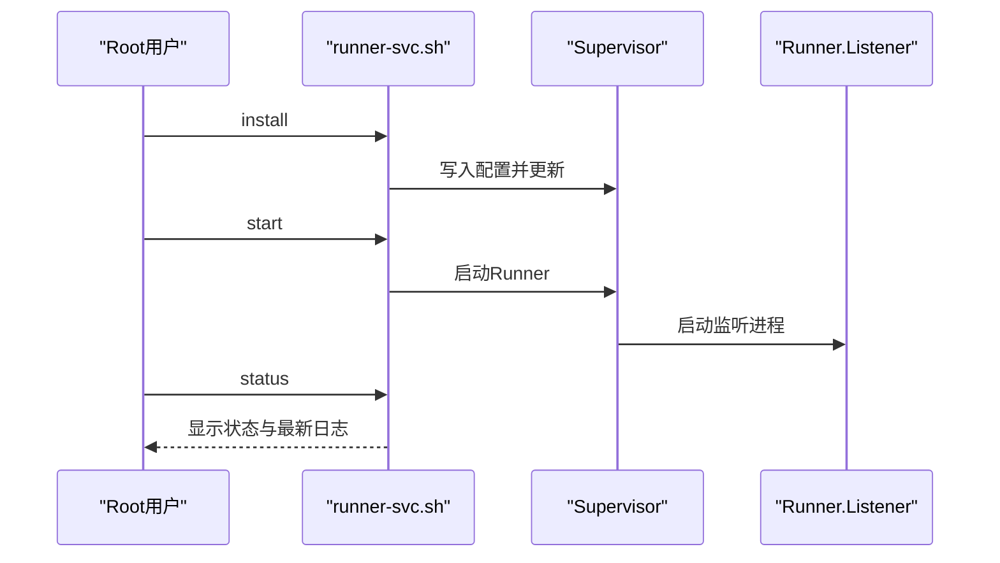
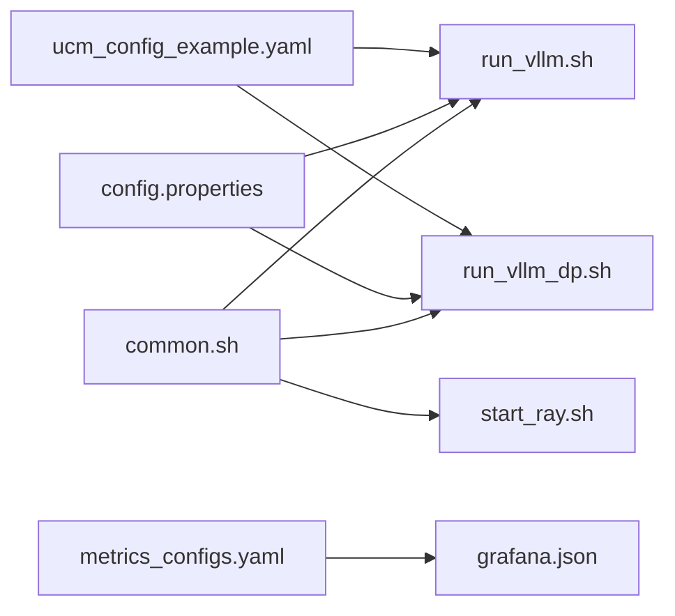

# 部署示例

<cite>
**本文引用的文件**
- [README.md](file://README.md)
- [Dockerfile](file://docker/Dockerfile)
- [Dockerfile-NPU](file://docker/Dockerfile-NPU)
- [Dockerfile-onlyPC](file://docker/Dockerfile-onlyPC)
- [run_vllm.sh](file://examples/deployments/scripts/vllm/run_vllm.sh)
- [run_vllm_dp.sh](file://examples/deployments/scripts/vllm/run_vllm_dp.sh)
- [start_ray.sh](file://examples/deployments/scripts/vllm/start_ray.sh)
- [common.sh](file://examples/deployments/scripts/vllm/common.sh)
- [config.properties](file://examples/deployments/scripts/vllm/config.properties)
- [ucm_config_example.yaml](file://examples/ucm_config_example.yaml)
- [metrics_configs.yaml](file://examples/metrics/metrics_configs.yaml)
- [grafana.json](file://examples/metrics/grafana.json)
- [runner-svc.sh](file://test/runner-docker/runner-svc.sh)
- [Dockerfile（测试运行器）](file://test/runner-docker/Dockerfile)
</cite>

## 目录
1. [简介](#简介)
2. [项目结构](#项目结构)
3. [核心组件](#核心组件)
4. [架构总览](#架构总览)
5. [详细组件分析](#详细组件分析)
6. [依赖关系分析](#依赖关系分析)
7. [性能考虑](#性能考虑)
8. [故障排查指南](#故障排查指南)
9. [结论](#结论)
10. [附录](#附录)

## 简介
本文件面向运维与平台工程团队，提供UCM（Unified Cache Management）在多种环境下的完整部署示例与最佳实践，覆盖Docker容器化、裸机部署、云平台部署等场景，并针对CPU/GPU/NPU硬件差异给出差异化配置要点。内容包括：环境准备、依赖安装、服务启动、监控与日志、以及生产级部署架构建议。

## 项目结构
围绕部署的关键目录与文件如下：
- 容器镜像构建：docker/Dockerfile、docker/Dockerfile-NPU、docker/Dockerfile-onlyPC
- vLLM集成与启动脚本：examples/deployments/scripts/vllm/run_vllm.sh、run_vllm_dp.sh、start_ray.sh、common.sh、config.properties
- UCM配置与指标：examples/ucm_config_example.yaml、examples/metrics/metrics_configs.yaml、examples/metrics/grafana.json
- 运行器与守护：test/runner-docker/runner-svc.sh、test/runner-docker/Dockerfile

图表来源
- [run_vllm.sh](file://examples/deployments/scripts/vllm/run_vllm.sh#L1-L116)
- [run_vllm_dp.sh](file://examples/deployments/scripts/vllm/run_vllm_dp.sh#L1-L153)
- [start_ray.sh](file://examples/deployments/scripts/vllm/start_ray.sh#L1-L57)
- [common.sh](file://examples/deployments/scripts/vllm/common.sh#L1-L79)
- [config.properties](file://examples/deployments/scripts/vllm/config.properties#L1-L92)
- [ucm_config_example.yaml](file://examples/ucm_config_example.yaml#L1-L39)
- [metrics_configs.yaml](file://examples/metrics/metrics_configs.yaml#L1-L51)
- [grafana.json](file://examples/metrics/grafana.json#L1-L1025)
- [Dockerfile](file://docker/Dockerfile#L1-L20)
- [Dockerfile-NPU](file://docker/Dockerfile-NPU#L1-L25)
- [Dockerfile-onlyPC](file://docker/Dockerfile-onlyPC#L1-L16)
- [runner-svc.sh](file://test/runner-docker/runner-svc.sh#L1-L83)
- [Dockerfile（测试运行器）](file://test/runner-docker/Dockerfile#L1-L51)

章节来源
- [README.md](file://README.md#L1-L93)

## 核心组件
- 容器镜像构建
  - CUDA/GPU：基于官方vLLM镜像，启用稀疏与CUDA后端，安装UCM源码并打补丁适配vLLM。
  - NPU（Ascend）：基于Ascend vLLM镜像，设置Ascend运行时库路径，应用vLLM与Ascend专用补丁。
  - 仅PC（CPU）：不启用GPU/NPU后端，适合纯CPU推理场景。
- 启动脚本与配置
  - 单机/多机vLLM服务：通过参数化脚本生成vllm serve命令，支持UCM连接器注入、前缀缓存、图编译、推测解码等高级选项。
  - 多节点Ray：根据节点角色（Head/Worker）初始化网络接口与设备可见性，启动Ray服务。
  - 通用工具：读取配置文件、检测网络接口、打印调试信息。
- UCM与指标
  - UCM配置：定义存储后端、是否启用层间加载、稀疏注意力策略等。
  - 指标配置：定义Prometheus指标前缀、直方图桶、多进程目录等。
  - 可视化：Grafana仪表盘JSON，展示加载/保存请求量、块数、耗时、速度与命中率等。

章节来源
- [Dockerfile](file://docker/Dockerfile#L1-L20)
- [Dockerfile-NPU](file://docker/Dockerfile-NPU#L1-L25)
- [Dockerfile-onlyPC](file://docker/Dockerfile-onlyPC#L1-L16)
- [run_vllm.sh](file://examples/deployments/scripts/vllm/run_vllm.sh#L1-L116)
- [run_vllm_dp.sh](file://examples/deployments/scripts/vllm/run_vllm_dp.sh#L1-L153)
- [start_ray.sh](file://examples/deployments/scripts/vllm/start_ray.sh#L1-L57)
- [common.sh](file://examples/deployments/scripts/vllm/common.sh#L1-L79)
- [config.properties](file://examples/deployments/scripts/vllm/config.properties#L1-L92)
- [ucm_config_example.yaml](file://examples/ucm_config_example.yaml#L1-L39)
- [metrics_configs.yaml](file://examples/metrics/metrics_configs.yaml#L1-L51)
- [grafana.json](file://examples/metrics/grafana.json#L1-L1025)

## 架构总览
下图展示了从容器到服务、再到监控的整体部署架构。容器内安装UCM并集成vLLM；通过脚本注入UCM连接器与配置；Prometheus抓取指标，Grafana可视化。

图表来源
- [Dockerfile](file://docker/Dockerfile#L1-L20)
- [Dockerfile-NPU](file://docker/Dockerfile-NPU#L1-L25)
- [Dockerfile-onlyPC](file://docker/Dockerfile-onlyPC#L1-L16)
- [run_vllm.sh](file://examples/deployments/scripts/vllm/run_vllm.sh#L1-L116)
- [run_vllm_dp.sh](file://examples/deployments/scripts/vllm/run_vllm_dp.sh#L1-L153)
- [start_ray.sh](file://examples/deployments/scripts/vllm/start_ray.sh#L1-L57)
- [ucm_config_example.yaml](file://examples/ucm_config_example.yaml#L1-L39)
- [metrics_configs.yaml](file://examples/metrics/metrics_configs.yaml#L1-L51)
- [grafana.json](file://examples/metrics/grafana.json#L1-L1025)

## 详细组件分析

### 组件A：Docker容器化部署
- CUDA/GPU镜像
  - 基于vLLM官方镜像，设置索引源，安装UCM并启用稀疏与CUDA后端，随后对vLLM应用补丁以适配UCM。
- NPU（Ascend）镜像
  - 基于Ascend vLLM镜像，设置Ascend库路径，分别对vLLM与Ascend版本应用补丁。
- 仅PC（CPU）镜像
  - 不启用GPU/NPU后端，适合CPU推理场景。

图表来源
- [Dockerfile](file://docker/Dockerfile#L1-L20)
- [Dockerfile-NPU](file://docker/Dockerfile-NPU#L1-L25)
- [Dockerfile-onlyPC](file://docker/Dockerfile-onlyPC#L1-L16)

章节来源
- [Dockerfile](file://docker/Dockerfile#L1-L20)
- [Dockerfile-NPU](file://docker/Dockerfile-NPU#L1-L25)
- [Dockerfile-onlyPC](file://docker/Dockerfile-onlyPC#L1-L16)

### 组件B：vLLM单机/多机服务启动
- 单机服务
  - 读取配置文件，拼装vllm serve命令，支持前缀缓存、图编译、推测解码、额外配置等；可选注入UCM连接器。
- 多机数据并行
  - 依据节点角色设置HCCL/NCCL网络接口与可见设备，计算每节点GPU数量，拼装数据并行参数并启动vLLM；工作节点使用headless模式。
- Ray集群
  - Head节点负责启动Ray，Worker节点连接Head；自动检测目标IP对应的网络接口，设置各类Socket接口名。

图表来源
- [run_vllm.sh](file://examples/deployments/scripts/vllm/run_vllm.sh#L1-L116)
- [config.properties](file://examples/deployments/scripts/vllm/config.properties#L1-L92)

章节来源
- [run_vllm.sh](file://examples/deployments/scripts/vllm/run_vllm.sh#L1-L116)
- [run_vllm_dp.sh](file://examples/deployments/scripts/vllm/run_vllm_dp.sh#L1-L153)
- [start_ray.sh](file://examples/deployments/scripts/vllm/start_ray.sh#L1-L57)
- [common.sh](file://examples/deployments/scripts/vllm/common.sh#L1-L79)
- [config.properties](file://examples/deployments/scripts/vllm/config.properties#L1-L92)

### 组件C：UCM配置与指标
- UCM配置
  - 定义连接器类型（如NFS）、存储后端路径、IO直写开关、稀疏注意力策略、层间加载开关等。
- 指标配置
  - 设置日志间隔、多进程目录、指标前缀、直方图桶等，支撑Prometheus采集。
- 可视化
  - Grafana仪表盘JSON展示加载/保存请求量、块数、耗时、速度与命中率等关键指标。

图表来源
- [ucm_config_example.yaml](file://examples/ucm_config_example.yaml#L1-L39)
- [metrics_configs.yaml](file://examples/metrics/metrics_configs.yaml#L1-L51)
- [grafana.json](file://examples/metrics/grafana.json#L1-L1025)

章节来源
- [ucm_config_example.yaml](file://examples/ucm_config_example.yaml#L1-L39)
- [metrics_configs.yaml](file://examples/metrics/metrics_configs.yaml#L1-L51)
- [grafana.json](file://examples/metrics/grafana.json#L1-L1025)

### 组件D：运行器与守护（CI/CD或长期运行）
- 测试运行器容器
  - 安装Supervisor与Runner，以Supervisor托管Runner进程，支持自动重启与日志轮转。
- 运行器服务脚本
  - 提供install/start/stop/status/uninstall等操作，便于在宿主机上管理Runner服务。

图表来源
- [runner-svc.sh](file://test/runner-docker/runner-svc.sh#L1-L83)
- [Dockerfile（测试运行器）](file://test/runner-docker/Dockerfile#L1-L51)

章节来源
- [runner-svc.sh](file://test/runner-docker/runner-svc.sh#L1-L83)
- [Dockerfile（测试运行器）](file://test/runner-docker/Dockerfile#L1-L51)

## 依赖关系分析
- 脚本依赖
  - run_vllm.sh与run_vllm_dp.sh依赖common.sh解析配置、检测网络接口；两者均依赖config.properties提供运行参数。
  - start_ray.sh依赖common.sh进行网络接口检测与环境变量设置。
- 容器镜像依赖
  - Dockerfile系列镜像依赖vLLM基础镜像，安装UCM并应用补丁；NPU镜像需Ascend运行时库路径。
- 监控依赖
  - 指标配置与Grafana仪表盘共同构成监控闭环，Prometheus抓取指标后由Grafana展示。

图表来源
- [common.sh](file://examples/deployments/scripts/vllm/common.sh#L1-L79)
- [run_vllm.sh](file://examples/deployments/scripts/vllm/run_vllm.sh#L1-L116)
- [run_vllm_dp.sh](file://examples/deployments/scripts/vllm/run_vllm_dp.sh#L1-L153)
- [start_ray.sh](file://examples/deployments/scripts/vllm/start_ray.sh#L1-L57)
- [config.properties](file://examples/deployments/scripts/vllm/config.properties#L1-L92)
- [ucm_config_example.yaml](file://examples/ucm_config_example.yaml#L1-L39)
- [metrics_configs.yaml](file://examples/metrics/metrics_configs.yaml#L1-L51)
- [grafana.json](file://examples/metrics/grafana.json#L1-L1025)

章节来源
- [common.sh](file://examples/deployments/scripts/vllm/common.sh#L1-L79)
- [run_vllm.sh](file://examples/deployments/scripts/vllm/run_vllm.sh#L1-L116)
- [run_vllm_dp.sh](file://examples/deployments/scripts/vllm/run_vllm_dp.sh#L1-L153)
- [start_ray.sh](file://examples/deployments/scripts/vllm/start_ray.sh#L1-L57)
- [config.properties](file://examples/deployments/scripts/vllm/config.properties#L1-L92)
- [ucm_config_example.yaml](file://examples/ucm_config_example.yaml#L1-L39)
- [metrics_configs.yaml](file://examples/metrics/metrics_configs.yaml#L1-L51)
- [grafana.json](file://examples/metrics/grafana.json#L1-L1025)

## 性能考虑
- 图编译与内存利用
  - 通过图编译模式与GPU内存利用率参数优化吞吐与延迟；在CUDA/NPU环境下分别调整对应参数。
- 数据并行与网络
  - 多节点数据并行需正确设置HCCL/NCCL接口与每节点GPU数量，避免通信瓶颈。
- 存储与稀疏注意力
  - 合理配置存储后端与稀疏策略，结合指标观测命中率与传输速度，动态调优。
- 日志与监控
  - 使用统一指标前缀与直方图桶，结合Grafana仪表盘持续观察关键指标，及时发现异常。

## 故障排查指南
- 网络接口问题
  - 若无法通过IP定位网络接口，脚本会回退到默认接口；请确认ifconfig可用且配置正确。
- Ray连接失败
  - 检查Head节点端口与Worker节点地址；确保防火墙放行相应端口。
- UCM未生效
  - 确认已启用UCM并正确设置配置文件路径；检查vLLM日志中是否注入了UCM连接器。
- 指标缺失
  - 确认指标配置文件路径与多进程目录设置正确；检查Prometheus抓取目标与Grafana数据源。

章节来源
- [common.sh](file://examples/deployments/scripts/vllm/common.sh#L32-L79)
- [start_ray.sh](file://examples/deployments/scripts/vllm/start_ray.sh#L1-L57)
- [run_vllm.sh](file://examples/deployments/scripts/vllm/run_vllm.sh#L1-L116)
- [run_vllm_dp.sh](file://examples/deployments/scripts/vllm/run_vllm_dp.sh#L1-L153)
- [metrics_configs.yaml](file://examples/metrics/metrics_configs.yaml#L1-L51)

## 结论
通过容器化与脚本化的统一入口，UCM可在Docker、裸机与云平台等多种环境中快速部署。结合Ray实现多节点扩展，配合Prometheus与Grafana实现可观测性闭环。针对不同硬件平台（CPU/GPU/NPU），采用相应的镜像与补丁策略，可获得稳定高效的推理体验。

## 附录
- 快速参考清单
  - 准备：安装Docker，准备模型与存储路径，设置网络与防火墙。
  - 构建：选择对应Dockerfile构建镜像，或直接使用官方镜像。
  - 启动：编辑config.properties，执行run_vllm.sh或run_vllm_dp.sh；必要时先启动Ray。
  - 监控：配置metrics_configs.yaml与Grafana仪表盘，验证Prometheus抓取。
  - 维护：使用runner-svc.sh管理长期运行的Runner服务（如CI/CD）。