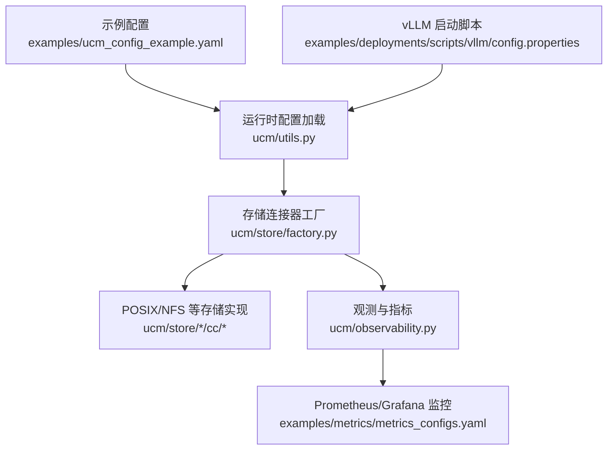
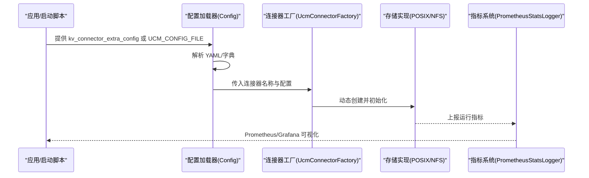
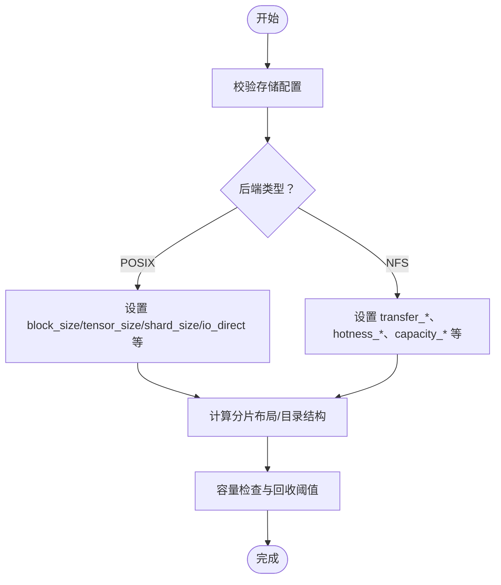
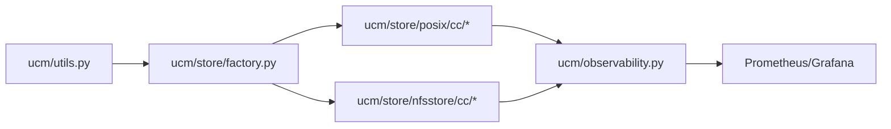

# 配置示例

<cite>
**本文引用的文件**   
- [examples\ucm_config_example.yaml](file://examples\ucm_config_example.yaml)
- [examples\deployments\scripts\vllm\config.properties](file://examples\deployments\scripts\vllm\config.properties)
- [examples\metrics\metrics_configs.yaml](file://examples\metrics\metrics_configs.yaml)
- [ucm\utils.py](file://ucm\utils.py)
- [ucm\store\factory.py](file://ucm\store\factory.py)
- [ucm\store\posix\cc\posix_store.cc](file://ucm\store\posix\cc\posix_store.cc)
- [ucm\store\posix\cc\space_layout.cc](file://ucm\store\posix\cc\space_layout.cc)
- [ucm\store\nfsstore\cc\api\nfsstore.h](file://ucm\store\nfsstore\cc\api\nfsstore.h)
- [ucm\store\nfsstore\cc\domain\space\space_manager.cc](file://ucm\store\nfsstore\cc\domain\space\space_manager.cc)
- [ucm\store\nfsstore\device\CMakeLists.txt](file://ucm\store\nfsstore\device\CMakeLists.txt)
- [ucm\store\nfsstore\device\ascend\ascend_device.cc](file://ucm\store\nfsstore\device\ascend\ascend_device.cc)
- [ucm\observability.py](file://ucm\observability.py)
- [docs\source\user-guide\prefix-cache\pipeline_store.md](file://docs\source\user-guide\prefix-cache\pipeline_store.md)
- [docs\source\developer-guide\add_metrics.md](file://docs\source\developer-guide\add_metrics.md)
- [docs\source\user-guide\metrics\metrics.md](file://docs\source\user-guide\metrics\metrics.md)
- [benchmarks\logging_perf_test.py](file://benchmarks\logging_perf_test.py)
- [test\config.yaml](file://test\config.yaml)
</cite>

## 目录
1. [简介](#简介)
2. [项目结构](#项目结构)
3. [核心组件](#核心组件)
4. [架构总览](#架构总览)
5. [详细组件分析](#详细组件分析)
6. [依赖关系分析](#依赖关系分析)
7. [性能考虑](#性能考虑)
8. [故障排查指南](#故障排查指南)
9. [结论](#结论)
10. [附录](#附录)

## 简介
本文件面向需要在生产环境中部署与优化统一缓存管理（Unified Cache Management，简称 UCM）的工程师与运维人员，提供从配置文件到监控、性能调优、跨硬件平台适配的完整参考。内容覆盖：
- UCM 配置文件的参数与选项说明
- 存储后端配置要点与最佳实践
- 性能调优关键参数与推荐值
- 监控与指标配置方法
- 多硬件平台（CUDA/NV-ACL/MUSA/MACA/模拟）差异与注意事项
- 配置验证与调试流程

## 项目结构
UCM 的配置与运行涉及以下关键路径：
- 配置示例：examples 目录下提供 YAML 示例与 vLLM 启动脚本示例
- 运行时配置加载：ucm/utils.py 中的 Config 类负责解析外部传入的 kv_connector_extra_config 或 UCM_CONFIG_FILE
- 存储后端工厂：ucm/store/factory.py 注册并创建具体存储连接器
- 存储实现：POSIX/NFS 等后端的配置项在对应 C++/Python 层定义
- 指标与可观测性：ucm/observability.py 负责基于 YAML 的指标注册与上报
- 文档与示例：docs/source 下的用户与开发者指南提供参数说明与监控导入指引

**图示来源**
- [examples\ucm_config_example.yaml](file://examples\ucm_config_example.yaml#L1-L39)
- [examples\deployments\scripts\vllm\config.properties](file://examples\deployments\scripts\vllm\config.properties#L84-L92)
- [ucm\utils.py](file://ucm\utils.py#L34-L91)
- [ucm\store\factory.py](file://ucm\store\factory.py#L34-L71)
- [ucm\observability.py](file://ucm\observability.py#L40-L197)

**章节来源**
- [examples\ucm_config_example.yaml](file://examples\ucm_config_example.yaml#L1-L39)
- [examples\deployments\scripts\vllm\config.properties](file://examples\deployments\scripts\vllm\config.properties#L84-L92)
- [ucm\utils.py](file://ucm\utils.py#L34-L91)
- [ucm\store\factory.py](file://ucm\store\factory.py#L34-L71)
- [ucm\observability.py](file://ucm\observability.py#L40-L197)

## 核心组件
- 配置加载器（Config）
  - 支持从 kv_connector_extra_config 读取 UCM_CONFIG_FILE 路径或直接使用传入字典
  - 默认回退到内置默认配置
- 存储连接器工厂（UcmConnectorFactory）
  - 注册多种连接器类型（如 UcmNfsStore、UcmPcStore、UcmMooncakeStore），按名称动态创建实例
- 观测与指标（PrometheusStatsLogger）
  - 基于 YAML 配置注册 Counter/Gauge/Histogram 指标，并周期性上报
- 存储后端实现
  - POSIX/NFS 等后端在 C++ 层定义了大量可调参数（块大小、并发、超时、缓冲区数量等）

**章节来源**
- [ucm\utils.py](file://ucm\utils.py#L34-L91)
- [ucm\store\factory.py](file://ucm\store\factory.py#L34-L71)
- [ucm\observability.py](file://ucm\observability.py#L40-L197)

## 架构总览
UCM 的配置驱动架构如下：
- 应用层通过 kv_connector_extra_config 或 UCM_CONFIG_FILE 提供 YAML 配置
- Config 解析并注入到存储连接器
- 工厂根据连接器名称选择具体实现（POSIX/NFS 等）
- 后端执行数据传输与空间管理，同时通过指标系统上报运行状态

**图示来源**
- [ucm\utils.py](file://ucm\utils.py#L34-L91)
- [ucm\store\factory.py](file://ucm\store\factory.py#L34-L71)
- [ucm\observability.py](file://ucm\observability.py#L40-L197)

## 详细组件分析

### 1) 配置文件与参数详解
- 基本结构
  - ucm_connectors 列表：指定使用的连接器名称与连接器级配置
  - metrics_config_path：启用指标监控时指向 metrics_configs.yaml
  - ucm_sparse_config：稀疏注意力相关配置（ESA/GSA/GSAOnDevice 等）
  - 其他可选参数：如 use_layerwise、hit_ratio 等
- 参数说明与建议
  - storage_backends：存储后端路径列表；POSIX/NFS 后端会据此建立目录与分片布局
  - io_direct：是否启用直写直读；POSIX 测试中演示了开启/关闭两种模式
  - block_size/tensor_size/shard_size：块大小、张量大小、分片大小，影响 IO 分布与吞吐
  - posix_data_trans_concurrency/posix_lookup_concurrency：数据传输与查找并发度
  - timeout_ms：接口超时时间
  - data_dir_shard_bytes：数据目录分片大小
  - NFS 特有参数：transfer_enable/transfer_device_id/stream_number/io_size/buffer_number/timeout_ms、hotness_enable/interval、storage_capacity/recycle_enable/recycle_threshold_ratio、transfer_io_direct 等
- 示例与逐行解释
  - 参考示例文件中的注释与字段，结合后端实现参数进行对照

**章节来源**
- [examples\ucm_config_example.yaml](file://examples\ucm_config_example.yaml#L1-L39)
- [ucm\store\posix\cc\posix_store.cc](file://ucm\store\posix\cc\posix_store.cc#L103-L121)
- [ucm\store\nfsstore\cc\api\nfsstore.h](file://ucm\store\nfsstore\cc\api\nfsstore.h#L34-L61)

### 2) 存储配置与最佳实践
- POSIX 后端
  - 支持 storage_backends、io_direct、block_size、tensor_size、shard_size、posix_data_trans_concurrency、posix_lookup_concurrency、timeout_ms、data_dir_shard_bytes 等
  - 建议：根据 num_gpu_blocks 设置 buffer_number，避免频繁等待队列阻塞
- NFS 后端
  - 支持 transfer_*、hotness_*、storage_capacity、recycle_*、transfer_io_direct 等
  - 建议：合理设置 storage_capacity 与回收阈值，避免磁盘空间耗尽
- 空间布局与容量管理
  - SpaceManager 负责块生命周期、容量检查与回收触发
  - SpaceLayout/SpaceShardLayout 决定文件组织与分片策略

**图示来源**
- [ucm\store\posix\cc\posix_store.cc](file://ucm\store\posix\cc\posix_store.cc#L103-L121)
- [ucm\store\nfsstore\cc\api\nfsstore.h](file://ucm\store\nfsstore\cc\api\nfsstore.h#L34-L61)
- [ucm\store\nfsstore\cc\domain\space\space_manager.cc](file://ucm\store\nfsstore\cc\domain\space\space_manager.cc#L45-L72)

**章节来源**
- [ucm\store\posix\cc\space_layout.cc](file://ucm\store\posix\cc\space_layout.cc#L106-L147)
- [ucm\store\nfsstore\cc\domain\space\space_manager.cc](file://ucm\store\nfsstore\cc\domain\space\space_manager.cc#L45-L72)

### 3) 性能调优参数与推荐值
- 并发与队列深度
  - stream_number：主机与存储之间的传输线程数
  - buffer_number：设备与主机之间用于传输的固定内存缓冲区数量
  - waiting_queue_depth/running_queue_depth：传输任务等待与运行队列深度
- 超时与块大小
  - timeout_ms：外部接口超时
  - block_size：块大小，建议与推理框架的 block_size 对齐（如 128）
- I/O 直通
  - io_direct：启用直写直读以减少内核页缓存开销，适合大块顺序 IO
- 稀疏注意力
  - ESA/GSA/GSAOnDevice 的窗口大小、最小块数、稀疏比例等参数需结合模型与数据长度调优

**章节来源**
- [docs\source\user-guide\prefix-cache\pipeline_store.md](file://docs\source\user-guide\prefix-cache\pipeline_store.md#L97-L132)
- [ucm\store\posix\cc\posix_store.cc](file://ucm\store\posix\cc\posix_store.cc#L103-L121)
- [ucm\store\nfsstore\cc\api\nfsstore.h](file://ucm\store\nfsstore\cc\api\nfsstore.h#L34-L61)

### 4) 监控配置与可视化
- 指标 YAML 配置
  - log_interval：日志间隔
  - multiproc_dir：多进程模式目录
  - metric_prefix：指标前缀
  - histogram_max_length：直方图向量最大长度
  - counter/gauge/histogram 列表：定义具体指标名称、文档与桶
- 指标注册与更新
  - PrometheusStatsLogger 从 YAML 注册指标，周期性从 ucmmetrics 获取统计并上报
- 导入 Grafana 仪表盘
  - 在 Grafana 中添加 Prometheus 数据源并导入提供的 JSON

**章节来源**
- [examples\metrics\metrics_configs.yaml](file://examples\metrics\metrics_configs.yaml#L1-L51)
- [ucm\observability.py](file://ucm\observability.py#L40-L197)
- [docs\source\developer-guide\add_metrics.md](file://docs\source\developer-guide\add_metrics.md#L1-L71)
- [docs\source\user-guide\metrics\metrics.md](file://docs\source\user-guide\metrics\metrics.md#L131-L149)

### 5) 多硬件平台差异与注意事项
- 运行时环境选择
  - 通过 RUNTIME_ENVIRONMENT 指定目标设备（ascend/musa/cuda/simu），NFS 设备子目录按环境编译
- Ascend 设备
  - 使用 ACL 接口进行主机/设备内存分配与同步
  - 注意直通内存与异步回调线程的正确配置
- 其他平台
  - CUDA/MUSA/MACA/模拟环境分别在对应子目录实现设备抽象

**章节来源**
- [ucm\store\nfsstore\device\CMakeLists.txt](file://ucm\store\nfsstore\device\CMakeLists.txt#L1-L19)
- [ucm\store\nfsstore\device\ascend\ascend_device.cc](file://ucm\store\nfsstore\device\ascend\ascend_device.cc#L127-L169)

### 6) 配置验证与调试方法
- 配置加载验证
  - 通过 Config 加载 YAML 或字典，若未提供则回退默认配置
  - 若文件不存在或格式错误，记录警告/错误日志
- 日志性能基准
  - benchmarks/logging_perf_test.py 提供 Python logging 与 pybind11 spdlog_logger 的对比测试，便于评估日志开销
- 端到端验证
  - 结合 test/config.yaml 中的数据库与连接配置，进行环境预检与推理链路验证

**章节来源**
- [ucm\utils.py](file://ucm\utils.py#L40-L91)
- [benchmarks\logging_perf_test.py](file://benchmarks\logging_perf_test.py#L1-L181)
- [test\config.yaml](file://test\config.yaml#L1-L48)

## 依赖关系分析
- 组件耦合
  - Config 与 UcmConnectorFactory 通过连接器名称解耦，支持扩展新后端
  - 观测系统与存储实现解耦，通过指标接口上报
- 外部依赖
  - Prometheus 客户端、pybind11、平台驱动（ACL/CUDA 等）

**图示来源**
- [ucm\utils.py](file://ucm\utils.py#L34-L91)
- [ucm\store\factory.py](file://ucm\store\factory.py#L34-L71)
- [ucm\observability.py](file://ucm\observability.py#L40-L197)

**章节来源**
- [ucm\utils.py](file://ucm\utils.py#L34-L91)
- [ucm\store\factory.py](file://ucm\store\factory.py#L34-L71)
- [ucm\observability.py](file://ucm\observability.py#L40-L197)

## 性能考虑
- 合理设置块大小与分片大小，避免小块导致过多元数据开销
- 根据 GPU 块数量与层数调整缓冲区数量，避免队列拥塞
- 在高吞吐场景启用 io_direct，减少页缓存抖动
- 适当增大传输线程数与队列深度，平衡延迟与吞吐
- 定期检查容量与回收阈值，防止磁盘空间不足

## 故障排查指南
- 配置问题
  - 检查 UCM_CONFIG_FILE 路径是否存在、YAML 是否合法
  - 确认 kv_connector_extra_config 是否正确传递给连接器
- 存储问题
  - POSIX：确认 storage_backends 可访问且具备写权限
  - NFS：确认容量与回收策略、热数据管理开关
- 指标问题
  - 检查 metrics_configs.yaml 的指标定义与 Prometheus/Grafana 连接
  - 确认 PROMETHEUS_MULTIPROC_DIR 目录存在且可写
- 日志与性能
  - 使用日志性能基准工具定位日志开销瓶颈

**章节来源**
- [ucm\utils.py](file://ucm\utils.py#L40-L91)
- [ucm\store\posix\cc\space_layout.cc](file://ucm\store\posix\cc\space_layout.cc#L106-L147)
- [ucm\store\nfsstore\cc\domain\space\space_manager.cc](file://ucm\store\nfsstore\cc\domain\space\space_manager.cc#L45-L72)
- [ucm\observability.py](file://ucm\observability.py#L40-L197)
- [benchmarks\logging_perf_test.py](file://benchmarks\logging_perf_test.py#L1-L181)

## 结论
通过本文档，您可以：
- 明确 UCM 配置文件的各项参数与含义
- 在不同存储后端与硬件平台上制定合理的性能调优策略
- 建立完善的监控体系，快速定位问题并持续优化
- 基于示例与最佳实践，快速落地生产级部署

## 附录
- 快速参考
  - 连接器注册：UcmNfsStore/UcmPcStore/UcmMooncakeStore
  - 关键参数：storage_backends、io_direct、block_size、buffer_number、timeout_ms、hotness_*、capacity_*、recycle_*
  - 指标配置：log_interval、multiproc_dir、metric_prefix、histogram_max_length、counter/gauge/histogram 列表
  - 启动脚本：在 vLLM 启动脚本中设置 ucm_enable 与 ucm_config_yaml_path

**章节来源**
- [ucm\store\factory.py](file://ucm\store\factory.py#L60-L71)
- [examples\metrics\metrics_configs.yaml](file://examples\metrics\metrics_configs.yaml#L1-L51)
- [examples\deployments\scripts\vllm\config.properties](file://examples\deployments\scripts\vllm\config.properties#L84-L92)