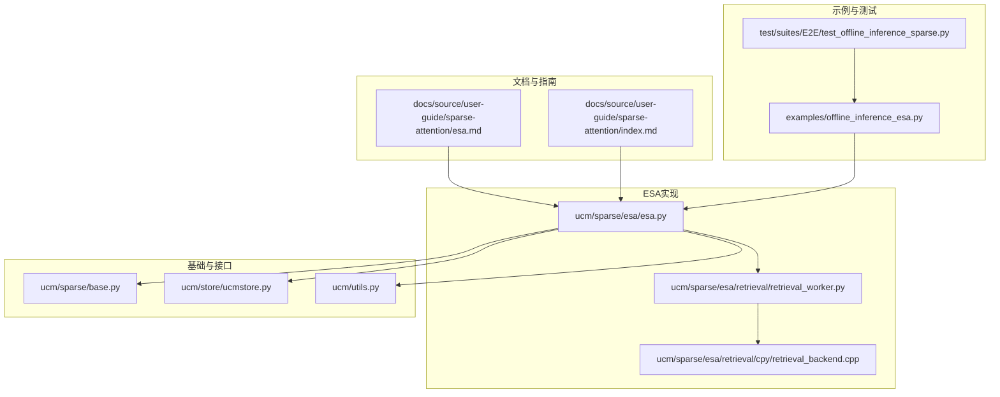
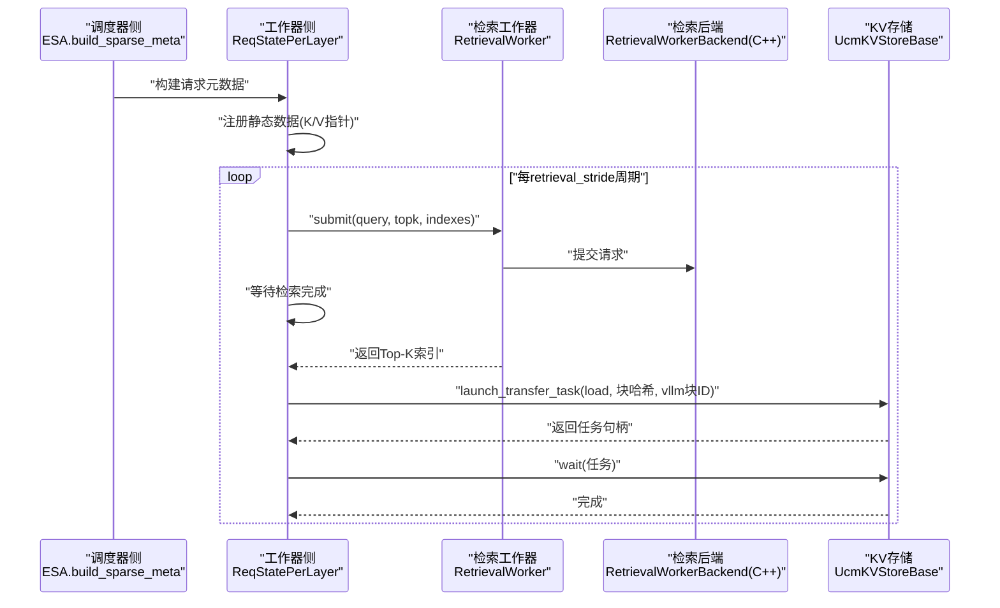
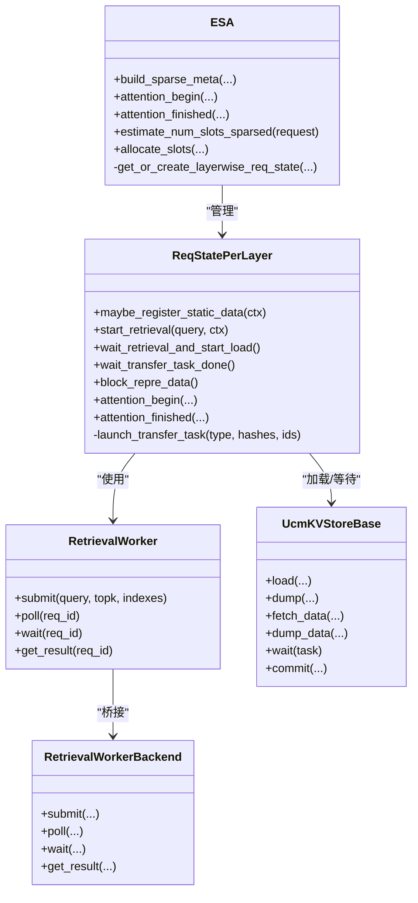
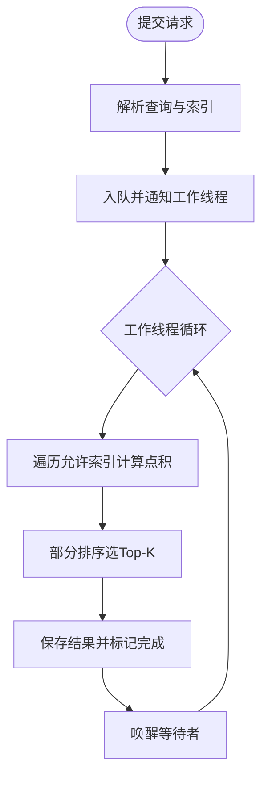
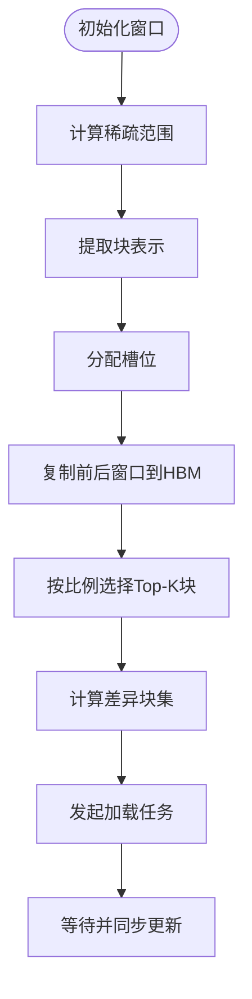
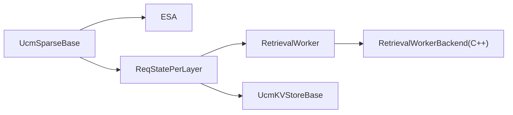

# ESA高效稀疏注意力

<cite>
**本文档引用的文件**
- [esa.md](file://docs/source/user-guide/sparse-attention/esa.md)
- [index.md](file://docs/source/user-guide/sparse-attention/index.md)
- [esa.py](file://ucm/sparse/esa/esa.py)
- [retrieval_worker.py](file://ucm/sparse/esa/retrieval/retrieval_worker.py)
- [retrieval_backend.cpp](file://ucm/sparse/esa/retrieval/cpy/retrieval_backend.cpp)
- [base.py](file://ucm/sparse/base.py)
- [ucmstore.py](file://ucm/store/ucmstore.py)
- [offline_inference_esa.py](file://examples/offline_inference_esa.py)
- [utils.py](file://ucm/utils.py)
- [test_offline_inference_sparse.py](file://test/suites/E2E/test_offline_inference_sparse.py)
</cite>

## 目录
1. [简介](#简介)
2. [项目结构](#项目结构)
3. [核心组件](#核心组件)
4. [架构总览](#架构总览)
5. [详细组件分析](#详细组件分析)
6. [依赖关系分析](#依赖关系分析)
7. [性能考量](#性能考量)
8. [故障排查指南](#故障排查指南)
9. [结论](#结论)
10. [附录](#附录)

## 简介
本文件面向ESA（Efficient Sparse Attention）高效稀疏注意力算法，系统阐述其在UCM框架下的实现与工作机制。ESA通过键值（KV）块表示与异步检索加载，显著降低解码阶段的内存占用与I/O开销，同时保持推理精度。本文涵盖：
- 键值缓存的高效检索策略与块级稀疏化方法
- 检索后端工作原理、异步检索队列管理与缓存预取机制
- 性能特征、内存占用优化与计算效率提升
- 配置参数说明、适用场景分析与性能调优建议
- 使用示例、性能基准测试与与其他稀疏算法的对比思路

## 项目结构
围绕ESA的关键目录与文件如下：
- 文档与用户指南：docs/source/user-guide/sparse-attention/esa.md、index.md
- ESA实现：ucm/sparse/esa/esa.py、retrieval/retrieval_worker.py、retrieval/cpy/retrieval_backend.cpp
- 基类与接口：ucm/sparse/base.py、ucm/store/ucmstore.py
- 示例与测试：examples/offline_inference_esa.py、test/suites/E2E/test_offline_inference_sparse.py
- 配置工具：ucm/utils.py

图表来源
- [esa.md](file://docs/source/user-guide/sparse-attention/esa.md#L1-L98)
- [index.md](file://docs/source/user-guide/sparse-attention/index.md#L1-L46)
- [esa.py](file://ucm/sparse/esa/esa.py#L1-L821)
- [retrieval_worker.py](file://ucm/sparse/esa/retrieval/retrieval_worker.py#L1-L107)
- [retrieval_backend.cpp](file://ucm/sparse/esa/retrieval/cpy/retrieval_backend.cpp#L1-L264)
- [base.py](file://ucm/sparse/base.py#L1-L323)
- [ucmstore.py](file://ucm/store/ucmstore.py#L1-L205)
- [offline_inference_esa.py](file://examples/offline_inference_esa.py#L1-L176)
- [test_offline_inference_sparse.py](file://test/suites/E2E/test_offline_inference_sparse.py#L1-L430)

章节来源
- [esa.md](file://docs/source/user-guide/sparse-attention/esa.md#L1-L98)
- [index.md](file://docs/source/user-guide/sparse-attention/index.md#L1-L46)

## 核心组件
- ESA稀疏注意力主类：负责请求元数据构建、层维度状态管理、异步检索与加载调度、以及与KV存储的交互。
- 检索工作器：封装Python侧输入处理与结果等待，并桥接到C++检索后端。
- 检索后端（C++）：多线程异步执行Top-K检索，支持NUMA亲和与CPU亲和绑定，提供提交、轮询、等待与结果获取。
- 基类与接口：定义稀疏注意力在调度器与工作器两侧的通用接口，统一生命周期钩子。
- 存储接口：抽象KV缓存加载/卸载任务，提供等待与检查能力。
- 示例与配置：提供ESA启用方式、参数配置与运行脚本。

章节来源
- [esa.py](file://ucm/sparse/esa/esa.py#L421-L821)
- [retrieval_worker.py](file://ucm/sparse/esa/retrieval/retrieval_worker.py#L11-L107)
- [retrieval_backend.cpp](file://ucm/sparse/esa/retrieval/cpy/retrieval_backend.cpp#L21-L264)
- [base.py](file://ucm/sparse/base.py#L127-L323)
- [ucmstore.py](file://ucm/store/ucmstore.py#L39-L205)
- [offline_inference_esa.py](file://examples/offline_inference_esa.py#L63-L111)

## 架构总览
ESA的整体流程分为三阶段：
- 预填充阶段：将完整KV缓存从HBM写入存储（或仅保留关键窗口）
- 解码阶段：周期性地启动异步检索，选择Top-K相关块并加载至HBM；随后在下个周期同步等待加载完成
- 后处理阶段：更新当前层的KV缓存视图，确保注意力计算仅访问HBM中的必要块

图表来源
- [esa.py](file://ucm/sparse/esa/esa.py#L272-L418)
- [retrieval_worker.py](file://ucm/sparse/esa/retrieval/retrieval_worker.py#L23-L35)
- [retrieval_backend.cpp](file://ucm/sparse/esa/retrieval/cpy/retrieval_backend.cpp#L76-L151)
- [ucmstore.py](file://ucm/store/ucmstore.py#L96-L180)

## 详细组件分析

### ESA主类与状态管理
- 请求元数据构建：根据调度输出与注意力元数据，生成每请求的块哈希序列、查询起始位置、已计算/计划生成token数等。
- 层维度状态：每个请求在每层维护独立的状态对象，包含槽位分配池、块哈希映射、窗口范围、检索任务与传输任务等。
- 异步检索与加载：在解码阶段按周期启动检索，等待完成后仅加载差异块，避免重复传输。
- 内存布局与偏移：根据tp大小、层数、头数与头尺寸计算K/V基址偏移，支持MLA模型变体。

图表来源
- [esa.py](file://ucm/sparse/esa/esa.py#L421-L821)
- [retrieval_worker.py](file://ucm/sparse/esa/retrieval/retrieval_worker.py#L11-L36)
- [retrieval_backend.cpp](file://ucm/sparse/esa/retrieval/cpy/retrieval_backend.cpp#L21-L64)
- [ucmstore.py](file://ucm/store/ucmstore.py#L39-L205)

章节来源
- [esa.py](file://ucm/sparse/esa/esa.py#L421-L821)

### 检索后端与异步队列
- 多线程后端：为每个绑定的CPU核心创建工作线程，支持NUMA内存亲和设置，保证高吞吐与低抖动。
- 请求队列与状态：内部维护请求队列、结果映射与条件变量，支持poll/wait与结果获取。
- 计算逻辑：对每个请求遍历允许的索引集合，计算点积得分并部分排序选取Top-K。

图表来源
- [retrieval_backend.cpp](file://ucm/sparse/esa/retrieval/cpy/retrieval_backend.cpp#L171-L240)

章节来源
- [retrieval_backend.cpp](file://ucm/sparse/esa/retrieval/cpy/retrieval_backend.cpp#L1-L264)

### KV块表示与块级稀疏化
- 块表示：对每个KV块沿序列维求均值得到固定维度向量，作为检索的特征表示。
- 稀疏范围：根据初始窗口、局部窗口与上下文长度估算可稀疏化的块数量。
- 窗口策略：保留前缀窗口与后缀窗口，中间区域按比例采样Top-K块。

图表来源
- [esa.py](file://ucm/sparse/esa/esa.py#L323-L418)

章节来源
- [esa.py](file://ucm/sparse/esa/esa.py#L323-L418)

### 配置参数与使用示例
- 启用方式：通过环境变量与KV传输配置开启ESA稀疏注意力。
- 关键参数：
  - init_window_sz：初始窗口大小（块数）
  - local_window_sz：局部窗口大小（块数）
  - min_blocks：最小块数阈值，低于此阈值不启用稀疏
  - sparse_ratio：中间稀疏化比例
  - retrieval_stride：检索周期步长
- 示例脚本：提供完整的模型路径、数据集路径与UCM存储目录配置。

章节来源
- [esa.md](file://docs/source/user-guide/sparse-attention/esa.md#L18-L42)
- [offline_inference_esa.py](file://examples/offline_inference_esa.py#L63-L111)

## 依赖关系分析
- ESA依赖于UCM稀疏基类接口，以统一生命周期钩子与元数据传递。
- 检索后端通过pybind11桥接到Python侧，实现高性能异步检索。
- 存储接口抽象了加载/卸载/等待等操作，便于替换不同后端（NFS/PC/DS3FS等）。

图表来源
- [base.py](file://ucm/sparse/base.py#L127-L323)
- [esa.py](file://ucm/sparse/esa/esa.py#L421-L821)
- [retrieval_worker.py](file://ucm/sparse/esa/retrieval/retrieval_worker.py#L11-L36)
- [retrieval_backend.cpp](file://ucm/sparse/esa/retrieval/cpy/retrieval_backend.cpp#L255-L264)
- [ucmstore.py](file://ucm/store/ucmstore.py#L39-L205)

章节来源
- [base.py](file://ucm/sparse/base.py#L1-L323)
- [esa.py](file://ucm/sparse/esa/esa.py#L1-L821)
- [retrieval_worker.py](file://ucm/sparse/esa/retrieval/retrieval_worker.py#L1-L107)
- [retrieval_backend.cpp](file://ucm/sparse/esa/retrieval/cpy/retrieval_backend.cpp#L1-L264)
- [ucmstore.py](file://ucm/store/ucmstore.py#L1-L205)

## 性能考量
- 异步重叠：检索与加载在解码周期内与模型执行异步重叠，减少等待时间。
- 差异加载：仅加载与上一周期不同的块，降低I/O带宽与延迟。
- NUMA/CPU亲和：检索后端绑定到特定CPU核心与NUMA节点，减少跨插槽通信。
- 内存布局优化：通过基址偏移与MLA适配，减少不必要的拷贝与格式转换。
- 参数调优建议：
  - retrieval_stride：增大可提高异步重叠度，但可能增加HBM碎片与同步成本
  - sparse_ratio：在精度与带宽间权衡，过小导致冗余访问，过大影响相关性
  - init/local_window_sz：确保上下文连续性，避免频繁窗口切换
  - block_size：与模型头尺寸、并行度共同决定块表示维度与缓存命中率

[本节为通用性能讨论，无需具体文件分析]

## 故障排查指南
- 检索后端异常
  - 症状：提交失败或结果未就绪
  - 排查：确认查询维度与索引批次匹配；检查请求ID有效性；观察后端日志与NUMA绑定状态
- 加载任务阻塞
  - 症状：wait超时或长时间无响应
  - 排查：确认块哈希与vLLM块ID映射正确；检查存储后端可用性与权限；核对等待队列深度
- 精度与一致性
  - 症状：与全注意力相比出现微小差异
  - 排查：检查MLA模式下的K/V偏移计算；验证窗口复制与同步时机

章节来源
- [retrieval_backend.cpp](file://ucm/sparse/esa/retrieval/cpy/retrieval_backend.cpp#L76-L151)
- [ucmstore.py](file://ucm/store/ucmstore.py#L170-L205)

## 结论
ESA通过“块表示+异步检索+差异加载”的组合，在保持推理精度的同时显著降低解码阶段的内存占用与I/O压力。其核心优势在于：
- 明确的稀疏范围与窗口策略，确保上下文完整性
- 高效的检索后端与NUMA/CPU亲和绑定，提升吞吐与稳定性
- 细粒度的任务调度与差异加载，最大化异步重叠收益

对于长上下文与高并发场景，ESA提供了可配置、可扩展且易于集成的稀疏注意力解决方案。

[本节为总结性内容，无需具体文件分析]

## 附录

### 使用示例与运行步骤
- 环境准备：设置模型路径、数据集路径与UCM存储目录
- 启用ESA：导出ENABLE_SPARSE=true，配置ucm_sparse_config
- 运行示例：执行examples/offline_inference_esa.py

章节来源
- [offline_inference_esa.py](file://examples/offline_inference_esa.py#L24-L111)
- [esa.md](file://docs/source/user-guide/sparse-attention/esa.md#L9-L17)

### 性能基准测试与对比思路
- 基准测试：可参考仓库中的日志性能基准脚本，评估Python与C++日志路径的开销差异
- 对比思路：与GSA/KVStar等稀疏注意力方案对比，关注以下指标
  - 解码速度（tokens/s）
  - HBM占用（MB/GPU）
  - I/O带宽占用
  - 精度（F1/ROUGE等）

章节来源
- [logging_perf_test.py](file://benchmarks/logging_perf_test.py#L1-L181)
- [index.md](file://docs/source/user-guide/sparse-attention/index.md#L1-L46)