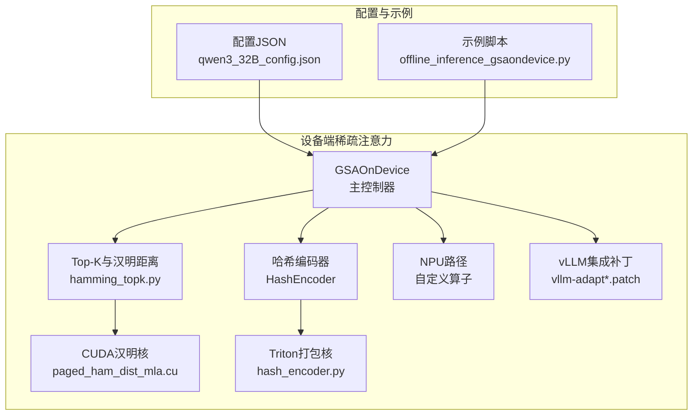
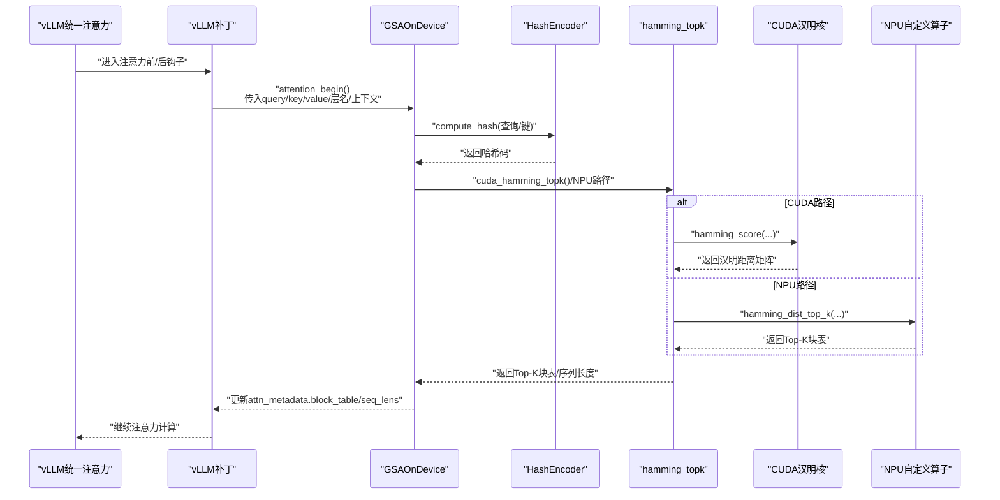
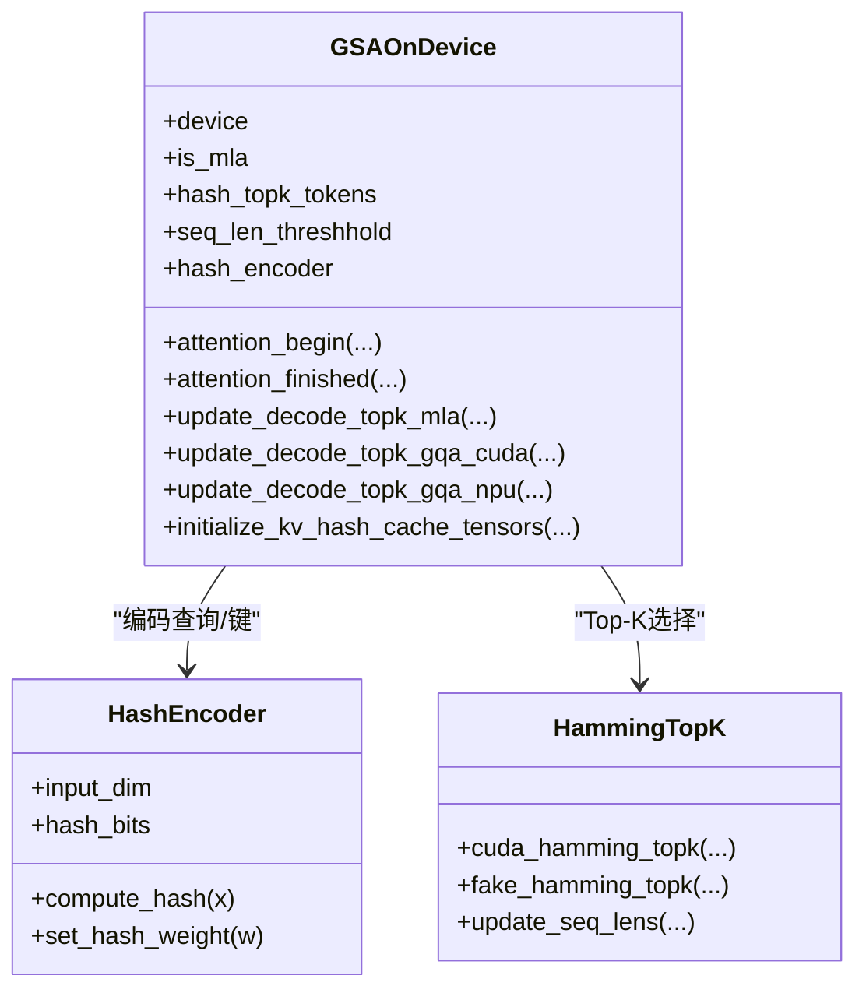
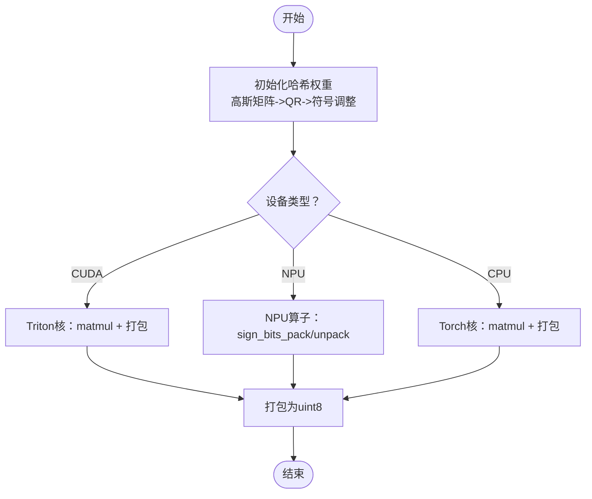
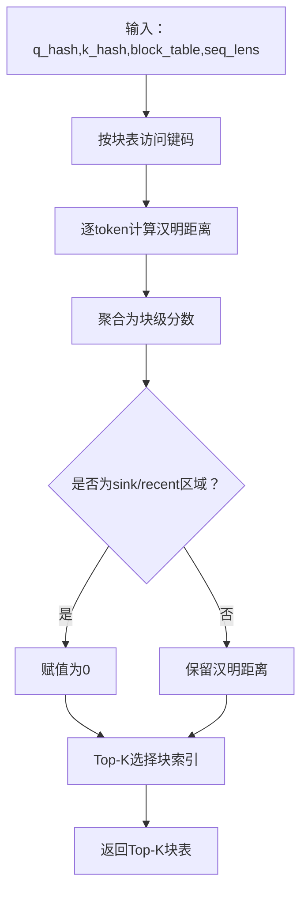
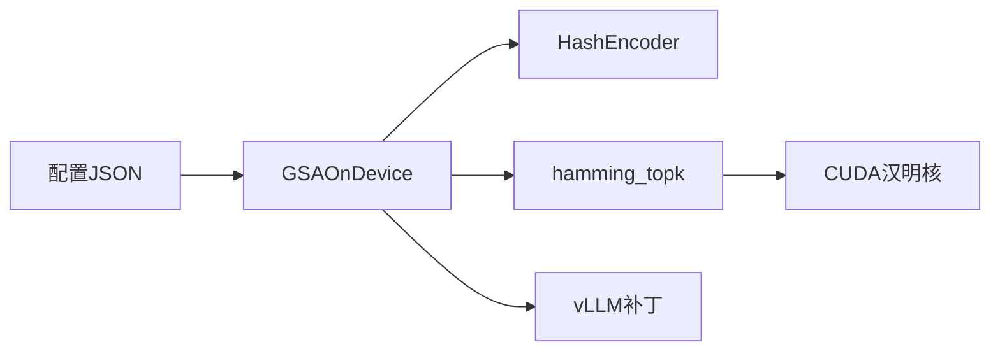

# GSA On Device设备端稀疏注意力

<cite>
**本文引用的文件**
- [ucm/sparse/gsa_on_device/gsa_on_device.py](file://ucm/sparse/gsa_on_device/gsa_on_device.py)
- [ucm/sparse/gsa_on_device/gsa_on_device_config.py](file://ucm/sparse/gsa_on_device/gsa_on_device_config.py)
- [ucm/sparse/gsa_on_device/hash_encoder.py](file://ucm/sparse/gsa_on_device/hash_encoder.py)
- [ucm/sparse/gsa_on_device/hamming_topk.py](file://ucm/sparse/gsa_on_device/hamming_topk.py)
- [ucm/sparse/gsa_on_device/ham_dist/paged_ham_dist_mla.cu](file://ucm/sparse/gsa_on_device/ham_dist/paged_ham_dist_mla.cu)
- [ucm/sparse/gsa_on_device/ham_dist/operator.h](file://ucm/sparse/gsa_on_device/ham_dist/operator.h)
- [ucm/sparse/gsa_on_device/ham_dist/cp_async.cuh](file://ucm/sparse/gsa_on_device/ham_dist/cp_async.cuh)
- [ucm/sparse/gsa_on_device/hash_retrieval/cpy/hash_retrieval_backend.cpp](file://ucm/sparse/gsa_on_device/hash_retrieval/cpy/hash_retrieval_backend.cpp)
- [ucm/sparse/gsa_on_device/configs/gsa_on_device_qwen3_32B_config.json](file://ucm/sparse/gsa_on_device/configs/gsa_on_device_qwen3_32B_config.json)
- [ucm/integration/vllm/patch/0.11.0/vllm-adapt.patch](file://ucm/integration/vllm/patch/0.11.0/vllm-adapt.patch)
- [ucm/integration/vllm/patch/0.11.0/vllm-adapt-sparse.patch](file://ucm/integration/vllm/patch/0.11.0/vllm-adapt-sparse.patch)
- [examples/offline_inference_gsaondevice.py](file://examples/offline_inference_gsaondevice.py)
</cite>

## 目录
1. [简介](#简介)
2. [项目结构](#项目结构)
3. [核心组件](#核心组件)
4. [架构总览](#架构总览)
5. [详细组件分析](#详细组件分析)
6. [依赖关系分析](#依赖关系分析)
7. [性能考量](#性能考量)
8. [故障排查指南](#故障排查指南)
9. [结论](#结论)
10. [附录](#附录)

## 简介
本技术文档面向GSA On Device（设备端稀疏注意力）算法，系统阐述其在设备侧的实现原理与硬件优化策略，涵盖：
- 汉明距离计算与Top-K选择
- 哈希编码机制与权重初始化
- CUDA核函数实现细节与设备内存管理
- 哈希检索后端与哈希编码器实现
- 不同硬件平台（CUDA/NPU）的适配策略与性能优化
- 配置参数说明、硬件要求与性能调优建议
- 实现示例、性能基准与硬件兼容性指南

## 项目结构
GSA On Device位于统一缓存管理（UCM）子模块中，围绕vLLM扩展点集成稀疏注意力流程。关键目录与文件如下：
- 稀疏注意力主实现：ucm/sparse/gsa_on_device/gsa_on_device.py
- 配置数据结构与模型配置：ucm/sparse/gsa_on_device/gsa_on_device_config.py、configs/*.json
- 哈希编码器与Triton/Kernels：ucm/sparse/gsa_on_device/hash_encoder.py、ham_dist/*.cu、*.h
- Top-K与汉明距离接口：ucm/sparse/gsa_on_device/hamming_topk.py
- 哈希检索后端（CPU多线程SIMD）：ucm/sparse/gsa_on_device/hash_retrieval/cpy/hash_retrieval_backend.cpp
- vLLM补丁与集成：ucm/integration/vllm/patch/*/*.patch
- 示例脚本：examples/offline_inference_gsaondevice.py

图表来源
- [ucm/sparse/gsa_on_device/gsa_on_device.py](file://ucm/sparse/gsa_on_device/gsa_on_device.py#L99-L279)
- [ucm/sparse/gsa_on_device/hash_encoder.py](file://ucm/sparse/gsa_on_device/hash_encoder.py#L278-L413)
- [ucm/sparse/gsa_on_device/hamming_topk.py](file://ucm/sparse/gsa_on_device/hamming_topk.py#L16-L61)
- [ucm/sparse/gsa_on_device/ham_dist/paged_ham_dist_mla.cu](file://ucm/sparse/gsa_on_device/ham_dist/paged_ham_dist_mla.cu#L109-L438)
- [ucm/sparse/gsa_on_device/configs/gsa_on_device_qwen3_32B_config.json](file://ucm/sparse/gsa_on_device/configs/gsa_on_device_qwen3_32B_config.json#L1-L235)
- [ucm/integration/vllm/patch/0.11.0/vllm-adapt.patch](file://ucm/integration/vllm/patch/0.11.0/vllm-adapt.patch#L692-L727)
- [examples/offline_inference_gsaondevice.py](file://examples/offline_inference_gsaondevice.py#L64-L102)

章节来源
- [ucm/sparse/gsa_on_device/gsa_on_device.py](file://ucm/sparse/gsa_on_device/gsa_on_device.py#L99-L279)
- [ucm/sparse/gsa_on_device/gsa_on_device_config.py](file://ucm/sparse/gsa_on_device/gsa_on_device_config.py#L36-L279)
- [ucm/sparse/gsa_on_device/hash_encoder.py](file://ucm/sparse/gsa_on_device/hash_encoder.py#L278-L413)
- [ucm/sparse/gsa_on_device/hamming_topk.py](file://ucm/sparse/gsa_on_device/hamming_topk.py#L16-L61)
- [ucm/sparse/gsa_on_device/ham_dist/paged_ham_dist_mla.cu](file://ucm/sparse/gsa_on_device/ham_dist/paged_ham_dist_mla.cu#L109-L438)
- [ucm/sparse/gsa_on_device/configs/gsa_on_device_qwen3_32B_config.json](file://ucm/sparse/gsa_on_device/configs/gsa_on_device_qwen3_32B_config.json#L1-L235)
- [ucm/integration/vllm/patch/0.11.0/vllm-adapt.patch](file://ucm/integration/vllm/patch/0.11.0/vllm-adapt.patch#L692-L727)
- [examples/offline_inference_gsaondevice.py](file://examples/offline_inference_gsaondevice.py#L64-L102)

## 核心组件
- GSAOnDevice：设备端稀疏注意力主控制器，负责根据模型配置与运行阶段（prefill/decode）选择是否启用哈希注意力，并在设备侧执行哈希编码、Top-K选择与块表更新。
- HashEncoder：将浮点特征映射为二进制哈希码并打包为uint8，支持CUDA（Triton）、NPU（原生算子）与CPU路径。
- hamming_topk：封装汉明距离计算与Top-K选择，调用CUDA汉明核或NPU自定义算子。
- paged_ham_dist_mla.cu：CUDA汉明核，按块表访问键码，计算每token汉明距离并聚合为块级分数，随后Top-K选择块索引。
- hash_retrieval_backend.cpp：CPU侧哈希检索后端，使用SIMD指令（NEON/AVX）加速汉明距离计算，配合线程池与NUMA亲和。
- vLLM补丁：在统一注意力前后插入稀疏注意力钩子，传递k_hash与元数据。

章节来源
- [ucm/sparse/gsa_on_device/gsa_on_device.py](file://ucm/sparse/gsa_on_device/gsa_on_device.py#L99-L279)
- [ucm/sparse/gsa_on_device/hash_encoder.py](file://ucm/sparse/gsa_on_device/hash_encoder.py#L278-L413)
- [ucm/sparse/gsa_on_device/hamming_topk.py](file://ucm/sparse/gsa_on_device/hamming_topk.py#L16-L61)
- [ucm/sparse/gsa_on_device/ham_dist/paged_ham_dist_mla.cu](file://ucm/sparse/gsa_on_device/ham_dist/paged_ham_dist_mla.cu#L109-L438)
- [ucm/sparse/gsa_on_device/hash_retrieval/cpy/hash_retrieval_backend.cpp](file://ucm/sparse/gsa_on_device/hash_retrieval/cpy/hash_retrieval_backend.cpp#L165-L434)
- [ucm/integration/vllm/patch/0.11.0/vllm-adapt.patch](file://ucm/integration/vllm/patch/0.11.0/vllm-adapt.patch#L692-L727)

## 架构总览
下图展示从vLLM统一注意力到设备端稀疏注意力的整体流程，以及各组件交互关系。

图表来源
- [ucm/integration/vllm/patch/0.11.0/vllm-adapt.patch](file://ucm/integration/vllm/patch/0.11.0/vllm-adapt.patch#L692-L727)
- [ucm/sparse/gsa_on_device/gsa_on_device.py](file://ucm/sparse/gsa_on_device/gsa_on_device.py#L557-L623)
- [ucm/sparse/gsa_on_device/hamming_topk.py](file://ucm/sparse/gsa_on_device/hamming_topk.py#L16-L61)
- [ucm/sparse/gsa_on_device/ham_dist/paged_ham_dist_mla.cu](file://ucm/sparse/gsa_on_device/ham_dist/paged_ham_dist_mla.cu#L297-L438)

## 详细组件分析

### GSAOnDevice类与工作流
- 设备类型检测：根据vLLM配置选择CUDA或NPU路径，初始化设备张量与缓冲区。
- 模型配置解析：自动匹配模型对应的配置文件，校验seq_len阈值、Top-K与块大小等约束。
- 哈希编码：MLA模式下对nope与rope分别编码并拼接；GQA模式下对query做降头处理后编码。
- 缓存键哈希：在非回滚/跳层时，将键的哈希码写入设备侧k_hash缓存。
- Top-K更新：在decode阶段依据查询哈希与键哈希计算汉明距离，选择Top-K块表并更新attn_metadata。

图表来源
- [ucm/sparse/gsa_on_device/gsa_on_device.py](file://ucm/sparse/gsa_on_device/gsa_on_device.py#L99-L279)
- [ucm/sparse/gsa_on_device/hash_encoder.py](file://ucm/sparse/gsa_on_device/hash_encoder.py#L278-L413)
- [ucm/sparse/gsa_on_device/hamming_topk.py](file://ucm/sparse/gsa_on_device/hamming_topk.py#L16-L61)

章节来源
- [ucm/sparse/gsa_on_device/gsa_on_device.py](file://ucm/sparse/gsa_on_device/gsa_on_device.py#L99-L279)
- [ucm/sparse/gsa_on_device/gsa_on_device.py](file://ucm/sparse/gsa_on_device/gsa_on_device.py#L557-L623)
- [ucm/sparse/gsa_on_device/gsa_on_device.py](file://ucm/sparse/gsa_on_device/gsa_on_device.py#L625-L654)

### 哈希编码器与权重初始化
- 权重生成：采用随机高斯矩阵QR分解并调整符号以满足Haar分布，确保哈希近似均匀。
- 设备适配：
  - CUDA：使用Triton核进行矩阵乘与打包，支持bfloat16降级为float32。
  - NPU：使用原生算子进行sign_bits_pack/unpack，仅支持特定精度。
  - CPU：使用torch实现与位掩码打包。
- 形状与打包：输入维度与哈希位数必须为8的倍数，输出为uint8的打包形式。

图表来源
- [ucm/sparse/gsa_on_device/hash_encoder.py](file://ucm/sparse/gsa_on_device/hash_encoder.py#L318-L412)

章节来源
- [ucm/sparse/gsa_on_device/hash_encoder.py](file://ucm/sparse/gsa_on_device/hash_encoder.py#L278-L413)

### CUDA汉明核与Top-K选择
- 核函数设计：按块表访问键码，使用异或与popcount统计汉明距离，支持连续块与非连续块两种模式。
- 分数聚合：将token级汉明距离聚合为块级最小值，结合sink/recent策略屏蔽边界区域。
- Top-K：对块级分数进行Top-K选择，返回对应块表索引并排序。

图表来源
- [ucm/sparse/gsa_on_device/ham_dist/paged_ham_dist_mla.cu](file://ucm/sparse/gsa_on_device/ham_dist/paged_ham_dist_mla.cu#L111-L213)
- [ucm/sparse/gsa_on_device/ham_dist/paged_ham_dist_mla.cu](file://ucm/sparse/gsa_on_device/ham_dist/paged_ham_dist_mla.cu#L215-L295)
- [ucm/sparse/gsa_on_device/hamming_topk.py](file://ucm/sparse/gsa_on_device/hamming_topk.py#L16-L61)

章节来源
- [ucm/sparse/gsa_on_device/ham_dist/paged_ham_dist_mla.cu](file://ucm/sparse/gsa_on_device/ham_dist/paged_ham_dist_mla.cu#L109-L438)
- [ucm/sparse/gsa_on_device/hamming_topk.py](file://ucm/sparse/gsa_on_device/hamming_topk.py#L16-L61)

### NPU路径与自定义算子
- NPU路径通过自定义算子实现哈希编码缓存与汉明距离Top-K，支持切片与掩码控制，减少无效请求的计算开销。
- 关键缓冲区：批大小、块大小、Top-K数量、序列长度等在初始化时分配，避免反复申请。

章节来源
- [ucm/sparse/gsa_on_device/gsa_on_device.py](file://ucm/sparse/gsa_on_device/gsa_on_device.py#L155-L279)
- [ucm/sparse/gsa_on_device/gsa_on_device.py](file://ucm/sparse/gsa_on_device/gsa_on_device.py#L381-L427)
- [ucm/sparse/gsa_on_device/gsa_on_device.py](file://ucm/sparse/gsa_on_device/gsa_on_device.py#L518-L556)

### 哈希检索后端（CPU）
- 多线程与SIMD：根据CPU架构选择NEON或AVX路径，使用向量化异或与popcount加速汉明距离计算。
- 线程亲和与NUMA：支持绑定线程到指定核心与NUMA节点，提升大缓存数据访问性能。
- 接口：提交查询、轮询结果、等待完成与获取结果。

章节来源
- [ucm/sparse/gsa_on_device/hash_retrieval/cpy/hash_retrieval_backend.cpp](file://ucm/sparse/gsa_on_device/hash_retrieval/cpy/hash_retrieval_backend.cpp#L165-L434)

### vLLM集成与补丁
- 补丁在统一注意力前后注入稀疏注意力钩子，传递k_hash与元数据，使GSAOnDevice在设备侧参与注意力计算。
- 支持MLA与GQA两种模式，按层配置回滚/跳过策略。

章节来源
- [ucm/integration/vllm/patch/0.11.0/vllm-adapt.patch](file://ucm/integration/vllm/patch/0.11.0/vllm-adapt.patch#L692-L727)
- [ucm/integration/vllm/patch/0.11.0/vllm-adapt-sparse.patch](file://ucm/integration/vllm/patch/0.11.0/vllm-adapt-sparse.patch#L61-L98)

## 依赖关系分析
- GSAOnDevice依赖HashEncoder进行哈希编码，依赖hamming_topk进行汉明距离与Top-K，底层调用CUDA核或NPU算子。
- 配置文件驱动：通过JSON配置决定Top-K比例、回滚/跳层策略、块大小等。
- vLLM补丁：在注意力前后钩子中调用GSAOnDevice，实现端到端集成。

图表来源
- [ucm/sparse/gsa_on_device/gsa_on_device.py](file://ucm/sparse/gsa_on_device/gsa_on_device.py#L125-L154)
- [ucm/sparse/gsa_on_device/gsa_on_device_config.py](file://ucm/sparse/gsa_on_device/gsa_on_device_config.py#L36-L279)
- [ucm/sparse/gsa_on_device/hamming_topk.py](file://ucm/sparse/gsa_on_device/hamming_topk.py#L16-L61)
- [ucm/integration/vllm/patch/0.11.0/vllm-adapt.patch](file://ucm/integration/vllm/patch/0.11.0/vllm-adapt.patch#L692-L727)

章节来源
- [ucm/sparse/gsa_on_device/gsa_on_device.py](file://ucm/sparse/gsa_on_device/gsa_on_device.py#L125-L154)
- [ucm/sparse/gsa_on_device/gsa_on_device_config.py](file://ucm/sparse/gsa_on_device/gsa_on_device_config.py#L36-L279)
- [ucm/sparse/gsa_on_device/hamming_topk.py](file://ucm/sparse/gsa_on_device/hamming_topk.py#L16-L61)
- [ucm/integration/vllm/patch/0.11.0/vllm-adapt.patch](file://ucm/integration/vllm/patch/0.11.0/vllm-adapt.patch#L692-L727)

## 性能考量
- CUDA路径
  - Triton打包核：通过分块与合适的BLOCK尺寸（如32/64/16）平衡吞吐与寄存器压力。
  - 汉明核：使用共享内存与跨线程归约，结合条件分支屏蔽无效位置，减少无效计算。
  - 流水与异步：cp_async支持异步拷贝至共享内存，commit/wait组管理流水线。
- NPU路径
  - 原生算子：利用NPU的sign_bits_pack/unpack加速哈希打包与解包。
  - 切片与掩码：仅对满足阈值的请求进行Top-K计算，降低无效计算。
- CPU路径
  - SIMD指令：NEON/AVX路径显著提升向量化性能；线程亲和与NUMA绑定减少跨NUMA访问。
- 内存管理
  - 设备侧缓存：k_hash按块大小预分配，避免频繁内存分配。
  - 连续性：CUDA核要求键码连续，减少越界检查与分支。

章节来源
- [ucm/sparse/gsa_on_device/hash_encoder.py](file://ucm/sparse/gsa_on_device/hash_encoder.py#L136-L261)
- [ucm/sparse/gsa_on_device/ham_dist/paged_ham_dist_mla.cu](file://ucm/sparse/gsa_on_device/ham_dist/paged_ham_dist_mla.cu#L111-L213)
- [ucm/sparse/gsa_on_device/ham_dist/cp_async.cuh](file://ucm/sparse/gsa_on_device/ham_dist/cp_async.cuh#L23-L181)
- [ucm/sparse/gsa_on_device/gsa_on_device.py](file://ucm/sparse/gsa_on_device/gsa_on_device.py#L155-L279)

## 故障排查指南
- 设备不匹配
  - 症状：初始化时报错或精度不支持。
  - 处理：确认CUDA/NPU可用性，检查dtype降级逻辑（如bfloat16在CUDA降为float32）。
- 形状不一致
  - 症状：哈希编码或汉明核断言失败。
  - 处理：确保输入维度与配置一致，块大小与Top-K可整除。
- 性能异常
  - 症状：Top-K耗时过长或内存占用过高。
  - 处理：检查CUDA核BLOCK尺寸、共享内存使用与cp_async流水；NPU路径检查切片与掩码设置。
- vLLM集成问题
  - 症状：稀疏注意力未生效。
  - 处理：确认环境变量与补丁已正确应用，检查层名与元数据传递。

章节来源
- [ucm/sparse/gsa_on_device/gsa_on_device.py](file://ucm/sparse/gsa_on_device/gsa_on_device.py#L143-L154)
- [ucm/sparse/gsa_on_device/hash_encoder.py](file://ucm/sparse/gsa_on_device/hash_encoder.py#L318-L333)
- [ucm/integration/vllm/patch/0.11.0/vllm-adapt.patch](file://ucm/integration/vllm/patch/0.11.0/vllm-adapt.patch#L692-L727)

## 结论
GSA On Device通过设备侧哈希编码与汉明距离Top-K，在长序列场景显著降低注意力计算复杂度。其核心优势在于：
- 可移植的哈希编码器与多平台实现（CUDA/Triton、NPU原生、CPU SIMD）
- 针对CUDA/NPU的深度优化（核函数、流水线、内存拷贝）
- 与vLLM无缝集成，支持MLA/GQA双模式与灵活的层级控制

建议在实际部署中结合硬件能力与模型规模，合理配置Top-K比例、块大小与回滚/跳层策略，以获得最佳性能与资源利用率。

## 附录

### 配置参数说明（节选）
- 模型与哈希
  - model_name：模型名称
  - is_mla：是否为MLA模式
  - hash_weight_type：哈希权重类型（random/fixed）
  - head_dim/hash_bits：输入维度与哈希位数
- 稀疏策略
  - seq_len_threshhold：触发GSAOnDevice的最小序列长度
  - chunk_size：块大小（需被128整除）
  - top_k_ratio_per_layer：每层Top-K比例列表
  - must_select_blocks：强制选择的块索引（正向从头、负向从尾）
- vLLM集成
  - vllm_hash_attention_topk：设备侧Top-K数量
  - vllm_hash_attention_rollback_layers/skip_layers：回滚/跳过的层索引

章节来源
- [ucm/sparse/gsa_on_device/gsa_on_device_config.py](file://ucm/sparse/gsa_on_device/gsa_on_device_config.py#L36-L279)
- [ucm/sparse/gsa_on_device/configs/gsa_on_device_qwen3_32B_config.json](file://ucm/sparse/gsa_on_device/configs/gsa_on_device_qwen3_32B_config.json#L1-L235)

### 硬件要求与适配策略
- CUDA
  - 需要PyTorch CUDA与Triton支持；推荐使用较新架构以获得更好Triton性能。
  - 注意bfloat16在CUDA下的QR实现限制，必要时降为float32。
- NPU
  - 依赖原生算子进行sign_bits_pack/unpack；确保设备驱动与框架版本兼容。
  - 利用切片与掩码减少无效请求的计算。
- CPU
  - 依赖NEON/AVX路径；可通过线程亲和与NUMA绑定优化大缓存访问。

章节来源
- [ucm/sparse/gsa_on_device/hash_encoder.py](file://ucm/sparse/gsa_on_device/hash_encoder.py#L300-L317)
- [ucm/sparse/gsa_on_device/gsa_on_device.py](file://ucm/sparse/gsa_on_device/gsa_on_device.py#L230-L279)

### 性能基准与示例
- 示例脚本展示了如何启用GSAOnDevice与UCM存储，设置KV传输配置与稀疏注意力开关。
- 建议在目标模型上运行离线推理脚本，记录生成时间与吞吐，对比开启/关闭稀疏注意力的差异。

章节来源
- [examples/offline_inference_gsaondevice.py](file://examples/offline_inference_gsaondevice.py#L64-L102)
- [examples/offline_inference_gsaondevice.py](file://examples/offline_inference_gsaondevice.py#L124-L167)