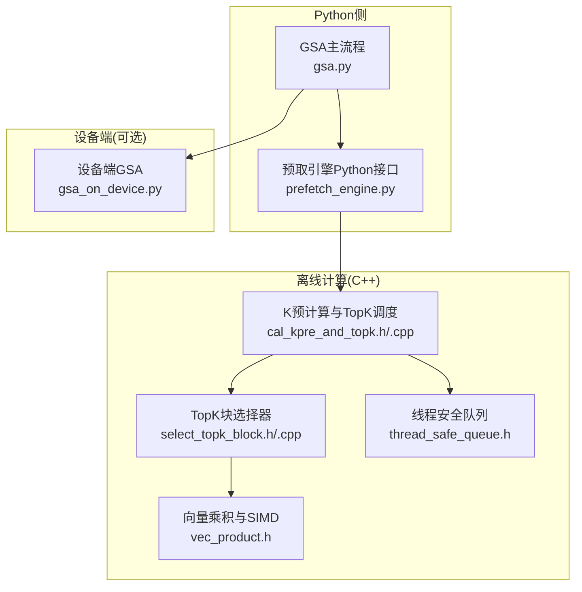
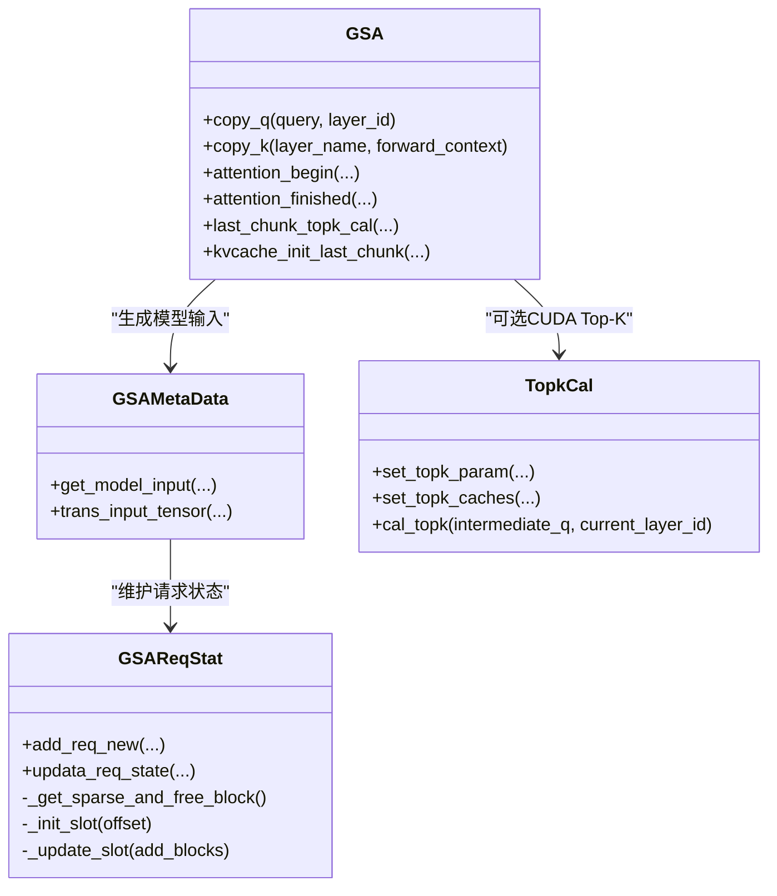
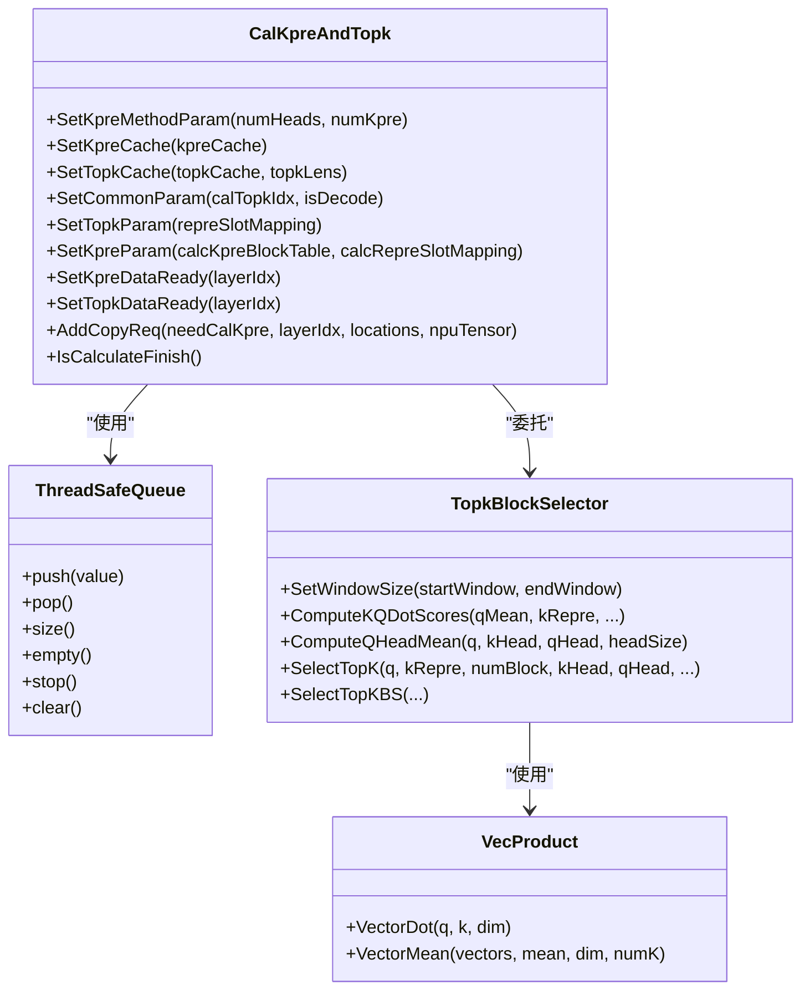
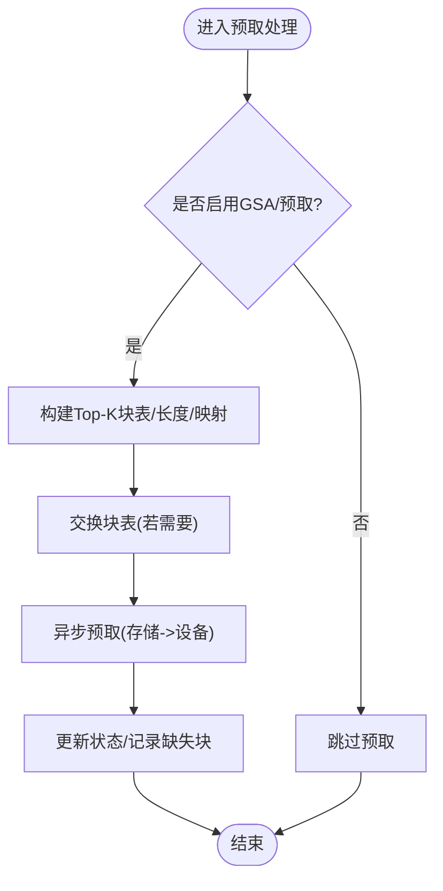
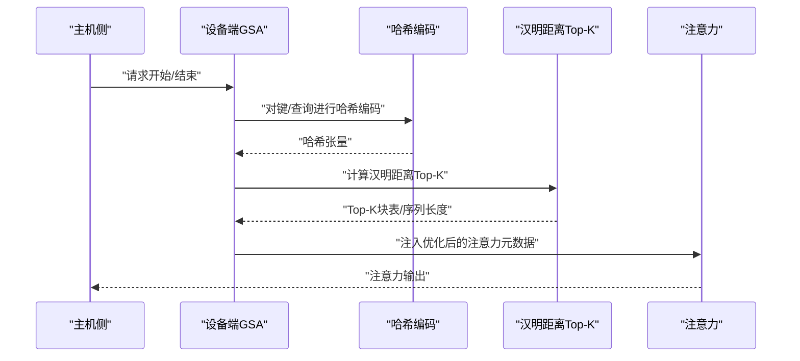
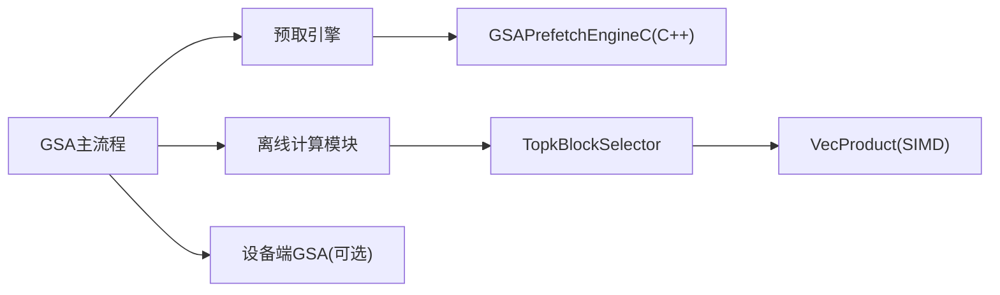

# GSA组稀疏注意力

<cite>
**本文引用的文件**
- [ucm/sparse/gsa/gsa.py](file://ucm/sparse/gsa/gsa.py)
- [ucm/sparse/gsa/offload_ops/include/cal_kpre_and_topk.h](file://ucm/sparse/gsa/offload_ops/include/cal_kpre_and_topk.h)
- [ucm/sparse/gsa/offload_ops/include/select_topk_block.h](file://ucm/sparse/gsa/offload_ops/include/select_topk_block.h)
- [ucm/sparse/gsa/offload_ops/include/thread_safe_queue.h](file://ucm/sparse/gsa/offload_ops/include/thread_safe_queue.h)
- [ucm/sparse/gsa/offload_ops/include/vec_product.h](file://ucm/sparse/gsa/offload_ops/include/vec_product.h)
- [ucm/sparse/gsa/offload_ops/src/cal_kpre_and_topk.cpp](file://ucm/sparse/gsa/offload_ops/src/cal_kpre_and_topk.cpp)
- [ucm/sparse/gsa/offload_ops/src/select_topk_block.cpp](file://ucm/sparse/gsa/offload_ops/src/select_topk_block.cpp)
- [ucm/sparse/gsa/prefetch/include/kvcache_pre.h](file://ucm/sparse/gsa/prefetch/include/kvcache_pre.h)
- [ucm/sparse/gsa/prefetch/prefetch_engine.py](file://ucm/sparse/gsa/prefetch/prefetch_engine.py)
- [ucm/sparse/gsa_on_device/gsa_on_device.py](file://ucm/sparse/gsa_on_device/gsa_on_device.py)
</cite>

## 目录
1. [简介](#简介)
2. [项目结构](#项目结构)
3. [核心组件](#核心组件)
4. [架构总览](#架构总览)
5. [详细组件分析](#详细组件分析)
6. [依赖关系分析](#依赖关系分析)
7. [性能考量](#性能考量)
8. [故障排查指南](#故障排查指南)
9. [结论](#结论)
10. [附录](#附录)

## 简介
本技术文档围绕GSA（Group Sparse Attention）组稀疏注意力算法展开，系统阐述其分组策略、组内稀疏化机制、K值预计算、Top-K块选择与分组优化算法；详述离线操作模块（向量乘积计算、线程安全队列、CUDA核函数优化）；解释预取引擎的工作原理与缓存预取策略；给出硬件加速实现、内存管理与并行计算优化方案；最后提供配置参数详解、性能特征分析、实际应用场景、使用示例、性能测试数据与调优建议。

## 项目结构
GSA相关代码主要分布在以下模块：
- Python侧主流程与元数据管理：ucm/sparse/gsa/gsa.py
- 预取引擎（CPU/C++实现）：ucm/sparse/gsa/prefetch/prefetch_engine.py 与 C++头文件
- 离线计算与Top-K块选择（C++/CUDA）：ucm/sparse/gsa/offload_ops 下的头文件与源码
- 设备端GSA（可选路径，NPU/CUDA）：ucm/sparse/gsa_on_device/gsa_on_device.py



图表来源
- [ucm/sparse/gsa/gsa.py](file://ucm/sparse/gsa/gsa.py#L475-L790)
- [ucm/sparse/gsa/prefetch/prefetch_engine.py](file://ucm/sparse/gsa/prefetch/prefetch_engine.py#L22-L120)
- [ucm/sparse/gsa/offload_ops/include/cal_kpre_and_topk.h](file://ucm/sparse/gsa/offload_ops/include/cal_kpre_and_topk.h#L11-L68)
- [ucm/sparse/gsa/offload_ops/include/select_topk_block.h](file://ucm/sparse/gsa/offload_ops/include/select_topk_block.h#L18-L138)
- [ucm/sparse/gsa/offload_ops/include/vec_product.h](file://ucm/sparse/gsa/offload_ops/include/vec_product.h#L83-L114)
- [ucm/sparse/gsa/offload_ops/include/thread_safe_queue.h](file://ucm/sparse/gsa/offload_ops/include/thread_safe_queue.h#L19-L39)
- [ucm/sparse/gsa_on_device/gsa_on_device.py](file://ucm/sparse/gsa_on_device/gsa_on_device.py#L99-L180)

章节来源
- [ucm/sparse/gsa/gsa.py](file://ucm/sparse/gsa/gsa.py#L1-L120)
- [ucm/sparse/gsa/prefetch/prefetch_engine.py](file://ucm/sparse/gsa/prefetch/prefetch_engine.py#L1-L120)
- [ucm/sparse/gsa/offload_ops/include/cal_kpre_and_topk.h](file://ucm/sparse/gsa/offload_ops/include/cal_kpre_and_topk.h#L1-L70)
- [ucm/sparse/gsa/offload_ops/include/select_topk_block.h](file://ucm/sparse/gsa/offload_ops/include/select_topk_block.h#L1-L143)
- [ucm/sparse/gsa/offload_ops/include/vec_product.h](file://ucm/sparse/gsa/offload_ops/include/vec_product.h#L1-L119)
- [ucm/sparse/gsa/offload_ops/include/thread_safe_queue.h](file://ucm/sparse/gsa/offload_ops/include/thread_safe_queue.h#L1-L41)
- [ucm/sparse/gsa_on_device/gsa_on_device.py](file://ucm/sparse/gsa_on_device/gsa_on_device.py#L1-L120)

## 核心组件
- GSA主流程与元数据管理：负责请求状态跟踪、分组策略、Top-K计算触发与KV缓存预取调度。
- 预取引擎：在CPU侧组织Top-K块表、序列长度、块表映射，并异步发起从存储到设备内存的预取。
- 离线计算模块：在后台线程中完成K预计算（键表示）与Top-K块选择，支持多线程与SIMD优化。
- 设备端GSA（可选）：在NPU/CUDA设备侧进行哈希编码与Top-K检索，减少主机侧负担。

章节来源
- [ucm/sparse/gsa/gsa.py](file://ucm/sparse/gsa/gsa.py#L475-L790)
- [ucm/sparse/gsa/prefetch/prefetch_engine.py](file://ucm/sparse/gsa/prefetch/prefetch_engine.py#L22-L120)
- [ucm/sparse/gsa/offload_ops/include/cal_kpre_and_topk.h](file://ucm/sparse/gsa/offload_ops/include/cal_kpre_and_topk.h#L11-L68)
- [ucm/sparse/gsa/offload_ops/include/select_topk_block.h](file://ucm/sparse/gsa/offload_ops/include/select_topk_block.h#L18-L138)
- [ucm/sparse/gsa_on_device/gsa_on_device.py](file://ucm/sparse/gsa_on_device/gsa_on_device.py#L99-L180)

## 架构总览
GSA整体工作流分为“请求状态管理—Top-K块规划—K预计算—设备注意力—缓存预取”几个阶段。Python侧负责高层调度与元数据生成，C++侧负责高并发离线计算与线程同步，预取引擎负责跨设备/存储的数据搬运。

```mermaid
sequenceDiagram
    participant Host as "主机侧Python"
    participant GSA as "GSA主流程"
    participant Pref as "预取引擎"
    participant Off as "离线计算(C++)"
    participant Dev as "设备侧注意力"
    
    Host->>GSA: "接收调度输出与请求状态"
    GSA->>GSA: "更新请求统计/分组策略"
    GSA->>Pref: "生成Top-K块表/序列长度/块表映射"
    Pref->>Off: "提交复制/计算任务(查询/K)"
    Off-->>Pref: "返回Top-K索引/键表示"
    Pref-->>GSA: "提供设备侧注意力输入"
    GSA->>Dev: "传入优化后的块表/序列长度"
    Dev-->>Host: "注意力输出"
```

图表来源
- [ucm/sparse/gsa/gsa.py](file://ucm/sparse/gsa/gsa.py#L627-L746)
- [ucm/sparse/gsa/prefetch/prefetch_engine.py](file://ucm/sparse/gsa/prefetch/prefetch_engine.py#L125-L179)
- [ucm/sparse/gsa/offload_ops/include/cal_kpre_and_topk.h](file://ucm/sparse/gsa/offload_ops/include/cal_kpre_and_topk.h#L47-L68)

## 详细组件分析

### 组件A：GSA主流程与元数据管理
- 请求状态管理：维护每个请求的块表、代表槽位映射、包含/排除掩码、剩余与预取索引等。
- 分组与稀疏化：根据提示长度阈值与阶段（预填充/解码）决定是否启用GSA；在解码阶段采用滑动窗口与预取策略。
- Top-K计算触发：在需要时调用CUDA或离线模块进行Top-K块选择；在最后块场景下进行一次性Top-K计算并初始化KV缓存。
- 注意力前后钩子：在注意力开始前注入优化后的块表与序列长度，在结束后进行最后块Top-K计算与KV缓存初始化。



图表来源
- [ucm/sparse/gsa/gsa.py](file://ucm/sparse/gsa/gsa.py#L475-L790)

章节来源
- [ucm/sparse/gsa/gsa.py](file://ucm/sparse/gsa/gsa.py#L45-L256)
- [ucm/sparse/gsa/gsa.py](file://ucm/sparse/gsa/gsa.py#L258-L336)
- [ucm/sparse/gsa/gsa.py](file://ucm/sparse/gsa/gsa.py#L386-L427)
- [ucm/sparse/gsa/gsa.py](file://ucm/sparse/gsa/gsa.py#L523-L589)
- [ucm/sparse/gsa/gsa.py](file://ucm/sparse/gsa/gsa.py#L627-L746)

### 组件B：离线操作模块（K预计算与Top-K块选择）
- 线程与队列：通过线程安全队列接收复制请求，分离复制线程与计算线程，避免阻塞。
- K预计算：对键缓存按块进行均值化表示，作为后续Top-K的候选。
- Top-K块选择：支持多线程并行计算块级分数，结合头均值与最大归一化维度，采用窗口约束与Top-K选择策略。
- 向量乘积与SIMD：根据平台自动选择SIMD级别（AVX/NEON/Scalar），提升点积计算效率。



图表来源
- [ucm/sparse/gsa/offload_ops/include/cal_kpre_and_topk.h](file://ucm/sparse/gsa/offload_ops/include/cal_kpre_and_topk.h#L11-L68)
- [ucm/sparse/gsa/offload_ops/include/thread_safe_queue.h](file://ucm/sparse/gsa/offload_ops/include/thread_safe_queue.h#L19-L39)
- [ucm/sparse/gsa/offload_ops/include/select_topk_block.h](file://ucm/sparse/gsa/offload_ops/include/select_topk_block.h#L18-L138)
- [ucm/sparse/gsa/offload_ops/include/vec_product.h](file://ucm/sparse/gsa/offload_ops/include/vec_product.h#L83-L114)

章节来源
- [ucm/sparse/gsa/offload_ops/src/cal_kpre_and_topk.cpp](file://ucm/sparse/gsa/offload_ops/src/cal_kpre_and_topk.cpp#L1-L200)
- [ucm/sparse/gsa/offload_ops/src/select_topk_block.cpp](file://ucm/sparse/gsa/offload_ops/src/select_topk_block.cpp#L1-L139)
- [ucm/sparse/gsa/offload_ops/include/select_topk_block.h](file://ucm/sparse/gsa/offload_ops/include/select_topk_block.h#L18-L138)
- [ucm/sparse/gsa/offload_ops/include/vec_product.h](file://ucm/sparse/gsa/offload_ops/include/vec_product.h#L55-L77)

### 组件C：预取引擎（缓存预取策略）
- 输入组织：根据请求状态生成Top-K块列表、块表长度、序列长度等，支持MLA与非MLA两种模式。
- 异步预取：将命中/缺失块信息传递给C++侧预取引擎，异步从存储加载到设备内存。
- 缓存对齐与内存布局：在MLA场景下进行256字节对齐以提升访存效率。
- 动态替换：在Top-K更新后交换块表，确保注意力阶段使用最新Top-K。



图表来源
- [ucm/sparse/gsa/prefetch/prefetch_engine.py](file://ucm/sparse/gsa/prefetch/prefetch_engine.py#L125-L249)
- [ucm/sparse/gsa/prefetch/include/kvcache_pre.h](file://ucm/sparse/gsa/prefetch/include/kvcache_pre.h#L67-L175)

章节来源
- [ucm/sparse/gsa/prefetch/prefetch_engine.py](file://ucm/sparse/gsa/prefetch/prefetch_engine.py#L22-L120)
- [ucm/sparse/gsa/prefetch/prefetch_engine.py](file://ucm/sparse/gsa/prefetch/prefetch_engine.py#L125-L249)
- [ucm/sparse/gsa/prefetch/include/kvcache_pre.h](file://ucm/sparse/gsa/prefetch/include/kvcache_pre.h#L67-L175)

### 组件D：设备端GSA（可选）
- 哈希编码：在MLA/GQA模式下分别对键/查询进行哈希编码，用于快速Top-K检索。
- Top-K检索：在CUDA/NPU上执行汉明距离Top-K，动态调整序列长度与tile调度元数据。
- 前缀缓存回填：在命中前缀缓存时，回填缺失的键以保证一致性。



图表来源
- [ucm/sparse/gsa_on_device/gsa_on_device.py](file://ucm/sparse/gsa_on_device/gsa_on_device.py#L99-L180)
- [ucm/sparse/gsa_on_device/gsa_on_device.py](file://ucm/sparse/gsa_on_device/gsa_on_device.py#L557-L623)

章节来源
- [ucm/sparse/gsa_on_device/gsa_on_device.py](file://ucm/sparse/gsa_on_device/gsa_on_device.py#L99-L180)
- [ucm/sparse/gsa_on_device/gsa_on_device.py](file://ucm/sparse/gsa_on_device/gsa_on_device.py#L557-L623)

## 依赖关系分析
- GSA主流程依赖预取引擎生成的Top-K块表与序列长度，以及离线模块提供的K预计算缓存。
- 预取引擎依赖C++侧GSAPrefetchEngineC进行异步加载与块映射管理。
- 离线模块内部通过TopkBlockSelector与VecProduct实现高性能Top-K与向量运算。
- 设备端GSA与主机侧GSA互为补充，设备端在NPU/CUDA上执行哈希与Top-K检索。



图表来源
- [ucm/sparse/gsa/gsa.py](file://ucm/sparse/gsa/gsa.py#L523-L589)
- [ucm/sparse/gsa/prefetch/prefetch_engine.py](file://ucm/sparse/gsa/prefetch/prefetch_engine.py#L89-L101)
- [ucm/sparse/gsa/offload_ops/include/select_topk_block.h](file://ucm/sparse/gsa/offload_ops/include/select_topk_block.h#L18-L138)
- [ucm/sparse/gsa/offload_ops/include/vec_product.h](file://ucm/sparse/gsa/offload_ops/include/vec_product.h#L83-L114)
- [ucm/sparse/gsa_on_device/gsa_on_device.py](file://ucm/sparse/gsa_on_device/gsa_on_device.py#L99-L180)

章节来源
- [ucm/sparse/gsa/gsa.py](file://ucm/sparse/gsa/gsa.py#L523-L589)
- [ucm/sparse/gsa/prefetch/prefetch_engine.py](file://ucm/sparse/gsa/prefetch/prefetch_engine.py#L89-L101)
- [ucm/sparse/gsa/offload_ops/include/select_topk_block.h](file://ucm/sparse/gsa/offload_ops/include/select_topk_block.h#L18-L138)
- [ucm/sparse/gsa_on_device/gsa_on_device.py](file://ucm/sparse/gsa_on_device/gsa_on_device.py#L99-L180)

## 性能考量
- 并行与流水线：离线模块采用双线程（复制/计算）+条件变量同步，避免主线程阻塞；Top-K选择支持OpenMP并行与窗口约束，兼顾精度与吞吐。
- SIMD优化：根据编译器能力自动选择AVX/NEON/Scalar，显著提升向量点积与均值计算性能。
- 内存对齐：MLA场景下256字节对齐KV缓存，降低访存开销。
- 异步预取：预取引擎在CPU侧组织数据，避免设备等待，提高利用率。
- 设备端加速：设备端GSA在NPU/CUDA上执行哈希与Top-K检索，减少主机侧压力。

[本节为通用性能讨论，不直接分析具体文件]

## 故障排查指南
- 线程安全问题：确认线程启动顺序与条件变量触发，避免竞态；检查队列停止逻辑与异常退出路径。
- 数据一致性：校验Top-K更新与块表交换时机，确保注意力阶段使用最新索引。
- 内存对齐：MLA模式下确认对齐参数与切片，避免越界访问。
- 设备端异常：检查哈希编码维度与设备类型匹配，确认NPU/CUDA后端可用性。

章节来源
- [ucm/sparse/gsa/offload_ops/src/cal_kpre_and_topk.cpp](file://ucm/sparse/gsa/offload_ops/src/cal_kpre_and_topk.cpp#L54-L69)
- [ucm/sparse/gsa/prefetch/prefetch_engine.py](file://ucm/sparse/gsa/prefetch/prefetch_engine.py#L206-L249)
- [ucm/sparse/gsa/offload_ops/include/vec_product.h](file://ucm/sparse/gsa/offload_ops/include/vec_product.h#L55-L77)
- [ucm/sparse/gsa_on_device/gsa_on_device.py](file://ucm/sparse/gsa_on_device/gsa_on_device.py#L106-L115)

## 结论
GSA通过“请求状态管理—Top-K块规划—K预计算—设备注意力—缓存预取”的协同，实现了高效的组稀疏注意力。离线模块与预取引擎在CPU侧承担重活，设备侧在NPU/CUDA上进一步加速关键路径，整体在长序列与大规模模型上具备良好扩展性与稳定性。

[本节为总结性内容，不直接分析具体文件]

## 附录

### 配置参数详解
- GSA启用阈值：仅当提示长度超过阈值且处于解码阶段才启用GSA。
- 预取块数：控制首次Top-K后额外预取的块数量，平衡延迟与带宽。
- Top-K长度：根据块总数动态计算，结合滑动窗口与预取窗口。
- CUDA Top-K开关：在CUDA可用时优先使用GPU进行Top-K计算，否则回退至CPU缓存。
- MLA内存对齐：在MLA场景下启用256字节对齐以优化访存。

章节来源
- [ucm/sparse/gsa/gsa.py](file://ucm/sparse/gsa/gsa.py#L86-L90)
- [ucm/sparse/gsa/gsa.py](file://ucm/sparse/gsa/gsa.py#L179-L198)
- [ucm/sparse/gsa/prefetch/prefetch_engine.py](file://ucm/sparse/gsa/prefetch/prefetch_engine.py#L57-L59)
- [ucm/sparse/gsa/prefetch/prefetch_engine.py](file://ucm/sparse/gsa/prefetch/prefetch_engine.py#L312-L336)

### 使用示例
- 在调度输出后，GSA主流程会更新请求状态并生成模型输入（块表、槽位映射、序列长度）。
- 预取引擎根据Top-K块表与映射异步加载到设备内存，注意力阶段直接使用优化后的块表。
- 设备端GSA在NPU/CUDA上执行哈希与Top-K检索，减少主机侧负担。

章节来源
- [ucm/sparse/gsa/gsa.py](file://ucm/sparse/gsa/gsa.py#L266-L336)
- [ucm/sparse/gsa/prefetch/prefetch_engine.py](file://ucm/sparse/gsa/prefetch/prefetch_engine.py#L125-L179)
- [ucm/sparse/gsa_on_device/gsa_on_device.py](file://ucm/sparse/gsa_on_device/gsa_on_device.py#L557-L623)

### 性能测试数据与调优建议
- 测试方法：在相同硬件与模型配置下对比启用/关闭GSA的吞吐与延迟；评估不同Top-K长度与预取块数对性能的影响。
- 调优建议：
  - 合理设置Top-K长度与预取块数，避免过度预取导致带宽浪费。
  - 在MLA场景下启用内存对齐，提升KV缓存访问效率。
  - 根据设备能力选择CUDA Top-K或CPU缓存路径，平衡计算与通信。

[本节为通用指导，不直接分析具体文件]