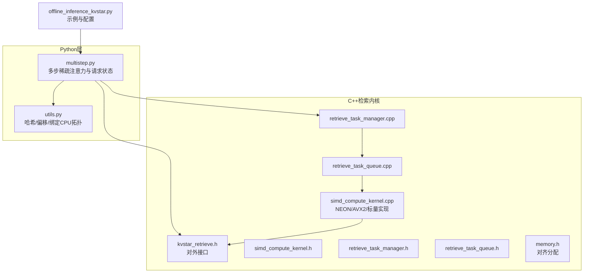
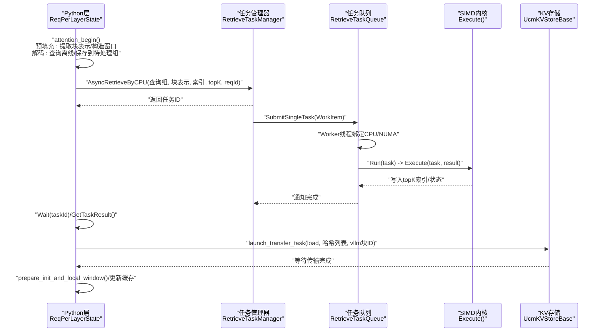
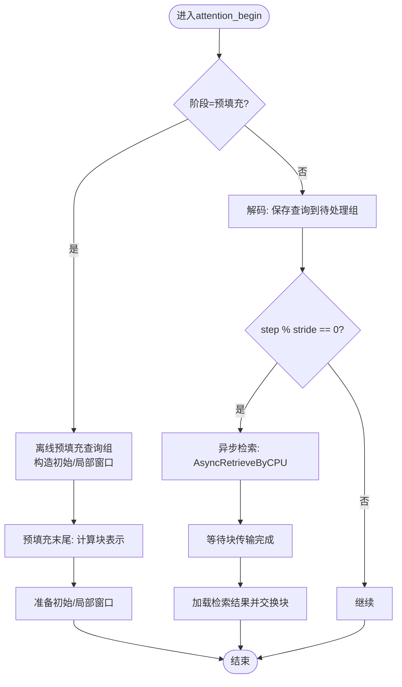
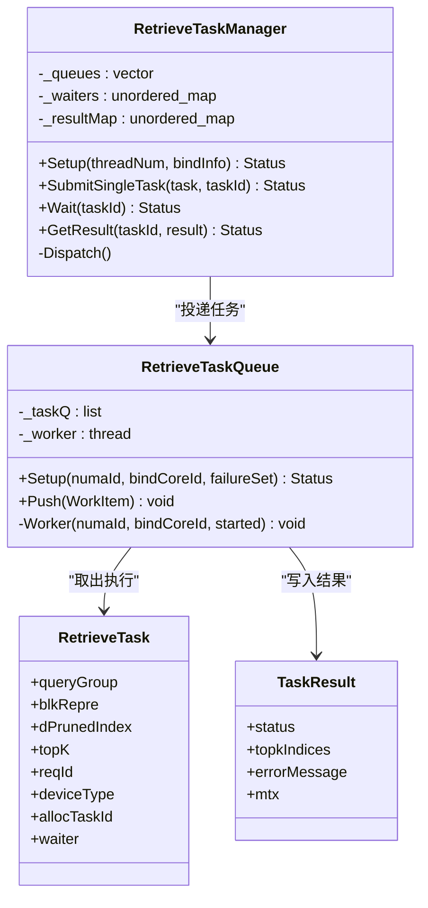
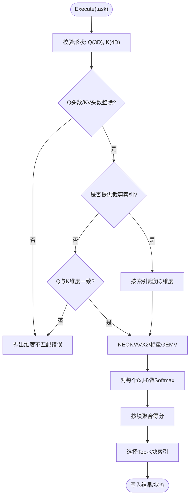
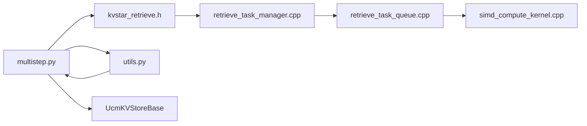

# KVStar检索算法

<cite>
**本文引用的文件**
- [multistep.py](file://ucm/sparse/kvstar/multistep.py)
- [utils.py](file://ucm/sparse/kvstar/utils.py)
- [kvstar_retrieve.h](file://ucm/sparse/kvstar/retrieve/core/api/kvstar_retrieve/kvstar_retrieve.h)
- [simd_compute_kernel.h](file://ucm/sparse/kvstar/retrieve/core/domain/retrieve_task/simd_compute_kernel.h)
- [simd_compute_kernel.cpp](file://ucm/sparse/kvstar/retrieve/core/domain/retrieve_task/simd_compute_kernel.cpp)
- [retrieve_task_manager.h](file://ucm/sparse/kvstar/retrieve/core/domain/retrieve_task/retrieve_task_manager.h)
- [retrieve_task_manager.cpp](file://ucm/sparse/kvstar/retrieve/core/domain/retrieve_task/retrieve_task_manager.cpp)
- [retrieve_task_queue.h](file://ucm/sparse/kvstar/retrieve/core/domain/retrieve_task/retrieve_task_queue.h)
- [retrieve_task_queue.cpp](file://ucm/sparse/kvstar/retrieve/core/domain/retrieve_task/retrieve_task_queue.cpp)
- [memory.h](file://ucm/sparse/kvstar/retrieve/core/infra/memory/memory.h)
- [offline_inference_kvstar.py](file://examples/offline_inference_kvstar.py)
</cite>

## 目录
1. [简介](#简介)
2. [项目结构](#项目结构)
3. [核心组件](#核心组件)
4. [架构总览](#架构总览)
5. [详细组件分析](#详细组件分析)
6. [依赖关系分析](#依赖关系分析)
7. [性能考量](#性能考量)
8. [故障排查指南](#故障排查指南)
9. [结论](#结论)
10. [附录](#附录)

## 简介
本技术文档围绕KVStar多步检索算法展开，系统阐述其在长上下文推理中的核心原理与实现机制。KVStar通过“块表示”与“多步检索窗口”的组合，在预填充阶段构建块级表征，在解码阶段按步长周期性触发异步检索，动态选择候选块并进行KV缓存的加载与替换，从而在保证注意力质量的同时显著降低显存占用与I/O开销。文档覆盖以下主题：
- 检索任务管理、任务队列调度与并行计算优化
- SIMD计算内核实现（NEON/AVX2/标量）
- 任务等待机制与内存管理策略
- 多步检索过程中的数据流控制、任务分发与结果聚合
- 可扩展性设计、负载均衡与故障恢复
- 配置参数详解、性能特征分析与适用场景
- 使用示例、性能测试思路与优化建议

## 项目结构
KVStar位于统一缓存管理（UCM）子模块中，核心由Python侧的多步稀疏注意力与C++侧的检索任务执行器协同完成。关键目录与文件如下：
- Python层：多步稀疏注意力与请求状态管理
  - ucm/sparse/kvstar/multistep.py
  - ucm/sparse/kvstar/utils.py
- C++检索内核与任务系统
  - ucm/sparse/kvstar/retrieve/core/api/kvstar_retrieve/kvstar_retrieve.h
  - ucm/sparse/kvstar/retrieve/core/domain/retrieve_task/simd_compute_kernel.{h,cpp}
  - ucm/sparse/kvstar/retrieve/core/domain/retrieve_task/retrieve_task_manager.{h,cpp}
  - ucm/sparse/kvstar/retrieve/core/domain/retrieve_task/retrieve_task_queue.{h,cpp}
  - ucm/sparse/kvstar/retrieve/core/infra/memory/memory.h
- 示例与配置
  - examples/offline_inference_kvstar.py

**图表来源**
- [multistep.py](file://ucm/sparse/kvstar/multistep.py#L645-L774)
- [utils.py](file://ucm/sparse/kvstar/utils.py#L1-L244)
- [kvstar_retrieve.h](file://ucm/sparse/kvstar/retrieve/core/api/kvstar_retrieve/kvstar_retrieve.h#L1-L37)
- [simd_compute_kernel.cpp](file://ucm/sparse/kvstar/retrieve/core/domain/retrieve_task/simd_compute_kernel.cpp#L1-L1004)
- [retrieve_task_manager.cpp](file://ucm/sparse/kvstar/retrieve/core/domain/retrieve_task/retrieve_task_manager.cpp#L1-L87)
- [retrieve_task_queue.cpp](file://ucm/sparse/kvstar/retrieve/core/domain/retrieve_task/retrieve_task_queue.cpp#L1-L103)
- [memory.h](file://ucm/sparse/kvstar/retrieve/core/infra/memory/memory.h#L1-L22)
- [offline_inference_kvstar.py](file://examples/offline_inference_kvstar.py#L64-L103)

**章节来源**
- [multistep.py](file://ucm/sparse/kvstar/multistep.py#L1-L937)
- [utils.py](file://ucm/sparse/kvstar/utils.py#L1-L244)
- [offline_inference_kvstar.py](file://examples/offline_inference_kvstar.py#L1-L173)

## 核心组件
- 多步稀疏注意力与请求状态管理
  - KVStarMultiStep：工作节点初始化、设备绑定、连接器设置与请求生命周期管理
  - ReqPerLayerState：每请求每层的状态机，负责块表示提取、查询离线、异步检索、块传输等待与结果加载
  - KVStarMultiStepSparseMetaData/ReqMeta：批内请求元信息与阶段/步长判定
- 检索任务系统
  - RetrieveTaskManager：任务提交、等待、结果获取与失败集维护
  - RetrieveTaskQueue：队列化任务执行，线程亲和与NUMA绑定
  - SIMD计算内核：NEON/AVX2/标量路径的GEMV、Softmax与Top-K聚合
- 内存与工具
  - Memory：4KB对齐分配
  - utils：块哈希、层偏移、CPU拓扑与绑定

**章节来源**
- [multistep.py](file://ucm/sparse/kvstar/multistep.py#L645-L774)
- [retrieve_task_manager.h](file://ucm/sparse/kvstar/retrieve/core/domain/retrieve_task/retrieve_task_manager.h#L1-L40)
- [retrieve_task_queue.h](file://ucm/sparse/kvstar/retrieve/core/domain/retrieve_task/retrieve_task_queue.h#L1-L44)
- [simd_compute_kernel.h](file://ucm/sparse/kvstar/retrieve/core/domain/retrieve_task/simd_compute_kernel.h#L1-L14)
- [memory.h](file://ucm/sparse/kvstar/retrieve/core/infra/memory/memory.h#L1-L22)
- [utils.py](file://ucm/sparse/kvstar/utils.py#L1-L244)

## 架构总览
KVStar的整体流程分为两部分：
- Python侧（多步稀疏注意力）：在预填充阶段提取块表示并构造初始/局部窗口；在解码阶段按步长周期性将查询离线到待处理组，触发异步检索，并在合适时机拉取检索结果进行块交换。
- C++侧（检索内核）：通过任务管理器与队列调度，将检索任务投递到绑定到特定CPU核心/NUMA节点的工作线程，执行SIMD加速的相似度计算与Top-K选择。

**图表来源**
- [multistep.py](file://ucm/sparse/kvstar/multistep.py#L251-L494)
- [retrieve_task_manager.cpp](file://ucm/sparse/kvstar/retrieve/core/domain/retrieve_task/retrieve_task_manager.cpp#L29-L58)
- [retrieve_task_queue.cpp](file://ucm/sparse/kvstar/retrieve/core/domain/retrieve_task/retrieve_task_queue.cpp#L21-L79)
- [simd_compute_kernel.cpp](file://ucm/sparse/kvstar/retrieve/core/domain/retrieve_task/simd_compute_kernel.cpp#L268-L391)
- [kvstar_retrieve.h](file://ucm/sparse/kvstar/retrieve/core/api/kvstar_retrieve/kvstar_retrieve.h#L27-L32)

## 详细组件分析

### 组件A：多步稀疏注意力与请求状态（ReqPerLayerState）
- 关键职责
  - 在预填充阶段：提取块表示、裁剪维度、合并内部token、构造初始/局部窗口
  - 在解码阶段：按步长周期性将查询离线到待处理组；异步触发检索；等待块传输；加载检索结果并进行块交换
  - 计算块哈希、层偏移与传输任务
- 数据流与控制
  - attention_begin：根据阶段与步长决定是否离线查询、是否准备窗口、是否启动检索
  - attention_finished：在预填充末尾计算块表示；在解码中按stride触发后续加载
  - load_retrieve_result_async：根据当前步长与stride推导需要等待的检索记录，阻塞等待并聚合结果
- 并行与等待
  - 通过kvstar_retrieve.Wait/GetTaskResult实现任务等待
  - 通过store_instance.wait批量等待块传输完成

**图表来源**
- [multistep.py](file://ucm/sparse/kvstar/multistep.py#L356-L494)

**章节来源**
- [multistep.py](file://ucm/sparse/kvstar/multistep.py#L184-L774)
- [utils.py](file://ucm/sparse/kvstar/utils.py#L40-L61)

### 组件B：任务管理与队列调度（RetrieveTaskManager/RetrieveTaskQueue）
- 任务管理器
  - Setup：为每个工作线程分配绑定信息，建立队列池
  - SubmitSingleTask：分配任务ID、注册等待器与结果映射、轮询投递到队列
  - Wait/GetResult：基于等待器同步与结果查询
- 任务队列
  - Setup：创建工作线程，设置CPU亲和与NUMA内存策略
  - Worker：循环从队列取出任务，运行runner，更新状态并通知等待器
- 调度策略
  - 轮询式队列选择，确保跨队列的任务均匀分布
  - NUMA绑定与内存策略减少跨NUMA访问带来的延迟

**图表来源**
- [retrieve_task_manager.h](file://ucm/sparse/kvstar/retrieve/core/domain/retrieve_task/retrieve_task_manager.h#L11-L33)
- [retrieve_task_manager.cpp](file://ucm/sparse/kvstar/retrieve/core/domain/retrieve_task/retrieve_task_manager.cpp#L4-L58)
- [retrieve_task_queue.h](file://ucm/sparse/kvstar/retrieve/core/domain/retrieve_task/retrieve_task_queue.h#L21-L39)
- [retrieve_task_queue.cpp](file://ucm/sparse/kvstar/retrieve/core/domain/retrieve_task/retrieve_task_queue.cpp#L21-L79)
- [retrieve_task.h](file://ucm/sparse/kvstar/retrieve/core/domain/retrieve_task/retrieve_task.h#L20-L45)
- [task_result.h](file://ucm/sparse/kvstar/retrieve/core/domain/retrieve_task/task_result.h#L13-L21)

**章节来源**
- [retrieve_task_manager.cpp](file://ucm/sparse/kvstar/retrieve/core/domain/retrieve_task/retrieve_task_manager.cpp#L1-L87)
- [retrieve_task_queue.cpp](file://ucm/sparse/kvstar/retrieve/core/domain/retrieve_task/retrieve_task_queue.cpp#L1-L103)

### 组件C：SIMD计算内核（NEON/AVX2/标量）
- 实现要点
  - 支持FP16输入与FP32中间计算，针对ARM NEON与x86 AVX2分别优化GEMV、Softmax与归约
  - 支持可选的维度裁剪索引，按KV头分组进行矩阵向量化乘加
  - 最终对每个块的得分进行聚合与Top-K选择
- 性能特性
  - 向量化路径显著提升大规模相似度计算吞吐
  - 标量路径作为回退，保证跨平台兼容性

**图表来源**
- [simd_compute_kernel.cpp](file://ucm/sparse/kvstar/retrieve/core/domain/retrieve_task/simd_compute_kernel.cpp#L268-L391)
- [simd_compute_kernel.cpp](file://ucm/sparse/kvstar/retrieve/core/domain/retrieve_task/simd_compute_kernel.cpp#L635-L764)

**章节来源**
- [simd_compute_kernel.h](file://ucm/sparse/kvstar/retrieve/core/domain/retrieve_task/simd_compute_kernel.h#L1-L14)
- [simd_compute_kernel.cpp](file://ucm/sparse/kvstar/retrieve/core/domain/retrieve_task/simd_compute_kernel.cpp#L1-L1004)

### 组件D：内存管理与工具函数
- 对齐分配
  - Memory提供4KB对齐的分配接口，满足SIMD与NUMA内存策略要求
- 偏移与哈希
  - compute_layer_offset：根据层数、KV类型与MLA模式计算层内偏移
  - block_hash_func/compute_parent_block_hash：基于父哈希与当前块token序列生成稳定哈希
- CPU绑定与NUMA拓扑
  - get_physical_core_topology：解析lscpu输出，获取物理核心拓扑
  - get_bind_cpus_for_rank：按rank分配NUMA或核心集合，支持比例绑定

**章节来源**
- [memory.h](file://ucm/sparse/kvstar/retrieve/core/infra/memory/memory.h#L1-L22)
- [utils.py](file://ucm/sparse/kvstar/utils.py#L22-L61)
- [utils.py](file://ucm/sparse/kvstar/utils.py#L135-L244)

## 依赖关系分析
- Python层依赖C++检索接口
  - kvstar_retrieve.Setup/Wait/GetTaskResult等接口被Python侧调用
- C++层内部耦合
  - RetrieveTaskManager持有多个RetrieveTaskQueue实例，负责任务分发与等待
  - RetrieveTaskQueue依赖RetrieveTaskRunner执行具体任务
- 外部集成点
  - UcmKVStoreBase用于块数据的加载/卸载任务提交与等待
  - vLLM KV缓存结构与前向上下文交互

**图表来源**
- [multistep.py](file://ucm/sparse/kvstar/multistep.py#L645-L774)
- [kvstar_retrieve.h](file://ucm/sparse/kvstar/retrieve/core/api/kvstar_retrieve/kvstar_retrieve.h#L27-L32)
- [retrieve_task_manager.cpp](file://ucm/sparse/kvstar/retrieve/core/domain/retrieve_task/retrieve_task_manager.cpp#L1-L87)
- [retrieve_task_queue.cpp](file://ucm/sparse/kvstar/retrieve/core/domain/retrieve_task/retrieve_task_queue.cpp#L1-L103)
- [simd_compute_kernel.cpp](file://ucm/sparse/kvstar/retrieve/core/domain/retrieve_task/simd_compute_kernel.cpp#L1-L1004)
- [utils.py](file://ucm/sparse/kvstar/utils.py#L1-L244)

**章节来源**
- [multistep.py](file://ucm/sparse/kvstar/multistep.py#L645-L774)
- [retrieve_task_manager.cpp](file://ucm/sparse/kvstar/retrieve/core/domain/retrieve_task/retrieve_task_manager.cpp#L1-L87)
- [retrieve_task_queue.cpp](file://ucm/sparse/kvstar/retrieve/core/domain/retrieve_task/retrieve_task_queue.cpp#L1-L103)

## 性能考量
- SIMD优化
  - NEON/AVX2路径在大规模GEMV与Softmax上具备显著吞吐优势；在无硬件加速时回退至标量路径
- 内存与NUMA
  - 工作线程绑定CPU与NUMA内存策略，减少跨NUMA访问与TLB抖动
  - 4KB对齐分配满足SIMD与大页内存需求
- 并行与调度
  - 多队列轮询投递，避免热点队列；NUMA亲和降低跨插槽通信
- I/O与缓存
  - 块表示仅在必要时加载到CPU侧，减少带宽压力
  - 按步长周期性检索与块交换，平衡延迟与吞吐

[本节为通用性能讨论，无需列出具体文件来源]

## 故障排查指南
- 任务等待超时或失败
  - 检查RetrieveTaskManager::Wait返回值与失败集；确认任务ID存在且未被移除
  - 核对SIMD内核异常（维度不匹配、索引形状不一致）导致的异常抛出
- NUMA/亲和设置问题
  - 确认get_bind_cpus_for_rank返回的绑定信息与实际CPU拓扑一致
  - 检查pthread_setaffinity_np/set_mempolicy返回值
- 存储传输失败
  - 确认launch_transfer_task传入的哈希列表与vllm块ID对应
  - 检查store_instance.wait返回状态

**章节来源**
- [retrieve_task_manager.cpp](file://ucm/sparse/kvstar/retrieve/core/domain/retrieve_task/retrieve_task_manager.cpp#L60-L75)
- [retrieve_task_queue.cpp](file://ucm/sparse/kvstar/retrieve/core/domain/retrieve_task/retrieve_task_queue.cpp#L21-L79)
- [simd_compute_kernel.cpp](file://ucm/sparse/kvstar/retrieve/core/domain/retrieve_task/simd_compute_kernel.cpp#L268-L391)
- [utils.py](file://ucm/sparse/kvstar/utils.py#L167-L244)

## 结论
KVStar通过“块表示+多步检索窗口”的设计，在长上下文推理中实现了高效的KV缓存管理与注意力计算。Python侧负责高层调度与数据组织，C++侧提供高性能SIMD内核与可靠的并发任务系统。整体方案在可扩展性、负载均衡与故障恢复方面均有明确的设计与实现支撑，适合在大规模模型与长序列场景下部署。

[本节为总结性内容，无需列出具体文件来源]

## 附录

### 配置参数详解（KVStarMultiStep）
- init_window_sz：初始窗口大小（块数），用于预填充阶段的快速注意力
- local_window_sz：局部窗口大小（块数），用于解码阶段的近期上下文
- sparse_ratio：候选交换块的比例阈值，控制检索候选范围
- retrieval_stride：检索步长，按步长周期性触发检索
- blk_repre_dim_prune_ratio：块表示维度裁剪比例，降低计算与内存开销
- blk_repre_inner_token_merge：块内token合并因子，提升块表示代表性

**章节来源**
- [multistep.py](file://ucm/sparse/kvstar/multistep.py#L686-L692)
- [offline_inference_kvstar.py](file://examples/offline_inference_kvstar.py#L80-L89)

### 使用示例与性能测试思路
- 示例脚本展示了如何通过KVTransferConfig启用KVStar多步稀疏注意力，并配置ucm_sparse_config
- 性能测试建议
  - 固定模型与数据集，对比开启/关闭KVStar的吞吐与显存占用
  - 调整retrieval_stride与sparse_ratio观察延迟与准确性权衡
  - 在不同NUMA拓扑与CPU绑定比例下评估吞吐变化

**章节来源**
- [offline_inference_kvstar.py](file://examples/offline_inference_kvstar.py#L64-L103)

### 适用场景
- 长上下文对话、文档问答、长篇阅读理解等
- 显存受限环境下的在线推理
- 对延迟敏感但可接受一定精度损失的场景

[本节为概念性说明，无需列出具体文件来源]