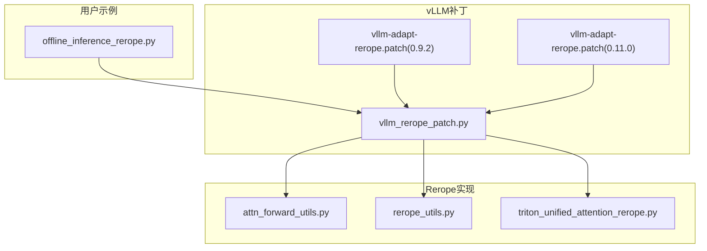
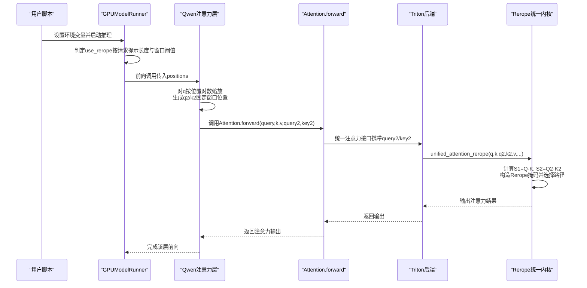
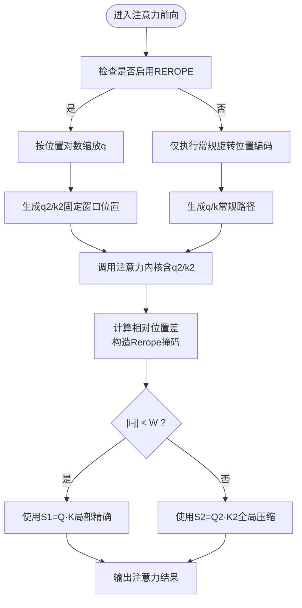
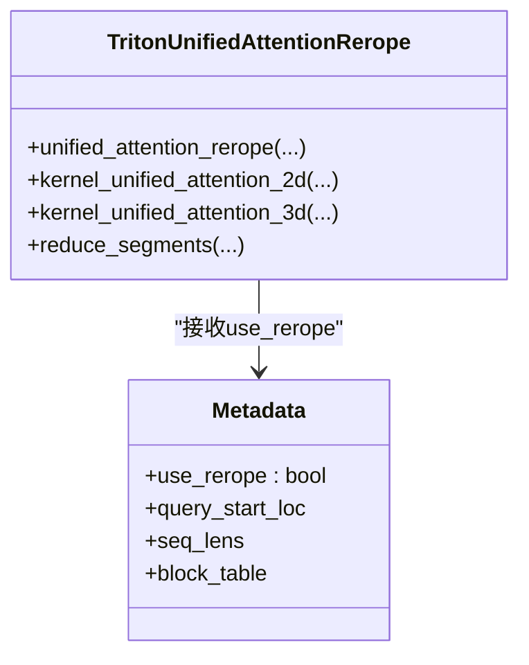
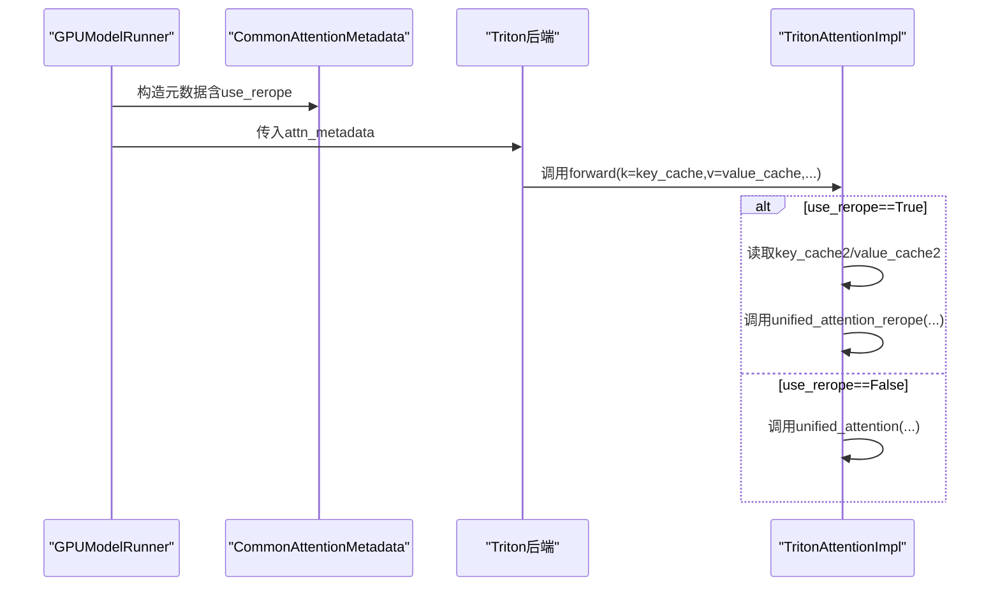
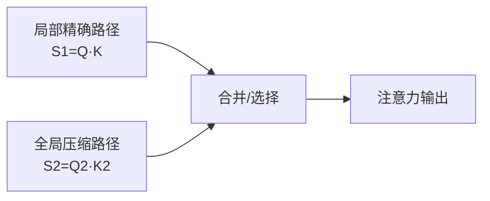
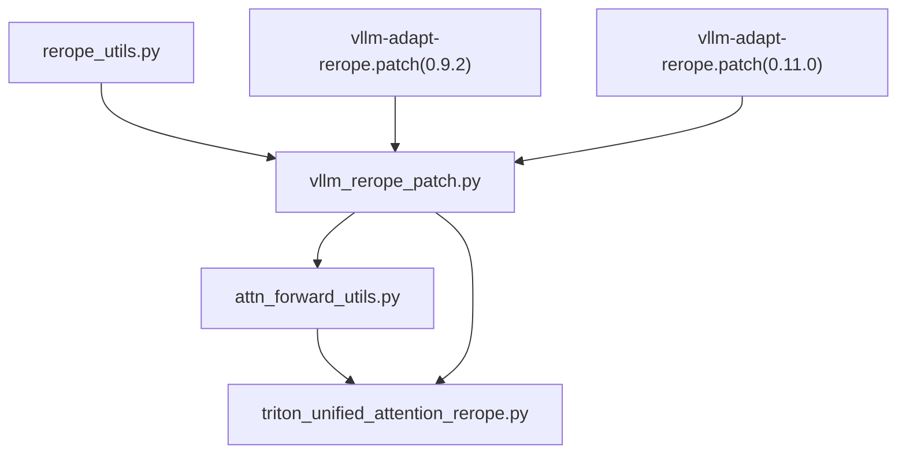

# Rerope旋转位置编码

<cite>
**本文引用的文件**
- [rerope.md](file://docs/source/user-guide/rerope/rerope.md)
- [attn_forward_utils.py](file://ucm/sparse/rerope/attn_forward_utils.py)
- [rerope_utils.py](file://ucm/sparse/rerope/rerope_utils.py)
- [triton_unified_attention_rerope.py](file://ucm/sparse/rerope/triton_unified_attention_rerope.py)
- [offline_inference_rerope.py](file://examples/offline_inference_rerope.py)
- [vllm_rerope_patch.py](file://ucm/integration/vllm/patch/patch_funcs/v092/vllm_rerope_patch.py)
- [vllm-adapt-rerope.patch](file://ucm/integration/vllm/patch/0.9.2/vllm-adapt-rerope.patch)
- [vllm-adapt-rerope.patch](file://ucm/integration/vllm/patch/0.11.0/vllm-adapt-rerope.patch)
</cite>

## 目录
1. [简介](#简介)
2. [项目结构](#项目结构)
3. [核心组件](#核心组件)
4. [架构总览](#架构总览)
5. [详细组件分析](#详细组件分析)
6. [依赖关系分析](#依赖关系分析)
7. [性能考量](#性能考量)
8. [故障排查指南](#故障排查指南)
9. [结论](#结论)
10. [附录](#附录)

## 简介
本技术文档系统阐述Rerope（ReRoPE，Rectified Rotary Position Embeddings）旋转位置编码在统一缓存管理（UCM）与vLLM框架中的实现与集成。Rerope通过“窗口内局部精确 + 窗外全局压缩”的双路径注意力设计，在不微调的前提下显著扩展上下文长度；其核心在于：
- 位置编码重参数化：基于对数尺度缩放，使远距离位置在压缩空间中保持可区分性。
- 动态选择策略：依据查询与键之间的相对距离，自动在局部精确路径与全局压缩路径之间切换。
- Triton内核优化：提供统一的注意力内核，支持分段归约与软截断等特性，兼顾长序列与高吞吐。
- vLLM集成：通过补丁机制在Qwen系列模型注意力前向中注入Rerope逻辑，并在Triton后端中无缝切换到Rerope专用内核。

## 项目结构
围绕Rerope的关键目录与文件如下：
- 文档与用户指南：docs/source/user-guide/rerope/rerope.md
- 示例脚本：examples/offline_inference_rerope.py
- Rerope核心实现：
  - 通用注意力前向工具：ucm/sparse/rerope/attn_forward_utils.py
  - 配置与环境变量：ucm/sparse/rerope/rerope_utils.py
  - Triton统一注意力（含Rerope路径）：ucm/sparse/rerope/triton_unified_attention_rerope.py
- vLLM补丁与适配：
  - 补丁函数（v0.9.2）：ucm/integration/vllm/patch/patch_funcs/v092/vllm_rerope_patch.py
  - 差异补丁（v0.9.2/v0.11.0）：ucm/integration/vllm/patch/0.9.2/vllm-adapt-rerope.patch、ucm/integration/vllm/patch/0.11.0/vllm-adapt-rerope.patch

**图示来源**
- [offline_inference_rerope.py](file://examples/offline_inference_rerope.py#L1-L194)
- [vllm_rerope_patch.py](file://ucm/integration/vllm/patch/patch_funcs/v092/vllm_rerope_patch.py#L1-L1180)
- [vllm-adapt-rerope.patch](file://ucm/integration/vllm/patch/0.9.2/vllm-adapt-rerope.patch#L1-L639)
- [vllm-adapt-rerope.patch](file://ucm/integration/vllm/patch/0.11.0/vllm-adapt-rerope.patch#L1-L200)
- [attn_forward_utils.py](file://ucm/sparse/rerope/attn_forward_utils.py#L1-L40)
- [rerope_utils.py](file://ucm/sparse/rerope/rerope_utils.py#L1-L16)
- [triton_unified_attention_rerope.py](file://ucm/sparse/rerope/triton_unified_attention_rerope.py#L1-L885)

**章节来源**
- [rerope.md](file://docs/source/user-guide/rerope/rerope.md#L1-L109)
- [offline_inference_rerope.py](file://examples/offline_inference_rerope.py#L1-L194)

## 核心组件
- 位置编码重参数化与动态路径选择
  - 在注意力前向阶段，若启用Rerope，则对查询进行按位置对数缩放，并同时生成两组键值（原始与固定窗口位置），用于局部精确与全局压缩两种路径。
  - 参考：[process_qkv](file://ucm/sparse/rerope/attn_forward_utils.py#L8-L39)、[Qwen2/Qwen3/Qwen3MoE前向](file://ucm/integration/vllm/patch/patch_funcs/v092/vllm_rerope_patch.py#L419-L457)
- Triton统一注意力（含Rerope路径）
  - 提供统一的注意力内核，支持分段归约、软截断、ALiBi等；在Rerope模式下，根据查询与键的相对位置差构建掩码，动态选择局部精确或全局压缩路径。
  - 参考：[unified_attention_rerope](file://ucm/sparse/rerope/triton_unified_attention_rerope.py#L681-L885)、[内核2D/3D与掩码构造](file://ucm/sparse/rerope/triton_unified_attention_rerope.py#L55-L314)
- vLLM补丁与集成
  - 在GPU模型运行器中判定批次是否使用Rerope；在注意力元数据中传递该标志；在Triton后端中切换到Rerope专用内核，并调整KV缓存形状系数。
  - 参考：[GPUModelRunner补丁](file://ucm/integration/vllm/patch/patch_funcs/v092/vllm_rerope_patch.py#L171-L401)、[Triton后端切换](file://ucm/integration/vllm/patch/patch_funcs/v092/vllm_rerope_patch.py#L998-L1040)、[KV缓存系数](file://ucm/integration/vllm/patch/patch_funcs/v092/vllm_rerope_patch.py#L59-L77)

**章节来源**
- [attn_forward_utils.py](file://ucm/sparse/rerope/attn_forward_utils.py#L8-L39)
- [rerope_utils.py](file://ucm/sparse/rerope/rerope_utils.py#L4-L16)
- [triton_unified_attention_rerope.py](file://ucm/sparse/rerope/triton_unified_attention_rerope.py#L55-L314)
- [vllm_rerope_patch.py](file://ucm/integration/vllm/patch/patch_funcs/v092/vllm_rerope_patch.py#L171-L401)

## 架构总览
Rerope在推理管线中的关键交互链路如下：

**图示来源**
- [offline_inference_rerope.py](file://examples/offline_inference_rerope.py#L23-L111)
- [vllm_rerope_patch.py](file://ucm/integration/vllm/patch/patch_funcs/v092/vllm_rerope_patch.py#L171-L401)
- [triton_unified_attention_rerope.py](file://ucm/sparse/rerope/triton_unified_attention_rerope.py#L681-L885)

## 详细组件分析

### 位置编码重参数化与动态路径选择
- 重参数化策略
  - 对每个位置p，查询q按log(p+1)/log(T)进行缩放，其中T为训练长度；当p接近训练长度时，缩放因子饱和为1，避免过度放大。
  - 同时构造q2与k2：将位置设为固定窗口大小W，得到压缩路径的查询与键。
  - 参考：[process_qkv](file://ucm/sparse/rerope/attn_forward_utils.py#L12-L27)、[Qwen前向](file://ucm/integration/vllm/patch/patch_funcs/v092/vllm_rerope_patch.py#L429-L451)
- 动态路径选择
  - 在注意力计算中，基于查询与键的相对位置差|i−j|与窗口W比较，决定使用S1还是S2；结合因果掩码与滑动窗口，确保正确性与效率。
  - 参考：[掩码构造与路径选择](file://ucm/sparse/rerope/triton_unified_attention_rerope.py#L242-L258)

**图示来源**
- [attn_forward_utils.py](file://ucm/sparse/rerope/attn_forward_utils.py#L12-L34)
- [triton_unified_attention_rerope.py](file://ucm/sparse/rerope/triton_unified_attention_rerope.py#L242-L258)

**章节来源**
- [attn_forward_utils.py](file://ucm/sparse/rerope/attn_forward_utils.py#L8-L39)
- [triton_unified_attention_rerope.py](file://ucm/sparse/rerope/triton_unified_attention_rerope.py#L238-L271)

### Triton统一注意力与Rerope路径
- 内核组织
  - 2D内核：适用于预填充+解码混合场景，按块遍历KV缓存，计算S1与S2并选择路径。
  - 3D内核+分段归约：将序列分段，先在段内归约，再合并段间结果，降低内存压力。
  - 参考：[2D内核](file://ucm/sparse/rerope/triton_unified_attention_rerope.py#L55-L314)、[3D内核与分段归约](file://ucm/sparse/rerope/triton_unified_attention_rerope.py#L317-L597)
- 关键优化点
  - 掩码融合：将Rerope掩码与因果掩码、滑动窗口掩码合并，减少分支开销。
  - 软截断：可选的tanh软截断，稳定大值范围。
  - ALiBi：可选的ALiBi斜率，增强长程建模能力。
  - 参考：[掩码与软截断](file://ucm/sparse/rerope/triton_unified_attention_rerope.py#L254-L274)

**图示来源**
- [triton_unified_attention_rerope.py](file://ucm/sparse/rerope/triton_unified_attention_rerope.py#L681-L885)

**章节来源**
- [triton_unified_attention_rerope.py](file://ucm/sparse/rerope/triton_unified_attention_rerope.py#L55-L314)

### vLLM集成与补丁机制
- 批次级开关与状态管理
  - GPUModelRunner在准备输入时，根据请求提示长度与REROPE_WINDOW阈值设置use_rerope，并在注意力元数据中传递。
  - 参考：[use_rerope判定与传递](file://ucm/integration/vllm/patch/patch_funcs/v092/vllm_rerope_patch.py#L199-L210)、[元数据新增字段](file://ucm/integration/vllm/patch/patch_funcs/v092/vllm_rerope_patch.py#L94-L118)
- 注意力层与后端切换
  - Attention.forward在启用REROPE时，将query2/key2传入实现；Triton后端在use_rerope为真时调用Rerope统一内核，并调整KV缓存形状系数。
  - 参考：[Attention.forward扩展](file://ucm/integration/vllm/patch/patch_funcs/v092/vllm_rerope_patch.py#L595-L799)、[KV缓存系数=3](file://ucm/integration/vllm/patch/patch_funcs/v092/vllm_rerope_patch.py#L59-L77)
- 环境变量与默认配置
  - VLLM_USE_REROPE、REROPE_WINDOW、TRAINING_LENGTH；默认窗口与训练长度均为32768。
  - 参考：[环境变量定义](file://ucm/integration/vllm/patch/0.9.2/vllm-adapt-rerope.patch#L203-L221)、[默认配置](file://ucm/sparse/rerope/rerope_utils.py#L4-L16)

**图示来源**
- [vllm_rerope_patch.py](file://ucm/integration/vllm/patch/patch_funcs/v092/vllm_rerope_patch.py#L998-L1040)
- [vllm-adapt-rerope.patch](file://ucm/integration/vllm/patch/0.9.2/vllm-adapt-rerope.patch#L343-L510)

**章节来源**
- [vllm_rerope_patch.py](file://ucm/integration/vllm/patch/patch_funcs/v092/vllm_rerope_patch.py#L171-L401)
- [vllm-adapt-rerope.patch](file://ucm/integration/vllm/patch/0.9.2/vllm-adapt-rerope.patch#L343-L510)

### 概念性概览
Rerope的核心思想是“局部精确、全局压缩”：在窗口内使用常规旋转位置编码保证局部细节，在窗口外使用固定窗口位置编码实现全局压缩，从而在不微调的情况下扩展上下文长度。

[此图为概念性流程，不直接映射具体源码文件]

## 依赖关系分析
- 组件耦合
  - attn_forward_utils与vLLM注意力层紧密耦合，前者负责生成q2/k2并调用注意力内核。
  - triton_unified_attention_rerope独立于模型层，通过统一接口被后端调用。
  - vllm_rerope_patch贯穿运行期，负责状态判定、元数据扩展与后端切换。
- 外部依赖
  - vLLM版本差异导致补丁细节不同（如KV缓存维度顺序、元数据字段名），需按版本选择对应补丁。
  - CUDA/Triton内核依赖显存带宽与SM资源，长序列与大头数会增加内存压力。

**图示来源**
- [attn_forward_utils.py](file://ucm/sparse/rerope/attn_forward_utils.py#L1-L40)
- [triton_unified_attention_rerope.py](file://ucm/sparse/rerope/triton_unified_attention_rerope.py#L1-L885)
- [rerope_utils.py](file://ucm/sparse/rerope/rerope_utils.py#L1-L16)
- [vllm_rerope_patch.py](file://ucm/integration/vllm/patch/patch_funcs/v092/vllm_rerope_patch.py#L1-L1180)
- [vllm-adapt-rerope.patch](file://ucm/integration/vllm/patch/0.9.2/vllm-adapt-rerope.patch#L1-L639)
- [vllm-adapt-rerope.patch](file://ucm/integration/vllm/patch/0.11.0/vllm-adapt-rerope.patch#L1-L200)

**章节来源**
- [vllm_rerope_patch.py](file://ucm/integration/vllm/patch/patch_funcs/v092/vllm_rerope_patch.py#L1-L1180)

## 性能考量
- 计算复杂度
  - Rerope引入双路径注意力，理论上带来约2倍的点积计算量；但通过局部精确+全局压缩的策略，可在长序列场景下保持更合理的精度与稳定性。
- 内存占用
  - KV缓存系数从2提升至3（含key_cache2），需评估显存占用与页分配策略。
  - 参考：[KV缓存系数=3](file://ucm/integration/vllm/patch/patch_funcs/v092/vllm_rerope_patch.py#L65-L77)
- 并行与流水
  - Triton内核采用分块与分段归约，有助于缓解长序列下的内存压力；建议合理设置BLOCK_M与NUM_SEGMENTS以平衡吞吐与显存。
- 环境变量与参数
  - REROPE_WINDOW与TRAINING_LENGTH需与模型预训练长度一致；过小的窗口会降低压缩效果，过大则可能影响局部细节。
  - 参考：[默认配置](file://ucm/sparse/rerope/rerope_utils.py#L4-L16)、[示例脚本设置](file://examples/offline_inference_rerope.py#L23-L30)

[本节为通用性能讨论，未直接分析具体代码片段]

## 故障排查指南
- 环境变量未生效
  - 确认已设置VLLM_USE_REROPE=true、REROPE_WINDOW、TRAINING_LENGTH；并在vLLM版本对应的补丁中启用。
  - 参考：[环境变量定义](file://ucm/integration/vllm/patch/0.9.2/vllm-adapt-rerope.patch#L203-L221)
- KV缓存维度异常
  - 使用REROPE时，KV缓存应为三通道（含key_cache2），若仍按两通道访问会导致索引错误。
  - 参考：[KV缓存系数=3](file://ucm/integration/vllm/patch/patch_funcs/v092/vllm_rerope_patch.py#L65-L77)
- 显存不足
  - 适当降低批大小、max_num_batched_tokens或增大block_size；或在示例中调整tensor_parallel_size与gpu_memory_utilization。
  - 参考：[示例脚本参数](file://examples/offline_inference_rerope.py#L64-L92)
- 长序列推理缓慢
  - 检查是否正确走Rerope路径（use_rerope为True）；确认REROPE_WINDOW设置合理；必要时减小NUM_SEGMENTS或调整BLOCK_M。
  - 参考：[use_rerope判定](file://ucm/integration/vllm/patch/patch_funcs/v092/vllm_rerope_patch.py#L199-L210)

**章节来源**
- [vllm-adapt-rerope.patch](file://ucm/integration/vllm/patch/0.9.2/vllm-adapt-rerope.patch#L203-L221)
- [vllm_rerope_patch.py](file://ucm/integration/vllm/patch/patch_funcs/v092/vllm_rerope_patch.py#L199-L210)
- [offline_inference_rerope.py](file://examples/offline_inference_rerope.py#L64-L92)

## 结论
Rerope通过“局部精确+全局压缩”的双路径注意力，有效扩展了Transformer的上下文长度且无需微调；在UCM与vLLM的集成中，借助补丁机制实现了从模型前向到Triton内核的全链路支持。实践中需关注KV缓存系数、窗口参数与批处理规模对显存与吞吐的影响，并结合具体模型与任务调优。

[本节为总结性内容，未直接分析具体代码片段]

## 附录
- 快速开始
  - 设置环境变量并运行示例脚本，参考：[示例脚本](file://examples/offline_inference_rerope.py#L23-L111)
- 支持模型
  - 当前支持Qwen系列模型，参考：[用户指南](file://docs/source/user-guide/rerope/rerope.md#L95-L99)
- 性能基准
  - 参考用户指南中的实验结果图，参考：[rerope.md](file://docs/source/user-guide/rerope/rerope.md#L46-L56)

**章节来源**
- [rerope.md](file://docs/source/user-guide/rerope/rerope.md#L57-L99)
- [offline_inference_rerope.py](file://examples/offline_inference_rerope.py#L23-L111)