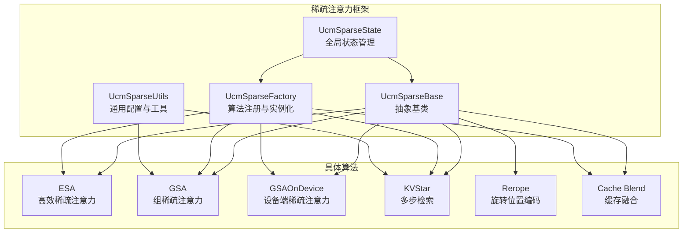
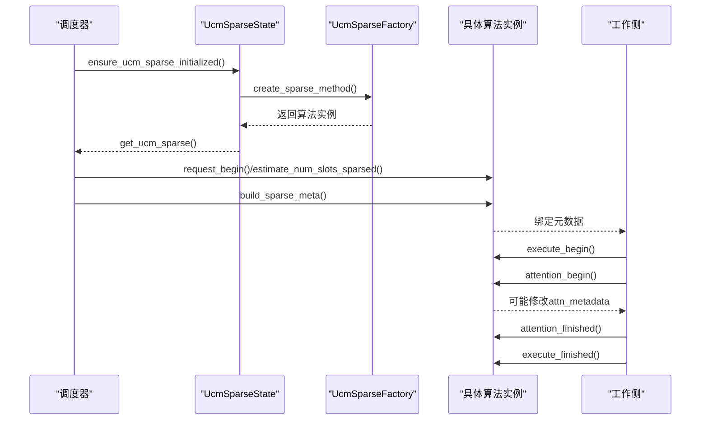
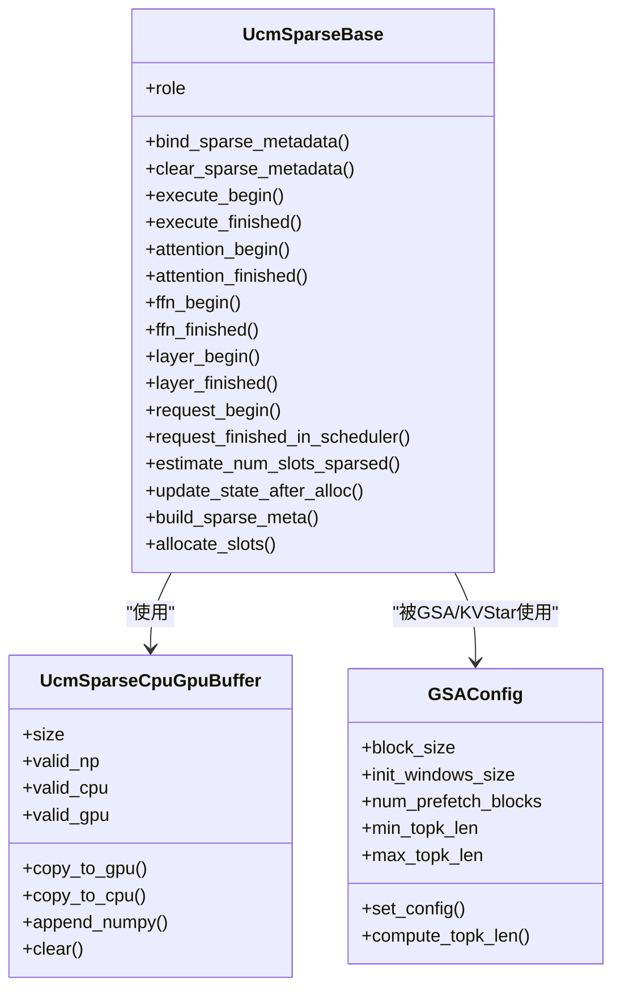
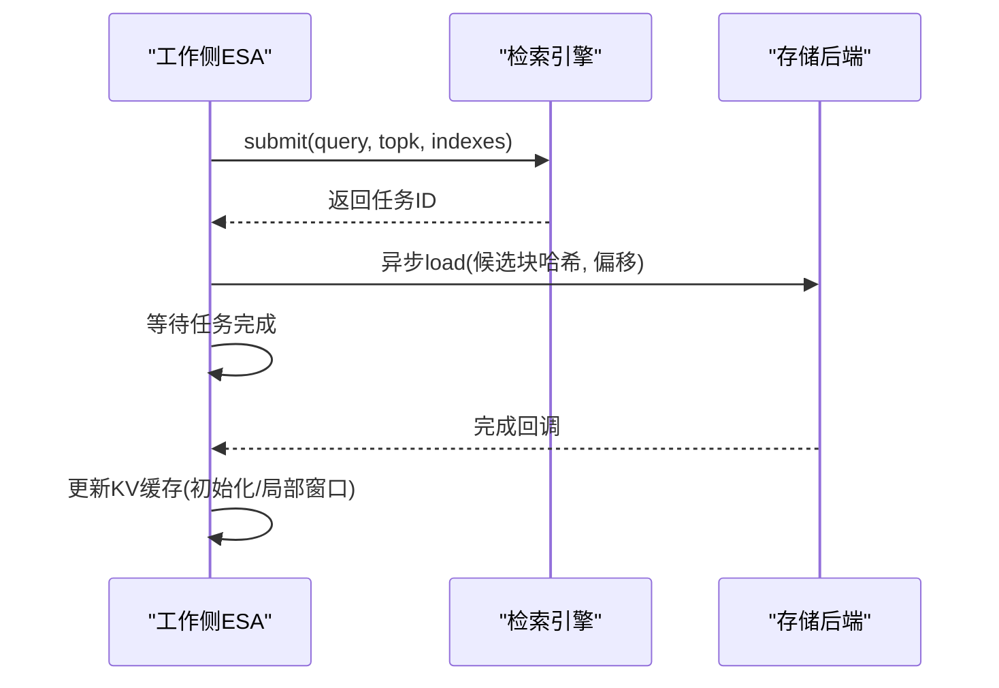
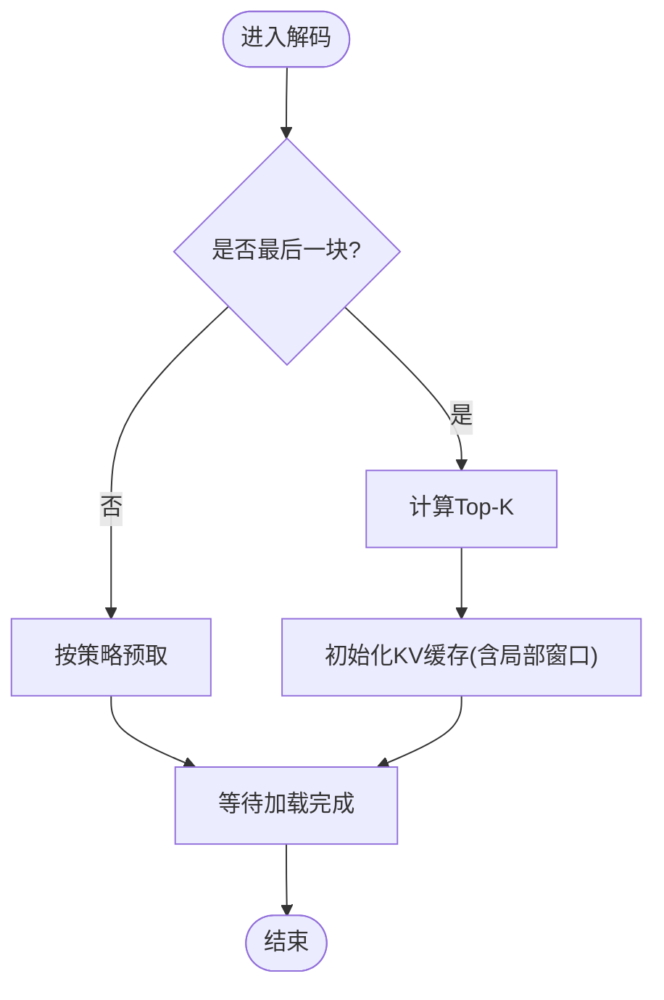
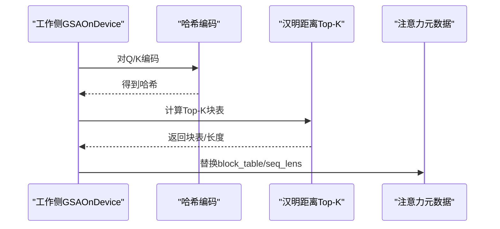
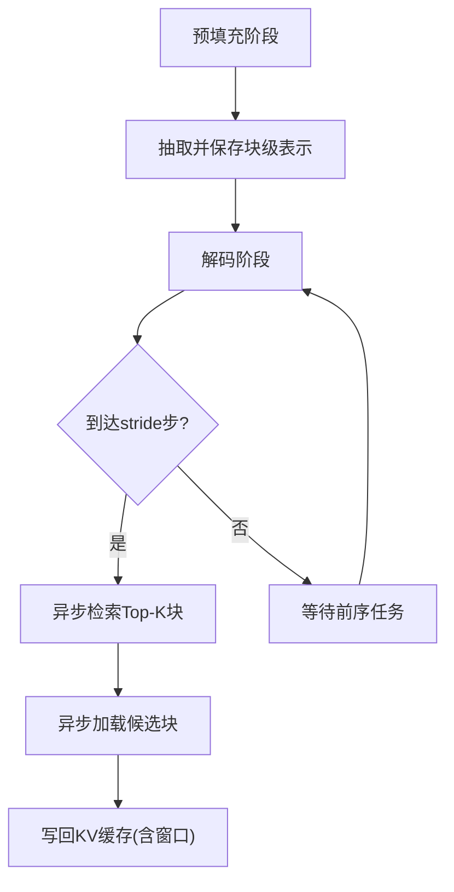
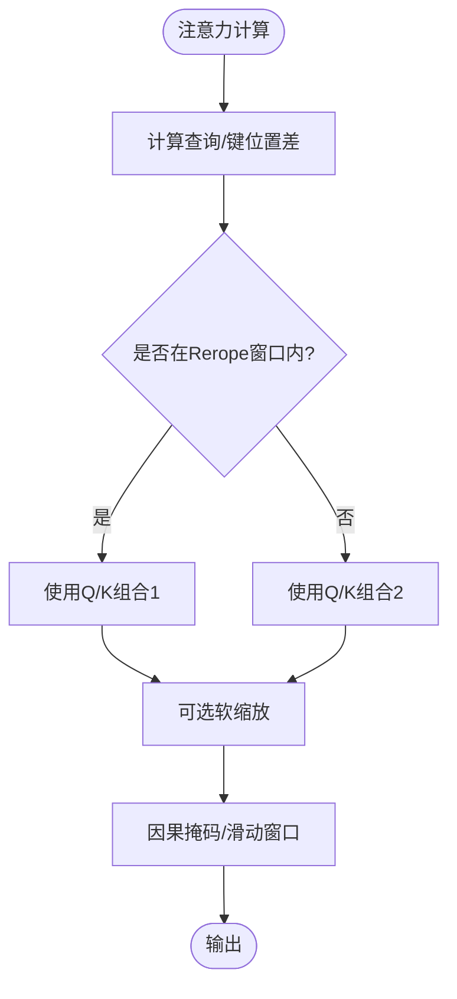
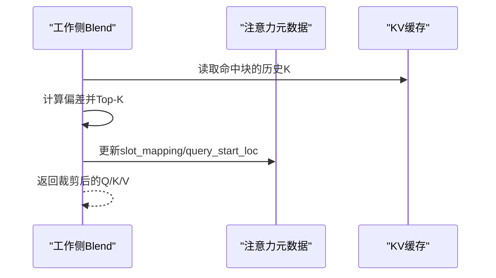
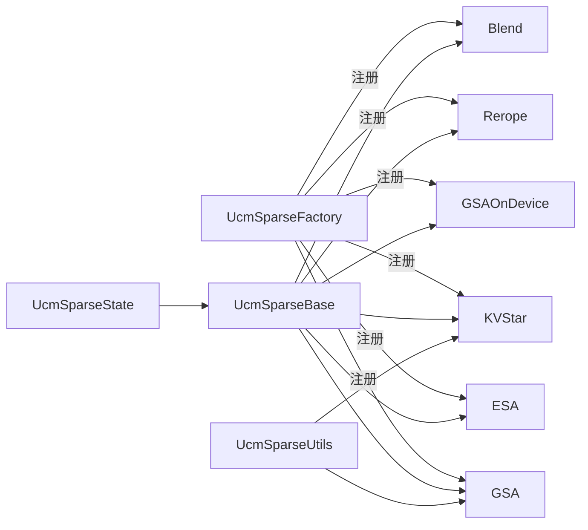

# 稀疏注意力算法

<cite>
**本文引用的文件**
- [ucm/sparse/base.py](file://ucm/sparse/base.py)
- [ucm/sparse/factory.py](file://ucm/sparse/factory.py)
- [ucm/sparse/state.py](file://ucm/sparse/state.py)
- [ucm/sparse/utils.py](file://ucm/sparse/utils.py)
- [ucm/sparse/esa/esa.py](file://ucm/sparse/esa/esa.py)
- [ucm/sparse/gsa/gsa.py](file://ucm/sparse/gsa/gsa.py)
- [ucm/sparse/gsa_on_device/gsa_on_device.py](file://ucm/sparse/gsa_on_device/gsa_on_device.py)
- [ucm/sparse/kvstar/multistep.py](file://ucm/sparse/kvstar/multistep.py)
- [ucm/sparse/rerope/triton_unified_attention_rerope.py](file://ucm/sparse/rerope/triton_unified_attention_rerope.py)
- [ucm/sparse/blend/blend.py](file://ucm/sparse/blend/blend.py)
- [examples/offline_inference_esa.py](file://examples/offline_inference_esa.py)
- [examples/offline_inference_gsaondevice.py](file://examples/offline_inference_gsaondevice.py)
- [examples/offline_inference_kvstar.py](file://examples/offline_inference_kvstar.py)
- [examples/offline_inference_rerope.py](file://examples/offline_inference_rerope.py)
</cite>

## 目录
1. [简介](#简介)
2. [项目结构](#项目结构)
3. [核心组件](#核心组件)
4. [架构总览](#架构总览)
5. [详细组件分析](#详细组件分析)
6. [依赖关系分析](#依赖关系分析)
7. [性能考量](#性能考量)
8. [故障排查指南](#故障排查指南)
9. [结论](#结论)
10. [附录](#附录)

## 简介
本技术文档系统性阐述UCM在vLLM中的稀疏注意力算法体系，覆盖基类设计、工厂与状态管理、以及五种具体算法（ESA、GSA、GSAOnDevice、KVStar、Rerope、Cache Blend）。文档从架构设计、数据流、处理逻辑、集成点、错误处理与性能特征等维度展开，并提供算法选择决策指南、配置参数说明、使用示例与调优建议。

## 项目结构
UCM稀疏注意力位于ucm/sparse目录下，采用“按功能模块分层”的组织方式：
- 基类与通用工具：base.py、utils.py、state.py、factory.py
- 具体算法实现：esa/、gsa/、gsa_on_device/、kvstar/、rerope/、blend/
- 示例与用法：examples/ 下的离线推理脚本

图示来源
- [ucm/sparse/base.py](file://ucm/sparse/base.py#L127-L323)
- [ucm/sparse/factory.py](file://ucm/sparse/factory.py#L13-L57)
- [ucm/sparse/state.py](file://ucm/sparse/state.py#L23-L76)
- [ucm/sparse/utils.py](file://ucm/sparse/utils.py#L18-L65)

章节来源
- [ucm/sparse/base.py](file://ucm/sparse/base.py#L1-L323)
- [ucm/sparse/factory.py](file://ucm/sparse/factory.py#L1-L57)
- [ucm/sparse/state.py](file://ucm/sparse/state.py#L1-L110)
- [ucm/sparse/utils.py](file://ucm/sparse/utils.py#L1-L65)

## 核心组件
- 抽象基类UcmSparseBase：定义调度器侧与工作侧的生命周期钩子、元数据接口、请求级回调等，统一稀疏注意力的扩展点。
- 工厂UcmSparseFactory：通过名称注册与延迟加载机制，按配置动态创建具体算法实例。
- 全局状态UcmSparseState：单实例代理模式，确保调度器与工作侧共享同一算法实例；提供便捷的层/FFN钩子封装。
- 通用工具UcmSparseUtils：集中管理GSA/KVStar等算法的默认配置、对齐与尺寸计算等。

章节来源
- [ucm/sparse/base.py](file://ucm/sparse/base.py#L127-L323)
- [ucm/sparse/factory.py](file://ucm/sparse/factory.py#L13-L57)
- [ucm/sparse/state.py](file://ucm/sparse/state.py#L23-L110)
- [ucm/sparse/utils.py](file://ucm/sparse/utils.py#L18-L65)

## 架构总览
UCM稀疏注意力在vLLM执行链路中的关键集成点：
- 初始化阶段：通过KVTransferConfig与ucm_sparse_config选择算法，工厂创建实例并注入全局状态。
- 执行阶段：在模型执行前后、注意力前后、FFN前后触发算法钩子，按需构建元数据、异步检索/加载KV块、更新注意力元数据。
- 调度阶段：估算稀疏占用槽位数，分配KV缓存块，生成worker侧所需的元数据。

图示来源
- [ucm/sparse/state.py](file://ucm/sparse/state.py#L27-L69)
- [ucm/sparse/factory.py](file://ucm/sparse/factory.py#L30-L44)
- [ucm/sparse/base.py](file://ucm/sparse/base.py#L185-L237)

## 详细组件分析

### 基类与通用框架
- 角色与元数据：UcmSparseRole区分调度器/工作侧；UcmSparseMetadata为调度器与工作侧通信载体。
- 生命周期钩子：execute_begin/finished、attention_begin/finished、ffn_begin/finished、layer_begin/finished、request_finished_in_scheduler/worker等。
- 通用缓冲：UcmSparseCpuGpuBuffer简化CPU/GPU张量拷贝与numpy互操作。
- 通用配置：GSAConfig、对齐与尺寸工具等。

图示来源
- [ucm/sparse/base.py](file://ucm/sparse/base.py#L127-L323)
- [ucm/sparse/utils.py](file://ucm/sparse/utils.py#L18-L65)

章节来源
- [ucm/sparse/base.py](file://ucm/sparse/base.py#L39-L323)
- [ucm/sparse/utils.py](file://ucm/sparse/utils.py#L18-L65)

### ESA（高效稀疏注意力）
- 设计理念：以“块表示”与“检索”为核心，利用块级表示与哈希在长上下文场景下减少KV传输与计算。
- 关键流程：
  - 预填充阶段：抽取初始窗口与局部窗口，构建块级表示池；在解码阶段按步长触发检索，异步加载候选块。
  - 解码阶段：按stride周期性检索，等待任务完成并加载KV块，维持初始化与局部窗口不变。
- 检索与传输：使用RetrievalWorker与后端CPU线程池，异步发起load任务，完成后写回KV缓存。
- 适用场景：长上下文、高KV传输开销、可接受异步检索延迟的场景。
- 性能特征：显著降低KV传输，提升吞吐；对检索延迟敏感的低时延场景需谨慎。
- 配置要点：init_window_sz、local_window_sz、min_blocks、sparse_ratio、retrieval_stride。

图示来源
- [ucm/sparse/esa/esa.py](file://ucm/sparse/esa/esa.py#L272-L418)
- [ucm/sparse/esa/esa.py](file://ucm/sparse/esa/esa.py#L516-L562)

章节来源
- [ucm/sparse/esa/esa.py](file://ucm/sparse/esa/esa.py#L1-L821)

### GSA（组稀疏注意力）
- 设计理念：在长序列中通过“块级表示+Top-K”选择关键块，结合预取策略减少解码延迟。
- 关键流程：
  - 统计与映射：维护每个请求的块表、表示槽映射、包含/排除掩码。
  - Top-K计算：在解码阶段或最后块时计算Top-K，支持CUDA或CPU路径。
  - 预取策略：PTOPK_PREFETCH_ENABLE开启时，提前预取部分块以缩短等待时间。
- 适用场景：长序列解码、GPU可用、需要平衡延迟与带宽的场景。
- 性能特征：Top-K计算可加速，但需注意内存与带宽；预取策略可降低尾延迟。
- 配置要点：CUDA_TOPK、PTOPK_PREFETCH_ENABLE、SEG_PREFILL_THRESHOLD、GSAConfig参数随block_size自适应调整。

图示来源
- [ucm/sparse/gsa/gsa.py](file://ucm/sparse/gsa/gsa.py#L692-L746)
- [ucm/sparse/gsa/gsa.py](file://ucm/sparse/gsa/gsa.py#L792-L800)

章节来源
- [ucm/sparse/gsa/gsa.py](file://ucm/sparse/gsa/gsa.py#L1-L1166)
- [ucm/sparse/utils.py](file://ucm/sparse/utils.py#L18-L50)

### GSAOnDevice（设备端稀疏注意力）
- 设计理念：在CUDA/NPU设备侧直接进行哈希编码与汉明距离Top-K，减少主机侧开销。
- 关键流程：
  - 哈希编码：对Q/K进行哈希编码，支持MLA与GQA两种模式。
  - 设备侧Top-K：CUDA路径使用核函数，NPU路径使用自定义算子，按阈值与块大小确定Top-K块表。
  - 注意力元数据更新：在解码阶段动态替换block_table与seq_lens，支持跳层与回滚层。
- 适用场景：CUDA/NPU设备侧具备较强算力、需要极致降低主机侧负担的场景。
- 性能特征：设备侧计算/通信更高效；需满足块大小与阈值约束。
- 配置要点：模型自动识别配置文件，seq_len_threshhold、hash_topk_tokens、skip/rollback层列表等。

图示来源
- [ucm/sparse/gsa_on_device/gsa_on_device.py](file://ucm/sparse/gsa_on_device/gsa_on_device.py#L557-L623)
- [ucm/sparse/gsa_on_device/gsa_on_device.py](file://ucm/sparse/gsa_on_device/gsa_on_device.py#L625-L654)

章节来源
- [ucm/sparse/gsa_on_device/gsa_on_device.py](file://ucm/sparse/gsa_on_device/gsa_on_device.py#L1-L964)

### KVStar（多步检索）
- 设计理念：在长预填充/短解码场景下，采用“多步检索+块级表示修剪”的策略，仅在必要时加载候选块。
- 关键流程：
  - 块级表示：对块进行通道裁剪与内部token聚合，降低表示维度与计算。
  - 多步检索：按stride周期性检索，异步发起load任务，等待后写回KV缓存。
  - 窗口管理：维护初始化窗口与局部窗口，保证最近与最远上下文的完整性。
- 适用场景：长预填充、短解码、块级表示可有效压缩的场景。
- 性能特征：显著减少KV传输与计算；对检索频率与stride敏感。
- 配置要点：init_window_sz、local_window_sz、sparse_ratio、retrieval_stride、blk_repre_dim_prune_ratio、blk_repre_inner_token_merge。

图示来源
- [ucm/sparse/kvstar/multistep.py](file://ucm/sparse/kvstar/multistep.py#L356-L421)
- [ucm/sparse/kvstar/multistep.py](file://ucm/sparse/kvstar/multistep.py#L496-L504)

章节来源
- [ucm/sparse/kvstar/multistep.py](file://ucm/sparse/kvstar/multistep.py#L1-L937)

### Rerope（旋转位置编码）
- 设计理念：在统一注意力内核中引入Rerope掩码，依据查询/键位置差选择不同Q/K组合，提升长序列建模能力。
- 关键流程：
  - 内核实现：Triton内核中计算位置差，应用Rerope窗口掩码，支持软缩放与滑动窗口。
  - 与稀疏注意力协同：可在稀疏注意力场景中作为注意力内核的一部分，保持一致性。
- 适用场景：长上下文、需要Rerope增强的场景。
- 性能特征：内核级掩码计算，对吞吐影响有限；需合理设置窗口大小。

图示来源
- [ucm/sparse/rerope/triton_unified_attention_rerope.py](file://ucm/sparse/rerope/triton_unified_attention_rerope.py#L242-L271)
- [ucm/sparse/rerope/triton_unified_attention_rerope.py](file://ucm/sparse/rerope/triton_unified_attention_rerope.py#L515-L541)

章节来源
- [ucm/sparse/rerope/triton_unified_attention_rerope.py](file://ucm/sparse/rerope/triton_unified_attention_rerope.py#L1-L885)

### Cache Blend（缓存融合）
- 设计理念：在预填充阶段对命中块与未命中块分别处理，仅对高偏差（Highest KV Deviation）的少量token进行重算，其余走缓存。
- 关键流程：
  - 命中检测：统计各块命中情况，计算候选集合。
  - 偏差评估：比较历史KV与黄金KV的差异，选取Top-K偏差token。
  - 动态更新：裁剪注意力元数据，减少实际计算token数量。
- 适用场景：预填充阶段存在大量命中块、希望最大化复用缓存的场景。
- 性能特征：显著减少重算token，提升吞吐；需权衡Top-K比例与计算成本。
- 配置要点：各层ratio、块大小、掩码索引与更新策略。

图示来源
- [ucm/sparse/blend/blend.py](file://ucm/sparse/blend/blend.py#L226-L338)
- [ucm/sparse/blend/blend.py](file://ucm/sparse/blend/blend.py#L340-L378)

章节来源
- [ucm/sparse/blend/blend.py](file://ucm/sparse/blend/blend.py#L1-L384)

## 依赖关系分析
- 算法注册与实例化：UcmSparseFactory通过名称注册算法模块与类名，按配置动态创建实例。
- 全局状态：UcmSparseState单实例代理，确保跨进程共享同一算法实例；提供层/FFN钩子封装。
- 通用配置：GSAConfig随block_size自适应调整Top-K与预取参数；KVStar支持维度裁剪与内聚合并。

图示来源
- [ucm/sparse/factory.py](file://ucm/sparse/factory.py#L13-L57)
- [ucm/sparse/state.py](file://ucm/sparse/state.py#L23-L76)
- [ucm/sparse/utils.py](file://ucm/sparse/utils.py#L18-L65)

章节来源
- [ucm/sparse/factory.py](file://ucm/sparse/factory.py#L1-L57)
- [ucm/sparse/state.py](file://ucm/sparse/state.py#L1-L110)
- [ucm/sparse/utils.py](file://ucm/sparse/utils.py#L1-L65)

## 性能考量
- 带宽与延迟权衡：ESA/KVStar通过异步检索减少带宽占用，但可能引入检索延迟；GSAOnDevice将计算下沉至设备侧，降低主机侧开销。
- 计算复杂度：GSA/KVStar的Top-K计算与表示修剪带来额外计算；Rerope内核掩码计算开销较小。
- 内存占用：GSAOnDevice需要额外的哈希缓存；Cache Blend需维护命中掩码与索引。
- 参数敏感性：GSA的CUDA_TOPK/PTOPK_PREFETCH_ENABLE、KVStar的stride与稀疏比、ESA的stride与窗口大小、Rerope的窗口大小均对性能影响显著。

## 故障排查指南
- 算法未生效：检查KVTransferConfig与ucm_sparse_config是否正确设置，确认环境变量ENABLE_SPARSE已启用。
- 检索失败/超时：关注异步任务等待与存储后端可用性；适当增大retrieval_stride或减少sparse_ratio。
- 设备侧异常：确认CUDA/NPU可用性与算子兼容性；检查块大小与阈值约束。
- 缓存融合无效：核对命中检测逻辑与Top-K比例，确保注意力元数据更新成功。

章节来源
- [ucm/sparse/esa/esa.py](file://ucm/sparse/esa/esa.py#L265-L271)
- [ucm/sparse/kvstar/multistep.py](file://ucm/sparse/kvstar/multistep.py#L434-L454)
- [ucm/sparse/gsa_on_device/gsa_on_device.py](file://ucm/sparse/gsa_on_device/gsa_on_device.py#L518-L556)
- [ucm/sparse/blend/blend.py](file://ucm/sparse/blend/blend.py#L320-L323)

## 结论
UCM稀疏注意力通过统一基类与工厂/状态管理，实现了多种算法的灵活接入与运行时切换。不同算法在长上下文、设备侧计算、缓存复用等方面各有侧重，应结合业务场景、硬件条件与性能目标进行选择与调优。

## 附录

### 算法选择决策指南
- 长上下文+高带宽压力：优先ESA/KVStar，配合合理的stride与稀疏比。
- 设备侧算力充足+低时延要求：优先GSAOnDevice。
- 预填充阶段缓存命中率高：优先Cache Blend。
- 需要Rerope增强：结合Rerope内核与稀疏注意力使用。

### 配置参数速查
- ESA：init_window_sz、local_window_sz、min_blocks、sparse_ratio、retrieval_stride
- GSA：CUDA_TOPK、PTOPK_PREFETCH_ENABLE、SEG_PREFILL_THRESHOLD、GSAConfig自适应参数
- GSAOnDevice：seq_len_threshhold、hash_topk_tokens、skip/rollback层列表
- KVStar：init_window_sz、local_window_sz、sparse_ratio、retrieval_stride、blk_repre_dim_prune_ratio、blk_repre_inner_token_merge
- Cache Blend：各层ratio、块大小、掩码索引

### 使用示例与调优建议
- ESA示例：参考examples/offline_inference_esa.py，设置ucm_sparse_config为ESA并调整窗口与稀疏比。
- GSAOnDevice示例：参考examples/offline_inference_gsaondevice.py，启用VLLM_HASH_ATTENTION并配置NPU/CUDA后端。
- KVStar示例：参考examples/offline_inference_kvstar.py，设置KVStarMultiStep参数并调整stride与稀疏比。
- Rerope示例：参考examples/offline_inference_rerope.py，设置REROPE_WINDOW与TRITON注意力后端。

章节来源
- [examples/offline_inference_esa.py](file://examples/offline_inference_esa.py#L63-L104)
- [examples/offline_inference_gsaondevice.py](file://examples/offline_inference_gsaondevice.py#L64-L95)
- [examples/offline_inference_kvstar.py](file://examples/offline_inference_kvstar.py#L64-L103)
- [examples/offline_inference_rerope.py](file://examples/offline_inference_rerope.py#L46-L75)