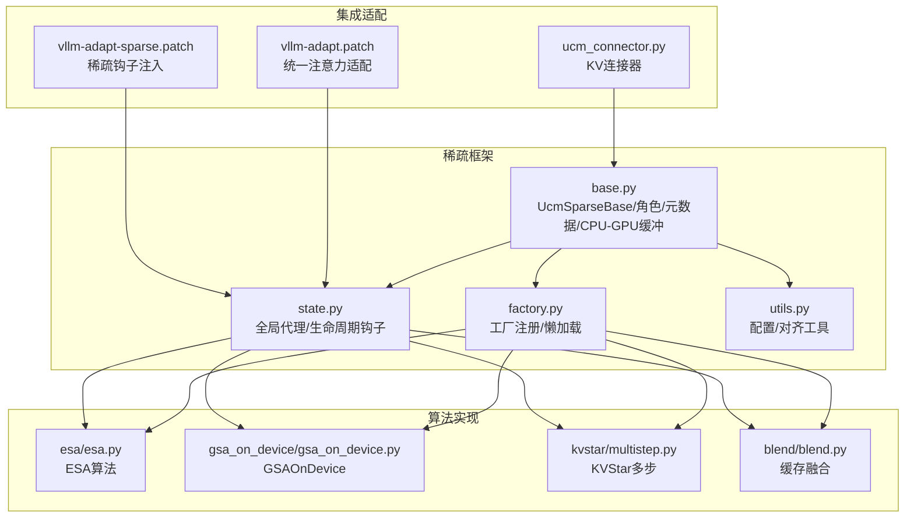
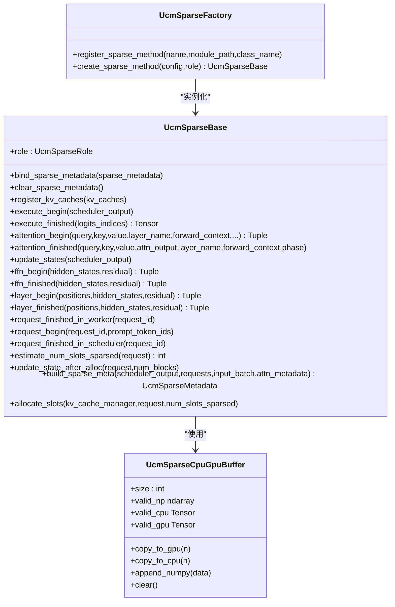
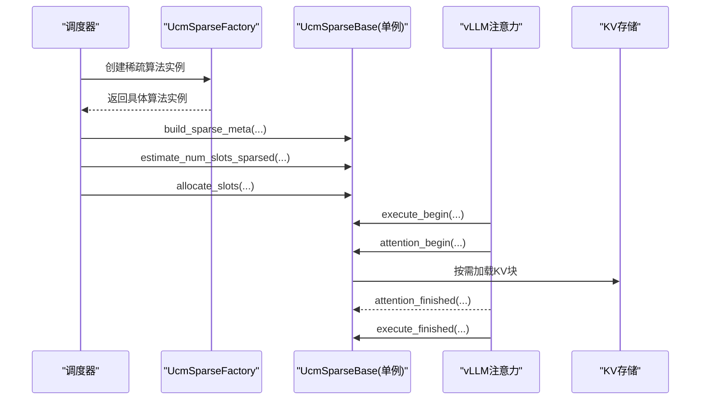
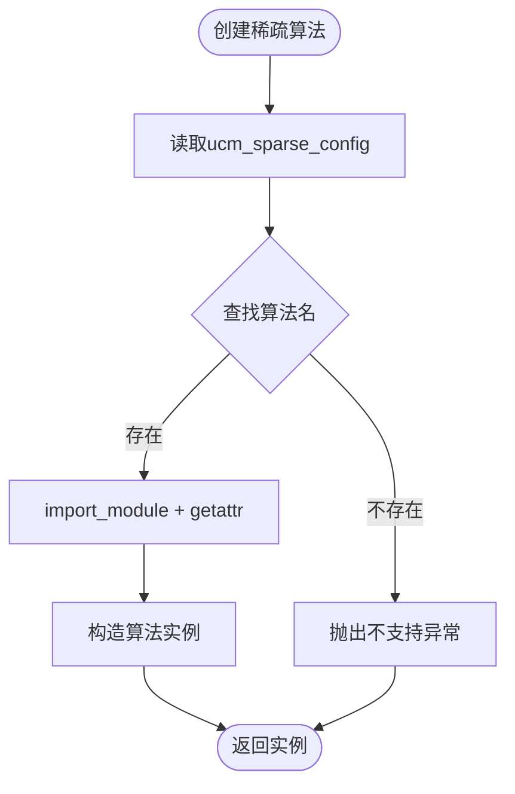
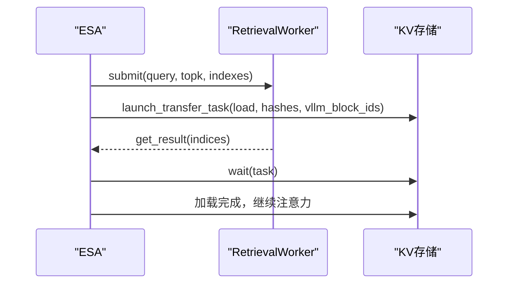
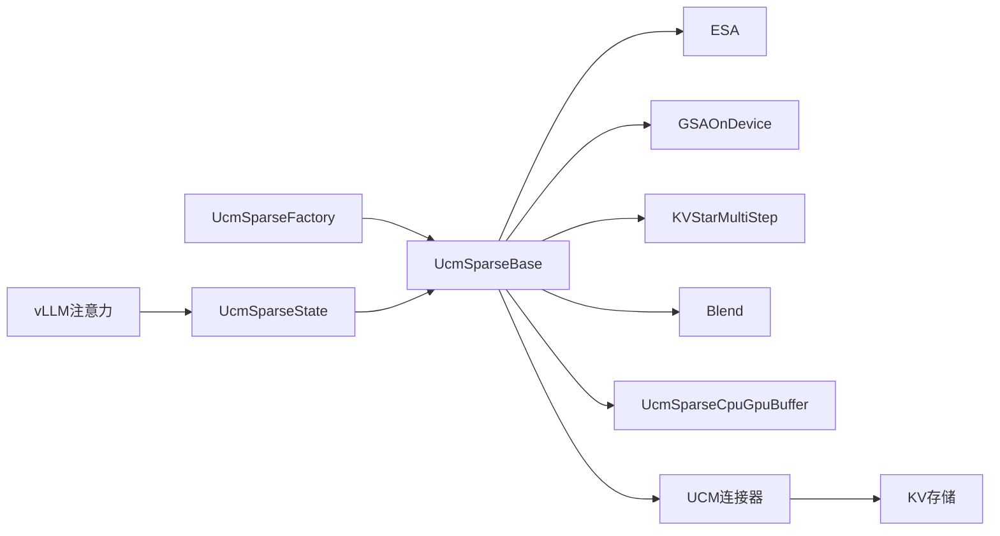

# 稀疏算法框架设计

<cite>
**本文档引用的文件**
- [ucm/sparse/base.py](file://ucm/sparse/base.py)
- [ucm/sparse/factory.py](file://ucm/sparse/factory.py)
- [ucm/sparse/state.py](file://ucm/sparse/state.py)
- [ucm/sparse/utils.py](file://ucm/sparse/utils.py)
- [ucm/sparse/esa/esa.py](file://ucm/sparse/esa/esa.py)
- [ucm/sparse/esa/retrieval/retrieval_worker.py](file://ucm/sparse/esa/retrieval/retrieval_worker.py)
- [ucm/sparse/gsa_on_device/gsa_on_device.py](file://ucm/sparse/gsa_on_device/gsa_on_device.py)
- [ucm/sparse/gsa_on_device/gsa_on_device_config.py](file://ucm/sparse/gsa_on_device/gsa_on_device_config.py)
- [ucm/sparse/kvstar/multistep.py](file://ucm/sparse/kvstar/multistep.py)
- [ucm/sparse/kvstar/utils.py](file://ucm/sparse/kvstar/utils.py)
- [ucm/sparse/blend/blend.py](file://ucm/sparse/blend/blend.py)
- [ucm/integration/vllm/patch/0.9.2/vllm-adapt.patch](file://ucm/integration/vllm/patch/0.9.2/vllm-adapt.patch)
- [ucm/integration/vllm/patch/0.9.2/vllm-adapt-sparse.patch](file://ucm/integration/vllm/patch/0.9.2/vllm-adapt-sparse.patch)
- [ucm/integration/vllm/ucm_connector.py](file://ucm/integration/vllm/ucm_connector.py)
</cite>

## 目录
1. [简介](#简介)
2. [项目结构](#项目结构)
3. [核心组件](#核心组件)
4. [架构总览](#架构总览)
5. [详细组件分析](#详细组件分析)
6. [依赖关系分析](#依赖关系分析)
7. [性能考量](#性能考量)
8. [故障排查指南](#故障排查指南)
9. [结论](#结论)
10. [附录](#附录)

## 简介
本技术文档围绕UCM稀疏注意力算法框架展开，系统阐述UcmSparseBase抽象基类的设计理念与接口规范，覆盖调度器侧与工作器侧方法体系；详解算法状态管理、元数据传递机制以及CPU-GPU缓冲区管理；解析工厂模式与插件化架构；并给出生命周期钩子函数的调用时机与最佳实践。文档同时结合具体算法实现（ESA、GSAOnDevice、KVStarMultiStep、Blend）进行深入分析，并提供可直接参考的代码路径与扩展指南。

## 项目结构
UCM稀疏注意力框架位于ucm/sparse目录下，采用“按功能域分层”的组织方式：
- base：定义UcmSparseBase抽象基类、角色枚举、元数据接口与CPU/GPU缓冲区工具
- factory：稀疏算法工厂，支持动态注册与懒加载
- state：全局单例代理与生命周期钩子桥接
- utils：通用配置与对齐工具
- 具体算法实现：esa、gsa_on_device、kvstar、blend
- 集成适配：与vLLM的patch与连接器

**图表来源**
- [ucm/sparse/base.py](file://ucm/sparse/base.py#L127-L323)
- [ucm/sparse/factory.py](file://ucm/sparse/factory.py#L13-L57)
- [ucm/sparse/state.py](file://ucm/sparse/state.py#L23-L110)
- [ucm/sparse/utils.py](file://ucm/sparse/utils.py#L1-L65)
- [ucm/sparse/esa/esa.py](file://ucm/sparse/esa/esa.py#L421-L821)
- [ucm/sparse/gsa_on_device/gsa_on_device.py](file://ucm/sparse/gsa_on_device/gsa_on_device.py#L99-L964)
- [ucm/sparse/kvstar/multistep.py](file://ucm/sparse/kvstar/multistep.py#L645-L937)
- [ucm/sparse/blend/blend.py](file://ucm/sparse/blend/blend.py#L149-L384)
- [ucm/integration/vllm/patch/0.9.2/vllm-adapt.patch](file://ucm/integration/vllm/patch/0.9.2/vllm-adapt.patch#L665-L694)
- [ucm/integration/vllm/patch/0.9.2/vllm-adapt-sparse.patch](file://ucm/integration/vllm/patch/0.9.2/vllm-adapt-sparse.patch#L31-L57)
- [ucm/integration/vllm/ucm_connector.py](file://ucm/integration/vllm/ucm_connector.py#L82-L1080)

**章节来源**
- [ucm/sparse/base.py](file://ucm/sparse/base.py#L1-L323)
- [ucm/sparse/factory.py](file://ucm/sparse/factory.py#L1-L57)
- [ucm/sparse/state.py](file://ucm/sparse/state.py#L1-L110)
- [ucm/sparse/utils.py](file://ucm/sparse/utils.py#L1-L65)

## 核心组件
本节聚焦UcmSparseBase抽象基类及其配套设施，阐明调度器侧与工作器侧的职责边界与接口契约。

- 角色与元数据
  - UcmSparseRole：区分SCHEDULER与WORKER
  - UcmSparseMetadata：用于调度器与工作器之间的元数据载体
  - UcmSparseCpuGpuBuffer：简化CPU/GPU张量拷贝与numpy互操作

- 工作器侧接口（执行期）
  - 绑定与清理元数据：bind_sparse_metadata/clear_sparse_metadata/_get_sparse_metadata
  - 执行期钩子：execute_begin/execute_finished
  - 注意力钩子：attention_begin/attention_finished
  - FFN与层级钩子：ffn_begin/ffn_finished、layer_begin/layer_finished
  - 请求结束资源释放：request_finished_in_worker
  - 注册KV缓存：register_kv_caches

- 调度器侧接口（调度期）
  - 请求生命周期：request_begin/request_finished_in_scheduler
  - 资源估算与分配：estimate_num_slots_sparsed/update_state_after_alloc/build_sparse_meta/allocate_slots

- 状态与工厂
  - 单例代理：ensure_ucm_sparse_initialized/get_ucm_sparse/has_ucm_sparse
  - 生命周期桥接：maybe_execute_sparse_*系列函数
  - 工厂注册：UcmSparseFactory.register_sparse_method/create_sparse_method

**图表来源**
- [ucm/sparse/base.py](file://ucm/sparse/base.py#L127-L323)
- [ucm/sparse/factory.py](file://ucm/sparse/factory.py#L13-L57)
- [ucm/sparse/state.py](file://ucm/sparse/state.py#L27-L110)

**章节来源**
- [ucm/sparse/base.py](file://ucm/sparse/base.py#L39-L323)
- [ucm/sparse/factory.py](file://ucm/sparse/factory.py#L13-L57)
- [ucm/sparse/state.py](file://ucm/sparse/state.py#L27-L110)

## 架构总览
UCM稀疏注意力框架通过“工厂+单例代理+生命周期钩子”实现与推理引擎（如vLLM）的解耦集成。调度器侧负责请求与块分配策略，工作器侧负责注意力前后的稀疏控制与KV缓存加载/保存。

**图表来源**
- [ucm/sparse/factory.py](file://ucm/sparse/factory.py#L31-L57)
- [ucm/sparse/state.py](file://ucm/sparse/state.py#L27-L110)
- [ucm/integration/vllm/patch/0.9.2/vllm-adapt.patch](file://ucm/integration/vllm/patch/0.9.2/vllm-adapt.patch#L665-L694)
- [ucm/integration/vllm/ucm_connector.py](file://ucm/integration/vllm/ucm_connector.py#L397-L447)

## 详细组件分析

### UcmSparseBase与生命周期钩子
- 调度期钩子
  - request_begin：请求开始时初始化内部状态
  - request_finished_in_scheduler：请求结束时生成工作器侧所需元数据
  - estimate_num_slots_sparsed：估算所需块数
  - update_state_after_alloc：块分配后更新状态
  - build_sparse_meta：构建当前步的稀疏元数据
  - allocate_slots：执行块分配

- 执行期钩子
  - execute_begin/execute_finished：模型执行前后处理
  - attention_begin/attention_finished：注意力计算前后处理
  - ffn_begin/ffn_finished、layer_begin/layer_finished：FFN与层级处理
  - request_finished_in_worker：请求结束时释放资源

- 元数据与缓冲
  - bind_sparse_metadata/clear_sparse_metadata/_get_sparse_metadata：元数据绑定与清理
  - register_kv_caches：注册KV缓存（部分算法需要）

**章节来源**
- [ucm/sparse/base.py](file://ucm/sparse/base.py#L127-L323)
- [ucm/sparse/state.py](file://ucm/sparse/state.py#L78-L110)

### 工厂模式与插件化架构
- UcmSparseFactory
  - register_sparse_method：注册算法名称到模块类名的映射，采用懒加载
  - create_sparse_method：从配置读取算法名，实例化对应算法类
- 已注册算法
  - ESA、GSAOnDevice、KVStarMultiStep、Blend

**图表来源**
- [ucm/sparse/factory.py](file://ucm/sparse/factory.py#L31-L57)

**章节来源**
- [ucm/sparse/factory.py](file://ucm/sparse/factory.py#L13-L57)

### 算法状态管理与元数据传递
- 全局代理
  - ensure_ucm_sparse_initialized：根据配置初始化单例代理
  - get_ucm_sparse/has_ucm_sparse：获取与检查可用性
  - maybe_execute_sparse_*：条件执行层/FFN钩子
- 元数据传递
  - 调度器侧：build_sparse_meta生成算法特定元数据
  - 工作器侧：bind_sparse_metadata接收元数据并在注意力前后使用

**章节来源**
- [ucm/sparse/state.py](file://ucm/sparse/state.py#L27-L110)
- [ucm/sparse/base.py](file://ucm/sparse/base.py#L145-L177)

### CPU-GPU缓冲区管理
- UcmSparseCpuGpuBuffer
  - 提供CPU/GPU张量共享内存视图，支持非阻塞拷贝
  - 支持numpy互操作（with_numpy参数控制）
  - 提供append_numpy/clear/valid_*访问器

**章节来源**
- [ucm/sparse/base.py](file://ucm/sparse/base.py#L56-L125)

### ESA算法（示例）
- 关键点
  - 为每个请求/层维护ReqStatePerLayer，负责检索与异步传输
  - 使用RetrievalWorker进行向量检索，异步等待结果
  - 通过UcmKVStoreBase执行块加载/等待
  - 通过build_sparse_meta区分prefill/decode阶段
- 钩子使用
  - attention_begin/attention_finished：在注意力前后触发检索与加载
  - request_finished_in_worker：释放槽位池

**图表来源**
- [ucm/sparse/esa/esa.py](file://ucm/sparse/esa/esa.py#L272-L420)
- [ucm/sparse/esa/retrieval/retrieval_worker.py](file://ucm/sparse/esa/retrieval/retrieval_worker.py#L23-L36)

**章节来源**
- [ucm/sparse/esa/esa.py](file://ucm/sparse/esa/esa.py#L421-L821)
- [ucm/sparse/esa/retrieval/retrieval_worker.py](file://ucm/sparse/esa/retrieval/retrieval_worker.py#L11-L107)

### GSAOnDevice算法
- 关键点
  - 支持CUDA/NPU设备，按模型自动选择配置
  - 在注意力前计算哈希并更新top-k块表，注意力后回滚
  - 提供initialize_kv_hash_cache_tensors等哈希缓存初始化
- 钩子使用
  - attention_begin/attention_finished：更新/回滚注意力元数据
  - execute_begin：重置内部状态
  - register_kv_caches：注册带哈希缓存的KV结构

**章节来源**
- [ucm/sparse/gsa_on_device/gsa_on_device.py](file://ucm/sparse/gsa_on_device/gsa_on_device.py#L99-L964)
- [ucm/sparse/gsa_on_device/gsa_on_device_config.py](file://ucm/sparse/gsa_on_device/gsa_on_device_config.py#L36-L279)

### KVStarMultiStep算法
- 关键点
  - 多步检索与块表示：按步长stride进行检索与加载
  - 支持prefill/decode阶段差异处理
  - 通过ReqPerLayerState管理每请求/每层的状态
- 钩子使用
  - attention_begin/attention_finished：在注意力前后触发查询离线与检索加载

**章节来源**
- [ucm/sparse/kvstar/multistep.py](file://ucm/sparse/kvstar/multistep.py#L645-L937)
- [ucm/sparse/kvstar/utils.py](file://ucm/sparse/kvstar/utils.py#L8-L61)

### Blend算法
- 关键点
  - 基于块缓存命中率与偏差计算，裁剪需要重算的token范围
  - 动态更新注意力元数据（slot_mapping/query_start_loc等）
  - 在FFN与层级阶段进行索引重排
- 钩子使用
  - attention_begin：计算topK并更新元数据
  - ffn_begin/layer_begin：按需重索引隐藏态与位置
  - execute_finished：修正logits索引

**章节来源**
- [ucm/sparse/blend/blend.py](file://ucm/sparse/blend/blend.py#L149-L384)

### 与vLLM的集成
- patch适配
  - 在unified_attention前后注入maybe_execute_sparse_attention_begin/finished
  - 在层级前后注入maybe_execute_sparse_layer_begin/finished
- 连接器
  - UCMDirectConnector/UCMLayerWiseConnector负责块ID生成、加载/保存任务与统计

**章节来源**
- [ucm/integration/vllm/patch/0.9.2/vllm-adapt.patch](file://ucm/integration/vllm/patch/0.9.2/vllm-adapt.patch#L665-L694)
- [ucm/integration/vllm/patch/0.9.2/vllm-adapt-sparse.patch](file://ucm/integration/vllm/patch/0.9.2/vllm-adapt-sparse.patch#L31-L57)
- [ucm/integration/vllm/ucm_connector.py](file://ucm/integration/vllm/ucm_connector.py#L82-L1080)

## 依赖关系分析
- 组件耦合
  - UcmSparseBase是所有算法的共同基类，确保接口一致性
  - UcmSparseFactory通过字符串映射实现算法插件化，降低耦合
  - UcmSparseCpuGpuBuffer被多个算法复用，提升缓冲区管理效率
- 外部依赖
  - vLLM注意力后端与ForwardContext
  - 存储后端（UcmKVStoreBase）用于块加载/保存
  - 可选的检索后端（ESA的RetrievalWorker）与CPU绑定工具

**图表来源**
- [ucm/sparse/factory.py](file://ucm/sparse/factory.py#L13-L57)
- [ucm/sparse/base.py](file://ucm/sparse/base.py#L127-L323)
- [ucm/sparse/state.py](file://ucm/sparse/state.py#L27-L110)
- [ucm/integration/vllm/ucm_connector.py](file://ucm/integration/vllm/ucm_connector.py#L82-L1080)

**章节来源**
- [ucm/sparse/factory.py](file://ucm/sparse/factory.py#L13-L57)
- [ucm/sparse/base.py](file://ucm/sparse/base.py#L127-L323)
- [ucm/sparse/state.py](file://ucm/sparse/state.py#L27-L110)

## 性能考量
- 检索与传输
  - 异步检索与块传输可显著减少注意力前的等待时间
  - 合理设置检索stride与top-k比例，平衡延迟与HBM占用
- 缓冲区管理
  - 使用UcmSparseCpuGpuBuffer进行非阻塞拷贝，避免同步瓶颈
  - 对齐与对齐函数（如align_to_256bytes）有助于提高内存访问效率
- 设备优化
  - GSAOnDevice针对CUDA/NPU提供专用哈希与top-k实现，充分利用硬件特性
- 量化与精度
  - 部分算法使用bfloat16等低精度以节省带宽，注意与numpy互操作限制

[本节为通用指导，无需列出具体文件来源]

## 故障排查指南
- 初始化失败
  - 确认ucm_sparse_config配置正确且算法名已注册
  - 检查ensure_ucm_sparse_initialized是否被调用
- 元数据缺失
  - 确保调度器侧build_sparse_meta生成并传递给工作器侧
  - 检查bind_sparse_metadata/clear_sparse_metadata调用时机
- 检索/传输异常
  - 查看RetrievalWorker或存储后端错误日志
  - 核对块ID生成与哈希一致性
- 设备相关问题
  - CUDA/NPU设备不可用时，确认设备类型与驱动版本
  - GSAOnDevice配置文件路径与内容正确性

**章节来源**
- [ucm/sparse/state.py](file://ucm/sparse/state.py#L27-L110)
- [ucm/integration/vllm/ucm_connector.py](file://ucm/integration/vllm/ucm_connector.py#L520-L659)

## 结论
UCM稀疏注意力框架通过清晰的抽象基类、工厂与单例代理机制，实现了与推理引擎的松耦合集成。各算法在统一接口下实现差异化策略，既能满足不同场景需求，又便于扩展与维护。建议在新算法开发中遵循现有接口约定，合理利用生命周期钩子与元数据传递机制，以获得更好的性能与可维护性。

[本节为总结性内容，无需列出具体文件来源]

## 附录

### 生命周期钩子调用时机速览
- execute_begin：模型执行开始
- attention_begin：注意力计算开始
- attention_finished：注意力计算结束
- execute_finished：模型执行结束
- ffn_begin/ffn_finished：FFN前后
- layer_begin/layer_finished：层级前后
- request_finished_in_worker：请求结束时释放资源

**章节来源**
- [ucm/sparse/base.py](file://ucm/sparse/base.py#L185-L281)
- [ucm/sparse/state.py](file://ucm/sparse/state.py#L78-L110)

### 开发最佳实践与扩展指南
- 接口实现
  - 严格遵循UcmSparseBase接口，仅在必要处覆写默认空实现
  - 在attention_begin中修改注意力元数据时，确保就地更新
- 元数据设计
  - 将调度期计算的结果封装为UcmSparseMetadata子类
  - 明确区分prefill/decode阶段的元数据差异
- 缓冲区管理
  - 使用UcmSparseCpuGpuBuffer统一管理CPU/GPU拷贝
  - 避免在关键路径进行同步拷贝
- 插件注册
  - 通过UcmSparseFactory.register_sparse_method注册新算法
  - 在配置中设置ucm_sparse_config对应算法名
- 示例参考
  - ESA：检索与异步传输
  - GSAOnDevice：哈希与top-k
  - KVStarMultiStep：多步检索
  - Blend：基于偏差的token裁剪

**章节来源**
- [ucm/sparse/factory.py](file://ucm/sparse/factory.py#L13-L57)
- [ucm/sparse/esa/esa.py](file://ucm/sparse/esa/esa.py#L421-L821)
- [ucm/sparse/gsa_on_device/gsa_on_device.py](file://ucm/sparse/gsa_on_device/gsa_on_device.py#L99-L964)
- [ucm/sparse/kvstar/multistep.py](file://ucm/sparse/kvstar/multistep.py#L645-L937)
- [ucm/sparse/blend/blend.py](file://ucm/sparse/blend/blend.py#L149-L384)