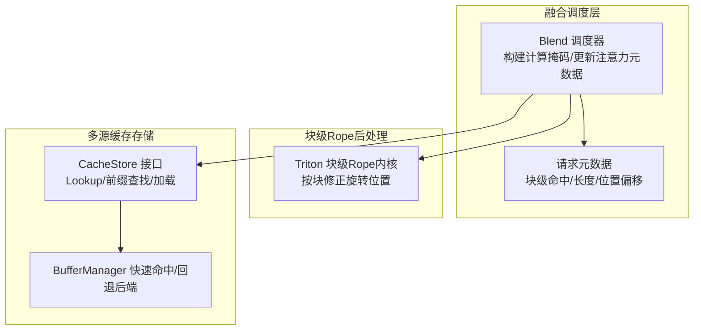
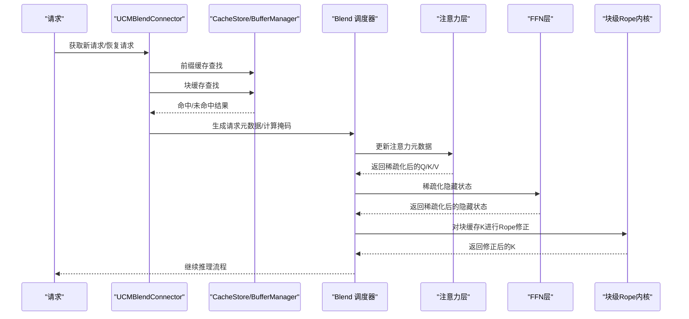
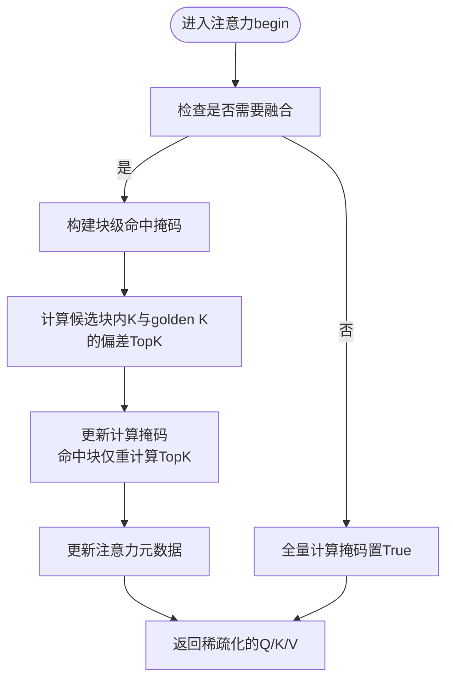
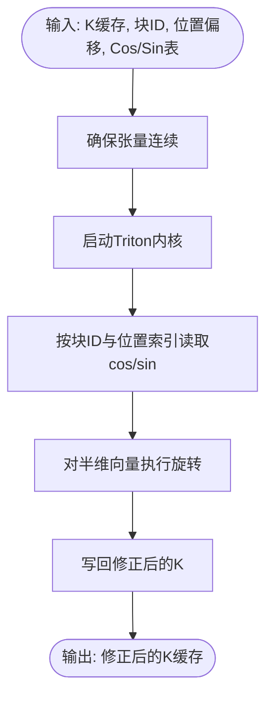
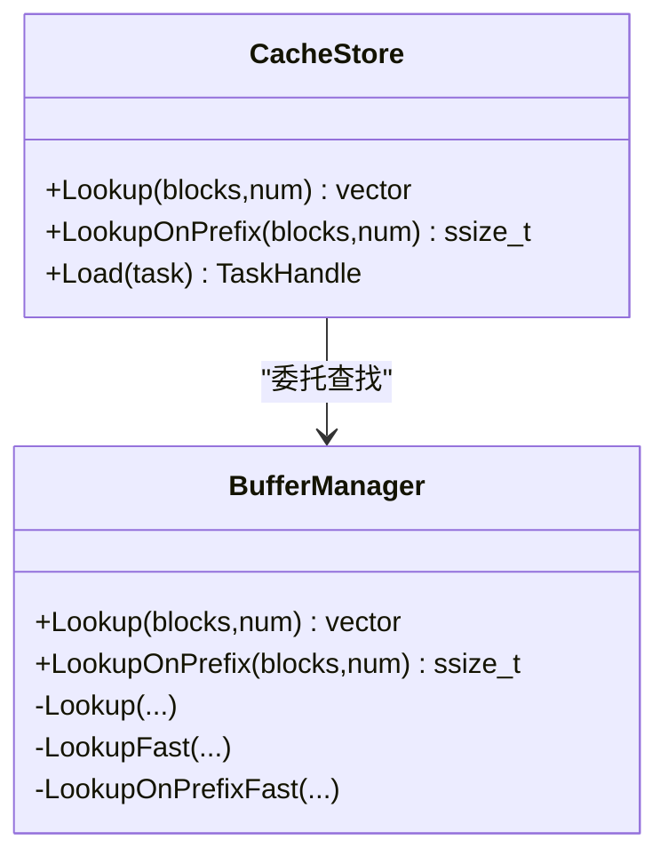
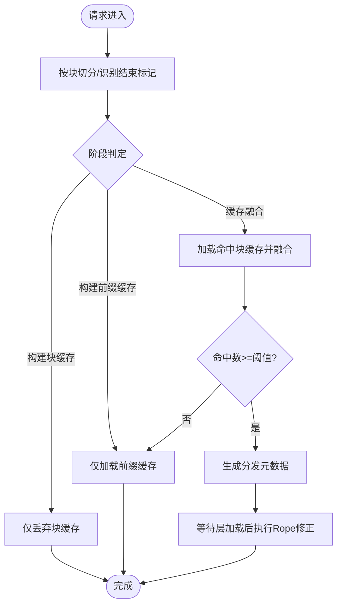
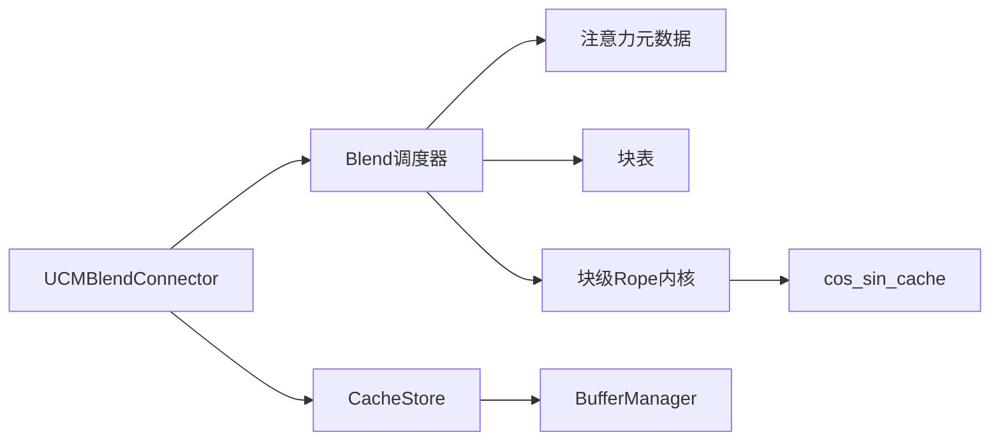

# 缓存融合算法

<cite>
**本文引用的文件**
- [cacheblend.md](file://docs/source/user-guide/sparse-attention/cacheblend.md)
- [blend.py](file://ucm/sparse/blend/blend.py)
- [blockwise_rope.py](file://ucm/sparse/blend/blockwise_rope.py)
- [blend_connector.py](file://ucm/integration/vllm/blend_connector.py)
- [offline_inference_blend.py](file://examples/offline_inference_blend.py)
- [buffer_manager.h](file://ucm/store/cache/cc/buffer_manager.h)
- [cache_store.cc](file://ucm/store/cache/cc/cache_store.cc)
- [factory.py](file://ucm/store/factory.py)
- [state.py](file://ucm/sparse/state.py)
- [vllm-adapt-sparse.patch](file://ucm/integration/vllm/patch/0.9.2/vllm-adapt-sparse.patch)
</cite>

## 目录
1. [简介](#简介)
2. [项目结构](#项目结构)
3. [核心组件](#核心组件)
4. [架构总览](#架构总览)
5. [详细组件分析](#详细组件分析)
6. [依赖关系分析](#依赖关系分析)
7. [性能考量](#性能考量)
8. [故障排查指南](#故障排查指南)
9. [结论](#结论)
10. [附录](#附录)

## 简介
本技术文档围绕缓存融合（Cache Blend）算法展开，系统阐述其核心原理、多缓存策略、块级Rope处理、数据一致性保障、在多源缓存场景下的协调机制以及性能优化策略。文档同时提供配置参数说明、适用场景分析、性能调优建议，并给出使用示例、融合策略对比与部署案例。

## 项目结构
缓存融合算法由三层协同组成：
- 融合调度与元数据管理：负责请求分块、命中检测、计算掩码构建与稀疏化索引重排。
- 块级Rope后处理：针对已加载的块缓存进行位置编码修正，确保跨块拼接时的旋转位置一致。
- 多源缓存存储：统一的KV缓存存储接口，支持前缀缓存与块级缓存的共享查找与加载。

图表来源
- [blend.py](file://ucm/sparse/blend/blend.py#L149-L384)
- [blockwise_rope.py](file://ucm/sparse/blend/blockwise_rope.py#L62-L101)
- [cache_store.cc](file://ucm/store/cache/cc/cache_store.cc#L133-L151)
- [buffer_manager.h](file://ucm/store/cache/cc/buffer_manager.h#L62-L127)

章节来源
- [cacheblend.md](file://docs/source/user-guide/sparse-attention/cacheblend.md#L1-L98)
- [blend.py](file://ucm/sparse/blend/blend.py#L149-L384)
- [blockwise_rope.py](file://ucm/sparse/blend/blockwise_rope.py#L62-L101)
- [cache_store.cc](file://ucm/store/cache/cc/cache_store.cc#L133-L151)
- [buffer_manager.h](file://ucm/store/cache/cc/buffer_manager.h#L62-L127)

## 核心组件
- 融合调度器（Blend）
  - 构建请求级元数据，统计前缀缓存命中、块级缓存命中与后缀长度。
  - 计算每个请求的“计算掩码”，仅保留需要重新计算的token区间，其余通过缓存复用。
  - 更新注意力元数据（slot_mapping、query_start_loc、max_query_len等），实现后续前向计算的稀疏化。
- 块级Rope后处理（blockwise_rope）
  - 使用Triton内核对已加载的块缓存K进行原地旋转，修正因块拼接导致的位置偏移。
  - 支持批量按块处理，避免逐token循环带来的开销。
- 多源缓存存储（CacheStore/BufferManager）
  - 提供统一的块级查找接口，先尝试内存缓冲快速命中，未命中则回退到后端存储。
  - 支持前缀查找，便于优先复用前缀缓存。

章节来源
- [blend.py](file://ucm/sparse/blend/blend.py#L149-L384)
- [blockwise_rope.py](file://ucm/sparse/blend/blockwise_rope.py#L62-L101)
- [cache_store.cc](file://ucm/store/cache/cc/cache_store.cc#L133-L151)
- [buffer_manager.h](file://ucm/store/cache/cc/buffer_manager.h#L62-L127)

## 架构总览
缓存融合在vLLM流水线中的集成方式如下：请求进入后，融合连接器根据请求内容识别文本块并执行前缀/块缓存查找；命中部分通过融合调度器进行稀疏化与注意力元数据更新；随后在注意力层与FFN层进行张量稀疏化；最后在块缓存加载完成后，对K进行块级Rope修正以保证位置一致性。

图表来源
- [blend_connector.py](file://ucm/integration/vllm/blend_connector.py#L360-L404)
- [blend.py](file://ucm/sparse/blend/blend.py#L226-L338)
- [blockwise_rope.py](file://ucm/sparse/blend/blockwise_rope.py#L325-L333)

## 详细组件分析

### 融合调度器（Blend）
- 请求元数据构建
  - 统计前缀长度/块数、块缓存命中长度/块数、后缀长度/块数。
  - 计算每个请求的查询起止位置与候选长度，用于后续掩码构建。
- 计算掩码与稀疏化
  - 针对每个请求，基于块级命中掩码与Top-K偏差选择性重计算最高偏差的token比例。
  - 更新注意力元数据，裁剪slot_mapping与query_start_loc，减少后续计算量。
- 层间稀疏化
  - 在注意力层、FFN层与层间位置张量处进行稀疏化，确保整个前向路径的高效执行。
- 结果输出
  - 在模型最终logits处修正索引，保证采样/解码阶段的正确性。

图表来源
- [blend.py](file://ucm/sparse/blend/blend.py#L226-L338)

章节来源
- [blend.py](file://ucm/sparse/blend/blend.py#L44-L125)
- [blend.py](file://ucm/sparse/blend/blend.py#L149-L384)

### 块级Rope后处理（blockwise_rope）
- 设计目标
  - 将来自不同块的缓存K在加载后按块进行位置编码修正，消除块边界导致的角度偏移。
- 实现要点
  - 使用Triton内核，按程序ID映射到(batch, seq, head)矩阵，直接读取cos/sin表并原地旋转。
  - 输入包含块ID数组与对应位置偏移数组，按块批量处理，避免Python循环。
- 性能特性
  - 内核规模与批次、序列长度、头数成正比，具备高吞吐与低延迟特性。

图表来源
- [blockwise_rope.py](file://ucm/sparse/blend/blockwise_rope.py#L62-L101)

章节来源
- [blockwise_rope.py](file://ucm/sparse/blend/blockwise_rope.py#L6-L101)

### 多源缓存存储（CacheStore/BufferManager）
- 查找策略
  - 先尝试内存缓冲快速命中，若存在缺失块，则回退到后端存储进行批量查找。
  - 支持前缀查找，便于优先复用前缀缓存。
- 加载与传输
  - 当启用传输时，提供Load接口以异步拉取缺失块。
- 工厂注册
  - 通过工厂注册多种存储后端（如NFS、PCStore、MooncakeStore等），统一对外接口。

图表来源
- [cache_store.cc](file://ucm/store/cache/cc/cache_store.cc#L133-L151)
- [buffer_manager.h](file://ucm/store/cache/cc/buffer_manager.h#L62-L127)

章节来源
- [cache_store.cc](file://ucm/store/cache/cc/cache_store.cc#L118-L151)
- [buffer_manager.h](file://ucm/store/cache/cc/buffer_manager.h#L62-L127)
- [factory.py](file://ucm/store/factory.py#L60-L71)

### 融合连接器（UCMBlendConnector）
- 请求分块与阶段判定
  - 依据块大小与特定结束标记识别文本块；若请求以块结束且整除块大小，则进入构建块缓存阶段。
  - 否则尝试匹配前缀缓存，再对后续块进行缓存查找，决定是否进入缓存融合阶段。
- 命中统计与阈值控制
  - 若块缓存命中数量低于阈值，则回退到构建前缀缓存阶段，避免无效融合。
- 分发元数据
  - 生成加载/丢弃块列表与各块的命中信息，供后续加载与Rope后处理使用。
- 模型集成
  - 在等待某层加载完成时，对已加载的块缓存K执行块级Rope修正。

图表来源
- [blend_connector.py](file://ucm/integration/vllm/blend_connector.py#L148-L220)
- [blend_connector.py](file://ucm/integration/vllm/blend_connector.py#L360-L404)
- [blend_connector.py](file://ucm/integration/vllm/blend_connector.py#L493-L499)

章节来源
- [blend_connector.py](file://ucm/integration/vllm/blend_connector.py#L121-L499)

### vLLM集成与稀疏化钩子
- 状态管理
  - 通过状态模块在FFN与层间插入稀疏化钩子，确保整个前向路径的稀疏化。
- Patch适配
  - 通过补丁在vLLM关键层前后注入稀疏化逻辑，使注意力、FFN与层间位置张量均参与稀疏化。

章节来源
- [state.py](file://ucm/sparse/state.py#L84-L109)
- [vllm-adapt-sparse.patch](file://ucm/integration/vllm/patch/0.9.2/vllm-adapt-sparse.patch#L188-L223)

## 依赖关系分析
- 组件耦合
  - Blend依赖于vLLM注意力元数据与块表，以实现精确的稀疏化与索引重排。
  - 块级Rope依赖于模型的cos_sin_cache，确保角度表与当前请求位置一致。
  - 连接器依赖于CacheStore接口，统一处理前缀与块缓存的查找与加载。
- 外部依赖
  - Triton内核用于高性能Rope修正。
  - vLLM引擎提供请求调度、注意力元数据与块表管理。

图表来源
- [blend.py](file://ucm/sparse/blend/blend.py#L226-L338)
- [blockwise_rope.py](file://ucm/sparse/blend/blockwise_rope.py#L325-L333)
- [blend_connector.py](file://ucm/integration/vllm/blend_connector.py#L360-L404)
- [cache_store.cc](file://ucm/store/cache/cc/cache_store.cc#L133-L151)
- [buffer_manager.h](file://ucm/store/cache/cc/buffer_manager.h#L62-L127)

章节来源
- [blend.py](file://ucm/sparse/blend/blend.py#L149-L384)
- [blockwise_rope.py](file://ucm/sparse/blend/blockwise_rope.py#L62-L101)
- [blend_connector.py](file://ucm/integration/vllm/blend_connector.py#L121-L499)
- [cache_store.cc](file://ucm/store/cache/cc/cache_store.cc#L133-L151)
- [buffer_manager.h](file://ucm/store/cache/cc/buffer_manager.h#L62-L127)

## 性能考量
- 计算掩码与稀疏化
  - 仅对Top-K偏差最大的token进行重计算，显著降低注意力与FFN的计算量。
  - 注意力元数据的裁剪可减少后续内核的内存访问与计算负载。
- 块级Rope内核
  - 使用Triton并行内核，按块批量修正，避免Python循环与频繁内存拷贝。
- 缓存查找优化
  - BufferManager先尝试快速命中，未命中再回退后端，减少I/O延迟。
- 存储后端选择
  - 通过工厂注册多种存储后端，结合业务场景选择合适的持久化介质。

章节来源
- [blend.py](file://ucm/sparse/blend/blend.py#L226-L338)
- [blockwise_rope.py](file://ucm/sparse/blend/blockwise_rope.py#L62-L101)
- [buffer_manager.h](file://ucm/store/cache/cc/buffer_manager.h#L62-L127)
- [factory.py](file://ucm/store/factory.py#L60-L71)

## 故障排查指南
- 命中率过低
  - 检查块结束标记与块大小设置，确保请求被正确切分为块。
  - 调整最小融合阈值，避免小规模命中触发无效融合。
- 位置编码异常
  - 确认cos_sin_cache已成功注册，且块级Rope在等待层加载完成后执行。
- 注意力元数据不一致
  - 检查计算掩码更新逻辑与query_start_loc重算过程，确保索引映射正确。
- 存储后端不可用
  - 确认CacheStore已启用传输能力，并正确配置存储后端路径与权限。

章节来源
- [blend_connector.py](file://ucm/integration/vllm/blend_connector.py#L334-L342)
- [blend_connector.py](file://ucm/integration/vllm/blend_connector.py#L493-L499)
- [cache_store.cc](file://ucm/store/cache/cc/cache_store.cc#L149-L151)

## 结论
缓存融合通过“块级缓存命中 + 选择性重计算 + 块级Rope修正”的组合，在长序列RAG场景下显著降低首Token时间与整体吞吐成本，同时保持高质量输出。其在vLLM中的深度集成与稀疏化钩子确保了从注意力到FFN的全路径优化，配合高效的块级Rope内核与统一的多源缓存接口，形成一套可扩展、可调优的缓存融合方案。

## 附录

### 配置参数说明
- ucm_sparse_config.Blend
  - chunk_end_token_id: 文本块结束标记的token ID，用于识别块边界。
  - compute_meta: 指定每层的融合计算策略，包含ratio字段表示命中块中需要重计算的比例。
- KVTransferConfig
  - kv_connector_extra_config: 包含ucm_sparse_config与ucm_connectors。
  - ucm_connectors: 存储后端配置，如UcmNfsStore等。

章节来源
- [offline_inference_blend.py](file://examples/offline_inference_blend.py#L88-L128)
- [offline_inference_blend.py](file://examples/offline_inference_blend.py#L103-L112)

### 适用场景分析
- 长序列检索增强（RAG）
  - 大量知识块拼接导致的长上下文推理，缓存融合可显著提升TTFT与吞吐。
- 多源知识库检索
  - 不同来源的知识块缓存可共享同一存储空间，通过块哈希实现统一查找与复用。
- 多模型与多任务
  - 通过统一的融合接口与稀疏化钩子，适配不同模型与任务的推理需求。

章节来源
- [cacheblend.md](file://docs/source/user-guide/sparse-attention/cacheblend.md#L13-L27)

### 性能调优建议
- 合理设置块大小
  - 块大小应与模型注意力窗口与硬件内存相匹配，避免过大或过小影响命中率与缓存利用率。
- 调整融合阈值与重计算比例
  - 针对不同任务与硬件，调整最小融合阈值与每层的重计算比例，平衡延迟与质量。
- 优化存储后端
  - 根据数据访问模式选择合适的存储后端（如NFS、PCStore等），并合理配置缓存参数。
- 内核与编译优化
  - 确保Triton内核在目标GPU上正确编译与运行，必要时调整内核参数以适配硬件。

章节来源
- [blend_connector.py](file://ucm/integration/vllm/blend_connector.py#L142-L142)
- [blend.py](file://ucm/sparse/blend/blend.py#L293-L296)
- [factory.py](file://ucm/store/factory.py#L60-L71)

### 使用示例
- 示例脚本
  - offline_inference_blend.py展示了如何配置KVTransferConfig与ucm_sparse_config，执行缓存融合推理。
- 关键步骤
  - 设置环境变量与数据目录。
  - 构建KVTransferConfig并指定ucm_connectors与ucm_sparse_config。
  - 启动LLM推理并观察TTFT与吞吐变化。

章节来源
- [offline_inference_blend.py](file://examples/offline_inference_blend.py#L87-L135)
- [offline_inference_blend.py](file://examples/offline_inference_blend.py#L173-L273)

### 融合策略对比
- 传统前缀缓存
  - 优点：实现简单，命中率高；缺点：无法充分利用块级缓存，长序列推理效率有限。
- 缓存融合（CacheBlend）
  - 优点：结合块级缓存与选择性重计算，显著降低TTFT与提升吞吐；缺点：实现复杂度较高，需注意位置编码一致性。
- 建议
  - 在长序列RAG场景优先采用缓存融合；对于短序列或简单场景，可考虑传统前缀缓存以简化部署。

章节来源
- [cacheblend.md](file://docs/source/user-guide/sparse-attention/cacheblend.md#L13-L27)

### 实际部署案例
- RAG问答系统
  - 将知识库分块并缓存，请求到达时先进行前缀缓存查找，再对块缓存进行命中检测与融合，最后执行块级Rope修正。
- 多模型适配
  - 通过工厂注册不同存储后端，结合vLLM补丁与稀疏化钩子，实现对多种模型的统一优化。

章节来源
- [blend_connector.py](file://ucm/integration/vllm/blend_connector.py#L360-L404)
- [factory.py](file://ucm/store/factory.py#L60-L71)
- [vllm-adapt-sparse.patch](file://ucm/integration/vllm/patch/0.9.2/vllm-adapt-sparse.patch#L188-L223)