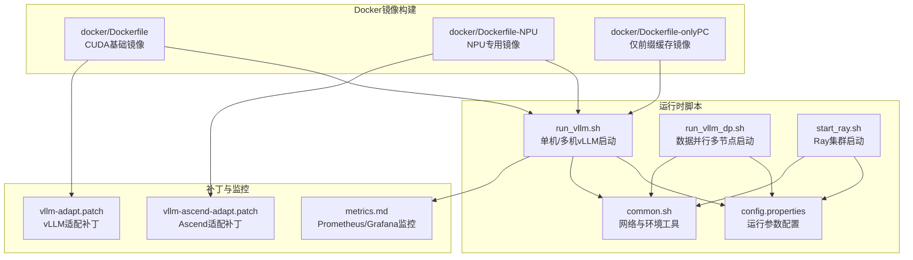
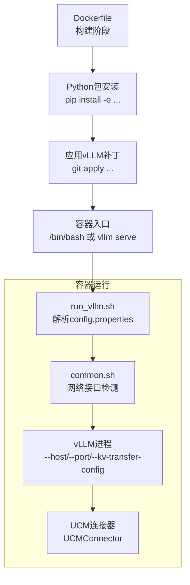
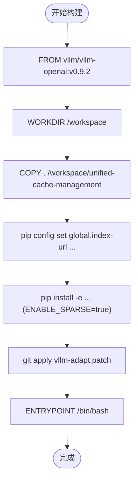
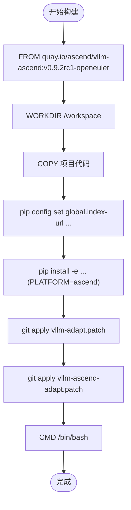
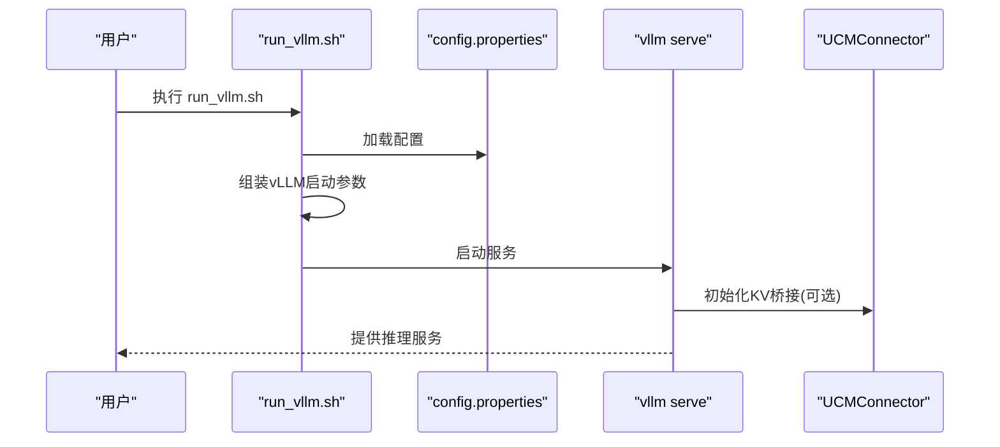
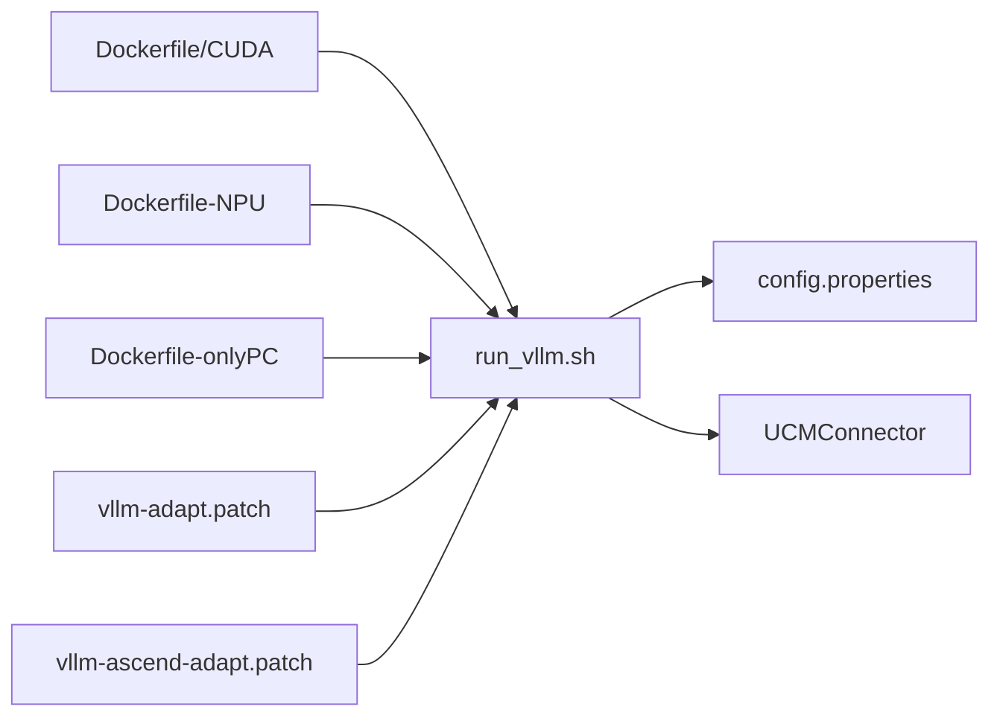

# Docker容器化部署

<cite>
**本文引用的文件**
- [docker/Dockerfile](file://docker/Dockerfile)
- [docker/Dockerfile-NPU](file://docker/Dockerfile-NPU)
- [docker/Dockerfile-onlyPC](file://docker/Dockerfile-onlyPC)
- [examples/deployments/scripts/vllm/run_vllm.sh](file://examples/deployments/scripts/vllm/run_vllm.sh)
- [examples/deployments/scripts/vllm/run_vllm_dp.sh](file://examples/deployments/scripts/vllm/run_vllm_dp.sh)
- [examples/deployments/scripts/vllm/start_ray.sh](file://examples/deployments/scripts/vllm/start_ray.sh)
- [examples/deployments/scripts/vllm/common.sh](file://examples/deployments/scripts/vllm/common.sh)
- [examples/deployments/scripts/vllm/config.properties](file://examples/deployments/scripts/vllm/config.properties)
- [ucm/integration/vllm/patch/0.9.2/vllm-adapt.patch](file://ucm/integration/vllm/patch/0.9.2/vllm-adapt.patch)
- [ucm/integration/vllm/patch/0.9.2/vllm-ascend-adapt.patch](file://ucm/integration/vllm/patch/0.9.2/vllm-ascend-adapt.patch)
- [docs/source/user-guide/metrics/metrics.md](file://docs/source/user-guide/metrics/metrics.md)
- [test/runner-docker/Dockerfile](file://test/runner-docker/Dockerfile)
- [test/runner-docker/runner-svc.sh](file://test/runner-docker/runner-svc.sh)
</cite>

## 目录
1. [简介](#简介)
2. [项目结构](#项目结构)
3. [核心组件](#核心组件)
4. [架构总览](#架构总览)
5. [详细组件分析](#详细组件分析)
6. [依赖关系分析](#依赖关系分析)
7. [性能考虑](#性能考虑)
8. [故障排查指南](#故障排查指南)
9. [结论](#结论)
10. [附录](#附录)

## 简介
本指南面向使用UCM（Unified Cache Management）与vLLM进行推理服务部署的用户，系统性阐述基于Docker的容器化部署方案。内容覆盖：
- 基础Dockerfile构建流程与依赖安装
- NPU专用镜像的差异化构建与特殊配置
- 多阶段构建思路与优化策略
- 容器运行时配置（资源限制、网络、存储）
- 健康检查与重启策略
- 实际部署命令、参数说明与调试日志方法

## 项目结构
与Docker容器化部署直接相关的目录与文件如下：
- docker：存放三类Dockerfile（通用CUDA、NPU、仅前缀缓存）
- examples/deployments/scripts/vllm：启动脚本与配置文件
- ucm/integration/vllm/patch：针对vLLM版本的补丁，用于适配UCM集成
- docs/source/user-guide/metrics：监控指标导出与可视化参考
- test/runner-docker：示例Supervisor容器化运行器

**图表来源**
- [docker/Dockerfile](file://docker/Dockerfile#L1-L20)
- [docker/Dockerfile-NPU](file://docker/Dockerfile-NPU#L1-L25)
- [docker/Dockerfile-onlyPC](file://docker/Dockerfile-onlyPC#L1-L16)
- [examples/deployments/scripts/vllm/run_vllm.sh](file://examples/deployments/scripts/vllm/run_vllm.sh#L1-L116)
- [examples/deployments/scripts/vllm/run_vllm_dp.sh](file://examples/deployments/scripts/vllm/run_vllm_dp.sh#L1-L153)
- [examples/deployments/scripts/vllm/start_ray.sh](file://examples/deployments/scripts/vllm/start_ray.sh#L1-L57)
- [examples/deployments/scripts/vllm/common.sh](file://examples/deployments/scripts/vllm/common.sh#L1-L79)
- [examples/deployments/scripts/vllm/config.properties](file://examples/deployments/scripts/vllm/config.properties#L1-L92)
- [ucm/integration/vllm/patch/0.9.2/vllm-adapt.patch](file://ucm/integration/vllm/patch/0.9.2/vllm-adapt.patch#L1-L200)
- [ucm/integration/vllm/patch/0.9.2/vllm-ascend-adapt.patch](file://ucm/integration/vllm/patch/0.9.2/vllm-ascend-adapt.patch#L1-L200)
- [docs/source/user-guide/metrics/metrics.md](file://docs/source/user-guide/metrics/metrics.md#L62-L149)

**章节来源**
- [docker/Dockerfile](file://docker/Dockerfile#L1-L20)
- [docker/Dockerfile-NPU](file://docker/Dockerfile-NPU#L1-L25)
- [docker/Dockerfile-onlyPC](file://docker/Dockerfile-onlyPC#L1-L16)
- [examples/deployments/scripts/vllm/run_vllm.sh](file://examples/deployments/scripts/vllm/run_vllm.sh#L1-L116)
- [examples/deployments/scripts/vllm/run_vllm_dp.sh](file://examples/deployments/scripts/vllm/run_vllm_dp.sh#L1-L153)
- [examples/deployments/scripts/vllm/start_ray.sh](file://examples/deployments/scripts/vllm/start_ray.sh#L1-L57)
- [examples/deployments/scripts/vllm/common.sh](file://examples/deployments/scripts/vllm/common.sh#L1-L79)
- [examples/deployments/scripts/vllm/config.properties](file://examples/deployments/scripts/vllm/config.properties#L1-L92)

## 核心组件
- 基础镜像（CUDA）：以vLLM官方镜像为基础，安装UCM并应用适配补丁，启用稀疏注意力支持。
- NPU镜像（Ascend）：以Ascend官方vLLM镜像为基础，注入Ascend特定库路径与补丁，适配Ascend分布式与调度。
- 仅前缀缓存镜像：在CUDA基础镜像上移除稀疏特性，仅保留前缀缓存能力，降低依赖复杂度。
- 运行脚本：封装vLLM启动参数、UCM连接配置、Ray多节点与HCCL/NVLink网络配置。
- 补丁机制：通过git apply对vLLM源码打补丁，实现KV缓存桥接与稀疏注意力集成。

**章节来源**
- [docker/Dockerfile](file://docker/Dockerfile#L1-L20)
- [docker/Dockerfile-NPU](file://docker/Dockerfile-NPU#L1-L25)
- [docker/Dockerfile-onlyPC](file://docker/Dockerfile-onlyPC#L1-L16)
- [ucm/integration/vllm/patch/0.9.2/vllm-adapt.patch](file://ucm/integration/vllm/patch/0.9.2/vllm-adapt.patch#L1-L200)
- [ucm/integration/vllm/patch/0.9.2/vllm-ascend-adapt.patch](file://ucm/integration/vllm/patch/0.9.2/vllm-ascend-adapt.patch#L1-L200)

## 架构总览
下图展示从镜像构建到容器运行的关键交互：

**图表来源**
- [docker/Dockerfile](file://docker/Dockerfile#L8-L20)
- [examples/deployments/scripts/vllm/run_vllm.sh](file://examples/deployments/scripts/vllm/run_vllm.sh#L39-L112)
- [examples/deployments/scripts/vllm/common.sh](file://examples/deployments/scripts/vllm/common.sh#L62-L79)
- [examples/deployments/scripts/vllm/config.properties](file://examples/deployments/scripts/vllm/config.properties#L84-L92)

## 详细组件分析

### 基础Dockerfile（CUDA）
- 基础镜像选择：使用vLLM官方镜像作为起点，确保CUDA运行时与依赖一致。
- 依赖安装：设置镜像源，切换到工作目录后复制项目代码，执行可编辑安装，启用稀疏注意力。
- 补丁应用：定位已安装的vLLM源码位置，应用适配补丁以接入UCM的KV桥接与稀疏注意力。
- 入口命令：默认bash，便于交互式调试；生产可通过run_vllm.sh启动vLLM服务。

**图表来源**
- [docker/Dockerfile](file://docker/Dockerfile#L1-L20)
- [ucm/integration/vllm/patch/0.9.2/vllm-adapt.patch](file://ucm/integration/vllm/patch/0.9.2/vllm-adapt.patch#L1-L200)

**章节来源**
- [docker/Dockerfile](file://docker/Dockerfile#L1-L20)

### NPU专用镜像（Ascend）
- 基础镜像选择：使用Ascend官方vLLM镜像，适配Ascend驱动与算子生态。
- 环境变量与库路径：设置平台为Ascend，追加Ascend工具链库路径，确保运行时可加载NPU相关库。
- 双补丁应用：先应用通用vLLM适配补丁，再应用Ascend特有补丁，打通KV传输与稀疏注意力。
- 入口命令：默认bash，便于在NPU环境中验证环境与网络。

**图表来源**
- [docker/Dockerfile-NPU](file://docker/Dockerfile-NPU#L1-L25)
- [ucm/integration/vllm/patch/0.9.2/vllm-ascend-adapt.patch](file://ucm/integration/vllm/patch/0.9.2/vllm-ascend-adapt.patch#L1-L200)

**章节来源**
- [docker/Dockerfile-NPU](file://docker/Dockerfile-NPU#L1-L25)

### 仅前缀缓存镜像
- 目标：在保持功能可用的前提下，最小化依赖与构建时间。
- 差异点：不启用稀疏注意力，直接安装UCM并应用通用vLLM补丁。
- 适用场景：仅需前缀缓存加速，无需稀疏注意力或NPU支持。

**章节来源**
- [docker/Dockerfile-onlyPC](file://docker/Dockerfile-onlyPC#L1-L16)

### 多阶段构建与优化策略
- 分层复用：将pip安装与补丁应用置于独立层，减少变更引起的重建开销。
- 缓存镜像源：通过镜像源配置提升pip安装速度。
- 条件编译：根据平台变量控制是否启用稀疏注意力，避免不必要的编译步骤。
- 最小化安装：仅安装必要依赖，避免引入无关包导致镜像膨胀。

[本节为通用建议，不直接分析具体文件，故无“章节来源”]

### 容器运行时配置
- 资源限制
  - CPU/内存：通过Docker运行参数设置--cpus、--memory等，结合vLLM的max_num_seqs、max_num_batched_tokens等参数平衡吞吐与延迟。
  - GPU/NPU：通过--gpus或设备映射暴露GPU/NPU，配合CUDA_VISIBLE_DEVICES/ASCEND_RT_VISIBLE_DEVICES限定可见设备。
- 网络设置
  - 主机网络：--net=host可降低网络开销，但需注意端口冲突。
  - 桥接网络：使用自定义bridge网络并通过--add-host或extra_hosts暴露主机名。
  - 接口绑定：通过common.sh中的网络检测逻辑自动识别目标IP对应的网卡，设置HCCL/NCCL/Gloo/TensorParallel等Socket接口名。
- 存储挂载
  - 模型权重：挂载只读模型目录至容器内指定路径，确保权限正确。
  - 日志输出：挂载日志目录，避免容器删除后丢失日志。
  - UCM配置：挂载ucm_config_example.yaml至容器内指定路径，供run_vllm.sh读取。

**章节来源**
- [examples/deployments/scripts/vllm/common.sh](file://examples/deployments/scripts/vllm/common.sh#L32-L79)
- [examples/deployments/scripts/vllm/config.properties](file://examples/deployments/scripts/vllm/config.properties#L1-L92)

### 健康检查与重启策略
- 健康检查
  - HTTP探测：对vLLM服务的健康端点发起GET请求，检查返回状态码与响应体关键字。
  - TCP探测：探测服务监听端口是否开放。
- 重启策略
  - unless-stopped：在非人为停止情况下自动重启，适合长周期服务。
  - on-failure：失败次数超过阈值后停止，便于人工介入。
- 日志轮转：结合宿主机日志收集系统（如journald、rsyslog）或容器日志驱动（json-file），定期轮转与清理。

[本节为通用建议，不直接分析具体文件，故无“章节来源”]

### 部署命令与参数说明
- 单机/多机vLLM启动
  - 设置CONFIG_FILE指向config.properties，执行run_vllm.sh，脚本会解析配置并调用vllm serve。
  - 关键参数：--host、--port、--tensor-parallel-size、--data-parallel-size、--pipeline-parallel-size、--gpu-memory-utilization、--quantization、--additional-config、--kv-transfer-config。
- 数据并行多节点
  - 设置NODE=0/1...，分别代表主节点与工作节点，脚本根据NODE计算dp_start_rank并设置HCCL/NCCL接口。
  - 关键参数：--data-parallel-address、--data-parallel-rpc-port、--data-parallel-size-local、--headless（工作节点）。
- Ray集群
  - 启动头节点：ray start --head --num-gpus=... --node-ip-address=...
  - 启动工作节点：ray start --address=... --num-gpus=... --node-ip-address=...

**图表来源**
- [examples/deployments/scripts/vllm/run_vllm.sh](file://examples/deployments/scripts/vllm/run_vllm.sh#L39-L112)
- [examples/deployments/scripts/vllm/config.properties](file://examples/deployments/scripts/vllm/config.properties#L84-L92)

**章节来源**
- [examples/deployments/scripts/vllm/run_vllm.sh](file://examples/deployments/scripts/vllm/run_vllm.sh#L1-L116)
- [examples/deployments/scripts/vllm/run_vllm_dp.sh](file://examples/deployments/scripts/vllm/run_vllm_dp.sh#L1-L153)
- [examples/deployments/scripts/vllm/start_ray.sh](file://examples/deployments/scripts/vllm/start_ray.sh#L1-L57)
- [examples/deployments/scripts/vllm/config.properties](file://examples/deployments/scripts/vllm/config.properties#L1-L92)

### 容器调试与日志查看
- 进入容器：docker exec -it <container-id> /bin/bash，检查pip安装、补丁应用与环境变量。
- 查看日志：run_vllm.sh会将vLLM输出重定向到vllm.log或vllm_ucm.log，按需查看。
- 网络诊断：common.sh提供ifconfig安装与接口查询逻辑，辅助定位HCCL/NCCL绑定问题。
- 监控指标：访问/v1/openai/metrics（或类似端点，依据vLLM版本）导出UCM相关指标，结合Prometheus/Grafana可视化。

**章节来源**
- [examples/deployments/scripts/vllm/common.sh](file://examples/deployments/scripts/vllm/common.sh#L32-L79)
- [examples/deployments/scripts/vllm/run_vllm.sh](file://examples/deployments/scripts/vllm/run_vllm.sh#L14-L17)
- [docs/source/user-guide/metrics/metrics.md](file://docs/source/user-guide/metrics/metrics.md#L62-L149)

## 依赖关系分析
- 镜像到运行脚本
  - CUDA/NPU镜像均依赖run_vllm.sh与config.properties；NPU镜像额外依赖Ascend补丁。
- 补丁到vLLM版本
  - vllm-adapt.patch与vllm-ascend-adapt.patch分别对应vLLM 0.9.2版本，确保与基础镜像版本匹配。
- 运行脚本到UCM
  - 通过--kv-transfer-config启用UCMConnector，实现KV缓存桥接。

**图表来源**
- [docker/Dockerfile](file://docker/Dockerfile#L1-L20)
- [docker/Dockerfile-NPU](file://docker/Dockerfile-NPU#L1-L25)
- [docker/Dockerfile-onlyPC](file://docker/Dockerfile-onlyPC#L1-L16)
- [examples/deployments/scripts/vllm/run_vllm.sh](file://examples/deployments/scripts/vllm/run_vllm.sh#L99-L107)
- [ucm/integration/vllm/patch/0.9.2/vllm-adapt.patch](file://ucm/integration/vllm/patch/0.9.2/vllm-adapt.patch#L1-L200)
- [ucm/integration/vllm/patch/0.9.2/vllm-ascend-adapt.patch](file://ucm/integration/vllm/patch/0.9.2/vllm-ascend-adapt.patch#L1-L200)

**章节来源**
- [examples/deployments/scripts/vllm/run_vllm.sh](file://examples/deployments/scripts/vllm/run_vllm.sh#L99-L107)

## 性能考虑
- 并行度配置：合理设置tp_size、dp_size、pp_size与max_num_seqs/max_num_batched_tokens，避免显存不足或吞吐瓶颈。
- 图模式：根据graph_mode调整编译图策略，FULL_DECODE_ONLY在解码阶段更高效。
- 稀疏注意力：仅在需要时启用ENABLE_SPARSE，避免增加编译与运行时开销。
- 网络拓扑：优先使用NVLink/HBM直连，其次PCIe，最后以太网；确保HCCL/NCCL/TP Socket接口与IP绑定一致。

[本节为通用建议，不直接分析具体文件，故无“章节来源”]

## 故障排查指南
- 网络问题
  - 使用common.sh的网络检测函数确认目标IP绑定的网卡名称，设置HCCL_IF_IP与各后端Socket接口名。
  - 多节点数据并行时，核对dp_start_rank、dp_address与RPC端口配置。
- 设备可见性
  - CUDA_VISIBLE_DEVICES/ASCEND_RT_VISIBLE_DEVICES需与容器内GPU/NPU数量一致。
  - NPU镜像需确保Ascend工具链库路径正确。
- 补丁冲突
  - 确保基础镜像版本与补丁版本匹配，避免API变更导致的编译或运行错误。
- 日志定位
  - 关注run_vllm.sh生成的日志文件，结合vLLM标准输出定位异常。

**章节来源**
- [examples/deployments/scripts/vllm/common.sh](file://examples/deployments/scripts/vllm/common.sh#L62-L79)
- [examples/deployments/scripts/vllm/run_vllm_dp.sh](file://examples/deployments/scripts/vllm/run_vllm_dp.sh#L13-L35)
- [ucm/integration/vllm/patch/0.9.2/vllm-adapt.patch](file://ucm/integration/vllm/patch/0.9.2/vllm-adapt.patch#L1-L200)
- [ucm/integration/vllm/patch/0.9.2/vllm-ascend-adapt.patch](file://ucm/integration/vllm/patch/0.9.2/vllm-ascend-adapt.patch#L1-L200)

## 结论
通过统一的Dockerfile与运行脚本，UCM实现了对vLLM的无缝集成，并针对CUDA与Ascend提供了差异化镜像。配合完善的网络与资源配置、健康检查与日志体系，可在多节点环境下稳定地提供高性能推理服务。建议在生产中结合监控体系与自动化运维工具，持续优化并保障服务质量。

[本节为总结性内容，不直接分析具体文件，故无“章节来源”]

## 附录
- 示例Supervisor容器化运行器（测试用途）
  - 通过Supervisor管理单个服务进程，具备自动重启与日志轮转能力，适合CI/CD流水线中的Runner容器。
  - 参考文件：test/runner-docker/Dockerfile与test/runner-docker/runner-svc.sh。

**章节来源**
- [test/runner-docker/Dockerfile](file://test/runner-docker/Dockerfile#L37-L51)
- [test/runner-docker/runner-svc.sh](file://test/runner-docker/runner-svc.sh#L1-L83)