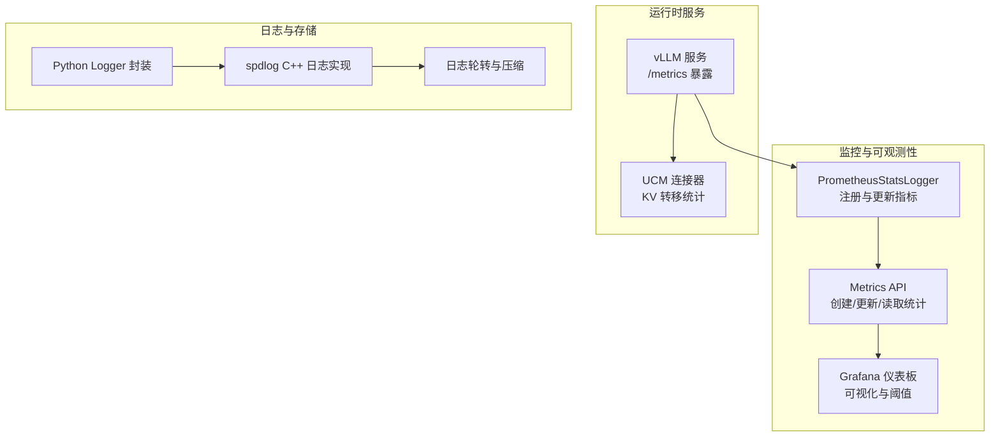
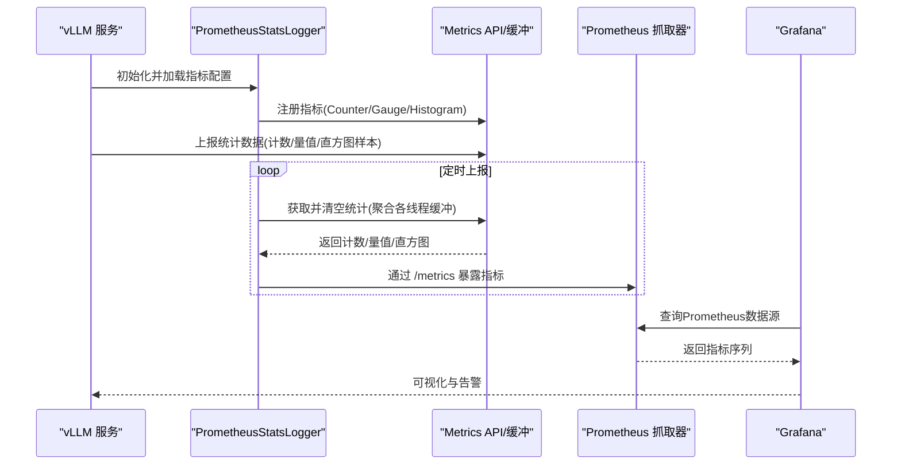
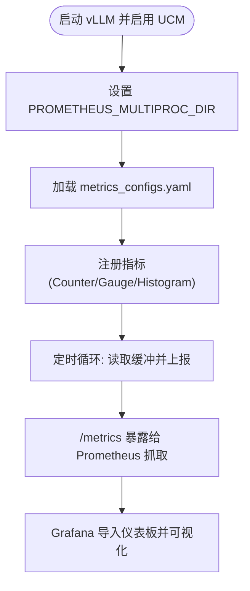
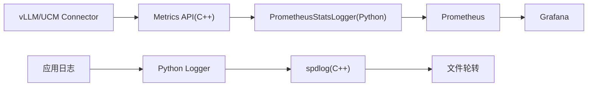

# 监控系统设置

<cite>
**本文引用的文件**
- [docs/用户指南/指标/metrics.md](file://docs/source/user-guide/metrics/metrics.md)
- [examples/metrics/metrics_configs.yaml](file://examples/metrics/metrics_configs.yaml)
- [examples/metrics/grafana.json](file://examples/metrics/grafana.json)
- [ucm/observability.py](file://ucm/observability.py)
- [ucm/shared/metrics/cc/api/metrics_api.h](file://ucm/shared/metrics/cc/api/metrics_api.h)
- [ucm/shared/metrics/cc/domain/metrics.h](file://ucm/shared/metrics/cc/domain/metrics.h)
- [ucm/shared/metrics/cc/domain/metrics.cc](file://ucm/shared/metrics/cc/domain/metrics.cc)
- [ucm/shared/metrics/cpy/metrics.py.cc](file://ucm/shared/metrics/cpy/metrics.py.cc)
- [ucm/logger.py](file://ucm/logger.py)
- [ucm/shared/infra/logger/cc/spdlog_logger.h](file://ucm/shared/infra/logger/cc/spdlog_logger.h)
- [ucm/shared/infra/logger/cc/spdlog_logger.cc](file://ucm/shared/infra/logger/cc/spdlog_logger.cc)
- [examples/deployments/scripts/vllm/run_vllm.sh](file://examples/deployments/scripts/vllm/run_vllm.sh)
- [docs/source/user-guide/prefix-cache/pipeline_store.md](file://docs/source/user-guide/prefix-cache/pipeline_store.md)
- [benchmarks/logging_perf_test.py](file://benchmarks/logging_perf_test.py)
</cite>

## 目录
1. [简介](#简介)
2. [项目结构](#项目结构)
3. [核心组件](#核心组件)
4. [架构总览](#架构总览)
5. [详细组件分析](#详细组件分析)
6. [依赖关系分析](#依赖关系分析)
7. [性能与容量规划](#性能与容量规划)
8. [故障排查指南](#故障排查指南)
9. [结论](#结论)
10. [附录](#附录)

## 简介
本指南面向运维与开发人员，提供UCM（Unified Cache Management）监控系统的完整设置与使用说明。内容涵盖：
- Prometheus指标采集配置：指标类型、标签、抓取间隔与端点暴露
- Grafana仪表板导入与自定义：关键KPI可视化与阈值建议
- 告警规则与阈值：基于指标趋势与异常的告警建议
- 日志聚合与分析：日志轮转、格式与采集建议
- 存储策略与保留周期：Prometheus与日志的保留与清理
- 扩展性与高可用：多实例、分布式抓取与数据持久化
- 指标解读与性能分析：如何从指标洞察系统瓶颈

## 项目结构
与监控相关的关键位置如下：
- 文档与示例：docs/source/user-guide/metrics/metrics.md、examples/metrics/*
- 运行时监控：ucm/observability.py、ucm/shared/metrics/*
- 日志系统：ucm/logger.py、ucm/shared/infra/logger/*
- 部署脚本：examples/deployments/scripts/vllm/run_vllm.sh
- 存储与管道：docs/source/user-guide/prefix-cache/pipeline_store.md

图表来源
- [ucm/observability.py](file://ucm/observability.py#L60-L197)
- [ucm/shared/metrics/cc/api/metrics_api.h](file://ucm/shared/metrics/cc/api/metrics_api.h#L30-L42)
- [ucm/shared/metrics/cc/domain/metrics.h](file://ucm/shared/metrics/cc/domain/metrics.h#L72-L120)
- [ucm/shared/metrics/cc/domain/metrics.cc](file://ucm/shared/metrics/cc/domain/metrics.cc#L32-L117)
- [ucm/logger.py](file://ucm/logger.py#L40-L72)
- [ucm/shared/infra/logger/cc/spdlog_logger.h](file://ucm/shared/infra/logger/cc/spdlog_logger.h#L38-L78)
- [ucm/shared/infra/logger/cc/spdlog_logger.cc](file://ucm/shared/infra/logger/cc/spdlog_logger.cc#L47-L94)

章节来源
- [docs/用户指南/指标/metrics.md](file://docs/source/user-guide/metrics/metrics.md#L1-L189)
- [examples/metrics/metrics_configs.yaml](file://examples/metrics/metrics_configs.yaml#L1-L51)
- [examples/metrics/grafana.json](file://examples/metrics/grafana.json#L1-L1025)
- [ucm/observability.py](file://ucm/observability.py#L60-L197)
- [ucm/shared/metrics/cc/api/metrics_api.h](file://ucm/shared/metrics/cc/api/metrics_api.h#L30-L42)
- [ucm/shared/metrics/cc/domain/metrics.h](file://ucm/shared/metrics/cc/domain/metrics.h#L72-L120)
- [ucm/shared/metrics/cc/domain/metrics.cc](file://ucm/shared/metrics/cc/domain/metrics.cc#L32-L117)
- [ucm/logger.py](file://ucm/logger.py#L40-L72)
- [ucm/shared/infra/logger/cc/spdlog_logger.h](file://ucm/shared/infra/logger/cc/spdlog_logger.h#L38-L78)
- [ucm/shared/infra/logger/cc/spdlog_logger.cc](file://ucm/shared/infra/logger/cc/spdlog_logger.cc#L47-L94)
- [examples/deployments/scripts/vllm/run_vllm.sh](file://examples/deployments/scripts/vllm/run_vllm.sh#L1-L116)
- [docs/source/user-guide/prefix-cache/pipeline_store.md](file://docs/source/user-guide/prefix-cache/pipeline_store.md#L65-L95)

## 核心组件
- PrometheusStatsLogger：负责加载指标配置、注册Prometheus指标、按标签维度更新并定期上报
- Metrics API 与缓冲：在C++侧维护线程本地缓冲，支持Counter/Gauge/Histogram三类指标的创建与聚合
- Grafana 仪表板：提供9个关键面板，覆盖加载/保存/查找命中率等核心指标
- 日志系统：Python封装与C++ spdlog实现，支持轮转、异步写入与信号安全刷新

章节来源
- [ucm/observability.py](file://ucm/observability.py#L60-L197)
- [ucm/shared/metrics/cc/api/metrics_api.h](file://ucm/shared/metrics/cc/api/metrics_api.h#L30-L42)
- [ucm/shared/metrics/cc/domain/metrics.h](file://ucm/shared/metrics/cc/domain/metrics.h#L72-L120)
- [ucm/shared/metrics/cc/domain/metrics.cc](file://ucm/shared/metrics/cc/domain/metrics.cc#L32-L117)
- [examples/metrics/grafana.json](file://examples/metrics/grafana.json#L1-L1025)
- [ucm/logger.py](file://ucm/logger.py#L40-L72)
- [ucm/shared/infra/logger/cc/spdlog_logger.h](file://ucm/shared/infra/logger/cc/spdlog_logger.h#L38-L78)
- [ucm/shared/infra/logger/cc/spdlog_logger.cc](file://ucm/shared/infra/logger/cc/spdlog_logger.cc#L47-L94)

## 架构总览
下图展示了从vLLM到Prometheus再到Grafana的完整链路，以及指标生成与日志落盘路径。

图表来源
- [ucm/observability.py](file://ucm/observability.py#L60-L197)
- [ucm/shared/metrics/cc/api/metrics_api.h](file://ucm/shared/metrics/cc/api/metrics_api.h#L30-L42)
- [ucm/shared/metrics/cc/domain/metrics.h](file://ucm/shared/metrics/cc/domain/metrics.h#L72-L120)
- [ucm/shared/metrics/cc/domain/metrics.cc](file://ucm/shared/metrics/cc/domain/metrics.cc#L32-L117)
- [docs/用户指南/指标/metrics.md](file://docs/source/user-guide/metrics/metrics.md#L100-L122)

## 详细组件分析

### Prometheus 指标采集与配置
- 指标前缀与命名：统一以“ucm:”为前缀，便于在Grafana中筛选与聚合
- 指标类型与用途
  - 计数器（Counter）：累计事件次数，如请求总数
  - 量表（Gauge）：瞬时数值，如命中率
  - 直方图（Histogram）：采样分布，如耗时、速度、块数量
- 标签维度：模型名与工作进程ID，用于区分多实例与多模型场景
- 抓取间隔：默认5秒，可在Prometheus配置中调整
- 多进程模式：通过PROMETHEUS_MULTIPROC_DIR目录与轮询清空机制保证多进程一致性

图表来源
- [docs/用户指南/指标/metrics.md](file://docs/source/user-guide/metrics/metrics.md#L11-L19)
- [examples/metrics/metrics_configs.yaml](file://examples/metrics/metrics_configs.yaml#L1-L51)
- [ucm/observability.py](file://ucm/observability.py#L60-L197)

章节来源
- [docs/用户指南/指标/metrics.md](file://docs/source/user-guide/metrics/metrics.md#L11-L19)
- [examples/metrics/metrics_configs.yaml](file://examples/metrics/metrics_configs.yaml#L1-L51)
- [ucm/observability.py](file://ucm/observability.py#L60-L197)

### Grafana 仪表板导入与自定义
- 导入步骤：添加Prometheus数据源 → 上传grafana.json → 选择数据源 → 导入完成
- 关键面板与指标
  - 查找命中率：interval_lookup_hit_rates
  - 加载/保存请求与块数：load/save_requests_num、load/save_blocks_num
  - 加载/保存耗时与速度：load/save_duration、load/save_speed
- 自定义建议
  - 为不同模型与工作进程设置变量与过滤器
  - 为关键指标设置阈值与告警规则（见“告警规则与阈值”）
  - 使用分位数（P50/P90/P95/P99）辅助定位尾部延迟

章节来源
- [docs/用户指南/指标/metrics.md](file://docs/source/user-guide/metrics/metrics.md#L125-L149)
- [examples/metrics/grafana.json](file://examples/metrics/grafana.json#L1-L1025)

### 监控告警规则与阈值建议
以下为基于仪表板指标的通用告警建议（阈值需结合业务基线与SLA调整）：
- 查找命中率骤降：若近5分钟平均低于阈值，触发“缓存失效/预热不足”告警
- 加载/保存耗时突增：P95/P99显著升高，可能指示存储或网络瓶颈
- 加载/保存速度异常低：持续低于阈值，提示带宽或磁盘IO问题
- 请求/块数异常波动：突发峰值或持续高位，需检查上游流量与批处理参数

章节来源
- [examples/metrics/grafana.json](file://examples/metrics/grafana.json#L1-L1025)

### 日志聚合与分析
- 日志轮转与大小：支持按最大文件数与单文件大小控制
- 日志级别与格式：支持环境变量动态调整级别，格式包含时间戳、模块、等级、消息与上下文
- 推荐实践
  - 将日志输出到标准输出与轮转文件，配合集中式日志系统（如Fluent Bit/Fluentd/Vector）采集
  - 对关键错误与致命信号进行特殊标记，便于告警与检索
  - 结合Prometheus与Grafana对日志量与错误率进行关联分析

章节来源
- [ucm/logger.py](file://ucm/logger.py#L40-L72)
- [ucm/shared/infra/logger/cc/spdlog_logger.h](file://ucm/shared/infra/logger/cc/spdlog_logger.h#L38-L78)
- [ucm/shared/infra/logger/cc/spdlog_logger.cc](file://ucm/shared/infra/logger/cc/spdlog_logger.cc#L47-L94)
- [benchmarks/logging_perf_test.py](file://benchmarks/logging_perf_test.py#L1-L46)

### 监控数据存储策略与保留周期
- Prometheus
  - 抓取间隔：建议5秒（可按负载调优）
  - 保留周期：根据历史分析需求与磁盘容量设定（例如7天/30天）
  - 存储目录：建议挂载独立磁盘，开启SSD以提升写入性能
- 日志
  - 文件大小与备份数：建议单文件不超过数MB，保留若干份以便回溯
  - 清理策略：结合外部日志系统进行归档与删除

章节来源
- [docs/用户指南/指标/metrics.md](file://docs/source/user-guide/metrics/metrics.md#L100-L122)
- [examples/metrics/metrics_configs.yaml](file://examples/metrics/metrics_configs.yaml#L1-L51)
- [ucm/shared/infra/logger/cc/spdlog_logger.cc](file://ucm/shared/infra/logger/cc/spdlog_logger.cc#L79-L94)

### 扩展性与高可用部署方案
- 多实例抓取
  - 在Prometheus中配置多个目标（多vLLM实例），使用标签区分模型与实例
- 分布式抓取
  - 使用Prometheus联邦或远程读写，汇聚多集群指标
- 高可用
  - Prometheus至少双实例+仲裁，Grafana反向代理+健康检查
  - UCM侧确保多进程模式下的指标一致性（已由多进程目录与缓冲切换机制保障）

章节来源
- [docs/用户指南/指标/metrics.md](file://docs/source/user-guide/metrics/metrics.md#L100-L122)
- [ucm/observability.py](file://ucm/observability.py#L73-L96)

### 指标解读与性能分析方法
- 查找命中率：关注短期波动与长期趋势，结合模型规模与预热策略
- 加载/保存耗时与速度：对比直方图分位数，定位尾部延迟根因（存储/网络/设备）
- 请求与块数：评估批处理效率与内存占用，避免过大批次导致抖动
- 建议流程
  - 识别异常指标 → 定位实例/模型/标签 → 回放日志与指标 → 优化参数或扩容

章节来源
- [examples/metrics/grafana.json](file://examples/metrics/grafana.json#L1-L1025)

## 依赖关系分析
- 指标生成链路
  - vLLM/UCM Connector → Metrics API（C++）→ PrometheusStatsLogger（Python）→ Prometheus → Grafana
- 日志链路
  - 应用日志 → Python Logger → C++ spdlog → 文件轮转

图表来源
- [ucm/observability.py](file://ucm/observability.py#L60-L197)
- [ucm/shared/metrics/cc/api/metrics_api.h](file://ucm/shared/metrics/cc/api/metrics_api.h#L30-L42)
- [ucm/shared/metrics/cc/domain/metrics.h](file://ucm/shared/metrics/cc/domain/metrics.h#L72-L120)
- [ucm/shared/metrics/cc/domain/metrics.cc](file://ucm/shared/metrics/cc/domain/metrics.cc#L32-L117)
- [ucm/logger.py](file://ucm/logger.py#L40-L72)
- [ucm/shared/infra/logger/cc/spdlog_logger.h](file://ucm/shared/infra/logger/cc/spdlog_logger.h#L38-L78)
- [ucm/shared/infra/logger/cc/spdlog_logger.cc](file://ucm/shared/infra/logger/cc/spdlog_logger.cc#L47-L94)

章节来源
- [ucm/observability.py](file://ucm/observability.py#L60-L197)
- [ucm/shared/metrics/cc/api/metrics_api.h](file://ucm/shared/metrics/cc/api/metrics_api.h#L30-L42)
- [ucm/shared/metrics/cc/domain/metrics.h](file://ucm/shared/metrics/cc/domain/metrics.h#L72-L120)
- [ucm/shared/metrics/cc/domain/metrics.cc](file://ucm/shared/metrics/cc/domain/metrics.cc#L32-L117)
- [ucm/logger.py](file://ucm/logger.py#L40-L72)
- [ucm/shared/infra/logger/cc/spdlog_logger.h](file://ucm/shared/infra/logger/cc/spdlog_logger.h#L38-L78)
- [ucm/shared/infra/logger/cc/spdlog_logger.cc](file://ucm/shared/infra/logger/cc/spdlog_logger.cc#L47-L94)

## 性能与容量规划
- 抓取频率与资源
  - 更短抓取间隔会增加Prometheus查询压力；建议从5秒起步，结合CPU/内存与磁盘IOPS调优
- 直方图样本管理
  - histogram_max_length限制直方图样本长度，避免内存膨胀；建议按模型规模与吞吐量评估
- 日志容量
  - 合理设置单文件大小与备份数，结合外部归档降低本地压力

章节来源
- [examples/metrics/metrics_configs.yaml](file://examples/metrics/metrics_configs.yaml#L1-L51)
- [ucm/shared/metrics/cc/domain/metrics.h](file://ucm/shared/metrics/cc/domain/metrics.h#L104-L117)

## 故障排查指南
- 指标未显示
  - 确认vLLM已启用/UCM连接器已配置，且Prometheus能访问/vllm:8000/metrics
  - 检查PROMETHEUS_MULTIPROC_DIR是否存在且有权限
- Grafana无法查询
  - 确认数据源URL正确（容器内可使用服务名），保存后测试“查询Prometheus API”
- 指标名称不匹配
  - 确认指标前缀与配置一致（ucm:），并在Grafana中使用相同前缀过滤
- 日志异常
  - 检查日志轮转参数与目录权限，确认信号处理与刷新逻辑正常

章节来源
- [docs/用户指南/指标/metrics.md](file://docs/source/user-guide/metrics/metrics.md#L11-L19)
- [docs/用户指南/指标/metrics.md](file://docs/source/user-guide/metrics/metrics.md#L125-L149)
- [ucm/observability.py](file://ucm/observability.py#L73-L96)
- [ucm/shared/infra/logger/cc/spdlog_logger.cc](file://ucm/shared/infra/logger/cc/spdlog_logger.cc#L79-L94)

## 结论
通过本文档，您可以在UCM环境中快速搭建Prometheus+Grafana监控体系，并结合日志系统实现全链路可观测性。建议以5秒抓取间隔起步，逐步优化直方图样本长度与保留周期，同时建立针对关键指标的告警与阈值策略，持续迭代以适配业务增长与复杂度提升。

## 附录

### A. 指标清单与含义
- 加载操作指标：请求数、块数、耗时（毫秒）、速度（GB/s）
- 保存操作指标：请求数、块数、耗时（毫秒）、速度（GB/s）
- 查找命中率指标：区间命中率

章节来源
- [docs/用户指南/指标/metrics.md](file://docs/source/user-guide/metrics/metrics.md#L151-L169)

### B. UCM 存储与管道参考
- 管道存储示例：Cache|Posix 管道，用于设备与持久存储之间的数据传输
- 参数说明：存储后端路径、块大小、传输参数等

章节来源
- [docs/source/user-guide/prefix-cache/pipeline_store.md](file://docs/source/user-guide/prefix-cache/pipeline_store.md#L65-L95)