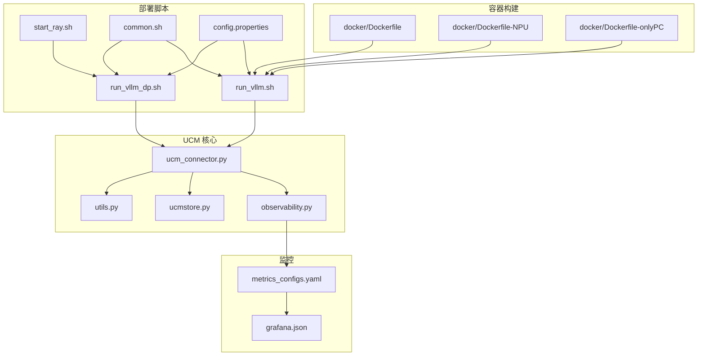
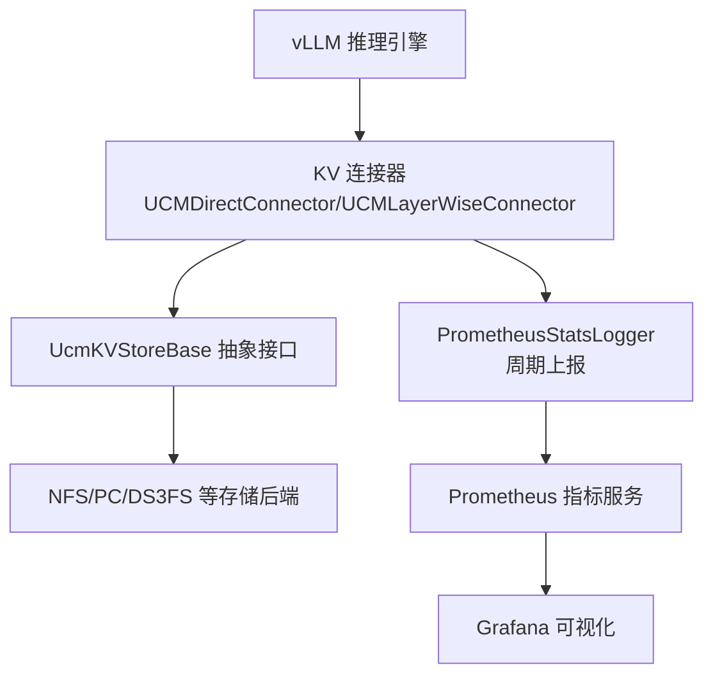
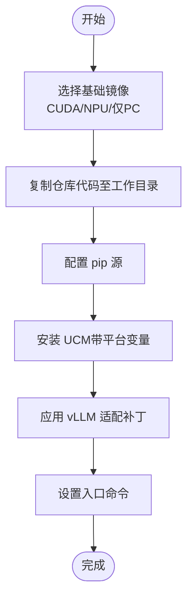
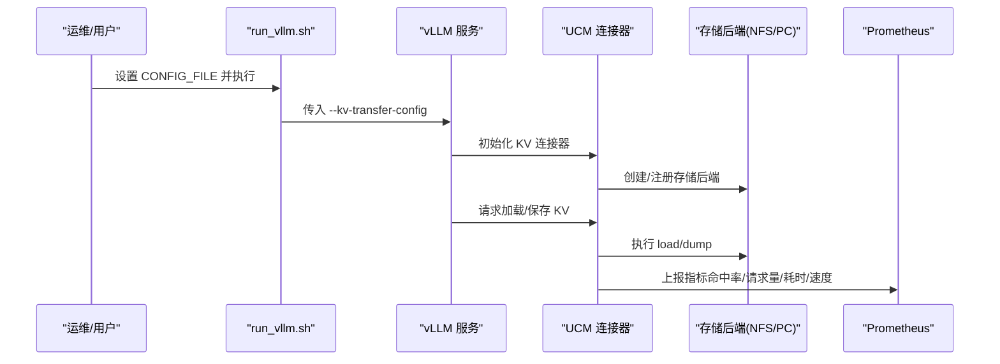
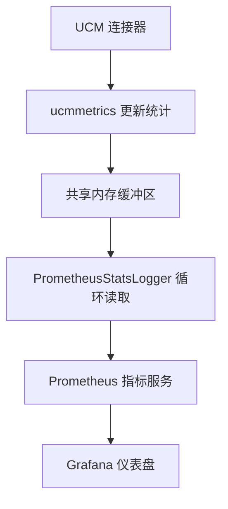
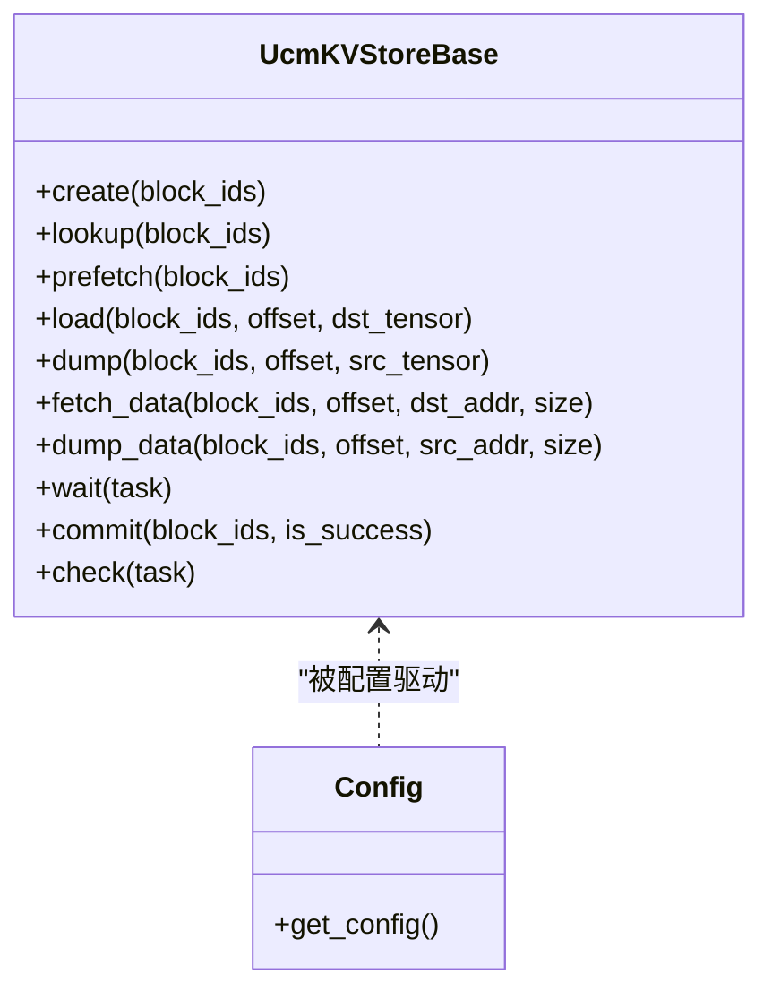
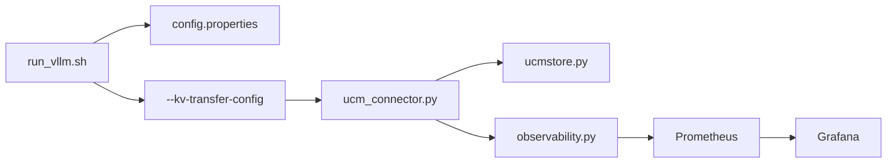

# 部署指南

<cite>
**本文引用的文件**
- [docker/Dockerfile](file://docker/Dockerfile)
- [docker/Dockerfile-NPU](file://docker/Dockerfile-NPU)
- [docker/Dockerfile-onlyPC](file://docker/Dockerfile-onlyPC)
- [examples/deployments/scripts/vllm/run_vllm.sh](file://examples/deployments/scripts/vllm/run_vllm.sh)
- [examples/deployments/scripts/vllm/run_vllm_dp.sh](file://examples/deployments/scripts/vllm/run_vllm_dp.sh)
- [examples/deployments/scripts/vllm/start_ray.sh](file://examples/deployments/scripts/vllm/start_ray.sh)
- [examples/deployments/scripts/vllm/common.sh](file://examples/deployments/scripts/vllm/common.sh)
- [examples/deployments/scripts/vllm/config.properties](file://examples/deployments/scripts/vllm/config.properties)
- [examples/metrics/metrics_configs.yaml](file://examples/metrics/metrics_configs.yaml)
- [examples/metrics/grafana.json](file://examples/metrics/grafana.json)
- [examples/ucm_config_example.yaml](file://examples/ucm_config_example.yaml)
- [ucm/integration/vllm/ucm_connector.py](file://ucm/integration/vllm/ucm_connector.py)
- [ucm/observability.py](file://ucm/observability.py)
- [ucm/store/ucmstore.py](file://ucm/store/ucmstore.py)
- [ucm/utils.py](file://ucm/utils.py)
- [test/runner-docker/Dockerfile](file://test/runner-docker/Dockerfile)
</cite>

## 目录
1. [简介](#简介)
2. [项目结构](#项目结构)
3. [核心组件](#核心组件)
4. [架构总览](#架构总览)
5. [详细组件分析](#详细组件分析)
6. [依赖关系分析](#依赖关系分析)
7. [性能考虑](#性能考虑)
8. [故障排除指南](#故障排除指南)
9. [结论](#结论)
10. [附录](#附录)

## 简介
本指南面向在生产环境中部署统一缓存管理（Unified Cache Management，简称 UCM）与 vLLM 的工程团队，提供从容器化构建到运行时配置、监控与可视化、故障排除、性能调优与高可用部署的完整方案。文档重点覆盖：
- 基于 Docker 的多镜像构建策略：基础 CUDA 镜像、NPU 专用镜像与仅 PC 镜像
- 生产级部署配置：资源、网络、存储挂载与多节点数据并行
- 监控体系：Prometheus 指标采集与 Grafana 可视化
- 故障排除与常见问题
- 性能调优与高可用、负载均衡建议
- 安全配置与访问控制

## 项目结构
与部署密切相关的目录与文件：
- docker：Dockerfile 多阶段构建模板，支持 CUDA/NPU/仅PC场景
- examples/deployments/scripts/vllm：启动脚本与配置模板，涵盖单机/多机、Ray 后端、UCM 连接器启用
- examples/metrics：Prometheus 指标配置与 Grafana 仪表盘 JSON
- examples/ucm_config_example.yaml：UCM 存储后端与可选稀疏注意力配置示例
- ucm/integration/vllm：UCM vLLM 连接器实现，负责 KV 缓存加载/保存与指标上报
- ucm/observability.py：基于 YAML 的 PrometheusStatsLogger，周期性上报指标
- ucm/store：抽象 KV 存储接口与工厂，支撑多种后端（NFS、PC、DS3FS 等）
- ucm/utils.py：从 KV 转发配置中解析 UCM 配置
- test/runner-docker：用于流水线测试的 Runner 镜像（可复用为部署参考）

**图表来源**
- [docker/Dockerfile](file://docker/Dockerfile#L1-L20)
- [docker/Dockerfile-NPU](file://docker/Dockerfile-NPU#L1-L25)
- [docker/Dockerfile-onlyPC](file://docker/Dockerfile-onlyPC#L1-L16)
- [examples/deployments/scripts/vllm/run_vllm.sh](file://examples/deployments/scripts/vllm/run_vllm.sh#L1-L116)
- [examples/deployments/scripts/vllm/run_vllm_dp.sh](file://examples/deployments/scripts/vllm/run_vllm_dp.sh#L1-L153)
- [examples/deployments/scripts/vllm/start_ray.sh](file://examples/deployments/scripts/vllm/start_ray.sh#L1-L57)
- [examples/deployments/scripts/vllm/common.sh](file://examples/deployments/scripts/vllm/common.sh#L1-L79)
- [examples/deployments/scripts/vllm/config.properties](file://examples/deployments/scripts/vllm/config.properties#L1-L92)
- [examples/metrics/metrics_configs.yaml](file://examples/metrics/metrics_configs.yaml#L1-L51)
- [examples/metrics/grafana.json](file://examples/metrics/grafana.json#L1-L1025)
- [ucm/integration/vllm/ucm_connector.py](file://ucm/integration/vllm/ucm_connector.py#L1-L1080)
- [ucm/observability.py](file://ucm/observability.py#L1-L197)
- [ucm/store/ucmstore.py](file://ucm/store/ucmstore.py#L1-L205)
- [ucm/utils.py](file://ucm/utils.py#L1-L91)

**章节来源**
- [docker/Dockerfile](file://docker/Dockerfile#L1-L20)
- [docker/Dockerfile-NPU](file://docker/Dockerfile-NPU#L1-L25)
- [docker/Dockerfile-onlyPC](file://docker/Dockerfile-onlyPC#L1-L16)
- [examples/deployments/scripts/vllm/run_vllm.sh](file://examples/deployments/scripts/vllm/run_vllm.sh#L1-L116)
- [examples/deployments/scripts/vllm/run_vllm_dp.sh](file://examples/deployments/scripts/vllm/run_vllm_dp.sh#L1-L153)
- [examples/deployments/scripts/vllm/start_ray.sh](file://examples/deployments/scripts/vllm/start_ray.sh#L1-L57)
- [examples/deployments/scripts/vllm/common.sh](file://examples/deployments/scripts/vllm/common.sh#L1-L79)
- [examples/deployments/scripts/vllm/config.properties](file://examples/deployments/scripts/vllm/config.properties#L1-L92)
- [examples/metrics/metrics_configs.yaml](file://examples/metrics/metrics_configs.yaml#L1-L51)
- [examples/metrics/grafana.json](file://examples/metrics/grafana.json#L1-L1025)
- [examples/ucm_config_example.yaml](file://examples/ucm_config_example.yaml#L1-L39)
- [ucm/integration/vllm/ucm_connector.py](file://ucm/integration/vllm/ucm_connector.py#L1-L1080)
- [ucm/observability.py](file://ucm/observability.py#L1-L197)
- [ucm/store/ucmstore.py](file://ucm/store/ucmstore.py#L1-L205)
- [ucm/utils.py](file://ucm/utils.py#L1-L91)

## 核心组件
- 容器镜像与构建
  - CUDA 基础镜像：安装 UCM 并应用 vLLM 适配补丁，适用于 NVIDIA GPU 场景
  - NPU 专用镜像：针对 Ascend 设备，设置平台变量与库路径，应用 vLLM 与 Ascend 适配补丁
  - 仅 PC 镜像：不启用稀疏功能，适合纯 PC 场景
- vLLM 启动脚本
  - 单机/多机模式：通过 config.properties 与 run_vllm.sh/run_vllm_dp.sh 控制参数
  - Ray 后端：start_ray.sh 启动 head/worker 节点，配合分布式执行后端
  - KV 连接器：通过 --kv-transfer-config 注入 UCM 连接器与额外配置
- 监控与可视化
  - Prometheus 指标：基于 metrics_configs.yaml 配置计数器/直方图等指标
  - Grafana 仪表盘：grafana.json 提供按 worker 维度聚合的加载/保存速率与命中率面板
- UCM 连接器与存储
  - UCMDirectConnector/UCMLayerWiseConnector：负责请求哈希、块调度、加载/保存任务与等待
  - PrometheusStatsLogger：周期性从共享内存读取统计并上报
  - UcmKVStoreBase：抽象存储接口，支持 create/lookup/load/dump/wait/commit 等操作
  - Config：从 KV 转发配置中解析 UCM 配置文件或内联配置

**章节来源**
- [docker/Dockerfile](file://docker/Dockerfile#L1-L20)
- [docker/Dockerfile-NPU](file://docker/Dockerfile-NPU#L1-L25)
- [docker/Dockerfile-onlyPC](file://docker/Dockerfile-onlyPC#L1-L16)
- [examples/deployments/scripts/vllm/run_vllm.sh](file://examples/deployments/scripts/vllm/run_vllm.sh#L1-L116)
- [examples/deployments/scripts/vllm/run_vllm_dp.sh](file://examples/deployments/scripts/vllm/run_vllm_dp.sh#L1-L153)
- [examples/deployments/scripts/vllm/start_ray.sh](file://examples/deployments/scripts/vllm/start_ray.sh#L1-L57)
- [examples/metrics/metrics_configs.yaml](file://examples/metrics/metrics_configs.yaml#L1-L51)
- [examples/metrics/grafana.json](file://examples/metrics/grafana.json#L1-L1025)
- [ucm/integration/vllm/ucm_connector.py](file://ucm/integration/vllm/ucm_connector.py#L1-L1080)
- [ucm/observability.py](file://ucm/observability.py#L1-L197)
- [ucm/store/ucmstore.py](file://ucm/store/ucmstore.py#L1-L205)
- [ucm/utils.py](file://ucm/utils.py#L1-L91)

## 架构总览
下图展示 UCM 在 vLLM 推理链路中的位置与数据流：vLLM 通过 KV 连接器与 UCM 交互，UCM 通过存储后端（如 NFS）进行外部 KV 缓存的加载/保存；同时，连接器将统计信息写入共享内存，由 PrometheusStatsLogger 周期性上报 Prometheus。

**图表来源**
- [ucm/integration/vllm/ucm_connector.py](file://ucm/integration/vllm/ucm_connector.py#L1-L1080)
- [ucm/observability.py](file://ucm/observability.py#L1-L197)
- [ucm/store/ucmstore.py](file://ucm/store/ucmstore.py#L1-L205)
- [examples/metrics/metrics_configs.yaml](file://examples/metrics/metrics_configs.yaml#L1-L51)
- [examples/metrics/grafana.json](file://examples/metrics/grafana.json#L1-L1025)

## 详细组件分析

### 容器化与多阶段构建
- CUDA 基础镜像
  - 基于官方 vLLm 镜像，设置索引源，安装 UCM 并应用 vLLM 适配补丁
  - 入口为 bash，便于交互式调试
- NPU 专用镜像
  - 基于 Ascend vLLM 镜像，设置 Ascend 库路径与平台变量，安装 UCM 并应用 vLLM 与 Ascend 适配补丁
- 仅 PC 镜像
  - 不启用稀疏功能，适合纯 PC 场景

**图表来源**
- [docker/Dockerfile](file://docker/Dockerfile#L1-L20)
- [docker/Dockerfile-NPU](file://docker/Dockerfile-NPU#L1-L25)
- [docker/Dockerfile-onlyPC](file://docker/Dockerfile-onlyPC#L1-L16)

**章节来源**
- [docker/Dockerfile](file://docker/Dockerfile#L1-L20)
- [docker/Dockerfile-NPU](file://docker/Dockerfile-NPU#L1-L25)
- [docker/Dockerfile-onlyPC](file://docker/Dockerfile-onlyPC#L1-L16)

### vLLM 启动与 KV 连接器集成
- 单机/多机模式
  - run_vllm.sh：根据 config.properties 动态拼装 vllm serve 参数，支持前缀缓存、异步调度、图模式、推测解码等
  - run_vllm_dp.sh：多节点数据并行，设置 HCCL/NCCL/Gloo 接口与 RPC 端口，支持 --headless 工作节点
  - start_ray.sh：根据 NODE 角色启动 Ray head/worker，设置 GPU 数量与可见设备
- KV 连接器注入
  - 通过 --kv-transfer-config 注入 UCMConnector，并携带 UCM_CONFIG_FILE 等额外配置
  - 连接器在注册 KV 缓存时根据配置创建存储后端（如 NFS），并初始化指标记录器

**图表来源**
- [examples/deployments/scripts/vllm/run_vllm.sh](file://examples/deployments/scripts/vllm/run_vllm.sh#L1-L116)
- [examples/deployments/scripts/vllm/run_vllm_dp.sh](file://examples/deployments/scripts/vllm/run_vllm_dp.sh#L1-L153)
- [examples/deployments/scripts/vllm/start_ray.sh](file://examples/deployments/scripts/vllm/start_ray.sh#L1-L57)
- [ucm/integration/vllm/ucm_connector.py](file://ucm/integration/vllm/ucm_connector.py#L1-L1080)

**章节来源**
- [examples/deployments/scripts/vllm/run_vllm.sh](file://examples/deployments/scripts/vllm/run_vllm.sh#L1-L116)
- [examples/deployments/scripts/vllm/run_vllm_dp.sh](file://examples/deployments/scripts/vllm/run_vllm_dp.sh#L1-L153)
- [examples/deployments/scripts/vllm/start_ray.sh](file://examples/deployments/scripts/vllm/start_ray.sh#L1-L57)
- [examples/deployments/scripts/vllm/config.properties](file://examples/deployments/scripts/vllm/config.properties#L1-L92)
- [ucm/integration/vllm/ucm_connector.py](file://ucm/integration/vllm/ucm_connector.py#L1-L1080)

### 监控系统：Prometheus 与 Grafana
- 指标配置
  - metrics_configs.yaml：定义日志间隔、多进程目录、指标前缀与直方图桶
  - 支持计数器/仪表板/直方图三类指标，覆盖加载/保存的请求数、块数、耗时与速度
- 指标采集
  - PrometheusStatsLogger：从共享内存读取统计，按标签（模型名、worker_id）上报
  - UCM 连接器在加载/保存阶段更新直方图与计数器
- 可视化
  - grafana.json：提供按 worker 聚合的命中率、请求数、块数、耗时与速度面板

**图表来源**
- [ucm/observability.py](file://ucm/observability.py#L1-L197)
- [examples/metrics/metrics_configs.yaml](file://examples/metrics/metrics_configs.yaml#L1-L51)
- [examples/metrics/grafana.json](file://examples/metrics/grafana.json#L1-L1025)
- [ucm/integration/vllm/ucm_connector.py](file://ucm/integration/vllm/ucm_connector.py#L1-L1080)

**章节来源**
- [ucm/observability.py](file://ucm/observability.py#L1-L197)
- [examples/metrics/metrics_configs.yaml](file://examples/metrics/metrics_configs.yaml#L1-L51)
- [examples/metrics/grafana.json](file://examples/metrics/grafana.json#L1-L1025)
- [ucm/integration/vllm/ucm_connector.py](file://ucm/integration/vllm/ucm_connector.py#L1-L1080)

### 存储后端与工厂
- UcmKVStoreBase：定义创建、查找、预取、加载、保存、等待、提交等抽象接口
- Config：从 KV 转发配置中解析 UCM 配置文件路径或内联配置，默认回退到 NFS 连接器
- 示例配置：ucm_config_example.yaml 展示如何指定存储后端与是否启用指标

**图表来源**
- [ucm/store/ucmstore.py](file://ucm/store/ucmstore.py#L1-L205)
- [ucm/utils.py](file://ucm/utils.py#L1-L91)
- [examples/ucm_config_example.yaml](file://examples/ucm_config_example.yaml#L1-L39)

**章节来源**
- [ucm/store/ucmstore.py](file://ucm/store/ucmstore.py#L1-L205)
- [ucm/utils.py](file://ucm/utils.py#L1-L91)
- [examples/ucm_config_example.yaml](file://examples/ucm_config_example.yaml#L1-L39)

## 依赖关系分析
- 组件耦合
  - run_vllm.sh/run_vllm_dp.sh 依赖 common.sh 获取网络接口与 IP 映射
  - UCM 连接器依赖存储工厂创建具体后端实例
  - PrometheusStatsLogger 依赖 metrics_configs.yaml 与 ucmmetrics 共享内存
- 外部依赖
  - vLLM 镜像与补丁
  - Prometheus 与 Grafana 服务
  - 存储后端（NFS/PC/DS3FS 等）

**图表来源**
- [examples/deployments/scripts/vllm/run_vllm.sh](file://examples/deployments/scripts/vllm/run_vllm.sh#L1-L116)
- [examples/deployments/scripts/vllm/config.properties](file://examples/deployments/scripts/vllm/config.properties#L1-L92)
- [ucm/integration/vllm/ucm_connector.py](file://ucm/integration/vllm/ucm_connector.py#L1-L1080)
- [ucm/observability.py](file://ucm/observability.py#L1-L197)
- [ucm/store/ucmstore.py](file://ucm/store/ucmstore.py#L1-L205)

**章节来源**
- [examples/deployments/scripts/vllm/run_vllm.sh](file://examples/deployments/scripts/vllm/run_vllm.sh#L1-L116)
- [examples/deployments/scripts/vllm/config.properties](file://examples/deployments/scripts/vllm/config.properties#L1-L92)
- [ucm/integration/vllm/ucm_connector.py](file://ucm/integration/vllm/ucm_connector.py#L1-L1080)
- [ucm/observability.py](file://ucm/observability.py#L1-L197)
- [ucm/store/ucmstore.py](file://ucm/store/ucmstore.py#L1-L205)

## 性能考虑
- 指标维度与阈值
  - Grafana 面板已内置阈值与单位（毫秒、GB/s），可据此快速定位异常
  - 关注加载/保存的请求数、块数、耗时与速度，结合命中率评估缓存效果
- 参数优化建议
  - 图模式与前缀缓存：在 run_vllm.sh 中按需开启 graph_mode 与 enable_prefix_caching
  - 异步调度：在多请求场景下提升吞吐
  - 推测解码：在满足准确性的前提下提升生成速度
  - 数据并行：run_vllm_dp.sh 中合理设置 dp_size、dp_size_local 与 RPC 端口
- 存储后端
  - NFS/PC/DS3FS 等后端的 IO 特性不同，建议在预估吞吐与延迟目标下进行基准测试

[本节为通用性能建议，无需特定文件引用]

## 故障排除指南
- 网络接口识别失败
  - common.sh 会尝试安装 net-tools 并通过 ifconfig 获取接口；若失败，回退到 eth0
  - 建议手动检查网络配置与防火墙
- UCM 配置未生效
  - 确认 config.properties 中 ucm_enable=true 且 ucm_config_yaml_path 指向有效路径
  - 检查 UCM 配置文件格式与字段正确性
- 加载/保存错误
  - 连接器在加载/保存阶段捕获异常并记录错误，可通过日志与 invalid_block_ids 列表定位问题
- Ray 启动失败
  - start_ray.sh 会打印节点角色与接口信息；确认 master/worker IP 与端口可达

**章节来源**
- [examples/deployments/scripts/vllm/common.sh](file://examples/deployments/scripts/vllm/common.sh#L1-L79)
- [examples/deployments/scripts/vllm/config.properties](file://examples/deployments/scripts/vllm/config.properties#L1-L92)
- [ucm/integration/vllm/ucm_connector.py](file://ucm/integration/vllm/ucm_connector.py#L1-L1080)
- [examples/deployments/scripts/vllm/start_ray.sh](file://examples/deployments/scripts/vllm/start_ray.sh#L1-L57)

## 结论
通过本指南，您可以在生产环境中完成 UCM 与 vLLM 的容器化部署，实现多节点数据并行推理、可观测性与可视化监控，并具备完善的故障排除与性能调优能力。建议在上线前完成基准测试与容量规划，确保存储后端与网络配置满足业务 SLA。

[本节为总结性内容，无需特定文件引用]

## 附录

### 生产环境部署清单
- 容器镜像
  - 选择 CUDA/NPU/仅PC 镜像之一，按硬件平台构建
- 配置文件
  - config.properties：设置模型、并行度、网络与 UCM 开关
  - ucm_config_example.yaml：配置存储后端与可选稀疏注意力
  - metrics_configs.yaml：配置指标类型与导出目录
- 启动流程
  - 单机：run_vllm.sh
  - 多机：start_ray.sh 启动 head/worker，run_vllm_dp.sh 启动 vLLM
- 监控
  - 启动 Prometheus 与 Grafana，导入 grafana.json

**章节来源**
- [docker/Dockerfile](file://docker/Dockerfile#L1-L20)
- [docker/Dockerfile-NPU](file://docker/Dockerfile-NPU#L1-L25)
- [docker/Dockerfile-onlyPC](file://docker/Dockerfile-onlyPC#L1-L16)
- [examples/deployments/scripts/vllm/run_vllm.sh](file://examples/deployments/scripts/vllm/run_vllm.sh#L1-L116)
- [examples/deployments/scripts/vllm/run_vllm_dp.sh](file://examples/deployments/scripts/vllm/run_vllm_dp.sh#L1-L153)
- [examples/deployments/scripts/vllm/start_ray.sh](file://examples/deployments/scripts/vllm/start_ray.sh#L1-L57)
- [examples/deployments/scripts/vllm/config.properties](file://examples/deployments/scripts/vllm/config.properties#L1-L92)
- [examples/ucm_config_example.yaml](file://examples/ucm_config_example.yaml#L1-L39)
- [examples/metrics/metrics_configs.yaml](file://examples/metrics/metrics_configs.yaml#L1-L51)
- [examples/metrics/grafana.json](file://examples/metrics/grafana.json#L1-L1025)