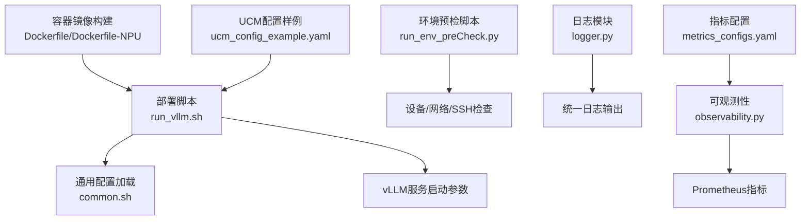
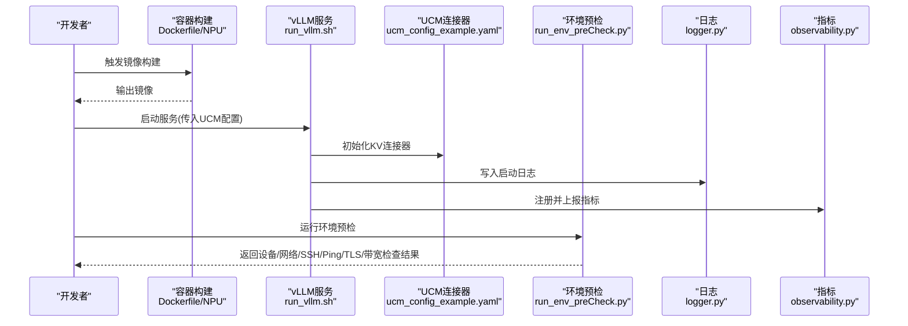
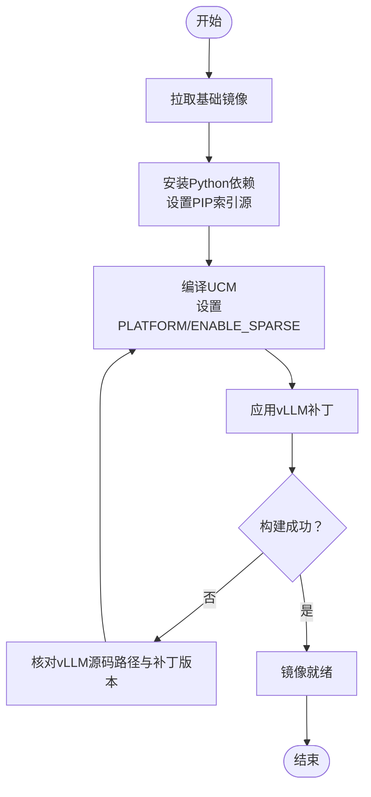
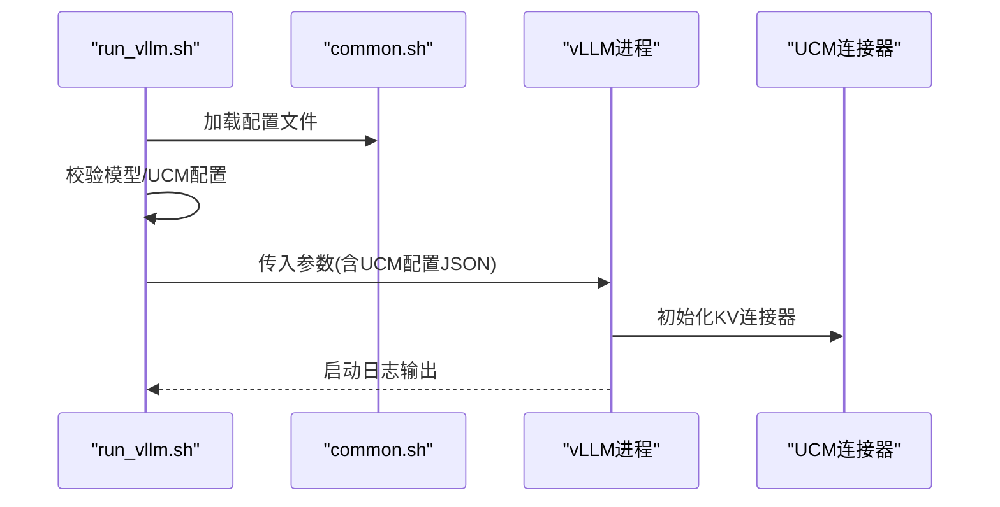
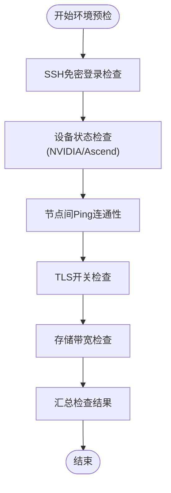
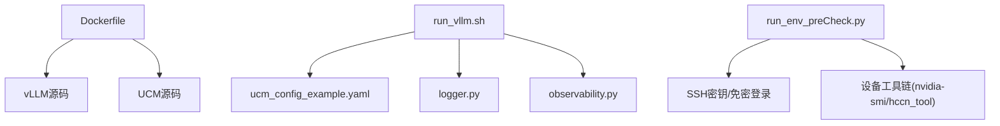

# 部署故障排除

<cite>
**本文引用的文件**
- [README.md](file://README.md)
- [Dockerfile](file://docker/Dockerfile)
- [Dockerfile-NPU](file://docker/Dockerfile-NPU)
- [run_vllm.sh](file://examples/deployments/scripts/vllm/run_vllm.sh)
- [common.sh](file://examples/deployments/scripts/vllm/common.sh)
- [quickstart_vllm.md](file://docs/source/getting-started/quickstart_vllm.md)
- [run_env_preCheck.py](file://test/common/envPreCheck/run_env_preCheck.py)
- [EnvPreCheck.md](file://test/common/doc/EnvPreCheck.md)
- [logger.py](file://ucm/logger.py)
- [observability.py](file://ucm/observability.py)
- [ucm_config_example.yaml](file://examples/ucm_config_example.yaml)
- [metrics_configs.yaml](file://examples/metrics/metrics_configs.yaml)
- [README.md](file://test/runner-docker/README.md)
</cite>

## 目录
1. [简介](#简介)
2. [项目结构](#项目结构)
3. [核心组件](#核心组件)
4. [架构总览](#架构总览)
5. [详细组件分析](#详细组件分析)
6. [依赖关系分析](#依赖关系分析)
7. [性能考虑](#性能考虑)
8. [故障排除指南](#故障排除指南)
9. [结论](#结论)
10. [附录](#附录)

## 简介
本指南面向UCM（Unified Cache Manager）在vLLM环境下的部署与运维，聚焦于常见部署问题的系统化诊断与解决，涵盖环境依赖、权限配置、网络连接、容器化构建与启动异常、日志与指标分析、性能诊断与优化、自动化环境检查脚本使用、社区支持与问题上报流程，以及预防性维护与健康检查最佳实践。文档结合仓库内现有脚本与配置，提供可操作的排障步骤与可视化图示。

## 项目结构
UCM与vLLM集成的部署相关文件主要分布在以下位置：
- 容器化：docker/Dockerfile 及 Dockerfile-NPU
- 启动脚本：examples/deployments/scripts/vllm/run_vllm.sh 与 common.sh
- 快速开始文档：docs/source/getting-started/quickstart_vllm.md
- 环境预检：test/common/envPreCheck/run_env_preCheck.py 与 test/common/doc/EnvPreCheck.md
- 日志与可观测性：ucm/logger.py 与 ucm/observability.py
- 配置样例：examples/ucm_config_example.yaml 与 examples/metrics/metrics_configs.yaml
- Runner容器：test/runner-docker/README.md

图表来源
- [run_vllm.sh](file://examples/deployments/scripts/vllm/run_vllm.sh#L1-L116)
- [common.sh](file://examples/deployments/scripts/vllm/common.sh#L1-L79)
- [Dockerfile](file://docker/Dockerfile#L1-L20)
- [Dockerfile-NPU](file://docker/Dockerfile-NPU#L1-L25)
- [run_env_preCheck.py](file://test/common/envPreCheck/run_env_preCheck.py#L1-L800)
- [logger.py](file://ucm/logger.py#L1-L84)
- [observability.py](file://ucm/observability.py#L1-L197)
- [ucm_config_example.yaml](file://examples/ucm_config_example.yaml#L1-L39)
- [metrics_configs.yaml](file://examples/metrics/metrics_configs.yaml#L1-L51)

章节来源
- [README.md](file://README.md#L1-L93)
- [quickstart_vllm.md](file://docs/source/getting-started/quickstart_vllm.md#L1-L237)

## 核心组件
- 容器镜像构建与补丁应用：通过Dockerfile/Dockerfile-NPU完成基础镜像选择、依赖安装、UCM源码安装与vLLM补丁应用。
- vLLM服务启动：run_vllm.sh负责解析配置、拼装vLLM命令行参数、注入UCM连接器配置并启动服务。
- 环境预检：run_env_preCheck.py提供SSH免密登录、设备状态（NVIDIA/Ascend）、节点间Ping连通性、TLS开关、模型权重与存储带宽等自动化检查。
- 日志与可观测性：logger.py封装统一日志接口；observability.py基于YAML配置注册Prometheus指标并周期上报。
- 配置样例：ucm_config_example.yaml与metrics_configs.yaml分别定义UCM存储连接器与指标维度。

章节来源
- [Dockerfile](file://docker/Dockerfile#L1-L20)
- [Dockerfile-NPU](file://docker/Dockerfile-NPU#L1-L25)
- [run_vllm.sh](file://examples/deployments/scripts/vllm/run_vllm.sh#L1-L116)
- [common.sh](file://examples/deployments/scripts/vllm/common.sh#L1-L79)
- [run_env_preCheck.py](file://test/common/envPreCheck/run_env_preCheck.py#L1-L800)
- [logger.py](file://ucm/logger.py#L1-L84)
- [observability.py](file://ucm/observability.py#L1-L197)
- [ucm_config_example.yaml](file://examples/ucm_config_example.yaml#L1-L39)
- [metrics_configs.yaml](file://examples/metrics/metrics_configs.yaml#L1-L51)

## 架构总览
下图展示从容器到服务启动、环境预检与可观测性的整体流程：

图表来源
- [Dockerfile](file://docker/Dockerfile#L1-L20)
- [Dockerfile-NPU](file://docker/Dockerfile-NPU#L1-L25)
- [run_vllm.sh](file://examples/deployments/scripts/vllm/run_vllm.sh#L1-L116)
- [ucm_config_example.yaml](file://examples/ucm_config_example.yaml#L1-L39)
- [run_env_preCheck.py](file://test/common/envPreCheck/run_env_preCheck.py#L1-L800)
- [logger.py](file://ucm/logger.py#L1-L84)
- [observability.py](file://ucm/observability.py#L1-L197)

## 详细组件分析

### 组件A：容器镜像构建与启动异常排查
- 常见问题
  - 基础镜像拉取失败或网络超时
  - Python依赖安装失败（索引源不可用）
  - 补丁应用失败（vLLM源码路径不匹配）
  - 平台变量未设置导致稀疏模块未编译
- 排查步骤
  - 确认基础镜像可用性与网络代理配置
  - 检查PIP索引URL与代理设置
  - 确认PLATFORM与ENABLE_SPARSE环境变量
  - 校验vLLM源码路径与补丁版本匹配
- 关键定位点
  - Dockerfile第11行设置索引源
  - 第13-14行设置平台与稀疏模块编译
  - 第17-18行对vLLM应用补丁
  - Dockerfile-NPU第13-15行针对Ascend平台的库路径与补丁

图表来源
- [Dockerfile](file://docker/Dockerfile#L1-L20)
- [Dockerfile-NPU](file://docker/Dockerfile-NPU#L1-L25)

章节来源
- [Dockerfile](file://docker/Dockerfile#L1-L20)
- [Dockerfile-NPU](file://docker/Dockerfile-NPU#L1-L25)

### 组件B：vLLM服务启动与UCM连接器配置
- 常见问题
  - 缺少模型路径或配置文件未设置
  - UCM启用但UCM配置文件路径缺失
  - 网络绑定地址/端口冲突
  - 分布式后端与并行度配置不当
- 排查步骤
  - 使用common.sh加载配置文件
  - 校验UCM启用标志与配置文件路径
  - 检查主机/端口与分布式后端参数
  - 确认日志文件输出路径
- 关键定位点
  - run_vllm.sh第9-17行：UCM启用条件与日志文件选择
  - 第99-107行：注入KV连接器配置
  - common.sh第3-30行：配置文件加载与校验

图表来源
- [run_vllm.sh](file://examples/deployments/scripts/vllm/run_vllm.sh#L1-L116)
- [common.sh](file://examples/deployments/scripts/vllm/common.sh#L1-L79)

章节来源
- [run_vllm.sh](file://examples/deployments/scripts/vllm/run_vllm.sh#L1-L116)
- [common.sh](file://examples/deployments/scripts/vllm/common.sh#L1-L79)

### 组件C：环境预检与网络/设备问题
- 常见问题
  - SSH免密登录失败
  - NVIDIA/Ascend设备驱动/拓扑异常
  - 节点间链路Ping不通或丢包
  - TLS开关异常
  - 存储带宽不足
- 排查步骤
  - 使用run_env_preCheck.py执行SSH、设备、Ping、TLS、带宽检查
  - 根据平台选择NPU或GPU检查分支
  - 对Ascend使用HCCN工具链，对NVIDIA使用nvidia-smi与nvcc
- 关键定位点
  - run_env_preCheck.py第160-181行：SSH免密登录检测
  - 第448-494行：Ascend HCCN设备状态检查
  - 第496-547行：NVIDIA设备状态检查
  - 第728-799行：跨节点/本地-远端Ping测试

图表来源
- [run_env_preCheck.py](file://test/common/envPreCheck/run_env_preCheck.py#L1-L800)
- [EnvPreCheck.md](file://test/common/doc/EnvPreCheck.md#L1-L123)

章节来源
- [run_env_preCheck.py](file://test/common/envPreCheck/run_env_preCheck.py#L1-L800)
- [EnvPreCheck.md](file://test/common/doc/EnvPreCheck.md#L1-L123)

### 组件D：日志分析与关键错误识别
- 日志模块
  - logger.py提供统一日志接口，映射Python logging级别到内部日志等级
  - 支持通过环境变量控制日志目录、最大文件数与大小
- 关键错误识别
  - 启动阶段：确认vLLM服务“Application startup complete”日志出现
  - UCM阶段：关注KV连接器初始化、存储后端可用性、块加载/保存耗时
  - 性能阶段：观察负载均衡、缓存命中率、吞吐与延迟指标
- 关键定位点
  - logger.py第40-69行：日志级别映射与调用栈信息
  - quickstart_vllm.md第212-223行：服务启动日志提示

章节来源
- [logger.py](file://ucm/logger.py#L1-L84)
- [quickstart_vllm.md](file://docs/source/getting-started/quickstart_vllm.md#L1-L237)

### 组件E：性能诊断与指标优化
- 指标体系
  - observability.py基于YAML配置注册Counter/Gauge/Histogram指标
  - 默认周期性上报，支持多进程模式
- 指标配置
  - metrics_configs.yaml定义日志间隔、多进程目录、直方图桶、指标前缀等
- 优化建议
  - 提高缓存命中率：调整UCM配置中的use_layerwise与hit_ratio
  - 降低I/O延迟：优化存储后端路径与块大小
  - 控制内存占用：合理设置gpu_memory_utilization与block_size
- 关键定位点
  - observability.py第60-97行：初始化与线程启动
  - metrics_configs.yaml第3-9行：日志间隔与直方图上限

章节来源
- [observability.py](file://ucm/observability.py#L1-L197)
- [metrics_configs.yaml](file://examples/metrics/metrics_configs.yaml#L1-L51)

## 依赖关系分析
- 容器构建依赖：基础镜像、Python依赖、vLLM源码、补丁文件
- 服务启动依赖：配置文件、UCM配置、日志与指标模块
- 环境预检依赖：SSH密钥、远程命令执行、设备工具链（nvidia-smi/hccn_tool）

图表来源
- [Dockerfile](file://docker/Dockerfile#L1-L20)
- [run_vllm.sh](file://examples/deployments/scripts/vllm/run_vllm.sh#L1-L116)
- [ucm_config_example.yaml](file://examples/ucm_config_example.yaml#L1-L39)
- [logger.py](file://ucm/logger.py#L1-L84)
- [observability.py](file://ucm/observability.py#L1-L197)
- [run_env_preCheck.py](file://test/common/envPreCheck/run_env_preCheck.py#L1-L800)

章节来源
- [Dockerfile](file://docker/Dockerfile#L1-L20)
- [run_vllm.sh](file://examples/deployments/scripts/vllm/run_vllm.sh#L1-L116)
- [run_env_preCheck.py](file://test/common/envPreCheck/run_env_preCheck.py#L1-L800)

## 性能考虑
- I/O瓶颈：优先使用高性能存储后端，合理设置块大小与并发队列
- 计算与内存：根据GPU显存与模型规模调整gpu_memory_utilization与并行度
- 网络开销：跨节点部署时优化网络拓扑与带宽，减少跨节点数据往返
- 指标监控：通过Prometheus直方图观测load/save耗时与速度分布，定位异常峰值

## 故障排除指南

### 环境依赖问题
- 症状：pip安装失败、找不到CUDA编译器或驱动
- 排查要点
  - 确认基础镜像包含所需驱动与工具链
  - 检查PIP索引URL与代理设置
  - 核对PLATFORM与ENABLE_SPARSE环境变量
- 参考定位
  - Dockerfile第11-14行
  - quickstart_vllm.md第71-79行

章节来源
- [Dockerfile](file://docker/Dockerfile#L1-L20)
- [quickstart_vllm.md](file://docs/source/getting-started/quickstart_vllm.md#L1-L237)

### 权限配置错误
- 症状：SSH免密登录失败、远程执行无权限、容器无法访问存储卷
- 排查要点
  - 使用run_env_preCheck.py的SSH检查与密钥生成/上传流程
  - 校验容器挂载权限与用户UID/GID一致性
- 参考定位
  - run_env_preCheck.py第160-240行
  - EnvPreCheck.md第31-58行

章节来源
- [run_env_preCheck.py](file://test/common/envPreCheck/run_env_preCheck.py#L1-L800)
- [EnvPreCheck.md](file://test/common/doc/EnvPreCheck.md#L1-L123)

### 网络连接问题
- 症状：节点间Ping失败、拓扑异常、TLS开关异常
- 排查要点
  - Ascend：使用hccn_tool进行链路邻居、物理链路、网络健康、IP与网关检查
  - NVIDIA：使用nvidia-smi与nvcc检查驱动、拓扑与编译器
- 参考定位
  - run_env_preCheck.py第448-494行（Ascend）
  - run_env_preCheck.py第496-547行（NVIDIA）
  - run_env_preCheck.py第728-799行（跨节点/本地-远端Ping）

章节来源
- [run_env_preCheck.py](file://test/common/envPreCheck/run_env_preCheck.py#L1-L800)

### 容器化部署特有问题
- 镜像构建失败
  - 症状：pip安装超时、补丁应用失败、库路径缺失
  - 排查：检查代理、索引源、vLLM源码路径与补丁版本
- 容器启动异常
  - 症状：端口占用、IPC共享内存不足、GPU可见性问题
  - 排查：确认--network=host、--ipc=host、--gpus=all参数
- Runner容器
  - 症状：代理环境未传递、Runner服务状态异常
  - 排查：使用-Dockerfile中代理参数构建，保持代理环境变量传递

章节来源
- [Dockerfile](file://docker/Dockerfile#L1-L20)
- [Dockerfile-NPU](file://docker/Dockerfile-NPU#L1-L25)
- [README.md](file://test/runner-docker/README.md#L1-L42)

### 日志分析与关键错误识别
- 启动日志
  - 关注vLLM服务启动完成日志，确认UCM连接器已加载
- 错误定位
  - 使用logger.py统一日志接口，结合调用栈文件名、函数名与行号定位
- 参考定位
  - quickstart_vllm.md第212-223行
  - logger.py第40-69行

章节来源
- [quickstart_vllm.md](file://docs/source/getting-started/quickstart_vllm.md#L1-L237)
- [logger.py](file://ucm/logger.py#L1-L84)

### 性能问题诊断与优化
- 指标采集
  - 通过observability.py按配置周期上报指标
- 优化策略
  - 调整UCM配置中的use_layerwise与hit_ratio
  - 优化存储后端与块大小，降低I/O延迟
  - 控制并行度与显存利用率
- 参考定位
  - observability.py第60-97行
  - metrics_configs.yaml第3-9行

章节来源
- [observability.py](file://ucm/observability.py#L1-L197)
- [metrics_configs.yaml](file://examples/metrics/metrics_configs.yaml#L1-L51)

### 自动化环境检查脚本使用
- 运行方式
  - 在test/下执行pytest，支持按阶段、平台、特性与文件粒度运行
- 常用参数
  - --stage、--platform、--feature、--file
- 参考定位
  - EnvPreCheck.md第31-58行

章节来源
- [EnvPreCheck.md](file://test/common/doc/EnvPreCheck.md#L1-L123)

### 社区支持与问题报告流程
- 联系方式
  - GitHub Issues用于技术问题与功能请求
  - 微信技术讨论组二维码
- 参考定位
  - README.md第84-88行

章节来源
- [README.md](file://README.md#L1-L93)

### 预防性维护与健康检查最佳实践
- 定期执行环境预检，覆盖SSH、设备、网络、TLS与带宽
- 设置合理的日志轮转策略与日志目录
- 建立指标看板，持续监控关键性能指标
- 在CI/CD中集成容器构建与Runner服务状态检查

## 结论
通过容器化构建、自动化环境预检、统一日志与可观测性体系，UCM在vLLM环境下的部署与运维可实现高效、稳定与可追踪。建议在生产环境中固化上述排障流程与最佳实践，结合指标看板与自动化巡检，持续提升系统可靠性与性能表现。

## 附录
- 快速开始参考：docs/source/getting-started/quickstart_vllm.md
- UCM配置样例：examples/ucm_config_example.yaml
- 指标配置样例：examples/metrics/metrics_configs.yaml
- Runner容器说明：test/runner-docker/README.md