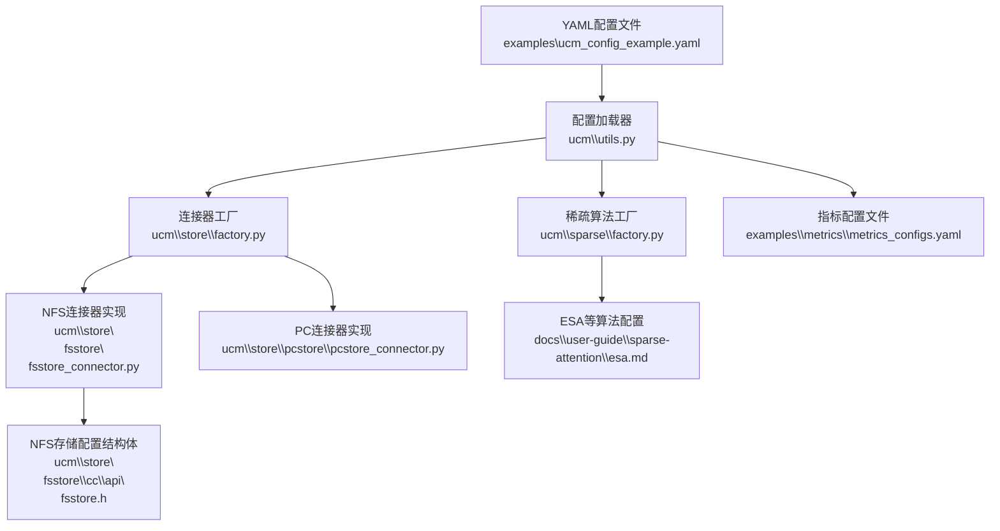
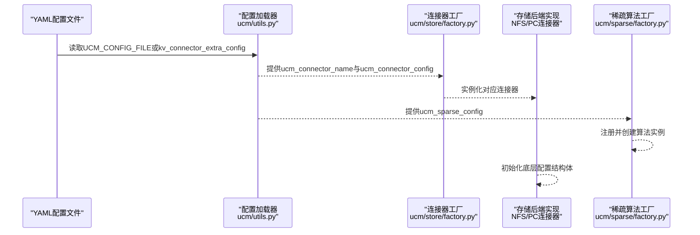
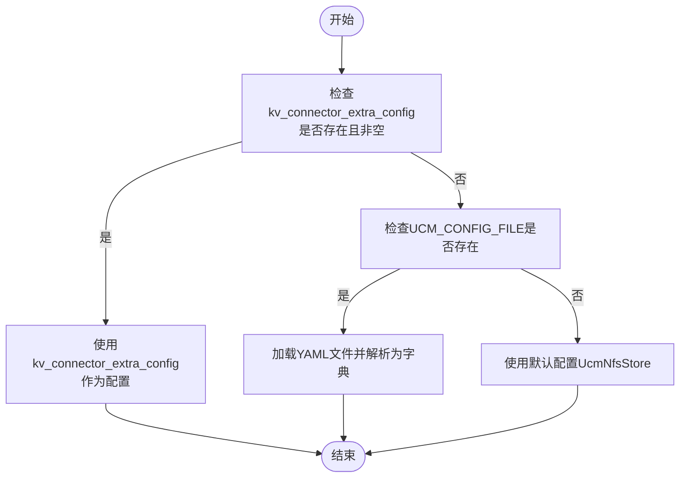
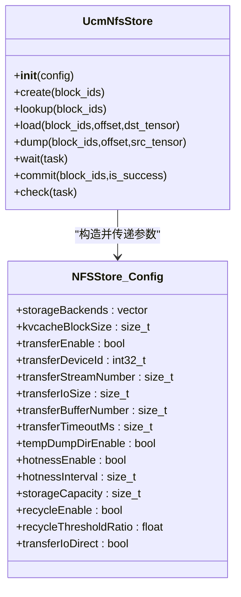
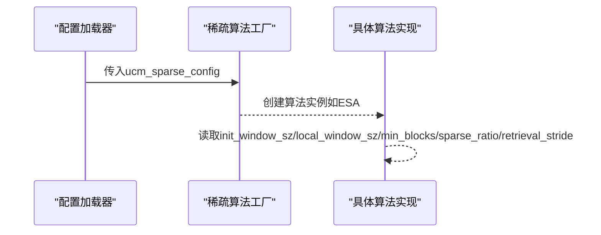
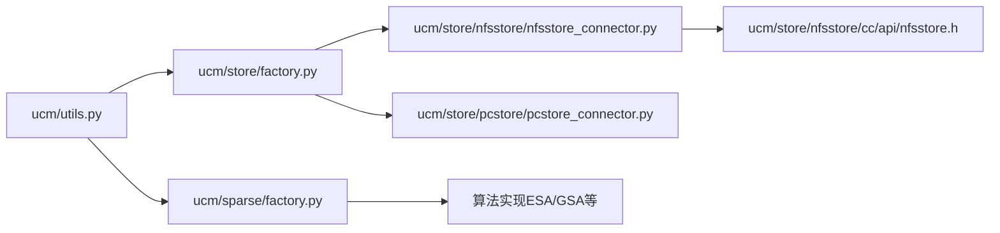

# 配置管理

<cite>
**本文引用的文件**
- [examples\ucm_config_example.yaml](file://examples\ucm_config_example.yaml)
- [examples\metrics\metrics_configs.yaml](file://examples\metrics\metrics_configs.yaml)
- [ucm\utils.py](file://ucm\utils.py)
- [ucm\store\factory.py](file://ucm\store\factory.py)
- [ucm\store\factory_v1.py](file://ucm\store\factory_v1.py)
- [ucm\store\nfsstore\nfsstore_connector.py](file://ucm\store\nfsstore\nfsstore_connector.py)
- [ucm\store\nfsstore\cc\api\nfsstore.h](file://ucm\store\nfsstore\cc\api\nfsstore.h)
- [ucm\store\pcstore\pcstore_connector.py](file://ucm\store\pcstore\pcstore_connector.py)
- [ucm\store\cache\cc\cache_store.cc](file://ucm\store\cache\cc\cache_store.cc)
- [ucm\sparse\factory.py](file://ucm\sparse\factory.py)
- [docs\source\user-guide\sparse-attention\esa.md](file://docs\source\user-guide\sparse-attention\esa.md)
- [test\config.yaml](file://test\config.yaml)
- [docs\source\developer-guide\extending_store.md](file://docs\source\developer-guide\extending_store.md)
</cite>

## 目录
1. [简介](#简介)
2. [项目结构](#项目结构)
3. [核心组件](#核心组件)
4. [架构总览](#架构总览)
5. [详细组件分析](#详细组件分析)
6. [依赖关系分析](#依赖关系分析)
7. [性能考量](#性能考量)
8. [故障排查指南](#故障排查指南)
9. [结论](#结论)
10. [附录](#附录)

## 简介
本指南面向UCM（Unified Cache Management）配置管理，系统性讲解如何通过YAML配置文件完成全局参数、存储后端、稀疏注意力算法与性能调优的完整配置。内容涵盖：
- YAML配置文件的完整格式与字段含义
- 连接器（存储后端）配置选项与参数设置
- 稀疏算法配置与性能调优参数
- 不同使用场景的配置示例（基础部署、高性能、资源受限）
- 配置验证与错误诊断方法
- 配置优先级与覆盖机制
- 最佳实践与性能调优建议

## 项目结构
UCM配置主要由以下部分组成：
- 全局配置：通过YAML文件加载，支持从命令行或KV传输配置传入
- 存储后端：NFS、PC（PCIe）、Pipeline等连接器工厂注册与实例化
- 稀疏注意力：ESA、GSA、GSAOnDevice、KVStar、Blend等算法工厂注册
- 指标监控：Prometheus/Grafana指标配置文件
- 性能参数：IO大小、流数量、缓冲区数量、直写开关、容量回收阈值等

**图表来源**
- [examples\ucm_config_example.yaml](file://examples\ucm_config_example.yaml#L1-L39)
- [ucm\utils.py](file://ucm\utils.py#L34-L91)
- [ucm\store\factory.py](file://ucm\store\factory.py#L34-L70)
- [ucm\sparse\factory.py](file://ucm\sparse\factory.py#L38-L56)
- [ucm\store\nfsstore\nfsstore_connector.py](file://ucm\store\nfsstore\nfsstore_connector.py#L39-L71)
- [ucm\store\nfsstore\cc\api\nfsstore.h](file://ucm\store\nfsstore\cc\api\nfsstore.h#L34-L61)
- [docs\source\user-guide\sparse-attention\esa.md](file://docs\source\user-guide\sparse-attention\esa.md#L18-L42)
- [examples\metrics\metrics_configs.yaml](file://examples\metrics\metrics_configs.yaml#L1-L51)

**章节来源**
- [examples\ucm_config_example.yaml](file://examples\ucm_config_example.yaml#L1-L39)
- [ucm\utils.py](file://ucm\utils.py#L34-L91)

## 核心组件
- 配置加载器：负责从YAML文件或终端kv_connector_extra_config读取配置，提供默认值与日志输出
- 连接器工厂：注册并按名称创建存储后端（NFS、PC、Pipeline、Mooncake等）
- 存储后端实现：NFS/PC连接器将YAML参数映射到底层配置结构体并初始化
- 稀疏算法工厂：注册ESA、GSA、GSAOnDevice、KVStar、Blend等算法
- 指标配置：定义Prometheus直方图桶、计数器、仪表盘等

**章节来源**
- [ucm\utils.py](file://ucm\utils.py#L34-L91)
- [ucm\store\factory.py](file://ucm\store\factory.py#L34-L70)
- [ucm\store\factory_v1.py](file://ucm\store\factory_v1.py#L34-L65)
- [ucm\sparse\factory.py](file://ucm\sparse\factory.py#L38-L56)
- [examples\metrics\metrics_configs.yaml](file://examples\metrics\metrics_configs.yaml#L1-L51)

## 架构总览
下图展示从YAML配置到连接器与稀疏算法的装配流程。

**图表来源**
- [ucm\utils.py](file://ucm\utils.py#L63-L86)
- [ucm\store\factory.py](file://ucm\store\factory.py#L49-L57)
- [ucm\sparse\factory.py](file://ucm\sparse\factory.py#L38-L44)

## 详细组件分析

### YAML配置文件格式与字段说明
- 全局字段
  - ucm_connectors: 列表，每个元素包含
    - ucm_connector_name: 连接器名称（如“UcmNfsStore”、“UcmPcStore”、“UcmMooncakeStore”、“UcmPipelineStore”）
    - ucm_connector_config: 对应连接器的配置字典
  - metrics_config_path: 可选，Prometheus/Grafana指标配置路径
  - ucm_sparse_config: 可选，稀疏注意力算法配置字典
  - use_layerwise: 可选，是否启用逐层加载/保存
  - hit_ratio: 可选，命中率阈值

- 连接器配置（以NFS为例）
  - storage_backends: 存储后端路径列表（冒号分隔字符串）
  - kv_block_size: KV块大小（字节）
  - role: 角色（如“worker”）
  - device: 设备ID
  - io_size: IO大小（字节）
  - use_direct: 是否启用直接IO
  - stream_number: 并发流数量
  - buffer_number: 缓冲区数量
  - storage_capacity: 存储容量（可选）
  - recycle_enable/recycle_threshold_ratio: 回收策略开关与阈值（可选）

- 稀疏注意力配置（以ESA为例）
  - init_window_sz: 初始窗口大小
  - local_window_sz: 局部窗口大小
  - min_blocks: 最小块数
  - sparse_ratio: 稀疏比例
  - retrieval_stride: 检索步长

- 指标配置（Prometheus/Grafana）
  - log_interval: 日志间隔（秒）
  - multiproc_dir: 多进程目录
  - metric_prefix: 指标前缀
  - histogram: 直方图配置（名称、文档、桶）

**章节来源**
- [examples\ucm_config_example.yaml](file://examples\ucm_config_example.yaml#L10-L39)
- [ucm\store\nfsstore\nfsstore_connector.py](file://ucm\store\nfsstore\nfsstore_connector.py#L43-L66)
- [ucm\store\nfsstore\cc\api\nfsstore.h](file://ucm\store\nfsstore\cc\api\nfsstore.h#L34-L61)
- [docs\source\user-guide\sparse-attention\esa.md](file://docs\source\user-guide\sparse-attention\esa.md#L18-L42)
- [examples\metrics\metrics_configs.yaml](file://examples\metrics\metrics_configs.yaml#L1-L51)

### 配置加载与优先级
- 优先级顺序（从高到低）
  1) kv_connector_extra_config中的键值对（若非空）
  2) UCM_CONFIG_FILE指向的YAML文件
  3) 默认配置（回退到“UcmNfsStore”）
- 行为说明
  - 若未提供kv_connector_extra_config或其为空，则使用默认配置
  - 若提供UCM_CONFIG_FILE且文件存在，优先加载该文件
  - 否则使用kv_connector_extra_config作为最终配置

**图表来源**
- [ucm\utils.py](file://ucm\utils.py#L63-L86)

**章节来源**
- [ucm\utils.py](file://ucm\utils.py#L63-L86)

### 连接器配置与参数映射
- NFS连接器
  - 参数映射至NFSStore.Config结构体，包括存储后端列表、块大小、IO参数、热数据管理、容量回收等
  - 仅在role为“worker”时启用传输路径
- PC连接器
  - 参数映射至PcStore.Config结构体，包括唯一ID、设备ID、IO大小、流数量、缓冲区数量、本地rank大小、散射/聚集开关等

**图表来源**
- [ucm\store\nfsstore\nfsstore_connector.py](file://ucm\store\nfsstore\nfsstore_connector.py#L39-L71)
- [ucm\store\nfsstore\cc\api\nfsstore.h](file://ucm\store\nfsstore\cc\api\nfsstore.h#L34-L61)

**章节来源**
- [ucm\store\nfsstore\nfsstore_connector.py](file://ucm\store\nfsstore\nfsstore_connector.py#L39-L71)
- [ucm\store\nfsstore\cc\api\nfsstore.h](file://ucm\store\nfsstore\cc\api\nfsstore.h#L34-L61)

### 稀疏注意力算法配置
- 工厂注册
  - 支持ESA、GSAOnDevice、KVStarMultiStep、Blend等算法
- ESA配置项（示例）
  - init_window_sz、local_window_sz、min_blocks、sparse_ratio、retrieval_stride
- 使用方式
  - 在ucm_sparse_config中以字典形式提供算法名与参数

**图表来源**
- [ucm\sparse\factory.py](file://ucm\sparse\factory.py#L38-L56)
- [docs\source\user-guide\sparse-attention\esa.md](file://docs\source\user-guide\sparse-attention\esa.md#L18-L42)

**章节来源**
- [ucm\sparse\factory.py](file://ucm\sparse\factory.py#L38-L56)
- [docs\source\user-guide\sparse-attention\esa.md](file://docs\source\user-guide\sparse-attention\esa.md#L18-L42)

### 指标与监控配置
- Prometheus多进程目录、指标前缀、直方图桶等
- 可与Grafana联动展示加载/保存请求量、块数、耗时、速度及命中率等

**章节来源**
- [examples\metrics\metrics_configs.yaml](file://examples\metrics\metrics_configs.yaml#L1-L51)

### 扩展存储后端（开发者参考）
- 通过动态注册将自定义Store接入Pipeline
- 需要实现接口并暴露工厂函数，再在YAML中通过管道堆叠加载

**章节来源**
- [docs\source\developer-guide\extending_store.md](file://docs\source\developer-guide\extending_store.md#L244-L251)

## 依赖关系分析
- 组件耦合
  - 配置加载器与连接器工厂解耦，通过名称与字典参数装配
  - 存储后端实现依赖底层配置结构体，参数来源于YAML映射
  - 稀疏算法工厂独立于存储后端，通过配置字典驱动
- 外部依赖
  - YAML解析与日志记录
  - Prometheus指标导出（可选）

**图表来源**
- [ucm\utils.py](file://ucm\utils.py#L34-L91)
- [ucm\store\factory.py](file://ucm\store\factory.py#L34-L70)
- [ucm\sparse\factory.py](file://ucm\sparse\factory.py#L38-L56)
- [ucm\store\nfsstore\nfsstore_connector.py](file://ucm\store\nfsstore\nfsstore_connector.py#L39-L71)
- [ucm\store\nfsstore\cc\api\nfsstore.h](file://ucm\store\nfsstore\cc\api\nfsstore.h#L34-L61)

**章节来源**
- [ucm\store\factory.py](file://ucm\store\factory.py#L34-L70)
- [ucm\store\factory_v1.py](file://ucm\store\factory_v1.py#L34-L65)

## 性能考量
- IO与并发
  - io_size、stream_number、buffer_number直接影响吞吐与延迟
  - 增大stream_number与buffer_number可提升并发与带宽利用率，但需考虑内存占用
- 直接IO
  - use_direct减少内核页缓存开销，适合高吞吐场景
- 存储回收
  - storage_capacity与recycle_enable/recycle_threshold_ratio用于容量控制与回收策略
- 稀疏算法
  - sparse_ratio与retrieval_stride影响检索频率与命中率；合理设置可降低HBM压力
- 缓存与队列
  - CacheStore的buffer_number、等待/运行队列深度需满足工作负载峰值

**章节来源**
- [ucm\store\nfsstore\nfsstore_connector.py](file://ucm\store\nfsstore\nfsstore_connector.py#L48-L66)
- [ucm\store\nfsstore\cc\api\nfsstore.h](file://ucm\store\nfsstore\cc\api\nfsstore.h#L34-L61)
- [ucm\store\cache\cc\cache_store.cc](file://ucm\store\cache\cc\cache_store.cc#L70-L103)
- [docs\source\user-guide\sparse-attention\esa.md](file://docs\source\user-guide\sparse-attention\esa.md#L18-L42)

## 故障排查指南
- 配置文件不存在或格式错误
  - 现象：加载失败，返回空配置或报错
  - 排查：确认UCM_CONFIG_FILE路径正确，YAML语法无误
- 连接器名称不支持
  - 现象：抛出“不支持的连接器类型”
  - 排查：检查ucm_connector_name是否在工厂注册表中
- 初始化失败
  - 现象：连接器Setup返回非零错误码
  - 排查：核对storage_backends、kv_block_size、role与设备ID等参数
- 稀疏算法未注册
  - 现象：创建算法时报错
  - 排查：确认ucm_sparse_config中算法名拼写与工厂注册一致
- 指标未生效
  - 现象：Grafana无数据
  - 排查：确认metrics_config_path与log_interval、multiproc_dir配置正确

**章节来源**
- [ucm\utils.py](file://ucm\utils.py#L40-L61)
- [ucm\store\factory.py](file://ucm\store\factory.py#L50-L57)
- [ucm\store\nfsstore\nfsstore_connector.py](file://ucm\store\nfsstore\nfsstore_connector.py#L67-L71)
- [ucm\sparse\factory.py](file://ucm\sparse\factory.py#L38-L42)
- [examples\metrics\metrics_configs.yaml](file://examples\metrics\metrics_configs.yaml#L1-L51)

## 结论
通过YAML配置文件，UCM实现了对存储后端、稀疏注意力算法与性能参数的统一管理。遵循本文的优先级规则与最佳实践，可在不同场景下获得稳定且高效的运行表现。建议在生产环境中结合指标监控持续优化参数，并通过扩展机制接入新的存储后端与算法。

## 附录

### 使用场景与配置示例
- 基础部署
  - 选择“UcmNfsStore”，设置storage_backends与kv_block_size，role为“worker”时启用传输参数
  - 示例参考：[examples\ucm_config_example.yaml](file://examples\ucm_config_example.yaml#L10-L16)
- 高性能配置
  - 提升io_size、stream_number、buffer_number；开启use_direct；合理设置recycle_threshold_ratio
  - 参考参数位置：[ucm\store\nfsstore\nfsstore_connector.py](file://ucm\store\nfsstore\nfsstore_connector.py#L52-L56)
- 资源受限环境
  - 降低stream_number与buffer_number；关闭recycle或提高阈值；谨慎使用use_direct
  - 参考参数位置：[ucm\store\nfsstore\cc\api\nfsstore.h](file://ucm\store\nfsstore\cc\api\nfsstore.h#L51-L61)

### 配置验证清单
- YAML语法：使用YAML安全解析器校验
- 字段完整性：确保ucm_connector_name、ucm_connector_config存在
- 参数范围：核对数值型参数边界（如buffer_number、queue depth）
- 算法配置：ucm_sparse_config中算法名与参数齐全
- 指标配置：metrics_config_path有效且目录可写

**章节来源**
- [ucm\utils.py](file://ucm\utils.py#L40-L61)
- [ucm\store\cache\cc\cache_store.cc](file://ucm\store\cache\cc\cache_store.cc#L70-L84)
- [examples\metrics\metrics_configs.yaml](file://examples\metrics\metrics_configs.yaml#L1-L51)