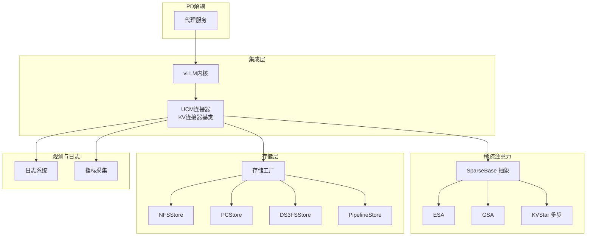
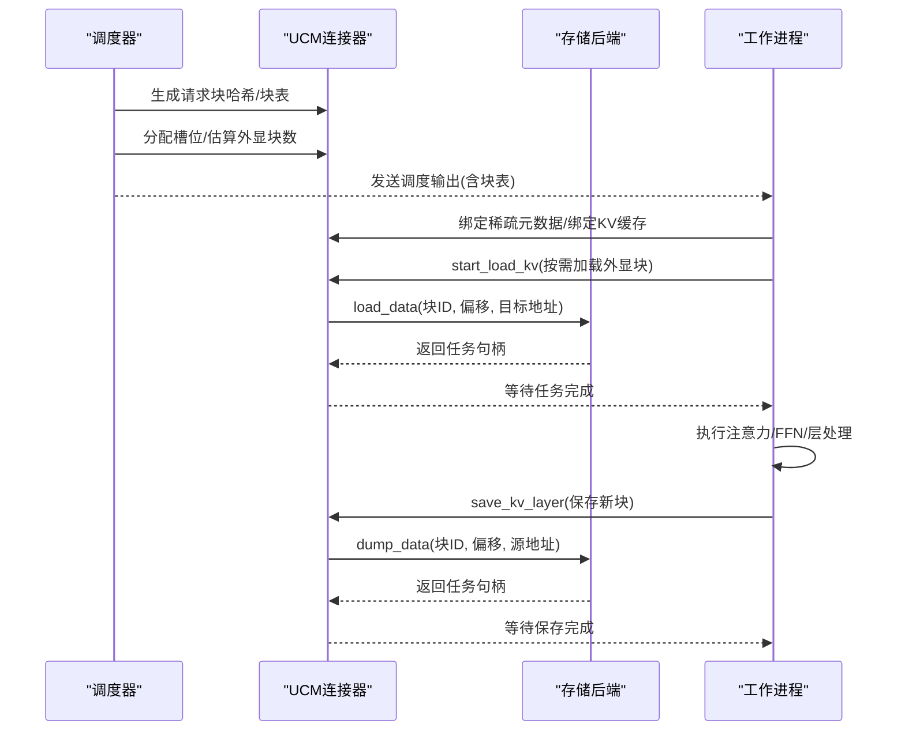
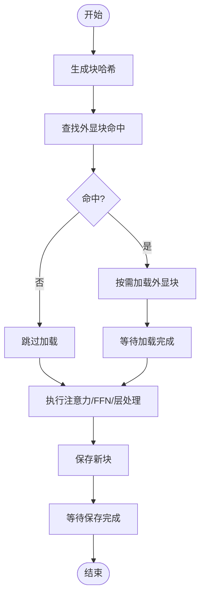
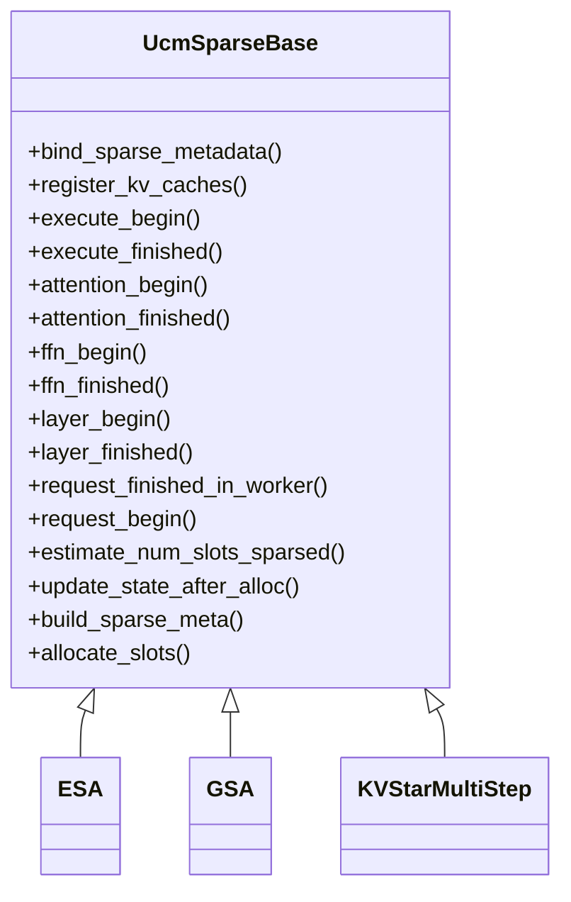
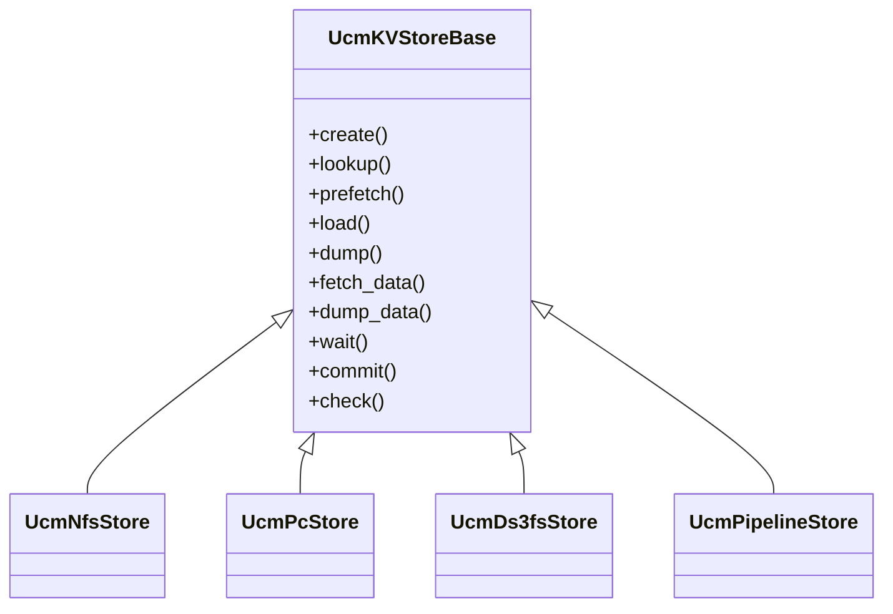
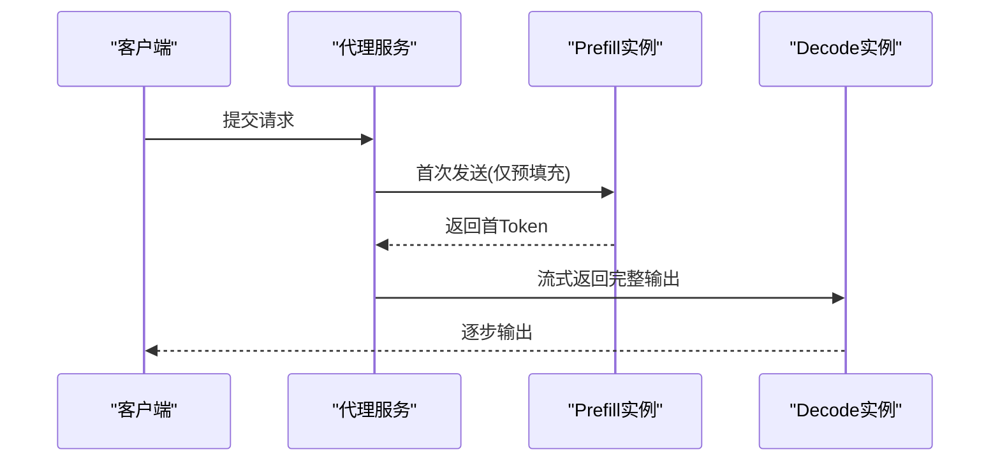
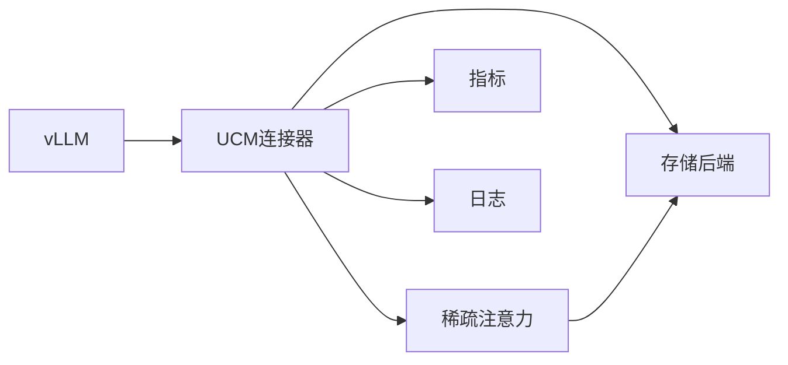

# 项目概述

<cite>
**本文档引用的文件**
- [README.md](file://README.md)
- [about.md](file://docs/source/about.md)
- [ucm/__init__.py](file://ucm/__init__.py)
- [ucm/utils.py](file://ucm/utils.py)
- [ucm/logger.py](file://ucm/logger.py)
- [ucm/integration/vllm/ucm_connector.py](file://ucm/integration/vllm/ucm_connector.py)
- [ucm/sparse/base.py](file://ucm/sparse/base.py)
- [ucm/sparse/esa/esa.py](file://ucm/sparse/esa/esa.py)
- [ucm/sparse/gsa/gsa.py](file://ucm/sparse/gsa/gsa.py)
- [ucm/sparse/kvstar/multistep.py](file://ucm/sparse/kvstar/multistep.py)
- [ucm/store/factory.py](file://ucm/store/factory.py)
- [ucm/store/nfsstore/nfsstore_connector.py](file://ucm/store/nfsstore/nfsstore_connector.py)
- [ucm/store/pcstore/pcstore_connector.py](file://ucm/store/pcstore/pcstore_connector.py)
- [ucm/pd/toy_proxy_server.py](file://ucm/pd/toy_proxy_server.py)
- [examples/ucm_config_example.yaml](file://examples/ucm_config_example.yaml)
</cite>

## 目录
1. [简介](#简介)
2. [项目结构](#项目结构)
3. [核心组件](#核心组件)
4. [架构总览](#架构总览)
5. [详细组件分析](#详细组件分析)
6. [依赖关系分析](#依赖关系分析)
7. [性能考量](#性能考量)
8. [故障排查指南](#故障排查指南)
9. [结论](#结论)
10. [附录](#附录)

## 简介
Unified Cache Management（UCM）是一个面向大语言模型（LLM）推理优化的统一缓存管理框架。其核心价值主张是：持久化KV缓存并借助多种检索机制替换冗余计算；不仅支持前缀缓存，还提供训练免费的稀疏注意力检索方法；通过存储-计算分离与异构PD解耦合，显著降低推理延迟，尤其在多轮对话与长上下文推理场景下可实现3-10倍的延迟降低。

UCM的关键技术决策包括：
- 基于vLLM扩展点的插件式稀疏注意力框架，统一调度器与工作进程的交互接口；
- 以“块级哈希”为索引标识，打通外部存储与KV缓存的映射，兼容前缀缓存与稀疏检索；
- 采用存储-计算分离的KV连接器抽象，屏蔽不同后端差异，支持NFS、PC等多样化存储；
- 提供前向解耦的PD（Prefill/Decode）解聚方案，便于异构资源编排与弹性扩展。

**章节来源**
- [README.md](file://README.md#L14-L22)
- [about.md](file://docs/source/about.md#L1-L9)

## 项目结构
仓库采用按功能域划分的模块化组织方式，核心目录与职责如下：
- ucm/integration/vllm：与vLLM的深度集成，提供KV连接器与观测指标；
- ucm/sparse：稀疏注意力算法集合（ESA、GSA、KVStar等），统一调度与执行钩子；
- ucm/store：存储抽象与多种后端实现（NFS、PC、DS3FS等），工厂模式注册与懒加载；
- ucm/pd：异构PD解耦合代理服务示例，演示Prefill/Decode分离；
- examples：配置样例与基准测试脚本；
- benchmarks：性能与轨迹回放评测工具；
- docs：用户与开发者文档。

**图表来源**
- [ucm/integration/vllm/ucm_connector.py](file://ucm/integration/vllm/ucm_connector.py#L82-L220)
- [ucm/sparse/base.py](file://ucm/sparse/base.py#L127-L323)
- [ucm/store/factory.py](file://ucm/store/factory.py#L34-L71)
- [ucm/store/nfsstore/nfsstore_connector.py](file://ucm/store/nfsstore/nfsstore_connector.py#L39-L132)
- [ucm/store/pcstore/pcstore_connector.py](file://ucm/store/pcstore/pcstore_connector.py#L39-L115)
- [ucm/pd/toy_proxy_server.py](file://ucm/pd/toy_proxy_server.py#L17-L95)

**章节来源**
- [README.md](file://README.md#L57-L66)
- [ucm/store/factory.py](file://ucm/store/factory.py#L34-L71)

## 核心组件
- 统一KV连接器（UCMConnector）
  - 在调度侧生成请求块哈希与块表，在工作侧根据元数据进行异步加载/保存，支持直接与逐层（layer-wise）两种流水线策略。
  - 关键能力：块哈希生成、查找命中统计、按需加载/保存、错误块追踪。
- 稀疏注意力框架（UcmSparseBase）
  - 定义调度侧与工作侧的钩子接口，覆盖execute/attention/ffn/layer生命周期，支持不同稀疏算法的统一接入。
- 存储工厂与后端（UcmKVStoreBase）
  - 工厂注册多种存储后端，按名称懒加载类，屏蔽设备与传输细节。
  - 后端提供分配、查找、预取、加载、保存、等待、提交等操作。
- 日志与配置（Logger/Config）
  - 从环境变量或YAML读取配置，初始化日志系统，支持运行期参数覆盖。
- PD解耦合代理（toy_proxy_server）
  - 演示Prefill/Decode分离与混合模式，便于部署与弹性扩缩容。

**章节来源**
- [ucm/integration/vllm/ucm_connector.py](file://ucm/integration/vllm/ucm_connector.py#L82-L220)
- [ucm/sparse/base.py](file://ucm/sparse/base.py#L127-L323)
- [ucm/store/factory.py](file://ucm/store/factory.py#L34-L71)
- [ucm/logger.py](file://ucm/logger.py#L40-L76)
- [ucm/utils.py](file://ucm/utils.py#L34-L91)
- [ucm/pd/toy_proxy_server.py](file://ucm/pd/toy_proxy_server.py#L17-L95)

## 架构总览
UCM围绕“统一KV连接器 + 稀疏注意力框架 + 存储抽象”的三层架构展开，结合vLLM的调度与执行流程，形成可插拔、可扩展的推理加速体系。

**图表来源**
- [ucm/integration/vllm/ucm_connector.py](file://ucm/integration/vllm/ucm_connector.py#L397-L447)
- [ucm/integration/vllm/ucm_connector.py](file://ucm/integration/vllm/ucm_connector.py#L488-L564)
- [ucm/integration/vllm/ucm_connector.py](file://ucm/integration/vllm/ucm_connector.py#L566-L644)

**章节来源**
- [README.md](file://README.md#L14-L22)
- [ucm/integration/vllm/ucm_connector.py](file://ucm/integration/vllm/ucm_connector.py#L82-L220)

## 详细组件分析

### 统一KV连接器（UCMConnector）
- 职责边界
  - 调度侧：生成块哈希、估算外显块数量、构建请求元数据、分配槽位。
  - 工作侧：绑定稀疏元数据、按层加载/保存KV块、统计命中率与吞吐。
- 关键流程
  - 哈希生成：基于请求元信息与块大小生成连续块ID，支持跨TP一致性。
  - 查找命中：对未命中的外显块发起lookup，统计命中比例。
  - 加载/保存：按块表批量发起异步任务，支持直接与逐层两种流水线。
  - 错误处理：记录加载失败的块ID，避免重复尝试。
- 配置与指标
  - 支持从YAML读取存储后端、指标配置路径等。
  - 可选Prometheus指标上报，包含加载/保存耗时、速率等。

**图表来源**
- [ucm/integration/vllm/ucm_connector.py](file://ucm/integration/vllm/ucm_connector.py#L167-L185)
- [ucm/integration/vllm/ucm_connector.py](file://ucm/integration/vllm/ucm_connector.py#L293-L348)
- [ucm/integration/vllm/ucm_connector.py](file://ucm/integration/vllm/ucm_connector.py#L488-L564)
- [ucm/integration/vllm/ucm_connector.py](file://ucm/integration/vllm/ucm_connector.py#L566-L644)

**章节来源**
- [ucm/integration/vllm/ucm_connector.py](file://ucm/integration/vllm/ucm_connector.py#L82-L220)
- [ucm/integration/vllm/ucm_connector.py](file://ucm/integration/vllm/ucm_connector.py#L293-L348)
- [ucm/integration/vllm/ucm_connector.py](file://ucm/integration/vllm/ucm_connector.py#L488-L564)
- [ucm/integration/vllm/ucm_connector.py](file://ucm/integration/vllm/ucm_connector.py#L566-L644)
- [examples/ucm_config_example.yaml](file://examples/ucm_config_example.yaml#L1-L39)

### 稀疏注意力框架（UcmSparseBase）
- 设计要点
  - 统一定义调度侧与工作侧钩子，覆盖execute/attention/ffn/layer等关键节点。
  - 通过元数据在调度侧绑定、在工作侧消费，实现稀疏块的动态加载与释放。
- 典型算法
  - ESA：基于块表示的检索，周期性选择TopK候选块加载，支持MLA/Dense双形态。
  - GSA：基于K预计算与Top-K的预取引擎，支持分段预填充阈值与预取长度控制。
  - KVStar：多步检索策略，结合初始化窗口与局部窗口，减少解码阶段全量加载。
- 状态管理
  - 请求生命周期内维护每层状态，按步长触发检索与加载，避免重复IO。

**图表来源**
- [ucm/sparse/base.py](file://ucm/sparse/base.py#L127-L323)
- [ucm/sparse/esa/esa.py](file://ucm/sparse/esa/esa.py#L421-L800)
- [ucm/sparse/gsa/gsa.py](file://ucm/sparse/gsa/gsa.py#L475-L1166)
- [ucm/sparse/kvstar/multistep.py](file://ucm/sparse/kvstar/multistep.py#L645-L937)

**章节来源**
- [ucm/sparse/base.py](file://ucm/sparse/base.py#L127-L323)
- [ucm/sparse/esa/esa.py](file://ucm/sparse/esa/esa.py#L421-L800)
- [ucm/sparse/gsa/gsa.py](file://ucm/sparse/gsa/gsa.py#L475-L1166)
- [ucm/sparse/kvstar/multistep.py](file://ucm/sparse/kvstar/multistep.py#L645-L937)

### 存储抽象与后端（NFS/PC/DS3FS/Pipeline）
- 存储工厂
  - 通过名称注册后端类，按需懒加载，确保配置灵活与扩展便利。
- 后端能力
  - 分配/查找/预取/加载/保存/等待/提交/检查等，统一任务接口Task。
- 典型后端
  - NFSStore：支持直通/缓冲/流数/本地rank等参数，适配多机共享存储。
  - PCStore：面向PCIe/高速互联的共享内存/散射聚合传输。
  - DS3FS/PIPE：分布式/管道化存储后端，满足更大规模部署需求。

**图表来源**
- [ucm/store/nfsstore/nfsstore_connector.py](file://ucm/store/nfsstore/nfsstore_connector.py#L39-L132)
- [ucm/store/pcstore/pcstore_connector.py](file://ucm/store/pcstore/pcstore_connector.py#L39-L115)
- [ucm/store/factory.py](file://ucm/store/factory.py#L34-L71)

**章节来源**
- [ucm/store/factory.py](file://ucm/store/factory.py#L34-L71)
- [ucm/store/nfsstore/nfsstore_connector.py](file://ucm/store/nfsstore/nfsstore_connector.py#L39-L132)
- [ucm/store/pcstore/pcstore_connector.py](file://ucm/store/pcstore/pcstore_connector.py#L39-L115)

### PD解耦合（Prefill/Decode分离）
- 目标
  - 将预填充（Prefill）与解码（Decode）阶段解耦到不同实例，提升资源利用率与弹性。
- 实现
  - 代理服务按轮询策略路由请求至Prefill/Decode实例，或在混合模式下直接转发。
  - 支持健康检查与实例状态上报，便于运维与扩缩容。

**图表来源**
- [ucm/pd/toy_proxy_server.py](file://ucm/pd/toy_proxy_server.py#L245-L278)

**章节来源**
- [ucm/pd/toy_proxy_server.py](file://ucm/pd/toy_proxy_server.py#L17-L95)
- [ucm/pd/toy_proxy_server.py](file://ucm/pd/toy_proxy_server.py#L245-L278)

## 依赖关系分析
- 组件耦合
  - UCM连接器依赖稀疏注意力框架与存储工厂，二者通过元数据与块ID解耦。
  - 稀疏算法依赖连接器提供的KV缓存指针与块表，实现按层异步加载。
  - 存储后端与设备驱动解耦，通过工厂与配置切换。
- 外部依赖
  - vLLM调度与执行框架、注意力后端、并行拓扑（TP/PP）。
  - Prometheus/Grafana指标系统（可选）。

**图表来源**
- [ucm/integration/vllm/ucm_connector.py](file://ucm/integration/vllm/ucm_connector.py#L82-L220)
- [ucm/sparse/base.py](file://ucm/sparse/base.py#L127-L323)
- [ucm/store/factory.py](file://ucm/store/factory.py#L34-L71)

**章节来源**
- [ucm/integration/vllm/ucm_connector.py](file://ucm/integration/vllm/ucm_connector.py#L82-L220)
- [ucm/sparse/base.py](file://ucm/sparse/base.py#L127-L323)
- [ucm/store/factory.py](file://ucm/store/factory.py#L34-L71)

## 性能考量
- 延迟优化
  - 通过前缀缓存与稀疏检索减少GPU内存占用与重复计算，显著降低解码延迟。
  - 层间流水线（layer-wise）与异步I/O配合，最大化利用存储带宽。
- 吞吐提升
  - 存储后端参数调优（直通、缓冲、流数、本地rank）影响吞吐与延迟权衡。
  - PD解耦合允许Prefill/Decode并行扩展，提高整体系统吞吐。
- 内存与能耗
  - 外显KV缓存离线存储，降低GPU显存压力，适合长序列与大批量推理。
- 可观测性
  - 指标采集与可视化有助于定位瓶颈与验证优化效果。

[本节为通用指导，无需特定文件引用]

## 故障排查指南
- 常见问题
  - 加载失败的块ID：连接器会记录并清空，避免重复重试；可通过日志查看具体请求与块ID。
  - 存储后端初始化失败：检查配置项（如唯一ID、设备号、IO大小、流数等）是否正确。
  - 稀疏算法不生效：确认请求长度与配置阈值，检查块哈希一致性（TP Rank差异处理）。
- 排查步骤
  - 启用指标与日志，观察加载/保存速率与命中率。
  - 对比不同存储后端与传输参数，定位瓶颈在CPU/GPU/网络/存储。
  - 使用toy_proxy_server验证Prefill/Decode分离部署的连通性与健康状态。

**章节来源**
- [ucm/integration/vllm/ucm_connector.py](file://ucm/integration/vllm/ucm_connector.py#L648-L658)
- [ucm/logger.py](file://ucm/logger.py#L40-L76)
- [ucm/store/nfsstore/nfsstore_connector.py](file://ucm/store/nfsstore/nfsstore_connector.py#L40-L71)
- [ucm/store/pcstore/pcstore_connector.py](file://ucm/store/pcstore/pcstore_connector.py#L40-L61)
- [ucm/pd/toy_proxy_server.py](file://ucm/pd/toy_proxy_server.py#L321-L335)

## 结论
UCM通过统一KV缓存与稀疏注意力检索，结合存储-计算分离与PD解耦合，为大模型长序列与多轮对话推理提供了高性价比、可扩展的基础设施。其插件式架构与可观测性设计，使得在不同硬件与部署环境下都能快速落地并获得显著的推理延迟收益。

[本节为总结性内容，无需特定文件引用]

## 附录
- 快速开始与配置参考
  - 参考示例配置文件了解存储后端、指标与稀疏算法参数设置。
- 文档与路线图
  - 官方文档与路线图入口位于README与docs目录。

**章节来源**
- [README.md](file://README.md#L69-L73)
- [examples/ucm_config_example.yaml](file://examples/ucm_config_example.yaml#L1-L39)